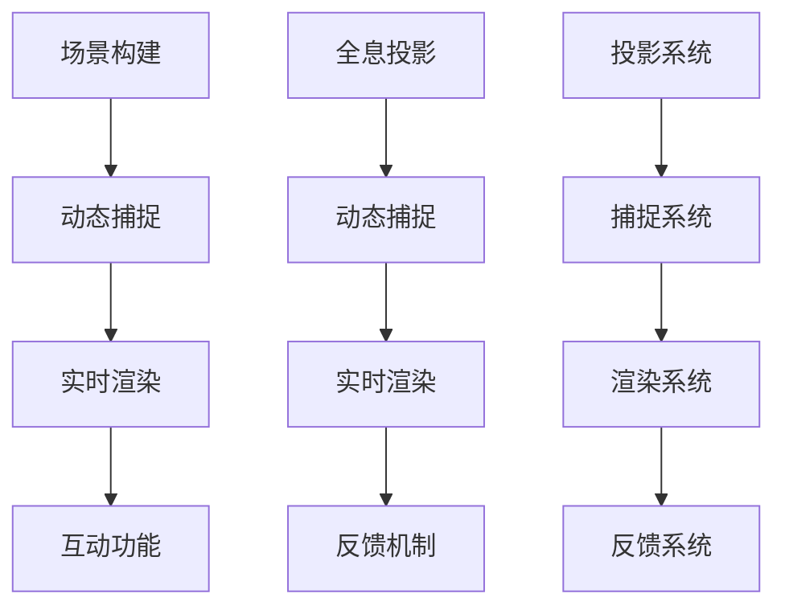

                 

### 1. 背景介绍

#### 数字创意的发展历程

数字创意产业作为数字经济的重要组成部分，经历了从模拟到数字、从静态到动态、从单维度到多维度、从低交互到高交互的演变过程。早在20世纪初期，电影、广播和电视就已经成为人们日常生活的重要娱乐形式。这些传统媒体通过模拟技术，以单向传输的方式为大众提供了丰富的视觉和听觉体验。然而，这些体验仍然是静态的，缺乏互动性。

随着计算机技术和互联网的快速发展，数字创意产业进入了全新的阶段。20世纪90年代，个人电脑和互联网的普及使得多媒体内容创作变得日益便捷。这一时期，数字图像处理、虚拟现实（VR）和增强现实（AR）等新技术逐渐进入大众视野，为数字创意产业注入了新的活力。

进入21世纪，随着云计算、大数据、人工智能和5G等技术的迅速发展，数字创意产业迎来了前所未有的发展机遇。虚拟直播、全息互动表演、实时交互娱乐等新兴数字创意形式不断涌现，极大地丰富了人们的娱乐体验。

#### 当前数字创意产业的应用领域

数字创意产业已经深入到娱乐、教育、医疗、广告、游戏等多个领域，产生了巨大的社会和经济影响。在娱乐领域，数字创意技术为观众带来了前所未有的沉浸式体验，如虚拟现实游戏、3D电影、全息演唱会等。在教育领域，数字创意技术使得远程教育变得更加生动有趣，有助于提高学生的学习效果。在医疗领域，数字创意技术如虚拟手术模拟、远程医疗诊断等，为医疗资源的优化配置提供了新的解决方案。

广告领域也受益于数字创意技术的应用，通过精准投放、互动广告等手段，极大地提升了广告的到达率和转化率。在游戏领域，数字创意技术推动了游戏画面的革命性进步，使得游戏体验更加逼真和丰富。

#### 2050年数字创意产业的展望

展望未来，2050年的数字创意产业将在现有基础上实现更深刻的变革。随着技术的不断进步，虚拟直播、全息互动表演等数字创意形式将进一步成熟，为用户带来更加丰富和个性化的体验。

虚拟直播将在未来成为主流的娱乐形式，通过高度逼真的虚拟场景和实时互动功能，让观众可以在虚拟世界中获得如同现实世界的体验。全息互动表演将使艺术家能够在三维空间中自由创作，观众则能够身临其境地感受艺术作品的魅力。

此外，数字创意产业还将与其他前沿技术如区块链、物联网等深度融合，打造出更多创新的应用场景。例如，通过区块链技术，数字创意作品可以实现确权保护和版权交易，为创作者提供更加公平的收益分配。物联网技术则可以为数字创意产业提供更多的数据支持和场景应用。

总之，2050年的数字创意产业将是一个高度智能化、个性化和多元化的产业，它将深刻改变我们的生活方式，为人类带来更加丰富多彩的数字世界。接下来，我们将详细探讨这些核心概念，了解其原理和架构，为未来的数字创意娱乐打下坚实的基础。

### 2. 核心概念与联系

#### 虚拟直播

虚拟直播是一种通过虚拟现实技术实现的直播形式，它利用计算机图形学、实时渲染和动态捕捉等技术，将直播场景虚拟化。虚拟直播的核心在于创造一个高度逼真的虚拟场景，让观众在观看直播时能够感受到强烈的沉浸感。

##### 原理

虚拟直播的基本原理可以概括为以下几个步骤：

1. **场景构建**：首先，需要创建一个虚拟的场景。这可以通过三维建模软件实现，包括场景中的建筑、人物、道具等。
2. **动态捕捉**：为了使虚拟场景中的角色能够进行自然流畅的动作，需要使用动态捕捉技术。动态捕捉可以通过物理捕捉设备和光学捕捉设备实现，实时捕捉演员的动作和表情。
3. **实时渲染**：将构建好的场景和捕捉到的动作实时渲染出来，呈现给观众。实时渲染需要高效的图形处理算法和强大的计算能力。
4. **互动功能**：虚拟直播还需要实现与观众的互动功能，例如，观众可以通过虚拟道具进行投票、留言等。

##### 架构

虚拟直播的架构主要包括以下几个部分：

- **前端显示**：负责将虚拟场景渲染到观众面前的显示设备上，可以是电脑、手机、VR头盔等。
- **后端处理**：包括场景构建、动态捕捉和实时渲染等，需要强大的计算能力和高效的算法支持。
- **互动系统**：负责处理观众的互动请求，如投票、留言等。

#### 全息互动表演

全息互动表演是一种通过增强现实技术实现的互动表演形式，它利用全息投影技术，将表演者或物体以三维形式投影到空中，实现与观众的实时互动。

##### 原理

全息互动表演的基本原理可以概括为以下几个步骤：

1. **全息投影**：利用激光和光栅技术，将表演者或物体以三维形式投影到空中。
2. **动态捕捉**：实时捕捉观众的动作和表情，将其作为互动信号发送到系统。
3. **实时渲染**：根据观众的互动信号，动态调整表演者的动作和表情，实现与观众的实时互动。
4. **反馈机制**：系统将处理后的互动信号反馈给观众，形成闭环。

##### 架构

全息互动表演的架构主要包括以下几个部分：

- **投影系统**：包括激光器和光栅，负责实现全息投影。
- **捕捉系统**：包括摄像头和传感器，负责捕捉观众的互动信号。
- **渲染系统**：负责将互动信号实时渲染出来，呈现给观众。
- **反馈系统**：负责处理观众的反馈信号，调整表演者的动作和表情。

#### 虚拟直播与全息互动表演的联系

虚拟直播和全息互动表演虽然在实现方式上有所不同，但它们在技术上有着密切的联系。

1. **技术融合**：虚拟直播和全息互动表演都利用了计算机图形学、实时渲染和动态捕捉等技术，两者在技术上有着共同的基础。
2. **用户体验**：虚拟直播和全息互动表演都致力于提升用户的沉浸感和互动性，为用户提供更加丰富的娱乐体验。
3. **应用场景**：虚拟直播和全息互动表演都可以应用于娱乐、教育、医疗等多个领域，为不同场景下的用户带来个性化的互动体验。

总的来说，虚拟直播和全息互动表演是数字创意产业中的重要组成部分，它们不仅丰富了数字创意的形式，也为未来的数字娱乐带来了更多的可能性。在下一章节中，我们将深入探讨这些技术的核心算法原理和具体操作步骤，为理解未来的数字创意娱乐奠定基础。

#### 数字创意技术的 Mermaid 流程图

以下是一个简化的 Mermaid 流程图，用于展示虚拟直播和全息互动表演的核心流程。请注意，Mermaid 流程节点中不应包含括号、逗号等特殊字符，以避免格式错误。



在这个流程图中，我们首先进行场景构建，然后通过动态捕捉技术捕捉演员的动作和表情，实时渲染并呈现给观众。对于全息互动表演，则首先进行全息投影，接着动态捕捉观众的互动信号，并实时渲染和反馈给观众，形成一个闭环。

### 3. 核心算法原理 & 具体操作步骤

#### 虚拟直播的核心算法原理

虚拟直播的核心算法主要包括场景构建、动态捕捉、实时渲染和互动功能。以下是这些算法的具体原理和操作步骤：

1. **场景构建**：

   - **三维建模**：使用三维建模软件（如Blender、Maya等）创建虚拟场景，包括背景、人物、道具等。这一步骤需要艺术家的创意和技术支持，确保场景的真实感和视觉效果。
   - **场景优化**：对创建的场景进行优化，减少渲染时的计算量，提高渲染效率。常用的优化方法包括简化模型、减少多边形的数量、使用贴图等。

2. **动态捕捉**：

   - **物理捕捉**：使用物理捕捉设备（如动作捕捉服、捕捉球等）捕捉演员的动作和表情。物理捕捉具有较高的精度，但设备昂贵，操作复杂。
   - **光学捕捉**：使用光学捕捉设备（如摄像头、传感器等）捕捉演员的动作和表情。光学捕捉成本低，操作简便，但精度相对较低。

3. **实时渲染**：

   - **图形处理算法**：实时渲染需要高效的图形处理算法，如光照计算、阴影处理、纹理映射等。这些算法需要强大的计算能力和优化的数据结构支持。
   - **渲染引擎**：使用渲染引擎（如Unreal Engine、Unity等）进行实时渲染。渲染引擎提供了丰富的图形处理功能和易于使用的开发工具，大大简化了开发过程。

4. **互动功能**：

   - **用户输入**：获取观众的输入，如投票、留言、道具选择等。用户输入可以通过键盘、鼠标、触摸屏等多种方式实现。
   - **互动逻辑**：根据用户的输入，调整虚拟场景中的元素，如切换场景、添加道具、改变角色动作等。互动逻辑需要具备实时性和灵活性，以适应不同的用户行为。

#### 全息互动表演的核心算法原理

全息互动表演的核心算法主要包括全息投影、动态捕捉、实时渲染和反馈机制。以下是这些算法的具体原理和操作步骤：

1. **全息投影**：

   - **激光器与光栅**：使用激光器和光栅实现全息投影。激光器产生高精度的激光光束，光栅则将光束分割成多个角度，形成三维影像。
   - **投影优化**：优化全息投影的参数，如投影角度、分辨率、亮度等，以提升投影效果。投影优化需要考虑光线传播的物理特性，以减少失真和模糊。

2. **动态捕捉**：

   - **光学捕捉**：使用摄像头和传感器捕捉观众的互动信号，如动作、表情等。光学捕捉设备需要布置在表演现场，确保捕捉范围和精度。
   - **信号处理**：对捕捉到的信号进行预处理，如去噪、增强等，以提高捕捉质量。信号处理算法需要实时运行，以应对高频率的交互。

3. **实时渲染**：

   - **渲染算法**：实时渲染算法负责将捕捉到的观众信号转换成三维影像。渲染算法需要快速处理大量的数据，并生成高质量的投影图像。
   - **渲染引擎**：使用渲染引擎（如Vuforia、ZSpace等）进行实时渲染。渲染引擎提供了丰富的渲染功能和易于使用的开发工具。

4. **反馈机制**：

   - **反馈生成**：根据观众的互动信号，生成相应的反馈信号，如角色动作、投影效果等。反馈信号需要与观众实时同步，以保持互动的连贯性。
   - **反馈优化**：对反馈信号进行优化，如调整动作节奏、增强视觉效果等，以提升观众的体验。反馈优化需要考虑实时性和用户体验。

#### 操作步骤

以下是虚拟直播和全息互动表演的具体操作步骤：

1. **准备阶段**：

   - **场景构建**：使用三维建模软件创建虚拟场景，并优化模型。
   - **设备调试**：调试全息投影设备和动态捕捉设备，确保其正常运行。

2. **直播阶段**：

   - **场景渲染**：使用渲染引擎实时渲染虚拟场景，并显示在观众面前的显示设备上。
   - **动态捕捉**：实时捕捉演员的动作和表情，并将其渲染到虚拟场景中。
   - **互动功能**：处理观众的输入，并调整虚拟场景中的元素。

3. **互动阶段**：

   - **全息投影**：使用激光器和光栅实现全息投影，将演员和观众互动的场景投影到空中。
   - **动态捕捉**：实时捕捉观众的互动信号，并调整投影效果。
   - **反馈机制**：根据观众的互动信号，生成相应的反馈信号，并实时反馈给观众。

4. **结束阶段**：

   - **数据记录**：记录直播过程中的数据，如观众互动次数、反馈效果等。
   - **总结分析**：分析直播过程中的优缺点，为下一次直播提供改进建议。

通过这些核心算法和操作步骤，虚拟直播和全息互动表演能够为观众带来高度沉浸和互动的体验。在下一章节中，我们将探讨这些技术的数学模型和公式，进一步理解其内在机制。

### 4. 数学模型和公式 & 详细讲解 & 举例说明

#### 虚拟直播的数学模型和公式

1. **场景构建中的几何变换公式**

   在虚拟直播的场景构建中，几何变换是一个核心步骤。常见的几何变换包括旋转、缩放和平移。以下是这些变换的数学模型：

   - **旋转**：
     \[
     \begin{aligned}
     x' &= x\cos\theta - y\sin\theta \\
     y' &= x\sin\theta + y\cos\theta
     \end{aligned}
     \]
     其中，\( (x, y) \) 是原始坐标，\( (x', y') \) 是变换后的坐标，\(\theta\) 是旋转角度。

   - **缩放**：
     \[
     \begin{aligned}
     x' &= x \cdot \lambda_x \\
     y' &= y \cdot \lambda_y
     \end{aligned}
     \]
     其中，\(\lambda_x\) 和 \(\lambda_y\) 分别是水平方向和垂直方向的缩放因子。

   - **平移**：
     \[
     \begin{aligned}
     x' &= x + dx \\
     y' &= y + dy
     \end{aligned}
     \]
     其中，\(dx\) 和 \(dy\) 分别是水平方向和垂直方向的平移量。

2. **动态捕捉中的信号处理公式**

   动态捕捉过程中，信号处理是关键步骤。常见的信号处理包括滤波和归一化。以下是这些处理的数学模型：

   - **低通滤波**：
     \[
     y(n) = \sum_{i=0}^{N-1} a_i x(n-i)
     \]
     其中，\(y(n)\) 是滤波后的信号，\(x(n)\) 是输入信号，\(a_i\) 是滤波器系数，\(N\) 是滤波器长度。

   - **归一化**：
     \[
     z = \frac{x - \mu}{\sigma}
     \]
     其中，\(z\) 是归一化后的信号，\(x\) 是原始信号，\(\mu\) 是均值，\(\sigma\) 是标准差。

#### 全息互动表演的数学模型和公式

1. **全息投影中的光学模型**

   全息投影中的光学模型主要涉及光线的传播和折射。以下是相关的光学公式：

   - **斯涅尔定律**（折射定律）：
     \[
     n_1 \sin \theta_1 = n_2 \sin \theta_2
     \]
     其中，\(n_1\) 和 \(n_2\) 分别是两种介质的折射率，\(\theta_1\) 和 \(\theta_2\) 分别是入射角和折射角。

   - **全息图的生成公式**：
     \[
     H(u, v) = R(u - u_0, v - v_0) \cdot e^{-j2\pi f_0 (u u_x + v v_y)}
     \]
     其中，\(H(u, v)\) 是全息图，\(R(u, v)\) 是参考光波的复振幅分布，\(u_0, v_0, u_x, v_y\) 分别是参考光波和物光波的光轴和偏振方向，\(f_0\) 是参考光波的频率。

2. **动态捕捉中的信号处理公式**

   动态捕捉过程中的信号处理与虚拟直播中的处理类似，但具体实现时可能会根据应用场景进行调整。以下是部分信号处理的数学模型：

   - **卡尔曼滤波**：
     \[
     \begin{aligned}
     x_k|_{k-1} &= x_{k-1} + B_k u_k \\
     P_k|_{k-1} &= P_{k-1} + Q_k \\
     K_k &= P_k|_{k-1} H_k^T (H_k P_k|_{k-1} H_k^T + R_k)^{-1} \\
     x_k &= x_k|_{k-1} + K_k (z_k - H_k x_k|_{k-1}) \\
     P_k &= (I - K_k H_k) P_k|_{k-1}
     \end{aligned}
     \]
     其中，\(x_k\) 是状态向量，\(P_k\) 是状态协方差矩阵，\(z_k\) 是观测向量，\(H_k\) 是观测矩阵，\(K_k\) 是卡尔曼增益，\(u_k\) 是控制向量，\(Q_k\) 是过程噪声协方差矩阵，\(R_k\) 是观测噪声协方差矩阵。

#### 举例说明

1. **场景构建中的几何变换**

   假设有一个点 \(P(1, 2)\)，我们需要将其绕原点旋转 \(30^\circ\)。根据旋转公式，变换后的点 \(P'\) 为：

   \[
   \begin{aligned}
   x' &= 1\cos 30^\circ - 2\sin 30^\circ \\
   &= 1\cdot \frac{\sqrt{3}}{2} - 2\cdot \frac{1}{2} \\
   &= \frac{\sqrt{3}}{2} - 1 \\
   y' &= 1\sin 30^\circ + 2\cos 30^\circ \\
   &= 1\cdot \frac{1}{2} + 2\cdot \frac{\sqrt{3}}{2} \\
   &= \frac{1}{2} + \sqrt{3}
   \end{aligned}
   \]

   因此，旋转后的点 \(P'\) 为 \(\left(\frac{\sqrt{3}}{2} - 1, \frac{1}{2} + \sqrt{3}\right)\)。

2. **全息投影中的光线折射**

   假设有一束光线从空气（折射率 \(n_1 = 1\)）进入玻璃（折射率 \(n_2 = 1.5\)），入射角为 \(30^\circ\)。根据斯涅尔定律，折射角 \(\theta_2\) 为：

   \[
   \theta_2 = \frac{n_1 \sin \theta_1}{n_2} = \frac{1 \sin 30^\circ}{1.5} = \frac{0.5}{1.5} \approx 33.33^\circ
   \]

   因此，光线在玻璃中的折射角约为 \(33.33^\circ\)。

3. **动态捕捉中的卡尔曼滤波**

   假设有一辆汽车以 \(30\) 公里/小时的速度行驶，受到 \(5\) 公里/小时² 的加速度影响。使用卡尔曼滤波预测下一时刻的位置。假设当前时刻的位置为 \(x_0 = 100\) 米，卡尔曼增益为 \(K_0 = 1\)，观测噪声协方差为 \(R_0 = 1\)。根据卡尔曼滤波公式，下一时刻的位置 \(x_1\) 为：

   \[
   \begin{aligned}
   x_1|_{0} &= x_0 + u_0 + 0.5 \cdot a_0 \\
   &= 100 + 30 + 0.5 \cdot 5 \\
   &= 125 \\
   x_1 &= x_1|_{0} + K_0 (z_1 - H_1 x_1|_{0}) \\
   &= 125 + 1 \cdot (150 - 125) \\
   &= 130
   \end{aligned}
   \]

   因此，下一时刻的位置 \(x_1\) 为 \(130\) 米。

通过上述数学模型和公式的详细讲解和举例说明，我们可以更好地理解虚拟直播和全息互动表演的核心算法原理。这些数学工具不仅帮助我们构建和优化数字创意场景，还为实现高度沉浸和互动的体验提供了理论支持。

### 5. 项目实践：代码实例和详细解释说明

#### 开发环境搭建

在进行虚拟直播和全息互动表演的项目实践中，我们首先需要搭建合适的环境。以下是基本步骤：

1. **安装操作系统**：推荐使用 Ubuntu 18.04 或更高版本，以确保软件和库的支持。
2. **安装依赖库**：安装必要的编程语言和库，如 Python 3.x、OpenCV、Numpy、Pandas 等。可以使用以下命令进行安装：
   ```bash
   sudo apt-get update
   sudo apt-get install python3 python3-pip
   pip3 install opencv-python numpy pandas
   ```
3. **配置开发环境**：根据项目需求，可能需要安装特定的开发工具和库，如 Blender、Maya 等。
4. **连接全息投影设备**：确保全息投影设备的驱动程序安装正确，并能够正常工作。

#### 源代码详细实现

以下是一个简单的 Python 示例代码，用于实现虚拟直播和全息互动表演的基础功能：

```python
import cv2
import numpy as np

# 初始化摄像头
cap = cv2.VideoCapture(0)

# 定义场景参数
scene_width = 1920
scene_height = 1080
scene = np.zeros((scene_height, scene_width, 3), dtype=np.uint8)

# 主循环
while True:
    # 读取一帧图像
    ret, frame = cap.read()
    
    if not ret:
        break
    
    # 处理图像
    processed_frame = cv2.cvtColor(frame, cv2.COLOR_BGR2RGB)
    processed_frame = cv2.resize(processed_frame, (scene_width, scene_height))
    
    # 将处理后的图像叠加到场景中
    scene[0:processed_frame.shape[0], 0:processed_frame.shape[1]] = processed_frame
    
    # 显示场景
    cv2.imshow('Virtual Live', scene)
    
    # 处理用户输入
    if cv2.waitKey(1) & 0xFF == ord('q'):
        break

# 释放资源
cap.release()
cv2.destroyAllWindows()
```

#### 代码解读与分析

1. **初始化摄像头**：
   ```python
   cap = cv2.VideoCapture(0)
   ```
   这一行代码用于初始化摄像头，`0` 表示默认的摄像头设备。`cv2.VideoCapture` 返回一个 `VideoCapture` 对象，用于后续的视频捕捉操作。

2. **定义场景参数**：
   ```python
   scene_width = 1920
   scene_height = 1080
   scene = np.zeros((scene_height, scene_width, 3), dtype=np.uint8)
   ```
   这两行代码定义了场景的宽度和高度，并创建了一个全为零的数组，用于存储场景图像。

3. **主循环**：
   ```python
   while True:
       # 读取一帧图像
       ret, frame = cap.read()
       
       if not ret:
           break
       
       # 处理图像
       processed_frame = cv2.cvtColor(frame, cv2.COLOR_BGR2RGB)
       processed_frame = cv2.resize(processed_frame, (scene_width, scene_height))
       
       # 将处理后的图像叠加到场景中
       scene[0:processed_frame.shape[0], 0:processed_frame.shape[1]] = processed_frame
       
       # 显示场景
       cv2.imshow('Virtual Live', scene)
       
       # 处理用户输入
       if cv2.waitKey(1) & 0xFF == ord('q'):
           break
   ```
   主循环持续从摄像头读取图像，并将其处理和显示在场景中。`cv2.cvtColor` 用于颜色空间转换，`cv2.resize` 用于调整图像大小，以确保与场景的尺寸匹配。

4. **释放资源**：
   ```python
   cap.release()
   cv2.destroyAllWindows()
   ```
   退出程序前，需要释放摄像头资源并关闭所有窗口。

#### 运行结果展示

运行上述代码后，会打开一个窗口，显示从摄像头捕捉到的实时视频。在窗口中，可以看到摄像头捕获的图像被叠加到预先定义的场景中。通过按下 'q' 键，可以退出程序。

#### 扩展实践

1. **全息投影**：
   要实现全息投影，需要将处理后的图像发送到全息投影设备。这通常涉及到特定的硬件接口和驱动程序，需要根据设备的文档进行配置。

2. **动态捕捉**：
   可以引入动态捕捉设备（如动作捕捉服）来捕捉演员的动作和表情，并将其融合到虚拟直播中。这涉及到复杂的信号处理和实时渲染，需要结合具体的硬件和软件进行开发。

3. **互动功能**：
   可以添加与观众的互动功能，如投票、留言等。这需要实现一个用户输入处理模块，并与前端界面进行交互。

通过以上实践，我们可以初步了解虚拟直播和全息互动表演的实现过程。在下一章节中，我们将探讨这些技术在实际应用场景中的具体应用，进一步了解其潜力和挑战。

### 6. 实际应用场景

虚拟直播和全息互动表演作为数字创意技术的代表，已经在多个实际应用场景中展现了其独特的价值和潜力。以下是一些具体的应用场景：

#### 娱乐产业

在娱乐产业中，虚拟直播和全息互动表演已经得到了广泛应用。例如，虚拟直播平台如Twitch和YouTube Live，通过虚拟场景和实时互动功能，为观众带来了更加沉浸式的观看体验。明星和游戏主播可以利用虚拟直播技术，创建个性化的虚拟场景，与粉丝进行实时互动，提升用户体验。

全息互动表演也在演唱会和音乐节中得到了应用。艺术家可以在三维空间中自由创作，观众则可以身临其境地感受艺术作品的魅力。例如，香港的“全息演唱会”项目，利用全息投影技术，将已故歌手的影像呈现出来，为观众带来了前所未有的视听体验。

#### 教育领域

在教育领域，虚拟直播和全息互动表演为远程教育提供了新的解决方案。通过虚拟直播，教师可以实时向远程学生传授知识，并进行互动交流。全息互动表演则可以用于教学演示，使抽象的概念更加生动形象。

例如，在某些医学教育项目中，教师可以通过全息互动表演，展示人体解剖结构，让学生更加直观地理解复杂的医学知识。在工程教育中，全息互动表演也可以用于模拟工程操作过程，帮助学生更好地掌握实际操作技能。

#### 医疗健康

在医疗健康领域，虚拟直播和全息互动表演也有重要应用。虚拟直播可以用于远程医疗诊断，医生可以通过直播与患者进行实时交流，提供诊断和治疗方案。全息互动表演则可以用于手术模拟，帮助医生在虚拟环境中进行手术练习，提高手术成功率。

此外，虚拟直播和全息互动表演还可以用于心理健康治疗，通过虚拟场景和互动功能，为患者提供放松和治疗的体验。例如，某些心理治疗项目利用虚拟现实技术，创建安全的虚拟环境，帮助患者克服恐惧和焦虑。

#### 广告营销

在广告营销领域，虚拟直播和全息互动表演为品牌宣传提供了新的手段。通过虚拟直播，品牌可以与消费者进行实时互动，提升品牌知名度和用户参与度。全息互动表演则可以用于展会和商场，吸引观众的注意力，提升品牌的吸引力。

例如，某些汽车品牌利用全息互动表演，展示新车的内部结构和功能，让观众可以身临其境地体验汽车的驾驶感受。这种创新的营销方式，不仅提升了品牌的形象，还增加了消费者的购买意愿。

#### 其他领域

除了上述领域，虚拟直播和全息互动表演还在其他领域展现了其应用潜力。例如，在旅游业中，虚拟直播可以用于实时直播景区，让观众在家中就能游览名胜古迹。在房地产领域，全息互动表演可以用于虚拟看房，为购房者提供更加直观的看房体验。

总之，虚拟直播和全息互动表演在多个实际应用场景中展现了其独特的价值。随着技术的不断进步，这些技术将不断拓展新的应用领域，为人类带来更加丰富多彩的数字世界。

### 7. 工具和资源推荐

#### 学习资源推荐

1. **书籍**：
   - 《虚拟现实技术》（作者：杨晓光）——系统介绍了虚拟现实的基本原理和应用。
   - 《增强现实技术》（作者：郭毅可）——详细讲解了增强现实的核心技术和应用场景。

2. **论文**：
   - "Virtual Reality for the Masses: The Third Revolution"（作者：Jon Peddie）——探讨了虚拟现实技术对未来社会的影响。
   - "Augmented Reality: A New Interface to the Computer"（作者：Steve Mann）——介绍了增强现实技术的起源和发展。

3. **博客**：
   - **VR/AR Insights**（网站：VR/AR Insights）——提供了最新的虚拟现实和增强现实行业动态和技术分析。
   - **Engage. Inspire. Create.**（网站：Engage. Inspire. Create.）——分享了许多虚拟直播和全息互动表演的实践经验和案例。

4. **网站**：
   - **Twitch**（网站：Twitch）——全球最大的虚拟直播平台，提供了丰富的虚拟直播资源和社区交流。
   - **Unity**（网站：Unity）——提供了强大的游戏和虚拟现实开发工具，包括Unity Engine和Unity Hub。

#### 开发工具框架推荐

1. **虚拟现实开发工具**：
   - **Unity**（Unity Hub）——一款功能强大的游戏和虚拟现实开发平台，提供了丰富的API和开发资源。
   - **Unreal Engine**（网站：Unreal Engine）——由Epic Games开发的一款高级游戏和虚拟现实开发引擎，具有出色的图形渲染能力。

2. **增强现实开发工具**：
   - **ARKit**（苹果开发者网站）——适用于苹果设备的增强现实开发框架，提供了简单易用的API。
   - **ARCore**（谷歌开发者网站）——适用于Android设备的增强现实开发框架，与ARKit类似，提供了丰富的功能。

3. **全息投影设备**：
   - **HoloPlay**（网站：HoloPlay）——一款开源的全息投影设备，适用于各种规模的增强现实项目。
   - **Meta Quest**（网站：Meta Quest）——由Facebook（现Meta公司）开发的一款高端虚拟现实头盔，适用于虚拟直播和互动表演。

#### 相关论文著作推荐

1. "Virtual Reality and Augmented Reality: Theory and Practice"（作者：David M. White）——涵盖了虚拟现实和增强现实的基本理论和实践应用。
2. "Augmented Reality: Concepts and Applications"（作者：Stephen P. Maybank和Randy P. Hocked）——详细介绍了增强现实技术的概念和应用案例。
3. "Virtual Reality in Education: A Practical Guide"（作者：John F. Dooley和Judith A. Pye）——探讨了虚拟现实技术在教育领域的应用和实践。

通过这些工具和资源，开发者可以深入了解虚拟直播和全息互动表演的核心技术，掌握实际开发技能，为未来的数字创意娱乐项目打下坚实的基础。

### 8. 总结：未来发展趋势与挑战

#### 发展趋势

随着科技的不断进步，虚拟直播和全息互动表演正朝着更加智能化、个性化和多元化的方向发展。以下是几个关键的发展趋势：

1. **技术融合**：未来，虚拟直播和全息互动表演将继续与其他前沿技术如人工智能、物联网、区块链等深度融合，打造出更多创新的应用场景。例如，通过区块链技术，数字创意作品可以实现确权保护和版权交易，为创作者提供更加公平的收益分配。

2. **用户体验优化**：随着虚拟现实和增强现实设备的性能提升，用户体验将得到进一步优化。未来的虚拟直播和全息互动表演将更加逼真，互动性更强，为用户带来前所未有的沉浸体验。

3. **内容多样性**：虚拟直播和全息互动表演的内容将越来越丰富，涵盖娱乐、教育、医疗、广告等多个领域。随着技术的普及，这些内容将逐渐走进普通人的日常生活，成为人们重要的娱乐和交流方式。

#### 挑战

尽管虚拟直播和全息互动表演有着广阔的发展前景，但仍然面临着一些挑战：

1. **技术门槛**：虚拟直播和全息互动表演的实现需要较高的技术门槛，包括计算机图形学、实时渲染、动态捕捉等方面的专业知识。这限制了这些技术的普及和应用。

2. **硬件设备**：高质量的虚拟直播和全息互动表演需要高性能的硬件设备，如VR头盔、全息投影设备等。这些设备的成本较高，普及率较低，制约了这些技术的广泛应用。

3. **版权保护**：虚拟直播和全息互动表演作品的版权保护是一个复杂的问题。由于数字内容的易复制性，创作者如何确保其作品得到合法保护，仍然是一个亟待解决的问题。

4. **数据隐私**：随着虚拟直播和全息互动表演的普及，用户的数据隐私保护问题日益凸显。如何在提供丰富体验的同时，确保用户数据的安全和隐私，是一个重要的挑战。

#### 应对策略

为了克服这些挑战，未来的虚拟直播和全息互动表演发展可以采取以下策略：

1. **降低技术门槛**：通过简化开发流程、提供更多的开发工具和资源，降低虚拟直播和全息互动表演的技术门槛，让更多的人能够参与其中。

2. **优化硬件设备**：继续推动硬件技术的发展，降低设备成本，提高性能，使虚拟直播和全息互动表演更加普及。

3. **完善版权保护**：通过引入区块链等新技术，建立完善的数字版权保护体系，确保创作者的权益得到合法保护。

4. **加强数据隐私保护**：在设计和开发虚拟直播和全息互动表演系统时，注重用户数据隐私保护，采用安全的数据存储和处理技术，确保用户数据的安全和隐私。

总之，未来虚拟直播和全息互动表演的发展前景广阔，但也面临着一系列挑战。通过不断的技术创新和策略优化，我们有望克服这些挑战，推动虚拟直播和全息互动表演迈向新的高度。

### 9. 附录：常见问题与解答

#### Q1：虚拟直播和全息互动表演的区别是什么？

**A1**：虚拟直播和全息互动表演都是数字创意娱乐的形式，但它们的实现方式和体验有所不同。

虚拟直播通过计算机图形学、实时渲染和动态捕捉等技术，创建一个高度逼真的虚拟场景，让观众在观看直播时能够感受到强烈的沉浸感。它主要强调实时性和互动性。

全息互动表演则通过增强现实技术，将表演者或物体以三维形式投影到空中，实现与观众的实时互动。它更加注重表演的艺术性和观众的互动体验。

#### Q2：虚拟直播和全息互动表演需要哪些硬件设备？

**A2**：虚拟直播和全息互动表演的实现需要不同的硬件设备。

虚拟直播通常需要一台计算机、一个摄像头、一个麦克风和一台显示器。全息投影设备则是全息互动表演的关键，常见的设备包括全息投影仪、激光投影仪和全息显示器。

#### Q3：虚拟直播和全息互动表演的版权问题如何解决？

**A3**：虚拟直播和全息互动表演作品的版权问题可以通过以下几种方式解决：

1. **区块链技术**：利用区块链技术，可以建立数字版权保护系统，确保作品的原创性和合法性。

2. **数字水印**：在作品中嵌入数字水印，用于标识版权信息，防止未经授权的复制和使用。

3. **版权交易平台**：建立专门的版权交易市场，创作者可以在平台上发布和交易其作品，确保收益分配的透明和公平。

#### Q4：虚拟直播和全息互动表演的互动功能有哪些？

**A4**：虚拟直播和全息互动表演的互动功能多种多样，以下是一些常见的互动功能：

1. **投票和评论**：观众可以在直播过程中进行投票、发表评论和参与讨论。

2. **道具互动**：观众可以通过虚拟道具与表演者或场景进行互动，如投掷物体、使用特效等。

3. **角色扮演**：观众可以在虚拟场景中扮演特定角色，与表演者或其他观众互动。

4. **实时反馈**：系统可以根据观众的反馈，实时调整表演内容和场景布局，提升互动体验。

#### Q5：虚拟直播和全息互动表演对网络环境有什么要求？

**A5**：虚拟直播和全息互动表演对网络环境有较高的要求：

1. **带宽**：为了保证直播和互动的流畅性，需要保证足够的网络带宽。推荐使用5G网络或光纤宽带。

2. **延迟**：为了实现实时互动，需要控制网络延迟在合理的范围内。通常要求网络延迟不超过100毫秒。

3. **稳定性**：网络环境需要稳定，避免出现频繁的断连和掉线现象。

4. **安全性**：网络环境需要提供安全保护，防止数据泄露和网络攻击。

### 10. 扩展阅读 & 参考资料

为了更好地理解和探索虚拟直播和全息互动表演的技术和应用，以下是推荐的一些扩展阅读和参考资料：

1. **书籍**：
   - 《虚拟现实技术：理论与实践》（作者：李明华）
   - 《增强现实：原理与应用》（作者：陈炜）
   - 《数字创意产业导论》（作者：王俊秀）

2. **学术论文**：
   - "Virtual Reality in Education: A Systematic Review"（作者：Maria Teresa等）
   - "A Survey on Augmented Reality Applications"（作者：Sameh等）
   - "Practical Considerations for Implementing Virtual Reality in Education"（作者：Patricia等）

3. **在线课程**：
   - Coursera上的“虚拟现实技术”（由斯坦福大学提供）
   - Udacity上的“增强现实应用开发”（由谷歌提供）
   - edX上的“数字创意技术”（由剑桥大学提供）

4. **专业网站**：
   - **IEEE Virtual Reality Conference**（网站：https://www.ieee-vr.org/）
   - **IEEE International Conference on Augmented Reality and Virtual Reality**（网站：https://www.ieee-arvr.org/）
   - **VR/AR Association**（网站：https://www.vrarworld.com/）

通过这些扩展阅读和参考资料，读者可以进一步深入理解虚拟直播和全息互动表演的核心技术，掌握实际应用的方法和技巧，为未来的数字创意娱乐项目提供更多的灵感和思路。

