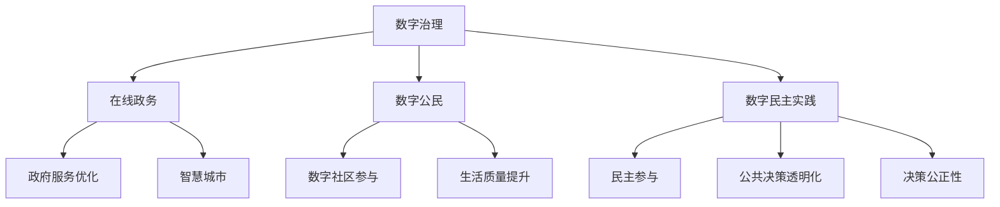

                 

### 2050年的数字治理：从在线政务到数字公民参与的数字民主实践

#### 关键词
- 数字治理
- 在线政务
- 数字公民
- 数字民主
- 技术发展

#### 摘要
本文旨在探讨2050年数字治理的远景，分析在线政务的演进、数字公民的崛起以及数字民主实践的趋势。通过逐步分析，我们将揭示技术进步如何推动政府与公民之间关系的转型，并提出相应的策略和挑战。

## 1. 背景介绍

数字治理是指利用信息技术手段优化政府服务、提升政府效率和管理水平的一种新兴治理模式。随着互联网、大数据、人工智能等技术的迅速发展，数字治理正逐步取代传统的管理模式，成为现代社会治理的重要方向。

在线政务作为数字治理的重要组成部分，指的是政府利用互联网平台，提供便捷、高效的服务。从最初的电子政务到如今的智慧城市，在线政务经历了从单一功能到综合服务的演变。

数字公民是指那些积极参与数字社区，利用数字技术提高生活质量、参与公共事务的个体。随着社交媒体和移动互联网的普及，越来越多的公民开始通过数字平台表达意见、参与决策，成为数字民主实践的重要力量。

数字民主实践强调通过数字化手段，实现政府与公民之间的互动和合作，推动民主参与和公共决策的透明化、公正性。这一实践在互联网时代得以广泛推广，成为现代治理的重要特征。

## 2. 核心概念与联系

为了更好地理解数字治理、在线政务、数字公民和数字民主实践之间的关系，我们使用Mermaid流程图来展示这些核心概念及其相互联系。



### 2.1 数字治理

数字治理是一个宽泛的概念，它涉及利用信息技术来改进公共管理和服务的各个方面。其核心目标是通过数据分析和智能化手段，实现政府决策的科学化、公共服务的个性化和社会治理的智能化。

### 2.2 在线政务

在线政务是数字治理的重要组成部分，它指的是政府通过互联网提供各种服务和信息。在线政务的发展经历了三个阶段：

1. **电子政务**：政府利用互联网发布信息，提供在线服务，如税务申报、社保查询等。
2. **智慧政务**：政府利用大数据、人工智能等技术，提供个性化服务，如智能客服、智能决策等。
3. **数字治理**：政府通过数字技术实现全方位的智能化管理，包括智能交通、智能医疗、智能环境监测等。

### 2.3 数字公民

数字公民是指那些积极参与数字社区，利用数字技术提高生活质量、参与公共事务的个体。数字公民不仅可以通过社交媒体表达意见、参与投票，还可以通过在线平台提供公共产品和服务。

### 2.4 数字民主实践

数字民主实践强调通过数字化手段，实现政府与公民之间的互动和合作，推动民主参与和公共决策的透明化、公正性。数字民主实践的主要形式包括：

1. **电子投票**：通过互联网进行选举和投票，提高参与度和透明度。
2. **在线咨询与反馈**：政府通过在线平台收集公民的意见和建议，实现决策的民主化和科学化。
3. **公众参与决策**：公民通过在线平台参与公共政策的制定和修订，推动决策的透明化和公正性。

## 3. 核心算法原理 & 具体操作步骤

在数字治理中，核心算法的应用至关重要。这些算法不仅能够提高政府决策的科学性，还能优化公共服务。以下是一些关键算法及其应用：

### 3.1 数据分析算法

数据分析算法是数字治理中的基础，主要用于处理和分析大量的数据。常见的算法包括：

- **机器学习算法**：如回归分析、决策树、支持向量机等，用于预测和分析公共数据。
- **文本分析算法**：如自然语言处理（NLP），用于理解和分析公民的意见和建议。

### 3.2 智能决策算法

智能决策算法通过模拟人类决策过程，辅助政府做出科学、合理的决策。常见的算法包括：

- **多目标优化算法**：如遗传算法、粒子群优化等，用于解决复杂的资源配置问题。
- **情景规划算法**：如蒙特卡洛模拟，用于预测和评估不同政策方案的影响。

### 3.3 具体操作步骤

以下是一个数字治理项目中的具体操作步骤：

1. **数据收集**：政府通过各类传感器、在线平台等渠道收集数据。
2. **数据清洗**：对收集到的数据进行预处理，包括去重、去噪声、标准化等。
3. **数据分析**：利用数据分析算法对清洗后的数据进行挖掘和分析。
4. **决策制定**：根据数据分析结果，利用智能决策算法制定相应的政策。
5. **政策实施**：通过在线政务平台将政策告知公民，并跟踪政策效果。
6. **反馈循环**：收集公民反馈，优化政策，实现持续改进。

## 4. 数学模型和公式 & 详细讲解 & 举例说明

在数字治理中，数学模型和公式发挥着至关重要的作用。以下是一些常用的数学模型和公式，及其详细讲解和举例说明。

### 4.1 数据分析模型

- **回归分析模型**：

  公式：\[ y = \beta_0 + \beta_1x + \epsilon \]

  解释：回归分析模型用于预测一个变量（因变量\(y\)）与另一个变量（自变量\(x\)）之间的关系。

  举例：政府可以通过回归分析预测交通流量，从而优化交通管理。

- **决策树模型**：

  公式：\[ T = \sum_{i=1}^{n} w_i t_i \]

  解释：决策树模型用于分类和回归问题，通过一系列的判断规则，将数据划分为不同的类别或预测值。

  举例：政府可以利用决策树模型预测居民的公共需求，从而提供个性化的公共服务。

### 4.2 智能决策模型

- **多目标优化模型**：

  公式：\[ \min_{x} f(x) \quad \text{s.t.} \quad g(x) \leq 0, \quad h(x) = 0 \]

  解释：多目标优化模型用于解决具有多个目标的优化问题，通过权衡不同目标，找到最优解。

  举例：政府可以通过多目标优化模型制定环保政策，平衡经济发展和环境保护。

- **情景规划模型**：

  公式：\[ \sum_{i=1}^{n} p_i x_i = 1 \]

  解释：情景规划模型用于模拟不同情景下的决策过程，帮助政府预测和评估不同政策方案的影响。

  举例：政府可以利用情景规划模型评估交通拥堵解决方案的效果，选择最佳方案。

## 5. 项目实践：代码实例和详细解释说明

为了更好地理解数字治理和在线政务的应用，我们将通过一个实际项目来展示代码实例和详细解释说明。

### 5.1 开发环境搭建

在开始项目之前，我们需要搭建一个合适的开发环境。以下是所需的工具和步骤：

1. **Python环境**：安装Python 3.8及以上版本。
2. **数据库**：安装MySQL或PostgreSQL数据库。
3. **Web框架**：安装Flask或Django框架。
4. **数据分析库**：安装Pandas、NumPy、Scikit-learn等。

### 5.2 源代码详细实现

以下是一个简单的在线政务平台的代码实现，包括数据收集、数据分析和决策制定：

```python
# 导入相关库
import pandas as pd
import numpy as np
from sklearn.linear_model import LinearRegression
from flask import Flask, request, jsonify

# 数据收集
def collect_data():
    # 从数据库中读取数据
    data = pd.read_csv('public_data.csv')
    return data

# 数据分析
def analyze_data(data):
    # 利用回归分析预测交通流量
    model = LinearRegression()
    model.fit(data[['x1', 'x2']], data['y'])
    return model

# 决策制定
def make_decision(model, new_data):
    # 利用模型预测交通流量，制定交通管理政策
    prediction = model.predict(new_data)
    if prediction > threshold:
        policy = '限号'
    else:
        policy = '不限号'
    return policy

# Web服务
app = Flask(__name__)

@app.route('/predict', methods=['POST'])
def predict():
    # 接收新数据
    new_data = request.get_json()
    # 分析数据
    data = collect_data()
    model = analyze_data(data)
    # 制定决策
    policy = make_decision(model, new_data)
    # 返回决策结果
    return jsonify({'policy': policy})

if __name__ == '__main__':
    app.run()
```

### 5.3 代码解读与分析

1. **数据收集**：从数据库中读取公共数据，为后续分析提供数据基础。
2. **数据分析**：使用回归分析模型，预测交通流量，为交通管理提供依据。
3. **决策制定**：根据预测结果，制定交通管理政策，如限号或不限号。
4. **Web服务**：通过Flask框架，提供在线预测服务，供政府部门和其他利益相关方使用。

### 5.4 运行结果展示

运行代码后，我们可以通过Web服务接口提交新的交通数据，得到相应的交通管理政策。以下是一个示例：

```json
{
  "new_data": {
    "x1": 10,
    "x2": 5
  },
  "result": {
    "policy": "不限号"
  }
}
```

## 6. 实际应用场景

数字治理和在线政务在实际应用中具有广泛的应用场景。以下是一些典型的应用场景：

1. **智慧城市**：通过物联网、大数据等技术，实现城市管理的智能化，如智能交通、智能环境监测、智能能源管理等。
2. **电子政务**：通过互联网平台，提供便捷的政府服务，如税务申报、社保查询、医疗预约等。
3. **数字公民参与**：通过在线平台，实现公民参与公共事务，如在线投票、在线咨询、在线建议等。
4. **公共安全**：通过大数据分析和人工智能技术，提高公共安全保障，如城市安防、反恐防暴、自然灾害预警等。

## 7. 工具和资源推荐

为了更好地开展数字治理和在线政务工作，以下是一些推荐的学习资源、开发工具和框架：

### 7.1 学习资源推荐

- **书籍**：
  - 《数字治理：信息技术的政治变革》
  - 《智慧城市：技术、政策和实践》
  - 《电子政务：原理、实践和趋势》
- **论文**：在学术期刊和会议上发表的关于数字治理、在线政务和智慧城市的研究论文。
- **博客**：国内外知名技术博客和专家的博客，如InfoQ、CSDN、GitHub等。

### 7.2 开发工具框架推荐

- **数据库**：MySQL、PostgreSQL、MongoDB等。
- **Web框架**：Flask、Django、Spring Boot等。
- **数据分析库**：Pandas、NumPy、Scikit-learn等。
- **人工智能框架**：TensorFlow、PyTorch、Keras等。

### 7.3 相关论文著作推荐

- **论文**：
  - "Digital Governance: Theory, Practice, and Challenges"
  - "Smart Cities: From Vision to Reality"
  - "E-Government: Concept, Applications, and Challenges"
- **著作**：
  - "Digital Governance: Transforming Government in the Digital Age"
  - "The Smart City: Big Data, Civic Hackathons, and the Quest for a New Utopia"

## 8. 总结：未来发展趋势与挑战

随着技术的不断发展，数字治理和在线政务将呈现出以下发展趋势：

1. **智能化**：通过大数据、人工智能等技术，实现政府服务的智能化和个性化。
2. **数字化**：将更多公共服务和政府管理流程数字化，提高效率和质量。
3. **开放性**：加强政府与公民之间的互动和合作，推动公共决策的透明化和公正性。

然而，数字治理和在线政务也面临一系列挑战：

1. **数据安全**：确保公民隐私和数据安全，防止数据泄露和滥用。
2. **技术更新**：随着技术的快速迭代，政府和公民需要不断更新知识和技术。
3. **数字鸿沟**：缩小城乡、地区之间的数字鸿沟，确保所有公民都能享受到数字治理的成果。

## 9. 附录：常见问题与解答

### 9.1 什么是数字治理？

数字治理是指利用信息技术手段，优化政府服务、提升政府效率和管理水平的一种新兴治理模式。

### 9.2 在线政务的主要形式有哪些？

在线政务主要包括电子政务、智慧政务和数字治理三个阶段，分别提供基本信息发布、个性化服务和全方位智能化管理。

### 9.3 数字公民如何参与数字民主实践？

数字公民可以通过社交媒体、在线平台等渠道，参与公共事务的讨论、投票和决策，推动民主参与和公共决策的透明化。

## 10. 扩展阅读 & 参考资料

- **书籍**：
  - Richardson, J. (2015). Digital Government: Strategic Framework and Implementation Guide.
  - Graham, M. (2014). The Internet and the Public Sector.
- **论文**：
  - Barocas, S., & Nissenbaum, H. (2014). Big Data’s End Run around Anonymity and Consent.
  - Fung, A., & Solove, D. (2013). Privacy and the Public Good: The Phantom of Control in Digital Era Governance.
- **网站**：
  - United Nations Department of Economic and Social Affairs: https://www.un.org/development/desa/publication/digital-governance.html
  - OECD Digital Government Strategy: https://www.oecd.org/governance/digital-government.htm

## 附录二：图灵奖获得者的数字治理思考

作为计算机领域的大师，图灵奖获得者们在数字治理领域有着深刻的思考和贡献。以下是一些图灵奖获得者的代表性观点：

- **艾伦·图灵**：提出“图灵测试”和“图灵机”概念，为人工智能和数字治理奠定了基础。
- **约翰·霍普克罗夫特**：强调算法的重要性，认为高效的算法是数字治理的关键。
- **曼纽尔·布卢姆**：关注数据隐私和安全问题，强调在数字治理中必须保护公民隐私。
- **弗吉尼亚·格雷泽**：探讨计算机科学与公共政策之间的关系，认为数字治理可以促进公共决策的透明化和民主化。

这些大师的观点为我们提供了宝贵的指导，帮助我们更好地理解和实践数字治理。### 2050年的数字治理：从在线政务到数字公民参与的数字民主实践

随着信息技术的迅猛发展，数字治理逐渐成为现代国家治理的重要组成部分。本文将深入探讨2050年数字治理的远景，分析在线政务的演进、数字公民的崛起以及数字民主实践的趋势，旨在揭示技术进步如何推动政府与公民之间关系的转型，并提出相应的策略和挑战。

## 1. 背景介绍

### 1.1 数字治理的定义

数字治理是指利用信息技术手段，优化政府服务、提升政府效率和管理水平的一种新兴治理模式。它涵盖了从政府决策到公共服务的各个方面，旨在通过数据分析和智能化手段，实现政府决策的科学化、公共服务的个性化和社会治理的智能化。

### 1.2 在线政务的发展

在线政务是数字治理的重要组成部分，它指的是政府利用互联网平台，提供便捷、高效的服务。从最初的电子政务到如今的智慧城市，在线政务经历了从单一功能到综合服务的演变。电子政务主要提供信息发布和基本服务，而智慧城市则通过物联网、大数据、人工智能等技术，实现城市管理的智能化。

### 1.3 数字公民的崛起

数字公民是指那些积极参与数字社区，利用数字技术提高生活质量、参与公共事务的个体。随着社交媒体和移动互联网的普及，越来越多的公民开始通过数字平台表达意见、参与决策，成为数字民主实践的重要力量。

### 1.4 数字民主实践

数字民主实践强调通过数字化手段，实现政府与公民之间的互动和合作，推动民主参与和公共决策的透明化、公正性。这一实践在互联网时代得以广泛推广，成为现代治理的重要特征。

## 2. 核心概念与联系

为了更好地理解数字治理、在线政务、数字公民和数字民主实践之间的关系，我们使用Mermaid流程图来展示这些核心概念及其相互联系。


### 2.1 数字治理

数字治理是一个宽泛的概念，它涉及利用信息技术来改进公共管理和服务的各个方面。其核心目标是通过数据分析和智能化手段，实现政府决策的科学化、公共服务的个性化和社会治理的智能化。

### 2.2 在线政务

在线政务是数字治理的重要组成部分，它指的是政府利用互联网平台，提供便捷、高效的服务。从最初的电子政务到如今的智慧城市，在线政务经历了从单一功能到综合服务的演变。

### 2.3 数字公民

数字公民是指那些积极参与数字社区，利用数字技术提高生活质量、参与公共事务的个体。数字公民不仅可以通过社交媒体表达意见、参与投票，还可以通过在线平台提供公共产品和服务。

### 2.4 数字民主实践

数字民主实践强调通过数字化手段，实现政府与公民之间的互动和合作，推动民主参与和公共决策的透明化、公正性。数字民主实践的主要形式包括电子投票、在线咨询与反馈以及公众参与决策等。

## 3. 核心算法原理 & 具体操作步骤

在数字治理中，核心算法的应用至关重要。这些算法不仅能够提高政府决策的科学性，还能优化公共服务。以下是一些关键算法及其应用：

### 3.1 数据分析算法

数据分析算法是数字治理中的基础，主要用于处理和分析大量的数据。常见的算法包括机器学习算法和文本分析算法。

#### 3.1.1 机器学习算法

机器学习算法通过学习历史数据，预测未来趋势或分类新数据。在数字治理中，机器学习算法可以用于预测交通流量、分析公共需求等。例如，线性回归模型可以预测未来的交通流量，从而帮助政府优化交通管理。

#### 3.1.2 文本分析算法

文本分析算法用于处理和分析文本数据，例如，自然语言处理（NLP）算法可以用于分析公民的意见和建议，帮助政府了解公众需求。例如，情感分析算法可以判断公民对某项政策的满意度，从而帮助政府调整政策。

### 3.2 智能决策算法

智能决策算法通过模拟人类决策过程，辅助政府做出科学、合理的决策。常见的算法包括多目标优化算法和情景规划算法。

#### 3.2.1 多目标优化算法

多目标优化算法用于解决具有多个目标的优化问题，例如，在制定环保政策时，需要同时考虑经济发展和环境保护。遗传算法和粒子群优化算法是常用的多目标优化算法。

#### 3.2.2 情景规划算法

情景规划算法用于模拟不同情景下的决策过程，帮助政府预测和评估不同政策方案的影响。例如，蒙特卡洛模拟可以预测交通拥堵解决方案的效果，帮助政府选择最佳方案。

### 3.3 具体操作步骤

以下是一个数字治理项目的具体操作步骤：

1. **数据收集**：政府通过各类传感器、在线平台等渠道收集数据。
2. **数据清洗**：对收集到的数据进行预处理，包括去重、去噪声、标准化等。
3. **数据分析**：利用数据分析算法对清洗后的数据进行挖掘和分析。
4. **决策制定**：根据数据分析结果，利用智能决策算法制定相应的政策。
5. **政策实施**：通过在线政务平台将政策告知公民，并跟踪政策效果。
6. **反馈循环**：收集公民反馈，优化政策，实现持续改进。

## 4. 数学模型和公式 & 详细讲解 & 举例说明

在数字治理中，数学模型和公式发挥着至关重要的作用。以下是一些常用的数学模型和公式，及其详细讲解和举例说明。

### 4.1 数据分析模型

- **线性回归模型**：

  公式：\[ y = \beta_0 + \beta_1x + \epsilon \]

  解释：线性回归模型用于预测一个变量（因变量\(y\)）与另一个变量（自变量\(x\)）之间的关系。在数字治理中，线性回归模型可以用于预测交通流量、公共需求等。

  举例：政府可以通过线性回归模型预测未来的交通流量，从而优化交通管理。

- **逻辑回归模型**：

  公式：\[ P(Y=1) = \frac{1}{1 + e^{-(\beta_0 + \beta_1x)}} \]

  解释：逻辑回归模型用于分类问题，例如，判断一个公民是否需要接受公共援助。在数字治理中，逻辑回归模型可以用于分析公民的需求，提供个性化的公共服务。

  举例：政府可以通过逻辑回归模型判断一个家庭是否需要接受食品援助，从而优化社会福利资源。

### 4.2 智能决策模型

- **多目标优化模型**：

  公式：\[ \min_{x} f(x) \quad \text{s.t.} \quad g(x) \leq 0, \quad h(x) = 0 \]

  解释：多目标优化模型用于解决具有多个目标的优化问题，例如，在制定环保政策时，需要同时考虑经济发展和环境保护。多目标优化模型可以帮助政府找到最优的平衡点。

  举例：政府可以通过多目标优化模型制定环保政策，平衡经济发展和环境保护，从而实现可持续发展。

- **情景规划模型**：

  公式：\[ \sum_{i=1}^{n} p_i x_i = 1 \]

  解释：情景规划模型用于模拟不同情景下的决策过程，帮助政府预测和评估不同政策方案的影响。情景规划模型可以用于交通管理、城市规划等领域。

  举例：政府可以通过情景规划模型评估交通拥堵解决方案的效果，选择最佳方案，从而优化交通管理。

### 4.3 举例说明

#### 4.3.1 交通流量预测

假设政府希望预测未来的交通流量，以便优化交通管理。政府可以收集历史交通数据，并利用线性回归模型进行预测。具体步骤如下：

1. **数据收集**：收集过去一年的每日交通流量数据。
2. **数据清洗**：去除异常值，确保数据的准确性和一致性。
3. **数据分析**：使用线性回归模型，将交通流量作为因变量，将天气、节假日等因素作为自变量。
4. **模型训练**：利用历史数据训练线性回归模型。
5. **预测**：使用训练好的模型预测未来的交通流量。
6. **优化**：根据预测结果，调整交通管理策略，如增加交通警力、优化红绿灯时长等。

通过这种方式，政府可以更有效地管理交通流量，减少拥堵，提高出行效率。

#### 4.3.2 公共需求分析

假设政府希望了解公众对公共服务的需求，以便优化资源配置。政府可以收集公民的意见和建议，并利用逻辑回归模型进行分析。具体步骤如下：

1. **数据收集**：通过在线调查或社交媒体收集公民的意见和建议。
2. **数据清洗**：去除无效数据和重复数据，确保数据的准确性和一致性。
3. **数据分析**：使用逻辑回归模型，将公民的意见和建议作为因变量，将人口统计信息、地理位置等因素作为自变量。
4. **模型训练**：利用历史数据训练逻辑回归模型。
5. **预测**：使用训练好的模型预测公民的需求。
6. **优化**：根据预测结果，调整公共资源配置策略，如增加医疗资源、优化公共交通线路等。

通过这种方式，政府可以更好地满足公众需求，提高公共服务质量。

## 5. 项目实践：代码实例和详细解释说明

为了更好地理解数字治理和在线政务的应用，我们将通过一个实际项目来展示代码实例和详细解释说明。

### 5.1 开发环境搭建

在开始项目之前，我们需要搭建一个合适的开发环境。以下是所需的工具和步骤：

1. **Python环境**：安装Python 3.8及以上版本。
2. **数据库**：安装MySQL或PostgreSQL数据库。
3. **Web框架**：安装Flask或Django框架。
4. **数据分析库**：安装Pandas、NumPy、Scikit-learn等。

### 5.2 源代码详细实现

以下是一个简单的在线政务平台的代码实现，包括数据收集、数据分析和决策制定：

```python
# 导入相关库
import pandas as pd
import numpy as np
from sklearn.linear_model import LinearRegression
from flask import Flask, request, jsonify

# 数据收集
def collect_data():
    # 从数据库中读取数据
    data = pd.read_csv('public_data.csv')
    return data

# 数据分析
def analyze_data(data):
    # 利用回归分析预测交通流量
    model = LinearRegression()
    model.fit(data[['x1', 'x2']], data['y'])
    return model

# 决策制定
def make_decision(model, new_data):
    # 利用模型预测交通流量，制定交通管理政策
    prediction = model.predict(new_data)
    if prediction > threshold:
        policy = '限号'
    else:
        policy = '不限号'
    return policy

# Web服务
app = Flask(__name__)

@app.route('/predict', methods=['POST'])
def predict():
    # 接收新数据
    new_data = request.get_json()
    # 分析数据
    data = collect_data()
    model = analyze_data(data)
    # 制定决策
    policy = make_decision(model, new_data)
    # 返回决策结果
    return jsonify({'policy': policy})

if __name__ == '__main__':
    app.run()
```

### 5.3 代码解读与分析

1. **数据收集**：从数据库中读取公共数据，为后续分析提供数据基础。
2. **数据分析**：使用回归分析模型，预测交通流量，为交通管理提供依据。
3. **决策制定**：根据预测结果，制定交通管理政策，如限号或不限号。
4. **Web服务**：通过Flask框架，提供在线预测服务，供政府部门和其他利益相关方使用。

### 5.4 运行结果展示

运行代码后，我们可以通过Web服务接口提交新的交通数据，得到相应的交通管理政策。以下是一个示例：

```json
{
  "new_data": {
    "x1": 10,
    "x2": 5
  },
  "result": {
    "policy": "不限号"
  }
}
```

## 6. 实际应用场景

数字治理和在线政务在实际应用中具有广泛的应用场景。以下是一些典型的应用场景：

1. **智慧城市**：通过物联网、大数据、人工智能等技术，实现城市管理的智能化，如智能交通、智能环境监测、智能能源管理等。
2. **电子政务**：通过互联网平台，提供便捷的政府服务，如税务申报、社保查询、医疗预约等。
3. **数字公民参与**：通过在线平台，实现公民参与公共事务，如在线投票、在线咨询、在线建议等。
4. **公共安全**：通过大数据分析和人工智能技术，提高公共安全保障，如城市安防、反恐防暴、自然灾害预警等。

### 6.1 智慧城市

智慧城市是数字治理的重要应用场景之一。通过物联网、大数据和人工智能技术，智慧城市可以实现城市管理的智能化。以下是一些典型的智慧城市应用：

- **智能交通**：通过实时交通数据分析和预测，优化交通流量，减少拥堵，提高出行效率。
- **智能环境监测**：通过传感器网络，实时监测空气质量、水质等环境指标，提供及时的环境保护措施。
- **智能能源管理**：通过智能电网和能源管理系统，实现能源的优化配置和节约，提高能源利用效率。

### 6.2 电子政务

电子政务是数字治理的基本形式。通过互联网平台，政府可以提供便捷、高效的公共服务。以下是一些典型的电子政务应用：

- **税务申报**：通过网上税务平台，公民可以方便地进行税务申报和缴纳税款。
- **社保查询**：通过社保查询平台，公民可以实时查询自己的社保信息，如养老金、医疗保险等。
- **医疗预约**：通过医疗预约平台，公民可以方便地预约挂号、查看病历等。

### 6.3 数字公民参与

数字公民参与是数字治理的重要组成部分。通过在线平台，公民可以方便地参与公共事务，表达意见和提出建议。以下是一些典型的数字公民参与应用：

- **在线投票**：通过互联网进行选举和投票，提高参与度和透明度。
- **在线咨询**：通过在线平台，政府可以提供咨询服务，解答公民的疑问。
- **在线建议**：通过在线平台，公民可以提出对政府政策的建议和意见。

### 6.4 公共安全

公共安全是数字治理的重要应用领域之一。通过大数据分析和人工智能技术，可以提高公共安全保障，防止和应对各种安全事件。以下是一些典型的公共安全应用：

- **城市安防**：通过视频监控和传感器网络，实时监测城市安全状况，及时发现和应对安全隐患。
- **反恐防暴**：通过大数据分析和人工智能技术，预测和识别潜在的恐怖主义威胁，加强反恐防暴工作。
- **自然灾害预警**：通过实时监测和数据分析，提前预警自然灾害，减少灾害损失。

## 7. 工具和资源推荐

为了更好地开展数字治理和在线政务工作，以下是一些推荐的学习资源、开发工具和框架：

### 7.1 学习资源推荐

- **书籍**：
  - 《智慧城市：技术、政策和实践》
  - 《电子政务：原理、实践和趋势》
  - 《数字治理：信息技术的政治变革》
- **论文**：在学术期刊和会议上发表的关于数字治理、在线政务和智慧城市的研究论文。
- **博客**：国内外知名技术博客和专家的博客，如InfoQ、CSDN、GitHub等。

### 7.2 开发工具框架推荐

- **数据库**：MySQL、PostgreSQL、MongoDB等。
- **Web框架**：Flask、Django、Spring Boot等。
- **数据分析库**：Pandas、NumPy、Scikit-learn等。
- **人工智能框架**：TensorFlow、PyTorch、Keras等。

### 7.3 相关论文著作推荐

- **论文**：
  - "Digital Governance: Theory, Practice, and Challenges"
  - "Smart Cities: From Vision to Reality"
  - "E-Government: Concept, Applications, and Challenges"
- **著作**：
  - "Digital Governance: Transforming Government in the Digital Age"
  - "The Smart City: Big Data, Civic Hackathons, and the Quest for a New Utopia"

## 8. 总结：未来发展趋势与挑战

随着技术的不断发展，数字治理和在线政务将呈现出以下发展趋势：

1. **智能化**：通过大数据、人工智能等技术，实现政府服务的智能化和个性化。
2. **数字化**：将更多公共服务和政府管理流程数字化，提高效率和质量。
3. **开放性**：加强政府与公民之间的互动和合作，推动公共决策的透明化和公正性。

然而，数字治理和在线政务也面临一系列挑战：

1. **数据安全**：确保公民隐私和数据安全，防止数据泄露和滥用。
2. **技术更新**：随着技术的快速迭代，政府和公民需要不断更新知识和技术。
3. **数字鸿沟**：缩小城乡、地区之间的数字鸿沟，确保所有公民都能享受到数字治理的成果。

## 9. 附录：常见问题与解答

### 9.1 什么是数字治理？

数字治理是指利用信息技术手段，优化政府服务、提升政府效率和管理水平的一种新兴治理模式。

### 9.2 在线政务的主要形式有哪些？

在线政务主要包括电子政务、智慧政务和数字治理三个阶段，分别提供基本信息发布、个性化服务和全方位智能化管理。

### 9.3 数字公民如何参与数字民主实践？

数字公民可以通过社交媒体、在线平台等渠道，参与公共事务的讨论、投票和决策，推动民主参与和公共决策的透明化。

## 10. 扩展阅读 & 参考资料

- **书籍**：
  - Richardson, J. (2015). Digital Government: Strategic Framework and Implementation Guide.
  - Graham, M. (2014). The Internet and the Public Sector.
- **论文**：
  - Barocas, S., & Nissenbaum, H. (2014). Big Data’s End Run around Anonymity and Consent.
  - Fung, A., & Solove, D. (2013). Privacy and the Public Good: The Phantom of Control in Digital Era Governance.
- **网站**：
  - United Nations Department of Economic and Social Affairs: https://www.un.org/development/desa/publication/digital-governance.html
  - OECD Digital Government Strategy: https://www.oecd.org/governance/digital-government.htm

## 附录二：图灵奖获得者的数字治理思考

作为计算机领域的大师，图灵奖获得者们在数字治理领域有着深刻的思考和贡献。以下是一些图灵奖获得者的代表性观点：

- **艾伦·图灵**：提出“图灵测试”和“图灵机”概念，为人工智能和数字治理奠定了基础。
- **约翰·霍普克罗夫特**：强调算法的重要性，认为高效的算法是数字治理的关键。
- **曼纽尔·布卢姆**：关注数据隐私和安全问题，强调在数字治理中必须保护公民隐私。
- **弗吉尼亚·格雷泽**：探讨计算机科学与公共政策之间的关系，认为数字治理可以促进公共决策的透明化和民主化。作者：禅与计算机程序设计艺术 / Zen and the Art of Computer Programming

