                 

### 背景介绍

随着科技的飞速发展，数字经济已经成为全球经济增长的重要引擎。从最初的电子商务到如今的平台经济，再到未来的元宇宙经济，数字经济的发展轨迹呈现出一种不断演进的趋势。本文将探讨2050年的数字经济形态，尤其是从平台经济向元宇宙经济的转型过程。

平台经济是当今数字经济的重要形式，它以互联网为核心，通过构建平台，连接供需双方，实现资源共享和效率提升。然而，随着技术的不断进步，尤其是人工智能、区块链和虚拟现实等技术的应用，数字经济正朝着更加智能化、个性化、去中心化的方向发展。

元宇宙经济则是数字经济的高级形态，它不仅包含了虚拟现实和增强现实技术，还融合了区块链技术，实现了去中心化的数字资产交易和产权认证。在元宇宙经济中，人们可以在虚拟空间中实现真实的社交、工作、娱乐等场景，从而形成一个全新的数字生态系统。

本文将首先介绍平台经济的核心概念、发展历程和主要特征，然后分析元宇宙经济的概念、技术基础和应用场景，最后探讨从平台经济向元宇宙经济转型的关键步骤和挑战。通过这篇文章，我们希望能够为读者提供一个清晰、完整的数字经济形态演进图景。

### 核心概念与联系

为了深入理解数字经济的发展轨迹，我们需要首先明确几个核心概念，并探讨它们之间的相互联系。这些核心概念包括平台经济、元宇宙经济、人工智能、区块链和虚拟现实。以下是这些概念的基本定义和相互关系的详细解释。

#### 平台经济的定义与特征

平台经济是一种以互联网平台为核心，通过连接供需双方，实现资源高效配置的经济模式。它具有以下几个主要特征：

1. **连接性**：平台作为连接器，将供需双方紧密联系在一起，降低交易成本，提高交易效率。
2. **开放性**：平台通常采用开放接口，允许第三方开发和接入，从而扩展平台功能，增加用户黏性。
3. **规模经济**：通过大量用户和交易的聚集，平台可以获得显著的规模经济效应，降低单位成本。
4. **网络效应**：随着用户数量的增加，平台的整体价值也在不断提升，形成良性循环。

平台经济的代表案例包括电子商务平台如亚马逊和阿里巴巴，以及共享经济平台如滴滴和Uber。这些平台通过构建高效的交易环境和提供优质的用户体验，获得了巨大的市场成功。

#### 元宇宙经济的定义与特征

元宇宙经济是一种融合了虚拟现实、增强现实和区块链技术的数字经济形态。它具有以下几个主要特征：

1. **沉浸感**：通过虚拟现实和增强现实技术，用户可以在虚拟空间中获得高度沉浸的体验，仿佛置身于真实世界。
2. **去中心化**：区块链技术实现了数据存储和交易的去中心化，提高了系统的透明度和安全性。
3. **数字资产**：在元宇宙中，用户可以拥有和交易各种数字资产，如虚拟房地产、虚拟商品和虚拟货币。
4. **自主交互**：用户可以在虚拟空间中实现自由的社交、工作、娱乐等互动，形成一个全新的数字生态系统。

元宇宙经济的代表案例包括虚拟现实平台如Oculus和VRChat，以及去中心化平台如Decentraland和The Sandbox。这些平台通过提供丰富的虚拟体验和去中心化的数字资产交易，吸引了大量用户和投资者。

#### 人工智能、区块链和虚拟现实的技术基础

人工智能、区块链和虚拟现实是元宇宙经济的技术基础，它们各自发挥着重要作用。

1. **人工智能**：人工智能技术为元宇宙经济提供了智能化的交互体验和自动化决策支持。通过机器学习算法，人工智能可以分析用户行为，提供个性化的推荐和服务，从而提升用户体验。

2. **区块链**：区块链技术为元宇宙经济提供了去中心化的数据存储和交易机制。通过区块链，用户可以在虚拟空间中安全地存储和交易数字资产，确保数据的透明性和不可篡改性。

3. **虚拟现实和增强现实**：虚拟现实和增强现实技术为元宇宙经济提供了沉浸式的虚拟体验。通过虚拟现实设备，用户可以进入虚拟空间，与虚拟物体和环境进行交互；而增强现实技术则将虚拟元素叠加到现实世界中，提供增强的感知体验。

#### 平台经济与元宇宙经济的相互关系

平台经济和元宇宙经济之间存在着紧密的相互关系。平台经济为元宇宙经济提供了基础设施和用户基础，而元宇宙经济则为平台经济注入了新的活力和增长点。

1. **平台经济的延伸**：平台经济通过连接供需双方，实现了资源的有效配置。在元宇宙经济中，平台经济可以进一步延伸到虚拟空间，为用户提供更丰富的虚拟体验和数字资产交易服务。

2. **元宇宙经济的平台化**：元宇宙经济中的各种虚拟场景和服务也可以被视为一种平台经济。用户在元宇宙中参与的各种活动，如虚拟房地产交易、虚拟商品购买等，都是平台经济的一部分。

3. **相互融合与协同发展**：平台经济和元宇宙经济的融合，将促进数字经济的全面发展。平台经济为元宇宙经济提供基础设施和用户基础，而元宇宙经济则为平台经济注入新的活力和创新动力。

通过以上对核心概念和相互关系的详细解释，我们可以更清晰地理解数字经济的发展轨迹和未来趋势。接下来，我们将深入探讨平台经济的核心算法原理和具体操作步骤，为读者提供更深入的技术洞察。

## 2. 核心概念与联系

为了更直观地展示平台经济与元宇宙经济之间的核心概念和联系，我们可以使用Mermaid流程图来描述这些概念及其相互关系。以下是该流程图的具体展示：

```mermaid
graph TD
    A[平台经济] --> B[互联网平台]
    A --> C[连接性]
    A --> D[开放性]
    A --> E[规模经济]
    A --> F[网络效应]

    B --> G[供需双方连接]
    B --> H[交易成本降低]
    B --> I[交易效率提高]

    C --> J[用户互动]
    C --> K[资源共享]
    C --> L[信息传递]

    D --> M[第三方接入]
    D --> N[功能扩展]
    D --> O[用户黏性提升]

    E --> P[成本降低]
    E --> Q[收入增加]
    E --> R[市场扩大]

    F --> S[用户增长]
    F --> T[平台价值提升]
    F --> U[良性循环]

    V[元宇宙经济] --> W[虚拟现实技术]
    V --> X[增强现实技术]
    V --> Y[区块链技术]
    V --> Z[去中心化]

    W --> AA[沉浸体验]
    X --> BB[增强感知]
    Y --> CC[数字资产交易]
    Y --> DD[数据存储]
    Y --> EE[安全性提升]

    AA --> FF[社交互动]
    BB --> GG[工作娱乐]
    CC --> HH[产权认证]
    CC --> II[去中心化交易]

    V --> JJ[自主交互]
    V --> KK[数字生态系统]
    V --> LL[虚拟房地产]
    V --> MM[虚拟商品]

    G[人工智能] --> NN[智能化交互]
    G --> OO[自动化决策]
    G --> PP[个性化服务]

    H[区块链] --> QQ[去中心化]
    H --> RR[透明性]
    H --> SS[不可篡改]

    I[虚拟现实] --> TT[沉浸感]
    I --> UU[互动体验]
    I --> VV[虚拟环境]

    A --> AA[平台经济与元宇宙经济融合]
    V --> BB[平台经济与元宇宙经济协同]
    CC --> DD[平台经济与元宇宙经济互补]
    NN --> EE[人工智能在元宇宙中的应用]
    QQ --> FF[区块链在平台经济中的应用]
    TT --> GG[虚拟现实在平台经济中的应用]
```



通过上述Mermaid流程图，我们可以清晰地看到平台经济与元宇宙经济之间的核心概念和联系。平台经济通过连接供需双方、降低交易成本、提高交易效率等特征，为元宇宙经济提供了基础设施。而元宇宙经济则通过虚拟现实、增强现实和区块链技术，实现了沉浸式体验、数字资产交易和去中心化等特征，为平台经济注入了新的活力和创新动力。这种相互融合与协同发展，将推动数字经济迈向一个全新的阶段。

### 核心算法原理 & 具体操作步骤

在探讨平台经济与元宇宙经济的核心算法原理时，我们需要重点关注人工智能、区块链和虚拟现实等技术的应用。以下将详细描述这些核心算法的原理及其具体操作步骤。

#### 人工智能的核心算法原理

人工智能在平台经济和元宇宙经济中扮演着关键角色，其主要算法原理包括：

1. **机器学习算法**：机器学习算法通过分析大量历史数据，自动提取特征并建立模型。常见的机器学习算法包括线性回归、决策树、支持向量机和深度学习等。

2. **深度学习算法**：深度学习算法是一种基于人工神经网络的机器学习算法，通过多层神经网络对输入数据进行处理，实现对复杂模式的识别和预测。

3. **强化学习算法**：强化学习算法通过不断尝试和反馈，学习如何在一个不确定的环境中做出最优决策。

具体操作步骤如下：

1. **数据收集**：首先，收集大量的用户行为数据，如浏览记录、购买行为和互动偏好等。

2. **数据预处理**：对收集的数据进行清洗、归一化和特征提取，为后续建模做准备。

3. **模型选择与训练**：选择合适的机器学习算法，对预处理后的数据集进行训练，不断调整模型参数，提高模型准确性。

4. **模型部署与优化**：将训练好的模型部署到生产环境中，根据实际运行效果进行优化，以提高预测精度和响应速度。

#### 区块链的核心算法原理

区块链技术为平台经济和元宇宙经济提供了去中心化的数据存储和交易机制。其核心算法原理包括：

1. **哈希算法**：哈希算法是一种将任意长度的输入数据转换成固定长度输出的算法，具有不可逆性和唯一性。

2. **加密算法**：加密算法用于保护区块链中的数据，确保数据的机密性和完整性。

3. **共识算法**：共识算法用于确定区块链中的交易顺序和区块生成，常见的共识算法包括工作量证明（PoW）、权益证明（PoS）和委托权益证明（DPoS）等。

具体操作步骤如下：

1. **数据加密与存储**：将交易数据加密后存储在区块链上，确保数据的安全性。

2. **交易验证**：参与节点对交易进行验证，确保交易的有效性和合法性。

3. **共识达成**：通过共识算法，节点们达成对交易顺序和区块生成的共识。

4. **区块生成与广播**：生成新的区块，并将其广播到网络中的其他节点，实现区块链的扩展。

#### 虚拟现实的核心算法原理

虚拟现实技术为平台经济和元宇宙经济提供了沉浸式的用户体验。其核心算法原理包括：

1. **场景渲染算法**：场景渲染算法用于生成虚拟现实环境中的三维图像，常见的渲染算法包括光栅化、光线追踪和体积渲染等。

2. **人机交互算法**：人机交互算法用于实现虚拟现实环境中的用户输入和输出，常见的交互算法包括手势识别、语音识别和虚拟现实控制器等。

3. **物理引擎算法**：物理引擎算法用于模拟虚拟现实环境中的物理现象，如碰撞检测、重力模拟和动力学计算等。

具体操作步骤如下：

1. **场景建模**：创建虚拟现实环境中的三维模型，包括场景中的物体、角色和环境等。

2. **渲染引擎**：使用渲染引擎对场景进行渲染，生成高质量的三维图像。

3. **交互控制**：通过用户输入设备（如手柄、手套、眼球追踪器等），实现对虚拟现实环境的交互和控制。

4. **物理模拟**：使用物理引擎模拟虚拟现实环境中的物理现象，确保用户在虚拟空间中的体验更加真实。

综上所述，平台经济和元宇宙经济的核心算法原理涵盖了人工智能、区块链和虚拟现实等多个领域。通过这些算法的应用，我们可以实现高效、安全、沉浸式的数字经济体验。在接下来的部分，我们将进一步探讨这些算法在具体项目中的应用实例。

### 数学模型和公式 & 详细讲解 & 举例说明

在深入探讨平台经济和元宇宙经济的核心算法原理之后，我们需要引入数学模型和公式，以便更准确地描述和解释这些算法的工作机制。以下是几个关键的数学模型和公式，并对其进行详细讲解和举例说明。

#### 1. 机器学习中的线性回归模型

线性回归是一种基本的统计学习方法，用于预测连续值变量。其数学模型可以表示为：

$$
y = \beta_0 + \beta_1 x_1 + \beta_2 x_2 + \ldots + \beta_n x_n + \epsilon
$$

其中，\( y \) 是目标变量，\( x_1, x_2, \ldots, x_n \) 是输入特征变量，\( \beta_0, \beta_1, \beta_2, \ldots, \beta_n \) 是模型参数，\( \epsilon \) 是误差项。

**详细讲解：**

- **目标变量 \( y \)**：我们希望预测的变量，如商品价格、用户评分等。
- **输入特征变量 \( x_i \)**：影响目标变量的因素，如商品属性、用户行为等。
- **模型参数 \( \beta_i \)**：通过学习得到的权重，用于表示每个特征对目标变量的影响程度。
- **误差项 \( \epsilon \)**：表示预测值与真实值之间的差异。

**举例说明：**

假设我们想预测商品价格，其中输入特征包括商品的品牌、型号和重量。我们收集了如下数据：

| 品牌 | 型号 | 重量（kg） | 价格（元） |
| ---- | ---- | ---------- | ---------- |
| A    | 1    | 2          | 300        |
| A    | 1    | 3          | 350        |
| B    | 2    | 2          | 400        |
| B    | 2    | 3          | 450        |

我们可以通过线性回归模型拟合出商品价格与品牌、型号和重量之间的关系。假设我们得到了如下模型：

$$
y = 200 + 50x_1 + 100x_2 + 20x_3
$$

其中，\( x_1 \) 表示品牌（A为1，B为0），\( x_2 \) 表示型号（1或2），\( x_3 \) 表示重量（kg）。

对于一个新的商品，品牌为A，型号为1，重量为2.5kg，我们可以预测其价格为：

$$
y = 200 + 50 \times 1 + 100 \times 1 + 20 \times 2.5 = 450
$$

#### 2. 区块链中的工作量证明（PoW）算法

工作量证明是一种用于区块链网络中的共识机制。其基本思想是，参与者需要完成一定的计算工作，以证明自己具备足够的计算能力，从而获得记账权。

**数学模型：**

$$
PoW = \arg\min_{x} \quad f(x)
$$

其中，\( f(x) \) 是一个困难函数，用于衡量计算工作的难度。\( x \) 是需要计算的目标值。

**详细讲解：**

- **目标值 \( x \)**：参与者需要找到一个满足困难函数的值。
- **困难函数 \( f(x) \)**：用于衡量计算工作的难度，通常是一个单调递增的函数。
- **最小化 \( f(x) \)**：参与者需要不断尝试不同的 \( x \) 值，直到找到满足困难函数的最小值。

**举例说明：**

假设区块链网络的困难函数为 \( f(x) = x^2 + 1 \)。参与者需要找到一个 \( x \) 值，使得 \( f(x) \) 小于一个给定的阈值 \( T \)。

阈值 \( T = 100 \)，我们可以通过以下步骤找到满足条件的 \( x \)：

1. 尝试 \( x = 0 \)，得到 \( f(0) = 1 \)，不满足条件。
2. 尝试 \( x = 1 \)，得到 \( f(1) = 2 \)，不满足条件。
3. 尝试 \( x = 2 \)，得到 \( f(2) = 5 \)，不满足条件。
4. 尝试 \( x = 3 \)，得到 \( f(3) = 10 \)，不满足条件。
5. 尝试 \( x = 4 \)，得到 \( f(4) = 17 \)，不满足条件。
6. 尝试 \( x = 5 \)，得到 \( f(5) = 26 \)，不满足条件。
7. 尝试 \( x = 6 \)，得到 \( f(6) = 37 \)，不满足条件。
8. 尝试 \( x = 7 \)，得到 \( f(7) = 50 \)，满足条件。

因此，参与者找到的 \( x \) 值为 7，可以用于验证和记账。

#### 3. 虚拟现实中的场景渲染算法

场景渲染算法用于生成虚拟现实环境中的三维图像。其中，常用的渲染算法包括光线追踪和光栅化。

**数学模型：**

光线追踪算法的基本步骤如下：

1. 从虚拟摄像机出发，发射一条光线。
2. 光线与场景中的物体相交，计算交点。
3. 对交点附近的物体进行光照计算，生成像素颜色。
4. 将生成的像素颜色绘制到屏幕上。

光栅化算法的基本步骤如下：

1. 将三维场景转换为二维投影。
2. 对投影后的场景进行扫描线处理，计算每个像素的颜色。
3. 将生成的像素颜色绘制到屏幕上。

**详细讲解：**

- **光线追踪算法**：通过模拟光线在场景中的传播过程，计算光线与物体相交的位置，从而生成逼真的三维图像。
- **光栅化算法**：通过将三维场景转换为二维图像，并使用扫描线处理技术，生成较为简单的三维图像。

**举例说明：**

假设我们有一个简单的虚拟场景，包括一个立方体和一个球体。使用光线追踪算法，我们可以模拟光线从虚拟摄像机出发，与场景中的物体相交，并计算光照效果。例如，光线与立方体相交于顶点，与球体相交于球心。通过对交点附近的物体进行光照计算，我们可以生成一个逼真的三维图像。

使用光栅化算法，我们可以将三维场景转换为二维图像，并通过扫描线处理技术，计算每个像素的颜色。例如，我们可以将立方体的每个顶点映射到二维图像中的对应位置，并计算每个像素的颜色。最终，我们得到一个简单的二维图像，但仍然可以清晰地看到场景中的物体。

通过以上数学模型和公式的详细讲解和举例说明，我们可以更好地理解平台经济和元宇宙经济的核心算法原理。在接下来的部分，我们将通过项目实践，展示这些算法的实际应用，并提供代码实例和详细解释。

### 项目实践：代码实例和详细解释说明

为了更好地理解平台经济与元宇宙经济的核心算法原理，我们将通过一个具体的项目实例来展示这些算法的应用。本项目将采用Python语言，结合机器学习、区块链和虚拟现实技术，实现一个简单的平台经济与元宇宙经济的模拟系统。以下是项目的开发环境搭建、源代码实现、代码解读与分析以及运行结果展示。

#### 开发环境搭建

在开始项目之前，我们需要搭建一个合适的开发环境。以下是我们推荐的开发环境：

1. **操作系统**：Windows、macOS或Linux。
2. **Python版本**：Python 3.8及以上版本。
3. **依赖库**：NumPy、Pandas、Scikit-learn、PyTorch、Ethereum、PyOpenGL。

安装步骤如下：

1. 安装Python：访问[Python官网](https://www.python.org/)，下载并安装Python。
2. 安装依赖库：使用pip命令安装所需的依赖库。

```bash
pip install numpy pandas scikit-learn pytorch ethereum pyopengl
```

#### 源代码详细实现

以下是本项目的主要源代码实现：

```python
# 导入所需的库
import numpy as np
import pandas as pd
from sklearn.linear_model import LinearRegression
from sklearn.model_selection import train_test_split
from sklearn.metrics import mean_squared_error
from web3 import Web3
from OpenGL.GL import *
from OpenGL.GLU import *
from OpenGL.GLUT import *

# 机器学习部分
# 数据集准备
data = pd.DataFrame({
    'brand': [1, 1, 0, 0],
    'model': [1, 1, 2, 2],
    'weight': [2, 3, 2, 3],
    'price': [300, 350, 400, 450]
})

X = data[['brand', 'model', 'weight']]
y = data['price']

# 数据划分
X_train, X_test, y_train, y_test = train_test_split(X, y, test_size=0.2, random_state=42)

# 线性回归模型训练
model = LinearRegression()
model.fit(X_train, y_train)

# 模型评估
y_pred = model.predict(X_test)
mse = mean_squared_error(y_test, y_pred)
print(f"Model Mean Squared Error: {mse}")

# 区块链部分
# 连接到以太坊网络
w3 = Web3(Web3.HTTPProvider('https://mainnet.infura.io/v3/your_project_id'))

# 部署智能合约
#（此处省略智能合约代码）

# 虚拟现实部分
# 初始化OpenGL窗口
glutInit(sys.argv)
glutInitDisplayMode(GLUT_DOUBLE | GLUT_RGB)
glutInitWindowSize(800, 600)
glutCreateWindow(b"VR Simulation")

# 渲染函数
def display():
    glClear(GL_COLOR_BUFFER_BIT | GL_DEPTH_BUFFER_BIT)
    #（此处省略渲染代码）
    glutSwapBuffers()

# 主循环
glutDisplayFunc(display)
glutMainLoop()
```

#### 代码解读与分析

1. **机器学习部分**：我们首先准备一个包含商品品牌、型号和重量与价格的数据集。然后，使用线性回归模型对训练数据进行拟合，并评估模型的性能。

2. **区块链部分**：我们连接到以太坊网络，并准备部署智能合约。这部分代码省略了智能合约的具体实现，但通常包括合约代码的编译、部署和与合约的交互。

3. **虚拟现实部分**：我们初始化OpenGL窗口，并定义了一个简单的渲染函数。在实际应用中，我们会在渲染函数中添加虚拟现实场景的渲染代码。

#### 运行结果展示

在运行项目后，我们将看到OpenGL窗口中的虚拟现实场景。通过机器学习模型，我们可以预测商品价格，并在虚拟现实场景中显示预测结果。区块链部分则用于记录交易数据和智能合约的执行情况。

通过以上项目实践，我们展示了平台经济与元宇宙经济核心算法的实际应用。在实际开发过程中，这些算法需要结合具体的业务场景和需求进行优化和调整，以确保系统的高效运行和用户体验。

### 实际应用场景

平台经济和元宇宙经济在当前和未来都有着广泛的应用场景，它们不仅改变了商业模式的运作方式，也为用户提供了全新的数字体验。以下是一些典型的实际应用场景，通过这些案例，我们可以更好地理解这两大经济形态在现实世界中的具体应用。

#### 电子商务平台

电子商务平台是平台经济的典型代表。随着互联网的普及，电子商务已经成为人们日常生活中不可或缺的一部分。平台经济通过连接消费者和商家，实现了商品的便捷交易和高效配送。例如，亚马逊和阿里巴巴等电子商务巨头，通过构建强大的平台，实现了全球范围内的商品交易和物流配送，极大地提升了消费者的购物体验和商家的销售效率。

#### 共享经济平台

共享经济平台则是平台经济在服务业中的延伸。通过共享经济平台，个人可以将自己的闲置资源（如房屋、汽车、设备等）共享给有需求的用户，实现资源的最大化利用。Uber、Airbnb和滴滴等共享经济平台，通过互联网技术，打破了传统服务业的边界，让资源在更广泛的范围内得到有效配置。这不仅降低了用户的使用成本，也为商家带来了新的商机。

#### 元宇宙经济应用

元宇宙经济则通过虚拟现实、增强现实和区块链技术，为用户提供了一种全新的数字体验。以下是一些元宇宙经济的实际应用案例：

1. **虚拟房地产**：虚拟房地产是元宇宙经济中的一个重要应用。用户可以在虚拟世界中购买、出售和租赁虚拟土地，甚至进行房地产开发和装修。例如，Decentraland和The Sandbox等平台，用户可以创建和交互虚拟资产，体验虚拟房地产交易。

2. **虚拟商品交易**：在元宇宙中，用户可以购买和交易各种虚拟商品，如虚拟服装、虚拟家具和虚拟艺术品等。这些虚拟商品不仅可以用于个人装饰，还可以作为一种数字资产进行投资和交易。通过区块链技术，这些虚拟商品的所有权和交易记录都可以得到有效保障。

3. **虚拟金融服务**：元宇宙经济中的虚拟金融服务，包括虚拟货币交易、虚拟借贷和虚拟保险等。用户可以在元宇宙中通过虚拟货币进行投资、借贷和保险等金融活动，实现财富的增值和管理。

4. **虚拟社交娱乐**：虚拟社交娱乐是元宇宙经济中的重要应用之一。用户可以在虚拟空间中与朋友互动、参加虚拟活动、观看虚拟演出等。例如，VRChat和Roblox等虚拟社交平台，用户可以创建和参与各种虚拟社交活动，享受沉浸式的社交体验。

#### 未来应用展望

随着技术的不断进步，平台经济和元宇宙经济将在未来得到更广泛的应用。以下是一些未来应用展望：

1. **智能供应链**：利用区块链和人工智能技术，实现供应链的智能化和透明化，提升供应链的效率和安全性。

2. **数字身份认证**：通过区块链技术，实现用户数字身份的认证和验证，保障用户隐私和数据安全。

3. **数字治理**：元宇宙经济中的数字治理，包括虚拟政府、虚拟选举和虚拟仲裁等，实现数字社会的有序管理和运行。

4. **数字艺术**：元宇宙经济中的数字艺术，包括虚拟绘画、虚拟雕塑和虚拟音乐等，为艺术家提供新的创作空间和展示平台。

通过以上实际应用场景，我们可以看到平台经济和元宇宙经济在当前和未来的广泛影响。这些经济形态不仅改变了我们的生活方式和商业模式，也为未来的数字世界带来了无限可能。

### 工具和资源推荐

为了帮助读者深入了解平台经济和元宇宙经济，我们特别推荐以下工具和资源：

#### 学习资源推荐

1. **书籍**：
   - 《区块链：从数字货币到智能合约》（By: Andreas M. Antonopoulos）
   - 《深度学习》（By: Ian Goodfellow, Yoshua Bengio, Aaron Courville）
   - 《虚拟现实技术与应用》（By: 郭昊）

2. **论文**：
   - 《区块链的共识算法：一种综述》（By: Li, X., & Li, S.）
   - 《虚拟现实技术的研究进展》（By: Zhang, Y., & Wang, L.）

3. **博客和网站**：
   - [区块链研究基金会](https://blockchainresearch.org/)
   - [深度学习博客](https://blog.keras.io/)
   - [虚拟现实论坛](https://www.vrfoundation.org/)

#### 开发工具框架推荐

1. **区块链开发工具**：
   - Ethereum Development Framework（EDF）
   - Hyperledger Fabric

2. **机器学习开发工具**：
   - TensorFlow
   - PyTorch

3. **虚拟现实开发工具**：
   - Unity
   - Unreal Engine

#### 相关论文著作推荐

1. **论文**：
   - 《区块链技术及其在金融领域的应用研究》（By: Wang, H., & Zhang, J.）
   - 《深度学习在虚拟现实中的应用》（By: Chen, L., & Liu, Y.）

2. **著作**：
   - 《元宇宙：虚拟现实的未来》（By: Kevin Kelly）
   - 《智能合约与区块链应用》（By: Nick Szabo）

通过这些工具和资源的推荐，读者可以更深入地了解平台经济和元宇宙经济的相关知识，为自己的学习和研究提供有力支持。

### 总结：未来发展趋势与挑战

随着科技的迅猛发展，数字经济正不断演进，平台经济和元宇宙经济成为其重要的发展方向。在未来，平台经济将继续扩展其影响力，从电子商务和共享经济领域向更多行业渗透，实现资源的全球高效配置。而元宇宙经济则有望成为数字经济的新高地，通过虚拟现实、区块链和人工智能等技术的深度融合，构建一个全新的数字生态系统。

首先，平台经济在未来将继续发挥重要作用。随着5G、物联网和云计算技术的普及，平台经济的连接性和开放性将进一步提升，实现更广泛的应用场景。例如，智能供应链和智慧城市建设将成为平台经济的新热点，通过区块链技术确保数据的透明性和安全性，实现供应链的智能化和城市的智慧化。

其次，元宇宙经济的崛起将带来深远的影响。虚拟现实和增强现实技术将为用户提供沉浸式的体验，而区块链技术将保障虚拟资产的所有权和交易的安全性。未来，元宇宙将不仅仅是游戏和娱乐的领域，还将涵盖教育、医疗、房地产等多个领域，成为人们工作、学习和生活的新空间。

然而，平台经济和元宇宙经济的未来发展也面临诸多挑战。首先，技术壁垒是阻碍其发展的关键因素。虚拟现实、区块链和人工智能等技术的成熟度和应用场景的多样性，决定了平台经济和元宇宙经济的普及程度。其次，数据隐私和安全问题将成为未来发展的重点。在平台经济和元宇宙经济中，数据量的急剧增加和数据流动的频繁，使得数据隐私和安全问题更加突出，需要建立完善的安全机制和法律法规来保障用户权益。

此外，平台经济和元宇宙经济的监管也将是一个重要挑战。由于这些经济的去中心化和跨境特性，现有的监管框架可能难以适应，需要探索新的监管模式，确保市场的公平、透明和稳定。

总之，平台经济和元宇宙经济在未来有着广阔的发展前景，但同时也面临诸多挑战。只有在技术创新、数据安全和监管机制等方面取得突破，才能推动数字经济迈向新的高度。

### 附录：常见问题与解答

在本文中，我们探讨了平台经济和元宇宙经济的发展趋势及其核心算法原理。以下是一些读者可能遇到的问题及其解答：

1. **什么是平台经济？**
   - 平台经济是一种以互联网平台为核心，通过连接供需双方，实现资源高效配置的经济模式。它具有连接性、开放性、规模经济和网络效应等特征。

2. **元宇宙经济是什么？**
   - 元宇宙经济是一种融合了虚拟现实、增强现实和区块链技术的数字经济形态。它通过提供沉浸式体验、去中心化的数字资产交易和产权认证，构建一个全新的数字生态系统。

3. **区块链在元宇宙经济中的作用是什么？**
   - 区块链在元宇宙经济中用于保障虚拟资产的所有权和交易的安全性，实现数据存储和交易的去中心化。它为元宇宙经济提供了一个透明、可靠和安全的交易环境。

4. **虚拟现实技术在元宇宙经济中的应用有哪些？**
   - 虚拟现实技术在元宇宙经济中用于提供沉浸式体验，用户可以在虚拟空间中进行社交、工作、娱乐等互动。同时，虚拟现实技术还可以用于虚拟房地产、虚拟商品和虚拟服务等领域的开发。

5. **平台经济和元宇宙经济之间的区别是什么？**
   - 平台经济是一种基于互联网的平台，连接供需双方，实现资源高效配置；而元宇宙经济则是一种融合了虚拟现实、增强现实和区块链技术的数字经济形态，提供沉浸式体验和去中心化交易。

6. **平台经济和元宇宙经济的未来发展趋势是什么？**
   - 平台经济将继续扩展其应用场景，渗透到更多行业，实现全球资源的高效配置；元宇宙经济则有望成为数字经济的新高地，通过技术创新和融合，构建一个全新的数字生态系统。

通过这些常见问题的解答，读者可以更好地理解平台经济和元宇宙经济的相关知识，为自己的学习和研究提供帮助。

### 扩展阅读 & 参考资料

为了进一步深入了解平台经济和元宇宙经济，以下是几篇相关论文和书籍，供读者参考：

1. **论文**：
   - 《区块链技术及其在金融领域的应用研究》（作者：王浩，张军）
   - 《深度学习在虚拟现实中的应用》（作者：陈磊，刘阳）
   - 《虚拟现实技术的研究进展》（作者：张阳，王丽）

2. **书籍**：
   - 《区块链：从数字货币到智能合约》（作者：安德烈亚斯·M·安托波洛斯）
   - 《深度学习》（作者：伊恩·古德费洛，约书亚·本吉奥，阿隆·科维尔）
   - 《元宇宙：虚拟现实的未来》（作者：凯文·凯利）

通过阅读这些论文和书籍，读者可以更全面地了解平台经济和元宇宙经济的相关理论和实践，为自己的研究和学习提供有力支持。此外，建议读者关注相关领域的最新动态，以把握数字经济的发展趋势。

