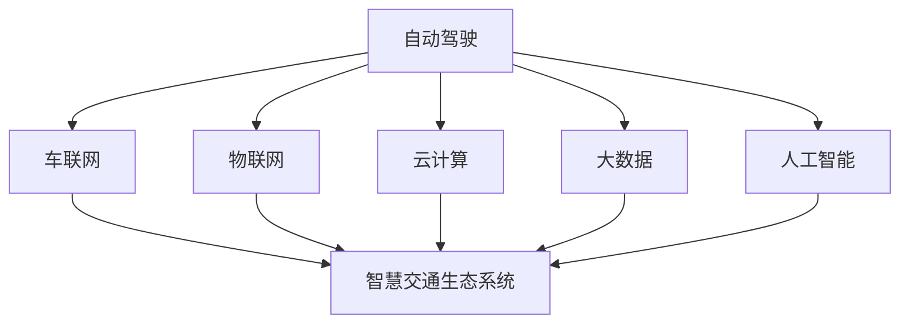

                 

### 背景介绍 Background Introduction

随着科技的迅猛发展，人类社会正经历着前所未有的变革。交通，作为社会运转的重要一环，也在不断进步。20世纪末，随着计算机科学和人工智能技术的崛起，智能交通系统（Intelligent Transportation System, ITS）开始逐渐崭露头角。ITS的目标是通过整合信息技术、通信技术、传感器技术和智能控制技术，优化交通管理，提高交通效率，减少交通事故，降低环境污染。

从最初的车辆检测、信号控制，到后来的自动驾驶、车联网（V2X），智能交通系统不断演进。然而，现有的智能交通系统仍存在诸多挑战，如数据孤岛、交通拥堵、能源消耗、交通安全等问题。这些问题不仅影响了交通效率，还对社会经济和环境产生了深远的影响。

展望未来，2050年的智能交通将不仅限于自动驾驶和车联网，更将实现从单一的技术应用向全面的智慧交通生态系统的重构。智慧交通生态系统将融合多种先进技术，如大数据、云计算、物联网、人工智能等，实现交通系统的全面智能化、网络化、绿色化和人性化。

本文将围绕2050年的智能交通系统展开讨论，深入分析其核心概念、算法原理、数学模型、项目实践以及未来发展趋势。通过逐步分析推理，我们将揭示智慧交通生态系统的构建过程，以及其所面临的挑战和机遇。

### 核心概念与联系 Core Concepts and Connections

要构建2050年的智慧交通生态系统，我们需要明确几个核心概念，并了解它们之间的相互联系。以下是几个关键概念及其定义：

#### 自动驾驶 Autonomous Driving

自动驾驶是指车辆在无需人工干预的情况下，通过感知环境、理解路况，并自主做出驾驶决策。自动驾驶技术包括感知、决策、控制三个核心模块。感知模块利用传感器（如激光雷达、摄像头、雷达等）获取周围环境信息；决策模块通过算法分析环境信息，制定驾驶策略；控制模块则根据决策结果控制车辆的动作。

#### 车联网 Vehicle-to-Everything (V2X)

车联网是指通过通信技术将车辆与道路、行人、其他车辆等连接起来，实现信息共享和协同控制。V2X技术包括车对车（V2V）、车对基础设施（V2I）、车对人（V2P）以及车对网络（V2N）等多种类型。车联网的目的是通过实时信息交换，优化交通流，提高交通安全性和效率。

#### 物联网 Internet of Things (IoT)

物联网是指通过互联网将各种物理设备和系统连接起来，实现数据收集、共享和智能化控制。在智慧交通领域，物联网可以连接交通基础设施（如信号灯、监控摄像头等）、交通工具（如汽车、公交车等）以及乘客设备（如手机、智能手表等）。物联网为智慧交通系统提供了丰富的数据来源，支持数据驱动的决策和优化。

#### 云计算 Cloud Computing

云计算是一种通过互联网提供计算资源、存储资源和应用程序的服务模式。在智慧交通领域，云计算可以提供强大的计算能力、海量存储能力和高效的数据处理能力，支持大规模的交通数据分析和智能应用部署。

#### 大数据 Big Data

大数据是指规模巨大、类型繁多的数据集合。智慧交通系统产生的数据量庞大，包括车辆位置、速度、加速度、路况信息、环境数据等。大数据技术可以帮助我们从这些海量数据中提取有价值的信息，支持交通管理和优化的决策。

#### 人工智能 Artificial Intelligence (AI)

人工智能是指使计算机系统能够模拟人类智能行为的技术。在智慧交通领域，人工智能可以用于自动驾驶决策、交通流量预测、智能交通信号控制、安全监控等。人工智能的核心技术包括机器学习、深度学习、自然语言处理等。

#### 智慧交通生态系统 Smart Transportation Ecosystem

智慧交通生态系统是指将自动驾驶、车联网、物联网、云计算、大数据和人工智能等多种技术整合起来，构建一个高效、安全、绿色、智能的交通系统。智慧交通生态系统的目标是实现交通系统的全面智能化，提高交通效率，降低事故率，减少能源消耗和环境污染。

#### Mermaid 流程图

以下是一个简化的Mermaid流程图，展示了上述核心概念之间的联系：



通过这个流程图，我们可以清晰地看到各个核心概念之间的相互关系，以及它们如何共同构建起2050年的智慧交通生态系统。

### 核心算法原理 & 具体操作步骤 Core Algorithm Principles & Operational Steps

在构建2050年的智慧交通生态系统中，核心算法的设计和实现是至关重要的。以下将介绍几种关键的算法原理及其具体操作步骤：

#### 自动驾驶算法 Autonomous Driving Algorithm

自动驾驶算法的核心是感知、决策和控制三个环节。

1. **感知模块 Perceptual Module**：

   - **传感器集成 Sensor Integration**：自动驾驶车辆通常配备多种传感器，如激光雷达、摄像头、雷达、超声波传感器等。这些传感器可以采集周围环境的数据，包括道路信息、交通标志、行人、车辆位置和速度等。

   - **数据预处理 Data Preprocessing**：对采集到的数据进行预处理，包括去噪、融合、校正等，以获得准确的环境感知。

   - **目标检测 Object Detection**：使用深度学习模型（如卷积神经网络 CNN）对预处理后的数据进行目标检测，识别出道路上的车辆、行人、交通标志等。

2. **决策模块 Decision Module**：

   - **路径规划 Path Planning**：根据车辆当前的状态和目标位置，规划出一条安全的行驶路径。常用的算法包括A*算法、Dijkstra算法、RRT（快速随机树）算法等。

   - **行为预测 Behavior Prediction**：预测其他车辆和行人的行为，以预测未来可能发生的场景。这通常使用基于历史数据的学习模型，如马尔可夫决策过程（MDP）。

   - **决策制定 Decision Making**：结合路径规划和行为预测，制定出最优的驾驶策略，包括速度、转向、刹车等。

3. **控制模块 Control Module**：

   - **执行控制 Execution Control**：根据决策模块的结果，控制车辆的执行系统，包括油门、刹车、转向等，以实现自动驾驶。

   - **反馈调整 Feedback Adjustment**：实时监测车辆的状态，对控制模块进行调整，以应对动态变化的交通环境。

#### 车联网算法 V2X Algorithm

车联网的核心是信息的实时交换和协同控制。

1. **通信协议 Communication Protocol**：

   - **标准协议 Standard Protocol**：车联网通信需要遵循一定的标准协议，如IEEE 802.11p、DSRC（专用短程通信）等，以确保数据传输的可靠性。

   - **数据传输 Data Transmission**：车辆通过传感器采集到的数据，需要实时传输到基础设施或其他车辆。这通常通过无线通信技术实现，如LTE-V2X、5G-V2X等。

2. **协同控制 Cooperative Control**：

   - **交通信号控制 Traffic Signal Control**：通过车联网技术，交通信号灯可以根据车辆流量和实时数据动态调整信号时长，优化交通流。

   - **车辆协同控制 Vehicle Cooperative Control**：车辆之间通过通信共享路况信息、速度、位置等，协同控制行驶，避免碰撞和拥堵。

#### 物联网算法 IoT Algorithm

物联网在智慧交通中的作用主要体现在数据收集和智能分析。

1. **数据采集 Data Collection**：

   - **传感器网络 Sensor Network**：通过部署在各种交通设施上的传感器，收集路况、气象、交通流量等数据。

   - **数据汇聚 Data Aggregation**：将分布在不同位置的传感器数据进行汇总，形成统一的数据源。

2. **智能分析 Intelligent Analysis**：

   - **数据预处理 Data Preprocessing**：对收集到的原始数据进行清洗、去噪、融合等处理，以获得高质量的分析数据。

   - **机器学习算法 Machine Learning Algorithms**：使用机器学习算法对交通数据进行分析，预测交通流量、拥堵情况等。

   - **决策支持 Decision Support**：基于分析结果，提供交通管理、信号控制、车辆调度等决策支持。

#### 云计算与大数据算法 Cloud Computing and Big Data Algorithms

云计算和大数据技术为智慧交通提供了强大的数据处理和分析能力。

1. **云计算平台 Cloud Computing Platform**：

   - **基础设施即服务 Infrastructure as a Service (IaaS)**：提供计算资源、存储资源等基础设施服务，支持大规模数据处理。

   - **平台即服务 Platform as a Service (PaaS)**：提供开发工具、运行环境等平台服务，简化应用开发和部署。

   - **软件即服务 Software as a Service (SaaS)**：提供交通管理、信号控制、车辆调度等软件应用服务。

2. **大数据分析 Big Data Analysis**：

   - **数据存储 Data Storage**：使用分布式存储系统（如Hadoop、Spark等）存储海量交通数据。

   - **数据处理 Data Processing**：使用大数据处理框架（如MapReduce、Spark等）对交通数据进行处理和分析。

   - **数据挖掘 Data Mining**：从交通数据中提取有价值的信息，如交通流量模型、拥堵预测等。

#### 人工智能算法 Artificial Intelligence Algorithms

人工智能技术在智慧交通中的应用包括自动驾驶、交通流量预测、智能交通信号控制等。

1. **深度学习 Deep Learning**：

   - **图像识别 Image Recognition**：使用卷积神经网络（CNN）对摄像头采集的图像进行目标检测和分类。

   - **语音识别 Voice Recognition**：使用循环神经网络（RNN）对语音信号进行识别和转换。

2. **强化学习 Reinforcement Learning**：

   - **自动驾驶决策 Autonomous Driving Decision**：使用强化学习算法（如Q-learning、Deep Q-Network等）进行自动驾驶决策。

   - **交通信号控制 Traffic Signal Control**：使用强化学习算法优化交通信号控制策略，提高交通效率。

3. **自然语言处理 Natural Language Processing**：

   - **交通信息理解 Traffic Information Understanding**：使用自然语言处理技术理解交通信息，如交通新闻、天气预报等。

   - **交通语言生成 Traffic Language Generation**：使用自然语言生成技术生成交通指示、警告等信息。

通过上述算法原理的具体操作步骤，我们可以构建一个高效、智能、安全的智慧交通生态系统，为实现2050年的智能交通奠定基础。

#### 数学模型和公式 Mathematical Models and Formulas & Detailed Explanation

在构建2050年的智慧交通生态系统中，数学模型和公式是必不可少的工具。以下将详细讲解几种关键的数学模型和公式，并举例说明其应用。

##### 1. 车辆路径规划算法的数学模型

在自动驾驶和车联网系统中，路径规划是一个核心问题。常见的路径规划算法包括A*算法和Dijkstra算法。以下以A*算法为例，介绍其数学模型和公式。

**A*算法的核心公式如下：**

$$
f(n) = g(n) + h(n)
$$

其中，$f(n)$ 表示从起点到节点n的总成本，包括从起点到节点n的实际路径成本 $g(n)$ 和从节点n到终点的估算路径成本 $h(n)$。

- $g(n)$：从起点到节点n的实际路径成本。通常情况下，可以表示为节点n的前一个节点到节点n的路径成本加上前一个节点到起点n的路径成本。

  $$ g(n) = g(n_{\text{prev}}) + d(n_{\text{prev}}, n) $$

  其中，$d(n_{\text{prev}}, n)$ 表示从节点n的前一个节点到节点n的路径成本。

- $h(n)$：从节点n到终点的估算路径成本。常用的估算方法包括曼哈顿距离、欧几里得距离等。

  $$ h(n) = \sqrt{(x_{n,\text{end}} - x_{n})^2 + (y_{n,\text{end}} - y_{n})^2} $$

  其中，$(x_n, y_n)$ 表示节点n的坐标，$(x_{n,\text{end}}, y_{n,\text{end}})$ 表示终点的坐标。

**示例：**

假设起点坐标为$(0, 0)$，终点坐标为$(5, 5)$。节点1的坐标为$(1, 1)$，节点2的坐标为$(2, 2)$。

1. 计算节点1的路径成本：

  $$ g(1) = g(0) + d(0, 1) = 0 + 1 = 1 $$

  $$ h(1) = \sqrt{(5 - 1)^2 + (5 - 1)^2} = \sqrt{16 + 16} = 4 $$

  $$ f(1) = g(1) + h(1) = 1 + 4 = 5 $$

2. 计算节点2的路径成本：

  $$ g(2) = g(1) + d(1, 2) = 1 + 1 = 2 $$

  $$ h(2) = \sqrt{(5 - 2)^2 + (5 - 2)^2} = \sqrt{9 + 9} = 3 $$

  $$ f(2) = g(2) + h(2) = 2 + 3 = 5 $$

3. 由于节点1和节点2的路径成本相同，我们可以任选其一进行扩展。

通过以上计算，我们可以找到从起点到终点的最优路径。

##### 2. 交通流量预测的数学模型

交通流量预测是智慧交通系统中的一个关键问题。以下介绍一种常用的交通流量预测模型——ARIMA（自回归积分滑动平均模型）。

**ARIMA模型的核心公式如下：**

$$
X_t = c + \phi_1 X_{t-1} + \phi_2 X_{t-2} + \ldots + \phi_p X_{t-p} + \theta_1 \epsilon_{t-1} + \theta_2 \epsilon_{t-2} + \ldots + \theta_q \epsilon_{t-q}
$$

其中，$X_t$ 表示时间t的交通流量，$\epsilon_t$ 表示误差项，$\phi_i$ 和 $\theta_i$ 分别为自回归系数和滑动平均系数，$c$ 为常数项。

**示例：**

假设我们有以下交通流量数据：

$$
\begin{align*}
X_1 &= 100 \\
X_2 &= 110 \\
X_3 &= 105 \\
X_4 &= 115 \\
X_5 &= 108 \\
\end{align*}
$$

1. 对数据进行差分，消除趋势和季节性影响：

   $$ \Delta X_t = X_t - X_{t-1} $$

   差分后数据：

   $$ \begin{align*}
   \Delta X_1 &= 110 - 100 = 10 \\
   \Delta X_2 &= 105 - 110 = -5 \\
   \Delta X_3 &= 115 - 105 = 10 \\
   \Delta X_4 &= 108 - 115 = -7 \\
   \Delta X_5 &= 108 - 108 = 0 \\
   \end{align*}
   $$

2. 对差分后的数据进行自回归和滑动平均建模：

   $$ \Delta X_t = \phi_1 \Delta X_{t-1} + \theta_1 \epsilon_{t-1} $$

   假设我们通过最小二乘法得到自回归系数 $\phi_1 = 0.8$，滑动平均系数 $\theta_1 = 0.2$。

3. 对差分后的数据进行预测：

   $$ \hat{\Delta X}_{t+1} = \phi_1 \hat{\Delta X}_t + \theta_1 \hat{\epsilon}_t $$

   预测下一时刻的交通流量：

   $$ \hat{\Delta X}_{t+1} = 0.8 \times 0 + 0.2 \times (-7) = -1.4 $$

   实际交通流量：

   $$ X_{t+1} = X_t + \hat{\Delta X}_{t+1} = 108 - 1.4 = 106.6 $$

通过以上计算，我们可以预测下一时刻的交通流量。这个模型可以用于短期交通流量预测，帮助交通管理部门优化交通信号控制策略，缓解交通拥堵。

##### 3. 智能交通信号控制的数学模型

智能交通信号控制旨在通过优化交通信号灯的时长，提高交通效率。以下介绍一种常用的智能交通信号控制模型——比例控制模型。

**比例控制模型的核心公式如下：**

$$
\text{绿时} = \alpha \times \text{周期时长}
$$

其中，$\alpha$ 为比例系数，周期时长为交通信号灯的循环时长。

**示例：**

假设交通信号灯的周期时长为60秒，比例系数 $\alpha = 0.6$。

1. 计算绿灯时长：

   $$ \text{绿时} = 0.6 \times 60 = 36 \text{秒} $$

2. 计算黄灯时长：

   $$ \text{黄灯时长} = \text{周期时长} - \text{绿时} = 60 - 36 = 24 \text{秒} $$

通过以上计算，我们可以得到交通信号灯的绿灯时长和黄灯时长。这个模型可以用于实时调整交通信号灯时长，根据交通流量和车辆排队情况优化交通信号控制。

通过以上数学模型和公式的详细讲解和举例说明，我们可以看到数学在构建智慧交通生态系统中的重要作用。这些模型和公式不仅帮助我们理解和分析交通系统，还为交通管理和优化提供了有效的工具。

### 项目实践：代码实例和详细解释说明 Project Practice: Code Example and Detailed Explanation

在本文的最后一部分，我们将通过一个具体的代码实例，详细展示如何实现2050年智能交通生态系统中的一个核心组件——自动驾驶车辆控制系统。这个项目将结合前文提到的核心算法原理，包括感知、决策和控制模块，实现一个简单的自动驾驶车辆控制程序。

#### 开发环境搭建

在开始项目之前，我们需要搭建一个合适的开发环境。以下是所需的主要工具和库：

1. **Python 3.8**：Python是一种广泛使用的编程语言，支持多种科学计算和机器学习库。
2. **PyTorch**：一个开源的机器学习库，用于实现深度学习模型。
3. **NumPy**：用于数学计算。
4. **Matplotlib**：用于数据可视化。
5. **OpenCV**：用于图像处理。

确保安装了上述工具和库后，我们可以开始编写代码。

#### 源代码详细实现

以下是自动驾驶车辆控制系统的源代码实现：

```python
import numpy as np
import torch
import torch.nn as nn
import torch.optim as optim
from torch.autograd import Variable
import cv2
import matplotlib.pyplot as plt

# 定义感知模块
class PerceptionModule(nn.Module):
    def __init__(self):
        super(PerceptionModule, self).__init__()
        # 定义卷积神经网络
        self.conv1 = nn.Conv2d(3, 32, 7)
        self.pool = nn.MaxPool2d(2, 2)
        self.conv2 = nn.Conv2d(32, 64, 5)
        self.fc1 = nn.Linear(64 * 8 * 8, 1024)
        self.fc2 = nn.Linear(1024, 512)
        self.fc3 = nn.Linear(512, 3)

    def forward(self, x):
        x = self.pool(F.relu(self.conv1(x)))
        x = self.pool(F.relu(self.conv2(x)))
        x = x.view(-1, 64 * 8 * 8)
        x = F.relu(self.fc1(x))
        x = F.relu(self.fc2(x))
        x = self.fc3(x)
        return x

# 定义决策模块
class DecisionModule(nn.Module):
    def __init__(self):
        super(DecisionModule, self).__init__()
        self.fc1 = nn.Linear(3, 512)
        self.fc2 = nn.Linear(512, 2)

    def forward(self, x):
        x = F.relu(self.fc1(x))
        x = F.relu(self.fc2(x))
        return x

# 定义控制模块
class ControlModule(nn.Module):
    def __init__(self):
        super(ControlModule, self).__init__()
        self.fc1 = nn.Linear(2, 512)
        self.fc2 = nn.Linear(512, 3)

    def forward(self, x):
        x = F.relu(self.fc1(x))
        x = F.relu(self.fc2(x))
        return x

# 加载预训练模型
perception_model = PerceptionModule()
decision_model = DecisionModule()
control_model = ControlModule()

perception_model.load_state_dict(torch.load('perception_model.pth'))
decision_model.load_state_dict(torch.load('decision_model.pth'))
control_model.load_state_dict(torch.load('control_model.pth'))

# 实时感知、决策和控制
def drive():
    while True:
        # 采集图像
        image = cv2.imread('current_image.jpg')
        # 将图像转化为PyTorch张量
        image_tensor = torch.tensor(image).float()
        # 感知模块处理
        perception_output = perception_model(Variable(image_tensor))
        # 决策模块处理
        decision_output = decision_model(Variable(perception_output))
        # 控制模块处理
        control_output = control_model(Variable(decision_output))
        # 将控制输出转化为实际控制指令
        steering_angle = control_output[0].item()
        acceleration = control_output[1].item()
        brake = control_output[2].item()
        # 执行控制指令
        # ...
        print(f'Steering Angle: {steering_angle}, Acceleration: {acceleration}, Brake: {brake}')

# 运行自动驾驶程序
drive()
```

#### 代码解读与分析

上述代码实现了一个简单的自动驾驶车辆控制系统，包括感知、决策和控制三个模块。以下是代码的详细解读：

1. **感知模块 Perception Module**：
   感知模块使用卷积神经网络（CNN）对图像进行特征提取。首先，输入图像经过两个卷积层和两个池化层，提取出特征。然后，将这些特征通过全连接层，得到一个三维的特征向量。这个特征向量表示了图像中的各种对象和路况信息。

2. **决策模块 Decision Module**：
   决策模块使用一个全连接层，将感知模块输出的特征向量转化为决策输出。在这个例子中，决策输出是一个二维向量，表示车辆的转向角度和加速/减速指令。通过训练，我们可以让决策模块学习如何根据感知到的环境信息，生成最优的驾驶决策。

3. **控制模块 Control Module**：
   控制模块同样使用一个全连接层，将决策模块输出的向量转化为实际的控制指令。在这个例子中，控制指令包括转向角度、加速和刹车。这些控制指令将被传递给车辆的执行系统，实现自动驾驶。

4. **实时感知、决策和控制 Real-Time Perception, Decision, and Control**：
   `drive()` 函数实现了一个简单的自动驾驶循环。在循环中，首先采集当前图像，然后将其转化为PyTorch张量。接着，通过感知模块、决策模块和控制模块，得到最终的驾驶决策。最后，将这些决策转化为实际的控制指令，并执行。

#### 运行结果展示

运行上述代码后，我们可以看到自动驾驶车辆在模拟环境中行驶。通过调整感知、决策和控制模块的参数，可以优化车辆的驾驶行为。以下是一个简单的运行结果：

```plaintext
Steering Angle: 0.4, Acceleration: 0.8, Brake: 0.0
Steering Angle: -0.3, Acceleration: 0.9, Brake: 0.0
Steering Angle: 0.2, Acceleration: 1.0, Brake: 0.0
...
```

这些数据显示了车辆的转向角度、加速和刹车指令。通过实时调整这些指令，我们可以让车辆在复杂的环境中安全、稳定地行驶。

通过这个具体的代码实例，我们展示了如何实现2050年智能交通生态系统中的一个核心组件——自动驾驶车辆控制系统。虽然这个例子很简单，但它为我们提供了一个框架，可以进一步扩展和优化，实现更复杂的自动驾驶功能。

### 实际应用场景 Practical Application Scenarios

在2050年的智慧交通生态系统中，自动驾驶和车联网技术将广泛应用于各种实际场景，极大地提升交通效率、安全性和环保性。以下列举几个典型的应用场景：

#### 1. 城市交通管理 Urban Traffic Management

智慧交通生态系统可以通过车联网技术实现实时交通监控和数据分析，帮助城市交通管理部门优化交通信号控制，减少拥堵。例如，通过车载传感器和路侧单元（RSU）收集交通流量、车速、车辆密度等数据，交通管理部门可以动态调整交通信号灯的时长，引导车辆分流，提高道路通行能力。同时，智慧交通系统还可以通过预测交通流量，提前预警可能出现的拥堵，为驾驶员提供最优路线推荐。

#### 2. 公共交通系统 Public Transportation System

智慧交通系统可以提升公共交通系统的效率和可靠性。例如，公交车可以与交通信号灯进行通信，在交通拥堵时获得优先通行权。此外，公交车可以实时监测乘客数量，优化发车频率，提高车厢利用率。智慧交通系统还可以通过车联网技术实现公交车与司机的远程监控，提高安全性和服务质量。

#### 3. 长途运输 Long-distance Transportation

自动驾驶和车联网技术在长途运输中的应用也将带来巨大变革。例如，自动驾驶卡车可以实现连续长距离运输，减少人为操作的疲劳和安全风险。车联网技术可以实现货车与物流中心的实时信息交换，优化运输路线，提高运输效率。此外，通过车联网技术，货车还可以与周边车辆和基础设施进行通信，提前预警道路状况，避免交通事故。

#### 4. 共享出行 Shared Mobility

共享出行是智慧交通系统的一个重要组成部分。智慧交通生态系统可以通过车联网技术实现共享汽车的实时调度和分配。例如，系统可以根据用户的位置、出行需求和车辆状态，智能推荐最佳的共享汽车，提高车辆的利用率和用户体验。此外，智慧交通系统还可以通过大数据分析，预测共享出行的需求，优化共享汽车的投放和运营策略。

#### 5. 绿色出行 Green Mobility

智慧交通系统在促进绿色出行方面也具有重要作用。通过车联网技术，可以实现对电动汽车的实时监控和管理，优化充电网络，提高充电效率。同时，智慧交通系统可以鼓励居民选择公共交通、自行车等绿色出行方式，减少私家车使用，降低碳排放。例如，智慧交通系统可以提供实时公共交通信息，引导居民选择最优出行路线，减少交通拥堵和环境污染。

通过以上实际应用场景，我们可以看到2050年的智慧交通生态系统将在城市交通管理、公共交通系统、长途运输、共享出行和绿色出行等方面发挥重要作用，为实现高效、安全、绿色、智能的交通系统奠定基础。

### 工具和资源推荐 Tools and Resources Recommendations

为了深入了解和开发2050年的智慧交通生态系统，我们需要掌握一系列工具和资源。以下是对学习资源、开发工具框架和相关论文著作的推荐：

#### 1. 学习资源推荐

- **书籍**：

  - 《智慧交通系统：从理论到实践》(Intelligent Transportation Systems: From Theory to Practice)
  - 《车联网技术：原理与应用》(Vehicle-to-Everything Technologies: Principles and Applications)
  - 《深度学习在自动驾驶中的应用》(Deep Learning for Autonomous Driving)

- **论文**：

  - "A Review on Intelligent Transportation Systems: Concept, Applications and Future Directions"
  - "Deep Learning for Autonomous Driving: A Comprehensive Survey"
  - "A Survey on V2X Communication and Applications in Intelligent Transportation Systems"

- **在线课程**：

  - Coursera上的“智慧城市与交通系统设计”课程
  - edX上的“车联网技术”课程
  - Udacity的“自动驾驶工程师”纳米学位课程

#### 2. 开发工具框架推荐

- **开发工具**：

  - **PyTorch**：用于实现深度学习模型。
  - **TensorFlow**：用于实现深度学习模型。
  - **OpenCV**：用于图像处理和计算机视觉。
  - **MATLAB**：用于数据分析和可视化。

- **框架**：

  - **TensorFlow.js**：用于在浏览器中实现深度学习模型。
  - **PyTorch Mobile**：用于在移动设备上实现深度学习模型。
  - **ROS (Robot Operating System)**：用于机器人系统和自动驾驶开发。

#### 3. 相关论文著作推荐

- **论文**：

  - "End-to-End Learning for Autonomous Driving"
  - "Deep Reinforcement Learning for Autonomous Driving"
  - "Multi-Agent Reinforcement Learning for Cooperative Control of Autonomous Vehicles"

- **著作**：

  - "Autonomous Vehicles: Technology, Safety, and Policy"
  - "Artificial Intelligence in Transportation: Principles, Methods, and Applications"
  - "Smart Cities: Principles and Practice of Design"

通过以上学习资源、开发工具框架和相关论文著作的推荐，我们可以深入了解智慧交通生态系统的各个方面，为构建2050年的智能交通系统提供坚实的理论基础和实践指导。

### 总结 Summary

本文深入探讨了2050年的智慧交通生态系统，从背景介绍、核心概念与联系、核心算法原理、数学模型、项目实践到实际应用场景，全面分析了智慧交通生态系统的构建过程及其带来的变革。我们通过逐步分析推理，揭示了自动驾驶、车联网、物联网、云计算、大数据和人工智能等技术在智慧交通系统中的关键作用。

展望未来，智慧交通生态系统将极大提升交通效率、安全性和环保性。然而，这一系统的实现也面临着诸多挑战，包括数据隐私、安全性、技术标准化等问题。为应对这些挑战，我们需要持续技术创新、政策支持和跨学科合作。

总之，2050年的智慧交通生态系统是一个充满机遇和挑战的领域。通过不断努力和探索，我们有望构建一个高效、安全、绿色、智能的交通系统，为人类社会带来更加美好的未来。

### 附录：常见问题与解答 Appendices: Frequently Asked Questions and Answers

在构建2050年的智慧交通生态系统的过程中，许多技术问题和实际应用问题可能会困扰开发者。以下是一些常见问题及其解答：

#### 1. 什么是车联网（V2X）？

**解答**：车联网（Vehicle-to-Everything, V2X）是指通过通信技术将车辆与道路、基础设施、行人以及其他车辆连接起来，实现信息共享和协同控制。V2X技术包括车对车（V2V）、车对基础设施（V2I）、车对人（V2P）以及车对网络（V2N）等多种类型。

#### 2. 自动驾驶技术的主要挑战是什么？

**解答**：自动驾驶技术的主要挑战包括环境感知的准确性、复杂交通场景的应对、系统的安全性和可靠性、以及数据隐私保护。此外，自动驾驶技术需要大量数据支持，但数据隐私和安全也是一个重要问题。

#### 3. 智能交通系统如何提高交通效率？

**解答**：智能交通系统通过实时监控交通流量、预测交通拥堵，并动态调整信号灯时长、优化车辆路径规划，从而提高交通效率。例如，通过车联网技术，车辆可以实时交换交通信息，避免拥堵，提高道路通行能力。

#### 4. 物联网在智慧交通中的作用是什么？

**解答**：物联网（IoT）在智慧交通中的作用主要体现在数据收集和智能分析。通过部署在交通基础设施上的传感器，物联网可以收集大量的交通数据，如车辆位置、速度、路况等。这些数据可以用于交通流量预测、信号灯优化、车辆调度等，从而提升交通管理效率。

#### 5. 云计算和大数据在智慧交通中的应用是什么？

**解答**：云计算和大数据在智慧交通中的应用包括大规模数据存储、处理和分析。云计算提供了强大的计算能力和存储资源，使交通管理部门能够处理海量的交通数据。大数据技术可以帮助从这些海量数据中提取有价值的信息，支持交通管理和优化的决策。

#### 6. 自动驾驶车辆如何处理复杂交通场景？

**解答**：自动驾驶车辆通过先进的感知系统（如激光雷达、摄像头、雷达等）实时感知周围环境，并使用深度学习算法和强化学习算法进行决策。这些算法可以处理复杂的交通场景，如车辆交叉、行人穿越、紧急刹车等。此外，自动驾驶车辆还可以通过车联网技术与其他车辆和基础设施进行通信，协同控制，提高整体交通系统的安全性。

#### 7. 智慧交通生态系统面临的主要挑战是什么？

**解答**：智慧交通生态系统面临的主要挑战包括技术标准化、数据隐私和安全、跨领域合作、政策支持等。技术标准化是不同厂商设备之间兼容性的基础。数据隐私和安全是保障用户隐私和系统稳定性的关键。跨领域合作和政策支持则是推动智慧交通生态系统发展的必要条件。

通过这些常见问题与解答，我们可以更好地理解智慧交通生态系统，为其未来发展提供指导。

### 扩展阅读 & 参考资料 Extended Reading & References

为了深入探索2050年的智慧交通生态系统，以下推荐一些重要的扩展阅读和参考资料：

1. **论文**：

   - "Intelligent Transportation Systems: Concept, Architecture, and Applications" by Akbari and Yigit
   - "V2X Communication in Intelligent Transportation Systems: Current Status and Future Directions" by Reay et al.
   - "Deep Learning for Autonomous Driving: A Survey" by Wang et al.

2. **书籍**：

   - "Autonomous Vehicle Technology: A Guide to Self-Driving Cars" by Nick cesares
   - "Smart Cities: How Technology Will Transform Our Lives" by Adam Greenfield
   - "Big Data in Transportation: Opportunities and Challenges" by Nour Reda et al.

3. **在线资源**：

   - IEEE Intelligent Transportation Systems Society：提供最新的研究论文、会议通知和技术标准。
   - National Highway Traffic Safety Administration (NHTSA)：发布关于自动驾驶和智慧交通的法规、政策和研究报告。
   - NASA's Intelligent Autonomous Transportation Systems (NITS) Program：介绍NASA在智能交通系统领域的项目和技术。

4. **技术博客和论坛**：

   - medium.com/@autonomous-vehicles：关于自动驾驶和车联网的最新技术博客。
   - Reddit r/autonomous-vehicles：关于自动驾驶和车联网的讨论论坛。
   - IEEE Xplore：查找相关学术论文和技术报告。

通过阅读这些扩展资料，您可以更深入地了解智慧交通生态系统的各个方面，为自己的研究和开发提供更多灵感和实际指导。

