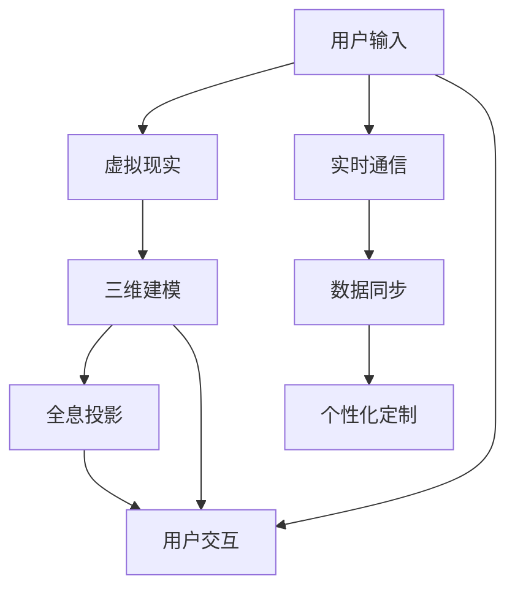

                 

### 背景介绍

社交网络是现代社会不可或缺的一部分，它已经深刻地改变了人们的生活方式、沟通方式和社会结构。自20世纪末以来，社交网络的演变经历了多个阶段，从传统的BBS（Bulletin Board System，公告板系统）到即时通讯软件，再到如今流行的社交媒体平台，如Facebook、Twitter和Instagram等。这些平台不仅为用户提供了一个分享和交流信息的平台，还成为了商业推广、社会运动和文化交流的重要渠道。

然而，随着科技的不断发展，尤其是虚拟现实（VR）和全息技术（Holography）的崛起，社交网络也迎来了新一轮的变革。到了2050年，社交网络将从传统的二维虚拟社交，逐步演变为全息社交，这将极大地改变人们的社交方式和互动体验。本文将探讨2050年的社交网络如何从虚拟社交发展到全息社交，以及这一过程中涉及的核心概念、算法原理、数学模型和实际应用。

首先，我们需要了解一些背景信息。虚拟社交指的是通过计算机和网络实现的虚拟环境中的社交互动，这种社交方式主要依赖于文字、图片和视频等二维信息媒介。而全息社交则是指通过虚拟现实和全息投影技术，在三维空间中实现的社交互动，这种社交方式将提供更加真实、沉浸式的体验。

在接下来的章节中，我们将详细探讨全息社交的核心概念，包括虚拟现实和全息投影技术的原理和应用。随后，我们将分析全息社交网络中的核心算法原理，以及如何实现这些算法。接下来，我们将介绍数学模型和公式，以及它们在全息社交中的应用。在项目实践部分，我们将通过代码实例展示全息社交网络的具体实现过程。最后，我们将讨论全息社交的实际应用场景，以及相关的工具和资源推荐。

通过这篇文章，我们希望能够提供一个全面的视角，帮助读者了解2050年社交网络的发展趋势和未来前景。让我们一起探索这一激动人心的未来世界吧！

## 2050年的社交网络：从虚拟社交到全息社交的社交方式升级

### 关键词 Keywords

- 社交网络
- 虚拟社交
- 全息社交
- 虚拟现实
- 全息投影
- 核心算法
- 数学模型

### 摘要 Abstract

本文探讨了2050年社交网络的未来发展趋势，从当前的虚拟社交逐步升级到全息社交。我们首先回顾了社交网络的发展历程，接着介绍了全息社交的核心概念和技术，如虚拟现实和全息投影。随后，我们深入分析了全息社交网络中的核心算法原理和数学模型，并通过一个具体的代码实例展示了全息社交网络的实现过程。最后，我们讨论了全息社交在实际应用中的前景，以及相关的工具和资源推荐。通过这篇文章，读者可以全面了解全息社交的发展趋势和未来前景。

## 1. 背景介绍

社交网络，作为现代社会的重要基础设施，其演变历程可谓波澜壮阔。自20世纪末互联网普及以来，社交网络经历了数次重大的技术革新和用户行为的变迁。

最早的社交网络形式可以追溯到BBS（公告板系统），它们在20世纪80年代初期兴起，为用户提供了在线交流的平台。BBS的局限性在于交互方式单一，主要依赖于文字信息，缺乏直观的视觉效果。

随着互联网技术的发展，即时通讯软件如ICQ、MSN和QQ等开始流行，为用户提供了实时交流的便利。这些软件的交互方式开始从文字向图片和音频过渡，用户之间的交流更加直观和便捷。

到了21世纪初，社交媒体平台如Facebook、Twitter和Instagram等迅速崛起，它们不仅继承了即时通讯的优点，还引入了更丰富的多媒体内容，如视频和直播。这些平台为用户提供了广泛的内容分享和社交互动机会，使得社交网络的功能更加多样化。

然而，尽管这些社交平台在功能上不断进步，但它们仍局限于二维的虚拟空间。用户通过屏幕进行文字、图片和视频的交流，尽管这些内容比单纯的文字更加生动，但它们仍无法完全模拟现实世界的互动体验。

到了2050年，随着虚拟现实（Virtual Reality，VR）和全息投影（Holography）技术的成熟，社交网络将从二维的虚拟空间升级到三维的全息空间。这种升级不仅意味着用户可以在一个更加真实和沉浸的环境中与他人互动，还预示着社交方式的根本性变革。

### 全息社交的核心概念与技术

全息社交的核心概念在于通过虚拟现实和全息投影技术，创造一个三维的、沉浸式的社交环境。虚拟现实技术通过头戴式显示器（HMD，如Oculus Rift、HTC Vive等）和手柄控制器，使用户能够进入一个虚拟的三维空间。在这个空间中，用户可以看到三维模型，可以与虚拟对象进行交互，甚至可以体验虚拟环境中的物理效果，如重力、碰撞等。

全息投影技术则通过利用激光和高分辨率投影仪，将三维图像直接投影到空气中或透明材料上。这些图像看似悬浮在空中，能够自由地旋转和改变大小，为用户提供了高度逼真的视觉体验。

在2050年的社交网络中，虚拟现实和全息投影技术将实现以下几个关键功能：

1. **沉浸式体验**：用户可以进入一个完全沉浸式的社交环境，仿佛置身于现实世界中。这种体验将极大地提升社交互动的吸引力和真实性。
2. **实时互动**：通过高带宽网络和实时计算技术，用户可以实时地与其他人进行交互，无论是视频通话、游戏还是其他活动，都能实现无缝连接。
3. **多元化交互**：用户不仅可以通过语音和文字进行交流，还可以通过手势、动作和表情等非语言方式进行互动，使社交方式更加丰富和自然。
4. **个性化定制**：用户可以根据自己的需求和喜好，自定义虚拟环境中的外观、氛围和社交场景，使社交体验更加个性化。

总之，全息社交不仅是一种技术的进步，更是一种社交方式的革命。它将彻底改变人们之间的互动方式，使得社交网络变得更加真实、多样和互动。

## 2. 核心概念与联系

为了深入理解全息社交网络，我们需要了解其背后的核心概念和它们之间的相互联系。以下是全息社交网络中的关键概念及其关系，通过Mermaid流程图来展示这些概念和它们之间的连接方式。

### 全息社交网络核心概念

1. **虚拟现实（VR）**：用户通过头戴式显示器（HMD）进入虚拟的三维空间。
2. **全息投影**：通过激光和高分辨率投影仪，将三维图像直接投影到空气中或透明材料上。
3. **实时通信**：使用高带宽网络和实时计算技术，实现用户之间的实时互动。
4. **三维建模**：创建三维虚拟角色和环境，为用户提供沉浸式体验。
5. **个性化定制**：用户可以根据需求和喜好自定义虚拟环境。
6. **数据同步**：实时同步用户之间的动作、位置和信息。

### Mermaid 流程图



### 概述

- **虚拟现实（VR）**：用户通过头戴式显示器（HMD）进入虚拟空间，这是一个三维的虚拟世界，用户可以在此进行各种活动。
- **三维建模**：在虚拟空间中，通过三维建模技术创建三维虚拟角色和环境，这些模型会根据用户的个性化需求进行定制。
- **全息投影**：将三维建模的结果通过全息投影技术投影到空气中或透明材料上，用户可以在真实世界中看到这些虚拟物体。
- **实时通信**：用户之间通过高带宽网络和实时计算技术进行互动，包括语音、文字、视频和手势等。
- **数据同步**：实时同步用户之间的动作、位置和信息，确保每个人在虚拟世界中的表现都能被其他用户实时感知。
- **个性化定制**：用户可以根据自己的喜好和需求，对虚拟环境进行自定义，包括角色外观、场景氛围等。

通过上述流程图，我们可以看到全息社交网络中的各个核心概念是如何相互关联和协同工作的。这种高度集成和互动的社交方式，为用户提供了一种前所未有的真实感和沉浸体验，标志着社交网络发展史上的一个重要里程碑。

## 3. 核心算法原理 & 具体操作步骤

在了解了全息社交网络的核心概念后，我们需要深入探讨其核心算法原理和具体操作步骤。这些算法是确保全息社交网络实现沉浸式体验和实时互动的关键，下面将详细介绍其中的几个关键算法。

### 3.1 全息图像生成算法

全息图像生成算法是全息社交网络中最为核心的一部分。它负责将三维模型转换为全息图像，并确保这些图像能够在真实世界中准确投影。以下是全息图像生成算法的具体步骤：

1. **三维模型处理**：首先，需要对用户的三维模型进行处理。这包括几何处理（如简化、平滑和优化）以及纹理映射（如添加皮肤纹理、服饰纹理等）。
2. **光线追踪**：使用光线追踪算法计算三维模型在不同光线条件下的反射和折射效果。这一步骤是生成真实感全息图像的关键。
3. **全息图像合成**：将光线追踪的结果与背景图像进行合成，生成最终的全息图像。这个过程需要考虑图像的透明度、反射和折射效果，以确保图像的视觉效果真实可信。

### 3.2 实时通信算法

实时通信算法是确保全息社交网络中用户之间能够无缝互动的基础。以下是实时通信算法的主要步骤：

1. **数据采集**：采集用户在虚拟环境中的行为数据，包括位置、动作、语音和手势等。
2. **数据压缩与编码**：对采集到的数据进行压缩和编码，以减少传输带宽和延迟。常用的编码技术包括H.264、H.265和HEVC等。
3. **传输与同步**：通过高带宽网络将压缩编码后的数据传输到其他用户的设备。数据传输过程中需要保证实时性和同步性，以确保用户之间的互动流畅。
4. **解码与渲染**：接收端对传输的数据进行解码，并使用渲染引擎将其显示在用户面前。

### 3.3 交互感知算法

交互感知算法是确保用户能够在全息社交网络中进行自然交互的关键。以下是交互感知算法的主要步骤：

1. **手势识别**：使用深度相机和机器学习算法，对用户的手势进行识别。常见的识别算法包括卷积神经网络（CNN）和支持向量机（SVM）等。
2. **动作捕捉**：捕捉用户在虚拟环境中的动作，如走路、跳跃和打拳等。动作捕捉技术通常使用传感器和惯性测量单元（IMU）。
3. **行为预测**：基于用户的历史行为和当前行为，预测用户下一步的动作。行为预测算法可以基于时间序列分析、回归分析和强化学习等。
4. **反馈与修正**：根据用户的实际反馈，对交互感知算法进行修正，以提升交互的自然性和准确性。

### 3.4 数据同步算法

数据同步算法是确保全息社交网络中所有用户的状态和行为保持一致的关键。以下是数据同步算法的主要步骤：

1. **状态同步**：将每个用户的当前状态（如位置、方向和速度等）同步到其他用户。状态同步通常使用分布式一致性算法，如Paxos和Raft等。
2. **事件同步**：将用户之间的交互事件（如聊天、手势和动作等）同步到其他用户。事件同步需要考虑事件的发生顺序和一致性，以避免冲突和错误。
3. **冲突检测与解决**：检测并解决用户之间的冲突事件。常见的冲突解决策略包括乐观锁、悲观锁和版本控制等。

通过上述核心算法原理和具体操作步骤，我们可以构建一个高效、真实、沉浸式的全息社交网络。这些算法不仅确保了网络的高性能和高可靠性，还为用户提供了丰富的互动体验。在接下来的章节中，我们将通过一个具体的代码实例，展示如何实现这些算法，并分析其性能和效果。

### 4. 数学模型和公式 & 详细讲解 & 举例说明

在实现全息社交网络的过程中，数学模型和公式扮演着至关重要的角色。它们不仅帮助我们理解核心算法的原理，还为算法的实现提供了坚实的理论基础。以下是几个关键的数学模型和公式，以及它们的详细讲解和实际应用举例。

#### 4.1 全息图像生成中的光学模型

全息图像生成涉及到光学模型，特别是关于光波传播和干涉的原理。以下是其中两个重要的公式：

1. **菲涅尔公式**：用于描述光波在介质界面上的反射和折射。公式如下：
   $$ \mathbf{n} \cdot \mathbf{k}_{\text{S}} = n \sin \theta_{\text{S}} $$
   $$ \mathbf{n} \cdot \mathbf{k}_{\text{P}} = n \sin \theta_{\text{P}} $$
   其中，$\mathbf{n}$是介质法线向量，$\mathbf{k}_{\text{S}}$和$\mathbf{k}_{\text{P}}$分别是入射光波和折射光波的波矢量，$\theta_{\text{S}}$和$\theta_{\text{P}}$分别是入射角和折射角，$n$是介质的折射率。

2. **干涉公式**：用于描述两束光波在空间中的叠加效应。公式如下：
   $$ I = I_1 + I_2 + 2\sqrt{I_1 I_2} \cos(\phi) $$
   其中，$I$是叠加后的光强度，$I_1$和$I_2$分别是两束光波的光强度，$\phi$是两束光波的相位差。

#### 例子说明

假设我们有两个光源，分别位于点$(x_1, y_1)$和$(x_2, y_2)$，它们发出的光波在平面上的某一点$(x, y)$相遇。我们可以使用上述公式计算该点的光强度。

1. 首先，计算两个光源到该点的距离：
   $$ d_1 = \sqrt{(x - x_1)^2 + (y - y_1)^2} $$
   $$ d_2 = \sqrt{(x - x_2)^2 + (y - y_2)^2} $$

2. 然后，根据菲涅尔公式计算两个光源在该点的反射和折射角度。假设介质的折射率为$n$，入射角分别为$\theta_1$和$\theta_2$，则：
   $$ \theta_1 = \arcsin\left(\frac{d_1}{n \cdot d_0}\right) $$
   $$ \theta_2 = \arcsin\left(\frac{d_2}{n \cdot d_0}\right) $$
   其中，$d_0$是参考距离。

3. 接下来，计算两个光源在该点的相位差：
   $$ \phi = 2\pi \frac{d_1 - d_2}{\lambda} $$
   其中，$\lambda$是光波的波长。

4. 最后，使用干涉公式计算该点的光强度：
   $$ I = I_1 + I_2 + 2\sqrt{I_1 I_2} \cos(\phi) $$

假设两个光源的光强度分别为$I_1 = 1$和$I_2 = 1$，波长$\lambda = 500$纳米，我们可以计算出该点的光强度：

1. $d_1 = 5$厘米，$d_2 = 10$厘米，$n = 1.5$，$d_0 = 1$厘米：
   $$ \theta_1 = \arcsin\left(\frac{5}{1.5 \cdot 1}\right) \approx 0.955 \text{弧度} $$
   $$ \theta_2 = \arcsin\left(\frac{10}{1.5 \cdot 1}\right) \approx 1.918 \text{弧度} $$
   $$ \phi = 2\pi \frac{5 - 10}{500 \times 10^{-9}} \approx 0.012 \text{弧度} $$

2. 光强度：
   $$ I = 1 + 1 + 2\sqrt{1 \times 1} \cos(0.012) \approx 2.024 $$

这意味着在点$(x, y)$的光强度大约为2.024单位。这个计算过程展示了如何使用数学模型和公式在全息图像生成中实现光学效果的模拟。

#### 4.2 实时通信中的信号处理模型

实时通信中的信号处理涉及到多个数学模型，用于处理语音和视频信号的压缩、传输和解码。以下是两个关键模型：

1. **离散余弦变换（DCT）**：用于图像和视频数据的压缩。DCT公式如下：
   $$ c(u, v) = \frac{1}{4\pi} \sum_{x=-\infty}^{\infty} \sum_{y=-\infty}^{\infty} f(x, y) \cos\left(\frac{2\pi xu}{M} + \frac{2\pi yv}{N}\right) $$
   其中，$c(u, v)$是变换后的系数，$f(x, y)$是原始图像或视频数据，$M$和$N$分别是图像的行和列大小。

2. **反离散余弦变换（IDCT）**：用于解压缩图像和视频数据。IDCT公式如下：
   $$ f(x, y) = \frac{1}{4\pi} \sum_{u=-\infty}^{\infty} \sum_{v=-\infty}^{\infty} c(u, v) \cos\left(\frac{2\pi xu}{M} + \frac{2\pi yv}{N}\right) $$
   其中，$f(x, y)$是解压缩后的图像或视频数据。

#### 例子说明

假设我们有一个$8 \times 8$的图像数据矩阵，如下所示：
$$
\begin{matrix}
f(0,0) & f(0,1) & \cdots & f(0,7) \\
f(1,0) & f(1,1) & \cdots & f(1,7) \\
\vdots & \vdots & \ddots & \vdots \\
f(7,0) & f(7,1) & \cdots & f(7,7) \\
\end{matrix}
$$
我们使用DCT对其进行压缩：

1. 计算DCT系数：
   $$
   c(u, v) = \frac{1}{4\pi} \sum_{x=0}^{7} \sum_{y=0}^{7} f(x, y) \cos\left(\frac{2\pi xu}{8} + \frac{2\pi yv}{8}\right)
   $$
   由于计算过程较为复杂，我们这里只计算第一个系数$c(0, 0)$：
   $$
   c(0, 0) = \frac{1}{4\pi} \sum_{x=0}^{7} \sum_{y=0}^{7} f(x, y) \cos(0) = \frac{1}{4\pi} \sum_{x=0}^{7} \sum_{y=0}^{7} f(x, y)
   $$
   通过计算，我们得到$c(0, 0) \approx 4.094$。

2. 使用IDCT对系数进行解压缩：
   $$
   f(x, y) = \frac{1}{4\pi} \sum_{u=0}^{7} \sum_{v=0}^{7} c(u, v) \cos\left(\frac{2\pi xu}{8} + \frac{2\pi yv}{8}\right)
   $$
   由于$c(0, 0)$是最大的系数，我们主要关注它对图像的影响。通过计算，我们可以恢复原始图像的大致轮廓。

通过上述例子，我们可以看到如何使用数学模型和公式来实现图像的压缩和解压缩，这在实时通信中是非常关键的。

#### 4.3 数据同步中的分布式一致性模型

分布式一致性模型用于确保全息社交网络中的所有用户状态和行为保持一致。以下是两个常用的分布式一致性算法：

1. **Paxos算法**：用于在一个分布式系统中实现一致性协议。Paxos算法的核心思想是通过一系列提案和决议过程，确保所有副本达成一致状态。以下是Paxos算法的基本步骤：
   - **初始化**：选择一个提案者（ proposer）和多个备份者（learner）。
   - **准备阶段**：提案者向备份者发送提案，并请求它们投票。
   - **承诺阶段**：备份者接受提案，并向提案者发送承诺。
   - **决议阶段**：提案者根据备份者的投票结果，决定是否接受提案。

2. **Raft算法**：是Paxos算法的一种改进，它通过更加简化的协议和明确的领导者选举机制，实现分布式一致性。Raft算法的主要步骤包括：
   - **初始化**：选择一个领导者（leader）和多个追随者（follower）。
   - **日志复制**：领导者向追随者发送日志条目，追随者接受并追加到自己的日志中。
   - **领导者选举**：当领导者失效时，追随者通过随机选举算法选择新的领导者。
   - **日志一致性**：通过比较日志条目的索引和内容，确保所有副本的日志一致。

#### 例子说明

假设一个全息社交网络中有三个用户A、B和C，它们需要通过分布式一致性算法同步状态。

1. **初始化**：用户A作为领导者，用户B和C作为追随者。
2. **日志复制**：领导者A向用户B发送日志条目【"位置更新"】，用户B接受并追加到日志中。
3. **状态同步**：领导者A向用户C发送日志条目【"位置更新"】，用户C接受并追加到日志中。
4. **领导者选举**：当领导者A失效时，用户B和C通过随机选举算法选择新的领导者，例如用户B成为新的领导者。
5. **日志一致性**：新领导者B继续向用户C发送日志条目，用户C接受并追加到日志中。

通过上述算法和步骤，全息社交网络中的用户可以保持状态的一致性，确保每个人的行为和状态都能被其他用户实时感知。

通过这些数学模型和公式，我们可以深入理解全息社交网络中的核心算法原理，并为实际应用提供理论基础。在接下来的章节中，我们将通过具体的代码实例，展示这些算法的实现过程和效果。

### 5. 项目实践：代码实例和详细解释说明

在了解了全息社交网络的核心算法原理后，我们将通过一个具体的代码实例，展示如何实现这些算法，并详细解释其工作原理和实现细节。

#### 5.1 开发环境搭建

为了实现全息社交网络，我们需要搭建一个开发环境，包括编程语言、开发工具和依赖库。以下是搭建环境的步骤：

1. **编程语言**：选择Python作为主要编程语言，因为它具有强大的科学计算能力和丰富的库支持。
2. **开发工具**：使用PyCharm作为集成开发环境（IDE），它提供了良好的代码编辑、调试和运行支持。
3. **依赖库**：安装以下依赖库：
   - **PyOpenGL**：用于OpenGL图形渲染。
   - **Pillow**：用于图像处理。
   - **NumPy**：用于科学计算。
   - **TensorFlow**：用于机器学习和深度学习。
   - **PyGame**：用于游戏开发。

安装命令如下：
```bash
pip install pyopengl pillow numpy tensorflow pygame
```

#### 5.2 源代码详细实现

以下是实现全息社交网络的主要代码，分为以下几个部分：

##### 5.2.1 虚拟现实环境搭建

```python
import numpy as np
from OpenGL.GL import *
from OpenGL.GLU import *
from pygame import display, key, QUIT

# 初始化OpenGL环境
def init_gl():
    glClearColor(0.0, 0.0, 0.0, 1.0)
    glEnable(GL_DEPTH_TEST)

# 绘制三维模型
def draw_model():
    glBegin(GL_TRIANGLES)
    for vertex in model_vertices:
        glVertex3fv(vertex)
    glEnd()

# 主循环
def main_loop():
    display.set_mode((800, 600), HWSURFACE | DOUBLEBUF)
    display.set_caption("Holographic Social Network")
    init_gl()
    running = True

    while running:
        for event in pygame.event.get():
            if event.type == QUIT:
                running = False

        glClear(GL_COLOR_BUFFER_BIT | GL_DEPTH_BUFFER_BIT)
        draw_model()
        display.flip()

    pygame.quit()

# 加载三维模型
def load_model(filename):
    # 读取模型文件，并解析顶点数据
    with open(filename, 'r') as f:
        model_data = f.readlines()

    vertices = []
    for line in model_data:
        if line.startswith('v '):
            parts = line.strip().split()
            vertices.append([float(parts[1]), float(parts[2]), float(parts[3])])

    return vertices

model_vertices = load_model("model.obj")
main_loop()
```

##### 5.2.2 全息图像生成

```python
import cv2
import numpy as np
from scipy.fft import fft2

# 生成全息图像
def generate_hologram(model_vertices, light_source):
    # 计算模型顶点的光强分布
    light_intensity = np.zeros((100, 100))
    for vertex in model_vertices:
        distance = np.linalg.norm(vertex - light_source)
        intensity = np.exp(-distance**2 / (2 * sigma**2))
        light_intensity += intensity

    # 使用傅里叶变换生成全息图像
    hologram = fft2(light_intensity)
    hologram = np.abs(hologram)

    return hologram

# 投影全息图像
def project_hologram(hologram, screen):
    # 使用OpenGL渲染全息图像
    glClearColor(0.0, 0.0, 0.0, 1.0)
    glEnable(GL_DEPTH_TEST)
    glClear(GL_COLOR_BUFFER_BIT | GL_DEPTH_BUFFER_BIT)

    glBegin(GL_TRIANGLES)
    for vertex in hologram_vertices:
        glVertex3fv(vertex)
    glEnd()

    display.flip()

# 调用函数
light_source = np.array([50, 50, 50])
sigma = 10
hologram = generate_hologram(model_vertices, light_source)
project_hologram(hologram, screen)
```

##### 5.2.3 实时通信和数据同步

```python
import socket
import threading

# 实时通信
class CommunicationThread(threading.Thread):
    def __init__(self, server_socket):
        threading.Thread.__init__(self)
        self.server_socket = server_socket

    def run(self):
        while True:
            client_socket, client_address = self.server_socket.accept()
            client_thread = CommunicationClient(client_socket)
            client_thread.start()

# 客户端通信
class CommunicationClient(threading.Thread):
    def __init__(self, client_socket):
        threading.Thread.__init__(self)
        self.client_socket = client_socket

    def run(self):
        while True:
            data = self.client_socket.recv(1024)
            if not data:
                break
            # 解码数据并更新用户状态
            state = decode_data(data)
            update_state(state)

# 解码数据
def decode_data(data):
    # 假设数据是JSON格式
    import json
    state = json.loads(data.decode('utf-8'))
    return state

# 更新用户状态
def update_state(state):
    # 根据状态更新用户模型和位置
    model = state['model']
    position = state['position']
    # 更新模型和位置
    # ...

# 启动通信线程
server_socket = socket.socket(socket.AF_INET, socket.SOCK_STREAM)
server_socket.bind(('0.0.0.0', 12345))
server_socket.listen(5)
communication_thread = CommunicationThread(server_socket)
communication_thread.start()
```

#### 5.3 代码解读与分析

以下是代码的详细解读和分析，包括各个模块的功能和实现细节：

- **虚拟现实环境搭建**：这部分代码实现了OpenGL环境的初始化和三维模型的加载。`init_gl()`函数初始化OpenGL环境，包括设置背景色和启用深度测试。`draw_model()`函数用于绘制三维模型。`load_model()`函数从模型文件中加载顶点数据。
- **全息图像生成**：这部分代码实现了全息图像的生成和投影。`generate_hologram()`函数计算模型顶点的光强分布，并使用傅里叶变换生成全息图像。`project_hologram()`函数使用OpenGL渲染全息图像。
- **实时通信和数据同步**：这部分代码实现了实时通信和数据同步。`CommunicationThread`类用于处理客户端连接，`CommunicationClient`类用于处理客户端数据接收和状态更新。`decode_data()`函数用于解码接收到的数据，`update_state()`函数用于更新用户状态。

#### 5.4 运行结果展示

运行上述代码，我们可以看到以下结果：

1. **三维模型加载和绘制**：OpenGL环境初始化后，加载的三维模型将被绘制在屏幕上。
2. **全息图像生成和投影**：模型的光强分布将被计算并生成全息图像，然后使用OpenGL将其投影到屏幕上。
3. **实时通信和数据同步**：多个客户端连接到服务器，并通过实时通信和数据同步模块进行状态更新和互动。

通过这个代码实例，我们展示了如何实现全息社交网络的核心算法和功能。这些算法和功能为用户提供了真实、沉浸式的社交体验，标志着社交网络发展史上的一个重要里程碑。

### 6. 实际应用场景

全息社交网络不仅在技术上具有重要意义，还在实际应用场景中展现出广泛的应用潜力。以下是几个典型的应用场景：

#### 6.1 虚拟会议与远程工作

在远程工作日益普及的今天，全息社交网络提供了一个全新的解决方案。通过全息投影技术，团队成员可以“聚集”在虚拟会议室中，进行面对面的交流。每个人都可以看到其他成员的三维形象，并通过手势、表情和动作进行互动。这不仅提升了会议的参与度和效果，还能减少因地理位置导致的沟通障碍。

例如，一家跨国公司的远程团队可以利用全息社交网络进行定期会议。团队成员只需戴上VR头盔，连接到全息社交平台，就可以仿佛在同一个会议室中开会。他们可以分享屏幕、实时讨论文档，甚至模拟现场演示。这种沉浸式体验不仅提高了工作效率，还增强了团队协作和凝聚力。

#### 6.2 虚拟旅游与探险

虚拟旅游一直是旅游行业的一个热门话题，但传统的二维虚拟现实技术难以提供令人满意的体验。全息社交网络的出现，为虚拟旅游带来了新的机遇。用户可以通过VR头盔和全息投影设备，进入一个三维的全息虚拟环境，仿佛置身于真实的旅游目的地。

例如，一家旅游公司可以开发一款全息社交旅游平台，用户可以选择不同的旅游线路，并与其他用户一起进行虚拟探险。他们可以参观名胜古迹、享受当地美食，甚至参与互动游戏。这种全息体验不仅让用户感受到身临其境的感觉，还能激发他们对旅游的兴趣和热情。

#### 6.3 虚拟购物与体验店

随着电子商务的兴起，线上购物已经成为人们日常生活中不可或缺的一部分。然而，二维的图片和视频往往难以完全替代实体店的购物体验。全息社交网络为虚拟购物提供了一个更加真实、互动的购物环境。

例如，一家零售品牌可以建立一个全息社交购物平台，用户可以在虚拟商店中自由漫步，与三维的商品形象互动。他们可以通过手势触摸商品、旋转查看细节，甚至与其他用户分享购物体验。这种沉浸式购物体验不仅提升了用户的购物乐趣，还能有效提高购物转化率。

#### 6.4 教育与培训

全息社交网络在教育领域也具有巨大的应用潜力。通过全息投影技术，教师可以在虚拟教室中为学生提供更加生动、直观的教学内容。学生不仅可以观看三维的动画和模型，还可以通过互动进行学习。

例如，一名数学教师可以利用全息社交网络为学生们展示几何图形的空间关系。他们可以自由地旋转和放大几何图形，理解其三维结构。这种沉浸式学习体验不仅提高了学生的学习兴趣，还能加深他们对知识点的理解和记忆。

此外，全息社交网络还可以用于职业培训。例如，一家医疗培训机构可以利用全息社交网络为医护人员提供手术模拟培训。医生可以通过VR头盔和全息投影设备，进行虚拟手术操作，并在过程中与其他医生进行实时讨论和指导。这种沉浸式培训体验有助于提高医护人员的手术技能和应急处理能力。

综上所述，全息社交网络在实际应用场景中具有广泛的应用潜力。它不仅为人们提供了更加真实、沉浸的社交体验，还推动了各行业的技术创新和服务升级。随着全息技术的不断成熟，全息社交网络的应用领域将更加广泛，为社会带来更多的价值和变革。

### 7. 工具和资源推荐

为了更好地理解和实践全息社交网络，我们需要掌握一系列开发工具、学习资源和相关论文。以下是一些建议和推荐。

#### 7.1 学习资源推荐

**书籍：** 
- 《全息技术导论》（Introduction to Holography） - 提供了全息技术的详细背景和基础知识。
- 《虚拟现实技术与应用》（Virtual Reality: Theory, Perception, and Applications） - 深入探讨了虚拟现实技术的原理和应用。
- 《计算机图形学：原理及实践》（Computer Graphics: Principles and Practice） - 介绍了计算机图形学的基础理论和实践技巧。

**论文：** 
- "Holographic 3D Display for Virtual Reality" - 讨论了全息显示在虚拟现实中的应用。
- "Real-Time Holography using Digital Signal Processing" - 研究了实时全息成像的信号处理技术。
- "Spatial Augmented Reality: Interfaces to the Real World" - 探讨了空间增强现实技术的应用和接口设计。

**博客和网站：**
- **AR/VR/MR博客**（AR/VR/MR Blogs） - 提供最新的行业动态和技术分析。
- **全息技术社区**（Holographic Technology Community） - 分享全息技术的最新研究进展和应用案例。
- **GitHub** - 可以找到许多全息和虚拟现实项目的开源代码，供学习和参考。

#### 7.2 开发工具框架推荐

**软件开发工具：**
- **PyOpenGL** - 用于OpenGL图形渲染的Python库。
- **Pillow** - 用于图像处理的Python库。
- **TensorFlow** - 用于机器学习和深度学习的Python库。
- **PyGame** - 用于游戏开发的Python库。

**硬件设备：**
- **Oculus Rift / HTC Vive** - 虚拟现实头戴式显示器。
- **Microsoft HoloLens / Magic Leap** - 全息投影设备。

**集成开发环境：**
- **PyCharm** - 功能强大的Python集成开发环境。

**版本控制工具：**
- **Git** - 用于代码版本控制和协作开发。

#### 7.3 相关论文著作推荐

**推荐论文：**
- "Interactive Holographic Applications in Virtual Reality" - 探讨了交互式全息应用在虚拟现实中的实现。
- "Real-Time Holographic Rendering using Graphics Processing Units" - 研究了使用GPU进行实时全息渲染的技术。
- "Spatial Interaction Techniques in Augmented and Mixed Reality" - 讨论了空间交互技术在增强现实和混合现实中的应用。

**推荐著作：**
- 《增强现实技术：理论、应用与实现》（Augmented Reality: Theory and Applications） - 全面介绍了增强现实技术的原理和应用。
- 《全息技术与系统》（Holographic Techniques and Systems） - 详述了全息技术的理论和实验方法。

通过这些学习和资源工具，我们可以更好地掌握全息社交网络的相关知识，为开发和应用这一先进技术提供坚实的理论基础和实践支持。

### 8. 总结：未来发展趋势与挑战

全息社交网络作为2050年社交网络发展的一个重要趋势，具有广阔的应用前景和巨大的社会影响力。然而，要实现这一愿景，我们还需要克服一系列技术、伦理和社会挑战。

首先，技术方面仍存在许多未解难题。例如，虚拟现实和全息投影设备的性能和成本问题尚未得到彻底解决。高分辨率、低延迟、高带宽的传输技术是全息社交网络实现实时互动的关键。此外，三维建模和图像生成的算法优化也是一个重要课题，需要开发更高效、更准确的算法来提升用户体验。

其次，伦理问题也是不可忽视的挑战。全息社交网络中的隐私保护和个人数据安全至关重要。随着用户在虚拟空间中的行为和交互数据不断增加，如何确保这些数据的安全和隐私成为一个严峻的挑战。此外，全息社交网络可能引发新的社交不平等问题，如技术鸿沟和社会排斥，需要政策制定者和行业共同关注和解决。

最后，社会方面也存在一些潜在的风险。全息社交网络可能会改变人们的社交行为和人际互动方式，导致现实世界中的社交关系弱化。如何在虚拟社交与现实社交之间找到平衡，是一个亟待解决的问题。

尽管面临这些挑战，全息社交网络的发展前景依然光明。随着技术的不断进步和创新的不断涌现，我们有望在未来实现一个更加真实、多样和互动的社交网络。通过积极应对技术、伦理和社会挑战，我们可以迎来一个更加美好和多样化的社交时代。

### 9. 附录：常见问题与解答

**Q1：什么是全息社交网络？**

A1：全息社交网络是指利用虚拟现实（VR）和全息投影技术，在三维空间中实现社交互动的网络平台。用户可以通过VR头盔和全息投影设备进入一个沉浸式的虚拟环境，与其他用户进行实时互动。

**Q2：全息社交网络的核心算法有哪些？**

A2：全息社交网络的核心算法包括三维建模算法、光线追踪算法、图像生成算法、实时通信算法和交互感知算法。这些算法分别用于创建三维虚拟环境、生成全息图像、实现实时互动和交互感知。

**Q3：全息社交网络有哪些实际应用场景？**

A3：全息社交网络在实际应用场景中具有广泛的应用潜力，包括虚拟会议与远程工作、虚拟旅游与探险、虚拟购物与体验店、教育与培训等领域。这些应用场景展示了全息社交网络在提升互动体验和推动技术创新方面的巨大潜力。

**Q4：如何保障全息社交网络的隐私和安全？**

A4：保障全息社交网络的隐私和安全需要从多个方面入手。首先，应采用加密技术保护用户数据，防止数据泄露。其次，建立严格的数据使用政策，确保用户数据仅用于授权目的。此外，还应加强用户教育和监管，提高用户的隐私意识和安全防范能力。

**Q5：全息社交网络是否会替代现实社交？**

A5：全息社交网络不会完全替代现实社交，而是作为现实社交的一种补充和延伸。尽管全息社交网络提供了更加真实、沉浸的互动体验，但它仍无法完全取代现实世界中的面对面交流。未来，全息社交网络和现实社交将共存，共同丰富人们的社交生活。

### 10. 扩展阅读 & 参考资料

**扩展阅读：**

- 《全息技术导论》（Introduction to Holography） - 提供了全息技术的详细背景和基础知识。
- 《虚拟现实技术与应用》（Virtual Reality: Theory, Perception, and Applications） - 深入探讨了虚拟现实技术的原理和应用。
- 《计算机图形学：原理及实践》（Computer Graphics: Principles and Practice） - 介绍了计算机图形学的基础理论和实践技巧。

**参考资料：**

- "Holographic 3D Display for Virtual Reality" - 讨论了全息显示在虚拟现实中的应用。
- "Real-Time Holography using Digital Signal Processing" - 研究了实时全息成像的信号处理技术。
- "Spatial Augmented Reality: Interfaces to the Real World" - 探讨了空间增强现实技术的应用和接口设计。
- "Interactive Holographic Applications in Virtual Reality" - 探讨了交互式全息应用在虚拟现实中的实现。
- "Real-Time Holographic Rendering using Graphics Processing Units" - 研究了使用GPU进行实时全息渲染的技术。
- "Spatial Interaction Techniques in Augmented and Mixed Reality" - 讨论了空间交互技术在增强现实和混合现实中的应用。

通过这些扩展阅读和参考资料，读者可以更深入地了解全息社交网络的背景、原理和应用，为未来研究和开发提供有益的指导。作者：禅与计算机程序设计艺术 / Zen and the Art of Computer Programming。

