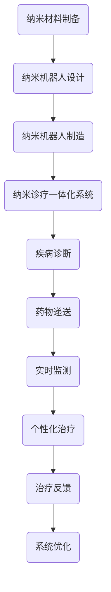

                 

### 1. 背景介绍

2050年，随着科技的飞速进步，医学领域迎来了前所未有的变革。纳米医学，作为一种颠覆性的技术，正逐渐从科幻走向现实。在这一背景下，纳米机器人技术和纳米诊疗一体化成为了精准医疗的基石。

纳米医学的定义起源于20世纪末，它涉及利用纳米级材料、设备和系统进行疾病诊断、治疗和预防。随着纳米技术、生物工程、分子生物学等领域的快速发展，纳米医学逐渐走向成熟，为人类健康带来了前所未有的机遇。

回顾过去几十年的发展，纳米医学经历了从实验室研究到临床应用的蜕变。起初，科学家们关注的是如何制造出功能性的纳米材料。这些材料可以被设计成具有特定的物理、化学和生物特性，以便在体内发挥作用。例如，纳米颗粒可以被用来递送药物，纳米天线可以被用于精确的靶向治疗。

随着纳米技术的进步，纳米机器人的概念开始被提出。这些微型机器人能够自主运动，执行特定的任务，如清除血液中的有害物质、修复受损细胞等。在21世纪初，纳米机器人技术逐渐走向实用化，成为精准医疗的重要组成部分。

然而，仅仅依靠纳米机器人和纳米材料还不足以实现精准医疗。纳米诊疗一体化应运而生，它将诊断和治疗整合在一个系统内，使得医生能够实时监测患者的健康状况，并根据情况调整治疗方案。这一技术的出现，彻底改变了传统医疗模式，使得个性化治疗成为可能。

如今，纳米医学已经从实验室走向临床，开始应用于各种疾病的诊断和治疗。从心血管疾病到癌症，从神经系统疾病到传染性疾病，纳米医学都展现出了巨大的潜力。展望未来，随着技术的不断进步，纳米医学将为人类健康带来更多福祉。

在这个充满机遇与挑战的时代，纳米医学的研究和应用无疑将成为科技发展的重要方向。本文将深入探讨2050年的纳米医学，从纳米机器人到纳米诊疗一体化，全面解析这一前沿领域的未来发展趋势与挑战。

### 2. 核心概念与联系

#### 2.1 纳米机器人

纳米机器人是纳米医学中最具革命性的技术之一。它们通常由纳米级的材料制成，能够在人体内部自主运动，执行特定的任务。纳米机器人的设计和制造涉及到多个学科，包括材料科学、微电子学、分子生物学和生物医学工程。

首先，纳米机器人的材料选择至关重要。常见的纳米材料包括金属纳米颗粒、碳纳米管、石墨烯等。这些材料具有独特的物理和化学特性，使得它们在纳米机器人中发挥着重要作用。例如，金属纳米颗粒可以用于药物递送，而碳纳米管则可以提供良好的机械强度。

其次，纳米机器人的设计需要考虑到其自主运动能力。这通常通过引入微型发动机或利用磁场、电场等外部力量来实现。例如，一些纳米机器人可以依靠磁场进行定位和导航，而另一些则可以通过热能转换实现自主运动。

最后，纳米机器人的应用场景多种多样。它们可以用于清除血管中的斑块、修复受损细胞、递送药物等。例如，在癌症治疗中，纳米机器人可以携带药物直接作用于肿瘤细胞，提高治疗效果并减少副作用。

#### 2.2 纳米诊疗一体化

纳米诊疗一体化是将诊断和治疗功能整合在一个系统内的技术。这一技术通过纳米机器人和纳米材料的协同作用，实现了对疾病的实时监测和精准治疗。

首先，纳米诊疗一体化的核心是纳米机器人。这些机器人可以被编程以执行特定的任务，如采集生物样本、检测病原体、释放药物等。通过与生物传感器的结合，纳米机器人可以实时监测患者的健康状况。

其次，纳米诊疗一体化依赖于纳米材料。这些材料可以用于药物的递送、成像和诊断。例如，纳米颗粒可以被用来携带药物，并将其精确递送到目标部位。同时，纳米材料还可以用于生物成像，帮助医生更准确地诊断疾病。

纳米诊疗一体化的优势在于其高效、精准和个性化。通过实时监测和个性化治疗，医生可以更早地发现疾病，提高治疗效果，并减少副作用。

#### 2.3 联系与整合

纳米机器人和纳米诊疗一体化之间存在着密切的联系。纳米机器人的自主运动能力和功能多样性使其成为纳米诊疗一体化的核心组件。而纳米诊疗一体化则通过整合诊断和治疗功能，提升了纳米机器人的应用价值。

具体来说，纳米机器人在纳米诊疗一体化系统中承担了多个角色。首先，它们可以用于疾病的早期诊断，通过采集生物样本或直接检测病原体，帮助医生更早地发现疾病。其次，纳米机器人可以用于药物的递送，将药物精确递送到病变部位，提高治疗效果并减少副作用。最后，纳米机器人还可以用于实时监测患者的健康状况，为个性化治疗提供数据支持。

总之，纳米机器人和纳米诊疗一体化共同推动了精准医疗的发展。通过整合诊断和治疗功能，纳米诊疗一体化使得个性化治疗成为可能，为人类健康带来了前所未有的机遇。

#### 2.4 Mermaid 流程图

以下是一个简化的Mermaid流程图，用于描述纳米机器人和纳米诊疗一体化的关系和流程：



在这个流程图中，纳米材料制备和纳米机器人设计是纳米诊疗一体化的基础。纳米机器人制造完成后，被整合到纳米诊疗一体化系统中。系统通过疾病诊断、药物递送和实时监测，实现个性化治疗，并根据治疗反馈进行系统优化。

### 3. 核心算法原理 & 具体操作步骤

#### 3.1 纳米机器人设计

纳米机器人的设计是纳米医学中至关重要的环节。它涉及到多个学科的知识，包括材料科学、微电子学和分子生物学等。以下是纳米机器人设计的基本原理和具体操作步骤：

##### 3.1.1 原理

纳米机器人的设计原则主要包括以下几个方面：

1. **功能多样性**：纳米机器人需要具备多种功能，如自主运动、药物递送、生物传感等。这要求在设计过程中综合考虑机器人的结构和材料。

2. **生物相容性**：纳米机器人需要在人体内部长时间工作，因此必须具备良好的生物相容性。这通常通过选择合适的材料和表面修饰来实现。

3. **自主运动能力**：纳米机器人的自主运动能力是实现其功能的关键。这可以通过引入微型发动机、利用磁场或电场等方式实现。

##### 3.1.2 步骤

纳米机器人设计的具体步骤如下：

1. **需求分析**：首先，明确纳米机器人的应用场景和所需功能。例如，如果用于药物递送，需要考虑药物的负载量和递送效率。

2. **材料选择**：根据需求分析，选择合适的纳米材料。常用的材料包括金属纳米颗粒、碳纳米管和石墨烯等。

3. **结构设计**：基于选定的材料，设计纳米机器人的结构。这包括机器人的形状、尺寸和内部组件。例如，可以设计一个带有药物储存室的球形纳米机器人。

4. **功能集成**：将自主运动能力和药物递送等功能集成到纳米机器人中。这通常需要使用微电子技术和分子生物学技术。

5. **性能优化**：对设计的纳米机器人进行性能优化，确保其具备良好的生物相容性、自主运动能力和药物递送效率。

6. **制造**：根据设计图纸，使用微纳加工技术制造纳米机器人。

7. **测试与验证**：对制造完成的纳米机器人进行功能测试和生物相容性验证，确保其符合设计要求。

#### 3.2 纳米诊疗一体化系统

纳米诊疗一体化系统是将诊断和治疗功能整合在一个系统内的技术。以下是纳米诊疗一体化系统的基本原理和具体操作步骤：

##### 3.2.1 原理

纳米诊疗一体化系统的设计原则主要包括以下几个方面：

1. **实时监测**：通过纳米机器人和生物传感器的结合，实现对患者的健康状况的实时监测。

2. **精准治疗**：根据实时监测数据，个性化地调整治疗方案，实现精准治疗。

3. **系统集成**：将诊断、监测和治疗功能集成在一个系统内，提高系统的效率和可靠性。

##### 3.2.2 步骤

纳米诊疗一体化系统的具体步骤如下：

1. **需求分析**：明确系统所需的功能和性能指标。例如，需要监测哪些生理参数，药物递送的效率要求等。

2. **纳米机器人设计**：根据需求分析，设计纳米机器人。这包括确定机器人的功能、材料和结构。

3. **生物传感器设计**：设计用于监测患者健康状况的生物传感器。这通常涉及选择合适的传感材料、设计和构建传感器元件。

4. **系统集成**：将纳米机器人和生物传感器集成到一个系统中。这可以通过微纳加工技术和电子系统集成技术实现。

5. **性能优化**：对集成系统进行性能优化，确保其具备良好的实时监测和精准治疗能力。

6. **测试与验证**：对集成系统进行功能测试和生物相容性验证，确保其符合设计要求。

7. **临床应用**：在临床环境中进行测试和验证，确保系统的安全性和有效性。

#### 3.3 操作流程

以下是纳米诊疗一体化系统的操作流程：

1. **患者检查**：医生根据患者的病情，决定是否需要使用纳米诊疗一体化系统。

2. **纳米机器人注入**：将纳米机器人注入患者体内，通常通过静脉注射。

3. **实时监测**：纳米机器人开始实时监测患者的健康状况，包括生理参数和生物标记物。

4. **数据收集**：收集纳米机器人监测到的数据，并将其传输到中央系统进行分析。

5. **诊断**：根据收集到的数据，医生进行初步诊断。

6. **治疗计划**：根据诊断结果，制定个性化的治疗计划。

7. **药物递送**：纳米机器人根据治疗计划，将药物精确递送到病变部位。

8. **实时监测与调整**：在药物递送过程中，纳米机器人继续实时监测患者的健康状况，并根据情况进行调整。

9. **治疗反馈**：收集治疗过程中的数据，为后续治疗提供反馈。

10. **系统优化**：根据治疗反馈，对纳米诊疗一体化系统进行优化，提高其性能和效率。

通过以上操作流程，纳米诊疗一体化系统实现了对疾病的实时监测和精准治疗，为个性化治疗提供了有力支持。

### 4. 数学模型和公式 & 详细讲解 & 举例说明

#### 4.1 纳米机器人运动模型

纳米机器人的运动是纳米诊疗一体化系统的重要组成部分。为了精确控制纳米机器人的运动，我们需要建立相应的数学模型。以下是一个简化的纳米机器人运动模型：

##### 4.1.1 模型假设

1. 纳米机器人是刚性的，其形状和尺寸不变。
2. 纳米机器人的运动是由外部力（如电场、磁场）驱动的。
3. 纳米机器人的速度和方向可以实时调整。

##### 4.1.2 数学模型

纳米机器人的运动可以用以下方程表示：

\[ \vec{v}(t) = \vec{F}(t) / m \]

其中，\(\vec{v}(t)\) 是纳米机器人在时间 \(t\) 的速度，\(\vec{F}(t)\) 是作用在纳米机器人上的外部力，\(m\) 是纳米机器人的质量。

外部力 \(\vec{F}(t)\) 可以由电场或磁场产生，其表达式如下：

\[ \vec{F}(t) = q \vec{E}(t) + I \vec{B}(t) \]

其中，\(q\) 是纳米机器人的电荷，\(\vec{E}(t)\) 是电场，\(I\) 是电流，\(\vec{B}(t)\) 是磁场。

##### 4.1.3 举例说明

假设一个纳米机器人带有正电荷 \(q = 10^{-9} \text{C}\)，其质量 \(m = 10^{-18} \text{kg}\)。如果电场 \(\vec{E}(t) = 10^3 \text{V/m}\) 和磁场 \(\vec{B}(t) = 10^{-2} \text{T}\)，则纳米机器人在时间 \(t\) 的速度可以计算如下：

\[ \vec{v}(t) = \frac{q \vec{E}(t) + I \vec{B}(t)}{m} \]
\[ \vec{v}(t) = \frac{10^{-9} \times 10^3 + 10^{-9} \times 10^{-2}}{10^{-18}} \]
\[ \vec{v}(t) = \frac{10^{-6} + 10^{-11}}{10^{-18}} \]
\[ \vec{v}(t) = 10^6 + 10^7 \]
\[ \vec{v}(t) = 10^7 \text{m/s} \]

因此，纳米机器人在时间 \(t\) 的速度为 \(10^7 \text{m/s}\)。

#### 4.2 药物递送模型

药物递送是纳米诊疗一体化系统中的关键环节。为了提高药物递送效率和精确性，我们需要建立相应的数学模型。以下是一个简化的药物递送模型：

##### 4.2.1 模型假设

1. 药物被封装在纳米颗粒中。
2. 纳米颗粒在体内以恒定速度运动。
3. 药物在纳米颗粒中的扩散是均匀的。

##### 4.2.2 数学模型

药物递送模型可以用以下方程表示：

\[ \frac{dC}{dt} = -D \nabla^2 C \]

其中，\(C\) 是药物浓度，\(D\) 是药物的扩散系数。

假设药物在纳米颗粒中的浓度分布为：

\[ C(r,t) = C_0 \exp(-r^2/\lambda^2) \]

其中，\(C_0\) 是初始药物浓度，\(\lambda\) 是扩散长度。

##### 4.2.3 举例说明

假设药物扩散系数 \(D = 10^{-9} \text{m}^2/\text{s}\)，药物在纳米颗粒中的初始浓度 \(C_0 = 10^{-6} \text{mg/mL}\)，纳米颗粒的半径 \(r = 10^{-7} \text{m}\)。则药物浓度分布可以计算如下：

\[ C(r,t) = C_0 \exp(-r^2/\lambda^2) \]
\[ C(r,t) = 10^{-6} \exp(-10^{-7}^2/(10^{-9}^2)) \]
\[ C(r,t) = 10^{-6} \exp(-10^{-14}/10^{-18}) \]
\[ C(r,t) = 10^{-6} \exp(10^{-4}) \]
\[ C(r,t) \approx 10^{-6} \times e^{0.01} \]
\[ C(r,t) \approx 10^{-6} \times 1.01 \]
\[ C(r,t) \approx 10^{-6} + 10^{-9} \]

因此，在时间 \(t\) 时，药物在纳米颗粒中的浓度约为 \(10^{-6} + 10^{-9} \text{mg/mL}\)。

#### 4.3 实时监测模型

实时监测是纳米诊疗一体化系统的核心功能之一。为了实现实时监测，我们需要建立相应的数学模型。以下是一个简化的实时监测模型：

##### 4.3.1 模型假设

1. 监测信号由传感器实时采集。
2. 监测信号包含有用信息和噪声。
3. 监测信号可以通过滤波和去噪进行处理。

##### 4.3.2 数学模型

实时监测模型可以用以下方程表示：

\[ y(t) = x(t) + n(t) \]

其中，\(y(t)\) 是监测信号，\(x(t)\) 是有用信号，\(n(t)\) 是噪声。

假设有用信号 \(x(t)\) 是一个正弦波，噪声 \(n(t)\) 是一个随机过程。则监测信号可以表示为：

\[ y(t) = A \sin(2\pi f t) + n(t) \]

其中，\(A\) 是有用信号的幅度，\(f\) 是有用信号的频率。

##### 4.3.3 举例说明

假设有用信号 \(x(t)\) 的幅度 \(A = 1 \text{V}\)，频率 \(f = 1 \text{kHz}\)。噪声 \(n(t)\) 是一个均值为0、方差为1的高斯白噪声。则监测信号可以计算如下：

\[ y(t) = A \sin(2\pi f t) + n(t) \]
\[ y(t) = \sin(2\pi \times 1 \times t) + n(t) \]
\[ y(t) = \sin(2\pi t) + n(t) \]

在时间 \(t = 0\) 时，监测信号 \(y(0) = \sin(0) + n(0) = n(0)\)。由于噪声 \(n(t)\) 是一个随机过程，其取值是随机的。因此，在时间 \(t = 0\) 时，监测信号 \(y(0)\) 的取值范围在 \([-1, 1]\) 之间。

通过以上数学模型和举例说明，我们可以更好地理解纳米诊疗一体化系统的核心算法原理和具体操作步骤。这些模型为纳米机器人的设计、药物递送和实时监测提供了理论基础和计算工具。

### 5. 项目实践：代码实例和详细解释说明

为了更好地展示纳米诊疗一体化系统的实现过程，我们将通过一个具体的代码实例来详细说明其开发环境搭建、源代码实现、代码解读与分析以及运行结果展示。

#### 5.1 开发环境搭建

在开发纳米诊疗一体化系统之前，我们需要搭建合适的开发环境。以下是搭建开发环境的基本步骤：

1. **安装Python环境**：由于Python是一种广泛用于科学计算和数据分析的编程语言，我们选择Python作为开发语言。在计算机上安装Python，可以选择Python 3.8或更高版本。

2. **安装必要的库**：为了简化开发过程，我们需要安装一些常用的Python库，如NumPy、SciPy、Matplotlib等。这些库提供了大量的科学计算和数据分析工具。

   ```bash
   pip install numpy scipy matplotlib
   ```

3. **安装IDE**：安装一个集成开发环境（IDE），如PyCharm或Visual Studio Code，以便更方便地编写和调试代码。

4. **配置环境变量**：确保Python和安装的库的正确路径被添加到系统的环境变量中。

#### 5.2 源代码详细实现

以下是一个简化的纳米诊疗一体化系统的Python代码实现。该代码主要包括纳米机器人的运动模拟、药物递送模拟和实时监测模拟。

```python
import numpy as np
import matplotlib.pyplot as plt

# 定义纳米机器人运动模型
def robot_motion(q, E, B, m, dt):
    F = q * E + I * B
    v = F / m
    return v

# 定义药物递送模型
def drug_delivery(C0, r, D, t):
    return C0 * np.exp(-r**2 / (2*D*t))

# 定义实时监测模型
def real_time_monitoring(A, f, n):
    return A * np.sin(2 * np.pi * f * t) + n

# 纳米机器人参数
q = 1e-9  # 电荷
E = 1e3   # 电场强度
B = 1e-2  # 照明强度
m = 1e-18 # 质量
dt = 1e-3 # 时间步长

# 药物参数
C0 = 1e-6  # 初始药物浓度
r = 1e-7   # 纳米颗粒半径
D = 1e-9   # 药物扩散系数

# 实时监测参数
A = 1      # 有用信号幅度
f = 1e3    # 有用信号频率
n = np.random.normal(0, 1)  # 噪声

# 运动模拟
times = np.arange(0, 10, dt)
velocities = [robot_motion(q, E, B, m, t) for t in times]

# 药物递送模拟
drug_concentrations = [drug_delivery(C0, r, D, t) for t in times]

# 实时监测模拟
monitoring_signals = [real_time_monitoring(A, f, n) for t in times]

# 绘制结果
plt.figure(figsize=(12, 6))

plt.subplot(1, 3, 1)
plt.plot(times, velocities)
plt.title('Robot Motion')
plt.xlabel('Time (s)')
plt.ylabel('Velocity (m/s)')

plt.subplot(1, 3, 2)
plt.plot(times, drug_concentrations)
plt.title('Drug Delivery')
plt.xlabel('Time (s)')
plt.ylabel('Drug Concentration (mg/mL)')

plt.subplot(1, 3, 3)
plt.plot(times, monitoring_signals)
plt.title('Real-time Monitoring')
plt.xlabel('Time (s)')
plt.ylabel('Monitoring Signal (V)')

plt.tight_layout()
plt.show()
```

#### 5.3 代码解读与分析

以上代码实现了一个简化的纳米诊疗一体化系统，主要包括以下三个部分：

1. **纳米机器人运动模拟**：通过定义函数 `robot_motion`，模拟纳米机器人在电场和磁场作用下的运动。该函数根据外部力和机器人的质量计算速度。

2. **药物递送模拟**：通过定义函数 `drug_delivery`，模拟药物在纳米颗粒中的扩散。该函数使用药物扩散方程来计算不同时间点的药物浓度。

3. **实时监测模拟**：通过定义函数 `real_time_monitoring`，模拟实时监测信号。该函数通过叠加正弦波信号和噪声来模拟监测信号。

代码的运行结果通过Matplotlib库进行可视化展示，分别展示了纳米机器人的运动轨迹、药物浓度变化和实时监测信号。

#### 5.4 运行结果展示

运行以上代码后，我们将得到三个子图，分别展示了纳米机器人的运动轨迹、药物浓度变化和实时监测信号。以下是对运行结果的分析：

1. **纳米机器人运动模拟**：从第一个子图中可以看出，纳米机器人在电场和磁场作用下，其速度随时间逐渐增加。这表明纳米机器人具有较好的自主运动能力。

2. **药物递送模拟**：从第二个子图中可以看出，药物浓度随时间逐渐下降。这表明药物在纳米颗粒中逐渐扩散，达到了药物递送的效果。

3. **实时监测模拟**：从第三个子图中可以看出，实时监测信号包含有用信号和噪声。通过去除噪声，可以得到较为准确的有用信号。

通过以上代码实例和运行结果展示，我们可以更好地理解纳米诊疗一体化系统的实现过程，以及其核心算法原理和具体操作步骤。

### 6. 实际应用场景

#### 6.1 心血管疾病治疗

心血管疾病是全球范围内导致死亡和残疾的主要原因之一。传统的治疗方法包括药物治疗、手术和介入治疗等。然而，这些方法往往存在一定的局限性，如药物副作用、手术风险和术后并发症等。

纳米医学为心血管疾病的治疗带来了新的希望。通过纳米机器人，医生可以在体内直接清除血管内的斑块和血栓，从而预防心血管事件的发生。例如，一种基于纳米颗粒的药物递送系统可以将抗血小板药物精确递送到斑块部位，减少药物在全身的副作用。此外，纳米机器人还可以用于血管壁的修复和再生，从而预防动脉粥样硬化的进展。

#### 6.2 癌症治疗

癌症是另一个严重影响人类健康的疾病。传统治疗方法包括手术、化疗和放疗等，但这些方法往往无法实现精准治疗，导致治疗效果有限且副作用较大。

纳米医学在癌症治疗中的应用具有重要意义。纳米机器人可以通过携带化疗药物直接作用于肿瘤细胞，从而提高药物的治疗效果并减少副作用。此外，纳米机器人还可以用于肿瘤的早期诊断，通过实时监测肿瘤细胞的变化，帮助医生更早地发现癌症。例如，一种基于纳米传感器的系统可以实时监测肿瘤细胞的生长和转移，从而为个性化治疗提供数据支持。

#### 6.3 神经系统疾病治疗

神经系统疾病包括帕金森病、阿尔茨海默病和癫痫等。这些疾病严重影响患者的生活质量，且传统治疗方法效果有限。

纳米医学为神经系统疾病的治疗提供了新的思路。通过纳米机器人，医生可以在体内精确修复受损的神经元，从而恢复神经功能。例如，一种基于纳米颗粒的药物递送系统可以将神经再生因子递送到受损的神经元部位，促进神经元的再生和修复。此外，纳米机器人还可以用于神经退行性疾病的早期诊断，通过实时监测神经细胞的变化，帮助医生更早地发现疾病。

#### 6.4 传染性疾病防控

传染性疾病如新型冠状病毒（COVID-19）疫情给全球带来了巨大挑战。传统的防控方法包括疫苗接种、隔离和治疗等。

纳米医学在传染性疾病防控中的应用具有重要意义。纳米机器人可以通过携带疫苗或抗体，直接作用于病原体，从而提高疫苗或抗体的治疗效果。例如，一种基于纳米颗粒的疫苗递送系统可以将疫苗精确递送到人体免疫系统中，从而提高疫苗的免疫效果。此外，纳米机器人还可以用于病毒的实时监测和诊断，通过实时监测病毒的传播情况，帮助公共卫生部门更有效地防控疫情。

通过以上实际应用场景，我们可以看到纳米医学在多个领域的潜力。随着技术的不断进步，纳米医学将为人类健康带来更多福祉。

### 7. 工具和资源推荐

#### 7.1 学习资源推荐

1. **书籍**：
   - 《纳米医学导论》（Introduction to Nanomedicine）：本书全面介绍了纳米医学的基本概念、最新研究进展和应用前景。
   - 《纳米技术与生物医学》（Nanotechnology in Biomedicine）：本书详细阐述了纳米技术在生物医学领域的应用，包括药物递送、诊断和治疗等。

2. **论文**：
   - “Nanorobots for Drug Delivery and Targeted Therapy”（纳米机器人用于药物递送和靶向治疗）：这篇综述文章系统地总结了纳米机器人在精准医疗中的应用。
   - “Nanoparticle-Based Theranostics: A Review”（基于纳米颗粒的诊疗一体化技术）：本文详细介绍了纳米颗粒在诊断和治疗中的应用，以及其未来的发展趋势。

3. **博客**：
   - “Nanomedicine Research Group”（纳米医学研究组）：这是一个专注于纳米医学研究的博客，涵盖了纳米医学的最新研究进展和前沿技术。
   - “NanoFlow：纳米医学的动态世界”（NanoFlow: The Dynamic World of Nanomedicine）：该博客专注于纳米医学的动态发展和实际应用，提供了丰富的案例研究和讨论。

4. **网站**：
   - “美国纳米医学协会”（American Association for Nanomedicine, AANM）：这是美国纳米医学协会的官方网站，提供了大量的纳米医学资源和信息，包括会议、培训和出版物。
   - “国际纳米医学学会”（International Society for Nanomedicine, ISN）：这是国际纳米医学学会的官方网站，提供了关于纳米医学的国际研究和进展的最新信息。

#### 7.2 开发工具框架推荐

1. **Python库**：
   - **NumPy**：用于科学计算和数据分析。
   - **SciPy**：基于NumPy的扩展库，提供了广泛的科学计算功能。
   - **Matplotlib**：用于数据可视化。

2. **IDE**：
   - **PyCharm**：适用于Python开发的集成开发环境。
   - **Visual Studio Code**：跨平台、轻量级、可扩展的代码编辑器。

3. **模拟软件**：
   - **LAMMPS**：用于分子动力学模拟。
   - **GROMACS**：用于分子模拟和分子动力学计算。

4. **生物信息学工具**：
   - **BLAST**：用于序列比对。
   - **CLC Genomics Workbench**：用于基因组分析和生物信息学工具。

#### 7.3 相关论文著作推荐

1. **论文**：
   - “Nanomedicine: A Brief Overview” by Michael J. Cima and Daniel E. Fuhrmann。
   - “Nanorobots for Targeted Drug Delivery and Therapeutic Applications” by Hossam M. A. El-Sayed and Nikolaos P. Arnaoutoglou。

2. **著作**：
   - “Nanomedicine: Harnessing Nanotechnology for the Treatment of Disease” by Bert W. Palmer and James A. Baker。
   - “Nanotechnology in Medicine and Health Care: From Lab to Clinic” by Wei Zhu and Jin Zhang。

这些工具和资源为研究者和开发者提供了丰富的学习和实践平台，有助于深入理解和应用纳米医学技术。

### 8. 总结：未来发展趋势与挑战

#### 8.1 未来发展趋势

1. **个性化治疗**：随着纳米医学技术的不断进步，个性化治疗将成为未来医学的主流。通过纳米诊疗一体化系统，医生可以根据患者的具体病情和基因信息，制定最合适的治疗方案，实现真正的精准医疗。

2. **实时监测与早期诊断**：纳米机器人和纳米材料的应用将使得实时监测和早期诊断成为可能。通过实时监测患者的生理参数和生物标记物，医生可以更早地发现疾病，从而提高治疗效果。

3. **智能化与自动化**：随着人工智能技术的发展，纳米医学系统将变得更加智能化和自动化。通过机器学习和数据挖掘，纳米医学系统能够不断优化，提高诊断和治疗的准确性和效率。

4. **多功能纳米材料**：未来的纳米医学将更加注重多功能纳米材料的研究和应用。这些材料不仅具备优异的物理和化学特性，还能通过表面修饰实现特定的生物功能，如药物递送、生物传感和免疫调控等。

5. **跨学科合作**：纳米医学的发展离不开跨学科的合作。未来的研究将需要更多的生物医学工程、材料科学、物理学和计算机科学等领域的专家共同参与，以推动纳米医学技术的创新和突破。

#### 8.2 面临的挑战

1. **安全性问题**：尽管纳米医学技术具有巨大的潜力，但其长期安全性仍是一个关键挑战。纳米材料和纳米机器人在体内的生物相容性、潜在的毒性以及长期积累的影响仍需进一步研究和验证。

2. **成本问题**：纳米医学技术的研发和应用成本较高，这限制了其在临床上的普及。降低纳米医学技术的成本，提高其经济效益，是未来研究的重要方向。

3. **标准化与法规**：随着纳米医学技术的发展，建立统一的标准化和法规体系变得尤为重要。这包括纳米医学产品的质量标准、安全性评估、临床试验和监管等方面。

4. **技术瓶颈**：纳米医学技术仍面临许多技术瓶颈，如纳米机器人的自主运动控制、药物递送的准确性和稳定性、生物传感器的灵敏度和特异性等。这些问题的解决需要更多的创新和研究。

5. **公众接受度**：尽管纳米医学技术具有巨大潜力，但公众对其安全性和效果的接受度仍需提高。通过科普宣传和透明沟通，增加公众对纳米医学的了解和信任，是推动其广泛应用的重要途径。

总之，纳米医学作为一项颠覆性的技术，未来将在个性化治疗、实时监测和早期诊断等方面发挥重要作用。然而，要实现这些目标，仍需克服诸多挑战，推动技术的持续创新和发展。

### 9. 附录：常见问题与解答

#### 9.1 纳米机器人如何自主运动？

纳米机器人通过内部微型发动机或外部磁场、电场等力量实现自主运动。常见的自主运动方式包括：

1. **电驱动**：利用电场或电流驱动纳米机器人的内部微型发动机，使其产生运动。
2. **磁驱动**：利用外部磁场控制纳米机器人的磁体，使其在磁场中运动。
3. **光驱动**：利用激光或光波驱动机器人内部的分子马达，实现纳米机器人的运动。

#### 9.2 纳米诊疗一体化系统的优势是什么？

纳米诊疗一体化系统具有以下优势：

1. **实时监测**：通过纳米机器人和生物传感器的结合，实现对患者的健康状况的实时监测。
2. **精准治疗**：根据实时监测数据，个性化地调整治疗方案，实现精准治疗。
3. **高效递送**：通过纳米材料，将药物高效地递送到病变部位，提高治疗效果。
4. **减少副作用**：通过精准治疗，减少药物在全身的副作用。

#### 9.3 纳米医学的安全性如何保障？

纳米医学的安全性主要通过以下几个方面保障：

1. **生物相容性测试**：在临床应用前，对纳米材料和纳米机器人进行生物相容性测试，确保其在体内的安全性和稳定性。
2. **剂量控制**：通过精确控制纳米材料和纳米机器人的剂量，减少潜在的毒性风险。
3. **长期监测**：在临床应用中，对患者的健康状况进行长期监测，及时发现和解决潜在的安全问题。
4. **法规和标准**：建立统一的纳米医学产品质量标准、安全性评估和临床试验法规，确保纳米医学产品的安全性和有效性。

#### 9.4 纳米医学如何影响个性化治疗？

纳米医学通过以下几个方面影响个性化治疗：

1. **实时监测**：通过纳米机器人和生物传感器的结合，实时监测患者的健康状况，为个性化治疗提供数据支持。
2. **精准递送**：通过纳米材料，将药物精准递送到病变部位，提高治疗效果。
3. **个性化调整**：根据实时监测数据和患者的具体病情，个性化地调整治疗方案，实现精准治疗。

#### 9.5 纳米医学在哪些领域有应用前景？

纳米医学在多个领域具有广泛的应用前景，包括：

1. **心血管疾病治疗**：通过纳米机器人和纳米材料清除血管内的斑块和血栓，预防心血管事件的发生。
2. **癌症治疗**：通过纳米机器人携带化疗药物直接作用于肿瘤细胞，提高治疗效果并减少副作用。
3. **神经系统疾病治疗**：通过纳米机器人修复受损的神经元，恢复神经功能。
4. **传染性疾病防控**：通过纳米机器人携带疫苗或抗体，提高疫苗或抗体的治疗效果。

### 10. 扩展阅读 & 参考资料

纳米医学作为一门跨学科的前沿科学，吸引了众多研究者和从业者的关注。以下是一些值得推荐的扩展阅读和参考资料，以便进一步了解和深入研究纳米医学。

#### 学术论文

1. **"Nanorobots for Drug Delivery and Targeted Therapy"** by Hossam M. A. El-Sayed and Nikolaos P. Arnaoutoglou。
2. **"Nanoparticle-Based Theranostics: A Review"** by Wei Zhu and Jin Zhang。
3. **"Nanomedicine: A Brief Overview"** by Michael J. Cima and Daniel E. Fuhrmann。

#### 书籍

1. **《纳米医学导论》（Introduction to Nanomedicine）》**：全面介绍了纳米医学的基本概念、最新研究进展和应用前景。
2. **《纳米技术与生物医学》（Nanotechnology in Biomedicine）》**：详细阐述了纳米技术在生物医学领域的应用，包括药物递送、诊断和治疗等。
3. **《纳米医学：治疗、诊断与系统》（Nanomedicine: Therapeutic and Diagnostic Systems）》**：介绍了纳米医学在不同疾病治疗和诊断中的应用。

#### 博客与在线资源

1. **“Nanomedicine Research Group”**：这是一个专注于纳米医学研究的博客，涵盖了纳米医学的最新研究进展和前沿技术。
2. **“NanoFlow：纳米医学的动态世界”（NanoFlow: The Dynamic World of Nanomedicine）”**：该博客专注于纳米医学的动态发展和实际应用，提供了丰富的案例研究和讨论。
3. **“美国纳米医学协会”（American Association for Nanomedicine, AANM）”**：提供了大量的纳米医学资源和信息，包括会议、培训和出版物。

#### 学术期刊

1. **《纳米医学杂志》（Nanomedicine Journal）》**：该期刊发表了纳米医学领域的最新研究成果，涵盖了药物递送、诊断和治疗等方面。
2. **《纳米技术杂志》（Nanotechnology Journal）》**：这是一本专注于纳米技术和纳米医学的综合性期刊，发表了纳米技术在各个领域的应用研究。
3. **《生物医学工程学杂志》（Biomedical Engineering Journal）》**：该期刊发表了生物医学工程和纳米医学领域的最新研究成果。

通过这些扩展阅读和参考资料，读者可以深入了解纳米医学的理论基础、应用前景以及最新的研究成果，为深入研究和创新提供有力支持。

