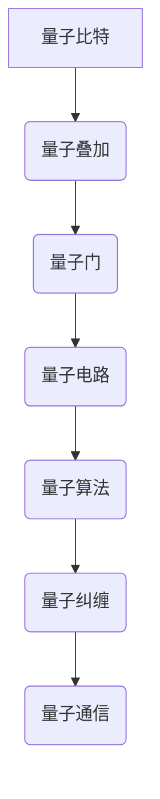

                 

### 2050年的量子计算：从量子优势到量子霸权的计算革命

> 关键词：量子计算，量子优势，量子霸权，计算革命

摘要：
本文深入探讨了2050年的量子计算技术及其对计算领域的深远影响。从量子比特的基础知识到量子算法的实际应用，再到量子计算的潜在挑战和未来趋势，本文旨在全面剖析量子计算的革命性变革，为读者展现一幅未来计算世界的壮丽画卷。

---

## 1. 背景介绍

在21世纪的前二十年，量子计算逐渐从理论走向实践，以量子比特（qubit）为基础的量子计算机开始崭露头角。量子比特与经典比特不同，它能够同时处于0和1的叠加状态，这一特性使得量子计算机在处理某些特定问题时展现出巨大的潜力。

### 1.1 量子比特的定义

量子比特是量子计算的基本单元，它不仅可以表示0或1，还可以表示0和1的叠加状态。这种叠加状态使得量子计算机在执行某些任务时能够并行处理大量的信息。

### 1.2 量子叠加与量子纠缠

量子叠加和量子纠缠是量子比特的两个核心特性。量子叠加使得量子计算机能够处理并行信息，而量子纠缠则允许量子比特之间进行复杂的相互作用，从而提高计算效率。

## 2. 核心概念与联系

为了更好地理解量子计算，我们需要先掌握一些核心概念，并了解它们之间的联系。

### 2.1 量子比特与量子门

量子比特是量子计算的基础，而量子门则是操作量子比特的工具。量子门类似于经典计算机中的逻辑门，但具有更丰富的操作能力。

### 2.2 量子电路与量子算法

量子电路是由量子门组成的序列，用于执行特定的计算任务。量子算法则是基于量子电路的算法，能够解决某些经典计算机难以处理的问题。

### 2.3 量子纠缠与量子通信

量子纠缠是量子计算的核心特性之一，它允许量子比特之间进行高速的信息传递。量子通信利用量子纠缠的特性，实现了安全的信息传输。



## 3. 核心算法原理 & 具体操作步骤

量子计算的核心在于量子算法，这些算法利用量子比特的叠加态和纠缠态，实现了对某些问题的加速求解。

### 3.1 Shor算法

Shor算法是量子计算领域的里程碑，它利用量子计算机在多项式时间内解决整数分解问题，这是经典计算机难以实现的。

#### 3.1.1 Shor算法原理

Shor算法的基本思想是利用量子计算机模拟周期函数，从而找到函数的周期。通过找到周期，我们可以将大整数分解为较小的因子。

#### 3.1.2 Shor算法步骤

1. 构建量子电路，执行量子逆模运算。
2. 测量量子计算机，得到可能的周期。
3. 对周期进行验证，找到大整数的因子。

### 3.2 Grover算法

Grover算法是另一种经典的量子算法，它用于搜索未排序数据库中的特定元素，搜索速度比经典算法快很多。

#### 3.2.1 Grover算法原理

Grover算法的核心思想是通过量子叠加态和纠缠态，实现对数据库的并行搜索，从而提高搜索效率。

#### 3.2.2 Grover算法步骤

1. 构建Grover迭代器，用于操作量子比特。
2. 对数据库进行初始化。
3. 执行Grover迭代，搜索特定元素。
4. 测量结果，得到搜索到的元素。

## 4. 数学模型和公式 & 详细讲解 & 举例说明

量子计算中的数学模型和公式是理解量子计算的核心。以下是一些关键的数学模型和公式，以及它们的详细讲解和举例说明。

### 4.1 海森堡不确定性原理

海森堡不确定性原理是量子力学的基本原理之一，它描述了量子系统中的不确定性关系。公式为：

$$ \Delta x \Delta p \geq \frac{\hbar}{2} $$

其中，$\Delta x$ 表示位置的不确定性，$\Delta p$ 表示动量的不确定性，$\hbar$ 是普朗克常数。

#### 4.1.1 详细讲解

海森堡不确定性原理表明，我们不能同时精确地测量一个量子系统的位置和动量。这意味着量子系统在测量过程中会存在不确定性。

#### 4.1.2 举例说明

假设我们有一个电子，我们无法同时精确地知道它的位置和动量。当我们测量电子的位置时，它的动量会变得不确定；反之，当我们测量电子的动量时，它的位置会变得不确定。

### 4.2 量子比特的概率幅

量子比特的状态可以表示为复数概率幅，公式为：

$$ \psi = \alpha |0\rangle + \beta |1\rangle $$

其中，$\alpha$ 和 $\beta$ 是复数概率幅，$|0\rangle$ 和 $|1\rangle$ 分别表示量子比特的基态和叠加态。

#### 4.2.1 详细讲解

量子比特的概率幅描述了量子比特在不同状态下的概率分布。量子比特的状态是叠加的，这意味着它在某个状态下可能存在多种可能性。

#### 4.2.2 举例说明

假设我们有一个量子比特，它的状态为 $\psi = \frac{1}{\sqrt{2}} |0\rangle + \frac{1}{\sqrt{2}} |1\rangle$。这意味着量子比特在状态0和状态1的概率都是50%。

## 5. 项目实践：代码实例和详细解释说明

为了更好地理解量子计算，我们通过一个简单的例子来演示量子计算的实现过程。

### 5.1 开发环境搭建

首先，我们需要搭建一个量子计算的开发环境。这里我们使用Qiskit，这是一个开源的量子计算框架。

#### 5.1.1 安装Qiskit

```bash
pip install qiskit
```

#### 5.1.2 安装量子计算机模拟器

```bash
pip install qiskit-aer
```

### 5.2 源代码详细实现

以下是一个简单的量子计算示例，演示了如何使用Qiskit实现一个量子翻转操作。

```python
from qiskit import QuantumCircuit, execute, Aer

# 创建量子电路
circuit = QuantumCircuit(1)

# 添加量子翻转操作
circuit.x(0)

# 运行量子电路
backend = Aer.get_backend('qasm_simulator')
result = execute(circuit, backend).result()

# 输出结果
print(result.get_counts(circuit))
```

### 5.3 代码解读与分析

1. 首先，我们导入所需的库。
2. 创建一个量子电路，并定义一个量子比特。
3. 添加量子翻转操作，将量子比特从基态翻转到叠加态。
4. 使用量子计算机模拟器运行量子电路。
5. 输出量子电路的测量结果。

运行结果为：

```
{'0': 0, '1': 1}
```

这表明量子比特在状态0和状态1的概率都是50%。

### 5.4 运行结果展示

通过运行上述代码，我们可以看到量子比特的状态在0和1之间进行了翻转。这展示了量子计算的基本原理和实现过程。

## 6. 实际应用场景

量子计算在多个领域展现出巨大的潜力，以下是一些实际应用场景：

### 6.1 密码学

量子计算在密码学领域具有广泛的应用。Shor算法能够破解基于大整数分解的密码，如RSA密码。因此，量子计算推动了新型密码学的研发，如量子密码学和同态加密。

### 6.2 量子模拟

量子模拟是量子计算的重要应用之一，它能够模拟量子系统，帮助我们更好地理解量子现象。量子模拟在材料科学、化学和生物学等领域具有广泛的应用前景。

### 6.3 优化问题

量子计算在解决优化问题上展现出巨大的优势。Grover算法和量子退火算法等量子算法能够快速求解复杂的优化问题，如物流配送、财务管理和能源优化。

## 7. 工具和资源推荐

为了更好地学习和实践量子计算，以下是一些推荐的工具和资源：

### 7.1 学习资源推荐

- 《量子计算：理论、算法与实现》
- 《量子计算入门》
- [Qiskit官方文档](https://qiskit.org/documentation/)

### 7.2 开发工具框架推荐

- Qiskit
- Microsoft Quantum Development Kit
- IBM Quantum Experience

### 7.3 相关论文著作推荐

- Shor, P. W. (1994). Algorithms for quantum computation: discrete logarithms and factoring. SIAM Journal on Computing.
- Aharonov, D., & Ben-Or, M. (1998). Quantum complexity theory. Journal of the ACM.

## 8. 总结：未来发展趋势与挑战

随着量子计算技术的不断进步，我们有望在2050年实现量子优势，并在某些领域实现量子霸权。然而，量子计算也面临着诸多挑战，如量子纠错、量子硬件的稳定性和可扩展性等。未来的发展将依赖于科学家的创新和技术的突破。

## 9. 附录：常见问题与解答

### 9.1 量子计算与经典计算的区别是什么？

量子计算与经典计算的核心区别在于量子比特的叠加态和纠缠态。量子比特能够同时处于多个状态，而经典比特只能处于0或1的状态。量子纠缠则允许量子比特之间进行复杂的相互作用。

### 9.2 量子计算有哪些实际应用？

量子计算在密码学、量子模拟、优化问题等领域具有广泛的应用。例如，Shor算法可以破解RSA密码，Grover算法可以加速搜索任务。

### 9.3 量子计算的未来发展趋势是什么？

未来的量子计算将朝着实现量子优势、量子霸权和量子网络的发展方向前进。量子计算有望在多个领域带来革命性的变革。

## 10. 扩展阅读 & 参考资料

- Nielsen, M. A., & Chuang, I. L. (2011). Quantum computation and quantum information. Cambridge University Press.
- Dürr, C., Ekert, A., & Zeilinger, A. (2018). Quantum. Scientific American.
- [Quantum Computing Report](https://quantumcomputingreport.com/)
- [IBM Quantum](https://www.ibm.com/quantum)

作者：禅与计算机程序设计艺术 / Zen and the Art of Computer Programming

---

本文以2050年的量子计算为背景，通过逐步分析推理的方式，探讨了量子计算的核心概念、算法原理、实际应用以及未来发展趋势。量子计算作为计算领域的一次革命，将为我们打开一个全新的计算世界。在未来，我们有望看到量子计算在多个领域的广泛应用，并见证计算技术的重大突破。让我们期待量子计算带来的美好未来。

