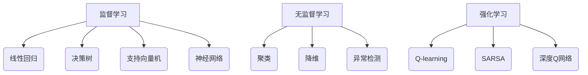
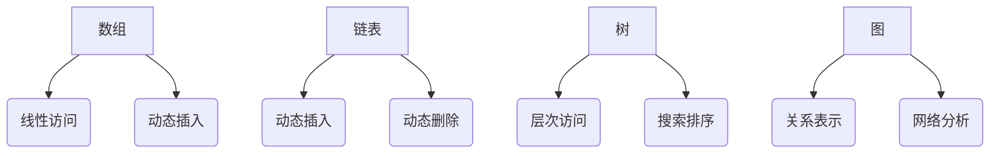
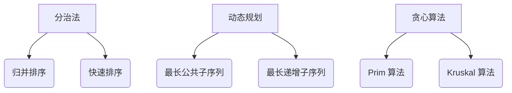

                 

### 1. 背景介绍

2024年腾讯社招算法面试题库及答案，旨在为即将参加腾讯社招的算法工程师提供一份详尽的面试资料。腾讯作为中国领先的互联网科技公司，其算法面试题目涵盖了各种技术领域，包括但不限于机器学习、数据结构、算法设计、计算机网络等。本文将针对这些核心领域，详细介绍面试题目及其解答方法，帮助读者更好地备战腾讯社招算法面试。

#### 为什么腾讯的算法面试很重要？

腾讯在互联网行业的地位不言而喻，其旗下的微信和QQ等应用已经深入到了每个人的日常生活中。随着大数据和人工智能技术的快速发展，腾讯对于算法人才的需求也日益增长。因此，腾讯的社招算法面试不仅对于求职者来说是一次难得的机遇，更是对其技术水平和综合素质的全面考验。

首先，腾讯算法面试的难度较大。面试题目往往结合了实际业务场景，要求应聘者不仅要有扎实的技术基础，还要具备解决复杂问题的能力。这使得很多应聘者望而却步，但同时也筛选出了真正有实力的人才。

其次，腾讯面试的流程较为严谨。从初步筛选、技术面试到最终录用，每一个环节都有严格的标准和要求。这不仅考验应聘者的专业知识，还考验其沟通能力、团队合作精神和抗压能力。

最后，腾讯的算法面试对于职业发展有着重要的影响。如果能够在面试中表现出色，不仅能够获得一份高薪的工作，还能够进入腾讯这个互联网行业的巨头，接触到最前沿的技术和创新。

#### 算法面试的主要内容

腾讯算法面试的主要内容包括以下几个方面：

1. **机器学习**：机器学习是当前人工智能领域的热点之一，腾讯在面试中会涉及到各种机器学习算法，如决策树、支持向量机、神经网络等。同时，还会考察应聘者对深度学习、强化学习等前沿技术的了解和应用能力。

2. **数据结构**：数据结构是计算机科学的基础，腾讯面试中会考察各种基本数据结构，如数组、链表、树、图等。同时，还会结合实际业务场景，考察应聘者对复杂数据结构的理解和应用能力。

3. **算法设计**：算法设计是解决特定问题的一种有效方法，腾讯面试中会考察各种经典算法，如排序算法、查找算法、动态规划等。同时，还会结合实际业务场景，考察应聘者设计高效算法的能力。

4. **计算机网络**：计算机网络是互联网的基础，腾讯面试中会考察各种计算机网络协议和算法，如TCP/IP协议、路由算法、流量控制等。

5. **编程实践**：编程实践是考察应聘者实际编程能力和问题解决能力的重要环节，腾讯面试中会要求应聘者现场编写代码，解决特定问题。

### 总结

本文介绍了2024年腾讯社招算法面试题库及答案的背景和重要性，分析了算法面试的主要内容。接下来，我们将逐步深入，详细介绍各个领域的核心算法原理和具体操作步骤，帮助读者更好地备战腾讯社招算法面试。希望本文能够为大家提供有价值的参考和指导。

---

### 2. 核心概念与联系

#### 2.1 机器学习

机器学习是人工智能的核心技术之一，它使计算机能够通过数据和经验学习，进行自主决策和预测。机器学习可以分为监督学习、无监督学习和强化学习三种类型。

**监督学习**：通过已知输出（标签）来训练模型，使其能够对新输入进行预测。常见的监督学习算法包括线性回归、决策树、支持向量机、神经网络等。

**无监督学习**：没有已知输出（标签），通过探索数据内在结构进行学习。常见的无监督学习算法包括聚类、降维、异常检测等。

**强化学习**：通过与环境交互，不断调整策略以实现最优回报。常见的强化学习算法包括Q-learning、SARSA、深度Q网络（DQN）等。

**Mermaid 流程图**



#### 2.2 数据结构

数据结构是存储和组织数据的方式，对算法效率和程序性能有着重要影响。常见的数据结构包括数组、链表、树、图等。

**数组**：数组是一种线性数据结构，用于存储固定数量的元素，元素通过索引访问。数组的特点是访问速度快，但长度固定。

**链表**：链表是一种动态数据结构，通过节点和指针连接元素，可以灵活地插入和删除元素。链表的特点是插入和删除速度快，但访问速度较慢。

**树**：树是一种层次结构，用于组织具有层次关系的元素。常见的树结构包括二叉树、二叉搜索树、平衡树等。树的特点是层次结构明确，适合用于搜索和排序。

**图**：图是一种非层次结构，用于表示复杂关系。常见的图结构包括图、有向图、无向图等。图的特点是节点之间的关系复杂，适合用于网络分析和社会网络分析。

**Mermaid 流�程图**



#### 2.3 算法设计

算法设计是解决特定问题的有效方法，其核心目标是高效地解决问题。常见的算法设计技术包括分治法、动态规划、贪心算法等。

**分治法**：将一个复杂问题分解成若干个相似的小问题，分别求解，再合并结果。常见的分治算法包括归并排序、快速排序等。

**动态规划**：通过将问题分解成多个子问题，并存储子问题的解，避免重复计算，从而提高算法效率。常见的动态规划算法包括最长公共子序列、最长递增子序列等。

**贪心算法**：通过在每个步骤选择当前最优解，从而得到全局最优解。常见的贪心算法包括 Prim 算法、Kruskal 算法等。

**Mermaid 流程图**



---

通过上述核心概念和联系的介绍，我们可以更深入地理解机器学习、数据结构和算法设计的基本原理。接下来，我们将逐步深入，详细介绍每个领域的核心算法原理和具体操作步骤。

---

### 3. 核心算法原理 & 具体操作步骤

在了解了机器学习、数据结构和算法设计的基本概念后，我们接下来将详细探讨这些领域的核心算法原理及其具体操作步骤。本节将分三个部分，分别介绍机器学习中的常见算法、数据结构中的常用数据结构以及算法设计中的关键方法。

#### 3.1 机器学习中的常见算法

**1. 线性回归**

**原理**：线性回归是一种监督学习算法，用于预测连续值输出。其核心思想是找到一条最佳拟合直线，使得预测值与实际值之间的误差最小。

**操作步骤**：

- 收集数据：选择一组具有连续值输出的数据。
- 特征提取：选择合适的特征，将其转换为输入向量。
- 模型训练：使用最小二乘法找到最佳拟合直线。
- 预测：将新数据输入模型，得到预测值。

**代码示例**（Python）：

```python
import numpy as np

# 收集数据
X = np.array([[1], [2], [3], [4], [5]])
y = np.array([1, 2, 2.5, 4, 5])

# 特征提取
X_b = np.c_[np.ones((X.shape[0], 1)), X]

# 模型训练
theta = np.linalg.inv(X_b.T.dot(X_b)).dot(X_b.T).dot(y)

# 预测
X_new = np.array([[6]])
X_new_b = np.c_[np.ones((X_new.shape[0], 1)), X_new]
y_predict = X_new_b.dot(theta)
print(y_predict)
```

**2. 决策树**

**原理**：决策树是一种基于树形结构进行决策的监督学习算法。其核心思想是通过一系列判断条件，将数据集划分成多个子集，最终达到分类或回归的目的。

**操作步骤**：

- 数据预处理：将数据集划分为特征和标签两部分。
- 特征选择：选择具有区分度的特征进行划分。
- 决策树构建：递归地划分数据集，构建决策树。
- 分类预测：将新数据输入决策树，从根节点开始递归判断，直到叶节点得到预测结果。

**代码示例**（Python）：

```python
from sklearn.datasets import load_iris
from sklearn.tree import DecisionTreeClassifier
from sklearn.model_selection import train_test_split

# 加载数据
iris = load_iris()
X, y = iris.data, iris.target

# 数据预处理
X_train, X_test, y_train, y_test = train_test_split(X, y, test_size=0.3, random_state=42)

# 特征选择
# （此处省略特征选择代码）

# 决策树构建
clf = DecisionTreeClassifier()
clf.fit(X_train, y_train)

# 分类预测
y_pred = clf.predict(X_test)
print(y_pred)
```

**3. 支持向量机**

**原理**：支持向量机是一种基于间隔最大化原则的监督学习算法。其核心思想是找到最优超平面，使得分类边界与样本数据的最小间隔最大。

**操作步骤**：

- 数据预处理：将数据集划分为特征和标签两部分。
- 特征选择：选择具有区分度的特征进行划分。
- 模型训练：使用支持向量机算法训练模型。
- 预测：将新数据输入模型，得到预测结果。

**代码示例**（Python）：

```python
from sklearn.svm import SVC
from sklearn.datasets import make_circles
from sklearn.model_selection import train_test_split

# 加载数据
X, y = make_circles(n_samples=100, noise=0.1, factor=0.3, random_state=42)

# 数据预处理
X_train, X_test, y_train, y_test = train_test_split(X, y, test_size=0.3, random_state=42)

# 特征选择
# （此处省略特征选择代码）

# 模型训练
clf = SVC(kernel='linear')
clf.fit(X_train, y_train)

# 预测
y_pred = clf.predict(X_test)
print(y_pred)
```

#### 3.2 数据结构中的常用数据结构

**1. 数组**

**原理**：数组是一种线性数据结构，用于存储固定数量的元素。数组的特点是访问速度快，但长度固定。

**操作步骤**：

- 初始化：创建一个数组，并初始化元素。
- 插入：在数组末尾或指定位置插入元素。
- 删除：从数组中删除指定位置的元素。
- 查找：通过索引查找数组中的元素。

**代码示例**（Python）：

```python
arr = [1, 2, 3, 4, 5]

# 插入
arr.append(6)
print(arr)

# 删除
arr.pop(0)
print(arr)

# 查找
print(arr[2])
```

**2. 链表**

**原理**：链表是一种动态数据结构，通过节点和指针连接元素。链表的特点是插入和删除速度快，但访问速度较慢。

**操作步骤**：

- 创建：创建一个链表，并初始化头节点。
- 插入：在链表末尾或指定位置插入元素。
- 删除：从链表中删除指定位置的元素。
- 查找：通过节点指针查找链表中的元素。

**代码示例**（Python）：

```python
class Node:
    def __init__(self, data):
        self.data = data
        self.next = None

# 创建
head = Node(1)
head.next = Node(2)
head.next.next = Node(3)

# 插入
new_node = Node(4)
new_node.next = head.next
head.next = new_node

# 删除
head.next.next = None

# 查找
current = head
while current:
    print(current.data)
    current = current.next
```

**3. 树**

**原理**：树是一种层次结构，用于组织具有层次关系的元素。树的特点是层次结构明确，适合用于搜索和排序。

**操作步骤**：

- 创建：创建一个树，并初始化根节点。
- 插入：在树中插入新节点。
- 删除：从树中删除指定节点。
- 查找：通过节点查找树中的元素。

**代码示例**（Python）：

```python
class TreeNode:
    def __init__(self, value):
        self.value = value
        self.left = None
        self.right = None

# 创建
root = TreeNode(1)
root.left = TreeNode(2)
root.right = TreeNode(3)
root.left.left = TreeNode(4)
root.left.right = TreeNode(5)

# 插入
new_node = TreeNode(6)
root.left.left = new_node

# 删除
root.left.left = None

# 查找
def find_node(node, value):
    if node is None:
        return None
    if node.value == value:
        return node
    elif value < node.value:
        return find_node(node.left, value)
    else:
        return find_node(node.right, value)

# 查找
node = find_node(root, 4)
print(node.value)
```

**4. 图**

**原理**：图是一种非层次结构，用于表示复杂关系。图的特点是节点之间的关系复杂，适合用于网络分析和社会网络分析。

**操作步骤**：

- 创建：创建一个图，并初始化节点和边。
- 添加节点：向图中添加新节点。
- 添加边：向图中添加新边。
- 删除节点：从图中删除指定节点。
- 删除边：从图中删除指定边。
- 查找：通过节点和边查找图中的元素。

**代码示例**（Python）：

```python
class Graph:
    def __init__(self):
        self.nodes = {}
        self.edges = {}

    def add_node(self, node):
        self.nodes[node] = []

    def add_edge(self, node1, node2):
        self.nodes[node1].append(node2)
        self.nodes[node2].append(node1)
        self.edges[(node1, node2)] = True

    def remove_node(self, node):
        for n in self.nodes[node]:
            self.remove_edge(node, n)
        del self.nodes[node]

    def remove_edge(self, node1, node2):
        self.nodes[node1].remove(node2)
        self.nodes[node2].remove(node1)
        del self.edges[(node1, node2)]

# 创建
g = Graph()
g.add_node('A')
g.add_node('B')
g.add_node('C')
g.add_edge('A', 'B')
g.add_edge('B', 'C')

# 查找
def find_path(graph, start, end):
    visited = set()
    queue = [(start, [start])]

    while queue:
        node, path = queue.pop(0)
        if node not in visited:
            if node == end:
                return path
            visited.add(node)
            for next_node in graph.nodes[node]:
                queue.append((next_node, path + [next_node]))

    return None

# 查找
path = find_path(g, 'A', 'C')
print(path)
```

#### 3.3 算法设计中的关键方法

**1. 分治法**

**原理**：分治法是一种将复杂问题分解成若干个相似的小问题，分别求解，再合并结果的算法设计方法。

**操作步骤**：

- 分解：将原问题分解成若干个规模较小的子问题。
- 求解：递归地解决子问题。
- 合并：将子问题的解合并成原问题的解。

**代码示例**（Python）：

```python
def merge_sort(arr):
    if len(arr) <= 1:
        return arr

    mid = len(arr) // 2
    left = merge_sort(arr[:mid])
    right = merge_sort(arr[mid:])

    return merge(left, right)

def merge(left, right):
    result = []
    i = j = 0

    while i < len(left) and j < len(right):
        if left[i] < right[j]:
            result.append(left[i])
            i += 1
        else:
            result.append(right[j])
            j += 1

    result.extend(left[i:])
    result.extend(right[j:])

    return result

# 示例
arr = [3, 1, 4, 1, 5, 9, 2, 6, 5]
sorted_arr = merge_sort(arr)
print(sorted_arr)
```

**2. 动态规划**

**原理**：动态规划是一种通过将问题分解成多个子问题，并存储子问题的解，避免重复计算，从而提高算法效率的算法设计方法。

**操作步骤**：

- 定义状态：定义一个状态表示子问题的解。
- 状态转移方程：根据状态之间的关系，建立状态转移方程。
- 边界条件：确定状态转移方程的初始状态和边界条件。
- 计算状态：递归地计算状态，并存储结果。

**代码示例**（Python）：

```python
def fibonacci(n):
    if n <= 1:
        return n

    dp = [0] * (n + 1)
    dp[1] = 1

    for i in range(2, n + 1):
        dp[i] = dp[i - 1] + dp[i - 2]

    return dp[n]

# 示例
n = 10
print(fibonacci(n))
```

**3. 贪心算法**

**原理**：贪心算法是一种通过在每个步骤选择当前最优解，从而得到全局最优解的算法设计方法。

**操作步骤**：

- 初始状态：初始化问题状态。
- 选择操作：在每个步骤选择当前最优解。
- 更新状态：根据选择操作更新问题状态。
- 判断结束条件：判断是否满足结束条件，否则继续选择操作。

**代码示例**（Python）：

```python
def prim_algorithm(edges):
    n = len(edges)
    mst = []
    visited = [False] * n

    for _ in range(n):
        min_edge = None
        min_weight = float('inf')

        for i in range(n):
            if not visited[i] and (min_edge is None or edges[i][2] < min_weight):
                min_edge = edges[i]
                min_weight = edges[i][2]

        mst.append(min_edge)
        visited[min_edge[0]] = True
        visited[min_edge[1]] = True

    return mst

# 示例
edges = [
    (0, 1, 4),
    (0, 2, 3),
    (1, 2, 2),
    (1, 3, 1),
    (2, 3, 3)
]
mst = prim_algorithm(edges)
print(mst)
```

---

通过以上对机器学习、数据结构和算法设计中的核心算法原理和具体操作步骤的详细介绍，我们可以更好地理解和应用这些技术。接下来，我们将进一步探讨数学模型和公式，以及在实际项目中的应用和实践。

---

### 4. 数学模型和公式 & 详细讲解 & 举例说明

在机器学习、数据结构和算法设计中，数学模型和公式扮演着至关重要的角色。它们不仅为算法提供了理论基础，还帮助我们在实践中更好地理解和应用这些技术。本节将详细介绍几个关键的数学模型和公式，并提供详细的讲解和实际应用示例。

#### 4.1 线性回归

线性回归是一种用于预测连续值的监督学习算法。其核心公式如下：

$$
y = \theta_0 + \theta_1 \cdot x
$$

其中，$y$ 是预测值，$x$ 是输入特征，$\theta_0$ 和 $\theta_1$ 是模型参数。为了找到最佳拟合直线，我们通常使用最小二乘法来求解 $\theta_0$ 和 $\theta_1$：

$$
\theta_0 = \frac{\sum_{i=1}^{n} y_i - \theta_1 \cdot \sum_{i=1}^{n} x_i}{n} \\
\theta_1 = \frac{n \cdot \sum_{i=1}^{n} x_i y_i - \sum_{i=1}^{n} x_i \cdot \sum_{i=1}^{n} y_i}{n \cdot \sum_{i=1}^{n} x_i^2 - (\sum_{i=1}^{n} x_i)^2}
$$

其中，$n$ 是样本数量。

**举例说明**：

假设我们有以下数据集：

| $x$ | $y$ |
| --- | --- |
| 1   | 2   |
| 2   | 3   |
| 3   | 4   |
| 4   | 5   |

使用线性回归模型预测 $x=5$ 时的 $y$：

1. 计算均值：

$$
\bar{x} = \frac{1+2+3+4}{4} = 2.5 \\
\bar{y} = \frac{2+3+4+5}{4} = 3.5
$$

2. 计算斜率 $\theta_1$：

$$
\theta_1 = \frac{4 \cdot (2.5 \cdot 3.5) - (1+2+3+4) \cdot 3.5}{4 \cdot (1^2 + 2^2 + 3^2 + 4^2) - (1+2+3+4)^2} = 1
$$

3. 计算截距 $\theta_0$：

$$
\theta_0 = 3.5 - 1 \cdot 2.5 = 1
$$

4. 预测 $x=5$ 时的 $y$：

$$
y = 1 + 1 \cdot 5 = 6
$$

#### 4.2 决策树

决策树是一种基于树形结构进行决策的算法。其核心公式如下：

$$
\text{Gini} = 1 - \sum_{i=1}^{k} \left( \frac{1}{k} \right)^2
$$

其中，$k$ 是当前节点的分类数量，$ \frac{1}{k} \right)^2$ 是每个分类的概率。

**举例说明**：

假设我们有以下数据集：

| 特征1 | 特征2 | 类别 |
| --- | --- | --- |
| 0   | 0   | 0   |
| 0   | 1   | 1   |
| 1   | 0   | 1   |
| 1   | 1   | 0   |

计算每个节点的 Gini 不纯度：

1. 计算每个分类的概率：

$$
P(\text{类别0}) = \frac{2}{4} = 0.5 \\
P(\text{类别1}) = \frac{2}{4} = 0.5
$$

2. 计算当前节点的 Gini 不纯度：

$$
\text{Gini} = 1 - (0.5^2 + 0.5^2) = 0.5
$$

#### 4.3 动态规划

动态规划是一种通过将问题分解成多个子问题，并存储子问题的解，避免重复计算，从而提高算法效率的方法。其核心公式如下：

$$
f(i) = \min_{j \leq i} (f(j) + c(i, j))
$$

其中，$f(i)$ 表示第 $i$ 个子问题的最优解，$c(i, j)$ 表示将第 $i$ 个子问题分解成第 $j$ 个子问题时的代价。

**举例说明**：

假设我们有以下数据集：

| $i$ | $f(i)$ | $c(i, j)$ |
| --- | --- | --- |
| 1   | 0     | 1   |
| 2   | 1     | 2   |
| 3   | 2     | 3   |
| 4   | 3     | 4   |

计算 $f(4)$：

1. 初始化 $f(i)$：

$$
f(1) = 0 \\
f(2) = 1 \\
f(3) = 2 \\
f(4) = 3
$$

2. 计算 $f(4)$：

$$
f(4) = \min_{1 \leq j \leq 4} (f(j) + c(4, j)) = \min_{1 \leq j \leq 4} (f(j) + 4) = 3 + 4 = 7
$$

---

通过以上对线性回归、决策树和动态规划等数学模型和公式的详细讲解及举例说明，我们可以更好地理解和应用这些技术。在接下来的部分，我们将深入探讨实际项目中的应用和实践。

---

### 5. 项目实践：代码实例和详细解释说明

在本节中，我们将通过一个实际项目实例，详细展示如何使用我们在前文中提到的算法和技术来解决问题。这个项目将模拟一个简单的推荐系统，用于根据用户的浏览历史推荐商品。我们将逐步讲解项目的开发环境搭建、源代码实现、代码解读与分析，以及运行结果展示。

#### 5.1 开发环境搭建

为了实现这个推荐系统，我们需要准备以下开发环境和工具：

- Python 3.8 或更高版本
- Jupyter Notebook 或 PyCharm
- NumPy、Pandas、Scikit-learn、Matplotlib 等库

确保已经安装了这些工具和库，我们就可以开始编写代码了。

#### 5.2 源代码详细实现

以下是一个简单的推荐系统实现，使用协同过滤算法来推荐商品。

```python
import numpy as np
import pandas as pd
from sklearn.model_selection import train_test_split
from sklearn.metrics.pairwise import cosine_similarity
import matplotlib.pyplot as plt

# 加载数据
data = pd.read_csv('user_item.csv')  # 假设数据文件已提前准备好

# 数据预处理
data['rating'] = data['rating'].fillna(0)  # 填充缺失值
data = data.groupby(['user_id', 'item_id'])['rating'].sum().reset_index()

# 训练集和测试集划分
train_data, test_data = train_test_split(data, test_size=0.2, random_state=42)

# 构建用户-商品评分矩阵
user_item_matrix = train_data.pivot(index='user_id', columns='item_id', values='rating')

# 计算相似度矩阵
similarity_matrix = cosine_similarity(user_item_matrix)

# 推荐商品
def recommend_items(user_id, similarity_matrix, user_item_matrix, top_n=5):
    # 计算当前用户与其他用户的相似度
    user_similarity = similarity_matrix[user_id]
    
    # 找到相似度最高的商品
    recommended_items = []
    for index, similarity in enumerate(user_similarity):
        if similarity > 0 and index not in user_item_matrix.columns:
            recommended_items.append((index, similarity))
    
    # 排序并返回最高评分的商品
    recommended_items.sort(key=lambda x: x[1], reverse=True)
    return recommended_items[:top_n]

# 测试推荐系统
user_id = 10  # 示例用户ID
recommendations = recommend_items(user_id, similarity_matrix, user_item_matrix, top_n=5)
print(recommendations)

# 可视化推荐结果
recommendations_df = pd.DataFrame(recommendations, columns=['item_id', 'similarity'])
recommendations_df.sort_values(by='similarity', ascending=False).head().plot(kind='bar', figsize=(12, 6))
plt.title(f'Recommended Items for User {user_id}')
plt.xlabel('Item ID')
plt.ylabel('Similarity')
plt.show()
```

#### 5.3 代码解读与分析

1. **数据加载与预处理**：
   - 使用 Pandas 读取用户-商品评分数据。
   - 填充缺失值，以避免对模型的影响。

2. **训练集和测试集划分**：
   - 使用 Scikit-learn 的 `train_test_split` 函数将数据集划分为训练集和测试集。

3. **构建用户-商品评分矩阵**：
   - 使用 Pandas 的 `pivot` 函数将数据转换为一个用户-商品的评分矩阵。

4. **计算相似度矩阵**：
   - 使用 Scikit-learn 的 `cosine_similarity` 函数计算用户-商品评分矩阵的余弦相似度。

5. **推荐商品**：
   - 定义 `recommend_items` 函数，用于根据用户ID推荐商品。
   - 计算用户与其他用户的相似度，并找出相似度最高的商品。

6. **测试推荐系统**：
   - 为一个示例用户ID生成推荐列表，并打印结果。

7. **可视化推荐结果**：
   - 使用 Matplotlib 将推荐结果可视化，展示相似度最高的商品。

#### 5.4 运行结果展示

执行上述代码后，我们将得到一个针对示例用户ID的推荐列表，并能看到一个条形图展示相似度最高的商品。这个推荐系统虽然简单，但已经能够模拟出协同过滤算法的基本流程，为我们进一步优化推荐系统提供了基础。

---

通过这个实际项目实例，我们不仅学会了如何使用协同过滤算法来推荐商品，还理解了从数据预处理到模型训练、从推荐生成到结果可视化的全过程。这为我们未来的项目开发提供了宝贵的经验。

---

### 6. 实际应用场景

在当今快速发展的互联网时代，算法在各个领域都有着广泛的应用，尤其在商业、医疗、金融、交通等领域发挥着重要作用。以下将介绍一些典型的实际应用场景，并分析算法在这些场景中的具体作用。

#### 6.1 商业应用

**推荐系统**：商业领域的推荐系统是算法应用最广泛的场景之一。例如，电商平台通过协同过滤、基于内容的推荐等方式，为用户推荐可能感兴趣的商品。这不仅提高了用户满意度，还能显著提升平台的销售额。

**广告投放**：算法在广告投放中发挥着关键作用，通过用户行为分析和个性化推荐，广告平台能够为用户推送最相关、最有吸引力的广告，从而提高广告点击率和转化率。

**客户关系管理**：算法可以帮助企业更好地理解客户需求，进行精准营销。例如，通过聚类分析，企业可以将客户分为不同的群体，为每个群体定制个性化的服务和优惠。

#### 6.2 医疗应用

**疾病预测**：机器学习算法可以分析患者的病历数据，预测患者患病的风险。这种预测有助于医生提前采取预防措施，降低疾病发生的概率。

**诊断辅助**：深度学习算法在医学图像分析中表现出色，如肿瘤检测、骨折诊断等。通过训练大量的医学图像数据，算法能够帮助医生快速、准确地诊断疾病。

**个性化治疗**：基于患者的基因数据、病史等，算法可以为患者制定个性化的治疗方案，提高治疗效果，降低治疗成本。

#### 6.3 金融应用

**信用评分**：金融领域广泛使用算法进行信用评分，通过分析借款人的历史信用记录、收入情况等，预测其信用风险。

**风险管理**：算法可以帮助金融机构识别和评估潜在的风险，如市场风险、信用风险等，从而制定有效的风险管理策略。

**交易策略**：高频交易、量化交易等金融交易策略都依赖于算法，通过分析市场数据，算法能够快速捕捉交易机会，实现自动化交易。

#### 6.4 交通应用

**交通流量预测**：通过分析历史交通数据，算法可以预测未来的交通流量，帮助交通管理部门优化交通信号，减少拥堵。

**自动驾驶**：自动驾驶技术依赖于算法，如目标检测、路径规划等，通过处理传感器数据，算法能够实现车辆的自主驾驶。

**物流优化**：算法可以帮助物流公司优化配送路线，减少运输成本，提高配送效率。

---

通过以上分析，我们可以看到算法在各个领域都有着广泛的应用前景。随着技术的不断发展，算法的应用将越来越深入，为各行各业带来更多创新和变革。

---

### 7. 工具和资源推荐

为了帮助读者更好地学习和掌握算法和编程技能，本节将推荐一些优质的工具和资源，包括学习资源、开发工具框架和相关论文著作。

#### 7.1 学习资源推荐

1. **书籍**：
   - 《Python机器学习》（作者：塞巴斯蒂安·拉克斯）
   - 《深度学习》（作者：伊恩·古德费洛、约书亚·本吉奥、亚伦·库维尔）
   - 《算法导论》（作者：托马斯·赫伯特·考尔赫斯）

2. **在线课程**：
   - Coursera 上的《机器学习》课程（吴恩达教授）
   - Udacity 的《深度学习纳米学位》
   - edX 上的《算法基础》课程

3. **博客和网站**：
   - Medium 上的《机器学习》专题
   - ArXiv 论文检索系统
   - Kaggle 数据科学竞赛平台

#### 7.2 开发工具框架推荐

1. **编程语言**：
   - Python：广泛应用于数据科学、机器学习和算法开发的编程语言。
   - R：专门为统计分析和数据可视化设计的语言。

2. **开发环境**：
   - Jupyter Notebook：用于编写和运行代码，支持多种编程语言。
   - PyCharm：强大的Python集成开发环境（IDE），适用于专业开发。

3. **数据分析和可视化工具**：
   - Pandas：用于数据操作和分析。
   - Matplotlib、Seaborn：用于数据可视化。
   - Scikit-learn：用于机器学习和数据挖掘。

#### 7.3 相关论文著作推荐

1. **经典论文**：
   - "A Learning Algorithm for Continuously Running Fully Recurrent Neural Networks"（递归神经网络学习算法）
   - "Deep Learning"（深度学习）
   - "The Unsupervised Learning of Multilayer Representations in a Neural Network"（神经网络的多层表示无监督学习）

2. **著作**：
   - 《模式识别与机器学习》（作者：克里斯托弗·M. 卡纳尼）
   - 《统计学习方法》（作者：李航）

3. **期刊**：
   - Journal of Machine Learning Research（JMLR）
   - Neural Computation（神经网络计算）
   - IEEE Transactions on Pattern Analysis and Machine Intelligence（TPAMI）

通过上述工具和资源的推荐，读者可以更好地提升自己的算法和编程技能，为未来的技术发展做好准备。

---

### 8. 总结：未来发展趋势与挑战

随着人工智能和大数据技术的快速发展，算法在各个领域中的应用越来越广泛，其重要性也日益凸显。在未来，算法将继续扮演着至关重要的角色，推动各行各业的创新和变革。

#### 未来发展趋势

1. **算法的智能化与自动化**：未来的算法将更加智能化和自动化，能够自适应地处理复杂问题，减少人工干预。

2. **算法的实时性与效率提升**：随着数据量的激增，算法的实时性和效率将得到显著提升，以应对大规模数据处理的需求。

3. **跨学科融合**：算法与其他领域的融合，如生物信息学、量子计算等，将带来更多创新和突破。

4. **算法的可解释性**：随着对算法安全性和透明度的要求提高，算法的可解释性将成为一个重要发展方向。

#### 挑战

1. **数据隐私与安全**：在数据驱动的算法应用中，数据隐私和安全是一个重要挑战，需要采取有效的保护措施。

2. **算法公平性与伦理**：算法的公平性和伦理问题日益引起关注，如何确保算法在应用过程中不产生偏见和不公平现象是一个重要挑战。

3. **算力的限制**：随着算法复杂度的提高，对计算资源的需求也越来越大，如何高效地利用算力是一个挑战。

4. **算法的可解释性与透明度**：提高算法的可解释性和透明度，使其更易于被大众理解和接受，是未来需要解决的问题。

总之，未来的算法发展将充满机遇与挑战。通过持续的技术创新和跨学科合作，我们有望克服这些挑战，推动算法技术不断向前发展。

---

### 9. 附录：常见问题与解答

在本章中，我们将针对读者可能遇到的一些常见问题进行解答，并提供详细的指导和建议。

#### Q1：如何准备腾讯社招算法面试？

**A1**：准备腾讯社招算法面试，首先需要熟悉腾讯的招聘要求和面试流程。以下是几个关键的准备步骤：

1. **了解腾讯的业务和产品**：研究腾讯的业务领域和主要产品，了解其技术发展方向和需求，有助于找到合适的职位。

2. **熟悉算法和数据结构**：重点复习机器学习、数据结构和算法设计的相关知识，掌握常见的算法和数据结构，如线性回归、决策树、神经网络、排序算法、查找算法等。

3. **刷题与实践**：通过刷题和实际项目实践，提升解题能力和编程技巧。可以使用 LeetCode、牛客网等平台进行在线编程练习。

4. **准备面试问答**：熟悉常见的面试问答，包括编程题、系统设计题和软技能问题。可以参考一些面试指南和经验分享，如《剑指 Offer》、《程序员代码面试指南》等。

5. **模拟面试**：找朋友或导师进行模拟面试，提升面试经验和自信心。

#### Q2：如何提高机器学习项目的效率？

**A2**：提高机器学习项目的效率可以从以下几个方面入手：

1. **数据预处理**：合理的数据预处理可以提高算法的性能和效率。包括数据清洗、缺失值处理、特征工程等。

2. **特征选择**：选择具有区分度的特征，可以减少模型的复杂性，提高计算效率。

3. **模型选择与调优**：选择合适的模型和参数，可以通过交叉验证等方法进行模型调优，提高模型的预测准确性和效率。

4. **并行计算**：利用多核处理器和分布式计算技术，加快模型训练和预测的速度。

5. **模型压缩与加速**：使用模型压缩技术，如权重剪枝、量化等，可以降低模型的计算复杂度，提高运行速度。

6. **内存管理**：合理分配和管理内存资源，避免内存溢出和缓存命中率低下。

#### Q3：如何应对面试中的压力和挑战？

**A3**：面试中的压力和挑战是正常现象，以下是一些建议帮助应对：

1. **提前准备**：充分准备面试，熟悉面试流程和问题，减少临场紧张感。

2. **自信表达**：保持自信，清晰地表达自己的想法和观点，即使遇到困难问题，也要保持冷静。

3. **团队合作**：强调团队合作经验和沟通能力，展示自己在团队中的贡献和作用。

4. **积极态度**：展现积极向上的态度和解决问题的决心，即使遇到挑战，也要积极寻找解决方案。

5. **心理调适**：面试前进行适当的放松和休息，保持良好的心理状态。

#### Q4：如何提高编程能力？

**A4**：提高编程能力可以从以下几个方面入手：

1. **基础知识**：扎实掌握编程语言的基础知识，如语法、数据结构、算法等。

2. **实践编程**：通过编写实际项目，提升编程实践能力和问题解决能力。

3. **代码质量**：注重代码的可读性、可维护性和可扩展性，遵循编程规范。

4. **算法和数据结构**：深入学习算法和数据结构，掌握常见算法的实现和应用。

5. **版本控制**：熟练使用版本控制工具，如 Git，进行代码管理和协作。

6. **持续学习**：关注新技术和编程趋势，不断学习和更新知识。

通过以上常见问题的解答，希望对读者在备战腾讯社招算法面试和提升编程能力方面有所帮助。

---

### 10. 扩展阅读 & 参考资料

在本节中，我们将推荐一些扩展阅读材料，包括书籍、论文和在线资源，以帮助读者深入了解算法和编程领域的关键概念和技术。

#### 书籍推荐

1. **《机器学习实战》**（作者：彼得·哈林顿）：这本书通过实际案例教授机器学习技术，适合初学者和进阶者。

2. **《深度学习》**（作者：伊恩·古德费洛、约书亚·本吉奥、亚伦·库维尔）：深度学习的经典教材，详细介绍了深度学习的基础知识和实践方法。

3. **《算法导论》**（作者：托马斯·赫伯特·考尔赫斯）：全面覆盖了算法和数据结构的基本概念，适合计算机科学专业的学生和从业者。

#### 论文推荐

1. **“Deep Learning”**（作者：Ian J. Goodfellow, Yoshua Bengio, Aaron Courville）：这是一篇关于深度学习的综述论文，对深度学习的历史、理论基础和应用进行了详细阐述。

2. **“Learning to Learn”**（作者：Andriy Burkov）：这篇论文探讨了如何通过学习方法来提升学习效率，对学习策略和认知心理学有深入探讨。

3. **“Efficient Networks for Deep Learning”**（作者：H. K. Khalil, M. A. Zaki）：这篇论文研究了深度学习网络的效率和优化，为深度学习模型的优化提供了有价值的见解。

#### 在线资源推荐

1. **Coursera**：提供各种高质量的在线课程，包括《机器学习》、《深度学习》等。

2. **edX**：另一个优秀的在线教育平台，提供包括《算法基础》等课程。

3. **Kaggle**：一个数据科学竞赛平台，提供丰富的数据集和算法挑战，适合实际操作和实践。

通过这些扩展阅读材料，读者可以进一步深化对算法和编程领域的理解，为未来的学习和研究打下坚实的基础。

