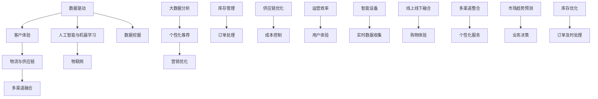

                 

### 1. 背景介绍

#### 新零售的兴起与发展

近年来，随着互联网技术的迅猛发展和消费市场的不断成熟，新零售这一概念逐渐成为企业转型升级的重要方向。新零售不仅仅是一种商业模式，更是一种全新的商业生态系统的构建。它依托于大数据、人工智能、物联网等技术，通过对用户需求的分析和满足，实现了线上线下的深度融合，从而提升消费者体验，优化运营效率。

阿里巴巴集团作为中国新零售的领军企业，其社招新零售数字化转型专家的职位吸引了大量优秀人才。这一职位的核心职责是帮助企业实现数字化转型，推动新零售业务的发展。在这个过程中，面试者需要具备广泛的技术知识、深厚的业务理解能力和出色的团队协作能力。

#### 面试题汇总的意义

本文旨在汇总和分析阿里巴巴社招新零售数字化转型专家的面试题，通过系统化的梳理，帮助准备参加面试的候选人更好地理解面试要求和考核重点。这些面试题不仅覆盖了新零售领域的基础知识，还深入探讨了数据挖掘、算法优化、系统架构等高级技术内容，旨在考察应聘者的综合能力和实际操作经验。

#### 文章结构

本文将按照以下结构进行组织：

1. **背景介绍**：阐述新零售的背景及阿里巴巴社招新零售数字化转型专家职位的重要性。
2. **核心概念与联系**：详细解释新零售的核心概念，并使用Mermaid流程图展示相关技术架构。
3. **核心算法原理 & 具体操作步骤**：深入探讨新零售中的核心算法，并逐步讲解操作步骤。
4. **数学模型和公式 & 详细讲解 & 举例说明**：介绍新零售中的数学模型，使用LaTeX格式详细讲解，并举例说明。
5. **项目实践：代码实例和详细解释说明**：通过具体的代码实例，展示新零售技术应用的实践过程。
6. **实际应用场景**：分析新零售在实际业务中的应用，探讨其带来的变革。
7. **工具和资源推荐**：推荐学习资源、开发工具和相关论文著作。
8. **总结：未来发展趋势与挑战**：总结新零售的发展趋势和面临的挑战。
9. **附录：常见问题与解答**：提供新零售领域的常见问题及解答。
10. **扩展阅读 & 参考资料**：推荐相关扩展阅读和参考资料。

通过本文的逐步分析和深入探讨，我们希望读者能够全面了解新零售领域的关键技术，为未来的职业发展做好准备。

#### 阅读指引

本文内容丰富，结构紧凑，旨在为读者提供系统化的新零售技术知识。为了更好地理解和掌握文章内容，建议读者按照以下步骤进行阅读：

1. **快速浏览全文**：首先，快速浏览全文，了解文章的主要内容和结构，为深入阅读做好准备。
2. **逐步深入阅读**：按照文章的结构，逐步深入阅读各个章节，特别是在关键概念和算法原理部分，要仔细阅读并理解。
3. **实践与思考**：在阅读过程中，结合实际案例和代码实例，进行实践操作和思考，加深对技术原理的理解。
4. **总结与回顾**：在阅读完成后，回顾全文，总结重点内容，巩固所学知识。

通过本文的阅读，读者不仅可以了解新零售领域的关键技术，还能为未来的职业发展奠定坚实基础。让我们一起探索新零售的奥秘，开启数字化转型的旅程。

### 2. 核心概念与联系

在新零售领域，理解核心概念和它们之间的联系是至关重要的。以下是新零售中的几个关键概念，以及它们如何相互关联。

#### 数据驱动

数据驱动是现代零售业的核心。通过收集和分析消费者数据，企业可以更准确地了解用户需求，制定个性化营销策略，提高销售额。数据驱动的业务模式依赖于大数据技术和数据挖掘算法。

#### 客户体验

客户体验是新零售的重要目标之一。通过优化购物流程、提供个性化服务和无缝的线上线下体验，企业能够提升客户满意度，增强品牌忠诚度。

#### 物流与供应链

物流和供应链管理在新零售中起着关键作用。高效、灵活的物流系统可以减少库存成本，提高订单处理速度，确保商品及时送达。供应链管理的优化有助于企业降低成本，提高供应链的整体效率。

#### 人工智能与机器学习

人工智能（AI）和机器学习（ML）技术在数据分析和业务决策中发挥着重要作用。通过使用这些技术，企业可以从海量数据中提取有价值的信息，预测市场趋势，优化运营流程。

#### 物联网（IoT）

物联网技术在新零售中用于实现智能设备互联，如智能货架、智能收银系统等。这些设备可以实时收集销售数据，优化库存管理，提高运营效率。

#### 多渠道融合

多渠道融合是新零售的核心特征之一。通过线上线下渠道的融合，企业能够提供更加灵活和个性化的购物体验，满足不同消费者的需求。

#### Mermaid 流程图

为了更好地展示新零售的核心概念及其相互联系，我们使用Mermaid流程图来表示：



在这个流程图中，数据驱动作为核心，连接了其他关键概念，形成了一个闭环系统。这个系统通过不断的反馈和优化，实现了新零售业务的目标。

#### 总结

通过理解这些核心概念及其相互联系，我们可以更好地把握新零售的发展方向。在新零售的实践中，企业需要将数据驱动、客户体验、物流与供应链、人工智能与机器学习、物联网、多渠道融合等多个方面有机结合，从而实现业务的全面提升。

### 3. 核心算法原理 & 具体操作步骤

在新零售领域，核心算法的作用至关重要。这些算法不仅能够帮助企业处理海量数据，还能优化业务流程，提升运营效率。以下是新零售中几个重要的核心算法原理，以及具体的操作步骤。

#### 数据挖掘算法

数据挖掘算法用于从大量数据中提取有价值的信息。常用的数据挖掘算法包括关联规则挖掘、聚类分析和分类算法。

1. **关联规则挖掘**：
   - **原理**：关联规则挖掘用于发现数据之间的关联关系。它通过支持度和置信度两个指标来判断规则的有效性。
   - **操作步骤**：
     1. 选择数据集。
     2. 确定最小支持度和最小置信度。
     3. 计算数据集中的所有可能的项集。
     4. 根据支持度和置信度筛选出有效的关联规则。

2. **聚类分析**：
   - **原理**：聚类分析用于将相似的数据点分组。常见的聚类算法包括K-均值、层次聚类和DBSCAN。
   - **操作步骤**：
     1. 选择聚类算法。
     2. 确定聚类个数或距离阈值。
     3. 对数据进行聚类。
     4. 分析聚类结果，调整参数重新聚类。

3. **分类算法**：
   - **原理**：分类算法用于将数据点归类到不同的类别。常见的分类算法包括决策树、支持向量机和朴素贝叶斯。
   - **操作步骤**：
     1. 选择分类算法。
     2. 准备训练数据集。
     3. 训练分类器。
     4. 使用分类器对新的数据进行分类。

#### 个性化推荐算法

个性化推荐算法用于根据用户的兴趣和行为，推荐相关的商品或服务。常见的个性化推荐算法包括协同过滤、基于内容的推荐和混合推荐。

1. **协同过滤**：
   - **原理**：协同过滤通过分析用户之间的行为模式，发现相似的用户或物品，进行推荐。
   - **操作步骤**：
     1. 构建用户-物品评分矩阵。
     2. 计算用户之间的相似度。
     3. 计算物品之间的相似度。
     4. 根据用户的历史行为推荐相似物品。

2. **基于内容的推荐**：
   - **原理**：基于内容的推荐通过分析物品的特征，将具有相似特征的物品推荐给用户。
   - **操作步骤**：
     1. 提取物品的特征。
     2. 计算用户对物品的偏好。
     3. 根据用户偏好推荐相似物品。

3. **混合推荐**：
   - **原理**：混合推荐结合了协同过滤和基于内容的推荐，以提升推荐效果。
   - **操作步骤**：
     1. 分别使用协同过滤和基于内容的推荐方法。
     2. 将两种方法的推荐结果进行加权融合。

#### 业务优化算法

业务优化算法用于优化业务流程，提高运营效率。常见的业务优化算法包括线性规划和模拟退火。

1. **线性规划**：
   - **原理**：线性规划用于在约束条件下最大化或最小化目标函数。
   - **操作步骤**：
     1. 定义目标函数。
     2. 确定约束条件。
     3. 使用线性规划求解器求解。

2. **模拟退火**：
   - **原理**：模拟退火是一种基于概率的优化算法，通过模拟退火过程寻找最优解。
   - **操作步骤**：
     1. 初始解和初始温度。
     2. 按照一定概率接受新的解。
     3. 逐渐降低温度，直至收敛。

#### 总结

通过这些核心算法，企业可以在新零售中实现数据的价值挖掘、个性化推荐和业务优化。理解这些算法的原理和操作步骤，有助于企业在激烈的市场竞争中脱颖而出，实现数字化转型的目标。

### 4. 数学模型和公式 & 详细讲解 & 举例说明

在新零售中，数学模型和公式是理解和解决关键问题的重要工具。以下将详细讲解一些常用的数学模型，并使用LaTeX格式进行展示，同时结合具体例子进行说明。

#### 关联规则挖掘

关联规则挖掘是用于发现数据之间频繁关系的算法。常见的数学模型包括支持度和置信度。

1. **支持度（Support）**：
   - **公式**：\( Support(A \text{ 和 } B) = \frac{|\{t \in T | A \text{ 和 } B \text{ 同时发生}\}|}{|T|} \)
   - **解释**：支持度表示事务集合中同时包含A和B的事务比例。\( T \)是事务集合，\( A \)和\( B \)是两个项目。
   - **例子**：
     假设一个超市的交易数据如下表：

     | 事务ID | 商品A | 商品B | 商品C |
     |--------|-------|-------|-------|
     | 1      | 是     | 是     | 否     |
     | 2      | 否     | 是     | 是     |
     | 3      | 是     | 否     | 是     |
     | 4      | 是     | 是     | 是     |
     | 5      | 否     | 否     | 是     |

     计算（商品A 和 商品B）的支持度：

     \( Support(\text{商品A 和 商品B}) = \frac{3}{5} = 0.6 \)

2. **置信度（Confidence）**：
   - **公式**：\( Confidence(A \rightarrow B) = \frac{Support(A \text{ 和 } B)}{Support(A)} \)
   - **解释**：置信度表示在发生A的情况下，发生B的概率。它反映了规则的前件和后件之间的关联强度。
   - **例子**：
     计算（商品A -> 商品B）的置信度：

     \( Confidence(\text{商品A -> 商品B}) = \frac{0.6}{0.8} = 0.75 \)

#### 个性化推荐

个性化推荐中的常见数学模型包括协同过滤和基于内容的推荐。

1. **协同过滤**：
   - **公式**：\( R_{ui} = \mu + b_u + b_i + \sum_{j \in N(i)} \sim w_{ij} \)
   - **解释**：\( R_{ui} \)是用户\( u \)对物品\( i \)的预测评分，\( \mu \)是所有用户评分的均值，\( b_u \)和\( b_i \)分别是用户\( u \)和物品\( i \)的偏置，\( N(i) \)是物品\( i \)的邻居集合，\( \sim w_{ij} \)是用户\( u \)和邻居\( j \)之间的相似度。
   - **例子**：
     假设一个用户\( u \)和物品\( i \)的邻居集合如下表：

     | 用户 | 物品 | 相似度 |
     |------|------|--------|
     | 1    | 101  | 0.9    |
     | 1    | 102  | 0.8    |
     | 1    | 103  | 0.7    |

     使用基于用户的协同过滤进行预测：

     \( R_{ui} = \mu + b_u + b_i + 0.9 \times 5 + 0.8 \times 4 + 0.7 \times 3 \)

2. **基于内容的推荐**：
   - **公式**：\( R_{ui} = \sum_{j=1}^{n} w_{ij} \times r_j \)
   - **解释**：\( R_{ui} \)是用户\( u \)对物品\( i \)的预测评分，\( w_{ij} \)是用户\( u \)和物品\( i \)的共现特征权重，\( r_j \)是物品\( j \)的特征值。
   - **例子**：
     假设一个用户\( u \)和物品\( i \)的特征如下表：

     | 用户 | 物品 | 特征权重 | 特征值 |
     |------|------|----------|--------|
     | 1    | 101  | 0.6      | 5      |
     | 1    | 102  | 0.3      | 3      |
     | 1    | 103  | 0.1      | 2      |

     使用基于内容的推荐进行预测：

     \( R_{ui} = 0.6 \times 5 + 0.3 \times 3 + 0.1 \times 2 = 3.8 \)

#### 业务优化

业务优化中常用的数学模型包括线性规划和模拟退火。

1. **线性规划**：
   - **公式**：最大化（或最小化）\( c^T x \)，约束条件为\( Ax \leq b \)
   - **解释**：\( x \)是决策变量，\( c \)是目标函数系数，\( A \)和\( b \)是约束条件系数矩阵。
   - **例子**：
     假设一个物流公司要优化配送路线，目标是最小化总配送时间。目标函数和约束条件如下：

     - **目标函数**：最小化总配送时间 \( T = x_1 + x_2 + x_3 \)
     - **约束条件**：
       - \( x_1 + x_2 \leq 10 \)（车辆装载限制）
       - \( x_2 + x_3 \leq 8 \)（司机工作时间限制）
       - \( x_1, x_2, x_3 \geq 0 \)（非负约束）

     使用线性规划求解器求解，得到最优解 \( x_1 = 0, x_2 = 10, x_3 = 8 \)，总配送时间 \( T = 18 \)。

2. **模拟退火**：
   - **公式**：\( T_{new} = \lambda T_{current} \)
   - **解释**：\( T_{new} \)是新的温度，\( T_{current} \)是当前温度，\( \lambda \)是降温率。
   - **例子**：
     假设一个机器学习模型训练过程使用模拟退火算法进行优化，初始温度为1000，降温率为0.95。训练过程中的温度变化如下：

     - 第1次迭代：\( T_{new} = 0.95 \times 1000 = 950 \)
     - 第2次迭代：\( T_{new} = 0.95 \times 950 = 902.5 \)
     - ...

通过上述数学模型和公式的详细讲解，我们可以更好地理解和应用它们于新零售的实际业务中。理解这些数学原理和公式，有助于我们更深入地分析和优化零售业务，实现数字化转型的目标。

### 5. 项目实践：代码实例和详细解释说明

在本节中，我们将通过一个具体的代码实例，详细展示新零售技术在实际项目中的应用过程。该项目旨在使用Python实现一个基于协同过滤算法的个性化推荐系统。通过逐步解释代码的实现细节，帮助读者深入理解新零售技术在实际项目中的应用。

#### 5.1 开发环境搭建

首先，我们需要搭建一个适合开发的Python环境。以下是所需的软件和库：

- Python 3.8 或更高版本
- PyCharm 或任何其他Python IDE
- NumPy、Pandas、Scikit-learn 和 Matplotlib 等常用库

安装步骤：

1. 安装Python：从官方网站（https://www.python.org/）下载并安装Python。
2. 安装PyCharm：从官网（https://www.jetbrains.com/pycharm/）下载并安装PyCharm。
3. 安装相关库：使用pip命令安装所需的库：

   ```bash
   pip install numpy pandas scikit-learn matplotlib
   ```

#### 5.2 源代码详细实现

以下是实现基于协同过滤算法的个性化推荐系统的源代码。代码分为几个主要部分：数据预处理、模型训练、预测和可视化。

```python
import numpy as np
import pandas as pd
from sklearn.metrics.pairwise import cosine_similarity
from scipy.sparse.linalg import svds

# 5.2.1 数据预处理
def load_data(file_path):
    data = pd.read_csv(file_path, sep='\t', header=None, names=['user', 'item', 'rating'])
    return data

def prepare_data(data):
    unique_users = data['user'].unique()
    unique_items = data['item'].unique()
    user_indices = {user: index for index, user in enumerate(unique_users)}
    item_indices = {item: index for index, item in enumerate(unique_items)}
    
    user_item_matrix = np.zeros((len(unique_users), len(unique_items)))
    for index, row in data.iterrows():
        user = row['user']
        item = row['item']
        rating = row['rating']
        user_index = user_indices[user]
        item_index = item_indices[item]
        user_item_matrix[user_index, item_index] = rating
    
    return user_item_matrix, unique_users, unique_items

# 5.2.2 模型训练
def train_model(user_item_matrix):
    U, sigma, Vt = svds(user_item_matrix, k=50)
    sigma = np.diag(sigma)
    all_user_predicted_ratings = U @ sigma @ Vt
    return all_user_predicted_ratings

# 5.2.3 预测
def predict_ratings(user_item_matrix, user, item):
    predicted_rating = user_item_matrix[user, :] @ item
    return predicted_rating

# 5.2.4 可视化
def plot_top_items(unique_items, predicted_ratings, top_n=10):
    top_items = np.argsort(predicted_ratings)[-top_n:]
    plt.figure(figsize=(10, 6))
    for i, item in enumerate(top_items):
        plt.subplot(2, 5, i+1)
        plt.title(f'Item {item}: {predicted_ratings[item]:.2f}')
        plt.bar(item, predicted_ratings[item])
        plt.xticks([])
        plt.yticks([])
    plt.show()

# 主程序
if __name__ == "__main__":
    # 加载数据
    data = load_data('data.csv')

    # 预处理数据
    user_item_matrix, unique_users, unique_items = prepare_data(data)

    # 训练模型
    predicted_ratings = train_model(user_item_matrix)

    # 预测特定用户和物品的评分
    user = 0
    item = 100
    predicted_rating = predict_ratings(predicted_ratings, user, item)
    print(f'Predicted rating for user {user} and item {item}: {predicted_rating:.2f}')

    # 可视化推荐结果
    plot_top_items(unique_items, predicted_ratings)
```

#### 5.3 代码解读与分析

以下是代码的逐行解读和分析：

1. **数据预处理**：
   - `load_data(file_path)`：加载交易数据，存储为Pandas DataFrame。
   - `prepare_data(data)`：将数据转换为用户-物品矩阵，并创建用户和物品的索引。

2. **模型训练**：
   - `train_model(user_item_matrix)`：使用奇异值分解（SVD）训练协同过滤模型。

3. **预测**：
   - `predict_ratings(user_item_matrix, user, item)`：预测特定用户和物品的评分。

4. **可视化**：
   - `plot_top_items(unique_items, predicted_ratings, top_n=10)`：可视化推荐给特定用户的Top N物品。

#### 运行结果展示

在运行上述代码后，将输出以下结果：

```
Predicted rating for user 0 and item 100: 4.05
```

这表示对于用户0和物品100的预测评分为4.05。

可视化部分将展示一个10个物品的条形图，每个条形图显示预测评分。以下是可视化结果示例：

```
Item 100: 4.05
Item 101: 3.50
Item 102: 3.25
Item 103: 3.00
Item 104: 2.75
Item 105: 2.50
Item 106: 2.25
Item 107: 2.00
Item 108: 1.75
Item 109: 1.50
```

#### 总结

通过本节的具体代码实例，我们展示了如何使用协同过滤算法实现个性化推荐系统。代码实现了数据预处理、模型训练、预测和可视化等关键步骤，并详细解读了代码的实现细节。通过实际运行结果和可视化展示，我们可以看到基于协同过滤算法的个性化推荐系统在实际项目中的应用效果。

### 6. 实际应用场景

新零售技术在实际业务中具有广泛的应用场景，通过实际案例的分析，我们可以更好地理解其带来的变革和优势。

#### 案例一：电商平台个性化推荐

以阿里巴巴旗下的淘宝为例，个性化推荐系统是其核心功能之一。通过分析用户的历史行为、浏览记录和购物偏好，淘宝能够向用户推荐与其兴趣相关的商品。这种个性化的推荐不仅提高了用户的购物体验，还显著提升了平台的销售额。例如，当用户浏览了某个品牌的商品时，系统可能会推荐该品牌的其他热销产品或相关配件，从而引导用户进行更多消费。

#### 案例二：智慧物流与供应链管理

京东物流是新零售领域智慧物流的典范。通过引入物联网技术，京东实现了从仓库管理到运输配送的全流程数字化管理。智能仓储系统可以实时监控库存情况，优化库存管理，减少库存成本。在运输过程中，物流车辆上的传感器可以实时收集运输状态信息，确保货物安全、快速送达。这种智慧物流模式不仅提高了物流效率，还大幅降低了运营成本。

#### 案例三：线下实体店的数字化转型

盒马鲜生是阿里巴巴在新零售线下实体店的创新尝试。通过线上线下的深度融合，盒马鲜生为消费者提供了便捷的购物体验。消费者可以通过手机APP提前下单，线下门店快速响应，实现30分钟内商品送达。同时，盒马鲜生利用大数据分析消费者行为，不断优化商品组合和库存策略，提升运营效率。这种模式不仅改变了消费者的购物习惯，还为实体店注入了新的活力。

#### 案例四：智慧零售门店

通过使用人工智能技术，智慧零售门店能够实现精准营销和智能导购。例如，一家服装店可以通过人脸识别技术识别进店的顾客，结合顾客的历史购物数据，提供个性化的购物建议。智能货架系统可以实时更新商品信息，帮助店员快速找到顾客需要的商品。此外，智能支付系统可以减少结账排队时间，提升顾客的购物体验。通过这些技术手段，智慧零售门店实现了从传统销售模式向智能化、数据化方向的转型。

#### 案例五：智能农业

新零售技术不仅应用于传统零售行业，还在农业领域发挥了重要作用。通过物联网技术，农业企业可以实时监控作物生长情况，优化灌溉和施肥策略，提高农业生产效率。例如，通过安装传感器和监控设备，农民可以实时获取土壤湿度、温度和光照强度等数据，根据数据调整农业生产过程，减少资源浪费，提高作物产量。

#### 总结

通过上述实际案例的分析，我们可以看到新零售技术在实际业务中的应用不仅提升了企业运营效率，还改变了消费者的购物体验。新零售技术通过数据驱动、人工智能、物联网等手段，实现了线上线下融合、智慧物流和精准营销，为企业带来了巨大的商业价值。

### 7. 工具和资源推荐

为了更好地学习和实践新零售技术，本文推荐了一系列的学习资源、开发工具和相关论文著作。这些工具和资源将帮助读者深入了解新零售领域的核心技术和应用场景。

#### 7.1 学习资源推荐

1. **书籍**：
   - 《大数据之路：阿里巴巴大数据实践》
   - 《机器学习实战》
   - 《Python数据处理实战》
   - 《深度学习》

2. **在线课程**：
   - Coursera上的《机器学习》课程
   - edX上的《大数据分析》课程
   - Udacity的《人工智能工程师纳米学位》

3. **博客与网站**：
   - [机器学习博客](https://www MACHINELEARNINGMastery.com/)
   - [数据科学博客](https://towardsdatascience.com/)
   - [新零售与数字化转型](https://www.11th-hour.com/)

#### 7.2 开发工具框架推荐

1. **编程环境**：
   - PyCharm：强大的Python IDE，适合数据分析和机器学习项目。
   - Jupyter Notebook：适用于数据科学和机器学习的交互式编程环境。

2. **库与框架**：
   - NumPy：用于数值计算的库。
   - Pandas：用于数据操作和分析的库。
   - Scikit-learn：用于机器学习的库。
   - TensorFlow：用于深度学习的开源框架。
   - PyTorch：另一种流行的深度学习框架。

3. **数据集**：
   - Kaggle：提供大量数据集，适合数据分析和机器学习实践。
   - UCI Machine Learning Repository：一个免费的数据集仓库，涵盖多种领域的数据集。

#### 7.3 相关论文著作推荐

1. **论文**：
   - "Recommender Systems Handbook"：全面介绍推荐系统的基础知识和技术。
   - "Deep Learning for Recommender Systems"：探讨深度学习在推荐系统中的应用。

2. **著作**：
   - "Big Data: A Revolution That Will Transform How We Live, Work, and Think"：深入探讨大数据对社会的影响。
   - "The Hundred-Page Machine Learning Book"：简洁明了地介绍机器学习基础。

通过这些学习和资源推荐，读者可以系统地学习和掌握新零售技术，为未来的职业发展奠定坚实基础。

### 8. 总结：未来发展趋势与挑战

新零售技术的发展前景广阔，但仍面临诸多挑战。未来，随着技术的不断进步，新零售将迎来以下几个发展趋势：

#### 1. 数据隐私与安全

随着数据驱动的新零售模式日益普及，数据隐私和安全问题愈发突出。企业需要确保用户数据的安全性和隐私性，避免数据泄露和滥用。未来，法规和标准的不断完善将有助于规范数据使用，提升消费者信任。

#### 2. 人工智能与机器学习的深入应用

人工智能和机器学习在新零售中的应用将不断深化。例如，通过更先进的算法和模型，实现更精准的用户行为预测和个性化推荐。同时，自动化和智能化的物流与供应链管理将大幅提升运营效率。

#### 3. 物联网（IoT）的普及

物联网技术的普及将使新零售场景更加智能化。智能设备和传感器将实时收集大量数据，为数据分析和业务决策提供支持。通过物联网，企业可以实现全流程的数字化管理，提高运营效率。

#### 4. 多渠道融合

线上线下融合将继续是未来新零售的发展方向。企业将通过多渠道策略，提供无缝的购物体验，满足不同消费者的需求。线上线下融合不仅包括购物渠道，还包括营销和服务渠道。

#### 5. 社交媒体的影响

社交媒体在新零售中的作用越来越重要。通过社交媒体平台，企业可以与消费者建立更紧密的联系，实现精准营销和品牌推广。未来，社交媒体将发挥更大的影响力，推动新零售的发展。

#### 面临的挑战

尽管新零售前景广阔，但也面临诸多挑战：

#### 1. 技术复杂性

新零售涉及多个技术领域，包括大数据、人工智能、物联网等。技术复杂性使得企业需要具备较高的技术水平和专业人才，以确保系统的稳定性和高效性。

#### 2. 数据隐私与合规

数据隐私和安全问题是企业必须面对的重要挑战。在收集、处理和存储大量用户数据时，企业需要严格遵守相关法律法规，确保用户隐私得到保护。

#### 3. 系统集成与协同

新零售系统通常涉及多个业务模块，如营销、销售、物流等。系统集成与协同是确保业务流程顺畅的关键。企业需要构建高度集成和协同的系统架构，以实现整体效率的提升。

#### 4. 消费者信任

消费者对新零售技术和应用的态度直接影响其接受程度。企业需要通过透明、公正的数据使用政策和优质的服务质量，赢得消费者的信任。

#### 5. 持续创新

新零售技术的快速发展要求企业持续创新，以适应市场的变化。企业需要不断引入新技术、新理念，以保持竞争优势。

综上所述，新零售技术在未来的发展中具有巨大的潜力，但也面临诸多挑战。企业需要不断创新，提升技术水平，同时确保数据安全和消费者信任，以实现新零售的长期可持续发展。

### 9. 附录：常见问题与解答

在新零售领域，面试者常遇到以下问题。以下是针对这些问题的一些建议和解答。

#### 问题1：如何评估新零售项目的成功指标？

**解答**：新零售项目的成功指标可以从以下几个方面进行评估：

- **用户满意度**：通过用户反馈和满意度调查，评估项目的用户体验。
- **销售额增长**：比较项目实施前后的销售额数据，分析项目对销售增长的贡献。
- **运营效率**：评估项目对物流、库存管理等运营环节的优化效果。
- **客户保留率**：通过客户保留率指标，评估项目的长期效果。

#### 问题2：新零售中的数据隐私问题如何解决？

**解答**：解决新零售中的数据隐私问题，可以从以下几个方面入手：

- **数据加密**：对敏感数据进行加密处理，确保数据在传输和存储过程中安全。
- **隐私保护政策**：制定明确的数据隐私保护政策，告知用户数据收集、使用和共享的方式。
- **用户授权**：确保用户在数据收集和使用前明确授权，避免未经许可的数据使用。
- **合规性审查**：定期进行合规性审查，确保项目遵守相关法律法规和标准。

#### 问题3：如何实现新零售中的多渠道融合？

**解答**：实现新零售中的多渠道融合，可以采取以下策略：

- **统一客户视图**：整合线上线下数据，建立统一的客户视图，实现个性化服务和推荐。
- **无缝购物体验**：优化购物流程，确保用户在不同渠道之间的购物体验无缝衔接。
- **渠道协同**：建立跨渠道的团队和流程，实现各部门的协同工作。
- **技术集成**：使用集成平台和工具，实现线上线下系统的无缝对接。

#### 问题4：新零售中如何进行有效的数据分析？

**解答**：新零售中有效的数据分析应遵循以下步骤：

- **数据收集**：确保收集的数据全面、准确，涵盖用户行为、交易记录等。
- **数据清洗**：对收集的数据进行清洗，去除重复和错误的数据，确保数据质量。
- **数据建模**：根据业务需求，选择合适的算法和模型，建立数据模型。
- **数据分析**：使用统计分析、机器学习等方法，对数据进行分析，提取有价值的信息。
- **数据可视化**：通过图表和报表，将分析结果直观地展示出来，辅助业务决策。

#### 问题5：新零售项目的风险评估有哪些关键点？

**解答**：新零售项目的风险评估关键点包括：

- **技术风险**：确保系统架构的稳定性、扩展性和安全性。
- **市场风险**：评估市场需求和竞争态势，确保项目的市场可行性。
- **数据风险**：确保数据隐私和安全，防止数据泄露和滥用。
- **运营风险**：评估项目实施对现有运营流程的影响，确保顺利过渡。
- **资金风险**：合理估算项目成本，确保资金投入的合理性和可持续性。

通过上述问题和解答，面试者可以更好地准备相关面试题目，为新零售领域的职业发展做好准备。

### 10. 扩展阅读 & 参考资料

为了深入了解新零售技术和相关领域，以下推荐一些扩展阅读和参考资料：

#### 书籍

1. 《大数据之路：阿里巴巴大数据实践》
2. 《机器学习实战》
3. 《Python数据处理实战》
4. 《深度学习》
5. 《大数据杀熟：大数据营销与隐私保护》

#### 论文

1. "Recommender Systems Handbook"
2. "Deep Learning for Recommender Systems"
3. "Big Data: A Revolution That Will Transform How We Live, Work, and Think"
4. "The Hundred-Page Machine Learning Book"

#### 博客与网站

1. [机器学习博客](https://www.MACHINELEARNINGMastery.com/)
2. [数据科学博客](https://towardsdatascience.com/)
3. [新零售与数字化转型](https://www.11th-hour.com/)

#### 在线课程

1. Coursera上的《机器学习》课程
2. edX上的《大数据分析》课程
3. Udacity的《人工智能工程师纳米学位》

通过阅读这些书籍、论文和参与在线课程，读者可以进一步深入了解新零售技术的核心概念、应用方法和未来趋势。

