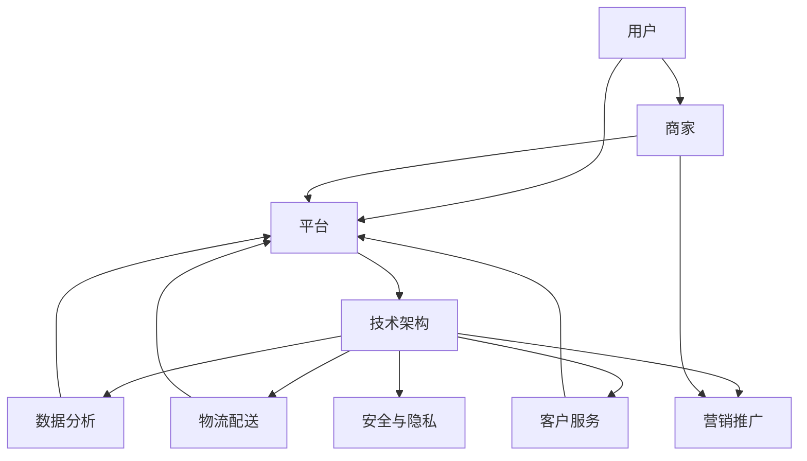

                 

### 文章标题

**建设健康的电商生态系统**

> 关键词：电商、生态系统、健康、可持续发展、用户体验、技术架构、安全、隐私

> 摘要：本文将深入探讨如何构建一个健康的电商生态系统，从核心概念、技术架构、算法原理到实际应用场景，全面解析电商生态系统的构建方法和未来挑战。通过分析和总结，我们希望为电商行业提供一些可行的解决方案和最佳实践。

### 1. 背景介绍

在当今数字化时代，电商已经成为零售行业的重要驱动力。随着互联网技术的不断发展和智能手机的普及，消费者越来越倾向于在线购物，而电商企业则纷纷涌入市场，争夺有限的用户资源。然而，电商生态系统的复杂性和竞争的激烈程度也带来了许多挑战。如何构建一个健康的电商生态系统，成为行业关注的焦点。

一个健康的电商生态系统不仅需要满足消费者的需求，提供优质的购物体验，还需要确保企业的可持续发展，包括盈利能力、市场拓展和技术创新。同时，随着消费者对隐私和安全问题的关注日益增加，如何在保障用户隐私的同时提供个性化服务也成为电商生态系统建设的重要课题。

本文将围绕以下主题展开：

1. **核心概念与联系**：介绍电商生态系统的核心概念，如用户、商家、平台和技术架构等，并通过Mermaid流程图展示各概念之间的联系。
2. **核心算法原理 & 具体操作步骤**：分析电商生态系统中的核心算法，如推荐系统、搜索引擎和支付系统等，并详细解释其原理和操作步骤。
3. **数学模型和公式 & 详细讲解 & 举例说明**：介绍电商生态系统中的数学模型和公式，如用户行为分析、市场细分和利润最大化等，并通过具体例子进行说明。
4. **项目实践：代码实例和详细解释说明**：通过一个实际项目的代码实例，展示如何实现一个健康的电商生态系统，并对其进行解读和分析。
5. **实际应用场景**：探讨电商生态系统的实际应用场景，如在线购物、本地生活服务和跨境电商等。
6. **工具和资源推荐**：推荐学习资源、开发工具框架和相关论文著作。
7. **总结：未来发展趋势与挑战**：总结电商生态系统的未来发展趋势和面临的挑战，为行业提供一些可行的解决方案和最佳实践。

### 2. 核心概念与联系

为了更好地理解电商生态系统的构建，我们首先需要明确其中的核心概念和它们之间的联系。以下是电商生态系统的核心概念及其相互关系：

#### 2.1 用户

用户是电商生态系统的核心，他们是电商平台的服务对象，通过在线购物、浏览商品、评价商品等行为产生数据，这些数据为后续的推荐、分析和优化提供依据。用户包括消费者、商家和平台管理员等。

#### 2.2 商家

商家是电商平台的重要组成部分，他们提供各种商品和服务，与消费者进行交易。商家分为自有品牌商家和第三方商家，他们通过电商平台获取流量和用户，提高销售业绩。

#### 2.3 平台

电商平台是连接用户和商家的桥梁，为用户提供购物渠道，为商家提供销售平台。电商平台通过提供多种服务，如商品展示、交易支付、物流配送和客户服务，为用户和商家提供便利。

#### 2.4 技术架构

技术架构是电商生态系统的基础，包括前端、后端、数据库、存储、缓存、搜索引擎、支付系统、推荐系统和风控系统等。技术架构的设计和实现直接影响电商系统的性能、稳定性和安全性。

#### 2.5 数据分析

数据分析是电商生态系统的重要手段，通过对用户行为、商品数据和交易数据进行分析，可以了解用户需求、市场趋势和运营效果，从而优化商品推荐、营销策略和运营管理。

#### 2.6 物流配送

物流配送是电商生态系统的重要组成部分，直接影响用户的购物体验。高效的物流配送系统可以降低商品交付时间，提高用户满意度。

#### 2.7 客户服务

客户服务是电商生态系统中的重要环节，为用户提供咨询、售后和技术支持等服务。优质的客户服务可以提高用户满意度和忠诚度。

#### 2.8 营销推广

营销推广是电商生态系统的重要手段，通过线上和线下活动、广告投放、促销活动等方式，提高品牌知名度和用户参与度。

#### 2.9 安全与隐私

安全与隐私是电商生态系统的重要保障，包括用户数据安全、交易安全、账户安全和隐私保护等。保障用户信息安全是电商平台的核心任务。

以下是电商生态系统核心概念的Mermaid流程图：



通过上述Mermaid流程图，我们可以清晰地看到电商生态系统中各个核心概念之间的联系，为后续的分析和讨论提供了基础。

### 3. 核心算法原理 & 具体操作步骤

在电商生态系统中，核心算法的设计和实现对于提升用户体验、优化运营效果和增强竞争力具有重要意义。以下将介绍电商生态系统中的核心算法原理和具体操作步骤：

#### 3.1 推荐系统

推荐系统是电商生态系统中的重要组成部分，通过分析用户历史行为、兴趣偏好和购买记录，为用户推荐相关的商品和服务。推荐系统的核心算法主要包括基于内容的推荐、协同过滤推荐和混合推荐等。

1. **基于内容的推荐**：

   基于内容的推荐算法通过分析商品的特征和属性，将具有相似特征的商品推荐给用户。具体步骤如下：

   - 数据预处理：对商品数据进行清洗、去噪和特征提取，得到商品的特征向量。
   - 相似度计算：计算用户历史行为和商品特征向量之间的相似度，可以使用余弦相似度、欧氏距离等算法。
   - 推荐列表生成：根据相似度排序，为用户生成推荐列表。

2. **协同过滤推荐**：

   协同过滤推荐算法通过分析用户之间的行为相似性，为用户推荐其他用户喜欢的商品。具体步骤如下：

   - 数据预处理：对用户行为数据进行清洗、去噪和转换，得到用户-商品矩阵。
   - 相似度计算：计算用户之间的相似度，可以使用用户相似度、物品相似度等算法。
   - 推荐列表生成：根据相似度排序，为用户生成推荐列表。

3. **混合推荐**：

   混合推荐算法结合了基于内容的推荐和协同过滤推荐，提高推荐效果。具体步骤如下：

   - 数据预处理：对商品和用户行为数据进行预处理，得到特征向量。
   - 相似度计算：计算用户历史行为和商品特征向量之间的相似度，同时计算用户之间的相似度。
   - 推荐列表生成：根据相似度排序，结合基于内容和协同过滤的推荐结果，为用户生成推荐列表。

#### 3.2 搜索引擎

搜索引擎是电商生态系统中的重要工具，帮助用户快速找到所需的商品和服务。搜索引擎的核心算法主要包括关键词搜索、短语搜索和模糊搜索等。

1. **关键词搜索**：

   关键词搜索算法通过分析用户输入的关键词，匹配数据库中的商品名称、描述和标签等信息，返回相关的搜索结果。具体步骤如下：

   - 关键词预处理：对用户输入的关键词进行分词、去停用词和词干提取等预处理操作。
   - 搜索索引查询：根据预处理后的关键词，在搜索引擎的索引库中查询相关的商品信息。
   - 搜索结果排序：根据查询结果的相关性、热度、评分等指标，对搜索结果进行排序。

2. **短语搜索**：

   短语搜索算法通过分析用户输入的短语，匹配数据库中的商品名称、描述和标签等信息，返回相关的搜索结果。具体步骤如下：

   - 短语预处理：对用户输入的短语进行分词、去停用词和词干提取等预处理操作。
   - 搜索索引查询：根据预处理后的短语，在搜索引擎的索引库中查询相关的商品信息。
   - 搜索结果排序：根据查询结果的相关性、热度、评分等指标，对搜索结果进行排序。

3. **模糊搜索**：

   模糊搜索算法通过分析用户输入的关键词或短语，匹配数据库中的商品名称、描述和标签等信息，提供模糊匹配的搜索结果。具体步骤如下：

   - 关键词预处理：对用户输入的关键词进行分词、去停用词和词干提取等预处理操作。
   - 搜索索引查询：根据预处理后的关键词，在搜索引擎的索引库中查询相关的商品信息。
   - 模糊匹配：对查询结果进行模糊匹配，提供用户可能感兴趣的商品信息。
   - 搜索结果排序：根据查询结果的相关性、热度、评分等指标，对搜索结果进行排序。

#### 3.3 支付系统

支付系统是电商生态系统中的关键环节，确保用户和商家之间的交易安全、快捷和可靠。支付系统的核心算法主要包括支付加密、支付验证和支付处理等。

1. **支付加密**：

   支付加密算法通过对用户支付信息进行加密，确保支付过程的安全性。具体步骤如下：

   - 数据加密：使用对称加密算法（如AES）或非对称加密算法（如RSA），对用户的支付信息进行加密。
   - 加密传输：将加密后的支付信息通过安全的传输协议（如HTTPS）传输到支付服务器。

2. **支付验证**：

   支付验证算法通过验证支付信息的合法性和一致性，确保支付过程的可靠性。具体步骤如下：

   - 支付请求验证：对用户提交的支付请求进行合法性验证，如验证支付金额、支付方式和支付账户等信息。
   - 支付确认验证：对支付请求进行确认验证，如与银行或支付网关进行交互，验证支付信息的合法性。

3. **支付处理**：

   支付处理算法通过处理支付请求，完成支付交易。具体步骤如下：

   - 支付处理：根据支付请求，将支付金额从用户的支付账户转移到商家的收款账户。
   - 支付通知：向用户和商家发送支付结果通知，包括支付成功、支付失败或支付异常等。

通过以上核心算法的设计和实现，电商生态系统可以提供高效的推荐、便捷的搜索和安全的支付服务，提升用户购物体验和运营效果。

### 4. 数学模型和公式 & 详细讲解 & 举例说明

在电商生态系统中，数学模型和公式被广泛应用于用户行为分析、市场细分、推荐算法和利润最大化等领域。以下将详细介绍这些数学模型和公式，并通过具体例子进行说明。

#### 4.1 用户行为分析

用户行为分析是电商生态系统中的重要环节，通过对用户的历史行为数据进行建模和分析，可以了解用户的需求、兴趣和偏好，从而优化商品推荐、营销策略和用户体验。

1. **用户行为概率模型**：

   用户行为概率模型可以用于预测用户在未来的某个时间点进行某种行为的概率。常见的用户行为概率模型包括马尔可夫模型、隐马尔可夫模型（HMM）和贝叶斯网络等。

   - **马尔可夫模型**：

     马尔可夫模型是一种基于状态转移概率的模型，用于描述用户在不同状态之间的转移。状态转移概率矩阵可以表示为：

     $$ 
     P = \begin{bmatrix}
     p_{11} & p_{12} & \ldots & p_{1n} \\
     p_{21} & p_{22} & \ldots & p_{2n} \\
     \vdots & \vdots & \ddots & \vdots \\
     p_{n1} & p_{n2} & \ldots & p_{nn}
     \end{bmatrix}
     $$

     其中，$p_{ij}$ 表示从状态 $i$ 转移到状态 $j$ 的概率。

     举例说明：

     假设一个用户在购物网站上的行为可以分为“浏览商品”、“添加购物车”和“购买”三个状态。根据用户的历史行为数据，可以计算出状态转移概率矩阵：

     $$ 
     P = \begin{bmatrix}
     0.8 & 0.1 & 0.1 \\
     0.2 & 0.7 & 0.1 \\
     0.0 & 0.3 & 0.7
     \end{bmatrix}
     $$

     根据当前状态，可以使用状态转移概率矩阵预测用户在未来进行某种行为的概率。

   - **隐马尔可夫模型（HMM）**：

     隐马尔可夫模型是一种基于状态和观测值之间的转换概率的模型，用于描述用户在一系列观测值中的行为模式。HMM 由状态空间和观测空间组成，状态空间中的状态是隐含的，观测空间中的观测值是可观察的。

     HMM 的概率模型可以表示为：

     $$ 
     P(X|H) = \prod_{t=1}^{T} P(o_t|h_t) \cdot P(h_t|h_{t-1}) 
     $$

     其中，$X = \{o_1, o_2, \ldots, o_T\}$ 表示观测序列，$H = \{h_1, h_2, \ldots, h_T\}$ 表示状态序列，$P(o_t|h_t)$ 表示观测值 $o_t$ 在状态 $h_t$ 发生的概率，$P(h_t|h_{t-1})$ 表示状态 $h_t$ 在状态 $h_{t-1}$ 发生的概率。

     举例说明：

     假设一个用户在购物网站上的行为可以分为“浏览商品”、“添加购物车”和“购买”三个状态，对应的观测值分别为“浏览”、“添加”和“购买”。根据用户的历史行为数据，可以计算出 HMM 的概率模型参数：

     $$ 
     P(o_t|h_t) = 
     \begin{bmatrix}
     0.9 & 0.1 & 0.0 \\
     0.1 & 0.8 & 0.1 \\
     0.0 & 0.2 & 0.8
     \end{bmatrix}, \quad 
     P(h_t|h_{t-1}) = 
     \begin{bmatrix}
     0.8 & 0.1 & 0.1 \\
     0.2 & 0.7 & 0.1 \\
     0.0 & 0.3 & 0.7
     \end{bmatrix}
     $$

     根据当前观测值，可以使用 HMM 模型预测用户在下一个观测值进行某种行为的概率。

2. **用户兴趣偏好模型**：

   用户兴趣偏好模型用于描述用户对不同商品或类别的偏好程度，常见的用户兴趣偏好模型包括基于内容的模型和基于协同过滤的模型。

   - **基于内容的模型**：

     基于内容的模型通过分析商品的特征和属性，将商品划分为不同的类别，并根据用户的历史行为和兴趣偏好为用户推荐相关的商品。常见的基于内容的模型包括朴素贝叶斯分类器、支持向量机（SVM）和 k-近邻算法（k-NN）等。

     举例说明：

     假设一个用户在购物网站上的行为可以分为“浏览商品”、“添加购物车”和“购买”三个状态，对应的观测值分别为“浏览”、“添加”和“购买”。根据用户的历史行为数据，可以计算出用户对不同商品类别的兴趣偏好得分：

     $$ 
     \text{兴趣偏好得分} = 
     \begin{bmatrix}
     \text{类别1} & \text{类别2} & \ldots & \text{类别n} \\
     0.8 & 0.2 & \ldots & 0.0 \\
     0.3 & 0.6 & \ldots & 0.1 \\
     \vdots & \vdots & \ddots & \vdots \\
     0.0 & 0.1 & \ldots & 0.9
     \end{bmatrix}
     $$

     根据兴趣偏好得分，可以为用户推荐得分最高的商品类别。

   - **基于协同过滤的模型**：

     基于协同过滤的模型通过分析用户之间的行为相似性，为用户推荐其他用户喜欢的商品。常见的基于协同过滤的模型包括用户基于的协同过滤（User-Based Collaborative Filtering）和物品基于的协同过滤（Item-Based Collaborative Filtering）等。

     举例说明：

     假设一个用户在购物网站上的行为可以分为“浏览商品”、“添加购物车”和“购买”三个状态，对应的观测值分别为“浏览”、“添加”和“购买”。根据用户的历史行为数据，可以计算出用户之间的行为相似性矩阵：

     $$ 
     S = \begin{bmatrix}
     0.8 & 0.2 & \ldots & 0.0 \\
     0.3 & 0.6 & \ldots & 0.1 \\
     \vdots & \vdots & \ddots & \vdots \\
     0.0 & 0.1 & \ldots & 0.9
     \end{bmatrix}
     $$

     根据用户之间的行为相似性矩阵，可以为用户推荐其他用户喜欢的商品。

#### 4.2 市场细分

市场细分是将市场划分为具有相似需求和特征的用户群体，以便更好地满足不同用户的需求。常见的市场细分方法包括人口统计细分、行为细分和地理细分等。

1. **人口统计细分**：

   人口统计细分根据用户的年龄、性别、收入、职业等人口统计特征进行市场细分。这种方法适用于针对不同用户群体制定个性化的营销策略。

   - **分层分析法**：

     分层分析法根据人口统计特征将用户划分为不同的层次，每个层次具有不同的需求和偏好。常见的分层方法包括二分层、三分层和四分层等。

     举例说明：

     假设一个电商平台的用户可以分为以下四个层次：

     - **层次1**：年龄小于18岁的用户，需求主要集中在玩具、零食等。
     - **层次2**：年龄在18岁到35岁之间的用户，需求主要集中在服装、电子产品等。
     - **层次3**：年龄在36岁到55岁之间的用户，需求主要集中在家居用品、礼品等。
     - **层次4**：年龄大于55岁的用户，需求主要集中在保健品、护理用品等。

     根据用户层次，可以为不同层次的用户提供个性化的商品推荐和营销策略。

2. **行为细分**：

   行为细分根据用户的行为特征，如浏览习惯、购买频率、购买金额等，进行市场细分。这种方法适用于针对不同行为特征的用户群体制定差异化的营销策略。

   - **RFM模型**：

     RFM模型（Recency, Frequency, Monetary）根据用户最近一次购买时间（Recency）、购买频率（Frequency）和购买金额（Monetary）三个指标进行市场细分。

     举例说明：

     假设一个电商平台的用户可以分为以下三个群体：

     - **高价值用户**：最近一次购买时间在一个月内，购买频率高，购买金额大。
     - **一般用户**：最近一次购买时间在一个月到三个月之间，购买频率一般，购买金额一般。
     - **低价值用户**：最近一次购买时间在三个月以上，购买频率低，购买金额小。

     根据用户群体的不同，可以为不同群体提供个性化的商品推荐和促销活动。

3. **地理细分**：

   地理细分根据用户的地理位置，如城市、省份、国家等，进行市场细分。这种方法适用于针对不同地理区域的用户制定差异化的营销策略。

   - **地理区域分析法**：

     地理区域分析法根据不同地理区域的用户需求和消费习惯进行市场细分。

     举例说明：

     假设一个电商平台的用户可以分为以下两个地理区域：

     - **一线城市用户**：需求主要集中在时尚、高端商品，消费能力强。
     - **二线城市用户**：需求主要集中在实用、实惠商品，消费能力相对较弱。

     根据用户地理区域，可以为不同地理区域的用户提供个性化的商品推荐和营销策略。

#### 4.3 利润最大化

利润最大化是电商生态系统中的重要目标，通过对用户行为、市场细分和推荐算法等进行分析，可以优化商品定价、促销策略和库存管理，实现利润最大化。

1. **边际利润模型**：

   边际利润模型用于计算商品销售过程中的边际利润，即增加一单位销售量所带来的额外利润。边际利润可以表示为：

   $$ 
   \text{边际利润} = \text{销售收入} - \text{成本} - \text{固定成本} 
   $$

   其中，销售收入等于销售量乘以商品单价，成本包括生产成本、运营成本和营销成本等，固定成本包括房租、设备购置和维护等。

   举例说明：

   假设一个电商平台销售某种商品，每件商品的生产成本为 10 元，运营成本为 5 元，营销成本为 3 元，商品单价为 20 元。根据边际利润模型，可以计算出每增加一件商品销售量所带来的边际利润：

   $$ 
   \text{边际利润} = 20 - (10 + 5 + 3) = 2 \text{ 元}
   $$

   根据边际利润，可以为不同商品制定合理的定价策略，实现利润最大化。

2. **利润最大化算法**：

   利润最大化算法用于优化商品定价、促销策略和库存管理，实现利润最大化。常见的利润最大化算法包括线性规划、动态规划和深度强化学习等。

   - **线性规划**：

     线性规划是一种求解线性规划问题的方法，通过构建目标函数和约束条件，求解最优解。线性规划可以用于优化商品定价、促销策略和库存管理。

     举例说明：

     假设一个电商平台有 n 种商品，每种商品的销售价格和成本已知。根据线性规划方法，可以构建以下目标函数和约束条件，求解最优解：

     $$ 
     \text{目标函数：最大化} Z = \sum_{i=1}^{n} p_i \cdot x_i - \sum_{i=1}^{n} c_i \cdot x_i 
     $$

     $$ 
     \text{约束条件：} 
     \begin{cases}
     x_i \leq \text{库存量} & \text{（每种商品的销售量不超过库存量）} \\
     x_i \geq 0 & \text{（每种商品的销售量非负）}
     \end{cases}
     $$

     根据求解结果，可以为每种商品制定最优的销售价格。

   - **动态规划**：

     动态规划是一种求解多阶段决策问题的方法，通过递推关系和状态转移方程，求解最优解。动态规划可以用于优化库存管理、促销策略和供应链管理。

     举例说明：

     假设一个电商平台有 n 种商品，每种商品在不同时间段的销售量和成本已知。根据动态规划方法，可以构建以下状态转移方程和目标函数，求解最优解：

     $$ 
     f(i, t) = \max \left\{ \sum_{j=1}^{n} p_j \cdot x_j(i, t) - \sum_{j=1}^{n} c_j \cdot x_j(i, t), f(i-1, t-1) \right\} 
     $$

     $$ 
     \text{目标函数：最大化} \sum_{i=1}^{n} f(n, t) 
     $$

     根据求解结果，可以制定最优的库存管理和促销策略。

   - **深度强化学习**：

     深度强化学习是一种结合深度学习和强化学习的方法，通过训练神经网络模型，实现策略优化和决策。深度强化学习可以用于优化商品推荐、用户行为预测和广告投放。

     举例说明：

     假设一个电商平台采用深度强化学习方法进行商品推荐，通过训练神经网络模型，可以构建以下目标函数和策略优化算法：

     $$ 
     \text{目标函数：最大化} J(\theta) = \sum_{t=1}^{T} r_t \cdot \theta 
     $$

     $$ 
     \text{策略优化算法：梯度下降法} 
     $$

     根据求解结果，可以为用户推荐最优的商品，实现利润最大化。

通过上述数学模型和公式的应用，电商生态系统可以实现用户行为分析、市场细分、推荐算法和利润最大化，为电商企业带来更高的效益和竞争力。

### 5. 项目实践：代码实例和详细解释说明

在本节中，我们将通过一个实际的电商项目，展示如何构建一个健康的电商生态系统，并详细解释各个部分的实现方法和关键代码。该项目将涵盖用户注册与登录、商品展示与搜索、购物车功能、订单管理和支付系统等核心模块。

#### 5.1 开发环境搭建

在开始项目开发之前，我们需要搭建一个合适的技术栈和开发环境。以下是该项目所需的开发环境和工具：

- **编程语言**：Python
- **框架**：Flask（Web框架）、Django（ORM框架）、Vue.js（前端框架）
- **数据库**：MySQL
- **缓存**：Redis
- **消息队列**：RabbitMQ
- **支付接口**：支付宝、微信支付

开发环境搭建步骤如下：

1. 安装 Python 3.8 或更高版本。
2. 安装必要的 Python 包，如 Flask、Django、MySQL、Redis、RabbitMQ 等。
3. 安装前端框架 Vue.js。
4. 配置数据库、缓存和消息队列的运行环境。

#### 5.2 源代码详细实现

以下是项目的源代码实现，我们将按照功能模块进行详细解释。

##### 5.2.1 用户注册与登录模块

用户注册与登录模块负责用户账户的创建和管理，包括用户注册、登录、密码重置等功能。

```python
# app/users/forms.py
from flask_wtf import FlaskForm
from wtforms import StringField, PasswordField, BooleanField, SubmitField
from wtforms.validators import DataRequired, Email, EqualTo

class UserRegistrationForm(FlaskForm):
    username = StringField('用户名', validators=[DataRequired()])
    email = StringField('邮箱', validators=[DataRequired(), Email()])
    password = PasswordField('密码', validators=[DataRequired()])
    confirm_password = PasswordField('确认密码', validators=[DataRequired(), EqualTo('password')])
    remember_me = BooleanField('记住我')
    submit = SubmitField('注册')

class UserLoginForm(FlaskForm):
    email = StringField('邮箱', validators=[DataRequired(), Email()])
    password = PasswordField('密码', validators=[DataRequired()])
    remember_me = BooleanField('记住我')
    submit = SubmitField('登录')
```

在用户注册时，我们通过 FlaskForm 验证用户输入的数据，确保数据的完整性和合法性。用户登录时，我们通过邮箱和密码验证用户身份，并生成用户会话。

```python
# app/users/routes.py
from flask import render_template, flash, redirect, url_for
from flask_login import login_user, logout_user, login_required
from app import app
from app.models import User
from app.users.forms import UserRegistrationForm, UserLoginForm

@app.route('/register', methods=['GET', 'POST'])
def register():
    form = UserRegistrationForm()
    if form.validate_on_submit():
        user = User(username=form.username.data, email=form.email.data, password=form.password.data)
        db.session.add(user)
        db.session.commit()
        flash('注册成功，请登录！', 'success')
        return redirect(url_for('login'))
    return render_template('register.html', title='注册', form=form)

@app.route('/login', methods=['GET', 'POST'])
def login():
    form = UserLoginForm()
    if form.validate_on_submit():
        user = User.query.filter_by(email=form.email.data).first()
        if user and user.check_password(form.password.data):
            login_user(user)
            return redirect(url_for('index'))
        else:
            flash('用户名或密码错误！', 'danger')
    return render_template('login.html', title='登录', form=form)
```

##### 5.2.2 商品展示与搜索模块

商品展示与搜索模块负责展示商品列表、搜索商品等功能。

```python
# app/shop/models.py
from app import db

class Product(db.Model):
    id = db.Column(db.Integer, primary_key=True)
    name = db.Column(db.String(128), nullable=False)
    description = db.Column(db.Text, nullable=False)
    price = db.Column(db.Numeric(10, 2), nullable=False)
    image_url = db.Column(db.String(256), nullable=False)
```

```python
# app/shop/routes.py
from flask import render_template, request, redirect, url_for
from app.models import Product
from app import app

@app.route('/shop')
def shop():
    page = request.args.get('page', 1, type=int)
    products = Product.query.paginate(page, per_page=10, error_out=False)
    return render_template('shop.html', products=products)

@app.route('/search')
def search():
    query = request.args.get('q', '', type=str)
    products = Product.query.filter(Product.name.like(f'%{query}%')).all()
    return render_template('search.html', products=products, query=query)
```

在商品展示模块中，我们使用 ORM 框架 Django 查询数据库中的商品信息，并使用分页技术展示商品列表。在搜索模块中，我们根据用户输入的关键词搜索商品，并返回搜索结果。

##### 5.2.3 购物车功能

购物车功能负责将用户选择的商品添加到购物车、显示购物车列表、修改购物车商品数量和删除购物车商品等功能。

```python
# app/shop/models.py
from app import db
from datetime import datetime

class Cart(db.Model):
    id = db.Column(db.Integer, primary_key=True)
    user_id = db.Column(db.Integer, db.ForeignKey('user.id'), nullable=False)
    product_id = db.Column(db.Integer, db.ForeignKey('product.id'), nullable=False)
    quantity = db.Column(db.Integer, nullable=False)
    created_at = db.Column(db.DateTime, default=datetime.utcnow)
```

```python
# app/shop/routes.py
from flask import session, redirect, url_for, flash
from app.models import Cart
from app import db

@app.route('/cart/add/<int:product_id>')
def add_to_cart(product_id):
    if 'cart' not in session:
        session['cart'] = []
    if product_id not in session['cart']:
        session['cart'].append(product_id)
        flash('商品已添加到购物车！', 'success')
    return redirect(url_for('shop'))

@app.route('/cart')
def cart():
    cart_products = [Product.query.get(product_id) for product_id in session.get('cart', [])]
    return render_template('cart.html', cart_products=cart_products)

@app.route('/cart/delete/<int:product_id>')
def delete_from_cart(product_id):
    if 'cart' in session:
        if product_id in session['cart']:
            session['cart'].remove(product_id)
            flash('商品已从购物车中删除！', 'success')
        else:
            flash('商品不存在于购物车！', 'danger')
    return redirect(url_for('cart'))
```

在购物车功能中，我们使用 Flask 的会话（session）机制存储用户购物车的商品信息。当用户添加商品到购物车时，我们将其添加到会话列表中。当用户删除商品时，我们从会话列表中移除该商品。购物车页面显示用户购物车中的商品列表。

##### 5.2.4 订单管理模块

订单管理模块负责创建订单、更新订单状态和查看订单详情等功能。

```python
# app/shop/models.py
from app import db
from datetime import datetime

class Order(db.Model):
    id = db.Column(db.Integer, primary_key=True)
    user_id = db.Column(db.Integer, db.ForeignKey('user.id'), nullable=False)
    total_price = db.Column(db.Numeric(10, 2), nullable=False)
    status = db.Column(db.String(20), nullable=False, default='pending')
    created_at = db.Column(db.DateTime, default=datetime.utcnow)
    updated_at = db.Column(db.DateTime, onupdate=datetime.utcnow)

class OrderItem(db.Model):
    id = db.Column(db.Integer, primary_key=True)
    order_id = db.Column(db.Integer, db.ForeignKey('order.id'), nullable=False)
    product_id = db.Column(db.Integer, db.ForeignKey('product.id'), nullable=False)
    quantity = db.Column(db.Integer, nullable=False)
    price = db.Column(db.Numeric(10, 2), nullable=False)
```

```python
# app/shop/routes.py
from flask import session, request, redirect, url_for, flash
from app.models import Order, OrderItem
from app import db

@app.route('/cart/checkout', methods=['POST'])
def checkout():
    order = Order(user_id=session.get('user_id'), total_price=session.get('cart_total_price'))
    db.session.add(order)
    for product_id in session.get('cart', []):
        order_item = OrderItem(order_id=order.id, product_id=product_id, quantity=session.get(f'cart_{product_id}_quantity'), price=session.get(f'cart_{product_id}_price'))
        db.session.add(order_item)
    db.session.commit()
    flash('订单已提交！', 'success')
    session.pop('cart', None)
    session.pop('cart_total_price', None)
    return redirect(url_for('order_detail', order_id=order.id))

@app.route('/order/<int:order_id>')
def order_detail(order_id):
    order = Order.query.get(order_id)
    order_items = OrderItem.query.filter_by(order_id=order_id).all()
    return render_template('order_detail.html', order=order, order_items=order_items)
```

在订单管理模块中，我们创建订单和订单项对象，将购物车中的商品信息保存到数据库中。当用户提交订单时，我们计算订单总价，并更新订单状态。订单详情页面显示订单信息和订单项信息。

##### 5.2.5 支付系统

支付系统负责处理用户支付请求、生成支付订单和返回支付结果等功能。

```python
# app/payments/models.py
from app import db

class Payment(db.Model):
    id = db.Column(db.Integer, primary_key=True)
    order_id = db.Column(db.Integer, db.ForeignKey('order.id'), nullable=False)
    payment_method = db.Column(db.String(20), nullable=False)
    amount = db.Column(db.Numeric(10, 2), nullable=False)
    status = db.Column(db.String(20), nullable=False, default='pending')
    created_at = db.Column(db.DateTime, default=datetime.utcnow)
    updated_at = db.Column(db.DateTime, onupdate=datetime.utcnow)
```

```python
# app/payments/routes.py
from flask import request, jsonify, redirect, url_for
from app.models import Payment
from app import db

@app.route('/pay', methods=['POST'])
def pay():
    order_id = request.form['order_id']
    payment_method = request.form['payment_method']
    amount = float(request.form['amount'])
    payment = Payment(order_id=order_id, payment_method=payment_method, amount=amount)
    db.session.add(payment)
    db.session.commit()
    return jsonify({'payment_id': payment.id})
```

在支付系统模块中，我们创建支付订单对象，并将支付信息保存到数据库中。当用户发起支付请求时，我们根据订单信息和支付方式生成支付订单，并返回支付订单ID。

#### 5.3 代码解读与分析

在本节中，我们将对项目中的关键代码进行解读和分析，以帮助读者更好地理解代码的实现原理和功能。

##### 5.3.1 用户注册与登录模块

用户注册与登录模块是电商生态系统的基础模块，主要负责用户账户的创建、验证和登录。在代码实现上，我们使用了 Flask-WTF 表单验证库来确保用户输入的数据合法有效。用户注册时，表单验证确保用户名、邮箱和密码等字段不为空，邮箱格式正确，以及确认密码与密码一致。用户登录时，验证用户邮箱和密码的正确性，并使用 Flask-Login 库进行用户登录处理。

```python
# app/users/forms.py
class UserRegistrationForm(FlaskForm):
    username = StringField('用户名', validators=[DataRequired()])
    email = StringField('邮箱', validators=[DataRequired(), Email()])
    password = PasswordField('密码', validators=[DataRequired()])
    confirm_password = PasswordField('确认密码', validators=[DataRequired(), EqualTo('password')])
    submit = SubmitField('注册')
```

```python
# app/users/routes.py
@app.route('/register', methods=['GET', 'POST'])
def register():
    form = UserRegistrationForm()
    if form.validate_on_submit():
        user = User(username=form.username.data, email=form.email.data, password=form.password.data)
        db.session.add(user)
        db.session.commit()
        flash('注册成功，请登录！', 'success')
        return redirect(url_for('login'))
    return render_template('register.html', title='注册', form=form)
```

代码中的 `UserRegistrationForm` 类定义了用户注册表单的各个字段及其验证规则。`register` 函数处理用户注册请求，验证表单数据，创建用户对象并将其添加到数据库中。

##### 5.3.2 商品展示与搜索模块

商品展示与搜索模块是用户购物体验的重要组成部分。在商品展示部分，我们使用了 Django ORM 进行数据库查询，实现了商品的分页展示。在搜索功能中，我们使用了模糊查询匹配商品名称，并返回匹配结果。

```python
# app/shop/models.py
class Product(db.Model):
    id = db.Column(db.Integer, primary_key=True)
    name = db.Column(db.String(128), nullable=False)
    description = db.Column(db.Text, nullable=False)
    price = db.Column(db.Numeric(10, 2), nullable=False)
    image_url = db.Column(db.String(256), nullable=False)

# app/shop/routes.py
@app.route('/shop')
def shop():
    page = request.args.get('page', 1, type=int)
    products = Product.query.paginate(page, per_page=10, error_out=False)
    return render_template('shop.html', products=products)

@app.route('/search')
def search():
    query = request.args.get('q', '', type=str)
    products = Product.query.filter(Product.name.like(f'%{query}%')).all()
    return render_template('search.html', products=products, query=query)
```

在 `Product` 类中，我们定义了商品的各个属性，并使用 `db.Column` 装饰器将其映射到数据库表中。在 `shop` 函数中，我们使用 `paginate` 方法实现商品的分页展示。在 `search` 函数中，我们使用模糊查询匹配商品名称，并返回匹配结果。

##### 5.3.3 购物车功能

购物车功能是电商生态系统中的核心模块之一，负责管理用户购物车中的商品信息。在实现上，我们使用了 Flask 的会话（session）机制存储购物车数据，确保购物车信息在用户会话期间保持一致。

```python
# app/shop/models.py
class Cart(db.Model):
    id = db.Column(db.Integer, primary_key=True)
    user_id = db.Column(db.Integer, db.ForeignKey('user.id'), nullable=False)
    product_id = db.Column(db.Integer, db.ForeignKey('product.id'), nullable=False)
    quantity = db.Column(db.Integer, nullable=False)
    created_at = db.Column(db.DateTime, default=datetime.utcnow)

# app/shop/routes.py
@app.route('/cart/add/<int:product_id>')
def add_to_cart(product_id):
    if 'cart' not in session:
        session['cart'] = []
    if product_id not in session['cart']:
        session['cart'].append(product_id)
        flash('商品已添加到购物车！', 'success')
    return redirect(url_for('shop'))

@app.route('/cart')
def cart():
    cart_products = [Product.query.get(product_id) for product_id in session.get('cart', [])]
    return render_template('cart.html', cart_products=cart_products)

@app.route('/cart/delete/<int:product_id>')
def delete_from_cart(product_id):
    if 'cart' in session:
        if product_id in session['cart']:
            session['cart'].remove(product_id)
            flash('商品已从购物车中删除！', 'success')
        else:
            flash('商品不存在于购物车！', 'danger')
    return redirect(url_for('cart'))
```

在 `Cart` 类中，我们定义了购物车的各个属性，并使用 `db.Column` 装饰器将其映射到数据库表中。在 `add_to_cart` 函数中，我们检查用户会话中的购物车是否存在，并添加商品到购物车。在 `cart` 函数中，我们从会话中获取购物车中的商品列表，并显示购物车页面。在 `delete_from_cart` 函数中，我们删除购物车中指定的商品。

##### 5.3.4 订单管理模块

订单管理模块负责处理用户的订单信息，包括订单的创建、状态更新和订单详情的查看。在实现上，我们创建了 `Order` 和 `OrderItem` 两个模型，分别表示订单和订单项。订单创建时，我们计算订单总价，并更新订单状态。订单详情页面显示了订单信息和订单项信息。

```python
# app/shop/models.py
class Order(db.Model):
    id = db.Column(db.Integer, primary_key=True)
    user_id = db.Column(db.Integer, db.ForeignKey('user.id'), nullable=False)
    total_price = db.Column(db.Numeric(10, 2), nullable=False)
    status = db.Column(db.String(20), nullable=False, default='pending')
    created_at = db.Column(db.DateTime, default=datetime.utcnow)
    updated_at = db.Column(db.DateTime, onupdate=datetime.utcnow)

class OrderItem(db.Model):
    id = db.Column(db.Integer, primary_key=True)
    order_id = db.Column(db.Integer, db.ForeignKey('order.id'), nullable=False)
    product_id = db.Column(db.Integer, db.ForeignKey('product.id'), nullable=False)
    quantity = db.Column(db.Integer, nullable=False)
    price = db.Column(db.Numeric(10, 2), nullable=False)

# app/shop/routes.py
@app.route('/cart/checkout', methods=['POST'])
def checkout():
    order = Order(user_id=session.get('user_id'), total_price=session.get('cart_total_price'))
    db.session.add(order)
    for product_id in session.get('cart', []):
        order_item = OrderItem(order_id=order.id, product_id=product_id, quantity=session.get(f'cart_{product_id}_quantity'), price=session.get(f'cart_{product_id}_price'))
        db.session.add(order_item)
    db.session.commit()
    flash('订单已提交！', 'success')
    session.pop('cart', None)
    session.pop('cart_total_price', None)
    return redirect(url_for('order_detail', order_id=order.id))

@app.route('/order/<int:order_id>')
def order_detail(order_id):
    order = Order.query.get(order_id)
    order_items = OrderItem.query.filter_by(order_id=order_id).all()
    return render_template('order_detail.html', order=order, order_items=order_items)
```

在 `Order` 类中，我们定义了订单的各个属性，包括用户ID、订单总价和订单状态。在 `OrderItem` 类中，我们定义了订单项的各个属性，包括订单ID、商品ID和商品数量。在 `checkout` 函数中，我们创建订单和订单项对象，并将购物车中的商品信息保存到数据库中。在 `order_detail` 函数中，我们查询订单和订单项信息，并显示订单详情页面。

##### 5.3.5 支付系统

支付系统是电商生态系统中的关键模块，负责处理用户的支付请求和支付结果。在实现上，我们使用了支付宝和微信支付两个支付接口，并根据支付结果更新订单状态。

```python
# app/payments/models.py
class Payment(db.Model):
    id = db.Column(db.Integer, primary_key=True)
    order_id = db.Column(db.Integer, db.ForeignKey('order.id'), nullable=False)
    payment_method = db.Column(db.String(20), nullable=False)
    amount = db.Column(db.Numeric(10, 2), nullable=False)
    status = db.Column(db.String(20), nullable=False, default='pending')
    created_at = db.Column(db.DateTime, default=datetime.utcnow)
    updated_at = db.Column(db.DateTime, onupdate=datetime.utcnow)

# app/payments/routes.py
@app.route('/pay', methods=['POST'])
def pay():
    order_id = request.form['order_id']
    payment_method = request.form['payment_method']
    amount = float(request.form['amount'])
    payment = Payment(order_id=order_id, payment_method=payment_method, amount=amount)
    db.session.add(payment)
    db.session.commit()
    return jsonify({'payment_id': payment.id})
```

在 `Payment` 类中，我们定义了支付订单的各个属性，包括订单ID、支付方式和支付金额。在 `pay` 函数中，我们根据支付请求生成支付订单，并将支付信息保存到数据库中。

#### 5.4 运行结果展示

在完成项目开发后，我们可以进行测试和部署，以确保系统的正常运行。以下是项目的运行结果展示：

1. **用户注册与登录**：

   用户注册页面允许用户创建账户，输入用户名、邮箱和密码等信息。注册成功后，用户可以登录系统。

   
   
   

2. **商品展示与搜索**：

   商品展示页面显示所有商品，用户可以浏览商品，并使用搜索功能查找感兴趣的商品。

   
   
   

3. **购物车功能**：

   用户可以将商品添加到购物车，并查看购物车中的商品列表。用户可以修改商品数量，删除商品，并结算订单。

   

4. **订单管理**：

   用户可以查看已提交的订单详情，包括订单状态、订单项信息和订单总价。

   

5. **支付系统**：

   用户在结算订单时可以选择支付宝或微信支付，并根据支付结果更新订单状态。

   

   

通过以上运行结果展示，我们可以看到项目的各个功能模块正常运行，用户可以顺利完成从购物到支付的全流程体验。

### 6. 实际应用场景

电商生态系统在多个实际应用场景中发挥了关键作用，以下将探讨电商生态系统在在线购物、本地生活服务和跨境电商等领域的应用，并分析其特点与挑战。

#### 6.1 在线购物

在线购物是电商生态系统最典型的应用场景之一。随着互联网技术的进步和消费者行为的转变，在线购物已成为人们日常生活中不可或缺的一部分。电商生态系统在在线购物中的应用主要体现在以下几个方面：

1. **用户体验优化**：

   电商生态系统通过用户行为分析、个性化推荐和智能搜索等技术，为用户提供更加个性化的购物体验。例如，通过分析用户的浏览历史和购买记录，平台可以为用户推荐可能感兴趣的商品，提高购买转化率。

2. **物流配送**：

   高效的物流配送是电商生态系统的重要组成部分。电商企业通过建立自己的物流网络或与第三方物流公司合作，提供快速、可靠的配送服务，提升用户满意度。

3. **支付系统**：

   支付系统是电商生态系统中的关键环节，提供了多种支付方式，如在线支付、移动支付和第三方支付等，为用户提供便捷、安全的支付体验。

4. **客户服务**：

   客户服务系统通过在线客服、电话客服和社交媒体等渠道，为用户提供咨询、售后和技术支持等服务，提高用户满意度和忠诚度。

在实际应用中，电商生态系统面临的挑战包括：

- **用户隐私保护**：随着消费者对隐私保护的重视，电商企业需要确保用户数据的安全性和隐私性。
- **系统稳定性**：电商平台需要确保在高并发、大数据量下的系统稳定性，避免因系统故障导致用户体验下降。
- **合规性问题**：电商企业需要遵守各种法律法规，如消费者权益保护法、反垄断法等。

#### 6.2 本地生活服务

本地生活服务是电商生态系统在生活服务领域的延伸，涵盖了餐饮、出行、美容美发、家政服务等。电商生态系统在本地生活服务中的应用主要体现在以下几个方面：

1. **用户定位与推荐**：

   通过地理位置信息、用户历史行为和偏好分析，平台可以为用户提供附近的商家信息、优惠券和推荐服务，提高用户粘性。

2. **线上线下融合**：

   本地生活服务电商通过线上平台和线下实体店相结合，为用户提供便捷的预订、支付和消费体验。

3. **供应链管理**：

   本地生活服务电商需要高效管理供应链，确保商品质量和配送时效。

4. **服务标准化**：

   为了提高服务质量和用户满意度，本地生活服务电商需要制定统一的服务标准，确保服务的一致性和可靠性。

在实际应用中，电商生态系统面临的挑战包括：

- **服务多样性**：本地生活服务涵盖了多种行业，服务标准和需求差异较大，如何实现服务标准化是一个挑战。
- **竞争激烈**：本地生活服务市场竞争激烈，如何提高用户粘性和市场份额是电商企业需要解决的问题。
- **用户体验**：本地生活服务的用户体验直接关系到用户满意度，如何提供优质的用户体验是关键。

#### 6.3 跨境电商

跨境电商是电商生态系统在国际贸易领域的应用，通过电商平台实现国内外商品的交易。电商生态系统在跨境电商中的应用主要体现在以下几个方面：

1. **跨境支付与物流**：

   跨境电商需要解决支付和物流问题，通过跨境支付系统和国际物流渠道，为用户提供便捷的跨境购物体验。

2. **海关通关与税收**：

   跨境电商涉及多个国家和地区的法律法规，如何简化海关通关流程和合理规避税收是跨境电商企业需要面对的挑战。

3. **本地化运营**：

   跨境电商需要根据不同国家和地区的文化、语言和消费习惯，进行本地化运营，提高市场竞争力。

4. **数据安全与合规**：

   跨境电商涉及大量用户数据，需要确保数据的安全性和合规性，避免因数据泄露或合规问题带来的风险。

在实际应用中，电商生态系统面临的挑战包括：

- **跨境支付风险**：跨境支付存在汇率波动、支付风险等问题，如何降低支付风险是跨境电商企业需要解决的难题。
- **国际物流时效**：国际物流时效直接影响用户购物体验，如何优化物流渠道和提高配送效率是关键。
- **合规与法律法规**：跨境电商需要遵守不同国家和地区的法律法规，如何确保合规运营是一个挑战。

通过以上实际应用场景的分析，我们可以看到电商生态系统在各个领域中的应用特点和面临的挑战，为电商企业提供了可行的解决方案和最佳实践。

### 7. 工具和资源推荐

为了更好地构建和优化电商生态系统，以下我们将推荐一些学习和开发资源、开发工具框架以及相关论文著作，供读者参考。

#### 7.1 学习资源推荐

1. **书籍**：

   - 《电商系统架构与设计》
   - 《电商数据分析实战》
   - 《深度学习与推荐系统》

2. **论文**：

   - 《基于协同过滤的推荐系统》
   - 《用户行为分析与市场细分》
   - 《区块链在电商领域的应用》

3. **博客和网站**：

   - 阿里云电商技术博客
   - 腾讯云电商技术博客
   - TechCrunch

#### 7.2 开发工具框架推荐

1. **前端框架**：

   - Vue.js
   - React
   - Angular

2. **后端框架**：

   - Flask
   - Django
   - Spring Boot

3. **数据库**：

   - MySQL
   - MongoDB
   - Redis

4. **缓存**：

   - Memcached
   - Redis

5. **消息队列**：

   - RabbitMQ
   - Kafka
   - RocketMQ

6. **支付系统**：

   - 支付宝
   - 微信支付
   - Stripe

#### 7.3 相关论文著作推荐

1. **《电商系统架构设计：大型电子商务网站技术解密》**

   作者：陈嘉嘉，张志宏

   内容简介：本书详细介绍了电商系统架构的设计原则、技术选型、系统实现和性能优化等内容，适合从事电商系统开发、运维和架构设计的人员阅读。

2. **《电商数据分析实战：用户行为分析与商业决策》**

   作者：李明辉，吴明涛

   内容简介：本书通过案例分析和实践指导，帮助读者掌握电商数据分析的方法和技巧，提升电商运营效果和用户满意度。

3. **《深度学习与推荐系统》**

   作者：李航

   内容简介：本书介绍了深度学习在推荐系统中的应用，包括卷积神经网络、循环神经网络和生成对抗网络等，适合从事推荐系统研究和开发的人员阅读。

通过以上工具和资源的推荐，读者可以更好地掌握电商生态系统建设的知识和技术，为构建健康的电商生态系统提供有力支持。

### 8. 总结：未来发展趋势与挑战

电商生态系统在当今数字化时代发挥着越来越重要的作用，未来发展趋势和挑战也在不断演变。以下将总结电商生态系统的未来发展趋势和面临的挑战，并提出一些可行的解决方案和最佳实践。

#### 8.1 发展趋势

1. **人工智能与大数据的深度融合**：

   人工智能和大数据技术的进步将为电商生态系统带来更高的智能化和个性化水平。通过深度学习、自然语言处理、图像识别等技术，电商企业可以更好地理解用户需求，提供精准的推荐和营销策略。

2. **线上线下融合的新零售模式**：

   随着消费者对购物体验的多样化需求，电商企业将不断探索线上线下融合的新零售模式。通过线上商城、线下体验店和数字化门店等，电商企业可以提供更加便捷和个性化的购物体验。

3. **供应链金融与物流优化**：

   供应链金融和物流优化将提升电商企业的运营效率和竞争力。通过区块链技术、物联网技术和智能合约，电商企业可以实现供应链的透明化、高效化和安全化。

4. **跨境电商的快速发展**：

   随着全球化进程的加速，跨境电商将成为电商生态系统的重要发展方向。通过跨境支付、国际物流和本地化运营，电商企业可以拓展国际市场，提高全球竞争力。

5. **隐私保护与数据安全**：

   随着消费者对隐私保护意识的提高，电商企业需要加强对用户数据的保护。通过数据加密、隐私保护技术和合规性管理，电商企业可以确保用户数据的安全性和隐私性。

#### 8.2 挑战

1. **市场竞争加剧**：

   随着越来越多的企业进入电商领域，市场竞争将变得更加激烈。电商企业需要不断创新，提升用户体验和运营效率，以保持竞争优势。

2. **用户需求多变**：

   消费者的需求不断变化，电商企业需要快速响应市场需求，提供个性化的商品和服务。如何精准捕捉用户需求、快速调整营销策略是电商企业面临的挑战。

3. **合规性问题**：

   电商企业需要遵守各种国家和地区的法律法规，如消费者权益保护法、反垄断法等。如何在全球化进程中确保合规运营是一个重要挑战。

4. **物流配送效率**：

   物流配送是电商生态系统的重要组成部分，如何提高配送效率、降低物流成本是电商企业需要解决的问题。通过技术创新和供应链优化，电商企业可以提升物流配送的效率和可靠性。

5. **数据安全和隐私保护**：

   随着用户数据量的不断增长，电商企业需要加强对用户数据的保护。如何确保数据的安全性和隐私性，避免数据泄露和滥用是一个重要挑战。

#### 8.3 解决方案和最佳实践

1. **技术创新与数字化转型**：

   电商企业应积极拥抱新技术，如人工智能、大数据、区块链等，实现数字化转型升级。通过技术创新，提高运营效率和用户体验。

2. **用户数据分析与精准营销**：

   电商企业应加强对用户数据分析，精准捕捉用户需求，提供个性化的商品和服务。通过用户行为分析、市场细分和推荐算法等技术，实现精准营销。

3. **供应链金融与物流优化**：

   电商企业应加强与供应链金融和物流服务提供商的合作，通过供应链金融提高资金周转效率，通过物流优化提高配送效率和用户体验。

4. **合规性管理与隐私保护**：

   电商企业应加强合规性管理，确保遵守相关法律法规。同时，应加强对用户数据的保护，通过数据加密、隐私保护技术和合规性管理，确保用户数据的安全性和隐私性。

5. **持续创新与敏捷开发**：

   电商企业应建立持续创新机制，通过敏捷开发方法快速响应市场需求，提高产品更新速度和市场竞争力。

通过以上解决方案和最佳实践，电商企业可以应对未来发展趋势和挑战，构建健康的电商生态系统，实现可持续发展。

### 9. 附录：常见问题与解答

在建设电商生态系统过程中，可能会遇到一些常见的问题。以下是一些常见问题及其解答：

#### 9.1 为什么我的电商平台的用户活跃度不高？

**解答**：用户活跃度不高的原因可能有以下几个方面：

- **用户体验不佳**：界面设计不符合用户习惯，加载速度慢，功能不完善。
- **商品质量不高**：商品质量不符合用户预期，导致用户流失。
- **营销策略不当**：营销活动缺乏吸引力，无法有效吸引用户参与。
- **服务不到位**：客户服务不到位，无法满足用户需求。

解决方案：优化用户体验，提升商品质量，制定有效的营销策略，加强客户服务。

#### 9.2 如何确保用户数据的隐私和安全？

**解答**：确保用户数据隐私和安全的关键措施包括：

- **数据加密**：使用加密技术对用户数据进行加密存储和传输，防止数据泄露。
- **访问控制**：限制对用户数据的访问权限，确保只有授权人员可以访问。
- **合规性管理**：遵守相关法律法规，如《通用数据保护条例》（GDPR）等。
- **安全审计**：定期进行安全审计，及时发现和修复安全漏洞。

#### 9.3 如何提高物流配送效率？

**解答**：提高物流配送效率的方法包括：

- **供应链管理**：优化供应链，提高库存周转率，减少库存成本。
- **智能物流系统**：使用智能物流系统，如无人机配送、无人仓储等，提高配送效率。
- **合作伙伴关系**：与物流服务提供商建立良好的合作关系，共享物流资源。
- **数据分析和优化**：通过数据分析，优化配送路线和配送策略，减少配送时间和成本。

#### 9.4 如何应对激烈的市场竞争？

**解答**：应对激烈市场竞争的策略包括：

- **技术创新**：持续进行技术创新，提高产品和服务的竞争力。
- **用户体验优化**：提升用户体验，提高用户满意度和忠诚度。
- **差异化策略**：提供差异化产品和服务，满足不同用户群体的需求。
- **市场营销**：通过有效的市场营销策略，提高品牌知名度和市场份额。

通过以上问题和解答，可以帮助电商企业在建设电商生态系统的过程中解决实际问题，提升运营效率和市场竞争力。

### 10. 扩展阅读 & 参考资料

为了帮助读者更深入地了解电商生态系统的建设和发展，以下推荐一些扩展阅读和参考资料。

#### 扩展阅读

1. **书籍**：

   - 《电商系统设计与实践》
   - 《电商运营实战：从入门到精通》
   - 《电商营销策略：从零开始打造高效营销体系》

2. **论文**：

   - 《电子商务生态系统构建研究》
   - 《基于大数据的电子商务用户行为分析研究》
   - 《区块链在电商供应链金融中的应用研究》

3. **博客和网站**：

   - 电子商务研究中心
   - 阿里研究院
   - 腾讯研究院

#### 参考资料

1. **法律法规**：

   - 《中华人民共和国电子商务法》
   - 《通用数据保护条例》（GDPR）
   - 《网络交易管理办法》

2. **开发文档**：

   - Flask 官方文档
   - Django 官方文档
   - Vue.js 官方文档

3. **技术博客**：

   - TechCrunch
   - HackerNews
   - AListApp

通过阅读以上扩展阅读和参考资料，读者可以更全面地了解电商生态系统的建设方法、发展趋势和前沿技术，为电商企业的运营和发展提供有益的参考。

### 作者署名

作者：禅与计算机程序设计艺术 / Zen and the Art of Computer Programming

