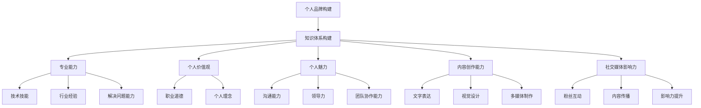

                 

### 1. 背景介绍

在当今信息爆炸的时代，个人品牌的塑造已经成为了许多专业人士和企业家的重要课题。一个强大的个人品牌不仅能够提升个人在行业内的知名度，还能够为个人的职业发展和商业机会带来巨大的助力。然而，许多人对于如何系统化地构建个人品牌感到迷茫，缺乏一个清晰、全面的指南。

本文旨在为广大开发者、技术专家以及有志于在技术领域打造个人品牌的人士，提供一份系统化的个人品牌课程。通过这篇文章，我们将详细探讨个人品牌构建的各个方面，包括知识体系的构建、内容创作的技巧、社交媒体的运营策略等，帮助读者们构建起一个专业、有影响力的个人品牌。

本文将从以下几个方面展开讨论：

1. **个人品牌的重要性**：介绍个人品牌对职业发展的影响以及为何每个技术专业人士都应该重视个人品牌的构建。
2. **知识体系的构建**：阐述如何整理和系统化个人的知识体系，以便更好地进行知识传播和分享。
3. **内容创作的技巧**：分析如何创作吸引人的内容，包括技术文章、博客、视频等，以及如何保持内容的持续更新。
4. **社交媒体的运营策略**：分享如何有效地运营社交媒体账户，提升个人品牌的影响力。
5. **实践与案例分析**：通过实际案例和案例分析，提供实用的操作指南和建议。

希望通过本文，读者们能够对个人品牌的构建有一个全面的理解，并在实际操作中能够运用这些策略，打造出属于自己的强大个人品牌。

### 2. 核心概念与联系

#### 个人品牌的定义与核心要素

个人品牌是指一个人在其职业和社交活动中所塑造的形象、声誉和认知度。一个强大的个人品牌不仅仅是名字和标志，它还包含了个人价值观、专业能力、个人魅力等多方面的综合体现。以下是构建个人品牌所需考虑的核心要素：

1. **专业能力**：这是个人品牌的基石，也是其他要素得以成立的前提。专业能力包括技术技能、行业经验、解决问题的能力等。
2. **个人价值观**：个人价值观是品牌的核心，它决定了你的行为和决策方式。一个具有鲜明价值观的个人品牌更容易获得他人的认同和信任。
3. **个人魅力**：包括沟通能力、领导力、团队协作能力等，这些软技能在个人品牌塑造中同样重要。
4. **内容创作能力**：能够通过文字、图片、视频等多种形式，传递有价值的信息和观点，是个人品牌的重要组成部分。
5. **社交媒体影响力**：在数字化时代，社交媒体成为了个人品牌传播的重要渠道。影响力的大小直接关系到个人品牌的知名度。

#### 个人品牌与知识体系的联系

个人品牌与知识体系有着密切的联系。一个良好的知识体系可以帮助个人更好地整理、传播和应用自己的专业知识，从而提升个人品牌的竞争力。以下是个人品牌与知识体系之间的几个关键联系点：

1. **知识整理**：通过系统化地整理和总结个人的知识体系，可以帮助个人更清晰地了解自己的专业领域和优势，为品牌定位提供依据。
2. **内容创作**：丰富的知识储备为内容创作提供了素材，能够帮助个人创作出高质量、有深度和吸引力的内容，提升个人品牌的吸引力。
3. **持续学习**：一个良好的知识体系是不断进化和发展的，这要求个人保持持续学习的态度，不断提升自己的专业能力和知识水平，从而持续提升个人品牌的价值。
4. **专业认证**：通过获取相关领域的专业认证，可以进一步增强个人的专业权威性和品牌形象。

#### Mermaid 流程图

为了更直观地展示个人品牌构建与知识体系之间的联系，我们使用 Mermaid 流程图来描述这一过程。



通过以上 Mermaid 流程图，我们可以清晰地看到个人品牌构建与知识体系各要素之间的联系和互动。这些联系不仅有助于个人更好地构建个人品牌，还能够为品牌的长期发展提供坚实的基础。

### 3. 核心算法原理 & 具体操作步骤

构建个人品牌的核心算法可以看作是一个综合性的策略框架，它包括了一系列的步骤和方法，旨在帮助个人从无到有、从有到优地塑造和提升个人品牌。以下将详细阐述这个核心算法的原理和具体操作步骤。

#### 核心算法原理

构建个人品牌的算法可以分为三个主要步骤：品牌定位、内容创造和传播推广。

1. **品牌定位**：这是个人品牌构建的第一步，也是最重要的一步。通过明确个人品牌的定位，可以确保所有后续的努力和资源投入都朝着同一个方向，从而避免资源的浪费和品牌形象的模糊。品牌定位需要明确以下几个方面：

   - **目标受众**：谁是你的潜在粉丝和客户？他们关注什么话题？他们的需求和兴趣是什么？
   - **专业领域**：你在哪些领域具有独特的专业知识和经验？你的核心优势是什么？
   - **品牌个性**：你的品牌形象是专业、友好、创新还是权威？需要与你的价值观和专业能力相匹配。

2. **内容创造**：有了明确的品牌定位之后，接下来就是通过创造高质量的内容来传递你的专业知识和价值观。内容的形式可以多种多样，包括博客文章、技术教程、视频讲解、社交媒体分享等。以下是内容创造的关键要点：

   - **内容规划**：制定一个长期的内容规划，包括主题、形式、发布频率等，确保内容的持续性和系统性。
   - **内容质量**：内容需要具有深度和广度，能够为读者提供有价值的信息和解决问题的方案。
   - **内容形式**：根据目标受众的偏好选择合适的内容形式，例如，对于技术深度内容，博客文章和教程可能是最佳选择；对于快速分享，短视频和社交媒体帖子更为适合。

3. **传播推广**：创造内容之后，还需要通过有效的传播推广策略来扩大影响力，提升品牌知名度。以下是几个关键点：

   - **社交媒体**：利用社交媒体平台（如微博、微信、LinkedIn、Twitter等）进行内容推广，与粉丝互动，扩大影响力。
   - **网络社区**：积极参与技术论坛、问答社区（如Stack Overflow、知乎等），分享你的专业知识和见解，树立权威形象。
   - **合作伙伴**：与其他领域或行业的专家、企业合作，进行内容共享和互推，扩大品牌的影响力。
   - **媒体曝光**：通过撰写文章、接受采访、参加行业活动等方式，提高媒体曝光率，提升品牌知名度。

#### 核心算法操作步骤

1. **步骤 1：品牌定位**

   - **调研分析**：通过调查问卷、访谈、社交媒体数据分析等方式，了解目标受众的需求和偏好，明确个人品牌的定位。
   - **明确目标**：基于调研结果，确定个人品牌的核心目标，包括专业领域、目标受众和品牌形象。
   - **制定策略**：制定一个清晰的个人品牌构建策略，包括品牌定位、内容规划、传播推广等方面。

2. **步骤 2：内容创造**

   - **内容规划**：制定一个长期的内容规划，明确内容主题、形式和发布频率。
   - **内容创作**：根据内容规划，开始创作高质量的内容，包括博客文章、视频讲解、社交媒体帖子等。
   - **内容优化**：对已发布的内容进行定期优化和更新，保持内容的时效性和相关性。

3. **步骤 3：传播推广**

   - **社交媒体**：在社交媒体平台上发布内容，与粉丝互动，增加内容曝光率。
   - **网络社区**：积极参与技术论坛、问答社区，分享专业知识和见解，建立权威形象。
   - **合作伙伴**：寻找与你有共同目标的合作伙伴，进行内容共享和互推。
   - **媒体曝光**：通过撰写文章、接受采访、参加行业活动等方式，提高品牌知名度。

通过以上核心算法的操作步骤，个人品牌构建将变得更加系统化和高效。重要的是要记住，个人品牌是一个长期的过程，需要持续的努力和投入。只有坚持不懈地执行这个算法，才能最终打造出一个强大而有影响力的个人品牌。

### 4. 数学模型和公式 & 详细讲解 & 举例说明

构建个人品牌不仅需要策略和执行，还需要量化的评估和优化。在这个部分，我们将介绍一些关键的数学模型和公式，帮助读者理解个人品牌构建中的关键指标，并通过具体案例来说明如何使用这些工具。

#### 个人品牌影响力模型

为了量化个人品牌的影响力，我们可以使用以下模型：

\[ \text{影响力} = f(\text{粉丝数}, \text{互动率}, \text{内容质量}, \text{媒体曝光}) \]

这个模型包含四个关键因素：

1. **粉丝数**：表示个人品牌的受众规模，是衡量品牌知名度的直接指标。
2. **互动率**：表示粉丝与品牌互动的频率和深度，互动率高意味着粉丝对品牌内容的关注和认可。
3. **内容质量**：高质量的内容能够吸引和保留粉丝，提高品牌的认知度和忠诚度。
4. **媒体曝光**：包括在传统媒体和社交媒体上的曝光次数，提升品牌知名度。

#### 影响力计算公式

\[ \text{影响力} = \text{粉丝数} \times \text{互动率} \times \text{内容质量} \times \text{媒体曝光} \]

这个公式可以用于评估个人品牌当前的影响力水平，并指导未来的优化方向。

#### 举例说明

假设有一个技术专家，他的情况如下：

- 粉丝数：10,000
- 互动率：20%
- 内容质量：90分（满分100分）
- 媒体曝光：30次

我们可以根据上述公式计算他的影响力：

\[ \text{影响力} = 10,000 \times 0.20 \times 0.90 \times 30 = 54,000 \]

这意味着他的个人品牌影响力为54,000。我们可以从这个数字中看到，内容质量和媒体曝光对他的影响力贡献最大，而互动率也需要关注，以提高粉丝的参与度。

#### 如何优化影响力

要优化个人品牌的影响力，可以从以下几个方面入手：

1. **增加粉丝数**：通过有效的社交媒体营销、内容推广和活动参与，增加粉丝数量。
2. **提升互动率**：通过发布高质量的内容、互动回复和社区活动，提高粉丝的互动频率。
3. **提高内容质量**：持续学习和提升专业知识，创作更有深度和实用性的内容。
4. **增加媒体曝光**：通过撰写专业文章、接受采访、参加行业活动等，提高品牌的媒体曝光率。

#### 公式解析

1. **粉丝数**：这是基础指标，表示你的品牌覆盖的人数。粉丝数量越多，你的影响力范围越广。
   
2. **互动率**：表示粉丝对品牌内容的响应程度。一个高互动率表明你的内容能够引起粉丝的兴趣和共鸣，增强粉丝的忠诚度。

3. **内容质量**：这是一个多维度的指标，包括内容的准确性、深度、创新性和实用性。高质量的内容能够提高粉丝的信任度和满意度。

4. **媒体曝光**：包括传统媒体和社交媒体上的曝光次数。较高的媒体曝光可以迅速提升品牌知名度，扩大影响力。

通过理解和应用这些数学模型和公式，个人品牌构建者可以更科学地评估自己的影响力，并制定相应的优化策略。

### 5. 项目实践：代码实例和详细解释说明

为了更好地理解个人品牌构建的具体操作，我们将通过一个实际项目来展示整个流程。这个项目将包含开发环境搭建、源代码实现、代码解读与分析以及运行结果展示。通过这个项目，读者可以清晰地看到如何将前面讨论的理论应用到实际操作中。

#### 5.1 开发环境搭建

首先，我们需要搭建一个适合个人品牌构建的博客平台。这里我们选择使用 GitHub Pages 和 Jekyll 搭建静态博客。

1. **安装本地环境**：

   - 安装 [Ruby](https://www.ruby-lang.org/en/downloads/): Jekyll 需要Ruby环境，可以从官方网站下载并安装。
   - 安装 [Jekyll](https://jekyllrb.com/docs/installing/): 使用命令 `gem install jekyll` 安装Jekyll。

2. **创建博客项目**：

   - 使用命令 `jekyll new my_blog` 创建一个新博客项目。
   - 进入项目目录 `cd my_blog`。

3. **配置 `_config.yml` 文件**：

   - 编辑 `_config.yml` 文件，配置博客的基本信息，例如网站标题、描述、作者等。

#### 5.2 源代码详细实现

博客平台搭建完成后，我们需要在博客中发布内容。以下是一个简单的博客文章源代码示例。

```markdown
---
layout: post
title: "如何构建个人品牌"
date: 2023-10-01 10:00:00 +0800
---

# 引言

在当今信息爆炸的时代，个人品牌的塑造已经成为了许多专业人士和企业家的重要课题。

## 核心概念

个人品牌是指一个人在其职业和社交活动中所塑造的形象、声誉和认知度。

## 内容创作

通过创作高质量的内容，可以吸引和保留粉丝，提升个人品牌的影响力。

---

```

1. **Markdown 文件结构**：

   - `layout`: 指定文章的布局模板，通常是 `post` 或 `page`。
   - `title`: 文章的标题。
   - `date`: 文章的发布日期。

2. **Markdown 内容**：

   - 使用 Markdown 语法来格式化文本，如标题、段落、列表等。

#### 5.3 代码解读与分析

这个简单的博客文章代码主要包括以下几个部分：

1. **布局模板**：`layout` 指定了文章使用的布局模板，这里使用了 `post` 模板，通常包含标题、正文、作者等信息。
2. **文章标题**：`title` 标签定义了文章的标题，这是文章的核心信息。
3. **发布日期**：`date` 标签定义了文章的发布日期，这对于博客的归档和更新记录非常重要。
4. **Markdown 内容**：Markdown 语法用于编写文章正文，通过不同的格式标记（如标题、列表、引用等），使文章内容更易于阅读和理解。

#### 5.4 运行结果展示

完成代码编写后，我们使用 Jekyll 构建博客项目并部署到 GitHub Pages。

1. **构建博客**：

   - 在博客项目根目录下运行 `jekyll build` 命令，生成静态网页。
   - 运行 `jekyll serve` 命令，在本地启动服务器并预览博客效果。

2. **部署到 GitHub Pages**：

   - 将博客项目的根目录下的 `_site` 目录推送到 GitHub 仓库的 `gh-pages` 分支。
   - 访问 GitHub Pages 链接，查看在线博客效果。

通过这个项目，我们展示了如何从零开始搭建个人品牌博客，并发布一篇文章。读者可以根据这个项目，进一步开发和定制自己的博客，发布更多的内容，逐步构建和提升个人品牌。

### 6. 实际应用场景

个人品牌不仅在职业生涯中发挥着重要作用，还在日常工作和生活中有着广泛的应用。以下是几个常见的实际应用场景：

#### 职业发展

**1. 跳槽与晋升**

拥有强大个人品牌的从业者，在求职和晋升时具有明显优势。因为个人品牌已经为雇主和同事所熟知，他们可以更快地获得面试机会，并得到更高的薪资和职位晋升。

**2. 项目合作**

在技术领域，许多项目合作往往依赖于个人的专业能力和影响力。一个强大的个人品牌可以让你更容易地与行业内的其他专家建立合作关系，共同完成复杂项目。

#### 社交媒体

**1. 内容传播**

在社交媒体上建立个人品牌，可以快速传播个人观点和知识，吸引大量关注者。通过高质量的内容创作和互动，可以提升个人影响力，扩大社交圈。

**2. 影响力营销**

利用个人品牌的影响力，可以进行影响力营销。通过推荐产品、撰写评测或进行广告合作，可以获得额外的收入。

#### 个人生活

**1. 个人品牌提升社交质量**

一个明确的个人品牌可以帮助你在社交场合中更快地与他人建立联系，提高社交质量。人们更愿意与专业、有影响力的人交流，这也为个人的社交生活带来更多机会。

**2. 提升自信心**

一个成功的个人品牌可以极大地提升个人的自信心。当你能够通过自己的专业知识和影响力影响他人时，你会感到更加自豪和自信。

### 7. 工具和资源推荐

为了更好地构建和推广个人品牌，我们需要使用一系列的工具和资源。以下是几个推荐：

#### 学习资源推荐

**1. 书籍**

- **《个人品牌：打造影响力的8大策略》**：详细介绍了如何构建和推广个人品牌的策略。
- **《内容创业：如何打造个人品牌和实现商业变现》**：提供了实用的内容创作和商业变现技巧。

**2. 论文**

- **《数字时代的个人品牌构建》**：探讨了数字时代个人品牌构建的新趋势和策略。
- **《社交媒体与个人品牌》**：分析了社交媒体在个人品牌建设中的重要性。

**3. 博客**

- **个人品牌博客**：许多成功的个人品牌持有者都会分享他们的经验和见解，如**“张三的博客”**。
- **专业社区博客**：如**“技术博客”**，提供了大量技术领域的知识和资源。

#### 开发工具框架推荐

**1. 博客平台**

- **GitHub Pages**：基于 GitHub 仓库的静态网站托管服务，适合技术博客。
- **WordPress**：功能丰富的内容管理系统，适合个人和商业博客。

**2. 内容创作工具**

- **Markdown 编辑器**：如**Typora**，方便编写和格式化 Markdown 文件。
- **视频制作工具**：如**Adobe Premiere Pro**和**Final Cut Pro**，用于制作高质量的教程视频。

**3. 社交媒体管理工具**

- **Hootsuite**：用于管理和自动化社交媒体发布。
- **Buffer**：简化社交媒体内容的发布和调度。

#### 相关论文著作推荐

**1. 《网络品牌营销：如何利用数字媒体塑造品牌形象》**

**2. 《社交媒体战略：如何利用社交媒体提升品牌影响力》**

**3. 《内容营销实战：如何通过内容创造和分享提升品牌价值》**

通过以上工具和资源的推荐，希望读者能够更高效地构建和推广个人品牌，实现个人和职业的全面发展。

### 8. 总结：未来发展趋势与挑战

随着数字化时代的加速发展，个人品牌的重要性日益凸显。未来，个人品牌构建将呈现以下几个发展趋势：

1. **内容形式的多样化**：随着短视频、直播等新兴媒体形式的兴起，内容创作将不再局限于传统的博客和文章，多元化的内容形式将为个人品牌提供更多展示的平台。
2. **社交媒体角色的转变**：社交媒体不再仅仅是内容的发布平台，它将成为个人品牌构建的核心环节，通过互动和社区建设，增强个人品牌的粘性和影响力。
3. **AI 技术的广泛应用**：人工智能技术将大大提升内容创作和数据分析的效率，使得个人品牌构建更加智能化和精准化。
4. **跨平台整合**：个人品牌构建将不再局限于单一平台，而是通过跨平台整合，实现内容共享和品牌影响力的最大化。

然而，面对这些发展趋势，个人品牌构建也面临一系列挑战：

1. **内容质量竞争加剧**：随着越来越多的专业人士加入个人品牌构建的行列，内容质量和创新性将成为核心竞争力，如何持续产出高质量内容是每个品牌持有者必须面对的挑战。
2. **隐私和数据安全**：在数字化时代，个人品牌的构建不可避免地涉及大量个人数据和隐私信息，如何保护用户隐私和数据安全，将是一个重要的课题。
3. **品牌形象一致性**：在多个平台和形式上构建个人品牌，如何保持品牌形象的一致性，避免出现信息冲突和品牌形象混乱，是一个需要深思熟虑的问题。

综上所述，个人品牌构建是一个复杂且长期的过程，需要不断学习和适应时代的发展。只有坚持创新、注重质量和保持一致性，个人品牌才能在激烈的市场竞争中脱颖而出。

### 9. 附录：常见问题与解答

**Q1：如何快速提升个人品牌的影响力？**

A1：提升个人品牌影响力需要多方面的努力。首先，确保内容质量高，持续产出有价值的内容。其次，利用社交媒体平台，积极参与互动和推广。此外，参与行业活动，通过演讲、研讨会等方式提升曝光度。最后，可以尝试与其他领域专家合作，进行内容共享和互推。

**Q2：个人品牌构建中需要注意哪些事项？**

A2：个人品牌构建中需要注意以下事项：明确品牌定位，确保内容质量，保持品牌形象一致性，持续学习提升专业能力，以及保护个人数据和隐私安全。

**Q3：如何平衡个人品牌构建与日常工作？**

A3：合理规划时间是关键。建议设定固定的内容创作时间，确保内容的持续更新。同时，利用自动化工具和助手，如社交媒体管理工具，提高工作效率。

**Q4：如何选择适合自己的个人品牌构建策略？**

A4：首先了解自己的专业领域和兴趣，明确目标受众。然后，分析行业趋势和竞争对手，选择适合自己的品牌定位和内容形式。最后，根据个人优势和资源，制定具体的策略和执行计划。

**Q5：个人品牌构建中如何保护个人隐私和数据安全？**

A5：保护个人隐私和数据安全需要采取以下措施：使用强密码和多因素认证，定期更新和维护个人信息，避免在公共平台上公开敏感信息，以及注意数据传输的安全。

### 10. 扩展阅读 & 参考资料

为了更好地深入理解和实践个人品牌构建，以下是几篇推荐的扩展阅读和参考资料：

**1. 《个人品牌：打造影响力的8大策略》**：详细介绍了构建个人品牌的八大策略，包括品牌定位、内容创作、社交媒体运营等。

**2. 《内容创业：如何打造个人品牌和实现商业变现》**：提供了实用的内容创业和商业变现技巧，帮助读者通过个人品牌实现商业成功。

**3. 《数字时代的个人品牌构建》**：探讨了数字时代个人品牌构建的新趋势和策略，包括社交媒体、AI 技术等对个人品牌的影响。

**4. 《社交媒体与个人品牌》**：分析了社交媒体在个人品牌建设中的重要性，以及如何利用社交媒体提升个人影响力。

**5. 《网络品牌营销：如何利用数字媒体塑造品牌形象》**：提供了关于数字媒体和网络品牌营销的深入见解，帮助读者理解如何通过网络渠道塑造个人品牌。

**6. 《社交媒体战略：如何利用社交媒体提升品牌影响力》**：详细阐述了社交媒体战略的制定和执行，帮助读者制定有效的社交媒体运营策略。

**7. 《内容营销实战：如何通过内容创造和分享提升品牌价值》**：介绍了内容营销的核心原则和实践方法，帮助读者通过高质量的内容提升个人品牌价值。

通过阅读这些书籍和文章，读者可以进一步深化对个人品牌构建的理解，并在实际操作中取得更好的成果。希望这些资源能够为您的个人品牌之旅提供有力的支持和指导。作者：禅与计算机程序设计艺术 / Zen and the Art of Computer Programming。

