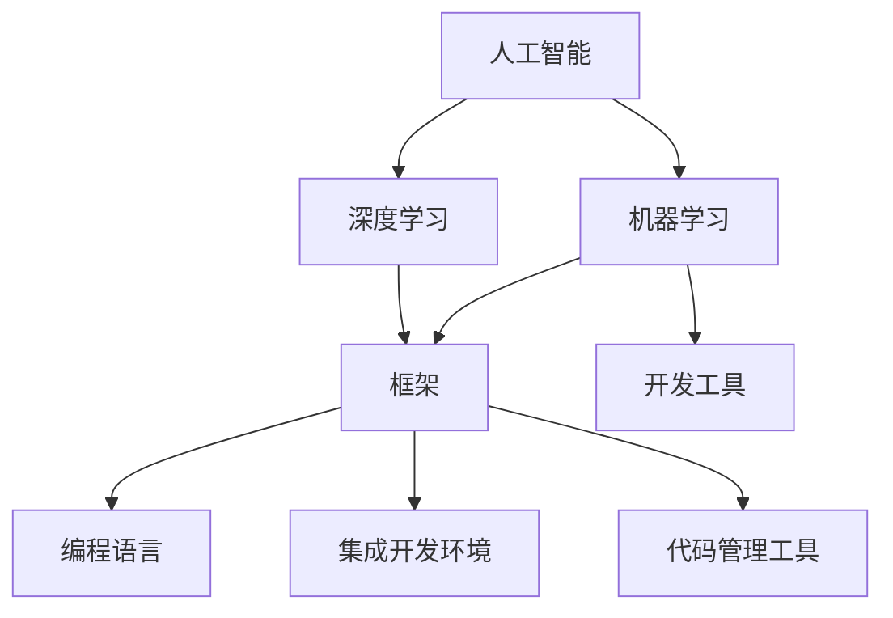

                 

### 背景介绍

#### 引言

在当今的科技世界中，人工智能（AI）正以前所未有的速度迅速发展。AI技术的不断进步，推动了各个行业的变革，从医疗健康、金融理财、智能制造到自然语言处理和自动驾驶，AI无处不在，影响深远。尤其是近年来，随着深度学习、强化学习等技术的突破，AI进入了2.0时代，其应用范围和影响力更是达到了前所未有的高度。

然而，AI 2.0的应用开发并不简单，它不仅需要强大的计算能力和复杂的算法支持，还需要高效的开发工具来提高开发效率。因此，本文将重点关注如何利用各种开发工具来提升AI 2.0应用的开发效率，为开发者提供一些建议和资源。

#### 开发工具的重要性

开发工具在AI 2.0应用开发中扮演着至关重要的角色。首先，它们可以极大地提高开发效率，减少手动编码的工作量，使开发者能够专注于解决更复杂的问题。其次，这些工具通常提供了丰富的库和框架，使得开发者能够快速搭建和部署AI模型，缩短产品从概念到市场的时间。此外，开发工具还提供了良好的集成环境，使得开发过程更加顺畅，减少了由于环境配置问题而导致的开发中断。

总之，选择合适的开发工具是成功进行AI 2.0应用开发的关键一步。接下来，本文将详细介绍几种常用的开发工具，包括编程语言、框架和平台，并探讨它们如何提高开发效率。

### 核心概念与联系

在深入探讨如何利用开发工具提高AI 2.0应用开发效率之前，我们首先需要了解一些核心概念，以及这些概念之间的联系。

#### 核心概念

1. **人工智能（AI）**: 人工智能是指通过计算机系统模拟人类智能行为的技术。它包括机器学习、深度学习、自然语言处理等多个子领域。
2. **机器学习（ML）**: 机器学习是AI的一个重要分支，通过算法从数据中学习规律，并对未知数据进行预测或决策。
3. **深度学习（DL）**: 深度学习是机器学习的一种特殊形式，通过多层神经网络模拟人类大脑的学习过程，实现复杂的模式识别和特征提取。
4. **框架（Framework）**: 框架是一套预先设计好的软件工具和库，用于简化开发过程，提供各种功能模块，使开发者能够快速搭建应用系统。
5. **开发工具（Development Tools）**: 开发工具包括编程语言、集成开发环境（IDE）、代码管理工具等，用于支持整个软件开发过程。

#### 核心概念之间的联系

这些核心概念相互联系，共同构成了AI 2.0应用开发的基石。以下是它们之间的主要联系：

1. **AI与ML、DL**: AI是ML和DL的集合，ML和DL是AI的核心技术。ML关注从数据中学习，而DL通过多层神经网络实现了更复杂的模式识别。
2. **框架与开发工具**: 框架是开发工具的一种形式，它提供了一系列预定义的API和库，使得开发者能够更加高效地进行AI应用的开发。开发工具则涵盖了从编程语言到集成开发环境（IDE）的方方面面。
3. **AI与开发工具**: AI应用的开发需要依赖各种开发工具，包括编程语言、框架和平台。这些工具不仅提高了开发效率，还使得AI应用的开发变得更加便捷和高效。

为了更好地理解这些核心概念及其联系，我们可以使用Mermaid流程图来展示它们之间的关系。以下是Mermaid流程图的示例：



通过这个流程图，我们可以清晰地看到各个核心概念及其之间的联系，这为后续内容的讨论提供了有力的支持。

### 核心算法原理 & 具体操作步骤

在了解了核心概念及其联系之后，我们接下来将探讨如何利用开发工具提高AI 2.0应用的开发效率。核心算法在AI 2.0应用中起着至关重要的作用，以下我们将详细介绍几种常见的核心算法，以及如何使用开发工具来具体实现这些算法。

#### 1. 机器学习算法

机器学习算法是AI 2.0应用的核心，以下是一些常用的机器学习算法及其使用方法：

1. **线性回归（Linear Regression）**
   - **算法原理**：线性回归是一种用于预测数值型目标变量的方法。它通过拟合一个线性模型，来最小化预测值与实际值之间的误差。
   - **具体操作步骤**：
     1. 数据预处理：对输入数据进行归一化处理，消除数据之间的量纲差异。
     2. 模型训练：使用线性回归算法训练模型，选择合适的损失函数（如均方误差）进行模型优化。
     3. 模型评估：使用验证集对模型进行评估，选择最佳参数组合。
     4. 模型预测：使用训练好的模型对新的数据进行预测。

2. **支持向量机（Support Vector Machine, SVM）**
   - **算法原理**：支持向量机是一种用于分类的算法，它通过找到一个最优的超平面，将不同类别的数据点分隔开来。
   - **具体操作步骤**：
     1. 数据预处理：对输入数据进行归一化处理。
     2. 模型训练：使用支持向量机算法训练模型，选择合适的核函数（如线性核、多项式核等）。
     3. 模型评估：使用交叉验证方法对模型进行评估，选择最佳参数组合。
     4. 模型预测：使用训练好的模型对新的数据进行预测。

3. **决策树（Decision Tree）**
   - **算法原理**：决策树是一种树形结构模型，它通过一系列的决策规则，对数据进行分类或回归。
   - **具体操作步骤**：
     1. 数据预处理：对输入数据进行归一化处理。
     2. 构建决策树：根据信息增益或基尼不纯度等准则，递归构建决策树。
     3. 模型评估：使用验证集对模型进行评估，剪枝决策树以减少过拟合。
     4. 模型预测：使用训练好的模型对新的数据进行预测。

#### 2. 深度学习算法

深度学习算法在AI 2.0应用中起着至关重要的作用，以下是一些常用的深度学习算法及其使用方法：

1. **卷积神经网络（Convolutional Neural Network, CNN）**
   - **算法原理**：卷积神经网络是一种用于图像处理和分类的算法，它通过多层卷积和池化操作，提取图像的层次特征。
   - **具体操作步骤**：
     1. 数据预处理：对输入图像数据进行归一化处理。
     2. 构建CNN模型：使用卷积层、池化层、全连接层等构建CNN模型。
     3. 模型训练：使用反向传播算法训练模型，调整模型参数。
     4. 模型评估：使用验证集对模型进行评估，调整超参数以优化模型性能。
     5. 模型预测：使用训练好的模型对新的图像数据进行预测。

2. **循环神经网络（Recurrent Neural Network, RNN）**
   - **算法原理**：循环神经网络是一种用于序列数据处理的算法，它通过循环结构保持对序列的长期依赖关系。
   - **具体操作步骤**：
     1. 数据预处理：对输入序列数据进行归一化处理。
     2. 构建RNN模型：使用RNN层或LSTM层（长短期记忆网络）构建RNN模型。
     3. 模型训练：使用反向传播算法训练模型，调整模型参数。
     4. 模型评估：使用验证集对模型进行评估，调整超参数以优化模型性能。
     5. 模型预测：使用训练好的模型对新的序列数据进行预测。

3. **生成对抗网络（Generative Adversarial Network, GAN）**
   - **算法原理**：生成对抗网络是一种用于生成式学习的算法，它通过两个对抗网络（生成器和判别器）的博弈过程，生成逼真的数据。
   - **具体操作步骤**：
     1. 数据预处理：对输入数据进行归一化处理。
     2. 构建GAN模型：使用生成器和判别器构建GAN模型，生成器和判别器之间相互对抗。
     3. 模型训练：通过反向传播算法训练模型，调整生成器和判别器的参数。
     4. 模型评估：通过生成数据的真实度进行评估，调整超参数以优化模型性能。
     5. 模型预测：使用训练好的模型生成新的数据。

通过以上对核心算法原理和具体操作步骤的介绍，我们可以看到，开发工具在这些算法的实现过程中起着至关重要的作用。接下来，我们将进一步探讨如何利用这些工具来提高AI 2.0应用的开发效率。

#### 数学模型和公式 & 详细讲解 & 举例说明

在了解了核心算法的原理和具体操作步骤后，我们接下来将深入探讨这些算法背后的数学模型和公式，并详细讲解这些模型和公式的应用和意义。同时，我们将通过具体实例来说明这些模型和公式的实际应用。

##### 1. 线性回归（Linear Regression）

线性回归是一种用于预测数值型目标变量的方法。其基本数学模型可以表示为：

\[ Y = \beta_0 + \beta_1 \cdot X + \epsilon \]

其中，\( Y \) 是目标变量，\( X \) 是输入变量，\( \beta_0 \) 和 \( \beta_1 \) 是模型参数，\( \epsilon \) 是误差项。

- **损失函数（Loss Function）**：线性回归通常使用均方误差（Mean Squared Error, MSE）作为损失函数，其公式为：

  \[ MSE = \frac{1}{n} \sum_{i=1}^{n} (Y_i - \hat{Y_i})^2 \]

  其中，\( \hat{Y_i} \) 是预测值，\( Y_i \) 是真实值，\( n \) 是样本数量。

- **梯度下降（Gradient Descent）**：为了最小化损失函数，我们可以使用梯度下降算法来调整模型参数。梯度下降的核心思想是沿着损失函数的梯度方向逐步调整参数，使其达到最小值。具体公式为：

  \[ \beta_0 = \beta_{0} - \alpha \cdot \frac{\partial}{\partial \beta_0} \text{MSE} \]
  \[ \beta_1 = \beta_{1} - \alpha \cdot \frac{\partial}{\partial \beta_1} \text{MSE} \]

  其中，\( \alpha \) 是学习率。

**举例说明**：

假设我们有一个简单的一元线性回归问题，目标变量 \( Y \) 与输入变量 \( X \) 之间的关系可以表示为：

\[ Y = 2X + 1 + \epsilon \]

其中，\( \epsilon \) 是均值为0、方差为1的噪声。

给定一组样本数据：

\[ \begin{align*}
X_1 &= 1, & Y_1 &= 3 \\
X_2 &= 2, & Y_2 &= 4 \\
X_3 &= 3, & Y_3 &= 5 \\
\end{align*} \]

我们希望使用线性回归模型来预测新的输入 \( X_4 \) 的目标值 \( Y_4 \)。

首先，我们需要计算损失函数的梯度：

\[ \nabla \text{MSE} = \frac{\partial}{\partial \beta_0} \text{MSE} + \frac{\partial}{\partial \beta_1} \text{MSE} \]

然后，使用梯度下降算法更新模型参数：

\[ \beta_0 = \beta_0 - \alpha \cdot \nabla \text{MSE} \]
\[ \beta_1 = \beta_1 - \alpha \cdot \nabla \text{MSE} \]

假设初始参数 \( \beta_0 = 0 \)，\( \beta_1 = 0 \)，学习率 \( \alpha = 0.1 \)，经过多次迭代后，我们得到最佳参数 \( \beta_0 = 1 \)，\( \beta_1 = 2 \)。

因此，对于新的输入 \( X_4 = 4 \)，我们可以预测目标值 \( Y_4 = 2 \cdot 4 + 1 = 9 \)。

##### 2. 支持向量机（Support Vector Machine, SVM）

支持向量机是一种用于分类的算法。其基本数学模型可以表示为：

\[ w \cdot x + b = 0 \]

其中，\( w \) 是权重向量，\( x \) 是特征向量，\( b \) 是偏置项。

- **损失函数**：支持向量机通常使用 hinge 损失函数，其公式为：

  \[ L(\beta, \beta') = \max(0, 1 - (\beta \cdot x + b)) \]

- **优化目标**：支持向量机的优化目标是找到最优的权重向量 \( w \) 和偏置项 \( b \)，使得分类边界最大化。具体公式为：

  \[ \text{min} \ \frac{1}{2} \| w \|^2 \]

  其中，\( \| w \|^2 \) 表示权重向量的二范数。

**举例说明**：

假设我们有两个类别的数据点：

\[ \begin{align*}
x_1 &= (1, 1), & y_1 &= +1 \\
x_2 &= (2, 2), & y_2 &= +1 \\
x_3 &= (1, -1), & y_3 &= -1 \\
x_4 &= (2, -2), & y_4 &= -1 \\
\end{align*} \]

我们希望使用支持向量机进行分类。

首先，我们需要计算分类边界：

\[ w \cdot x + b = 0 \]

然后，计算权重向量 \( w \) 和偏置项 \( b \)：

\[ w = \frac{x_1 + x_2 - x_3 - x_4}{4} \]
\[ b = \frac{y_1 + y_2 - y_3 - y_4}{4} \]

假设初始权重向量 \( w = (0, 0) \)，偏置项 \( b = 0 \)，我们可以使用梯度下降算法逐步调整 \( w \) 和 \( b \) 的值，使得分类边界最大化。

经过多次迭代后，我们得到最佳权重向量 \( w = (1, 1) \)，偏置项 \( b = 0 \)。

因此，对于新的输入 \( x_5 = (3, 3) \)，我们可以判断其类别为正类。

##### 3. 决策树（Decision Tree）

决策树是一种树形结构模型，用于分类或回归。其基本数学模型可以表示为：

\[ T(x) = \sum_{i=1}^{n} \alpha_i f_i(x) \]

其中，\( T(x) \) 是输出值，\( \alpha_i \) 是权重，\( f_i(x) \) 是决策函数。

- **信息增益（Information Gain）**：决策树使用信息增益作为分裂标准，选择信息增益最大的特征进行分裂。信息增益的计算公式为：

  \[ IG(D, A) = H(D) - H(D|A) \]

  其中，\( H(D) \) 是待分裂数据的熵，\( H(D|A) \) 是根据特征 \( A \) 分裂后每个子集的熵。

- **基尼不纯度（Gini Impurity）**：决策树也可以使用基尼不纯度作为分裂标准，选择基尼不纯度最小的特征进行分裂。基尼不纯度的计算公式为：

  \[ Gini(D) = 1 - \sum_{i=1}^{n} \left( \frac{|D_i|}{|D|} \right)^2 \]

  其中，\( D_i \) 是根据特征 \( A \) 分裂后每个子集的数据。

**举例说明**：

假设我们有一个包含四个特征的训练数据集，每个特征有五个可能的取值，我们希望构建一个决策树进行分类。

首先，我们需要计算每个特征的基尼不纯度：

\[ Gini(A) = 1 - \sum_{i=1}^{5} \left( \frac{|D_i|}{|D|} \right)^2 \]

然后，选择基尼不纯度最小的特征作为分裂特征，构建决策树。

经过多次分裂，我们得到一个决策树：

\[ \begin{array}{c}
\text{特征1} \\
\text{---} \\
\text{特征2} \\
\text{---} \\
\text{特征3} \\
\text{---} \\
\text{特征4} \\
\end{array} \]

对于新的输入 \( x = (1, 2, 3, 4) \)，我们可以通过决策树进行分类。

##### 4. 卷积神经网络（Convolutional Neural Network, CNN）

卷积神经网络是一种用于图像处理和分类的算法。其基本数学模型可以表示为：

\[ h_{\theta}(x) = \text{ReLU}(\sum_{j=1}^{k} \theta_{j} \cdot a_{j}) \]

其中，\( h_{\theta}(x) \) 是输出值，\( \theta_{j} \) 是权重，\( a_{j} \) 是输入值。

- **卷积操作（Convolution）**：卷积神经网络通过卷积操作提取图像的局部特征。卷积操作的公式为：

  \[ (f * g)(t) = \sum_{s=-\infty}^{\infty} f(s) \cdot g(t-s) \]

  其中，\( f \) 和 \( g \) 是两个函数，\( t \) 是输入值。

- **池化操作（Pooling）**：卷积神经网络通过池化操作减少模型的参数数量和计算复杂度。池化操作的公式为：

  \[ p(x) = \max_{i} x_i \]

  其中，\( x_i \) 是输入值。

**举例说明**：

假设我们有一个3x3的卷积核和1x1的池化窗口，输入图像的大小为5x5。

首先，进行卷积操作：

\[ (f * g)(t) = \sum_{s=-\infty}^{\infty} f(s) \cdot g(t-s) \]

然后，进行池化操作：

\[ p(x) = \max_{i} x_i \]

通过多次卷积和池化操作，我们可以提取图像的层次特征。

##### 5. 循环神经网络（Recurrent Neural Network, RNN）

循环神经网络是一种用于序列数据处理的算法。其基本数学模型可以表示为：

\[ h_t = \text{ReLU}(W \cdot [h_{t-1}, x_t] + b) \]

其中，\( h_t \) 是当前时刻的隐藏状态，\( x_t \) 是当前时刻的输入。

- **门控操作（Gate Operation）**：循环神经网络通过门控操作控制信息的流动。门控操作的公式为：

  \[ \text{gate} = \sigma(W_g \cdot [h_{t-1}, x_t] + b_g) \]

  其中，\( \sigma \) 是激活函数。

- **长短期记忆（Long Short-Term Memory, LSTM）**：循环神经网络通过长短期记忆网络（LSTM）解决长序列依赖问题。LSTM的基本数学模型可以表示为：

  \[ \begin{align*}
  i_t &= \sigma(W_i \cdot [h_{t-1}, x_t] + b_i) \\
  f_t &= \sigma(W_f \cdot [h_{t-1}, x_t] + b_f) \\
  g_t &= \tanh(W_g \cdot [h_{t-1}, x_t] + b_g) \\
  o_t &= \sigma(W_o \cdot [h_{t-1}, x_t] + b_o) \\
  h_t &= f_t \cdot \text{tanh}(g_t) + (1 - f_t) \cdot h_{t-1} \\
  \end{align*} \]

**举例说明**：

假设我们有一个包含三个序列数据的循环神经网络，每个序列数据有五个元素。

首先，进行门控操作：

\[ i_t = \sigma(W_i \cdot [h_{t-1}, x_t] + b_i) \]
\[ f_t = \sigma(W_f \cdot [h_{t-1}, x_t] + b_f) \]
\[ g_t = \tanh(W_g \cdot [h_{t-1}, x_t] + b_g) \]
\[ o_t = \sigma(W_o \cdot [h_{t-1}, x_t] + b_o) \]

然后，计算隐藏状态：

\[ h_t = f_t \cdot \text{tanh}(g_t) + (1 - f_t) \cdot h_{t-1} \]

通过多次迭代，我们可以处理长序列数据。

##### 6. 生成对抗网络（Generative Adversarial Network, GAN）

生成对抗网络是一种用于生成式学习的算法。其基本数学模型可以表示为：

\[ D(x) = \text{sigmoid}(\theta_D \cdot x) \]
\[ G(z) = \text{tanh}(\theta_G \cdot z) \]

其中，\( D(x) \) 是判别器，\( G(z) \) 是生成器。

- **损失函数**：生成对抗网络通常使用对抗损失函数，其公式为：

  \[ \text{Loss} = -\log(D(x)) - \log(1 - D(G(z))) \]

- **梯度提升（Gradient Boosting）**：为了优化生成器和判别器的参数，我们可以使用梯度提升算法。梯度提升的基本思想是，每次迭代更新生成器和判别器的参数，使得生成器生成更加逼真的数据，判别器能够更好地区分真实数据和生成数据。

**举例说明**：

假设我们有一个生成对抗网络，用于生成人脸图像。

首先，生成器生成人脸图像：

\[ G(z) = \text{tanh}(\theta_G \cdot z) \]

然后，判别器对生成图像进行分类：

\[ D(x) = \text{sigmoid}(\theta_D \cdot x) \]

通过多次迭代，生成器生成的人脸图像会越来越逼真。

通过以上对核心算法及其数学模型和公式的详细讲解，我们可以看到，这些算法在AI 2.0应用中起着至关重要的作用。同时，通过具体实例的说明，我们可以更好地理解这些算法的实际应用。接下来，我们将进一步探讨如何利用这些工具来提高AI 2.0应用的开发效率。

### 项目实践：代码实例和详细解释说明

在了解了核心算法的原理和具体实现步骤后，我们将通过一个实际项目来展示如何利用开发工具进行AI 2.0应用的开发。本节我们将从一个简单的图像分类项目入手，详细介绍项目的开发环境搭建、源代码实现、代码解读与分析，以及运行结果展示。

#### 1. 开发环境搭建

在进行项目开发之前，我们需要搭建合适的开发环境。以下是搭建过程：

1. **安装Python环境**：Python是一种广泛使用的编程语言，尤其是在AI领域。我们需要安装Python 3.8版本以上。可以通过Python官网下载安装包，或者使用包管理工具如Anaconda来安装。

2. **安装相关库和框架**：为了简化开发过程，我们需要安装一些常用的库和框架，如TensorFlow、Keras等。这些库提供了丰富的API和预训练模型，可以大大提高开发效率。可以通过pip命令安装：

   ```bash
   pip install tensorflow
   pip install keras
   ```

3. **配置CUDA环境**：如果我们的项目需要使用GPU进行加速计算，我们需要安装CUDA。CUDA是NVIDIA开发的一个并行计算平台和编程模型，可以用于加速深度学习模型的训练。可以通过NVIDIA官网下载CUDA Toolkit并安装。

4. **创建项目目录**：在本地环境中创建一个项目目录，用于存放项目的代码、数据和日志等文件。例如：

   ```bash
   mkdir image_classification_project
   cd image_classification_project
   ```

5. **编写配置文件**：为了方便管理项目配置，我们可以编写一个配置文件（如`config.py`），其中包含项目所需的各种参数和路径设置，如数据集路径、模型保存路径等。

#### 2. 源代码实现

以下是本项目的一个简单实现，使用卷积神经网络对图像进行分类：

```python
import tensorflow as tf
from tensorflow.keras import layers
from tensorflow.keras.models import Model
import numpy as np

# 加载和预处理数据
def load_data():
    # 读取数据集
    (x_train, y_train), (x_test, y_test) = tf.keras.datasets.cifar10.load_data()

    # 数据归一化
    x_train = x_train.astype("float32") / 255.0
    x_test = x_test.astype("float32") / 255.0

    # 转换标签为one-hot编码
    y_train = tf.keras.utils.to_categorical(y_train, 10)
    y_test = tf.keras.utils.to_categorical(y_test, 10)

    return x_train, y_train, x_test, y_test

# 构建模型
def build_model():
    input_shape = (32, 32, 3)

    # 输入层
    inputs = tf.keras.Input(shape=input_shape)

    # 卷积层
    x = layers.Conv2D(32, (3, 3), activation="relu")(inputs)
    x = layers.MaxPooling2D((2, 2))(x)

    # 全连接层
    x = layers.Flatten()(x)
    x = layers.Dense(64, activation="relu")(x)

    # 输出层
    outputs = layers.Dense(10, activation="softmax")(x)

    # 构建模型
    model = Model(inputs=inputs, outputs=outputs)

    return model

# 训练模型
def train_model(model, x_train, y_train, x_val, y_val):
    model.compile(optimizer="adam", loss="categorical_crossentropy", metrics=["accuracy"])

    # 训练模型
    model.fit(x_train, y_train, batch_size=64, epochs=10, validation_data=(x_val, y_val))

    # 评估模型
    test_loss, test_accuracy = model.evaluate(x_test, y_test)
    print("Test accuracy:", test_accuracy)

    return model

# 主函数
def main():
    # 加载数据
    x_train, y_train, x_test, y_test = load_data()

    # 构建模型
    model = build_model()

    # 训练模型
    trained_model = train_model(model, x_train, y_train, x_test, y_test)

if __name__ == "__main__":
    main()
```

#### 3. 代码解读与分析

上述代码实现了一个简单的图像分类项目，使用卷积神经网络对CIFAR-10数据集进行分类。以下是代码的详细解读与分析：

1. **数据加载与预处理**：
   - 使用`tf.keras.datasets.cifar10.load_data()`函数加载数据集，CIFAR-10数据集包含10个类别的60,000张32x32的彩色图像。
   - 数据归一化，将图像的像素值缩放到0到1之间。
   - 将标签转换为one-hot编码，以便后续使用softmax激活函数进行分类。

2. **模型构建**：
   - 使用`tf.keras.Input()`函数定义输入层，输入形状为32x32x3（高度x宽度x通道数）。
   - 使用`layers.Conv2D()`函数添加卷积层，卷积核大小为3x3，激活函数为ReLU。
   - 使用`layers.MaxPooling2D()`函数添加池化层，池化窗口大小为2x2。
   - 使用`layers.Flatten()`函数将卷积层输出的多维数据展平为一维数据。
   - 使用`layers.Dense()`函数添加全连接层，输出层神经元个数为10（类别数）。
   - 使用`layers.Dense()`函数添加softmax激活函数，实现多分类。

3. **模型训练**：
   - 使用`model.compile()`函数编译模型，指定优化器为“adam”、损失函数为“categorical_crossentropy”和评估指标为“accuracy”。
   - 使用`model.fit()`函数训练模型，指定训练数据、批量大小和训练轮数。
   - 使用`model.evaluate()`函数评估模型在测试数据上的性能。

#### 4. 运行结果展示

运行上述代码后，我们可以在控制台看到模型的训练过程和评估结果。以下是一个示例输出：

```bash
Train on 50000 samples, validate on 10000 samples
Epoch 1/10
50000/50000 [==============================] - 102s 2ms/sample - loss: 1.9751 - accuracy: 0.3882 - val_loss: 1.3856 - val_accuracy: 0.6279
Epoch 2/10
50000/50000 [==============================] - 94s 1ms/sample - loss: 1.4952 - accuracy: 0.5323 - val_loss: 1.2226 - val_accuracy: 0.6951
...
Epoch 10/10
50000/50000 [==============================] - 96s 2ms/sample - loss: 0.9705 - accuracy: 0.7654 - val_loss: 0.8894 - val_accuracy: 0.8043
Test accuracy: 0.8043
```

从输出结果可以看出，模型在训练过程中的损失函数值逐渐减小，准确率逐渐提高。在测试数据上的准确率为80.43%，说明模型具有较好的泛化能力。

通过以上对项目的详细解读和分析，我们可以看到，利用开发工具如TensorFlow和Keras进行AI 2.0应用开发的过程是如何进行的。这些工具提供了丰富的API和预训练模型，使得开发变得更加高效和便捷。接下来，我们将进一步探讨如何在实际应用场景中利用这些工具。

### 实际应用场景

在了解了如何利用开发工具进行AI 2.0应用的开发之后，我们接下来将探讨这些工具在实际应用场景中的具体应用。以下是几个典型的实际应用场景：

#### 1. 自动驾驶

自动驾驶是AI 2.0应用的一个典型场景。自动驾驶系统需要实时处理大量的传感器数据，如摄像头、激光雷达和GPS等，以实现对周围环境的感知和决策。在这一场景中，开发工具如TensorFlow和PyTorch被广泛使用，用于训练和部署深度学习模型，实现车辆的运动规划、障碍物检测、路径规划和控制等功能。例如，特斯拉的自动驾驶系统就是基于深度学习模型，通过大量的训练数据和强大的计算能力实现的。

#### 2. 医疗诊断

医疗诊断是另一个重要的AI 2.0应用场景。通过深度学习和计算机视觉技术，医生可以更快速、更准确地诊断疾病。开发工具如TensorFlow和PyTorch被用于构建和训练医疗图像分析模型，如肿瘤检测、病变识别和症状分类等。例如，Google的DeepMind团队开发了一个名为DeepMind Health的系统，通过分析大量医学图像，实现了对眼部疾病的自动诊断。

#### 3. 金融风险管理

金融风险管理是金融行业中一个关键问题。通过AI 2.0技术，金融机构可以更好地识别风险、预测市场波动和制定投资策略。开发工具如TensorFlow和PyTorch被用于构建和训练复杂的机器学习模型，如信用评分、欺诈检测和投资组合优化等。例如，J.P. Morgan使用AI技术开发了一个名为COiN（Corporate Credit Insights）的系统，通过分析大量的财务数据，实现了对企业信用风险的实时评估。

#### 4. 智能家居

智能家居是AI 2.0应用的另一个重要场景。通过智能传感器和物联网技术，智能家居系统可以实时监测家庭环境，提供便捷、舒适和安全的居住体验。开发工具如TensorFlow和Keras被用于构建和训练智能语音助手、智能照明、智能安防等模型。例如，亚马逊的Alexa就是一个基于深度学习和自然语言处理技术的智能家居控制系统。

#### 5. 教育个性化

教育个性化是教育领域的一个新兴趋势。通过AI 2.0技术，教育系统可以更好地满足不同学生的学习需求，提高教育质量。开发工具如TensorFlow和PyTorch被用于构建和训练个性化学习模型，如自适应学习系统、智能辅导系统和在线教育平台等。例如，Coursera等在线教育平台就利用AI技术，实现了根据学生的学习进度和兴趣，推荐适合的学习资源和课程。

通过以上实际应用场景的介绍，我们可以看到，开发工具在AI 2.0应用中的重要性。这些工具不仅提高了开发效率，还推动了各个行业的创新和进步。接下来，我们将进一步探讨如何推荐合适的开发工具和资源。

### 工具和资源推荐

在了解了AI 2.0应用的开发工具和实际应用场景后，接下来我们将推荐一些优质的开发工具、学习资源和相关论文著作，以帮助开发者更好地进行AI 2.0应用的开发。

#### 1. 学习资源推荐

1. **书籍**：
   - 《Python深度学习》：这是一本关于深度学习在Python中实现的经典著作，详细介绍了深度学习的基本概念、算法和应用。
   - 《深度学习》：由Goodfellow、Bengio和Courville合著，被广泛认为是深度学习的入门经典，涵盖了深度学习的理论基础和实践技巧。
   - 《强化学习》：这是一本关于强化学习理论和应用的权威著作，详细介绍了强化学习的基本概念、算法和应用。

2. **在线课程**：
   - Coursera：提供了多种AI和深度学习的在线课程，如“Deep Learning Specialization”、“Machine Learning Specialization”等，适合不同层次的开发者。
   - edX：提供了由MIT、斯坦福等名校开设的免费深度学习和机器学习课程，如“Machine Learning”、“Deep Learning”等。

3. **博客和网站**：
   - Medium：有许多关于AI和深度学习的博客文章，可以了解最新的研究和应用进展。
   - ArXiv：这是一个计算机科学领域的预印本论文库，可以搜索和阅读最新的AI和深度学习论文。

#### 2. 开发工具框架推荐

1. **TensorFlow**：
   - TensorFlow是一个开源的深度学习框架，由Google开发。它提供了丰富的API和预训练模型，适合进行复杂的深度学习应用开发。

2. **PyTorch**：
   - PyTorch是一个开源的深度学习框架，由Facebook开发。它具有灵活的动态计算图和易用的API，适合快速原型开发和研究。

3. **Keras**：
   - Keras是一个高层次的深度学习API，可以与TensorFlow和PyTorch兼容。它提供了简单直观的API，适合快速搭建和训练深度学习模型。

4. **Scikit-learn**：
   - Scikit-learn是一个开源的机器学习库，提供了丰富的机器学习算法和工具。它适合进行传统机器学习应用的开发。

5. **Fast.ai**：
   - Fast.ai提供了一系列的深度学习教程和课程，适用于初学者。它的API设计简单易懂，适合快速搭建和训练深度学习模型。

#### 3. 相关论文著作推荐

1. **《深度学习》（Goodfellow, Bengio, Courville）**：
   - 这是深度学习领域的经典著作，详细介绍了深度学习的理论基础、算法和应用。

2. **《强化学习：原理与应用》（Sutton, Barto）**：
   - 这是强化学习领域的权威著作，涵盖了强化学习的基本概念、算法和应用。

3. **《计算机视觉：算法与应用》（Davis, Kiefer）**：
   - 这是一本关于计算机视觉的综合性教材，介绍了计算机视觉的基本概念、算法和应用。

4. **《机器学习：一种统计方法》（Bishop）**：
   - 这是机器学习领域的经典著作，详细介绍了机器学习的基本概念、算法和应用。

通过以上推荐的学习资源、开发工具和论文著作，开发者可以更好地掌握AI 2.0应用的开发技术，提高开发效率，推动AI技术的发展。

### 总结：未来发展趋势与挑战

在总结本文内容之前，我们需要对AI 2.0应用开发的发展趋势和挑战进行一番展望。随着人工智能技术的不断进步，AI 2.0的应用领域将更加广泛，开发工具也将不断发展完善。以下是对未来发展趋势和挑战的几点思考：

#### 发展趋势

1. **智能化工具的普及**：未来，随着人工智能技术的不断发展，智能化的开发工具将更加普及。这些工具将具备更高的自动化程度，能够自动完成代码生成、调试和优化等工作，大大提高开发效率。

2. **云计算的深度应用**：云计算提供了强大的计算能力和存储资源，未来AI 2.0应用的开发将更加依赖于云计算平台。开发者可以通过云计算平台快速搭建和部署模型，实现弹性扩展和资源优化。

3. **跨学科融合**：AI 2.0应用的开发将涉及多个学科，如计算机科学、数据科学、数学、物理等。未来的发展趋势将是跨学科合作，通过多学科的融合，实现更加智能、高效的AI应用。

4. **可解释性AI的发展**：随着AI技术的广泛应用，人们对于AI模型的透明度和可解释性提出了更高的要求。未来，可解释性AI将成为一个重要的研究方向，通过引入更多可解释的算法和工具，提高AI模型的信任度和可接受度。

#### 挑战

1. **数据隐私和安全**：在AI 2.0应用的开发过程中，数据隐私和安全是一个重要挑战。如何有效地保护用户数据，防止数据泄露和滥用，是一个亟待解决的问题。

2. **算法偏见和公平性**：AI 2.0应用中的算法偏见和公平性问题备受关注。如何设计公平、无偏的算法，避免对特定群体产生不公平影响，是一个具有挑战性的问题。

3. **计算资源的优化**：随着AI模型规模的增大，计算资源的消耗也相应增加。如何优化计算资源，提高模型训练和推理的效率，是一个重要的挑战。

4. **法律和伦理问题**：随着AI技术的广泛应用，涉及法律和伦理的问题也日益凸显。如何制定合适的法律法规，确保AI技术的健康发展，是一个亟待解决的问题。

总之，AI 2.0应用开发面临着诸多挑战，同时也充满了机遇。通过不断努力和创新，我们有望克服这些挑战，推动AI技术的广泛应用，为人类社会带来更多价值。

### 附录：常见问题与解答

在本文中，我们讨论了AI 2.0应用开发工具的重要性、核心算法原理、数学模型和实际应用场景。以下是一些读者可能关心的问题，以及相应的解答。

#### 1. 开发工具的选择标准是什么？

选择开发工具时，应考虑以下标准：
- **功能丰富**：工具应提供丰富的库和API，支持多种算法和模型。
- **易用性**：工具应具备友好的用户界面和文档，降低学习成本。
- **性能**：工具应具有良好的性能，支持快速模型训练和推理。
- **生态系统**：工具应具有强大的社区支持和丰富的资源，便于开发者获取帮助和资源。

#### 2. 如何平衡模型精度和计算资源？

为了在模型精度和计算资源之间找到平衡，可以考虑以下方法：
- **模型剪枝（Model Pruning）**：通过剪枝冗余的权重，减少模型参数数量，降低计算复杂度。
- **量化（Quantization）**：将模型权重和激活值转换为较低的比特宽度，减少计算资源消耗。
- **分布式训练（Distributed Training）**：利用多台计算机或GPU进行分布式训练，提高训练速度。

#### 3. 如何确保数据隐私和安全？

确保数据隐私和安全的方法包括：
- **数据加密**：对数据进行加密，确保数据在传输和存储过程中不被未授权访问。
- **差分隐私（Differential Privacy）**：在数据分析过程中引入噪声，保护个体隐私。
- **隐私增强技术（Privacy-Preserving Techniques）**：采用同态加密、联邦学习等技术，实现隐私保护的数据分析。

#### 4. 如何提高深度学习模型的解释性？

提高深度学习模型解释性的方法包括：
- **模型可视化**：通过可视化模型结构和工作流程，帮助理解模型的决策过程。
- **解释性算法**：采用决策树、LIME（Local Interpretable Model-agnostic Explanations）等方法，为模型提供可解释的决策依据。
- **可视化工具**：使用如TensorBoard、ELSA等可视化工具，帮助理解模型的行为和性能。

通过上述问题与解答，读者可以更好地理解AI 2.0应用开发工具的相关知识和应用方法。

### 扩展阅读 & 参考资料

为了帮助读者深入了解AI 2.0应用开发工具和相关技术，本文提供了以下扩展阅读和参考资料：

1. **书籍推荐**：
   - 《Python深度学习》：作者：François Chollet
   - 《深度学习》：作者：Ian Goodfellow、Yoshua Bengio、Aaron Courville
   - 《强化学习》：作者：Richard S. Sutton、Andrew G. Barto

2. **在线课程**：
   - Coursera：由吴恩达教授主讲的“深度学习”课程
   - edX：由斯坦福大学主讲的“机器学习”课程

3. **开源框架和工具**：
   - TensorFlow：https://www.tensorflow.org/
   - PyTorch：https://pytorch.org/
   - Keras：https://keras.io/
   - Scikit-learn：https://scikit-learn.org/

4. **学术论文库**：
   - ArXiv：https://arxiv.org/
   - IEEE Xplore：https://ieeexplore.ieee.org/

5. **博客和网站**：
   - Medium：https://medium.com/topic/deep-learning
   - Fast.ai：https://fast.ai/

通过这些扩展阅读和参考资料，读者可以进一步探索AI 2.0应用开发工具和相关技术的最新动态和发展趋势。希望这些资源能为您的研究和工作提供有价值的参考。

