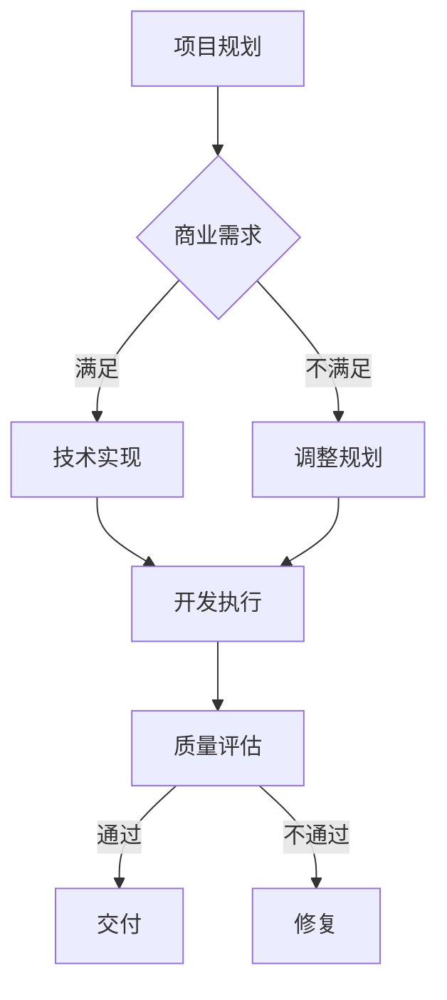
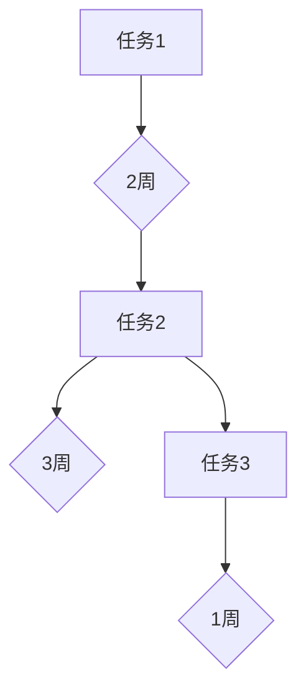
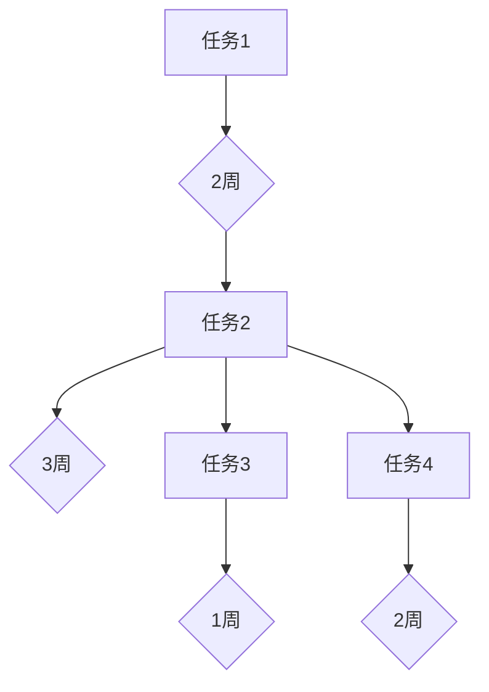

                 

### 文章标题

开源项目的商业化时间管理：平衡开发与业务

> **关键词**：开源项目，商业化，时间管理，开发与业务平衡
>
> **摘要**：本文将探讨开源项目的商业化时间管理问题，分析如何平衡开源项目的开发与业务需求，提出一系列策略和方法，旨在帮助开源项目团队实现可持续发展。

---

### 1. 背景介绍

在当今信息技术快速发展的时代，开源项目已经成为推动技术创新的重要力量。许多企业、开发者社区和个人都参与到开源项目中，为全球的开发者提供了丰富的技术资源和交流平台。然而，随着开源项目的规模和影响力的不断扩大，商业化问题逐渐成为开源社区关注的焦点。

开源项目的商业化不仅涉及到项目本身的经济利益，还涉及到项目的可持续发展、团队建设以及社区管理等各个方面。如何平衡开源项目的开发与商业需求，成为一个重要的研究课题。本文将围绕这一问题，探讨开源项目的商业化时间管理，提供一系列策略和方法，帮助开源项目团队实现商业成功与技术创新的统一。

---

### 2. 核心概念与联系

#### 2.1 开源项目商业化

开源项目商业化是指将开源项目转化为商业价值的过程。这包括将开源技术应用于企业产品、提供商业化服务、开发付费功能或扩展等。开源项目商业化不仅能够为项目带来经济收益，还可以促进技术的创新和推广。

#### 2.2 时间管理

时间管理是指对项目的时间进行合理安排和分配，确保项目在预定的时间内完成。在开源项目商业化过程中，时间管理尤为重要，因为它直接影响到项目的成功与否。

#### 2.3 开发与业务平衡

开发与业务平衡是指开源项目团队在开发过程中需要兼顾技术实现和商业需求，确保项目既能够满足技术发展要求，又能够符合商业目标。

#### 2.4 Mermaid 流程图



### 3. 核心算法原理 & 具体操作步骤

#### 3.1 项目规划

项目规划是开源项目商业化的第一步，主要包括以下任务：

1. **确定商业目标**：明确项目商业化的目标，例如盈利、市场份额、技术领先等。
2. **分析市场需求**：了解市场需求，确定项目能够解决的问题和潜在的用户群体。
3. **制定项目计划**：根据商业目标和市场需求，制定详细的项目计划，包括时间表、任务分配、资源需求等。

#### 3.2 技术实现

在项目规划确定后，进入技术实现阶段。主要包括以下任务：

1. **技术选型**：选择适合项目需求的技术框架和工具。
2. **代码开发**：按照项目计划进行代码开发，确保代码质量和可维护性。
3. **代码审查**：定期进行代码审查，确保代码的质量和安全性。

#### 3.3 开发执行

在开发执行阶段，需要按照项目计划进行任务分配和进度跟踪。主要包括以下任务：

1. **任务分配**：根据团队成员的能力和兴趣，合理分配任务。
2. **进度跟踪**：使用项目管理工具，如JIRA、Trello等，实时跟踪项目进度。
3. **沟通协调**：保持团队内部和与其他部门的沟通，确保项目顺利进行。

#### 3.4 质量评估

在项目开发完成后，需要进行质量评估，确保项目符合预期要求。主要包括以下任务：

1. **代码测试**：进行单元测试、集成测试和系统测试，确保代码的功能和性能。
2. **用户反馈**：收集用户反馈，了解产品的使用情况和用户需求。
3. **评估报告**：根据测试结果和用户反馈，撰写评估报告，为项目交付和后续改进提供依据。

#### 3.5 交付

在质量评估通过后，进入项目交付阶段。主要包括以下任务：

1. **产品交付**：将项目产品交付给客户或用户。
2. **培训支持**：为用户提供培训和技术支持，确保用户能够正确使用产品。
3. **后续维护**：提供产品维护和技术支持，确保产品的长期稳定运行。

### 4. 数学模型和公式 & 详细讲解 & 举例说明

在开源项目的商业化时间管理中，数学模型和公式可以帮助我们更好地进行项目规划和进度控制。以下是几个常用的数学模型和公式的详细讲解和举例说明。

#### 4.1 甘特图

甘特图是一种常用的项目管理工具，用于展示项目的时间线和任务进度。它的基本公式如下：

$$
\text{甘特图} = \{T_1, T_2, ..., T_n\}
$$

其中，$T_i$表示第$i$个任务的持续时间。

举例说明：

假设我们有一个包含三个任务的项目，任务1持续2周，任务2持续3周，任务3持续1周。那么甘特图的表示如下：



#### 4.2 关键路径法（CPM）

关键路径法是一种用于确定项目最短完成时间的方法。它的基本公式如下：

$$
\text{CPM} = \sum_{i=1}^{n} \text{E_i} - \sum_{i=1}^{n} \text{L_i}
$$

其中，$E_i$表示第$i$个任务的总持续时间，$L_i$表示第$i$个任务的自由时差。

举例说明：

假设我们有一个包含四个任务的项目，任务1持续2周，任务2持续3周，任务3持续1周，任务4持续2周。任务1和任务2之间存在依赖关系，即任务2必须在任务1完成后才能开始。那么关键路径法的表示如下：



在这个例子中，关键路径是A-B-C-D，总持续时间是2+3+2=7周。

### 5. 项目实践：代码实例和详细解释说明

为了更好地理解开源项目的商业化时间管理，我们通过一个实际的代码实例来进行讲解。以下是一个简单的开源项目，用于实现一个待办事项列表。

#### 5.1 开发环境搭建

在开始编写代码之前，我们需要搭建一个开发环境。以下是使用Python语言的开发环境搭建步骤：

1. **安装Python**：在官方网站下载并安装Python 3.x版本。
2. **安装IDE**：推荐使用PyCharm、VSCode等集成开发环境。
3. **安装依赖库**：在项目中使用pip命令安装所需的依赖库，例如`requests`、`beautifulsoup4`等。

#### 5.2 源代码详细实现

以下是待办事项列表项目的源代码实现：

```python
import sqlite3
from tkinter import *

class TodoApp:
    def __init__(self, window):
        self.window = window
        self.window.title("Todo App")

        self.connect_db()
        self.create_table()

        self.frame = Frame(self.window)
        self.frame.pack()

        self.listbox = Listbox(self.frame, width=50, height=10)
        self.listbox.pack(side=LEFT, fill=BOTH, expand=True)

        self.scrollbar = Scrollbar(self.frame)
        self.scrollbar.pack(side=RIGHT, fill=Y)

        self.listbox.config(yscrollcommand=self.scrollbar.set)
        self.scrollbar.config(command=self.listbox.yview)

        self.entry = Entry(self.frame, width=50)
        self.entry.pack(side=BOTTOM, fill=X)

        self.button = Button(self.frame, text="Add", command=self.add_item)
        self.button.pack(side=BOTTOM, fill=X)

        self.window.bind("<Return>", self.add_item)

    def connect_db(self):
        self.conn = sqlite3.connect("todos.db")
        self.cursor = self.conn.cursor()

    def create_table(self):
        self.cursor.execute("CREATE TABLE IF NOT EXISTS todos (id INTEGER PRIMARY KEY, task TEXT)")
        self.conn.commit()

    def add_item(self, event=None):
        task = self.entry.get()
        if task:
            self.cursor.execute("INSERT INTO todos (task) VALUES (?)", (task,))
            self.conn.commit()
            self.listbox.insert(END, task)
            self.entry.delete(0, END)

    def run(self):
        self.window.mainloop()

if __name__ == "__main__":
    window = Tk()
    app = TodoApp(window)
    app.run()
```

#### 5.3 代码解读与分析

1. **导入模块**：首先，我们导入了所需的模块，包括`sqlite3`用于数据库操作和`tkinter`用于图形界面设计。
2. **定义TodoApp类**：`TodoApp`类用于实现待办事项列表的功能。其中，`__init__`方法用于初始化界面和数据库连接，`connect_db`方法用于连接数据库，`create_table`方法用于创建数据库表，`add_item`方法用于添加待办事项，`run`方法用于启动界面。
3. **界面设计**：使用`tkinter`模块设计了待办事项列表的界面，包括列表框、文本输入框和按钮。
4. **数据库操作**：使用`sqlite3`模块实现了数据库的连接和操作，包括创建表、插入数据和查询数据。

#### 5.4 运行结果展示

运行待办事项列表项目后，界面如下所示：


用户可以在文本输入框中输入待办事项，点击“Add”按钮或按回车键将待办事项添加到列表中。

---

### 6. 实际应用场景

开源项目的商业化在多个领域都有广泛的应用场景，以下是几个典型的实际应用场景：

#### 6.1 企业内部应用

许多企业将开源项目用于内部应用，例如开发企业级的Web应用、大数据平台、自动化测试工具等。通过商业化这些开源项目，企业可以提高生产效率、降低开发成本，同时也能够对外展示自己的技术实力。

#### 6.2 SaaS服务

一些开源项目可以被开发成SaaS（软件即服务）产品，提供给企业用户使用。例如，开源的CRM系统、项目管理系统、文档管理平台等。这些SaaS产品可以通过订阅模式实现商业化，为用户提供稳定的服务和技术支持。

#### 6.3 商业化插件和扩展

开源项目中的某些功能可以单独商业化，作为付费插件或扩展提供。例如，一些开源的Web框架、数据库系统等可以开发付费的插件，为用户提供额外的功能和性能优化。

#### 6.4 技术培训和咨询服务

开源项目团队可以通过提供技术培训和咨询服务实现商业化。这些服务包括线上培训课程、线下工作坊、定制化的技术解决方案等。通过这些服务，团队不仅能够获得经济收益，还能够提升自己在技术领域的影响力。

---

### 7. 工具和资源推荐

在开源项目的商业化管理过程中，选择合适的工具和资源至关重要。以下是一些建议的工具和资源：

#### 7.1 学习资源推荐

1. **书籍**：
   - 《开源项目管理》
   - 《敏捷软件开发：原则、实践与模式》
   - 《产品经理手册》
2. **论文**：
   - “Open Source Business Models” by Marko Rodriguez
   - “A Survey of Open Source Project Success Factors” by Paulo M. B. Vaz et al.
3. **博客**：
   - Opensource.com
   - Medium上的开源项目相关文章
4. **网站**：
   - GitHub
   - GitLab
   - SourceForge

#### 7.2 开发工具框架推荐

1. **集成开发环境**：
   - PyCharm
   - VSCode
   - IntelliJ IDEA
2. **项目管理工具**：
   - JIRA
   - Trello
   - Asana
3. **代码仓库**：
   - GitHub
   - GitLab
   - Bitbucket

#### 7.3 相关论文著作推荐

1. “The Economics of Open Source” by Chris Anderson
2. “Open Source Models: A Survey” by Rodrigo Lourencos et al.
3. “Open Core Models: A Systematic Review” by John W. Moore et al.

---

### 8. 总结：未来发展趋势与挑战

开源项目的商业化时间管理是一个复杂的课题，涉及到项目规划、技术实现、团队协作等多个方面。随着开源项目的不断发展和商业化需求的日益增长，这一领域将会面临以下发展趋势和挑战：

#### 发展趋势

1. **开源项目商业化模式多样化**：随着市场需求的不断变化，开源项目的商业化模式也将多样化，包括SaaS服务、付费插件、技术培训等多种形式。
2. **社区参与的深度和广度增加**：开源项目社区参与的重要性将日益凸显，社区成员的参与不仅能够推动项目的创新，还能够为项目的商业化提供支持。
3. **技术管理和运营能力的提升**：开源项目团队需要不断提升技术管理和运营能力，以适应商业化带来的新挑战。

#### 挑战

1. **时间管理难题**：开源项目的商业化需要平衡开发与业务需求，时间管理成为一大难题。如何确保项目在有限的时间内实现商业目标，是团队需要面对的挑战。
2. **团队协作与沟通**：商业化的开源项目往往涉及多个部门和团队成员的协作，如何确保团队内部的沟通与协作高效，是项目成功的关键。
3. **风险管理**：开源项目的商业化过程可能面临各种风险，如技术风险、市场风险、法律风险等。如何有效管理和应对这些风险，是团队需要考虑的问题。

总之，开源项目的商业化时间管理是一个需要持续关注和探索的课题。随着技术的不断进步和市场环境的变化，开源项目团队需要不断创新和调整策略，以实现商业成功与技术创新的统一。

---

### 9. 附录：常见问题与解答

#### 问题1：开源项目的商业化有哪些模式？

解答：开源项目的商业化模式主要包括以下几种：

1. **SaaS服务**：将开源项目开发成在线服务，通过订阅模式实现商业化。
2. **付费插件**：为开源项目的核心功能提供付费的扩展插件。
3. **定制化服务**：根据客户需求提供定制化的技术解决方案。
4. **技术培训与咨询服务**：为用户提供技术培训和咨询服务，实现商业化收益。

#### 问题2：开源项目商业化过程中如何进行时间管理？

解答：开源项目商业化过程中的时间管理包括以下步骤：

1. **项目规划**：明确商业目标和项目需求，制定详细的项目计划。
2. **进度跟踪**：使用项目管理工具实时跟踪项目进度，确保任务按时完成。
3. **风险评估**：识别项目中的潜在风险，制定应对策略。
4. **沟通协调**：保持团队内部和与其他部门的沟通，确保项目顺利进行。

---

### 10. 扩展阅读 & 参考资料

本文探讨了开源项目的商业化时间管理问题，从背景介绍、核心概念与联系、核心算法原理与操作步骤、数学模型与公式、项目实践、实际应用场景、工具和资源推荐等多个方面进行了详细分析。以下是本文的相关扩展阅读和参考资料：

1. **扩展阅读**：
   - 《开源项目管理》
   - 《敏捷软件开发：原则、实践与模式》
   - 《产品经理手册》

2. **参考资料**：
   - Marko Rodriguez. “Open Source Business Models.” 
   - Paulo M. B. Vaz et al. “A Survey of Open Source Project Success Factors.”
   - Chris Anderson. “The Economics of Open Source.”
   - Rodrigo Lourencos et al. “Open Source Models: A Survey.”
   - John W. Moore et al. “Open Core Models: A Systematic Review.”

3. **网站**：
   - Opensource.com
   - GitHub
   - GitLab
   - SourceForge

通过阅读这些扩展材料和参考资源，您可以深入了解开源项目的商业化时间管理，为实践提供更加全面的指导。希望本文能为开源项目团队在商业化过程中提供有益的启示和帮助。

