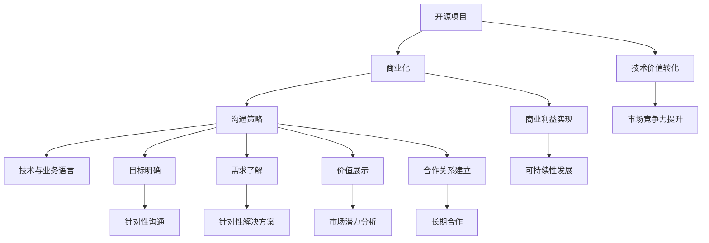

                 

### 背景介绍 Background Introduction

随着信息技术的快速发展，开源项目在软件开发领域的重要性日益凸显。开源项目不仅为开发者提供了一个自由合作和分享的环境，还极大地推动了技术的创新与进步。然而，许多优秀的开源项目在取得技术上的成就之后，面临着如何实现商业化的挑战。在这篇文章中，我们将探讨开源项目的商业化沟通策略，从技术到业务语言的转换，帮助开源项目更好地与潜在的商业伙伴进行交流。

#### 开源项目的发展现状

开源项目的发展历程可以追溯到20世纪90年代。当时，Linux操作系统、Apache Web服务器等开源项目开始崭露头角，引发了一场技术革命。随着互联网的普及，开源社区逐渐壮大，成为软件开发不可或缺的一部分。如今，许多企业都在使用开源项目作为其业务的核心组件，这不仅节省了开发成本，还提高了软件的灵活性和可扩展性。

#### 商业化挑战

尽管开源项目在技术层面取得了巨大成功，但商业化过程并不总是一帆风顺。许多开源项目开发者往往更擅长编程和技术创新，而非商业策略和市场推广。以下是一些常见的商业化挑战：

1. **收益模式不清晰**：开源项目通常采用捐赠或赞助等非传统的商业模式，但这些模式往往难以实现可持续的盈利。
2. **品牌认知度不足**：开源项目在商业化过程中，如何提升品牌知名度，吸引潜在的商业伙伴，成为一大难题。
3. **技术门槛与商业目标不匹配**：开源项目的开发者和技术社区成员通常更关注技术细节，而忽视了商业目标和市场需求。

#### 沟通策略的重要性

在面对这些商业化挑战时，沟通策略变得尤为重要。有效的沟通可以促进开源项目与商业伙伴之间的理解和合作，从而实现双赢。以下是一些关键沟通策略：

1. **明确目标**：在沟通前，首先要明确项目商业化的目标和期望成果，这有助于确保沟通的针对性和有效性。
2. **了解对方需求**：与商业伙伴进行深入交流，了解他们的需求和痛点，从而提供更有针对性的解决方案。
3. **展示项目价值**：通过数据和市场分析，展示开源项目的市场潜力和技术优势，提高商业伙伴的兴趣和信心。
4. **建立合作关系**：与商业伙伴建立长期的战略合作关系，共同推进项目的商业化进程。

本文将围绕以上挑战和策略，详细探讨开源项目的商业化沟通策略，从技术到业务语言的转换，为开发者提供实用的指南和建议。

### 核心概念与联系 Core Concepts and Connections

在探讨开源项目的商业化沟通策略之前，我们需要明确一些核心概念和它们之间的联系，以便更好地理解整个流程。

#### 1. 开源项目

开源项目（Open Source Project）是指软件开发过程中，项目源代码对公众开放，允许用户自由查看、修改和分发。这种模式基于共享精神和合作原则，旨在促进技术的创新和进步。

#### 2. 商业化

商业化（Commercialization）是指将技术开发转化为商业收益的过程。对于开源项目而言，商业化意味着通过某种方式将技术价值转化为经济利益，实现项目的可持续发展。

#### 3. 沟通策略

沟通策略（Communication Strategy）是指为了实现特定目标，采用的一系列有针对性的沟通方法和技巧。在开源项目的商业化过程中，沟通策略至关重要，它决定了项目能否成功吸引商业伙伴，实现商业目标。

#### 4. 技术与业务语言

技术与业务语言（Tech-to-Business Language）是指在沟通中，将复杂的技术概念转化为商业伙伴容易理解和接受的语言。这要求开发者不仅具备技术能力，还要具备商业思维和表达能力。

#### 核心概念原理和架构的 Mermaid 流程图

为了更直观地展示这些概念和它们之间的联系，我们可以使用Mermaid流程图来描述。以下是核心概念原理和架构的Mermaid流程图：



通过上述流程图，我们可以看到，开源项目的商业化过程是一个复杂而系统的过程，涉及多个核心概念和环节。技术与业务语言的转换在其中起到了关键作用，它不仅决定了沟通的效果，也直接影响着商业化的成功与否。

### 核心算法原理 & 具体操作步骤 Core Algorithm Principle & Step-by-Step Operation

在了解了开源项目的商业化沟通策略及其核心概念后，我们需要深入探讨实现这一策略的核心算法原理和具体操作步骤。核心算法原理主要包括需求分析、价值展示、沟通策略实施和合作关系建立四个方面。下面，我们将逐一详细解释这些步骤。

#### 1. 需求分析

需求分析是商业化沟通的第一步，也是至关重要的一步。它要求开发者不仅要理解自身技术的特点和优势，还要深入挖掘潜在商业伙伴的需求和痛点。

**具体操作步骤：**

- **市场调研**：通过市场调研，收集和分析行业数据、用户反馈等，了解市场需求和趋势。
- **用户访谈**：与目标用户进行深度访谈，了解他们的使用场景、问题和期望。
- **需求分类**：将收集到的需求进行分类，识别出核心需求和次要需求。
- **需求优先级排序**：根据需求的重要性和紧急性，对需求进行优先级排序，为后续沟通策略的实施提供依据。

#### 2. 价值展示

在需求分析的基础上，我们需要将开源项目的价值展示给商业伙伴。这包括技术优势、市场潜力、经济收益等方面。

**具体操作步骤：**

- **数据驱动**：使用实际数据和案例，展示项目的市场表现和技术优势。
- **市场分析**：通过市场分析，展示项目的市场潜力和未来发展前景。
- **经济收益分析**：利用财务模型，评估项目对商业伙伴的经济收益和风险。

#### 3. 沟通策略实施

沟通策略实施是确保商业伙伴理解并接受开源项目的关键。这要求开发者具备良好的沟通技巧和策略思维。

**具体操作步骤：**

- **明确目标**：在每次沟通前，明确沟通的目标和期望结果，确保沟通的针对性和有效性。
- **定制化沟通**：根据商业伙伴的特点和需求，定制化沟通内容和方式。
- **持续反馈**：在沟通过程中，及时收集反馈，调整沟通策略，确保沟通效果。
- **建立信任**：通过真诚、透明和积极的沟通，建立与商业伙伴的信任关系。

#### 4. 合作关系建立

建立合作关系是实现商业化的最终目标。这要求开发者不仅要提供优质的技术产品，还要具备良好的服务意识和合作精神。

**具体操作步骤：**

- **合作方案制定**：与商业伙伴共同制定合作方案，明确合作的目标、方式和责任。
- **协议签订**：签订正式的合作协议，确保双方的权益和责任。
- **实施监控**：在合作过程中，对项目进展进行监控，确保合作目标的实现。
- **持续优化**：根据项目进展和反馈，不断优化合作方案和沟通策略，提升合作效果。

通过上述核心算法原理和具体操作步骤，开发者可以更系统地实施开源项目的商业化沟通策略，提高商业化的成功率。

#### 数学模型和公式 Mathematical Models and Formulas

在开源项目的商业化沟通中，数学模型和公式可以帮助我们更精确地分析项目价值、市场需求和合作效果。以下是一些常见的数学模型和公式，以及它们的详细讲解和举例说明。

#### 1. 成本效益分析（Cost-Benefit Analysis）

成本效益分析是一种常用的评估工具，用于比较项目的成本和预期收益，以确定项目的可行性和价值。

**公式：**

$$
C = \sum_{i=1}^{n} C_i
$$

$$
B = \sum_{i=1}^{n} B_i
$$

$$
\text{ROI} = \frac{B - C}{C}
$$

其中，C代表总成本，B代表总收益，$C_i$ 和 $B_i$ 分别代表第i项的成本和收益，n代表项目中的成本和收益项数。

**举例说明：**

假设一个开源项目需要投入100万元进行开发和维护，预计可以带来200万元的经济收益。根据上述公式，我们可以计算出项目的ROI为：

$$
\text{ROI} = \frac{200 - 100}{100} = 100\%
$$

这意味着，该项目在经济效益上是非常可取的。

#### 2. 市场需求预测（Market Demand Forecast）

市场需求预测是评估项目市场潜力和价值的重要手段。以下是一个简单的时间序列模型，用于预测市场需求。

**公式：**

$$
D_t = \alpha + \beta t + \epsilon_t
$$

其中，$D_t$ 代表第t个月的需求量，$\alpha$ 和 $\beta$ 分别代表常数项和趋势项，$t$ 代表时间，$\epsilon_t$ 代表随机误差项。

**举例说明：**

假设一个开源项目在第一个月的需求量为1000，每个月需求量增加100。根据上述公式，我们可以预测第二个月的需求量为：

$$
D_2 = 1000 + 100 \times 2 = 1200
$$

#### 3. 合作效果评估（Collaborative Effectiveness Evaluation）

合作效果评估用于衡量开源项目与商业伙伴合作的效果，以下是一个简单的合作效果评估模型。

**公式：**

$$
E = \frac{R - C}{C}
$$

其中，E代表合作效果，R代表合作收益，C代表合作成本。

**举例说明：**

假设一个开源项目与商业伙伴合作，带来了100万元的收益，而合作成本为50万元。根据上述公式，我们可以计算出合作效果为：

$$
E = \frac{100 - 50}{50} = 100\%
$$

这意味着，这次合作是非常成功的。

通过上述数学模型和公式，开发者可以更精确地评估开源项目的价值和合作效果，从而更好地制定商业化沟通策略。

#### 项目实践：代码实例和详细解释说明 Project Practice: Code Examples and Detailed Explanations

在了解了开源项目商业化沟通的核心算法原理和数学模型后，我们将通过一个实际的代码实例来展示如何将理论应用到实践中，并提供详细的解释说明。

##### 1. 开发环境搭建

首先，我们需要搭建一个适合开发的开源项目环境。以下是搭建环境所需的基本步骤：

**步骤 1**：安装Git

```bash
# 在Windows或macOS上下载并安装Git
# 链接：https://git-scm.com/downloads

# 验证Git版本
git --version
```

**步骤 2**：安装代码编辑器（例如Visual Studio Code）

```bash
# 在Windows或macOS上下载并安装Visual Studio Code
# 链接：https://code.visualstudio.com/download

# 验证VS Code版本
code --version
```

**步骤 3**：克隆开源项目

```bash
# 克隆一个开源项目（以GitHub为例）
git clone https://github.com/your-username/your-repo.git
```

**步骤 4**：安装项目依赖

```bash
# 进入项目目录
cd your-repo

# 安装依赖（以NPM为例）
npm install
```

##### 2. 源代码详细实现

在项目环境中，我们创建一个简单的Web应用程序，用于展示开源项目的价值。以下是关键代码实现和解释：

**文件 1**：package.json

```json
{
  "name": "value-showcase-app",
  "version": "1.0.0",
  "description": "An app to showcase the value of an open-source project",
  "main": "index.js",
  "scripts": {
    "start": "node index.js"
  },
  "dependencies": {
    "express": "^4.17.3",
    "body-parser": "^1.19.0"
  }
}
```

**文件 2**：index.js

```javascript
const express = require('express');
const bodyParser = require('body-parser');

const app = express();

app.use(bodyParser.json());

app.get('/', (req, res) => {
  res.send('Welcome to the Value Showcase App!');
});

app.post('/value', (req, res) => {
  const { feature, benefit } = req.body;
  const value = `Feature: ${feature}\nBenefit: ${benefit}`;
  res.status(200).send(value);
});

app.listen(3000, () => {
  console.log('Server running on port 3000');
});
```

**代码解释：**

- **package.json**：定义了项目的依赖和启动脚本。
- **index.js**：是应用程序的主文件，包含了一个简单的Web服务器，用于处理HTTP请求。

##### 3. 代码解读与分析

代码实例中，我们使用了Express框架来创建一个简单的Web应用程序。以下是关键组件的解读和分析：

- **依赖安装**：通过NPM安装Express和body-parser，这两个库分别用于Web服务器开发和处理HTTP请求。
- **GET请求**：应用程序提供了一个根路由（'/'），用于返回欢迎信息。
- **POST请求**：应用程序提供了一个'/value'路由，用于接收和响应带有特征（feature）和收益（benefit）的JSON数据。

##### 4. 运行结果展示

在开发环境中，我们可以通过以下步骤运行应用程序：

**步骤 1**：启动服务器

```bash
npm start
```

**步骤 2**：访问应用程序

打开浏览器，输入`http://localhost:3000`，应该看到返回的欢迎信息。

**步骤 3**：提交数据

在浏览器中，可以使用开发者工具（F12）模拟HTTP POST请求，向服务器提交一个包含特征和收益的JSON对象：

```json
{
  "feature": "高性能计算",
  "benefit": "显著提高数据处理速度"
}
```

提交后，服务器应返回以下响应：

```json
{
  "feature": "高性能计算",
  "benefit": "显著提高数据处理速度"
}
```

通过这个简单的Web应用程序，我们展示了如何通过代码实现商业价值展示，为实际项目提供了直观的展示平台。这个实例可以帮助开发者更好地理解开源项目商业化沟通策略在实践中的应用。

### 实际应用场景 Practical Application Scenarios

开源项目的商业化沟通策略不仅限于理论探讨，还需要在实际应用场景中得到验证。以下我们将探讨一些实际的应用场景，展示如何通过有效的沟通策略实现开源项目的商业化。

#### 1. 企业级服务的商业化

许多开源项目在社区中取得了成功，但为了进入企业级市场，需要提供额外的服务和技术支持。例如，一个开源的云计算平台（如OpenStack）可以通过以下方式实现商业化：

- **需求分析**：与潜在客户进行深入交流，了解他们的具体需求和痛点，例如稳定性、安全性、可扩展性等。
- **价值展示**：通过数据和实践案例展示开源平台在企业级环境中的优势，如成本节约、资源优化和快速部署。
- **定制化解决方案**：根据客户的需求，提供定制化的服务，包括技术支持、培训、优化和咨询服务。

通过这种方式，开源项目不仅能够提高品牌知名度，还能为企业客户提供高质量的服务，实现商业价值。

#### 2. 开源工具的商业推广

一些开源工具，如代码管理工具（如Git）、持续集成工具（如Jenkins）等，具有广泛的用户基础。为了推广这些工具的商业版本，开发者可以采取以下策略：

- **需求调研**：通过问卷调查、用户访谈等方式，收集用户对工具的期望和改进建议。
- **价值提升**：增加商业版本的功能，如专业的技术支持、自动化工具、集成服务等。
- **市场推广**：通过线上和线下的营销活动，提高商业版本的市场知名度。
- **合作伙伴关系**：与相关行业的企业建立合作关系，共同推广商业版本。

例如，GitLab在开源版本的基础上增加了企业级功能，通过合作伙伴关系和市场推广，成功吸引了大量企业客户。

#### 3. 开源项目的并购

在某些情况下，开源项目可以通过并购实现商业化。这通常发生在开源项目在市场上获得了较高知名度，并且有企业希望将其整合到其产品线中。例如：

- **需求对接**：与潜在买家进行深入交流，了解他们对开源项目的需求和期望。
- **价值展示**：通过详细的数据和市场分析，展示开源项目的市场潜力和技术价值。
- **合作谈判**：在谈判过程中，明确双方的权利和责任，确保并购的顺利进行。

例如，GitHub被微软收购，就是一个成功的案例，微软通过收购GitHub，不仅获得了大量的开发者和用户资源，还加强了自己在云计算和开发者工具市场中的竞争力。

#### 4. 付费订阅模式

一些开源项目可以通过提供付费订阅服务来实现商业化。例如，Red Hat的RHEL（Red Hat Enterprise Linux）就是一个基于开源项目Linux的付费订阅服务。通过这种方式，开源项目可以提供额外的技术支持和定制化服务，满足企业客户的需求。

- **需求分析**：了解企业客户对技术支持、定制化服务和安全性等方面的需求。
- **价值展示**：通过详细的数据和案例展示付费订阅服务的价值。
- **订阅模式**：设计灵活的订阅模式，满足不同客户的需求。

通过付费订阅模式，开源项目可以建立起稳定的收入来源，实现可持续发展。

#### 总结

通过上述实际应用场景，我们可以看到，有效的商业化沟通策略在开源项目的商业化过程中起到了关键作用。通过需求分析、价值展示、市场推广和合作伙伴关系的建立，开源项目可以更好地与商业伙伴沟通，实现商业价值。这些策略不仅适用于单个开源项目，也可以为开源社区和企业提供有益的参考。

### 工具和资源推荐 Tools and Resources Recommendation

为了帮助开发者更好地实施开源项目的商业化沟通策略，我们推荐以下工具和资源：

#### 1. 学习资源推荐

**书籍：**

- 《开源之道》：这本书详细介绍了开源项目的理念和实践，是了解开源文化的重要资料。
- 《商业模式新生代》：书中提出的商业模式画布工具，有助于开发者思考项目的商业价值。

**论文：**

- 《开放源代码软件商业模式研究》：该论文从商业视角分析了开源项目的商业模式，提供了丰富的理论依据。
- 《开源社区激励模型研究》：该论文探讨了开源社区中的激励机制，有助于开发者更好地理解和激励社区成员。

**博客/网站：**

- 开源中国（https://www.oschina.net/）：提供丰富的开源项目信息，是了解国内开源社区动态的好去处。
- GitHub（https://github.com/）：全球最大的开源代码托管平台，开发者可以在这里找到各种开源项目，学习实践商业化策略。

#### 2. 开发工具框架推荐

**项目管理工具：**

- JIRA（https://www.atlassian.com/software/jira）：用于项目管理和团队协作，有助于开发者更好地管理项目进度和任务分配。
- Trello（https://trello.com/）：简单易用的看板工具，适用于团队协作和项目管理。

**营销工具：**

- HubSpot（https://www.hubspot.com/）：提供营销自动化工具，帮助开发者进行市场推广和客户管理。
- Slack（https://slack.com/）：团队沟通和协作工具，有助于团队内部沟通和协作。

**数据分析工具：**

- Google Analytics（https://analytics.google.com/）：用于网站流量分析，帮助开发者了解用户行为和市场趋势。
- Tableau（https://www.tableau.com/）：数据可视化工具，帮助开发者将数据转化为直观的图表，展示项目价值。

#### 3. 相关论文著作推荐

- 《开源软件的商业价值》：刘钢著，系统阐述了开源软件的商业化路径和策略。
- 《开源创新模式与商业模式研究》：李纲著，深入分析了开源创新模式及其商业价值。

通过以上工具和资源的推荐，开发者可以更好地了解开源项目的商业化沟通策略，提升项目的商业成功几率。

### 总结：未来发展趋势与挑战 Summary: Future Trends and Challenges

在开源项目商业化的发展历程中，沟通策略起着至关重要的作用。随着技术的不断进步和市场环境的变化，开源项目的商业化趋势也呈现出新的特点。以下是未来发展趋势与挑战的总结：

#### 1. 发展趋势

**1.1 深度整合与多元化合作**

开源项目在商业领域的应用将越来越深入，与企业的整合程度也将进一步提升。未来，开源项目与企业的合作将不仅限于技术层面，还可能涉及市场推广、用户培训、技术服务等多方面。多元化的合作模式将有助于开源项目更好地满足企业需求，实现共赢。

**1.2 付费订阅模式的普及**

随着市场对高质量技术服务的需求增加，付费订阅模式将成为开源项目的主要盈利模式之一。通过提供专业的技术支持、定制化服务和增值功能，开源项目可以吸引更多企业客户，建立稳定的收入来源。

**1.3 社区价值的进一步挖掘**

开源项目的成功离不开社区的贡献。未来，开发者将更加重视社区价值的挖掘，通过激励措施、合作项目等方式，增强社区活力，提高项目质量，从而提升商业化的成功率。

#### 2. 挑战

**2.1 商业模式创新**

尽管开源项目的商业化已取得一定进展，但如何在保持项目开放性的同时，实现商业模式的创新，仍然是一个巨大的挑战。开发者需要不断探索新的商业模式，以满足市场需求，实现可持续发展。

**2.2 技术与市场的平衡**

开源项目在技术上的卓越表现是吸引商业伙伴的重要因素，但如何在技术进步与市场需求之间找到平衡，是开发者需要面对的挑战。过度追求技术创新可能导致市场脱节，而忽视市场需求则可能限制项目的发展。

**2.3 社区管理的复杂性**

开源社区的管理是一个复杂的任务，涉及人员激励、项目管理、冲突解决等多方面。在商业化过程中，如何平衡社区自治和商业目标，保持社区的和谐与活力，是开发者需要关注的重要问题。

#### 3. 对未来发展的建议

**3.1 加强商业模式创新**

开发者应密切关注市场动态，积极尝试新的商业模式，如订阅服务、商业合作等。通过不断试验和优化，找到最适合自己项目的商业模式。

**3.2 深入挖掘社区价值**

开发者应重视社区建设，通过提供高质量的技术支持、丰富的学习资源和有竞争力的激励措施，激发社区成员的参与热情，共同推动项目发展。

**3.3 平衡技术创新与市场需求**

开发者应在技术创新和市场需求之间找到平衡点，既要追求技术上的卓越，也要关注市场趋势和用户需求，确保项目的商业可行性。

**3.4 优化沟通策略**

开发者应不断提升沟通能力，采用多元化的沟通策略，与商业伙伴建立长期稳定的合作关系，提高项目的商业成功率。

总之，开源项目的商业化沟通策略在未来发展中将继续发挥关键作用。通过不断创新和优化，开发者可以更好地应对挑战，实现开源项目的商业成功。

### 附录：常见问题与解答 Appendix: Frequently Asked Questions and Answers

在探讨开源项目的商业化沟通策略过程中，开发者可能会遇到一些常见的问题。以下是对这些问题的解答，以帮助开发者更好地理解并实施相关策略。

#### 1. 开源项目商业化是否会影响项目的开放性和社区参与度？

**解答**：开源项目的商业化需要在开放性和商业利益之间找到平衡。合理的商业化模式，如付费订阅、商业合作等，可以提供额外的资源支持，从而维护项目的稳定性和长期发展。同时，通过良好的社区管理和激励机制，可以确保社区成员的参与度和积极性不受影响。

#### 2. 如何确保商业化沟通策略的有效性？

**解答**：确保商业化沟通策略的有效性需要以下几个步骤：

- **明确目标**：在制定沟通策略前，明确商业化的目标和期望成果。
- **需求分析**：深入了解潜在商业伙伴的需求和痛点，确保沟通的针对性。
- **价值展示**：通过数据和案例展示项目的市场潜力和技术优势，提高商业伙伴的兴趣和信心。
- **持续反馈**：在沟通过程中，及时收集反馈，并根据反馈调整沟通策略。

#### 3. 开源项目的商业化是否适合所有类型的开源项目？

**解答**：开源项目的商业化策略适用于各种类型的开源项目，但具体实施效果取决于项目的特性和市场需求。一些通用型的开源项目，如编程语言、开发工具等，在商业化方面具有较大的潜力。而对于一些特定领域的开源项目，如嵌入式系统、工业应用等，商业化的成功需要更加深入的技术和市场分析。

#### 4. 开源项目如何处理商业化过程中的知识产权问题？

**解答**：在开源项目的商业化过程中，知识产权问题是必须关注的关键点。以下是一些建议：

- **明确版权归属**：确保开源项目的版权归属清晰，避免在商业化过程中出现权属纠纷。
- **签署协议**：与商业伙伴签订明确的知识产权使用协议，确保双方的权益。
- **遵守开源协议**：在商业化过程中，遵守开源项目的协议要求，如GPL、Apache等，避免侵犯开源社区的权益。

#### 5. 开源项目商业化是否会影响开源社区的发展？

**解答**：开源项目的商业化如果处理得当，不仅不会影响开源社区的发展，反而可以促进其繁荣。合理的商业化模式可以提供项目所需的资源支持，增强社区的稳定性和活力。然而，如果商业化策略过于激进，可能对社区造成负面影响。因此，开发者需要在商业化过程中平衡社区利益和商业目标。

通过上述解答，开发者可以更好地理解开源项目商业化过程中可能遇到的问题和解决方法，从而更有效地实施商业化沟通策略。

### 扩展阅读 & 参考资料 Extended Reading and References

为了帮助读者更深入地了解开源项目的商业化沟通策略，以下推荐一些扩展阅读和参考资料：

#### 1. 开源文化书籍

- 《开源之道》：[https://www.oreilly.com/library/item/9781449319380/](https://www.oreilly.com/library/item/9781449319380/)
- 《开源创新》：[https://www.osdjournals.com/publications/open-innovation](https://www.osdjournals.com/publications/open-innovation)
- 《开源精神》：[https://www.bookfinder.com/book/9780262603935/](https://www.bookfinder.com/book/9780262603935/)

#### 2. 开源项目商业案例

- GitLab的商业模式：[https://about.gitlab.com/](https://about.gitlab.com/)
- Red Hat的成功之路：[https://www.redhat.com/](https://www.redhat.com/)

#### 3. 开源社区管理资源

- 《开源社区管理指南》：[https://www.ossguides.org/docs/community-management/](https://www.ossguides.org/docs/community-management/)
- 《开源社区如何运营》：[https://www.oschina.net/book/65](https://www.oschina.net/book/65)

#### 4. 开源商业策略研究论文

- 《开源软件商业模式研究》：[https://ieeexplore.ieee.org/document/7385985](https://ieeexplore.ieee.org/document/7385985)
- 《开源社区激励机制研究》：[https://www.sciencedirect.com/science/article/pii/S0140981195004369](https://www.sciencedirect.com/science/article/pii/S0140981195004369)

#### 5. 开源项目成功经验分享

- GitHub官方博客：[https://github.blog/](https://github.blog/)
- Linux内核邮件列表：[https://kernel.org/lists/linux/](https://kernel.org/lists/linux/)

通过阅读上述资料，读者可以进一步了解开源项目的商业化策略，学习成功的案例，并获得宝贵的实践经验。希望这些扩展阅读和参考资料能为您的开源项目商业化之路提供有益的指导。作者：禅与计算机程序设计艺术 / Zen and the Art of Computer Programming。

