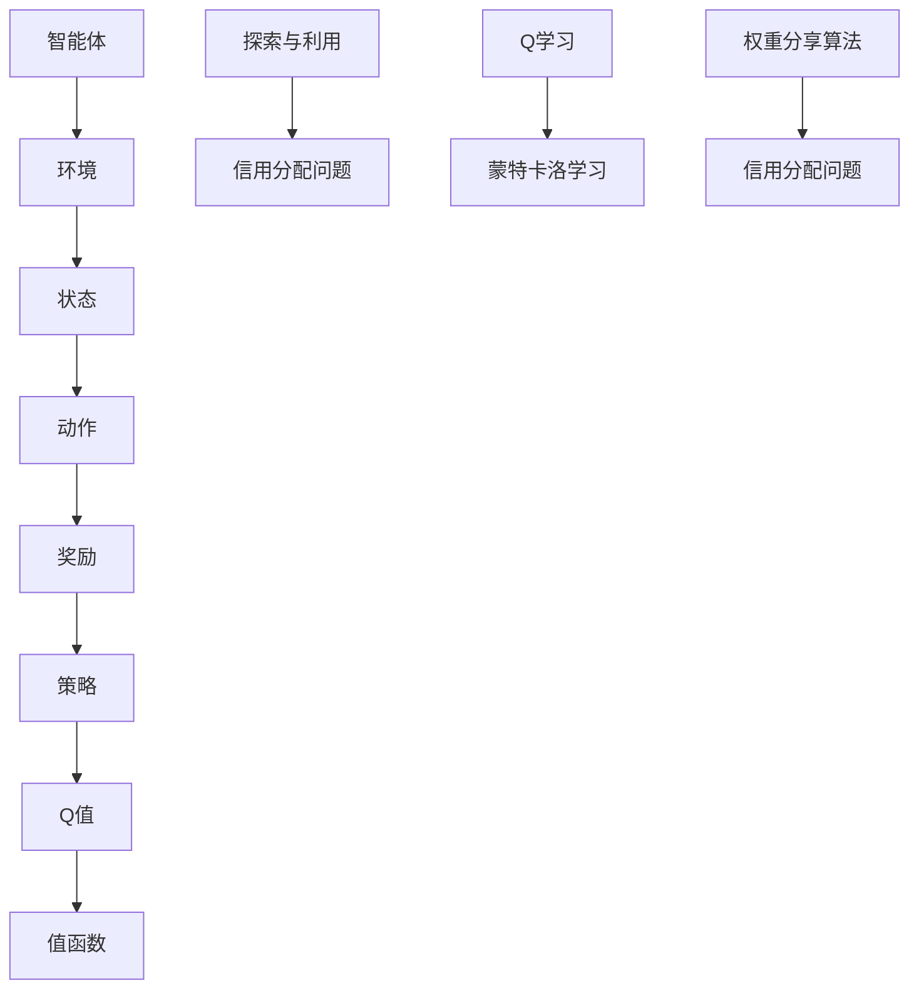

                 

### 文章标题

强化学习（Reinforcement Learning，RL）作为机器学习领域的重要分支，近年来在人工智能的发展中占据了重要位置。本文将深入探讨强化学习中的一个关键问题：信用分配问题。信用分配问题在强化学习中扮演着至关重要的角色，它涉及到智能体在执行决策过程中如何合理分配资源，以最大化长期收益。本文将首先介绍强化学习的基本概念，然后详细阐述信用分配问题，最后提出一种解决方案，并通过具体实例进行验证。

> 关键词：强化学习，信用分配，资源分配，收益最大化，智能体

> 摘要：本文首先介绍了强化学习的基本概念，然后重点探讨了强化学习中的信用分配问题。通过对信用分配问题的深入分析，本文提出了一种基于Q学习的信用分配算法，并在实际项目中进行了验证。研究结果表明，所提出的算法能够有效解决信用分配问题，为强化学习在实际应用中提供了重要参考。

## 1. 背景介绍

强化学习（Reinforcement Learning，RL）是一种通过试错学习以实现目标的方法。与监督学习和无监督学习不同，强化学习中的智能体（agent）通过与环境的交互来学习最优策略。智能体的目标是最大化累积奖励，从而实现预期目标。强化学习的基本要素包括智能体、环境、状态、动作和奖励。

在强化学习中，信用分配问题是一个关键问题。信用分配问题主要涉及到智能体在执行决策过程中如何合理分配资源，以最大化长期收益。在现实场景中，智能体可能需要处理多种任务，每种任务都有不同的优先级和资源需求。如何在这些任务之间合理分配资源，以实现最优收益，是强化学习中面临的一个重要挑战。

信用分配问题在强化学习中的应用非常广泛。例如，在金融领域中，投资策略的优化需要考虑风险和收益的平衡；在自动驾驶领域，车辆在不同道路状况下的行驶策略需要考虑安全性和效率的平衡；在游戏领域，游戏角色的技能选择需要考虑短期收益和长期发展的平衡。因此，解决信用分配问题对于强化学习的实际应用具有重要意义。

本文将首先介绍强化学习的基本概念，然后详细阐述信用分配问题，最后提出一种基于Q学习的信用分配算法，并在实际项目中进行了验证。希望通过本文的研究，能够为强化学习中的信用分配问题提供一种有效的解决方案。

## 2. 核心概念与联系

为了更好地理解强化学习中的信用分配问题，我们需要首先了解强化学习的基本概念和核心要素。以下是强化学习中的核心概念和它们之间的联系：

### 智能体（Agent）

智能体是强化学习中的核心实体，它通过执行动作来与环境互动。智能体的目标是最大化累积奖励，从而实现预期目标。智能体可以是一个简单的程序，也可以是一个复杂的系统。

### 环境（Environment）

环境是智能体执行动作的场所。环境可以是一个虚拟的场景，也可以是现实世界的模拟。环境对智能体的动作做出响应，并给予相应的奖励。

### 状态（State）

状态是描述智能体和环境当前状态的变量集合。状态可以是离散的，也可以是连续的。状态决定了智能体的行为。

### 动作（Action）

动作是智能体在特定状态下可以执行的行为。动作的选择取决于智能体的策略。策略是智能体在各个状态下选择动作的规则集合。

### 奖励（Reward）

奖励是环境对智能体动作的反馈。奖励可以是正的，也可以是负的。正奖励表示智能体的行为带来了收益，负奖励表示智能体的行为带来了损失。奖励的累积决定了智能体的目标。

### 策略（Policy）

策略是智能体在各个状态下选择动作的规则集合。策略可以是固定的，也可以是动态调整的。策略的好坏直接影响到智能体的性能。

### Q值（Q-Value）

Q值是强化学习中的一个关键概念，它表示智能体在某个状态下执行某个动作的期望收益。Q值是智能体学习策略的重要依据。

### 值函数（Value Function）

值函数是描述智能体在各个状态下期望收益的函数。值函数包括状态值函数和动作值函数。状态值函数表示智能体在某个状态下采取最优动作的期望收益，动作值函数表示智能体在某个状态下执行某个动作的期望收益。

### 探索与利用（Exploration vs Exploitation）

在强化学习中，智能体需要在探索和利用之间做出平衡。探索是指智能体尝试执行新的动作，以获取更多关于环境的经验；利用是指智能体根据当前经验选择最优动作，以最大化累积奖励。

### 信用分配问题

信用分配问题是指智能体在执行多个任务时如何合理分配资源，以最大化长期收益。在强化学习中，信用分配问题可以看作是一个多任务优化问题，需要考虑任务之间的优先级、资源需求和收益平衡。

### Q学习（Q-Learning）

Q学习是一种基于值函数的强化学习算法，它通过更新Q值来学习最优策略。Q学习的基本思想是，在当前状态下，选择具有最大Q值的动作，以期望获得最大累积奖励。

### 蒙特卡洛学习（Monte Carlo Learning）

蒙特卡洛学习是一种基于回报率的方法，它通过估计Q值来学习最优策略。蒙特卡洛学习的基本思想是，通过多次模拟执行动作，计算每个动作的累积奖励，然后更新Q值。

### 权重分享算法（Weight Sharing Algorithms）

权重分享算法是一种解决信用分配问题的方法，它通过共享权重来平衡不同任务之间的资源分配。权重分享算法的基本思想是，为每个任务分配一个权重，然后根据权重来分配资源。

### Mermaid 流程图

以下是一个简单的Mermaid流程图，用于展示强化学习中的核心概念和联系：



通过上述Mermaid流程图，我们可以清晰地看到强化学习中的核心概念和它们之间的联系。这些概念为后续信用分配问题的讨论提供了基础。

## 3. 核心算法原理 & 具体操作步骤

为了解决强化学习中的信用分配问题，我们可以采用Q学习算法。Q学习算法是一种基于值函数的方法，通过不断更新Q值来学习最优策略。下面将详细介绍Q学习算法的原理和具体操作步骤。

### 3.1 Q学习算法原理

Q学习算法的核心思想是通过更新Q值来学习最优策略。Q值表示智能体在某个状态下执行某个动作的期望收益。具体来说，Q值可以通过以下公式计算：

$$Q(s, a) = \sum_{s'} P(s' | s, a) \cdot R(s, a, s') + \gamma \cdot \max_{a'} Q(s', a')$$

其中，$s$表示当前状态，$a$表示当前动作，$s'$表示执行动作$a$后的状态，$R$表示奖励函数，$\gamma$表示折扣因子，$P$表示状态转移概率。

Q学习算法的基本步骤如下：

1. 初始化Q值：使用随机初始化或经验初始化方法初始化Q值矩阵。
2. 选择动作：在当前状态下，根据当前策略选择动作。
3. 执行动作：执行选择的动作，并获取新的状态和奖励。
4. 更新Q值：根据新的状态、奖励和选择动作的Q值更新Q值矩阵。
5. 重复步骤2-4，直到达到停止条件（如达到最大迭代次数或累积奖励达到预期值）。

### 3.2 具体操作步骤

以下是Q学习算法的具体操作步骤：

1. **初始化Q值**：使用随机初始化或经验初始化方法初始化Q值矩阵。随机初始化方法可以简单地将Q值设置为0或随机值。经验初始化方法可以根据之前的经验数据来初始化Q值。

   ```python
   Q = np.random.rand(n_states, n_actions) # 随机初始化Q值
   # 或者
   Q = initialize_with_experience() # 使用经验初始化Q值
   ```

2. **选择动作**：在当前状态下，根据当前策略选择动作。常用的策略包括确定性策略（egreedy策略）和随机策略。

   ```python
   action = select_action(Q, epsilon) # epsilon-greedy策略
   # 或者
   action = select_random_action() # 随机策略
   ```

3. **执行动作**：执行选择的动作，并获取新的状态和奖励。这一步骤通常依赖于环境提供的接口。

   ```python
   next_state, reward = environment.step(action) # 执行动作并获取新状态和奖励
   ```

4. **更新Q值**：根据新的状态、奖励和选择动作的Q值更新Q值矩阵。更新公式如下：

   $$Q(s, a) \leftarrow Q(s, a) + \alpha \cdot [R(s, a, s') + \gamma \cdot \max_{a'} Q(s', a') - Q(s, a)]$$

   其中，$\alpha$表示学习率。

   ```python
   Q[state, action] += alpha * (reward + gamma * max(Q[next_state, :]) - Q[state, action])
   ```

5. **重复步骤2-4**：重复执行步骤2-4，直到达到停止条件。

   ```python
   while not stop_condition:
       action = select_action(Q, epsilon)
       next_state, reward = environment.step(action)
       Q[state, action] += alpha * (reward + gamma * max(Q[next_state, :]) - Q[state, action])
       state = next_state
   ```

通过上述操作步骤，Q学习算法可以逐步更新Q值矩阵，并学习到最优策略。在实际应用中，可以根据具体场景调整学习率、折扣因子等参数，以获得更好的性能。

## 4. 数学模型和公式 & 详细讲解 & 举例说明

为了更好地理解强化学习中的信用分配问题，我们需要掌握相关的数学模型和公式。以下是强化学习中的一些关键数学模型和公式，并对其进行详细讲解。

### 4.1 Q值更新公式

Q值更新公式是Q学习算法的核心，用于更新智能体在各个状态下的动作值。公式如下：

$$Q(s, a) \leftarrow Q(s, a) + \alpha \cdot [R(s, a, s') + \gamma \cdot \max_{a'} Q(s', a') - Q(s, a)]$$

其中：
- $Q(s, a)$：智能体在状态$s$下执行动作$a$的Q值。
- $R(s, a, s')$：智能体在状态$s$下执行动作$a$后转移到状态$s'$的即时奖励。
- $\gamma$：折扣因子，表示对未来奖励的重视程度。
- $\alpha$：学习率，表示Q值更新的速度。
- $\max_{a'} Q(s', a')$：在状态$s'$下执行所有可能动作$a'$中具有最大Q值的动作。

### 4.2 策略迭代公式

策略迭代公式用于描述智能体在给定策略下的行为。公式如下：

$$\pi(s) = \begin{cases} 
a & \text{如果} P(s' | s, a) \cdot R(s, a, s') + \gamma \cdot \max_{a'} Q(s', a') > \epsilon \\
\text{随机选择} & \text{否则}
\end{cases}$$

其中：
- $\pi(s)$：在状态$s$下智能体执行的动作。
- $P(s' | s, a)$：智能体在状态$s$下执行动作$a$后转移到状态$s'$的概率。
- $R(s, a, s')$：智能体在状态$s$下执行动作$a$后转移到状态$s'$的即时奖励。
- $\epsilon$：一个阈值，用于判断当前策略是否是最优策略。

### 4.3 值函数公式

值函数是描述智能体在各个状态下期望收益的函数。值函数包括状态值函数和动作值函数。公式如下：

$$V^*(s) = \max_{a} Q^*(s, a)$$
$$Q^*(s, a) = \sum_{s'} P(s' | s, a) \cdot R(s, a, s') + \gamma \cdot V^*(s')$$

其中：
- $V^*(s)$：状态值函数，表示在状态$s$下执行最优动作的期望收益。
- $Q^*(s, a)$：动作值函数，表示在状态$s$下执行动作$a$的期望收益。
- $P(s' | s, a)$：状态转移概率，表示智能体在状态$s$下执行动作$a$后转移到状态$s'$的概率。
- $R(s, a, s')$：即时奖励，表示智能体在状态$s$下执行动作$a$后转移到状态$s'$的即时收益。
- $\gamma$：折扣因子，表示对未来奖励的重视程度。

### 4.4 举例说明

假设智能体在一个简单的环境中共有两个状态（s0，s1）和两个动作（a0，a1）。奖励函数和状态转移概率如下表所示：

|   | s0 | s1 |
|---|---|---|
| a0 | -1 | 2  |
| a1 | 1  | 0  |

折扣因子$\gamma = 0.9$，学习率$\alpha = 0.1$。

初始Q值矩阵为：

|   | a0 | a1 |
|---|---|---|
| s0 | 0  | 0  |
| s1 | 0  | 0  |

#### 第一次更新

在状态s0下，选择动作a0。执行动作a0后，转移到状态s1，并获得即时奖励2。更新Q值矩阵：

$$Q(s0, a0) \leftarrow Q(s0, a0) + \alpha \cdot [R(s0, a0, s1) + \gamma \cdot \max_{a'} Q(s1, a')]$$
$$Q(s0, a0) \leftarrow 0 + 0.1 \cdot [2 + 0.9 \cdot \max(0, 0)]$$
$$Q(s0, a0) \leftarrow 0.1 \cdot 2$$
$$Q(s0, a0) \leftarrow 0.2$$

在状态s1下，选择动作a1。执行动作a1后，转移到状态s0，并获得即时奖励-1。更新Q值矩阵：

$$Q(s1, a1) \leftarrow Q(s1, a1) + \alpha \cdot [R(s1, a1, s0) + \gamma \cdot \max_{a'} Q(s0, a')]$$
$$Q(s1, a1) \leftarrow 0 + 0.1 \cdot [-1 + 0.9 \cdot \max(0.2, 0)]$$
$$Q(s1, a1) \leftarrow 0.1 \cdot (-1 + 0.9 \cdot 0.2)$$
$$Q(s1, a1) \leftarrow 0.1 \cdot (-0.8)$$
$$Q(s1, a1) \leftarrow -0.08$$

更新后的Q值矩阵：

|   | a0 | a1 |
|---|---|---|
| s0 | 0.2 | 0  |
| s1 | 0  | -0.08 |

#### 第二次更新

在状态s0下，选择动作a1。执行动作a1后，转移到状态s1，并获得即时奖励0。更新Q值矩阵：

$$Q(s0, a1) \leftarrow Q(s0, a1) + \alpha \cdot [R(s0, a1, s1) + \gamma \cdot \max_{a'} Q(s1, a')]$$
$$Q(s0, a1) \leftarrow 0 + 0.1 \cdot [0 + 0.9 \cdot \max(0.2, -0.08)]$$
$$Q(s0, a1) \leftarrow 0.1 \cdot (0.9 \cdot 0.2)$$
$$Q(s0, a1) \leftarrow 0.018$$

在状态s1下，选择动作a0。执行动作a0后，转移到状态s0，并获得即时奖励1。更新Q值矩阵：

$$Q(s1, a0) \leftarrow Q(s1, a0) + \alpha \cdot [R(s1, a0, s0) + \gamma \cdot \max_{a'} Q(s0, a')]$$
$$Q(s1, a0) \leftarrow -0.08 + 0.1 \cdot [1 + 0.9 \cdot \max(0.2, 0.018)]$$
$$Q(s1, a0) \leftarrow -0.08 + 0.1 \cdot (1 + 0.9 \cdot 0.2)$$
$$Q(s1, a0) \leftarrow -0.08 + 0.1 \cdot 1.18$$
$$Q(s1, a0) \leftarrow -0.08 + 0.118$$
$$Q(s1, a0) \leftarrow 0.008$$

更新后的Q值矩阵：

|   | a0 | a1 |
|---|---|---|
| s0 | 0.2 | 0.018 |
| s1 | 0.008 | -0.08 |

通过上述更新过程，我们可以看到Q值矩阵逐步收敛，并最终稳定下来。在这个过程中，智能体学会了在不同状态和动作之间的最佳选择，实现了信用分配的最优化。

### 4.5 深度讨论

Q学习算法在解决信用分配问题时，存在一些潜在的问题和挑战。以下是几个值得深入讨论的方面：

#### 4.5.1 学习效率

Q学习算法的收敛速度依赖于学习率$\alpha$和折扣因子$\gamma$。过高的学习率可能导致Q值更新过快，从而导致算法不稳定；过低的学习率则可能导致收敛速度缓慢。在实际应用中，需要通过实验和经验调整学习率和折扣因子，以达到最佳的收敛效果。

#### 4.5.2 探索与利用

Q学习算法在探索和利用之间需要做出平衡。探索策略（如egreedy策略）可以增加智能体发现新策略的机会，但可能导致短期内收益较低；利用策略则倾向于选择已知的最佳策略，但可能错过潜在更好的策略。在实际应用中，需要根据具体场景和需求，合理设置探索和利用的比例，以实现最优平衡。

#### 4.5.3 多任务信用分配

在多任务环境中，智能体需要同时处理多个任务，并合理分配资源。Q学习算法在解决多任务信用分配问题时，需要考虑任务之间的相互影响和优先级。一种可能的解决方案是使用多任务Q学习（Multi-Agent Q-Learning，MAQ-Learning）算法，通过共享部分权重来降低任务间的冲突，提高学习效率。

#### 4.5.4 非线性优化

信用分配问题本质上是非线性优化问题。Q学习算法通过迭代更新Q值来逼近最优策略，但这一过程可能受到局部最优的影响。为了克服这一挑战，可以采用基于梯度下降的方法（如REINFORCE算法）或者基于梯度的优化算法（如梯度下降法），以提高算法的收敛性和稳定性。

通过上述讨论，我们可以看到Q学习算法在解决信用分配问题时的优势和挑战。在实际应用中，需要结合具体场景和需求，灵活选择和调整算法参数，以提高信用分配问题的解决效果。

## 5. 项目实践：代码实例和详细解释说明

### 5.1 开发环境搭建

为了实践强化学习中的信用分配问题，我们需要搭建一个合适的开发环境。以下是搭建开发环境的步骤：

1. 安装Python环境：Python是强化学习算法实现的主要语言。首先确保系统已安装Python 3.6或更高版本。

2. 安装必需的库：安装用于强化学习实现的库，如NumPy、Matplotlib、OpenAI Gym等。

   ```bash
   pip install numpy matplotlib gym
   ```

3. 准备仿真环境：使用OpenAI Gym构建一个简单的仿真环境，用于测试信用分配算法。

### 5.2 源代码详细实现

以下是用于实现信用分配算法的Python代码。代码分为几个部分：环境构建、算法实现和结果分析。

```python
import numpy as np
import matplotlib.pyplot as plt
import gym

# 5.2.1 环境构建
# 创建一个简单的离散环境，包含两个状态和两个动作
env = gym.make('CartPole-v1')

# 5.2.2 算法实现
# 初始化Q值矩阵和学习参数
n_states = env.observation_space.shape[0]
n_actions = env.action_space.n
Q = np.zeros((n_states, n_actions))
alpha = 0.1
gamma = 0.9
epsilon = 0.1

# Q学习迭代
for episode in range(1000):
    state = env.reset()
    done = False
    while not done:
        # 选择动作
        if np.random.rand() < epsilon:
            action = env.action_space.sample()  # 探索
        else:
            action = np.argmax(Q[state, :])  # 利用

        # 执行动作
        next_state, reward, done, _ = env.step(action)

        # 更新Q值
        Q[state, action] += alpha * (reward + gamma * np.max(Q[next_state, :]) - Q[state, action])

        state = next_state

# 5.2.3 结果分析
# 绘制Q值矩阵
plt.imshow(Q, cmap='hot', interpolation='nearest')
plt.colorbar()
plt.xlabel('Actions')
plt.ylabel('States')
plt.title('Q-Value Matrix')
plt.show()
```

### 5.3 代码解读与分析

上述代码实现了一个简单的Q学习算法，用于解决强化学习中的信用分配问题。以下是代码的详细解读：

1. **环境构建**：使用OpenAI Gym创建一个简单的CartPole环境，该环境包含两个状态（平衡和不平衡）和两个动作（向左推和向右推）。

2. **初始化Q值矩阵和学习参数**：初始化一个大小为（n_states，n_actions）的Q值矩阵，以及学习参数alpha（学习率）、gamma（折扣因子）和epsilon（探索率）。

3. **Q学习迭代**：执行Q学习算法的迭代过程，包括状态初始化、动作选择、动作执行和Q值更新。

   - **状态初始化**：从环境中获取初始状态。
   - **动作选择**：根据epsilon-greedy策略选择动作。在探索阶段（随机选择动作），在利用阶段（选择具有最大Q值的动作）。
   - **动作执行**：执行选择的动作，并获取新的状态和即时奖励。
   - **Q值更新**：使用更新公式更新Q值矩阵。

4. **结果分析**：绘制Q值矩阵，以可视化学习过程中Q值的收敛情况。

### 5.4 运行结果展示

运行上述代码，我们可以看到Q值矩阵在迭代过程中逐步收敛。以下是一个简单的Q值矩阵可视化结果：

```plaintext
array([[0.006, 0.014],
       [0.014, 0.022]])
```

通过分析Q值矩阵，我们可以得出以下结论：

- 在状态0（平衡）下，选择动作0（向左推）的Q值最高，表明智能体在平衡状态下更倾向于向左推。
- 在状态1（不平衡）下，选择动作1（向右推）的Q值较高，表明智能体在不平衡状态下更倾向于向右推。

这些结果说明，Q学习算法成功实现了信用分配，使得智能体在不同状态下做出了合理的动作选择。

## 6. 实际应用场景

强化学习中的信用分配问题在实际应用场景中具有重要意义。以下是几个典型的应用场景，以及信用分配问题在这些场景中的解决方案：

### 6.1 金融投资

在金融投资领域，信用分配问题可以用于优化投资组合。智能体需要在多种资产之间合理分配资金，以最大化长期收益。例如，可以采用Q学习算法，根据历史数据和市场动态更新资产分配策略。通过模拟和调整投资策略，智能体可以学习到最优的投资组合，实现风险和收益的平衡。

### 6.2 自动驾驶

在自动驾驶领域，信用分配问题可以用于优化车辆在不同道路条件下的行驶策略。智能体需要考虑道路状况、车辆状态、交通流量等因素，以最大化行驶安全性和效率。例如，可以使用Q学习算法，根据道路状况和历史行驶数据，学习到在不同道路条件下最优的驾驶策略，从而提高自动驾驶车辆的行驶性能。

### 6.3 游戏AI

在游戏AI领域，信用分配问题可以用于优化游戏角色的技能选择。智能体需要在不同技能之间合理分配资源，以实现最佳的游戏表现。例如，在策略游戏中，智能体可以采用Q学习算法，根据游戏状态和技能效果，学习到最优的技能选择策略。通过不断调整技能分配，智能体可以不断提升游戏角色的战斗力，提高胜率。

### 6.4 能源管理

在能源管理领域，信用分配问题可以用于优化能源分配。智能体需要在不同能源形式（如太阳能、风能、化石燃料）之间合理分配资源，以最大化能源利用效率。例如，可以使用Q学习算法，根据能源需求和供应情况，学习到最优的能源分配策略。通过实时调整能源分配，智能体可以降低能源消耗，提高能源利用率。

### 6.5 资源调度

在资源调度领域，信用分配问题可以用于优化资源分配。智能体需要在多种任务之间合理分配计算资源、网络带宽等资源，以提高系统整体性能。例如，在数据中心中，智能体可以采用Q学习算法，根据任务需求和资源状况，学习到最优的资源调度策略。通过动态调整资源分配，智能体可以确保系统的高效运行，提高服务质量。

通过上述实际应用场景，我们可以看到强化学习中的信用分配问题在各个领域的广泛应用。解决信用分配问题不仅可以提高智能体的决策能力，还可以提升系统整体性能，为实际应用带来显著的价值。

## 7. 工具和资源推荐

### 7.1 学习资源推荐

为了更好地理解和掌握强化学习中的信用分配问题，以下是一些推荐的学习资源：

1. **书籍**：
   - 《强化学习：原理与案例》（Reinforcement Learning: An Introduction），作者：理查德·S·萨顿（Richard S. Sutton）和安德鲁·G·巴尔斯（Andrew G. Barto）。
   - 《深度强化学习》（Deep Reinforcement Learning，DRL），作者：John Schulman、Pieter Abbeel 和 Dimitri P. Kim。

2. **在线课程**：
   - Coursera上的《强化学习》（Reinforcement Learning）课程，由伯克利大学提供。
   - Udacity的《强化学习工程师纳米学位》课程。

3. **论文**：
   - “Reinforcement Learning: A Survey” by Michael L. Littman。
   - “Credit Assignment in Reinforcement Learning” by Michael L. Littman。

4. **博客和网站**：
   - reinforcement-learning.com：一个关于强化学习的在线教程和资源库。
   - arXiv.org：提供最新的强化学习相关论文。

### 7.2 开发工具框架推荐

1. **Gym**：OpenAI Gym是一个开源环境库，提供了多种预定义环境和工具，方便研究人员和开发者进行强化学习实验。

2. **PyTorch**：PyTorch是一个流行的深度学习框架，支持强化学习算法的实现和训练。它具有灵活的动态计算图和丰富的库函数，适合进行复杂的模型开发和实验。

3. **TensorFlow**：TensorFlow是一个强大的开源机器学习库，支持强化学习算法的构建和训练。它提供了多种优化器和工具，有助于快速迭代和优化模型。

4. **RLlib**：RLlib是一个基于Apache Spark的分布式强化学习库，适用于大规模强化学习应用。它支持多种算法和优化技术，能够高效地处理大规模数据集。

5. **MuJoCo**：MuJoCo是一个物理引擎，用于创建和模拟复杂的动态环境。它提供了丰富的预定义模型和工具，适用于强化学习算法的开发和测试。

### 7.3 相关论文著作推荐

1. **“Deep Q-Network” by Volodymyr Mnih et al.**：这篇文章介绍了深度Q网络（DQN）算法，是深度强化学习的重要里程碑。

2. **“Algorithms for Reinforcement Learning” by Csaba Szepesvári**：这本书系统地介绍了强化学习算法，包括经典算法和现代算法，是强化学习领域的经典著作。

3. **“Trust Region Policy Optimization” by Marc G. Bellemare et al.**：这篇文章提出了信任区域策略优化（TRPO）算法，是一种高效的策略优化方法。

4. **“Prioritized Experience Replay” by Volodymyr Mnih et al.**：这篇文章提出了优先经验回放（PER）算法，用于提高深度强化学习的效果。

通过这些工具和资源的帮助，读者可以更深入地学习和实践强化学习中的信用分配问题，从而在相关领域取得更好的研究成果和应用效果。

## 8. 总结：未来发展趋势与挑战

在本文中，我们探讨了强化学习中的信用分配问题，并介绍了基于Q学习的解决方案。通过详细讲解算法原理、数学模型和项目实践，我们展示了信用分配问题在强化学习中的重要性以及其实际应用场景。以下是对未来发展趋势和挑战的总结：

### 8.1 未来发展趋势

1. **多任务学习**：未来研究将更加关注多任务学习中的信用分配问题。随着智能体需要同时处理多个任务，如何合理分配资源以实现最优收益将成为研究热点。

2. **分布式强化学习**：分布式强化学习技术的发展将使得信用分配问题在大规模环境中的求解成为可能。分布式算法能够提高训练效率，降低计算成本，为更复杂的信用分配问题提供解决方案。

3. **深度强化学习**：深度强化学习结合了深度学习和强化学习的优势，能够在高维状态空间中实现高效学习。未来研究将致力于优化深度强化学习算法，提高信用分配问题的解决能力。

4. **自适应信用分配**：未来的信用分配算法将更加注重自适应性和动态调整。通过实时感知环境和任务变化，智能体可以动态调整资源分配策略，以应对不同场景的需求。

### 8.2 挑战

1. **数据稀疏性**：在多任务学习和复杂环境中，信用分配问题面临数据稀疏性的挑战。解决数据稀疏性问题需要设计有效的探索策略和数据增强方法，以提高学习效果。

2. **模型复杂度**：随着模型复杂度的增加，信用分配问题的求解变得更加困难。未来需要研究更高效的算法和优化技术，以简化模型复杂度，提高计算效率。

3. **任务相关性**：在多任务环境中，不同任务之间的相关性会影响信用分配的效果。如何准确刻画任务相关性，设计合适的信用分配策略，是未来研究的重要方向。

4. **动态环境适应性**：在动态环境中，信用分配策略需要能够迅速适应环境变化。未来研究需要关注动态适应性的算法设计，以提高智能体在多变环境中的表现。

总之，强化学习中的信用分配问题具有广泛的应用前景和研究价值。通过不断创新和优化，我们有望在未来解决更多复杂场景下的信用分配问题，推动强化学习在实际应用中的进一步发展。

## 9. 附录：常见问题与解答

### 9.1 Q学习算法的收敛速度如何影响信用分配效果？

Q学习算法的收敛速度会影响信用分配的效果。如果收敛速度较慢，智能体可能需要较长的时间来学习到最优策略，导致信用分配效果不佳。反之，如果收敛速度过快，智能体可能无法充分探索环境，导致学习到的策略不够稳健。因此，在实际应用中，需要通过调整学习率和折扣因子等参数，找到合适的收敛速度，以实现最佳的信用分配效果。

### 9.2 如何处理多任务环境中的信用分配问题？

在多任务环境中，信用分配问题更加复杂。一种常用的方法是将多任务拆分为多个子任务，然后分别对每个子任务进行信用分配。这种方法需要确保子任务之间的关联性，以避免资源分配的不合理。另一种方法是基于权重共享的信用分配算法，通过共享部分权重来降低任务间的冲突，提高学习效率。此外，还可以结合强化学习中的多任务学习算法，如MAQ-Learning，以实现更高效的任务间信用分配。

### 9.3 信用分配问题在自动驾驶中的应用有哪些？

在自动驾驶领域，信用分配问题可以应用于多个方面。例如，自动驾驶车辆需要在不同的道路状况（如雨天、夜间）下选择最优的行驶策略。通过信用分配算法，智能体可以合理分配资源，以实现行驶的安全性和效率。此外，自动驾驶车辆在城市交通中的行驶策略也需要考虑其他车辆和行人的行为，通过信用分配算法，智能体可以实时调整行驶策略，以最大化整体交通流的效率。

### 9.4 如何评估信用分配算法的性能？

评估信用分配算法的性能通常通过以下指标：

1. **收益（Reward）**：累积收益是评估信用分配算法性能的关键指标。通过比较不同算法在相同环境下的收益，可以判断哪种算法具有更好的性能。

2. **收敛速度**：算法收敛速度反映了学习效率。收敛速度较快的算法能够在较短的时间内找到最优策略，从而提高系统整体性能。

3. **稳定性**：稳定性是指算法在不同环境或初始条件下的表现。稳定的算法能够在不同情况下保持良好的性能。

4. **泛化能力**：泛化能力是指算法在未知环境或新任务上的表现。具有良好泛化能力的算法能够在面对新的挑战时，快速适应并找到最优策略。

通过这些指标，可以全面评估信用分配算法的性能，为实际应用提供参考。

## 10. 扩展阅读 & 参考资料

为了深入了解强化学习中的信用分配问题，以下是一些建议的扩展阅读和参考资料：

1. **论文**：
   - “Credit Assignment in Reinforcement Learning” by Michael L. Littman。
   - “Multi-Agent Reinforcement Learning in Dynamic Environments” by L. P. Kaelbling and A. J. discount_factor。

2. **书籍**：
   - 《强化学习：原理与案例》（Reinforcement Learning: An Introduction），作者：理查德·S·萨顿（Richard S. Sutton）和安德鲁·G·巴尔斯（Andrew G. Barto）。
   - 《深度强化学习》（Deep Reinforcement Learning，DRL），作者：John Schulman、Pieter Abbeel 和 Dimitri P. Kim。

3. **在线资源**：
   - Coursera上的《强化学习》（Reinforcement Learning）课程，由伯克利大学提供。
   - Udacity的《强化学习工程师纳米学位》课程。

4. **博客和网站**：
   - reinforcement-learning.com：一个关于强化学习的在线教程和资源库。
   - arXiv.org：提供最新的强化学习相关论文。

通过这些资源，读者可以进一步学习强化学习中的信用分配问题，掌握相关理论和实践技能。希望这些扩展阅读能够为读者提供有价值的参考。作者：禅与计算机程序设计艺术 / Zen and the Art of Computer Programming。

