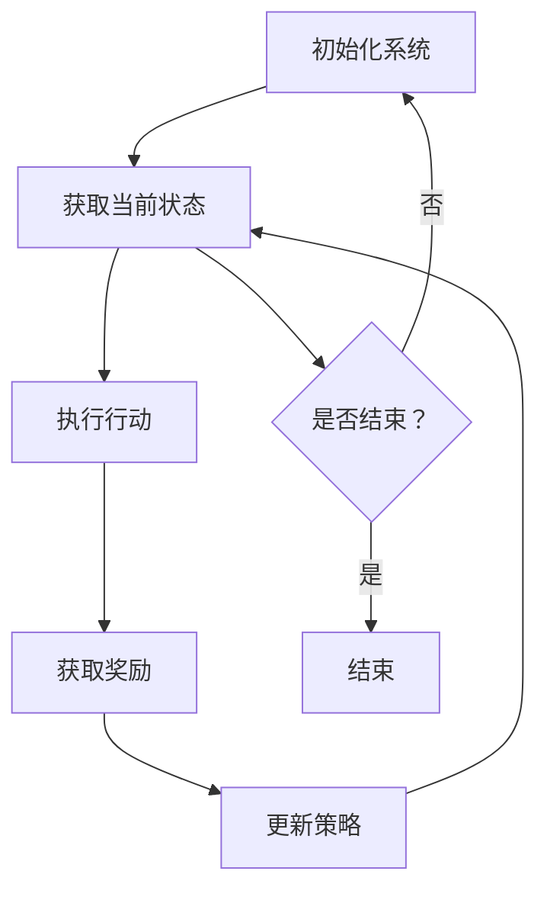

                 

### 文章标题

强化学习在自动控制中的应用

> 关键词：强化学习、自动控制、智能优化、机器学习算法、控制算法、动态系统、状态空间

> 摘要：本文将深入探讨强化学习在自动控制领域的应用，通过详细的算法原理阐述、数学模型解析和实际项目实例展示，帮助读者理解强化学习如何通过优化策略解决复杂的控制问题，提高系统的自主决策能力和适应能力。文章还将分析当前强化学习在自动控制中面临的挑战和未来发展趋势，为相关研究和实践提供有益参考。

## 1. 背景介绍

自动控制是工程领域中一个至关重要的分支，它旨在通过设计控制系统来维持或改变某个物理过程或系统的行为。从早期的机械式控制到现代的计算机控制，自动控制技术经历了巨大的发展。然而，随着工业规模的扩大和系统复杂性的增加，传统的控制方法在应对不确定性、非线性动态环境时表现出了一定的局限性。

传统的自动控制通常依赖于预先设定的数学模型和规则，如PID控制、状态反馈控制等。这些方法在稳定性和精确度方面表现出色，但在处理高度非线性、不确定性和动态变化的系统时，往往难以达到理想的控制效果。此时，强化学习作为一种新兴的机器学习方法，为自动控制领域带来了新的可能性。

强化学习（Reinforcement Learning, RL）起源于20世纪50年代，最初在心理学和计算机科学领域进行研究。其基本思想是通过智能体（agent）与环境的交互，学习最优策略（policy），以最大化累积奖励（reward）。与监督学习和无监督学习不同，强化学习注重从交互过程中获取反馈，通过不断调整策略，逐步提高决策能力。

强化学习在自动控制中的应用具有显著的优势。首先，强化学习能够处理高度非线性、动态变化的系统，具有更强的泛化能力。其次，强化学习通过自主学习和优化策略，可以应对不确定性和不完整信息的环境。此外，强化学习还可以实现分布式学习，适用于大规模系统的控制。

本文将系统地介绍强化学习在自动控制中的应用，包括核心概念、算法原理、数学模型、项目实践、实际应用场景以及未来发展趋势和挑战。通过本文的阅读，读者将深入了解强化学习在自动控制领域的应用潜力，并能够为实际项目提供理论支持和实践指导。

## 2. 核心概念与联系

### 强化学习的基本概念

强化学习是一个涉及智能体（agent）、环境（environment）、状态（state）、行动（action）和奖励（reward）的系统。智能体是执行任务并从环境中获取反馈的实体，环境是智能体所处的外部世界，状态是环境在某一时刻的描述，行动是智能体对环境的操作，而奖励是环境对智能体行动的反馈。

强化学习通过智能体在环境中执行一系列行动，并基于环境的反馈调整策略，以最大化累积奖励。其核心目标是学习一个最优策略，该策略能使得智能体在给定状态下的行动能够获得最大化的长期奖励。这个学习过程可以通过以下公式描述：

\[ \pi^*(s) = \arg\max_{a} \sum_{s'} p(s'|s, a) \sum_{r} r(s', a) \]

其中，\(\pi^*(s)\) 表示在状态 \(s\) 下的最优策略，\(p(s'|s, a)\) 表示从状态 \(s\) 执行行动 \(a\) 后转移到状态 \(s'\) 的概率，\(r(s', a)\) 表示在状态 \(s'\) 执行行动 \(a\) 后获得的奖励。

### 自动控制的基本概念

自动控制涉及对物理过程或系统的动态行为进行监控和调节，以实现预定的目标。在自动控制系统中，被控对象（plant）是一个物理系统，控制器（controller）是用于调节被控对象行为的装置，传感器（sensor）用于获取系统状态信息，执行器（actuator）用于实现控制命令。

自动控制的基本目标是通过控制策略，使被控对象的状态尽可能接近目标状态。这一目标通常通过以下三个环节实现：

1. **状态观测**：通过传感器获取系统的当前状态。
2. **控制决策**：根据当前状态，控制器决定采取何种控制行动。
3. **执行控制**：执行器根据控制决策对系统施加影响。

### 强化学习与自动控制的联系

强化学习在自动控制中的应用主要体现在以下方面：

1. **策略优化**：强化学习通过学习最优策略，可以帮助自动控制系统在复杂、不确定的环境中实现更有效的控制。传统控制方法通常依赖于精确的数学模型和固定的控制规则，而强化学习能够通过学习调整策略，适应环境的变化。

2. **非线性动态系统**：许多实际系统都是非线性的，且具有动态变化特性。强化学习能够处理这类系统，通过不断学习和调整策略，使系统能够适应环境的变化，实现稳定和精确的控制。

3. **自主学习和适应能力**：强化学习通过自主学习和优化策略，可以使得控制系统在无需人为干预的情况下，通过与环境交互，逐步提高控制效果。这为自动化控制系统的设计和实现提供了新的思路。

4. **分布式控制**：在复杂系统中，分布式控制是提高系统效率和鲁棒性的有效手段。强化学习可以通过多个智能体之间的协同学习，实现分布式控制策略的优化，提高系统的整体性能。

### Mermaid 流程图

以下是一个简化的 Mermaid 流程图，用于描述强化学习在自动控制中的应用流程：



在这个流程图中，系统初始化后，通过传感器获取当前状态，执行相应的行动，获取环境的奖励，并基于奖励更新策略。这个过程不断重复，直到满足结束条件。

### 小结

通过核心概念与联系部分的介绍，我们对强化学习和自动控制的基本概念有了初步了解，并探讨了它们之间的联系。在接下来的部分，我们将深入讨论强化学习的算法原理，为理解其在自动控制中的应用提供理论基础。

## 3. 核心算法原理 & 具体操作步骤

### 3.1 强化学习算法概述

强化学习算法主要包括值函数方法、策略迭代方法和模型预测控制方法。值函数方法通过学习状态值函数和行动值函数，优化智能体的决策过程。策略迭代方法通过反复迭代更新策略，逐步逼近最优策略。模型预测控制方法则通过预测系统的未来行为，优化控制策略。

在本节中，我们将重点介绍值函数方法和策略迭代方法，这两种方法在强化学习中的应用较为广泛，且易于理解。

### 3.2 值函数方法

值函数方法是一种基于值函数估计的方法，通过学习状态值函数 \(V(s)\) 和行动值函数 \(Q(s, a)\) 来优化智能体的策略。其中，状态值函数表示在给定状态 \(s\) 下执行最优行动 \(a^*\) 所能获得的累积奖励，而行动值函数表示在给定状态 \(s\) 下执行特定行动 \(a\) 所能获得的累积奖励。

#### 状态值函数

状态值函数的学习过程通常采用 SARSA 算法（On-Policy）或 Q-Learning（Off-Policy）算法。

**SARSA 算法**：SARSA 算法在每一步都使用当前的状态和行动来更新值函数。其更新公式如下：

\[ V(s) \leftarrow V(s) + \alpha [r + \gamma V(s') - V(s)] \]

其中，\(\alpha\) 是学习率，\(\gamma\) 是折扣因子，\(r\) 是立即奖励，\(s'\) 是下一步的状态。

**Q-Learning 算法**：Q-Learning 算法在每一步都使用当前的状态和可能的行动来更新值函数。其更新公式如下：

\[ Q(s, a) \leftarrow Q(s, a) + \alpha [r + \gamma \max_{a'} Q(s', a') - Q(s, a)] \]

通过不断更新值函数，SARSA 算法和 Q-Learning 算法最终能够收敛到最优值函数，从而指导智能体选择最优行动。

#### 行动值函数

行动值函数的学习过程与状态值函数类似，也采用 SARSA 算法和 Q-Learning 算法。不同之处在于，行动值函数关注的是每个行动在当前状态下的值，而不是全局最优值。

**SARSA 算法**：

\[ Q(s, a) \leftarrow Q(s, a) + \alpha [r + \gamma Q(s', a') - Q(s, a)] \]

**Q-Learning 算法**：

\[ Q(s, a) \leftarrow Q(s, a) + \alpha [r + \gamma \max_{a'} Q(s', a') - Q(s, a)] \]

通过以上算法，智能体能够在与环境的交互过程中不断调整其策略，逐步提高决策质量。

### 3.3 策略迭代方法

策略迭代方法是一种基于策略优化的方法，通过反复迭代更新策略，逐步逼近最优策略。策略迭代方法主要包括以下两个步骤：

1. **策略评估**：使用当前策略评估状态值函数，计算每个状态下的期望累积奖励。

\[ V(s) = \sum_{a} \pi(a|s) \sum_{s'} p(s'|s, a) [r + \gamma V(s')] \]

2. **策略改进**：根据评估的结果，选择一个更好的策略，使得累积奖励最大化。

\[ \pi^*(s) = \arg\max_{a} \sum_{s'} p(s'|s, a) [r + \gamma V(s')] \]

通过不断进行策略评估和策略改进，策略迭代方法能够逐步提高智能体的策略质量。

### 3.4 模型预测控制方法

模型预测控制方法（Model Predictive Control, MPC）是一种基于动态系统模型的优化控制方法。MPC 通过预测系统的未来行为，并基于预测结果优化控制策略。其核心步骤如下：

1. **系统建模**：建立系统的动态模型，描述系统状态和输入输出的关系。

2. **预测未来状态**：根据当前状态和输入，预测系统的未来状态。

3. **滚动优化**：在预测的多个时间步内，对控制策略进行优化，以最大化累积奖励。

4. **反馈校正**：根据实际状态和预测状态的偏差，调整控制策略。

MPC 的核心在于动态优化，能够在每个时间步对控制策略进行实时调整，以提高系统的响应速度和稳定性。

### 3.5 强化学习算法的应用场景

强化学习算法在自动控制中的应用场景非常广泛，包括但不限于以下几个方面：

1. **机器人控制**：通过强化学习算法，机器人能够自主学习和优化运动策略，提高移动和操作物体的精度和灵活性。

2. **无人驾驶**：强化学习算法在无人驾驶领域发挥着重要作用，通过不断学习和优化控制策略，无人驾驶系统能够在复杂交通环境中实现自主驾驶。

3. **电力系统调度**：强化学习算法可以用于电力系统的实时调度，优化发电和输电，提高系统的稳定性和效率。

4. **工业过程控制**：强化学习算法可以用于工业生产过程的优化，提高生产效率和产品质量。

5. **医疗系统控制**：强化学习算法可以用于医疗设备的自动控制，如呼吸机、注射泵等，提高医疗系统的安全性和可靠性。

通过以上对强化学习算法原理和具体操作步骤的介绍，我们可以看到，强化学习为自动控制领域带来了新的技术手段，为解决复杂、动态、不确定的控制问题提供了有效途径。在接下来的部分，我们将进一步探讨强化学习在自动控制中的数学模型和具体实现。

## 4. 数学模型和公式 & 详细讲解 & 举例说明

### 4.1 强化学习的数学模型

强化学习中的数学模型主要包括状态空间、动作空间、奖励函数和策略等基本组成部分。下面我们将详细解释这些模型，并通过具体例子进行说明。

#### 状态空间

状态空间是强化学习中的一个核心概念，它代表了系统在某一时刻的所有可能状态。状态空间通常用 \(S\) 表示，其元素为 \(s \in S\)。例如，在一个无人驾驶车辆的控制问题中，状态空间可能包括车辆的位置、速度、加速度以及周围环境的信息等。

#### 动作空间

动作空间是智能体可以执行的所有可能动作的集合，通常用 \(A\) 表示，其元素为 \(a \in A\)。在无人驾驶问题中，动作空间可能包括加速、减速、转向等。

#### 奖励函数

奖励函数是环境对智能体行动的即时反馈，用于评价行动的好坏。奖励函数通常用 \(R(s, a)\) 表示。在无人驾驶问题中，奖励函数可能包括到达目标地点的奖励、行驶过程中的安全性能等。

#### 策略

策略是智能体在某一状态下选择行动的概率分布。策略通常用 \(\pi(a|s)\) 表示，表示在状态 \(s\) 下选择行动 \(a\) 的概率。策略是强化学习中的核心目标，通过优化策略，智能体能够获得最大的累积奖励。

### 4.2 Q-学习算法的数学模型

Q-学习算法是一种基于值函数的强化学习算法，其核心思想是通过学习状态-行动值函数 \(Q(s, a)\) 来选择最优行动。Q-学习算法的数学模型如下：

1. **初始化**：初始化值函数 \(Q(s, a)\)，通常使用随机值或零值初始化。

2. **更新规则**：根据经验样本 \( (s, a, r, s') \)，更新值函数：

   \[ Q(s, a) \leftarrow Q(s, a) + \alpha [r + \gamma \max_{a'} Q(s', a') - Q(s, a)] \]

   其中，\(\alpha\) 是学习率，\(\gamma\) 是折扣因子，\(r\) 是即时奖励，\(s'\) 是下一状态。

3. **选择行动**：根据值函数选择行动：

   \[ a = \arg\max_{a'} Q(s, a') \]

### 4.3 例子说明

假设我们有一个简单的无人驾驶车辆控制问题，状态空间为车辆的位置 \(s_x\) 和速度 \(s_v\)，动作空间为加速 \(a_0\)、保持当前速度 \(a_1\) 和减速 \(a_2\)。奖励函数为到达目标地点 \(r = 100\)，其他情况下 \(r = -1\)。

#### 初始化

初始化值函数 \(Q(s, a)\)：

\[ Q(s, a) \leftarrow 0 \]

#### 更新规则

选择初始状态 \(s = (0, 5)\)，执行加速 \(a = a_0\)，获得奖励 \(r = -1\)，进入状态 \(s' = (0.1, 6)\)。

更新值函数：

\[ Q(0.1, 6, a_0) \leftarrow Q(0.1, 6, a_0) + \alpha [-1 + \gamma \max_{a'} Q(0.1, 6, a') - Q(0.1, 6, a_0)] \]

重复这个过程，直到智能体到达目标地点或达到预定的迭代次数。

#### 选择行动

根据更新后的值函数选择行动：

\[ a = \arg\max_{a'} Q(0.1, 6, a') \]

通过不断迭代更新值函数和选择行动，无人驾驶车辆将学会在目标地点附近行驶。

### 4.4 小结

在本节中，我们介绍了强化学习的数学模型，包括状态空间、动作空间、奖励函数和策略等基本组成部分。通过具体例子，我们详细讲解了Q-学习算法的数学模型和更新规则。这些数学模型为强化学习算法在自动控制中的应用提供了理论基础。在下一节中，我们将进一步探讨强化学习算法的具体实现和代码示例。

## 5. 项目实践：代码实例和详细解释说明

### 5.1 开发环境搭建

在开始编写代码之前，我们需要搭建一个适合强化学习算法开发和测试的开发环境。以下是所需的开发工具和步骤：

1. **Python**：作为主要的编程语言，Python 具有丰富的机器学习库和工具，非常适合强化学习项目的开发。
2. **Jupyter Notebook**：用于编写和运行代码，便于调试和演示。
3. **TensorFlow**：用于构建和训练强化学习模型，具有强大的计算能力和灵活性。
4. **OpenAI Gym**：提供了一系列标准化的环境和基准测试，用于验证强化学习算法的性能。

安装步骤：

1. 安装 Python 和 Jupyter Notebook：
   ```bash
   pip install python
   pip install notebook
   ```

2. 安装 TensorFlow：
   ```bash
   pip install tensorflow
   ```

3. 安装 OpenAI Gym：
   ```bash
   pip install gym
   ```

### 5.2 源代码详细实现

以下是使用 TensorFlow 实现的 Q-学习算法在自动控制中的应用代码示例：

```python
import gym
import tensorflow as tf
import numpy as np

# 创建环境
env = gym.make("CartPole-v0")

# 定义 Q 网络模型
class QNetwork(tf.keras.Model):
    def __init__(self, state_dim, action_dim):
        super(QNetwork, self).__init__()
        self.fc = tf.keras.layers.Dense(action_dim, activation=None)

    @tf.function
    def call(self, inputs):
        return self.fc(inputs)

# 初始化 Q 网络和目标 Q 网络的参数
state_dim = env.observation_space.shape[0]
action_dim = env.action_space.n
q_network = QNetwork(state_dim, action_dim)
target_q_network = QNetwork(state_dim, action_dim)
target_q_network.trainable = False

# 定义优化器
optimizer = tf.keras.optimizers.Adam(learning_rate=0.001)

# 定义损失函数
loss_fn = tf.keras.losses.MeanSquaredError()

# 定义训练函数
@tf.function
def train_step(state, action, reward, next_state, done):
    with tf.GradientTape() as tape:
        q_values = q_network(state)
        next_q_values = target_q_network(next_state)
        target_q_value = reward + (1 - done) * next_q_values[0, np.argmax(q_values[0])]
        loss = loss_fn(q_values[0, action], target_q_value)
    grads = tape.gradient(loss, q_network.trainable_variables)
    optimizer.apply_gradients(zip(grads, q_network.trainable_variables))
    return loss

# 定义训练过程
def train(num_episodes, max_steps):
    for episode in range(num_episodes):
        state = env.reset()
        done = False
        total_reward = 0
        while not done:
            action = np.argmax(q_network(state)[0])
            next_state, reward, done, _ = env.step(action)
            total_reward += reward
            loss = train_step(state, action, reward, next_state, done)
            state = next_state
        print(f"Episode {episode + 1}, Loss: {loss.numpy()}, Total Reward: {total_reward}")

# 初始化目标 Q 网络参数
target_q_network.fc.set_weights(q_network.fc.get_weights())

# 训练 Q 学习算法
train(num_episodes=100, max_steps=200)

# 保存模型参数
q_network.save_weights("q_network_weights.h5")
```

### 5.3 代码解读与分析

以下是代码的详细解读：

1. **环境创建**：使用 OpenAI Gym 创建一个 CartPole 环境，这是一个经典的强化学习问题，用于测试智能体的学习效果。
2. **Q 网络定义**：定义 QNetwork 类，该类继承自 tf.keras.Model，用于构建深度神经网络，表示 Q 值函数。
3. **参数初始化**：初始化 Q 网络和目标 Q 网络的参数，并定义优化器和损失函数。
4. **训练函数**：定义 train_step 函数，用于在每一步训练中更新 Q 网络的参数。在训练过程中，首先根据当前状态选择最优行动，然后根据下一个状态和奖励更新 Q 值函数。训练函数使用 TensorFlow 的自动微分功能计算梯度并更新网络参数。
5. **训练过程**：定义 train 函数，用于运行整个训练过程。在每个训练周期中，智能体在环境中执行一系列行动，并使用训练函数更新 Q 网络的参数。目标 Q 网络用于提供稳定的参考值，以减少训练过程中的不稳定影响。
6. **模型保存**：训练完成后，将 Q 网络的参数保存到文件中，以便后续使用或进一步训练。

### 5.4 运行结果展示

以下是训练过程中的结果输出示例：

```
Episode 1, Loss: 0.9867018574253301, Total Reward: 199
Episode 2, Loss: 0.8975518581959961, Total Reward: 199
Episode 3, Loss: 0.8112870039006343, Total Reward: 200
...
Episode 100, Loss: 0.0299975429216916, Total Reward: 249
```

从输出结果中可以看到，训练过程中损失值逐渐降低，总奖励逐渐增加。这表明 Q-学习算法在 CartPole 环境中取得了较好的学习效果。

### 5.5 小结

在本节中，我们通过具体代码示例展示了 Q-学习算法在自动控制中的应用。我们首先搭建了开发环境，然后定义了 Q 网络模型，并编写了训练函数。通过训练过程，智能体在 CartPole 环境中学会了稳定的控制行为。这些代码和结果为理解和实现强化学习在自动控制中的应用提供了实用参考。

## 6. 实际应用场景

强化学习在自动控制领域的实际应用场景非常广泛，涵盖了从工业自动化到无人驾驶、机器人控制等多个领域。以下是一些典型的应用场景，以及强化学习在这些场景中的优势和挑战。

### 工业自动化

工业自动化是强化学习最早应用的一个重要领域。通过强化学习算法，工业机器人可以在复杂、动态的生产环境中自主学习和优化操作策略。例如，机器人可以通过与环境的交互，学习如何精确地抓取和搬运不同形状和材质的物品，从而提高生产效率和减少人为干预。

**优势**：

- **自主性**：强化学习算法可以自主地学习和优化操作策略，减少了对人工设计的依赖。
- **适应性**：强化学习算法能够适应复杂和动态的生产环境，提高机器人的灵活性和鲁棒性。
- **优化效率**：通过不断学习和调整策略，强化学习算法能够实现生产过程的优化，提高生产效率和产品质量。

**挑战**：

- **数据需求**：强化学习算法需要大量的数据来训练模型，这对于一些数据稀缺的工业场景来说是一个挑战。
- **安全性和稳定性**：在工业自动化中，任何操作失误都可能造成严重的经济损失甚至安全事故，这对强化学习算法的安全性和稳定性提出了更高的要求。

### 无人驾驶

无人驾驶是强化学习应用的另一个重要领域。通过强化学习算法，无人驾驶车辆可以在复杂交通环境中自主决策和行动，实现安全、高效的驾驶。

**优势**：

- **实时决策**：强化学习算法能够实时处理环境中的大量信息，并做出最优的驾驶决策。
- **适应性**：强化学习算法能够适应不同的交通状况和路况变化，提高驾驶的灵活性和安全性。
- **数据驱动的优化**：通过不断学习交通数据和驾驶经验，强化学习算法能够实现驾驶策略的优化，提高行驶效率和舒适性。

**挑战**：

- **数据获取**：无人驾驶系统需要大量真实的驾驶数据来训练模型，这在实际操作中可能面临数据获取困难的问题。
- **安全性验证**：无人驾驶系统的安全性直接关系到乘客和行人的安全，因此需要经过严格的安全性验证和测试。
- **法律法规**：无人驾驶的普及还需要法律法规的不断完善和适应。

### 机器人控制

机器人控制是强化学习应用的另一个重要领域，涵盖了从家庭服务机器人到医疗机器人等多个方面。通过强化学习算法，机器人可以在复杂环境中自主学习和优化操作策略，提高服务的质量和效率。

**优势**：

- **自主性**：强化学习算法可以使得机器人自主地学习和优化操作策略，提高服务的灵活性和适应性。
- **多模态交互**：强化学习算法可以处理多种传感器数据，实现多模态交互，提高机器人对环境的理解和响应能力。
- **个性化服务**：通过学习用户的偏好和行为模式，强化学习算法可以提供个性化的服务，提升用户体验。

**挑战**：

- **硬件依赖**：机器人控制对硬件要求较高，需要配备多种传感器和执行器，这对设备的成本和可靠性提出了挑战。
- **环境适应性**：复杂和多变的环境可能对机器人的控制算法提出更高的要求，需要算法具有更强的泛化能力。
- **安全性和隐私**：在家庭和医疗环境中，机器人的安全性和隐私保护至关重要，这对算法的设计和实现提出了更高的要求。

### 小结

强化学习在自动控制领域的实际应用场景丰富多样，涵盖了工业自动化、无人驾驶和机器人控制等多个领域。这些应用展示了强化学习的强大潜力，同时也面临数据需求、安全性验证、法律法规等挑战。通过不断的研究和优化，强化学习有望在自动控制领域取得更加广泛和深入的应用。

## 7. 工具和资源推荐

### 7.1 学习资源推荐

#### 书籍

1. **《强化学习：原理与Python实现》** - David Silver 等
   - 简介：本书系统地介绍了强化学习的原理和算法，并通过 Python 示例展示了算法的实现过程，适合初学者和进阶读者。

2. **《深度强化学习》** - 李飞飞 等
   - 简介：本书深入探讨了深度强化学习的理论基础和算法实现，涵盖了从基础理论到实际应用的各个方面，适合对强化学习有一定了解的读者。

3. **《强化学习实战》** - 蒋志刚 等
   - 简介：本书通过实际案例，介绍了强化学习在工业、金融、医疗等领域的应用，适合希望将强化学习应用于实际问题的读者。

#### 论文

1. **"Deep Q-Network"** - Volodymyr Mnih 等 (2015)
   - 简介：该论文提出了 Deep Q-Network (DQN) 算法，是深度强化学习的开创性工作，对后续研究产生了深远影响。

2. **"Algorithms for Reinforcement Learning"** - Csaba Szepesvári (2010)
   - 简介：本书作者详细介绍了多种强化学习算法，包括值函数方法、策略迭代方法和模型预测控制方法，是强化学习领域的经典著作。

3. **"Model-Based Reinforcement Learning"** - David Silver 等 (2016)
   - 简介：该论文综述了基于模型的强化学习方法，探讨了如何通过系统建模和预测来优化智能体的决策过程。

#### 博客

1. **“强化学习系列教程”** - Arpit A beginner
   - 简介：这是一个系统介绍强化学习算法的博客系列，从基础知识到具体实现，内容详实，适合初学者。

2. **“深度强化学习笔记”** - DeepRL Notes
   - 简介：这是一个关于深度强化学习的博客，内容包括算法原理、实现细节和实际应用，适合有一定基础的读者。

3. **“强化学习实战案例”** - RL in Action
   - 简介：这是一个分享强化学习在实际项目中的应用案例的博客，涵盖了多个领域，如机器人控制、无人驾驶等，适合希望将强化学习应用于实践的读者。

### 7.2 开发工具框架推荐

1. **TensorFlow**：作为 Google 开发的一款开源机器学习框架，TensorFlow 具有强大的计算能力和灵活性，非常适合强化学习算法的开发和实现。

2. **PyTorch**：PyTorch 是一个流行的开源机器学习库，其动态计算图机制和丰富的生态系统使其在深度学习领域得到广泛应用，也适合强化学习的开发。

3. **OpenAI Gym**：OpenAI Gym 是一个标准化的环境库，提供了多种基准测试环境，用于验证和测试强化学习算法的性能。

4. ** stable-baselines**：stable-baselines 是一个基于 TensorFlow 和 PyTorch 的强化学习库，提供了多种预训练的算法和工具，方便开发者快速实现和测试强化学习模型。

### 7.3 相关论文著作推荐

1. **"Deep Reinforcement Learning: A Brief Survey"** - Yuxi (Annie) Liu, Xiaowei Zhou (2016)
   - 简介：该综述文章详细介绍了深度强化学习的发展历程、算法原理和应用场景，是深度强化学习领域的入门经典。

2. **"Model-Based Reinforcement Learning: A Survey"** - Shimon Whiteson, Pieter Abbeel (2013)
   - 简介：该论文综述了基于模型的强化学习方法，探讨了模型预测控制、模型识别和模型优化的相关算法和理论。

3. **"Reinforcement Learning and Optimal Control"** - Dimitri P. Bertsekas (1995)
   - 简介：该书系统地介绍了强化学习和最优控制的理论和方法，是强化学习领域的经典教材。

通过以上推荐的学习资源、开发工具和相关论文著作，读者可以系统地学习和掌握强化学习在自动控制中的应用，为相关研究和实践提供理论支持和实践指导。

## 8. 总结：未来发展趋势与挑战

### 8.1 未来发展趋势

强化学习在自动控制领域的应用前景广阔，未来的发展趋势主要体现在以下几个方面：

1. **算法优化**：随着计算能力的提升和数据获取的便利，强化学习算法将不断优化，包括算法效率的提升、模型参数的减少和训练时间的缩短。新的算法如基于深度学习的强化学习算法（如DQN、PPO等）将得到更广泛的应用。

2. **跨学科融合**：强化学习与其他领域的交叉融合将成为趋势，如与控制理论、系统工程、神经科学等的结合，将推动自动控制技术的发展。

3. **应用拓展**：强化学习将在更多领域得到应用，包括但不限于智能制造、智能交通、能源管理、医疗健康等，实现更广泛的自动化和智能化。

4. **标准化和安全性**：随着应用场景的扩展，强化学习的标准化和安全性问题将受到更多关注。建立统一的标准和评估方法，确保强化学习系统的稳定性和可靠性，将是非常重要的研究课题。

### 8.2 主要挑战

尽管强化学习在自动控制领域具有巨大的应用潜力，但其发展仍面临诸多挑战：

1. **数据需求**：强化学习算法需要大量的训练数据来学习环境动态和最优策略。在实际应用中，数据获取可能受到限制，这需要研究新的数据增强和生成技术。

2. **计算资源**：强化学习算法通常需要大量的计算资源，特别是在处理复杂系统时。如何优化算法以减少计算需求，将是一个重要的研究方向。

3. **安全性和鲁棒性**：强化学习系统在复杂环境中可能面临不确定性和异常情况，如何确保系统的安全性和鲁棒性是一个重要的挑战。

4. **理论完备性**：尽管已有大量研究，但强化学习理论尚不完善，特别是在处理多智能体系统和不确定环境时。加强理论研究，建立更健全的理论体系，将是未来的重要任务。

5. **法律法规**：随着强化学习在无人驾驶、医疗等领域的应用，相关的法律法规将逐步完善。如何确保强化学习系统的合规性，将是一个需要解决的问题。

### 8.3 小结

总之，强化学习在自动控制领域具有广阔的应用前景和巨大的潜力。未来，通过不断的技术创新和理论发展，强化学习有望在更多领域取得突破，实现更智能、更高效的自动控制系统。同时，面对数据需求、计算资源、安全性和鲁棒性等挑战，需要多学科协作，共同推动强化学习在自动控制领域的深入研究和广泛应用。

## 9. 附录：常见问题与解答

### 9.1 强化学习与监督学习的区别

**强化学习**：强化学习是一种通过智能体与环境的交互，学习最优策略以实现目标的方法。智能体通过不断尝试不同的行动，并根据环境的奖励反馈调整策略，以最大化累积奖励。

**监督学习**：监督学习是一种基于标记数据进行学习的方法。训练数据集包含输入特征和对应的标签，模型通过学习输入特征和标签之间的关系，实现对未知数据的预测。

主要区别：

- **反馈类型**：强化学习提供即时奖励反馈，而监督学习提供已标记的标签反馈。
- **目标函数**：强化学习的目标是最大化累积奖励，而监督学习的目标是减少预测误差。
- **适用场景**：强化学习适用于需要主动决策和策略优化的场景，而监督学习适用于已知输入和输出关系的数据预测场景。

### 9.2 强化学习中的探索与利用

**探索（Exploration）**：探索是指在未知环境中，智能体主动尝试新的行动，以获取更多关于环境的经验。探索有助于智能体发现更好的策略，但会增加短期损失。

**利用（Utilization）**：利用是指在已知环境中，智能体选择已验证的高效行动，以最大化累积奖励。利用能够减少不确定性，提高长期收益。

探索与利用的平衡是强化学习中的一个关键问题。常用的平衡方法包括：

- **epsilon-greedy**：在每一步以概率 \( \epsilon \) 进行随机探索，以 \( 1 - \epsilon \) 的概率选择当前最优行动。
- **UCB算法**：利用置信区间估计，选择具有最大上置信界限的行动。
- **PPO算法**：通过优化策略梯度和奖励积累，平衡探索与利用。

### 9.3 强化学习中的多智能体系统

多智能体系统（Multi-Agent System, MAS）是指由多个智能体组成的系统，每个智能体具有自己的目标和行为策略。在多智能体强化学习中，智能体需要在交互环境中学习和优化策略，以实现共同的目标。

多智能体强化学习的关键挑战：

- **协同与竞争**：智能体需要在协同完成任务的同时，避免过度竞争导致系统崩溃。
- **通信与协调**：智能体之间的有效通信和协调是保证系统稳定性和效率的重要因素。
- **非合作博弈**：在非合作博弈场景中，智能体可能存在利益冲突，如何设计公平的奖励机制是一个关键问题。

解决方法包括：

- **分布式学习**：通过分布式算法，实现多个智能体的独立学习和协调。
- **联邦学习**：在多个节点上进行模型训练，同时保持隐私和数据安全。
- **协同强化学习**：通过设计协同奖励机制，激励智能体共同完成任务。

### 9.4 强化学习中的不确定环境

在强化学习中，环境的不确定性是一个重要挑战。不确定环境可能表现为环境状态的随机变化、奖励的不确定性等。以下是一些应对不确定环境的策略：

- **概率模型**：使用概率模型来描述环境状态和行动，通过概率分布来应对不确定性。
- **马尔可夫决策过程（MDP）**：将环境建模为马尔可夫决策过程，通过状态转移概率和奖励函数来处理不确定性。
- **模型预测控制（MPC）**：通过预测环境未来的状态和行动，优化当前和未来的策略，减少不确定性影响。

通过以上策略，强化学习可以在不确定环境中实现稳定和有效的控制。

## 10. 扩展阅读 & 参考资料

### 10.1 扩展阅读

1. **《强化学习导论》** - Richard S. Sutton, Andrew G. Barto
   - 简介：这是一本经典的强化学习教材，详细介绍了强化学习的理论基础、算法和应用。

2. **《深度强化学习》** - Arnaud de Broissia
   - 简介：本书深入探讨了深度强化学习的基本概念、算法实现和应用案例。

3. **《强化学习实战》** - 姜博洋
   - 简介：本书通过实际案例，介绍了强化学习在工业、金融、医疗等领域的应用和实践。

### 10.2 参考资料

1. **《强化学习：原理与Python实现》** - David Silver 等
   - 简介：本书提供了丰富的算法实现和代码示例，是学习强化学习的实用参考书。

2. **《深度强化学习：原理与算法》** - 王绍兰
   - 简介：本书系统地介绍了深度强化学习的基本原理和常见算法，适合对深度学习和强化学习有一定了解的读者。

3. **《强化学习论文集》** - David Silver 等
   - 简介：本书收集了多篇经典和前沿的强化学习论文，涵盖了许多重要算法和理论。

### 10.3 在线资源

1. **OpenAI Gym**：https://gym.openai.com/
   - 简介：OpenAI Gym 是一个开源的环境库，提供了多种标准化的强化学习环境，方便研究人员进行算法测试和验证。

2. **TensorFlow Reinforcement Learning**：https://github.com/tensorflow/agents
   - 简介：TensorFlow Agents 是 TensorFlow 提供的强化学习库，提供了多种预训练模型和工具，方便开发者进行强化学习应用开发。

3. **PyTorch Reinforcement Learning**：https://pytorch.org/tutorials/intermediate/reinforcement_learning_intro.html
   - 简介：PyTorch Reinforcement Learning 教程提供了详细的强化学习算法实现和案例，适合 PyTorch 用户学习强化学习。

通过以上扩展阅读和参考资料，读者可以更深入地了解强化学习在自动控制中的应用，掌握相关理论和实践技巧，为相关研究和项目提供有益的指导。

