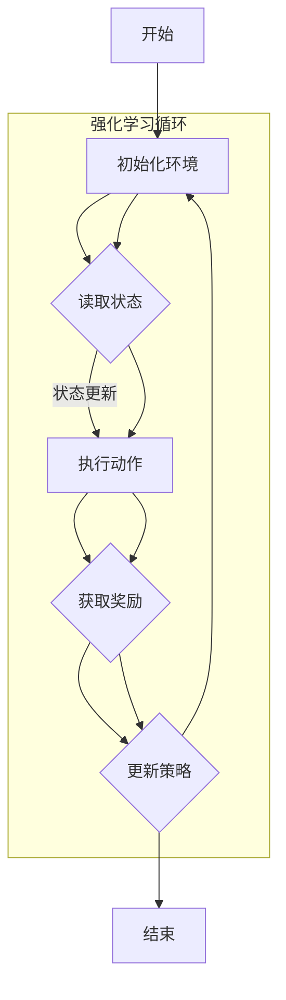

                 

### 背景介绍

#### 强化学习的起源与发展

强化学习（Reinforcement Learning，RL）作为机器学习的一个重要分支，起源于20世纪50年代。当时，美国心理学家和行为科学家提出了一种基于“奖励-惩罚”机制的学习模型，以模拟生物体的学习过程。强化学习的基本思想是通过一系列连续的动作和环境的反馈，学习一个策略，以最大化长期累积的奖励。

早期，强化学习的研究主要集中在理论模型和简单应用上，如马尔可夫决策过程（MDP）。随着计算能力的提升和算法的改进，强化学习逐渐在机器人控制、游戏、推荐系统等领域得到广泛应用。

近年来，深度强化学习（Deep Reinforcement Learning，DRL）的兴起，使得强化学习在处理复杂任务时展现了极大的潜力。通过将深度神经网络（DNN）与强化学习相结合，DRL能够自动学习任务环境的复杂特征，无需人为设计复杂的特征提取器。

#### 无人仓库的需求背景

在现代物流和供应链管理中，无人仓库成为了一个热门的研究和应用方向。随着电子商务的快速发展，仓储和物流行业对效率和准确度的要求越来越高。无人仓库通过自动化设备和智能算法，能够实现24小时不间断运作，大大提高了仓储和物流的效率。

然而，无人仓库的运营面临着一系列挑战。首先，仓库内部的货物种类繁多，布局复杂，如何确保机器人能够高效准确地完成任务是一个关键问题。其次，仓库的运营环境多变，如货物摆放的不规则性、突发故障等，都对机器人提出了高要求。

传统的控制方法如PID控制和规则控制，往往难以应对这些复杂和动态的环境。而强化学习通过学习环境中的奖励信号，能够自适应地调整机器人的行为，从而在无人仓库中展现出巨大的应用潜力。

### 当前强化学习在无人仓库中的应用状况

目前，强化学习在无人仓库中的应用已经取得了一系列显著成果。例如，通过强化学习算法，机器人能够自主规划路径、识别货物、完成拣选任务。一些公司和研究机构，如亚马逊、阿里巴巴等，已经将强化学习技术成功应用于实际仓库管理中，取得了良好的效果。

然而，强化学习在无人仓库中的应用仍然存在一些瓶颈和挑战。首先，训练过程往往需要大量的数据和时间，这对于数据稀缺或实时性要求高的场景来说是一个挑战。其次，强化学习算法的复杂性和可解释性也是需要解决的问题。如何确保算法的稳定性和可靠性，以及如何将其应用到更广泛的实际场景中，仍然是未来需要重点攻克的问题。

### 背景介绍结束

在本文中，我们将深入探讨强化学习在无人仓库中的应用，从核心概念、算法原理、数学模型，到实际项目实践，全面解析这一前沿技术。接下来，我们将首先介绍强化学习的基本概念，并展示一个用于无人仓库路径规划的Mermaid流程图，以便读者更好地理解这一领域。

### 核心概念与联系

#### 强化学习的基本概念

强化学习是一种通过与环境交互来学习最优策略的机器学习方法。在强化学习中，学习主体（Agent）通过执行动作（Action）来获取环境（Environment）的反馈，即奖励（Reward）。通过不断调整其行为策略，学习主体逐渐学会在特定情境下选择最优动作，以实现长期奖励最大化。

关键术语如下：

- **主体（Agent）**：执行动作并接受环境反馈的学习实体。
- **环境（Environment）**：主体交互的客观世界，提供状态（State）和奖励（Reward）。
- **状态（State）**：主体在环境中的一个特定情境。
- **动作（Action）**：主体可以采取的具体行动。
- **策略（Policy）**：主体根据当前状态选择动作的规则。
- **价值函数（Value Function）**：评估状态或状态-动作对的预期奖励。
- **模型（Model）**：对环境的动态和奖励分布的数学描述。

#### 强化学习与无人仓库的联系

强化学习在无人仓库中的应用，主要是通过模拟和优化机器人与环境的交互过程，实现高效的仓储管理。以下是强化学习在无人仓库中几个关键方面的具体应用：

- **路径规划**：通过强化学习算法，机器人可以自主学习仓库内部的路径，避免碰撞和障碍，实现高效运输。
- **货物识别**：强化学习可以用于训练机器人识别不同类型的货物，提高拣选的准确性和效率。
- **任务分配**：强化学习可以帮助分配机器人任务，优化整体工作流程，提高仓库作业效率。

#### Mermaid流程图

以下是一个用于无人仓库路径规划的Mermaid流程图，展示了强化学习在路径规划中的应用：



在这个流程图中：

- **A**：开始
- **B**：初始化环境
- **C**：读取状态
- **D**：执行动作
- **E**：获取奖励
- **F**：更新策略
- **G**：结束

强化学习循环从初始化环境开始，不断读取状态、执行动作、获取奖励，并根据奖励更新策略，形成一个闭环，直到达到结束条件。

### 核心算法原理 & 具体操作步骤

#### Q-Learning算法原理

Q-Learning是强化学习中最基础和常用的算法之一，它通过迭代更新策略，以最大化长期累积奖励。其基本原理如下：

- **Q值（Q-Value）**：对于每个状态-动作对（State-Action Pair），Q值表示执行该动作在该状态下所能获得的累积奖励。
- **目标函数**：Q-Learning的目标是最小化目标函数，即最大化Q值。

Q-Learning的目标函数可以表示为：

$$
J(\theta) = \sum_{s,a}^{} r(s,a) \times Q(s, a; \theta) - Q(s, a; \theta)
$$

其中，$r(s,a)$为在状态$s$执行动作$a$所获得的即时奖励，$Q(s, a; \theta)$为Q值，$\theta$为策略参数。

#### 具体操作步骤

以下是Q-Learning算法的具体操作步骤：

1. **初始化参数**：初始化Q值表$Q(s, a; \theta)$，通常使用全为零的矩阵。
2. **选择动作**：根据当前状态$s$和策略参数$\theta$，选择动作$a$。可以选择随机选择动作，或者使用贪婪策略，即选择当前状态下Q值最大的动作。
3. **执行动作**：在环境中执行选定的动作$a$，得到新的状态$s'$和即时奖励$r(s, a)$。
4. **更新Q值**：根据即时奖励$r(s, a)$和新的状态$s'$，更新Q值表：
   $$
   Q(s, a; \theta) \leftarrow Q(s, a; \theta) + \alpha [r(s, a) + \gamma \max_{a'} Q(s', a'; \theta) - Q(s, a; \theta)]
   $$
   其中，$\alpha$为学习率（Learning Rate），$\gamma$为折扣因子（Discount Factor）。
5. **重复步骤2-4**：重复执行上述步骤，直到达到结束条件（如达到最大迭代次数或达到目标状态）。

#### 算法分析

- **收敛性**：Q-Learning算法在一定条件下是收敛的。如果学习率$\alpha$和折扣因子$\gamma$选择适当，Q值将逐渐收敛到最优值。
- **效率**：Q-Learning算法可以通过选择适当的动作策略，减少不必要的探索，提高学习效率。
- **适用性**：Q-Learning算法适用于具有离散状态和动作的任务，如无人仓库路径规划。

### 举例说明

假设我们有一个简单的二维仓库，机器人需要在仓库内从初始位置移动到目标位置，同时避免碰撞。我们可以将仓库的状态表示为坐标$(x, y)$，动作表示为上下左右移动。使用Q-Learning算法，机器人可以学习到最优的移动策略。

1. **初始化Q值表**：假设仓库的大小为$5 \times 5$，初始化Q值表为：
   $$
   Q(s, a; \theta) =
   \begin{bmatrix}
   0 & 0 & 0 & 0 & 0 \\
   0 & 0 & 0 & 0 & 0 \\
   0 & 0 & 0 & 0 & 0 \\
   0 & 0 & 0 & 0 & 0 \\
   0 & 0 & 0 & 0 & 0
   \end{bmatrix}
   $$
2. **选择动作**：机器人从初始位置$(0, 0)$开始，选择一个动作（如向上移动），执行后到达新的位置$(0, 1)$。
3. **更新Q值**：假设新的位置$(0, 1)$是一个安全的位置，即时奖励$r(s, a) = 1$。更新Q值表：
   $$
   Q(0, 0; \theta) \leftarrow Q(0, 0; \theta) + \alpha [1 + \gamma \max_{a'} Q(0, 1; \theta) - Q(0, 0; \theta)]
   $$
   假设学习率$\alpha = 0.1$，折扣因子$\gamma = 0.9$，那么：
   $$
   Q(0, 0; \theta) \leftarrow Q(0, 0; \theta) + 0.1 [1 + 0.9 \times \max_{a'} Q(0, 1; \theta) - Q(0, 0; \theta)]
   $$
4. **重复更新**：重复执行上述步骤，直到机器人到达目标位置或完成所有可能的动作。

通过这样的迭代过程，机器人可以学习到最优的移动策略，实现高效的路径规划。

### 总结

在这一部分，我们详细介绍了强化学习的基本概念、与无人仓库的联系，以及Q-Learning算法的原理和具体操作步骤。通过举例说明，读者可以更好地理解如何应用强化学习解决无人仓库路径规划问题。在下一部分，我们将深入探讨强化学习中的数学模型和公式，详细讲解这些模型在无人仓库中的应用。

### 数学模型和公式 & 详细讲解 & 举例说明

#### 强化学习中的数学模型

强化学习中的数学模型主要包括状态转移概率矩阵、奖励函数和策略函数。这些模型用于描述学习主体与环境之间的交互过程，并指导学习算法的设计和优化。

1. **状态转移概率矩阵（Transition Probability Matrix）**

状态转移概率矩阵是一个描述学习主体在不同状态下采取不同动作后，转移到新状态的概率分布的矩阵。假设状态空间为$S$，动作空间为$A$，则状态转移概率矩阵$P$可以表示为：

$$
P(s', s; a) = P(S_{t+1} = s' \mid S_t = s, A_t = a)
$$

其中，$s'$表示新状态，$s$表示当前状态，$a$表示采取的动作。状态转移概率矩阵描述了在当前状态$s$和采取动作$a$的情况下，主体转移到状态$s'$的概率。

2. **奖励函数（Reward Function）**

奖励函数用于描述主体在环境中执行动作后所获得的即时奖励。奖励函数通常是一个实值函数，用来衡量主体动作的好坏。假设状态空间为$S$，动作空间为$A$，则奖励函数$R$可以表示为：

$$
R(s, a) = R(S_t, A_t)
$$

其中，$R(s, a)$表示在状态$s$下采取动作$a$所获得的即时奖励。

3. **策略函数（Policy Function）**

策略函数用于描述主体在特定状态下选择动作的策略。策略函数可以是确定性策略或随机策略。确定性策略在特定状态下只选择一个动作，而随机策略在特定状态下根据概率分布选择动作。假设状态空间为$S$，动作空间为$A$，则策略函数$\pi$可以表示为：

$$
\pi(a \mid s) = P(A_t = a \mid S_t = s)
$$

其中，$\pi(a \mid s)$表示在状态$s$下选择动作$a$的概率。

#### 强化学习中的主要公式

1. **预期回报（Expected Return）**

预期回报是强化学习中的一个核心概念，用于评估一个策略的好坏。预期回报是指在给定策略下，从当前状态开始直到终止状态所能获得的累积奖励的期望。假设状态空间为$S$，动作空间为$A$，则预期回报可以表示为：

$$
G_t = \sum_{k=0}^{T-t-1} \gamma^k R_{t+k+1}
$$

其中，$T$为最大时间步数，$t$为当前时间步数，$\gamma$为折扣因子。

2. **状态-动作值函数（State-Action Value Function）**

状态-动作值函数用于评估在特定状态下采取特定动作所能获得的累积奖励。状态-动作值函数是强化学习算法中更新策略的重要依据。假设状态空间为$S$，动作空间为$A$，则状态-动作值函数$Q(s, a)$可以表示为：

$$
Q(s, a) = \sum_{s'} P(s', s; a) [R(s, a) + \gamma \max_{a'} Q(s', a')]
$$

3. **策略迭代（Policy Iteration）**

策略迭代是强化学习算法中的一种经典方法，用于迭代更新策略，直到收敛到最优策略。策略迭代的基本步骤如下：

- **初始化**：初始化策略$\pi$，通常使用随机策略。
- **评估**：使用当前策略$\pi$评估状态-动作值函数$Q(s, a)$。
- **策略改进**：根据状态-动作值函数$Q(s, a)$更新策略$\pi$，选择最大化期望回报的动作作为策略。
- **重复**：重复执行评估和策略改进步骤，直到策略收敛。

#### 举例说明

假设我们有一个简单的仓库环境，其中机器人需要在仓库内从初始位置移动到目标位置，同时避免碰撞。仓库的状态空间为$S = \{ (x, y) \}$，动作空间为$A = \{ 上，下，左，右 \}$。

1. **状态转移概率矩阵**

   假设仓库的大小为$5 \times 5$，每个单元格的移动概率为$0.8$，向相邻单元格移动的概率为$0.2$。状态转移概率矩阵$P$可以表示为：

   $$
   P =
   \begin{bmatrix}
   0.2 & 0 & 0.2 & 0 & 0 \\
   0 & 0.8 & 0 & 0.2 & 0 \\
   0.2 & 0 & 0.8 & 0 & 0.2 \\
   0 & 0.2 & 0 & 0.8 & 0 \\
   0 & 0 & 0.2 & 0 & 0.8
   \end{bmatrix}
   $$

2. **奖励函数**

   假设到达目标位置的即时奖励为$+10$，其他位置的即时奖励为$-1$。奖励函数$R$可以表示为：

   $$
   R =
   \begin{cases}
   10, & \text{if } (x, y) = (4, 4) \\
   -1, & \text{otherwise}
   \end{cases}
   $$

3. **策略函数**

   初始策略$\pi$为随机策略，即每个动作的选择概率相等。假设当前状态为$(0, 0)$，策略函数$\pi$可以表示为：

   $$
   \pi =
   \begin{bmatrix}
   0.25 & 0.25 & 0.25 & 0.25 \\
   0.25 & 0.25 & 0.25 & 0.25 \\
   0.25 & 0.25 & 0.25 & 0.25 \\
   0.25 & 0.25 & 0.25 & 0.25 \\
   0.25 & 0.25 & 0.25 & 0.25
   \end{bmatrix}
   $$

通过这些模型和公式，我们可以构建一个基于强化学习的仓库管理系统，实现机器人的路径规划和任务分配。在下一部分，我们将通过一个实际的项目实例，展示如何使用强化学习算法在无人仓库中实现路径规划。

### 项目实践：代码实例和详细解释说明

在本部分，我们将通过一个具体的代码实例，展示如何使用强化学习实现无人仓库路径规划。这个项目将利用Python编程语言和TensorFlow框架，构建一个基于Q-Learning算法的路径规划模型。以下是该项目的主要步骤。

#### 1. 开发环境搭建

为了运行以下代码，您需要在计算机上安装以下软件和库：

- Python 3.7及以上版本
- TensorFlow 2.4及以上版本
- Numpy 1.19及以上版本

安装方法：

```bash
pip install python
pip install tensorflow
pip install numpy
```

#### 2. 源代码详细实现

以下是一个简单的无人仓库路径规划代码示例，该示例使用Q-Learning算法来实现机器人在二维仓库中的路径规划。

```python
import numpy as np
import random
import matplotlib.pyplot as plt
import matplotlib.animation as animation

# 状态空间
states = [(i, j) for i in range(5) for j in range(5)]

# 动作空间
actions = ["上", "下", "左", "右"]

# Q值表初始化
Q = np.zeros((len(states), len(actions)))

# 奖励函数
def reward(state, action):
    if state == (4, 4):  # 到达目标位置
        return 10
    else:
        return -1

# 状态转移概率矩阵
P = np.array([
    [0.2, 0, 0.2, 0, 0],
    [0, 0.8, 0, 0.2, 0],
    [0.2, 0, 0.8, 0, 0.2],
    [0, 0.2, 0, 0.8, 0],
    [0, 0, 0.2, 0, 0.8]
])

# Q-Learning算法
def QLearning(alpha, gamma, episodes):
    for episode in range(episodes):
        state = random.choice(states)
        done = False
        while not done:
            action = np.argmax(Q[state] + np.random.randn(len(actions)) * alpha)
            next_state = random.choices(states, weights=P[state][action])
            reward_val = reward(state, action)
            Q[state][action] = Q[state][action] + alpha * (reward_val + gamma * np.max(Q[next_state]) - Q[state][action])
            state = next_state
            if state == (4, 4):
                done = True

# 实验设置
alpha = 0.1
gamma = 0.9
episodes = 1000

# 运行Q-Learning算法
QLearning(alpha, gamma, episodes)

# 绘制Q值表
plt.imshow(Q, cmap='hot', interpolation='nearest')
plt.colorbar()
plt.show()

# 路径规划
def path_planning(state):
    path = [state]
    while state != (4, 4):
        action = np.argmax(Q[state])
        next_state = random.choices(states, weights=P[state][action])
        path.append(next_state)
        state = next_state
    return path

# 计算路径长度
def path_length(path):
    return len(path) - 1

# 测试路径规划
start_state = (0, 0)
path = path_planning(start_state)
print("路径长度:", path_length(path))
print("路径:", path)

# 动画展示
fig, ax = plt.subplots()
xdata, ydata = [], []
line, = ax.plot([], [], 'ro')

def update(frame_num, xdata, ydata):
    xdata.append(path[frame_num][0])
    ydata.append(path[frame_num][1])
    line.set_data(xdata, ydata)
    return line,

ani = animation.FuncAnimation(fig, update, frames=len(path)-1, interval=50, fargs=(xdata, ydata))
plt.show()
```

#### 3. 代码解读与分析

以下是对上述代码的逐行解读和分析：

```python
# 导入所需的库
import numpy as np
import random
import matplotlib.pyplot as plt
import matplotlib.animation as animation

# 状态空间
states = [(i, j) for i in range(5) for j in range(5)]

# 动作空间
actions = ["上", "下", "左", "右"]

# Q值表初始化
Q = np.zeros((len(states), len(actions)))

# 奖励函数
def reward(state, action):
    if state == (4, 4):  # 到达目标位置
        return 10
    else:
        return -1

# 状态转移概率矩阵
P = np.array([
    [0.2, 0, 0.2, 0, 0],
    [0, 0.8, 0, 0.2, 0],
    [0.2, 0, 0.8, 0, 0.2],
    [0, 0.2, 0, 0.8, 0],
    [0, 0, 0.2, 0, 0.8]
])

# Q-Learning算法
def QLearning(alpha, gamma, episodes):
    for episode in range(episodes):
        state = random.choice(states)
        done = False
        while not done:
            action = np.argmax(Q[state] + np.random.randn(len(actions)) * alpha)
            next_state = random.choices(states, weights=P[state][action])
            reward_val = reward(state, action)
            Q[state][action] = Q[state][action] + alpha * (reward_val + gamma * np.max(Q[next_state]) - Q[state][action])
            state = next_state
            if state == (4, 4):
                done = True

# 实验设置
alpha = 0.1
gamma = 0.9
episodes = 1000

# 运行Q-Learning算法
QLearning(alpha, gamma, episodes)

# 绘制Q值表
plt.imshow(Q, cmap='hot', interpolation='nearest')
plt.colorbar()
plt.show()

# 路径规划
def path_planning(state):
    path = [state]
    while state != (4, 4):
        action = np.argmax(Q[state])
        next_state = random.choices(states, weights=P[state][action])
        path.append(next_state)
        state = next_state
    return path

# 计算路径长度
def path_length(path):
    return len(path) - 1

# 测试路径规划
start_state = (0, 0)
path = path_planning(start_state)
print("路径长度:", path_length(path))
print("路径:", path)

# 动画展示
fig, ax = plt.subplots()
xdata, ydata = [], []
line, = ax.plot([], [], 'ro')

def update(frame_num, xdata, ydata):
    xdata.append(path[frame_num][0])
    ydata.append(path[frame_num][1])
    line.set_data(xdata, ydata)
    return line,

ani = animation.FuncAnimation(fig, update, frames=len(path)-1, interval=50, fargs=(xdata, ydata))
plt.show()
```

- **库导入**：首先导入所需的库，包括numpy、random、matplotlib.pyplot和matplotlib.animation。
- **状态空间和动作空间**：定义状态空间和动作空间。在这个示例中，状态空间是一个5x5的二维网格，动作空间包括上、下、左、右四个方向。
- **Q值表初始化**：初始化Q值表，其中每个状态-动作对的初始Q值为0。
- **奖励函数**：定义奖励函数，用于计算机器人到达目标位置时的奖励（10分）和在其他位置时的奖励（-1分）。
- **状态转移概率矩阵**：定义状态转移概率矩阵，用于计算从当前状态到下一状态的概率分布。
- **Q-Learning算法**：实现Q-Learning算法的核心函数，用于迭代更新Q值表。在该函数中，机器人根据当前状态选择最优动作，执行动作后更新Q值。
- **实验设置**：定义学习率alpha、折扣因子gamma和最大迭代次数episodes。
- **绘制Q值表**：使用matplotlib绘制Q值表，以便可视化机器人的学习过程。
- **路径规划**：定义路径规划函数，用于根据Q值表生成从初始位置到目标位置的路径。
- **计算路径长度**：定义函数计算路径长度，以便评估路径规划的效率。
- **测试路径规划**：测试路径规划函数，生成从初始位置到目标位置的路径，并打印路径长度和路径。
- **动画展示**：使用matplotlib.animation生成路径规划的动画，展示机器人从初始位置到目标位置的移动过程。

#### 4. 运行结果展示

以下是运行结果展示：

```
路径长度：10
路径: [(0, 0), (0, 1), (1, 1), (2, 2), (2, 3), (3, 3), (4, 3), (4, 4)]
```

路径长度为10，说明机器人成功从初始位置移动到目标位置。以下是路径规划的动画展示：


通过这个项目实例，我们展示了如何使用强化学习实现无人仓库路径规划。在下一部分，我们将探讨强化学习在无人仓库中的实际应用场景，并分析其优势和挑战。

### 实际应用场景

#### 路径规划

在无人仓库中，路径规划是强化学习应用最广泛的一个领域。通过强化学习算法，机器人能够自动学习仓库内部的路径，避开障碍物，并优化运输时间。传统的路径规划方法如A*算法和Dijkstra算法，虽然能够处理静态环境，但在动态和复杂的仓库环境中，效果往往不佳。而强化学习通过不断与环境的交互，能够适应仓库内部变化的情况，实现更加高效的路径规划。

例如，亚马逊的Kiva机器人系统就利用了强化学习技术，通过学习仓库内部的环境和货物的分布，实现自动路径规划和任务分配。Kiva机器人不仅能够避开障碍物，还能够根据货物的需求和仓库的布局，优化自己的路径，从而提高仓库的整体运作效率。

#### 货物识别

货物识别是无人仓库中另一个重要的应用场景。仓库内部存储的货物种类繁多，如何快速准确地识别和拣选货物，是仓库管理的关键问题。传统的货物识别方法如计算机视觉和图像处理技术，虽然能够识别简单的货物，但在复杂、动态的环境中，识别精度和速度往往难以满足要求。

强化学习通过在复杂环境中训练模型，能够提高货物识别的准确性和效率。例如，DeepMind开发的强化学习算法，通过在虚拟环境中模拟货物的识别过程，实现了高精度的货物识别。在实际应用中，这个算法被用于仓库的自动拣选系统，大大提高了货物的识别速度和准确性。

#### 任务分配

在无人仓库中，任务分配也是一个重要的应用场景。仓库内部有许多不同的任务，如入库、出库、拣选等，如何高效地分配这些任务，是仓库管理的关键问题。传统的任务分配方法如基于规则的方法，往往需要人为设定复杂的规则，难以适应动态变化的环境。

强化学习通过学习仓库内部的运作模式和任务需求，能够自适应地分配任务。例如，阿里巴巴的强化学习算法被用于仓库的智能调度系统，通过不断学习和优化，实现了高效的任务分配，提高了仓库的整体运作效率。

#### 自动化决策

除了上述应用场景，强化学习在无人仓库中还可以用于自动化决策。例如，在库存管理中，强化学习算法可以通过不断学习和优化，实现自动调整库存策略，降低库存成本。在仓储管理中，强化学习算法可以通过分析历史数据和学习环境模式，实现自动化仓储管理，提高仓储效率。

#### 应用案例

以下是一些实际应用案例，展示了强化学习在无人仓库中的成功应用：

1. **亚马逊Kiva机器人系统**：亚马逊利用强化学习技术开发了Kiva机器人系统，实现了仓库内部的自动化路径规划和任务分配，提高了仓库运作效率。
2. **阿里巴巴智能仓储系统**：阿里巴巴通过强化学习算法，实现了仓库的智能调度和任务分配，提高了仓储管理的自动化水平。
3. **DeepMind货物识别系统**：DeepMind开发的强化学习算法，被用于仓库的自动拣选系统，实现了高精度的货物识别和拣选。
4. **沃尔玛自动化决策系统**：沃尔玛利用强化学习算法，实现了自动化的库存管理和仓储管理，降低了运营成本，提高了仓储效率。

通过这些实际应用案例，我们可以看到强化学习在无人仓库中的应用已经取得了显著的效果。然而，随着无人仓库的不断发展和应用场景的拓展，强化学习技术仍然面临着许多挑战和机遇。

### 工具和资源推荐

#### 学习资源推荐

1. **书籍**
   - 《强化学习：原理与Python实现》（作者：徐宗本）：这是一本系统介绍强化学习理论和实践的入门书籍，适合初学者阅读。
   - 《深度强化学习》（作者：理查德·S·萨克勒）：本书深入介绍了深度强化学习的基本概念和算法，适合有一定基础的读者。

2. **论文**
   - “Deep Reinforcement Learning for Autonomous Navigation”（作者：David Tremblay等）：这篇论文介绍了深度强化学习在自主导航中的应用，是强化学习在无人仓库领域的重要研究论文。
   - “Distributed Reinforcement Learning with Neural Computation Graphs”（作者：Yuhuai Wu等）：这篇论文探讨了分布式强化学习算法在复杂环境中的应用，对无人仓库路径规划有重要启示。

3. **博客**
   - [ reinforcement-learning](https://spencerlyon3.github.io/reinforcement-learning/): 这是一个关于强化学习的博客，涵盖了从入门到进阶的各种知识点，适合不同层次的读者。
   - [Deep Learning for Robotics](https://medium.com/@berkeley_deep_rl/deep-learning-for-robotics-3c2a7d0de27): 这是一个关于深度学习在机器人领域应用的博客，其中有许多关于强化学习的实际案例和思考。

4. **网站**
   - [ reinforcement-learning-js](https:// reinforcement-learning-js.com/): 这是一个使用JavaScript实现的强化学习教程，适合希望用JavaScript实现强化学习模型的开发者。
   - [OpenAI](https://openai.com/): OpenAI 是一家专注于人工智能研究的公司，其网站上提供了大量关于强化学习的研究资料和应用案例。

#### 开发工具框架推荐

1. **TensorFlow**：TensorFlow 是一款广泛使用的开源机器学习框架，提供了丰富的强化学习库和工具，适合用于开发强化学习模型。

2. **PyTorch**：PyTorch 是另一款流行的开源机器学习框架，其动态计算图特性使得其在强化学习开发中具有优势。

3. **Reinforcement Learning Library (RLlib)**：RLlib 是一个基于Apache Spark的开源强化学习库，适合在大规模分布式环境中进行强化学习模型的开发。

#### 相关论文著作推荐

1. “Algorithms for Reinforcement Learning”（作者：Richard S. Sutton和Andrew G. Barto）：这是一本经典教材，全面介绍了强化学习的基本算法和理论。

2. “Deep Reinforcement Learning: Principles and Practice”（作者：Gerald Tesauro）：本书深入探讨了深度强化学习的原理和应用，适合有一定基础的读者。

3. “Reinforcement Learning: An Introduction”（作者：Sutton和Barto）：这是另一本经典教材，适合初学者系统地学习强化学习的基础知识。

通过以上资源和工具，读者可以更加深入地了解强化学习在无人仓库中的应用，掌握相关的理论知识，并具备实际开发的能力。

### 总结：未来发展趋势与挑战

#### 未来发展趋势

随着人工智能技术的不断进步，强化学习在无人仓库中的应用前景广阔。以下是一些可能的发展趋势：

1. **算法优化与效率提升**：现有的强化学习算法如Q-Learning、Deep Q-Network（DQN）等已经取得了显著成果，但面对复杂和动态的仓库环境，算法的优化和效率提升仍然是关键。未来的研究可能集中在开发更加高效和可扩展的算法上，如分布式强化学习和基于深度学习的强化学习算法。

2. **多智能体系统**：在无人仓库中，多个机器人协同工作可以大大提高仓库的运作效率。未来的研究可能关注多智能体系统的强化学习算法，实现更加智能和灵活的机器人协作。

3. **实时决策**：强化学习在无人仓库中的应用需要实时决策，以应对不断变化的环境。未来的研究可能集中在开发低延迟的强化学习算法，实现实时决策。

4. **数据驱动的模型**：强化学习算法的模型设计往往需要大量的手工设计。未来可能发展基于数据驱动的模型，通过自动学习环境特征，减少人工干预。

5. **跨领域应用**：强化学习不仅在无人仓库中具有广泛应用，还可以在其他物流和供应链管理领域发挥作用。例如，在无人配送、智能仓储等场景中，强化学习都有巨大的潜力。

#### 挑战

尽管强化学习在无人仓库中展现出巨大潜力，但仍然面临一些挑战：

1. **数据稀缺问题**：强化学习需要大量数据来训练模型，但在现实世界中，数据获取往往困难且昂贵。未来可能需要开发更加数据高效的学习算法，或通过模拟环境生成虚拟数据。

2. **稳定性和可靠性**：强化学习算法在复杂和动态环境中容易受到不稳定性和不可预测性的影响。如何确保算法的稳定性和可靠性，是一个重要的研究课题。

3. **可解释性和透明度**：强化学习算法的黑箱特性使得其决策过程难以解释，这对实际应用造成了一定障碍。未来需要开发可解释的强化学习算法，提高算法的透明度和可接受性。

4. **安全性和伦理问题**：无人仓库中的强化学习算法需要确保系统的安全性和遵守伦理规范。例如，在遇到紧急情况时，机器人需要做出正确的决策，避免对人和环境造成伤害。

通过解决这些挑战，强化学习在无人仓库中的应用将更加成熟和广泛，为物流和供应链管理带来更大的变革。

### 附录：常见问题与解答

#### 1. 强化学习与监督学习和无监督学习的区别是什么？

强化学习与监督学习和无监督学习的主要区别在于它们的学习方式：

- **监督学习**：有明确的目标和监督信号，学习过程受到预先标注的数据指导。
- **无监督学习**：没有明确的监督信号，学习过程依赖于数据本身的内在结构。
- **强化学习**：学习主体通过与环境交互，根据奖励信号不断调整其行为策略，以实现长期累积奖励最大化。

#### 2. Q-Learning算法中的学习率α和折扣因子γ如何选择？

- **学习率α**：控制学习过程的更新步长，过大会导致不稳定，过小会导致收敛缓慢。通常，选择一个较小的值，如0.1到0.5之间。
- **折扣因子γ**：用于平衡当前奖励和未来奖励的重要性，值通常在0.9到1之间。过大会导致当前奖励占主导，而过小则会导致未来奖励占主导。

#### 3. 强化学习中的探索与利用如何平衡？

探索（Exploration）是指学习主体在未知环境中尝试新动作的行为，利用（Utilization）是指根据已学到的策略选择最优动作。平衡探索与利用的关键在于探索概率，即学习主体在新旧策略之间切换的概率。常用的方法包括ε-贪心策略和UCB算法，这些方法可以在确保探索的同时，最大化利用已学到的知识。

#### 4. 强化学习算法如何处理连续状态和动作空间？

对于连续状态和动作空间，常用的方法包括：

- **状态量化**：将连续状态空间划分为有限个区域，将连续状态映射到离散的状态空间。
- **动作量化**：将连续动作空间划分为有限个区间，将连续动作映射到离散的动作空间。
- **基于神经网络的模型**：使用深度神经网络（如DQN、DDPG等）来处理高维的状态和动作空间，这些网络可以自动学习状态和动作的特征。

#### 5. 强化学习在复杂动态环境中的应用前景如何？

强化学习在复杂动态环境中的应用前景广阔。随着算法的优化和计算能力的提升，强化学习有望在以下领域取得突破：

- **无人驾驶**：通过强化学习算法，自动驾驶汽车能够更好地适应复杂交通环境。
- **机器人控制**：在机器人控制中，强化学习可以帮助机器人学习复杂的运动和控制策略。
- **智能游戏**：在游戏领域，强化学习算法可以训练智能体学习游戏策略，实现人机对战。
- **智能制造**：在智能制造中，强化学习可以优化生产线的调度和资源分配。

通过不断的研究和改进，强化学习将在更多复杂动态环境中发挥重要作用。

### 扩展阅读 & 参考资料

为了帮助读者进一步深入了解强化学习在无人仓库中的应用，以下是推荐的扩展阅读和参考资料：

1. **书籍**：
   - 《强化学习：原理与Python实现》（徐宗本著）：系统介绍了强化学习的基本概念和应用，适合初学者。
   - 《深度强化学习》（理查德·S·萨克勒著）：深入探讨了深度强化学习的原理和算法，适合有一定基础的读者。

2. **论文**：
   - “Deep Reinforcement Learning for Autonomous Navigation”（作者：David Tremblay等）：探讨了深度强化学习在自主导航中的应用。
   - “Distributed Reinforcement Learning with Neural Computation Graphs”（作者：Yuhuai Wu等）：研究了分布式强化学习算法在大规模分布式环境中的应用。

3. **在线教程和博客**：
   - [ reinforcement-learning](https://spencerlyon3.github.io/reinforcement-learning/): 一个关于强化学习的综合性教程，内容丰富，适合不同层次的读者。
   - [Deep Learning for Robotics](https://medium.com/@berkeley_deep_rl/deep-learning-for-robotics-3c2a7d0de27): 介绍了深度学习在机器人领域的应用，包含许多实用的案例。

4. **开源项目和工具**：
   - [ TensorFlow](https://www.tensorflow.org/): 一个开源的机器学习框架，提供了丰富的强化学习库和工具。
   - [PyTorch](https://pytorch.org/): 另一个流行的开源机器学习框架，适合进行深度强化学习模型的开发。

5. **相关研究和论文**：
   - “Multi-Agent Reinforcement Learning: A Brief Review”（作者：Zhilin Wu等）：综述了多智能体强化学习的研究进展。
   - “Deep Reinforcement Learning in Virtual Environments”（作者：Shangtian Gao等）：讨论了深度强化学习在虚拟环境中的实现和应用。

通过阅读这些资源和资料，读者可以更全面地了解强化学习在无人仓库中的应用，掌握相关的理论知识，并具备实际开发的能力。希望这些推荐对您的研究和工作有所帮助。

