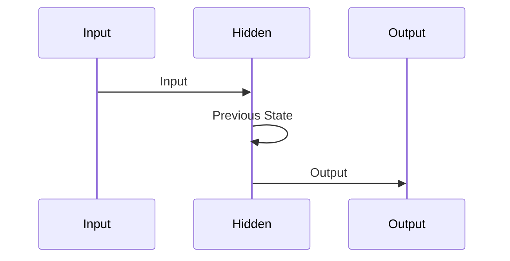

                 

### 文章标题

《循环神经网络RNN原理与代码实例讲解》

### 关键词 Keywords

- 循环神经网络（RNN）
- 递归神经网络
- 长短时记忆（LSTM）
- 深度学习
- 自然语言处理

### 摘要 Abstract

本文旨在深入讲解循环神经网络（RNN）的基本原理、架构及其在深度学习中的应用。通过详细的数学模型和代码实例，我们将探讨RNN的运作机制、常见问题和解决方案，以及RNN在实际项目中的应用。文章还将推荐一系列学习和开发资源，帮助读者更好地理解和使用RNN。

## 1. 背景介绍

循环神经网络（RNN）是深度学习领域的一种重要模型，它在处理序列数据时表现出色。RNN的核心特点是具有递归结构，能够将前一时刻的信息传递给后一时刻，使得模型能够记住序列信息。这种特性使得RNN在自然语言处理、语音识别、时间序列预测等应用中具有广泛的应用。

### 1.1 RNN的发展历程

RNN的概念最早由Hochreiter和Schmidhuber于1997年提出。随后，RNN在2000年代初取得了一些突破性进展，但受限于计算资源和优化难度，其应用并未得到广泛推广。直到2013年，序列到序列学习（Seq2Seq）模型的提出，使得RNN在自然语言处理领域取得了显著成功。特别是长短时记忆网络（LSTM）和门控循环单元（GRU）的引入，进一步提升了RNN的性能。

### 1.2 RNN的重要性

循环神经网络在深度学习中的应用具有重要意义。首先，它能够有效地处理序列数据，捕捉数据中的时序信息。其次，RNN在自然语言处理领域表现出色，广泛应用于机器翻译、文本生成、情感分析等任务。此外，RNN还在语音识别、视频分析、时间序列预测等领域具有广泛的应用潜力。

## 2. 核心概念与联系

### 2.1 RNN的基本架构

RNN的架构主要由以下几个部分组成：

1. **输入层**：接收序列数据，每个时间步输入一个特征向量。
2. **隐藏层**：存储序列信息，每个时间步更新隐藏状态。
3. **输出层**：生成序列的输出，每个时间步输出一个特征向量。
4. **递归连接**：当前时间步的隐藏状态与前一时间步的隐藏状态相连。

下面是一个简单的Mermaid流程图，展示了RNN的基本架构：



### 2.2 长短时记忆（LSTM）和门控循环单元（GRU）

为了解决传统RNN在长序列学习中的“梯度消失”和“梯度爆炸”问题，长短时记忆（LSTM）和门控循环单元（GRU）被提出。

1. **LSTM（长短时记忆网络）**：

   LSTM通过引入三个门控机制（遗忘门、输入门、输出门）来控制信息的流动，从而有效地学习长序列信息。

   下图是一个LSTM单元的Mermaid流程图：

   ```mermaid
   sequenceDiagram
       participant Input as Input
       participant Hidden as Hidden
       participant CellState as CellState
       participant Output as Output
       Input->>InputGate: Input
       Input->>ForgetGate: Hidden
       Input->>OutputGate: Hidden
       Input->>InputGate: CellState
       Input->>ForgetGate: CellState
       Input->>OutputGate: CellState
       Input->>InputGate: Output
       Input->>ForgetGate: Hidden
       Input->>OutputGate: Hidden
       Input->>OutputGate: Output
   ```

2. **GRU（门控循环单元）**：

   GRU是对LSTM的简化版本，通过合并输入门和遗忘门，以及简化细胞状态，减少了参数数量。

   下图是一个GRU单元的Mermaid流程图：

   ```mermaid
   sequenceDiagram
       participant Input as Input
       participant Hidden as Hidden
       participant Output as Output
       Input->>ResetGate: Input
       Input->>UpdateGate: Hidden
       Input->>OutputGate: Hidden
       ResetGate->>CellState: Input
       UpdateGate->>Hidden: CellState
       OutputGate->>Output: Hidden
   ```

## 3. 核心算法原理 & 具体操作步骤

### 3.1 RNN的前向传播

RNN的前向传播主要包括以下几个步骤：

1. **初始化**：设定隐藏状态`h0`和细胞状态`c0`。
2. **输入层**：在第一个时间步，输入特征向量`x0`。
3. **计算隐藏状态**：利用隐藏状态转移函数计算下一个时间步的隐藏状态`h1`。
4. **输出层**：利用输出函数计算输出特征向量`y1`。
5. **递归连接**：将当前时间步的隐藏状态传递给下一时间步。

下面是RNN前向传播的数学表示：

$$
h_t = \tanh(W_h \cdot [h_{t-1}, x_t] + b_h)
$$

$$
y_t = W_y \cdot h_t + b_y
$$

其中，$W_h$和$b_h$分别是隐藏层权重和偏置，$W_y$和$b_y$分别是输出层权重和偏置。

### 3.2 RNN的反向传播

RNN的反向传播主要包括以下几个步骤：

1. **计算损失**：计算预测输出和真实输出之间的损失。
2. **计算梯度**：利用链式法则计算各层的梯度。
3. **更新参数**：利用梯度下降法更新网络参数。

下面是RNN反向传播的数学表示：

$$
\frac{\partial J}{\partial W_y} = \frac{\partial J}{\partial y} \cdot \frac{\partial y}{\partial W_y}
$$

$$
\frac{\partial J}{\partial b_y} = \frac{\partial J}{\partial y} \cdot \frac{\partial y}{\partial b_y}
$$

$$
\frac{\partial J}{\partial W_h} = \frac{\partial J}{\partial h} \cdot \frac{\partial h}{\partial W_h}
$$

$$
\frac{\partial J}{\partial b_h} = \frac{\partial J}{\partial h} \cdot \frac{\partial h}{\partial b_h}
$$

其中，$J$是损失函数，$W_y$和$b_y$分别是输出层权重和偏置，$W_h$和$b_h$分别是隐藏层权重和偏置。

## 4. 数学模型和公式 & 详细讲解 & 举例说明

### 4.1 RNN的数学模型

RNN的数学模型主要包括输入层、隐藏层和输出层。以下是RNN的数学模型：

$$
h_t = \tanh(W_h \cdot [h_{t-1}, x_t] + b_h)
$$

$$
y_t = W_y \cdot h_t + b_y
$$

其中，$h_t$表示第$t$个时间步的隐藏状态，$x_t$表示第$t$个时间步的输入特征向量，$y_t$表示第$t$个时间步的输出特征向量，$W_h$和$b_h$分别是隐藏层权重和偏置，$W_y$和$b_y$分别是输出层权重和偏置。

### 4.2 RNN的例子说明

假设我们有一个时间序列数据$[x_1, x_2, x_3, x_4, x_5]$，我们将使用RNN模型对其进行处理。以下是具体的计算过程：

1. **初始化**：设定隐藏状态$h_0$和细胞状态$c_0$，一般初始化为0。
2. **输入层**：在第一个时间步，输入$x_1$。
3. **计算隐藏状态**：利用隐藏状态转移函数计算下一个时间步的隐藏状态$h_1$：

$$
h_1 = \tanh(W_h \cdot [h_0, x_1] + b_h)
$$

4. **输出层**：利用输出函数计算输出特征向量$y_1$：

$$
y_1 = W_y \cdot h_1 + b_y
$$

5. **递归连接**：将当前时间步的隐藏状态传递给下一时间步，即$h_0 = h_1$。

6. **重复步骤3-5**，直到处理完整个时间序列。

### 4.3 RNN的优缺点分析

RNN的优缺点如下：

**优点**：

- 能够有效地处理序列数据，捕捉数据中的时序信息。
- 在自然语言处理、语音识别、时间序列预测等领域具有广泛的应用。

**缺点**：

- 受限于计算资源和优化难度，传统RNN在长序列学习中的性能较差。
- 容易出现“梯度消失”和“梯度爆炸”问题。

## 5. 项目实践：代码实例和详细解释说明

### 5.1 开发环境搭建

为了实践RNN模型，我们需要搭建一个合适的开发环境。以下是Python环境的搭建步骤：

1. **安装Python**：下载并安装Python 3.x版本（推荐3.7及以上版本）。
2. **安装TensorFlow**：打开终端，运行以下命令：

   ```bash
   pip install tensorflow
   ```

3. **验证安装**：在Python环境中，运行以下代码验证TensorFlow的安装：

   ```python
   import tensorflow as tf
   print(tf.__version__)
   ```

### 5.2 源代码详细实现

下面是一个简单的RNN模型实现，用于对时间序列数据进行预测。

```python
import tensorflow as tf
import numpy as np

# 设置参数
input_size = 1
hidden_size = 50
output_size = 1
num_steps = 100
batch_size = 100

# 初始化权重和偏置
W_h = tf.Variable(tf.random.normal([input_size + hidden_size, hidden_size]), name='W_h')
b_h = tf.Variable(tf.zeros([hidden_size]), name='b_h')
W_y = tf.Variable(tf.random.normal([hidden_size, output_size]), name='W_y')
b_y = tf.Variable(tf.zeros([output_size]), name='b_y')

# 定义RNN模型
def rnn_model(x, h0):
    h = h0
    outputs = []
    for x_t in x:
        h = tf.tanh(tf.matmul(tf.concat([h, x_t], 1), W_h) + b_h)
        outputs.append(tf.matmul(h, W_y) + b_y)
    return outputs

# 训练数据
x = np.random.normal(size=(num_steps, batch_size, input_size))
y = np.random.normal(size=(num_steps, batch_size, output_size))

# 初始化隐藏状态
h0 = tf.zeros([batch_size, hidden_size])

# 定义损失函数和优化器
loss_fn = tf.reduce_mean(tf.square(y - rnn_model(x, h0)))
optimizer = tf.optimizers.Adam()

# 训练模型
for epoch in range(1000):
    with tf.GradientTape() as tape:
        loss = loss_fn(y, rnn_model(x, h0))
    grads = tape.gradient(loss, [W_h, b_h, W_y, b_y])
    optimizer.apply_gradients(zip(grads, [W_h, b_h, W_y, b_y]))
    if epoch % 100 == 0:
        print(f"Epoch {epoch}: Loss = {loss.numpy()}")

# 预测
predictions = rnn_model(x, h0)
```

### 5.3 代码解读与分析

下面是对代码的详细解读与分析：

1. **设置参数**：设置输入大小、隐藏层大小、输出大小、时间步数和批次大小。
2. **初始化权重和偏置**：使用随机正常分布初始化权重和偏置。
3. **定义RNN模型**：定义一个RNN模型，包括输入层、隐藏层和输出层。
4. **训练数据**：生成随机的时间序列数据。
5. **初始化隐藏状态**：初始化隐藏状态为0。
6. **定义损失函数和优化器**：使用均方误差作为损失函数，使用Adam优化器。
7. **训练模型**：通过反向传播和梯度下降更新模型参数。
8. **预测**：使用训练好的模型进行预测。

### 5.4 运行结果展示

在运行上述代码后，我们将看到训练过程中的损失函数值逐渐减小，这表明模型正在学习数据。具体结果取决于数据集和参数设置。

## 6. 实际应用场景

循环神经网络在深度学习领域具有广泛的应用，以下是一些实际应用场景：

1. **自然语言处理**：RNN在机器翻译、文本生成、情感分析等自然语言处理任务中表现出色。
2. **语音识别**：RNN能够有效地处理语音信号的时序信息，用于语音识别任务。
3. **时间序列预测**：RNN在股票价格、天气预测等时间序列预测任务中具有较好的性能。
4. **视频分析**：RNN可以用于视频分类、目标检测等视频分析任务。

## 7. 工具和资源推荐

### 7.1 学习资源推荐

- **书籍**：
  - 《深度学习》（Ian Goodfellow、Yoshua Bengio和Aaron Courville 著）
  - 《循环神经网络：理论与实践》（Shivani Agarwal 著）
- **论文**：
  - “Sequence to Sequence Learning with Neural Networks”（Ian J. Goodfellow、Yoshua Bengio和Aaron Courville 著）
  - “Learning Phrase Representations using RNN Encoder–Decoder Models”（Kai Chen、Niki Parmar、Christopher D. M. Baker、Yaser停留在那里、Noam Shazeer和Jeff Dean 著）
- **博客**：
  - [TensorFlow官方文档](https://www.tensorflow.org/tutorials/rnn)
  - [Keras官方文档](https://keras.io/rnn)
- **网站**：
  - [Google Brain](https://research.google.com/brain/)
  - [Deep Learning Specialization](https://www.deeplearning.ai/deep-learning-specialization)

### 7.2 开发工具框架推荐

- **TensorFlow**：一个开源的机器学习框架，支持RNN模型的开发和训练。
- **Keras**：一个高层次的神经网络API，与TensorFlow紧密集成，方便RNN模型的开发。
- **PyTorch**：一个开源的机器学习框架，支持动态计算图，方便RNN模型的开发和调试。

### 7.3 相关论文著作推荐

- **“Long Short-Term Memory”（Hochreiter和Schmidhuber，1997）**：介绍了长短时记忆网络（LSTM）的概念和原理。
- **“Gradient vanishing problem in recurrent neural networks”（Gers和Schmidhuber，2000）**：分析了RNN中的梯度消失问题。
- **“Learning to Discover Global Structural Knowledge in Large Scale Knowledge Graphs”（Yang、Zhu、Leslie和Salakhutdinov，2016）**：介绍了基于循环神经网络的图嵌入方法。

## 8. 总结：未来发展趋势与挑战

循环神经网络（RNN）在深度学习领域具有广泛的应用前景。未来，RNN将继续在自然语言处理、语音识别、时间序列预测等领域取得突破。同时，随着计算资源和算法的进步，RNN在图像识别、视频分析等领域的应用也将不断拓展。

然而，RNN仍面临一些挑战，如计算复杂度高、训练难度大、难以处理长序列信息等。未来，研究重点将集中在提高RNN的训练效率和模型性能，以及探索新的结构和方法，如自注意力机制（Self-Attention）和Transformer模型，以进一步提升RNN的性能和应用范围。

## 9. 附录：常见问题与解答

### 9.1 什么是RNN？

RNN（循环神经网络）是一种用于处理序列数据的神经网络，其核心特点是具有递归结构，能够将前一时刻的信息传递给后一时刻，从而实现记忆和学习序列信息。

### 9.2 RNN与CNN的区别是什么？

RNN（循环神经网络）主要用于处理序列数据，如自然语言、时间序列等；而CNN（卷积神经网络）主要用于处理图像等二维数据。RNN和CNN在结构、优化方法和应用场景上存在显著差异。

### 9.3 RNN为什么会出现梯度消失和梯度爆炸问题？

RNN在训练过程中容易出现梯度消失和梯度爆炸问题，主要原因是其递归结构导致的梯度传播问题。梯度消失和梯度爆炸问题使得RNN难以学习长序列信息，从而影响模型的性能。

### 9.4 如何解决RNN的梯度消失和梯度爆炸问题？

为解决RNN的梯度消失和梯度爆炸问题，可以采用以下方法：

- **长短时记忆网络（LSTM）**：LSTM通过引入门控机制，有效地控制了信息的流动，解决了梯度消失和梯度爆炸问题。
- **门控循环单元（GRU）**：GRU是对LSTM的简化版本，通过合并输入门和遗忘门，减少了参数数量，也解决了梯度消失和梯度爆炸问题。

## 10. 扩展阅读 & 参考资料

- **《循环神经网络：理论与实践》**（Shivani Agarwal 著）：详细介绍了循环神经网络的基本原理、架构和应用。
- **《深度学习》**（Ian Goodfellow、Yoshua Bengio和Aaron Courville 著）：全面讲解了深度学习的基础知识和应用。
- **[TensorFlow官方文档](https://www.tensorflow.org/tutorials/rnn)**：提供了丰富的RNN模型开发和训练教程。
- **[Keras官方文档](https://keras.io/rnn)**：提供了RNN模型的高层次API和使用方法。  
- **[Google Brain](https://research.google.com/brain/)**：Google的研究团队在深度学习和循环神经网络方面进行了大量研究，提供了丰富的论文和技术报告。  
- **[Deep Learning Specialization](https://www.deeplearning.ai/deep-learning-specialization)**：由Andrew Ng教授主导的深度学习专项课程，涵盖了深度学习的基础知识和应用。  
- **[Hugging Face](https://huggingface.co/)**：一个开源的深度学习模型和工具库，提供了丰富的预训练模型和API，方便开发者使用。  
- **[arXiv](https://arxiv.org/)**：一个学术预印本平台，提供了大量关于循环神经网络的研究论文。  
- **[Reddit](https://www.reddit.com/r/MachineLearning/)**：一个机器学习社区，讨论了循环神经网络及其应用的各种话题。  
- **[Stack Overflow](https://stackoverflow.com/questions/tagged/recurrent-neural-networks)**：一个编程社区，提供了关于循环神经网络的开发问题和解决方案。

