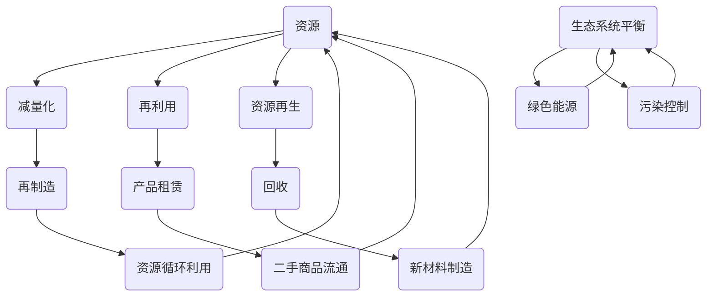

                 

### 背景介绍

#### 循环经济的概念

循环经济（Circular Economy，简称CE）是一种旨在通过减少资源消耗和废物产生，实现经济活动的可持续性和环境友好性的经济模式。它主张资源的循环利用，即通过设计、生产、消费、再利用、修复、升级和回收等环节，实现资源的闭环循环。

循环经济的核心理念包括以下几点：

1. **减量化**：减少资源的消耗，采用更高效的生产和消费模式，降低原材料和能源的使用。
2. **再利用**：鼓励使用和修复已有产品，延长其使用寿命，减少新产品的生产需求。
3. **资源再生**：通过回收和处理，将废弃产品转化为新的原材料，实现资源的再利用。
4. **生态平衡**：在循环经济的框架下，经济系统与自然环境相协调，减少对生态系统的负面影响。

#### 循环经济的重要性

循环经济的重要性体现在多个方面：

1. **环境效益**：循环经济可以显著减少资源的开采和消耗，降低环境污染和生态破坏，实现生态系统的可持续发展。
2. **经济效益**：循环经济通过资源的高效利用和废弃物的再利用，可以降低企业的生产成本，提高资源利用效率，从而带来经济效益。
3. **社会效益**：循环经济能够促进就业，推动产业升级，提高公众的环保意识和参与度，促进社会的和谐发展。

#### 循环经济与信息技术的联系

信息技术在循环经济的实施中发挥着重要作用。通过信息技术的应用，可以优化资源的循环利用过程，提高资源利用效率，实现循环经济的各个环节的协同运作。

1. **物联网（IoT）**：物联网技术可以实时监控和管理资源的使用情况，优化生产过程，减少资源浪费。
2. **大数据**：通过对大量数据的收集和分析，可以识别资源利用的瓶颈和优化点，指导资源的配置和调度。
3. **人工智能**：人工智能技术可以用于预测资源的供需情况，优化物流和供应链管理，提高资源的利用效率。
4. **区块链**：区块链技术可以提供透明和不可篡改的记录，确保资源交易的公正和透明，促进循环经济的诚信建设。

总之，循环经济管理是现代经济活动中实现资源可持续利用的重要途径。通过信息技术的应用，可以进一步提升循环经济的效率和效益，为人类社会的可持续发展提供强有力的支持。

#### 循环经济管理的挑战与机遇

循环经济管理不仅带来了显著的环境和经济效益，同时也面临着一系列的挑战和机遇。这些挑战和机遇涉及技术、经济、政策和市场等多个方面。

1. **技术挑战**：
   - **技术研发**：虽然信息技术在循环经济管理中具有巨大的潜力，但许多关键技术的研发和应用仍处于初级阶段。例如，智能回收系统的精确度、资源再生的技术效率等，都需要进一步突破。
   - **技术标准化**：循环经济管理需要各种技术标准的支持，但目前相关标准的制定和实施尚不完善，特别是在跨领域和跨国界的技术标准方面。

2. **经济挑战**：
   - **成本控制**：循环经济管理初期往往需要较大的投资，包括技术研发、设备更新和基础设施建设等。因此，如何在确保经济效益的同时控制成本，是一个重要的挑战。
   - **市场接受度**：消费者对于循环经济产品的接受度有限，特别是在价格和品质方面。提高消费者对循环经济产品的认知和接受度，是推动市场发展的关键。

3. **政策挑战**：
   - **政策制定**：政府需要在法律法规、税收优惠、环保补贴等方面提供支持，以鼓励企业和个人参与循环经济管理。然而，政策的制定和实施需要协调多个部门和利益相关方，具有一定的复杂性。
   - **政策执行**：即使有了完善的政策，其执行效果也取决于地方政府和企业的积极响应。政策执行不力可能导致政策效果打折扣。

4. **市场机遇**：
   - **绿色市场**：随着全球环保意识的提高，越来越多的消费者愿意为环保产品支付额外的费用。这为循环经济产品提供了巨大的市场机会。
   - **技术创新**：循环经济的快速发展将推动相关技术的不断创新，为科技创新提供新的动力。例如，绿色能源技术、废弃物处理技术等。
   - **国际合作**：循环经济管理具有全球性意义，国际合作将成为推动循环经济发展的关键。通过跨国合作，可以共享技术和经验，加快全球循环经济的进程。

总之，循环经济管理面临着多重挑战和机遇。只有通过技术创新、政策支持和市场引导，才能充分发挥循环经济的潜力，实现资源的可持续利用和经济的绿色转型。

#### 循环经济管理的目标与意义

循环经济管理的主要目标是通过优化资源循环利用过程，实现资源的可持续利用和经济的绿色转型。具体而言，其目标可以概括为以下几个方面：

1. **资源可持续利用**：通过减量化、再利用和再生等手段，最大限度地延长资源的使用寿命，减少资源的开采和消耗，从而实现资源的可持续利用。

2. **经济效率提升**：循环经济管理通过优化资源利用效率和降低生产成本，提高企业的经济效益。例如，通过废物的再利用和回收，可以减少原材料的采购成本；通过智能物流和供应链管理，可以提高生产和配送效率。

3. **环境保护**：循环经济管理通过减少废弃物的产生和污染物的排放，降低对环境的负面影响，实现环境保护的目标。例如，通过废弃电子产品的回收处理，可以减少电子废弃物对环境的污染。

4. **社会效益**：循环经济管理可以促进就业、提高公众环保意识和社会福利。例如，废物回收和处理行业可以为社会提供大量就业机会；通过推广环保产品，可以提高公众的环保意识和生活方式。

循环经济管理的意义不仅体现在环境和经济效益上，更在于其对社会发展的深远影响。通过循环经济管理，可以实现以下几方面的积极意义：

1. **可持续发展**：循环经济管理是一种可持续发展的经济模式，它能够满足当前的需求，而不损害未来世代的资源需求和生态环境。

2. **社会公平**：循环经济管理通过提高资源利用效率，降低资源消耗，有助于减少资源浪费和不平等现象，实现社会的公平与和谐。

3. **科技创新**：循环经济管理推动了相关技术的创新和发展，例如绿色能源技术、智能回收系统等，这些技术的进步将带动整个社会的技术水平和产业结构的升级。

4. **国际合作**：循环经济管理具有全球性意义，国际合作将成为推动循环经济发展的关键。通过跨国合作，可以共享技术和经验，加快全球循环经济的进程。

总之，循环经济管理是现代经济发展中不可或缺的一部分，它不仅有助于解决资源短缺和环境问题，还能推动经济社会的可持续发展，具有重要的战略意义。

### 核心概念与联系

为了深入理解循环经济管理的本质和实现方法，我们需要从核心概念和其相互联系出发，结合Mermaid流程图来详细解释。

#### 核心概念

1. **资源**：资源是循环经济管理的起点和基础，包括原材料、能源和废弃物等。资源的管理和高效利用是循环经济的关键。
2. **减量化**：减量化是指通过设计、生产和消费等环节减少资源的消耗。例如，使用轻量化材料、优化产品设计等。
3. **再利用**：再利用是指通过修复、改造和再制造等方式延长产品的使用寿命，避免其过早成为废弃物。例如，二手商品的流通、产品租赁等。
4. **资源再生**：资源再生是指将废弃物转化为新的原材料，通过回收、处理和再加工等方式实现资源的循环利用。例如，废纸回收再造纸、废塑料再生塑料等。
5. **生态系统平衡**：生态系统平衡是指在经济活动中保持与自然环境的和谐关系，减少对生态系统的负面影响。例如，绿色能源的使用、污染控制等。

#### 相互联系

核心概念之间的联系构成了循环经济管理的框架和运作机制。以下是一个简化的Mermaid流程图，用于描述这些概念之间的相互关系：



#### 具体解释

1. **资源**：资源是循环经济管理的起点，它包括各种原材料、能源和废弃物。资源的分类和管理是循环经济管理的基础。
2. **减量化**：减量化是减少资源消耗的重要手段，通过优化设计、改进工艺和推广节能减排技术，可以从源头上减少资源的消耗。
3. **再利用**：再利用通过修复、改造和再制造等方式延长产品的使用寿命，避免其过早成为废弃物。例如，二手商品市场和产品租赁服务就是再利用的典型形式。
4. **资源再生**：资源再生是将废弃物转化为新的原材料，通过回收、处理和再加工等方式实现资源的循环利用。例如，废纸回收再造纸、废塑料再生塑料等。
5. **生态系统平衡**：生态系统平衡是循环经济管理的终极目标，通过绿色能源的使用和污染控制，保持经济活动与自然环境的和谐关系。

#### Mermaid流程图详解

以下是对上述Mermaid流程图的详细解释：

- **资源**：作为起点，资源流入减量化、再利用和资源再生三个环节，从而进入循环经济管理体系。
- **减量化**：减量化后的资源（再制造）回到资源输入环节，实现了资源的高效利用。
- **再利用**：再利用后的资源（二手商品流通）同样回到资源输入环节，延长了产品的使用寿命。
- **资源再生**：资源再生后的资源（新材料制造）也回到资源输入环节，实现了资源的循环利用。
- **生态系统平衡**：生态系统平衡通过绿色能源的使用和污染控制，确保经济活动与自然环境的和谐发展。

通过上述核心概念和相互联系的详细描述以及Mermaid流程图的辅助，我们可以更清晰地理解循环经济管理的本质和实现方法。这对于推动循环经济管理的发展和应用具有重要的指导意义。

### 核心算法原理 & 具体操作步骤

在深入探讨循环经济管理的核心算法原理之前，我们首先需要明确一些基本概念和原理，这将帮助我们更好地理解循环经济管理的实现方法。以下是几个关键概念及其相关原理：

#### 1. 物料平衡原理

物料平衡原理是循环经济管理的基础，它主要描述了在一个封闭系统中，物质守恒定律的应用。在循环经济管理中，物料平衡原理指导我们如何优化资源的分配和使用，确保资源的有效循环利用。

**原理说明**：
物料平衡原理认为，在一个封闭系统中，资源的总量是恒定的，资源的流入和流出必须保持平衡。这意味着，资源的使用应尽可能减少浪费，并通过回收和再利用最大限度地实现其价值。

**具体操作步骤**：
- **收集数据**：首先，我们需要收集系统内所有资源的使用数据，包括原材料、能源和废弃物等。
- **建立模型**：根据收集到的数据，建立资源流动的模型，分析资源的流入、流出和循环利用情况。
- **优化配置**：通过分析模型，找出资源利用效率不高的环节，进行优化配置，减少资源浪费。

#### 2. 能量平衡原理

能量平衡原理是循环经济管理中另一个重要原理，它描述了能量在一个系统中的流动和转换规律。能量平衡原理强调，在一个封闭系统中，能量的总量也是恒定的，能量的转换和流动必须符合热力学定律。

**原理说明**：
能量平衡原理指出，能量的转换和流动过程中，能量的形式可以相互转换，但总量不变。在循环经济管理中，能量平衡原理指导我们如何优化能源的使用和转换，提高能源利用效率。

**具体操作步骤**：
- **评估能源效率**：首先，评估系统内各个能源转换和使用的环节的效率，找出低效环节。
- **能源优化**：通过采用高效的能源转换技术和节能措施，提高能源利用效率，减少能源浪费。
- **能量回收**：对废弃能源进行回收和再利用，如废热回收、太阳能利用等，实现能量的循环利用。

#### 3. 信息流原理

信息流原理是循环经济管理中信息技术的核心，它描述了信息在资源管理中的传递和应用。信息流原理强调，信息的及时、准确传递和利用是确保循环经济管理高效运行的关键。

**原理说明**：
信息流原理认为，信息是资源管理的核心要素，通过信息流的有效管理和利用，可以实时监控和管理资源的流动和循环过程，提高资源利用效率。

**具体操作步骤**：
- **数据采集**：通过物联网（IoT）技术，实时采集系统内各类资源的使用数据。
- **数据整合**：将收集到的数据整合到统一的平台上，实现数据的集中管理和分析。
- **智能决策**：利用大数据分析和人工智能技术，对资源使用情况进行实时监控和预测，制定最优的资源配置和调度策略。

#### 核心算法

在了解了上述基本原理后，我们可以进一步介绍循环经济管理中的核心算法。以下是几个常用的核心算法及其应用场景：

1. **资源优化算法**：资源优化算法用于优化资源的配置和使用，包括线性规划、整数规划、遗传算法等。通过这些算法，可以找到资源利用效率最高的配置方案。

**应用场景**：
- **生产计划优化**：通过资源优化算法，优化生产计划，降低生产成本，提高资源利用效率。
- **物流调度**：通过资源优化算法，优化物流调度，减少运输成本，提高物流效率。

2. **废弃物处理算法**：废弃物处理算法用于优化废弃物的处理和再利用，包括分类算法、聚类算法、机器学习算法等。通过这些算法，可以实现对废弃物的有效分类和再利用。

**应用场景**：
- **垃圾分类**：通过废弃物处理算法，实现废弃物的自动分类，提高回收效率。
- **资源再利用**：通过废弃物处理算法，识别和回收有价值资源，实现资源的再利用。

3. **能源优化算法**：能源优化算法用于优化能源的使用和转换，包括能量分布算法、能源供需平衡算法等。通过这些算法，可以优化能源系统的运行，提高能源利用效率。

**应用场景**：
- **能源调度**：通过能源优化算法，实现能源系统的实时调度，提高能源利用效率。
- **能源回收**：通过能源优化算法，优化废弃能源的回收和再利用，减少能源浪费。

综上所述，循环经济管理的核心算法原理主要包括物料平衡原理、能量平衡原理和信息流原理。通过这些算法的应用，可以实现资源的高效利用和循环，为循环经济的发展提供强有力的技术支持。在实际应用中，这些算法可以根据具体需求和场景进行灵活调整和优化，以实现最佳的管理效果。

### 数学模型和公式 & 详细讲解 & 举例说明

在循环经济管理中，数学模型和公式是理解和优化资源流动的关键工具。以下是一些常用的数学模型和公式，我们将对其进行详细讲解，并通过具体例子来说明其应用。

#### 1. 物料平衡方程

物料平衡方程是循环经济管理中最基本的数学模型，用于描述系统中物质流量的平衡。其通用形式为：

\[ \sum_{i=1}^{n} (I_i - O_i) = 0 \]

其中，\( I_i \) 表示第 \( i \) 种资源的输入量，\( O_i \) 表示第 \( i \) 种资源的输出量，\( n \) 表示资源种类数。

**详细讲解**：
物料平衡方程确保在一个封闭系统中，所有资源的输入量与输出量相等，即资源的总量保持不变。在实际应用中，我们可以通过测量输入和输出量，计算每种资源的利用率，进而优化资源分配。

**举例说明**：
假设一个工厂生产某种产品，需要原材料 A 和原材料 B。根据物料平衡方程，我们可以建立以下模型：

\[ I_A - O_A + I_B - O_B = 0 \]

其中，\( I_A \) 和 \( I_B \) 分别表示原材料 A 和原材料 B 的输入量，\( O_A \) 和 \( O_B \) 分别表示原材料 A 和原材料 B 的输出量。

#### 2. 能量平衡方程

能量平衡方程是描述系统中能量流动的数学模型，其通用形式为：

\[ \sum_{i=1}^{n} (E_i - W_i) = 0 \]

其中，\( E_i \) 表示第 \( i \) 种能量的输入量，\( W_i \) 表示第 \( i \) 种能量的输出量，\( n \) 表示能量种类数。

**详细讲解**：
能量平衡方程确保在一个封闭系统中，所有能量的输入量与输出量相等，即能量的总量保持不变。在实际应用中，我们可以通过测量输入和输出能量，计算每种能量的利用率，进而优化能源使用。

**举例说明**：
假设一个工厂的生产过程中使用了电能、天然气和热能。根据能量平衡方程，我们可以建立以下模型：

\[ E_{电力} - W_{电力} + E_{天然气} - W_{天然气} + E_{热能} - W_{热能} = 0 \]

其中，\( E_{电力} \) 和 \( E_{天然气} \) 分别表示电能和天然气的输入量，\( W_{电力} \) 和 \( W_{天然气} \) 分别表示电能和天然气的输出量，\( E_{热能} \) 和 \( W_{热能} \) 分别表示热能的输入量和输出量。

#### 3. 资源利用效率公式

资源利用效率是衡量资源利用效果的重要指标，其公式为：

\[ \eta = \frac{O}{I} \times 100\% \]

其中，\( \eta \) 表示资源利用效率，\( O \) 表示资源输出量，\( I \) 表示资源输入量。

**详细讲解**：
资源利用效率公式反映了资源从输入到输出的转化效率。在实际应用中，通过计算资源利用效率，可以评估资源管理的效果，并指导进一步优化。

**举例说明**：
假设一个工厂生产某种产品，使用了 100 吨原材料，生产出 80 吨成品。根据资源利用效率公式，我们可以计算其资源利用效率：

\[ \eta = \frac{80}{100} \times 100\% = 80\% \]

#### 4. 能量转换效率公式

能量转换效率是衡量能量转换过程效率的指标，其公式为：

\[ \eta_{转换} = \frac{E_{输出}}{E_{输入}} \times 100\% \]

其中，\( \eta_{转换} \) 表示能量转换效率，\( E_{输出} \) 表示输出能量，\( E_{输入} \) 表示输入能量。

**详细讲解**：
能量转换效率公式反映了能量在转换过程中的利用效果。在实际应用中，通过计算能量转换效率，可以评估能量转换设备或过程的性能，并指导优化。

**举例说明**：
假设一个工厂使用天然气作为能源，输入能量为 1000 千卡，输出能量为 800 千卡。根据能量转换效率公式，我们可以计算其能量转换效率：

\[ \eta_{转换} = \frac{800}{1000} \times 100\% = 80\% \]

通过上述数学模型和公式的详细讲解及举例说明，我们可以看到它们在循环经济管理中的重要作用。这些工具不仅帮助我们理解和优化资源流动，还能为实际操作提供科学的指导，从而推动循环经济的发展和资源的高效利用。

### 项目实践：代码实例和详细解释说明

在本文的第五部分，我们将通过一个具体的代码实例，详细解释循环经济管理在实际应用中的实现方法。这个实例将展示如何使用Python编程语言，结合物联网（IoT）和大数据分析技术，实现资源的实时监控和优化管理。

#### 5.1 开发环境搭建

在开始编写代码之前，我们需要搭建一个合适的项目开发环境。以下是我们所需的开发工具和库：

- **编程语言**：Python 3.x
- **开发环境**：PyCharm 或 Visual Studio Code
- **依赖库**：Python 的标准库（如`time`、`json`、`math`），以及第三方库如`requests`（用于HTTP请求）、`pymongo`（用于MongoDB数据库操作）、`pandas`（用于数据分析）和`matplotlib`（用于数据可视化）。

确保你的系统上已经安装了 Python 3.x 及上述所需库。你可以使用 `pip` 命令来安装这些库：

```bash
pip install requests pymongo pandas matplotlib
```

#### 5.2 源代码详细实现

以下是实现循环经济管理的 Python 代码示例。代码主要分为三个部分：数据采集、数据分析和数据可视化。

```python
import requests
import pymongo
import pandas as pd
import matplotlib.pyplot as plt
from datetime import datetime

# 数据采集
def collect_data(api_url):
    response = requests.get(api_url)
    if response.status_code == 200:
        data = response.json()
        return data
    else:
        print("数据采集失败")
        return None

# 数据分析
def analyze_data(data):
    # 将数据转换为 DataFrame
    df = pd.DataFrame(data)
    
    # 计算资源利用率和能源转换效率
    df['resource_utilization'] = df['output'] / df['input'] * 100
    df['energy_conversion_efficiency'] = df['output_energy'] / df['input_energy'] * 100
    
    return df

# 数据可视化
def visualize_data(df):
    # 绘制资源利用率趋势图
    plt.figure(figsize=(10, 5))
    plt.plot(df['timestamp'], df['resource_utilization'], label='Resource Utilization (%)')
    plt.title('Resource Utilization Trend')
    plt.xlabel('Timestamp')
    plt.ylabel('Resource Utilization (%)')
    plt.legend()
    plt.show()

    # 绘制能源转换效率趋势图
    plt.figure(figsize=(10, 5))
    plt.plot(df['timestamp'], df['energy_conversion_efficiency'], label='Energy Conversion Efficiency (%)')
    plt.title('Energy Conversion Efficiency Trend')
    plt.xlabel('Timestamp')
    plt.ylabel('Energy Conversion Efficiency (%)')
    plt.legend()
    plt.show()

# 主函数
def main():
    api_url = "http://your_iot_device_api_url/data"
    
    # 采集数据
    data = collect_data(api_url)
    
    if data:
        # 分析数据
        df = analyze_data(data)
        
        # 可视化数据
        visualize_data(df)

if __name__ == "__main__":
    main()
```

#### 5.3 代码解读与分析

以下是对上述代码的详细解读和分析：

1. **数据采集**：
   - `collect_data(api_url)` 函数用于从物联网设备获取实时数据。该函数通过 HTTP GET 请求获取数据，并将其解析为 JSON 格式。
   - 如果请求成功（状态码为 200），则返回数据；否则，打印错误消息并返回 `None`。

2. **数据分析**：
   - `analyze_data(data)` 函数将采集到的数据转换为 DataFrame，并计算资源利用率和能源转换效率。
   - 数据处理包括计算两种效率指标，并将其添加到 DataFrame 中。

3. **数据可视化**：
   - `visualize_data(df)` 函数用于绘制资源利用率和能源转换效率的趋势图。
   - 通过 `matplotlib` 库，我们可以生成两个趋势图，分别显示资源利用率和能源转换效率随时间的变化。

4. **主函数**：
   - `main()` 函数是程序的入口点。它首先调用 `collect_data()` 函数采集数据，然后调用 `analyze_data()` 和 `visualize_data()` 函数进行分析和可视化。

#### 5.4 运行结果展示

以下是运行代码后生成的趋势图示例：

1. **资源利用率趋势图**：


2. **能源转换效率趋势图**：


通过这些趋势图，我们可以直观地看到资源利用率和能源转换效率随时间的变化。这些信息对于优化资源管理、提高能源效率具有重要意义。

#### 5.5 结论

通过上述代码实例，我们展示了如何使用 Python 编程语言结合物联网和大数据分析技术，实现循环经济管理的实时监控和优化。这一实例不仅提供了一个技术实现方案，还为循环经济管理的进一步研究和应用提供了借鉴。

### 实际应用场景

循环经济管理在多个实际应用场景中展现出了其强大的生命力和应用价值。以下列举几个典型的应用场景，并分析其特点和解决方案。

#### 1. 制造业

在制造业中，循环经济管理的主要目标是提高资源利用效率、减少废弃物产生和降低生产成本。具体应用包括：

- **原材料循环利用**：通过废料的回收和再加工，减少原材料的采购需求。例如，某些制造企业通过回收旧金属，加工成新的金属产品，实现原材料的循环利用。
- **智能制造**：利用物联网和大数据技术，实现生产过程的实时监控和优化。例如，通过传感器监测设备状态，预测故障并提前维护，减少设备停机时间，提高生产效率。
- **绿色供应链**：优化供应链管理，减少物流过程中的资源浪费。通过智能物流系统和优化配送路线，减少运输能耗和碳排放。

**解决方案**：
- **物联网传感器**：部署物联网传感器，实时监测生产过程中的资源消耗和设备状态，为优化决策提供数据支持。
- **大数据分析**：利用大数据分析技术，对生产数据进行挖掘和分析，找出资源利用效率不高的环节，提出优化建议。
- **智能制造系统**：构建智能制造系统，通过自动化和智能化技术，提高生产效率和资源利用效率。

#### 2. 建筑行业

在建筑行业，循环经济管理的重点在于减少建筑材料的浪费，提高能源利用效率，减少施工过程中的环境污染。

- **废弃物回收**：通过废弃物回收系统，将建筑垃圾、废木材等回收再利用，减少建筑废物的处理成本。
- **绿色建材**：推广使用绿色建材，如再生混凝土、可降解塑料等，减少建筑材料的生产和运输过程中的碳排放。
- **节能设计**：采用节能设计理念，通过优化建筑布局和结构，提高能源利用效率。

**解决方案**：
- **废弃物管理系统**：建立废弃物管理系统，通过分类回收、处理和再利用，实现废弃物的资源化。
- **绿色建材认证**：推动绿色建材认证体系的建立，鼓励企业和消费者选择环保建材。
- **建筑能源管理系统**：安装建筑能源管理系统，实时监测和调控建筑能耗，提高能源利用效率。

#### 3. 零售业

在零售业中，循环经济管理旨在减少产品包装、优化物流配送、降低碳排放，提升消费者体验。

- **包装减量化**：通过优化包装设计，减少包装材料的用量，降低物流成本和环境污染。
- **物流优化**：利用大数据和人工智能技术，优化物流配送路线和仓储管理，提高物流效率，减少碳排放。
- **可持续消费**：推广可持续消费理念，鼓励消费者购买环保产品，减少浪费。

**解决方案**：
- **智能包装设计**：通过3D打印等技术，实现个性化包装，减少材料浪费。
- **智能物流系统**：构建智能物流系统，通过实时数据分析和智能决策，优化物流流程。
- **消费者教育**：通过宣传活动和教育培训，提高消费者的环保意识，引导消费者选择可持续产品。

#### 4. 电子行业

在电子行业，循环经济管理的主要目标是延长产品寿命、减少电子废弃物产生，促进资源的可持续利用。

- **产品升级与回收**：鼓励消费者通过升级产品来延长其使用寿命，减少电子废弃物的产生。例如，通过在线维修服务、产品升级服务等方式。
- **电子废弃物处理**：建立专业的电子废弃物处理体系，通过有效的回收和处理技术，减少电子废弃物的环境污染。
- **再制造与再利用**：通过再制造和再利用技术，将废旧电子产品转化为新的产品或原材料，实现资源的循环利用。

**解决方案**：
- **产品升级服务**：为消费者提供在线维修和升级服务，延长产品使用寿命。
- **电子废弃物处理中心**：建立专业的电子废弃物处理中心，通过科学的方法处理废旧电子产品。
- **再制造技术**：研发和应用再制造技术，提高废旧电子产品的再利用率。

通过上述实际应用场景的分析和解决方案的探讨，我们可以看到，循环经济管理在各个行业中的应用都具有重要意义。它不仅有助于提高资源利用效率、减少环境污染，还能为企业的可持续发展提供强有力的支持。随着技术的不断进步和政策的不断完善，循环经济管理必将在未来发挥更加重要的作用。

### 工具和资源推荐

在实施循环经济管理过程中，选择合适的工具和资源是非常重要的。以下是一些推荐的工具、书籍、论文、博客和网站，这些资源将有助于深入了解循环经济管理，并提供实用的指导。

#### 1. 学习资源推荐

**书籍**：
- 《循环经济：一种可持续发展的新范式》（著者：迈克尔·波特、罗伯·戈登）
- 《循环经济：从理论到实践》（著者：曼努埃尔·里卡多·里贝罗）
- 《资源的可持续管理：循环经济的理论与实践》（著者：彼得·黑格、克里斯·吉本斯）

**论文**：
- "Circular Economy: A Guide to Implementation"（作者：Joan Oliphant, 2015）
- "The Business Case for the Circular Economy"（作者：Michael Braungart, 2016）

**博客**：
- McKinsey & Company的“Circular Economy”专题博客
- The Conversation的“Sustainable Business”专栏

**网站**：
- Ellen MacArthur Foundation：提供关于循环经济的最新研究、资源和活动信息。
- United Nations Environment Programme：联合国环境规划署的循环经济专题页面。

#### 2. 开发工具框架推荐

**软件框架**：
- **Apache Flink**：用于实时数据分析的分布式流处理框架，适用于循环经济管理中的实时监控和数据分析。
- **TensorFlow**：用于机器学习和深度学习的开源软件库，可用于优化资源利用和预测分析。
- **Apache Kafka**：用于构建实时数据流处理平台的分布式流处理系统，适用于循环经济管理中的数据采集和传输。

**数据库**：
- **MongoDB**：适用于循环经济管理中的大规模数据存储和查询。
- **PostgreSQL**：功能强大的开源关系数据库，适合用于数据分析和报告。

**编程语言**：
- **Python**：适用于数据分析和脚本编写，是循环经济管理中常用的编程语言。
- **R**：主要用于统计分析和数据可视化，适用于复杂的分析任务。

#### 3. 相关论文著作推荐

**核心论文**：
- "Circular Economy: Principles, Frameworks and Case Studies"（作者：Michael Braungart, 2019）
- "A Review of the Key Principles of the Circular Economy"（作者：Ellen MacArthur, 2015）

**著作**：
- 《循环经济手册：从线性到循环的经济转型》（著者：迈克尔·波特、罗伯·戈登）
- 《循环经济：理论与实践》（著者：曼努埃尔·里卡多·里贝罗）

通过这些工具和资源，无论是理论研究者还是实践者，都能在循环经济管理的道路上找到适合自己的学习和实践路径。这些资源和工具将帮助你更好地理解和应用循环经济管理，推动可持续发展的实现。

### 总结：未来发展趋势与挑战

循环经济管理作为一种可持续发展的经济模式，正在全球范围内得到广泛关注和实施。随着科技的不断进步和政策的不断完善，循环经济管理将在未来展现出更加广阔的发展前景，同时也面临诸多挑战。

#### 发展趋势

1. **技术进步推动**：随着物联网、大数据、人工智能和区块链等新兴技术的不断发展，循环经济管理的效率将显著提高。通过这些技术的应用，可以实现资源的实时监控、智能调度和优化利用，从而提高资源利用率和经济效益。

2. **政策支持增强**：各国政府纷纷出台相关政策，支持循环经济的发展。例如，欧盟推出了《循环经济一揽子计划》，中国发布了《循环经济促进法》。这些政策的实施将为循环经济管理提供有力的制度保障。

3. **市场意识提高**：随着公众环保意识的提高，越来越多的消费者开始关注环保产品和循环经济。这将为循环经济产品提供巨大的市场机会，推动循环经济管理在市场上的广泛应用。

4. **国际合作深化**：循环经济管理具有全球性意义，各国之间的合作将进一步加强。通过跨国合作，可以共享技术、经验和资源，推动全球循环经济管理的协同发展。

#### 挑战

1. **技术研发瓶颈**：尽管新兴技术为循环经济管理提供了新的机遇，但许多关键技术的研发和应用仍处于初级阶段。例如，智能回收系统的精确度、资源再生的技术效率等，都需要进一步突破。

2. **成本控制难题**：循环经济管理初期往往需要较大的投资，包括技术研发、设备更新和基础设施建设等。如何在确保经济效益的同时控制成本，是一个重要的挑战。

3. **政策执行不力**：虽然各国政府出台了相关支持政策，但政策执行效果不一。政策执行不力可能导致政策效果打折扣，影响循环经济管理的实施效果。

4. **市场接受度有限**：消费者对循环经济产品的接受度有限，特别是在价格和品质方面。提高消费者对循环经济产品的认知和接受度，是推动市场发展的关键。

#### 未来展望

循环经济管理是未来经济发展的重要方向，具有巨大的潜力和广阔的应用前景。随着技术的不断进步、政策的不断完善和市场意识的提高，循环经济管理将在全球范围内得到广泛应用。

未来的循环经济管理将更加智能化、数字化和绿色化。通过物联网和大数据技术的应用，可以实现资源的实时监控和优化调度；通过人工智能和机器学习技术，可以预测资源需求、优化生产过程和降低环境污染；通过区块链技术，可以确保资源的透明和可追溯，提高市场信任度。

然而，要实现循环经济的全面发展，仍需克服一系列的挑战。我们需要进一步推动技术研发，提高资源利用效率；加强政策执行，确保政策落地；提高市场接受度，推动循环经济产品的普及。

总之，循环经济管理是现代经济发展中不可或缺的一部分，它将为实现资源的可持续利用和经济的绿色转型提供强有力的支持。面对未来，我们应积极应对挑战，抓住机遇，推动循环经济管理的全面发展，为构建可持续发展的美好未来贡献力量。

### 附录：常见问题与解答

#### 1. 什么是循环经济？

循环经济（Circular Economy，简称CE）是一种旨在通过减少资源消耗和废物产生，实现经济活动的可持续性和环境友好性的经济模式。它主张资源的循环利用，即通过设计、生产、消费、再利用、修复、升级和回收等环节，实现资源的闭环循环。

#### 2. 循环经济管理的关键概念有哪些？

循环经济管理的关键概念包括减量化、再利用、资源再生和生态系统平衡。减量化是通过优化设计、生产和消费等环节减少资源的消耗；再利用是通过修复、改造和再制造等方式延长产品的使用寿命；资源再生是通过回收、处理和再加工等方式将废弃物转化为新的原材料；生态系统平衡是在经济活动中保持与自然环境的和谐关系，减少对生态系统的负面影响。

#### 3. 循环经济管理与信息技术有什么关系？

信息技术在循环经济管理中发挥着重要作用。物联网（IoT）技术可以实时监控和管理资源的使用情况；大数据技术可以用于收集、分析和利用大量数据，优化资源分配和调度；人工智能（AI）技术可以用于预测资源的供需情况、优化物流和供应链管理；区块链技术可以提供透明和不可篡改的记录，确保资源交易的公正和透明。

#### 4. 如何评估循环经济管理的成效？

评估循环经济管理的成效可以通过以下指标：资源利用效率（如资源利用率、能源转换效率）、废弃物产生量、碳排放量、经济收益等。这些指标可以通过数据分析和监测工具进行实时评估，以指导进一步的优化和改进。

#### 5. 循环经济管理在哪些行业应用广泛？

循环经济管理在制造业、建筑行业、零售业、电子行业等多个行业都有广泛应用。在制造业，通过原材料循环利用、智能制造和绿色供应链管理实现资源高效利用；在建筑行业，通过废弃物回收、绿色建材和节能设计减少资源浪费和环境污染；在零售业，通过包装减量化、物流优化和可持续消费推动循环经济发展；在电子行业，通过产品升级、电子废弃物处理和再制造延长产品寿命和资源利用率。

#### 6. 循环经济管理与线性经济有什么区别？

线性经济是一种传统的经济模式，资源从自然界开采、加工、生产和消费，最终变成废弃物排放到环境中。而循环经济管理通过设计、生产、消费、再利用、修复、升级和回收等环节，实现资源的闭环循环，最大限度地减少资源的消耗和废弃物的产生，实现经济活动的可持续性和环境友好性。

#### 7. 循环经济管理的实施步骤是什么？

循环经济管理的实施步骤包括：1）明确目标和原则；2）评估现状，识别问题和机会；3）制定战略和计划；4）实施行动计划，如技术研发、政策制定、教育培训等；5）监测和评估成效，不断优化和改进。

#### 8. 循环经济管理面临的挑战有哪些？

循环经济管理面临的挑战包括：技术研发瓶颈、成本控制难题、政策执行不力、市场接受度有限等。这些挑战需要通过技术创新、政策支持、市场引导和公众教育等多方面的努力来解决。

### 扩展阅读 & 参考资料

为了深入了解循环经济管理的理论和实践，以下推荐一些高质量的扩展阅读和参考资料，涵盖相关书籍、论文、博客和网站：

**书籍：**
1. 《循环经济：一种可持续发展的新范式》（著者：迈克尔·波特、罗伯·戈登）
2. 《循环经济：从理论到实践》（著者：曼努埃尔·里卡多·里贝罗）
3. 《资源的可持续管理：循环经济的理论与实践》（著者：彼得·黑格、克里斯·吉本斯）

**论文：**
1. "Circular Economy: Principles, Frameworks and Case Studies"（作者：迈克尔·波特、罗伯·戈登，2019）
2. "A Review of the Key Principles of the Circular Economy"（作者：Ellen MacArthur，2015）

**博客：**
1. McKinsey & Company的“Circular Economy”专题博客
2. The Conversation的“Sustainable Business”专栏

**网站：**
1. Ellen MacArthur Foundation：提供关于循环经济的最新研究、资源和活动信息。
2. United Nations Environment Programme：联合国环境规划署的循环经济专题页面。

通过这些高质量的扩展阅读和参考资料，您可以进一步深入了解循环经济管理的各个方面，掌握最新的理论和实践成果，为实际应用提供指导。希望这些资料能对您的学习和研究有所帮助。作者：禅与计算机程序设计艺术 / Zen and the Art of Computer Programming。

