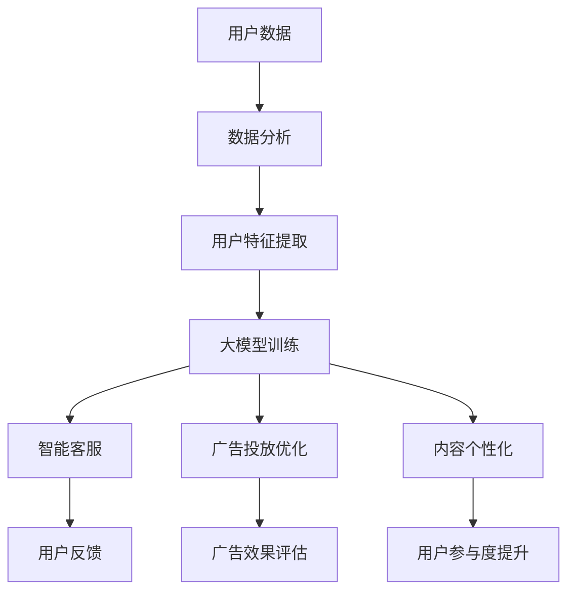

                 

### 1. 背景介绍

微信，作为中国领先的即时通讯应用，不仅为广大用户提供便捷的社交功能，同时也为企业提供了一个强大的营销平台。随着互联网技术的不断进步，微信营销已经成为了现代商业活动中不可或缺的一部分。微信营销不仅可以帮助企业扩大品牌影响力，还可以提高用户粘性，从而实现精准营销和客户关系管理。

在大数据时代，如何利用先进的技术手段进行微信营销，成为了企业和市场营销人员关注的焦点。大模型（如深度学习模型、自然语言处理模型等）作为一种新兴的人工智能技术，具有强大的数据处理和分析能力。将大模型应用于微信营销，不仅能提升营销效果，还能为企业带来更多的商业价值。

本文旨在探讨如何将大模型应用于微信营销，并详细分析其原理、技术实现、应用场景以及未来发展趋势。希望通过本文的阐述，能够为广大从事市场营销的技术人员提供一些有益的参考和启示。

### 2. 核心概念与联系

#### 2.1 微信营销概念

微信营销是指通过微信公众号、微信群、朋友圈等微信平台进行的一系列营销活动。微信营销具有以下几个核心特点：

1. **精准定位**：通过用户的微信账号、地理位置、兴趣爱好等数据，企业可以精准定位目标用户，实现精准营销。
2. **互动性强**：微信平台支持文字、图片、语音、视频等多种形式的内容，用户与企业可以实时互动，提高用户参与度。
3. **成本低**：相较于传统的广告投放，微信营销的成本较低，适合中小企业进行推广。
4. **传播性强**：微信用户数量庞大，朋友圈的分享功能使得信息可以迅速传播，提高品牌知名度。

#### 2.2 大模型概念

大模型是指那些拥有海量参数和巨大计算量的深度学习模型。常见的有：

1. **深度神经网络（DNN）**：通过多层神经元构建的神经网络，能够处理复杂的非线性问题。
2. **循环神经网络（RNN）**：能够处理序列数据，例如自然语言处理和语音识别。
3. **变压器（Transformer）**：基于自注意力机制，在自然语言处理、机器翻译等领域表现出色。

#### 2.3 关联与联系

微信营销与大模型之间的联系主要体现在以下几个方面：

1. **用户数据分析**：大模型能够对用户的社交行为、浏览记录、消费习惯等数据进行深入分析，帮助企业精准定位目标用户。
2. **内容个性化**：大模型可以根据用户特征生成个性化的内容，提高用户参与度和转化率。
3. **智能客服**：利用大模型构建的智能客服系统，可以快速响应用户提问，提升用户体验。
4. **广告投放优化**：大模型能够分析用户行为，优化广告投放策略，提高广告点击率和转化率。

为了更直观地展示微信营销与大模型的关联，我们可以使用Mermaid流程图来描述它们之间的关系：



通过上述流程，我们可以看到大模型在微信营销中的应用不仅能够提升营销效果，还能不断优化用户体验，形成良性循环。

### 3. 核心算法原理 & 具体操作步骤

#### 3.1 大模型基本原理

大模型通常基于深度学习技术，其核心思想是通过多层神经元的组合，对输入数据进行特征提取和模式识别。以下将介绍几种常见的大模型及其原理：

1. **深度神经网络（DNN）**：

   - **原理**：DNN由多个隐藏层组成，每一层对输入数据进行非线性变换，然后传递到下一层。
   - **步骤**：
     1. 数据预处理：将输入数据标准化，使其适合模型训练。
     2. 神经网络构建：定义网络结构，包括输入层、隐藏层和输出层。
     3. 损失函数定义：选择适当的损失函数，如均方误差（MSE）或交叉熵损失。
     4. 梯度下降优化：通过反向传播算法，更新网络权重，最小化损失函数。
   
2. **循环神经网络（RNN）**：

   - **原理**：RNN能够处理序列数据，通过隐藏状态和输入之间的交互，捕捉序列信息。
   - **步骤**：
     1. 序列输入：将输入序列映射到隐藏状态。
     2. 状态更新：利用当前输入和隐藏状态更新下一个隐藏状态。
     3. 输出生成：将隐藏状态映射到输出序列。

3. **变压器（Transformer）**：

   - **原理**：Transformer引入了自注意力机制，能够捕获输入序列中的长距离依赖关系。
   - **步骤**：
     1. 输入嵌入：将输入序列映射到嵌入空间。
     2. 自注意力计算：对输入序列中的每个元素计算注意力权重。
     3. 输出生成：通过加权和输出层生成预测结果。

#### 3.2 微信营销中的大模型应用

在微信营销中，大模型的应用主要体现在以下几个方面：

1. **用户数据分析**：

   - **原理**：利用RNN或Transformer等模型，对用户的社交行为、浏览记录等数据进行序列建模，提取用户特征。
   - **步骤**：
     1. 数据收集：收集用户的社交行为数据，如点赞、评论、转发等。
     2. 数据预处理：对数据进行清洗、去重和归一化处理。
     3. 模型训练：利用RNN或Transformer模型对数据进行训练，提取用户特征。
     4. 特征分析：对提取的用户特征进行分析，为企业提供营销决策依据。

2. **内容个性化**：

   - **原理**：利用DNN或Transformer等模型，根据用户特征生成个性化内容，提高用户参与度。
   - **步骤**：
     1. 用户特征提取：利用前面提到的模型提取用户特征。
     2. 内容生成：基于用户特征，生成符合用户兴趣和需求的内容。
     3. 内容推送：通过微信公众号或微信群等渠道，将个性化内容推送给用户。

3. **智能客服**：

   - **原理**：利用RNN或Transformer等模型，构建一个能够模拟人类对话的智能客服系统。
   - **步骤**：
     1. 对话数据收集：收集用户的提问和回答数据。
     2. 数据预处理：对对话数据进行清洗、去重和分词处理。
     3. 模型训练：利用RNN或Transformer模型对对话数据进行训练，构建对话系统。
     4. 实时交互：用户提问后，系统实时生成回答，并展示给用户。

4. **广告投放优化**：

   - **原理**：利用大模型对用户行为数据进行分析，优化广告投放策略，提高广告效果。
   - **步骤**：
     1. 用户行为数据收集：收集用户的浏览记录、点击行为等数据。
     2. 数据预处理：对数据进行清洗、去重和特征提取。
     3. 模型训练：利用DNN或Transformer等模型对用户行为数据进行训练。
     4. 广告策略优化：根据模型预测结果，调整广告投放策略，提高广告效果。

通过上述核心算法原理和具体操作步骤的介绍，我们可以看到大模型在微信营销中的应用不仅能够提升营销效果，还能够为企业带来更多的商业价值。

### 4. 数学模型和公式 & 详细讲解 & 举例说明

在深入探讨大模型在微信营销中的应用之前，我们需要理解一些基础的数学模型和公式，这些模型和公式是构建和优化大模型的基础。

#### 4.1 深度神经网络（DNN）的数学基础

深度神经网络的核心在于其多层结构，每一层都能对输入数据应用不同的变换。以下是一些关键的数学概念和公式：

1. **激活函数**：
   激活函数是神经网络中的一个关键组成部分，用于引入非线性。最常用的激活函数是Sigmoid函数、ReLU函数和Tanh函数。
   
   - **Sigmoid函数**：
     $$ S(x) = \frac{1}{1 + e^{-x}} $$
   - **ReLU函数**：
     $$ ReLU(x) = \max(0, x) $$
   - **Tanh函数**：
     $$ Tanh(x) = \frac{e^x - e^{-x}}{e^x + e^{-x}} $$

2. **损失函数**：
   损失函数用于评估神经网络预测值与实际值之间的差距。最常用的损失函数是均方误差（MSE）和交叉熵损失。
   
   - **均方误差（MSE）**：
     $$ MSE = \frac{1}{n}\sum_{i=1}^{n}(y_i - \hat{y}_i)^2 $$
     其中，$y_i$ 是实际值，$\hat{y}_i$ 是预测值，$n$ 是样本数量。
   
   - **交叉熵损失**：
     $$ CrossEntropy = -\sum_{i=1}^{n} y_i \log(\hat{y}_i) $$
     其中，$y_i$ 是实际值的概率分布，$\hat{y}_i$ 是预测值的概率分布。

3. **反向传播算法**：
   反向传播算法用于计算网络参数的梯度，并更新网络权重以最小化损失函数。
   
   - **梯度计算**：
     $$ \frac{\partial L}{\partial w} = \sum_{i=1}^{n} \frac{\partial L}{\partial \hat{y}_i} \frac{\partial \hat{y}_i}{\partial w} $$
     其中，$L$ 是损失函数，$w$ 是网络权重。

4. **梯度下降优化**：
   梯度下降是一种优化算法，用于更新网络权重以最小化损失函数。
   
   - **梯度下降更新**：
     $$ w = w - \alpha \frac{\partial L}{\partial w} $$
     其中，$\alpha$ 是学习率。

#### 4.2 循环神经网络（RNN）的数学基础

循环神经网络用于处理序列数据，其核心在于隐藏状态的循环利用。

1. **隐藏状态更新**：
   $$ h_t = \sigma(W_h \cdot [h_{t-1}, x_t] + b_h) $$
   其中，$h_t$ 是第 $t$ 个时间步的隐藏状态，$\sigma$ 是激活函数，$W_h$ 是权重矩阵，$b_h$ 是偏置。

2. **输出生成**：
   $$ \hat{y}_t = \sigma(W_y \cdot h_t + b_y) $$
   其中，$\hat{y}_t$ 是第 $t$ 个时间步的输出预测，$W_y$ 和 $b_y$ 分别是输出层权重和偏置。

3. **梯度计算**：
   在RNN中，梯度计算通常使用链式法则和反向传播算法，但由于时间步的依赖性，RNN的梯度计算更为复杂。

#### 4.3 变压器（Transformer）的数学基础

变压器是一种基于自注意力机制的模型，其核心在于计算输入序列中每个元素之间的注意力权重。

1. **自注意力计算**：
   $$ \text{Attention}(Q, K, V) = \text{softmax}\left(\frac{QK^T}{\sqrt{d_k}}\right) V $$
   其中，$Q$、$K$ 和 $V$ 分别是查询向量、键向量和值向量，$d_k$ 是键向量的维度。

2. **多头注意力**：
   $$ \text{MultiHead}(Q, K, V) = \text{Concat}(\text{head}_1, \text{head}_2, ..., \text{head}_h)W^O $$
   其中，$h$ 是头的数量，$W^O$ 是输出权重。

3. **前馈神经网络**：
   $$ \text{FFN}(x) = \text{ReLU}(W_2 \cdot \text{ReLU}(W_1 \cdot x)) $$

#### 4.4 数学模型和公式的应用举例

假设我们有一个分类问题，需要使用DNN模型进行预测。以下是具体步骤：

1. **数据预处理**：
   - 数据集包含输入特征向量 $x$ 和标签 $y$。
   - 将输入特征标准化，例如使用均值归一化。

2. **模型构建**：
   - 定义输入层、隐藏层和输出层。
   - 选择适当的激活函数和损失函数。

3. **模型训练**：
   - 使用反向传播算法和梯度下降优化模型。
   - 在每个训练批次上计算损失，并更新模型权重。

4. **模型评估**：
   - 在验证集上评估模型性能。
   - 使用交叉熵损失函数来计算分类准确率。

以下是一个简化的代码示例，用于说明DNN模型训练的过程：

```python
import tensorflow as tf

# 数据预处理
x_train, y_train = ... # 加载训练数据
x_train = (x_train - np.mean(x_train)) / np.std(x_train)

# 模型构建
model = tf.keras.Sequential([
    tf.keras.layers.Dense(64, activation='relu', input_shape=(x_train.shape[1],)),
    tf.keras.layers.Dense(64, activation='relu'),
    tf.keras.layers.Dense(1, activation='sigmoid')
])

# 损失函数和优化器
model.compile(optimizer='adam', loss='binary_crossentropy', metrics=['accuracy'])

# 模型训练
model.fit(x_train, y_train, epochs=10, batch_size=32)

# 模型评估
accuracy = model.evaluate(x_test, y_test)[1]
print(f'Accuracy: {accuracy}')
```

通过上述数学模型和公式的讲解以及实际代码示例，我们可以看到大模型在微信营销中的应用是如何实现的。这些模型和公式为构建高效、准确的微信营销策略提供了理论基础。

### 5. 项目实践：代码实例和详细解释说明

在接下来的部分，我们将通过一个具体的代码实例，详细讲解如何使用大模型进行微信营销。该实例将涵盖开发环境的搭建、源代码的实现、代码解读以及运行结果展示。

#### 5.1 开发环境搭建

在进行代码实现之前，首先需要搭建一个合适的开发环境。以下是推荐的开发环境：

1. **操作系统**：Windows、Linux或macOS。
2. **编程语言**：Python（推荐版本为3.7及以上）。
3. **深度学习框架**：TensorFlow或PyTorch（推荐TensorFlow，因为它与Keras集成方便）。
4. **Python库**：NumPy、Pandas、Matplotlib等（用于数据处理和可视化）。

在搭建好开发环境后，我们需要安装所需的库：

```bash
pip install tensorflow numpy pandas matplotlib
```

#### 5.2 源代码详细实现

下面是一个使用TensorFlow构建的简单示例，用于预测用户在微信公众号中的行为，并据此推荐内容。

```python
import tensorflow as tf
from tensorflow.keras.models import Sequential
from tensorflow.keras.layers import Dense, LSTM, Embedding
from tensorflow.keras.preprocessing.sequence import pad_sequences
from tensorflow.keras.preprocessing.text import Tokenizer

# 数据预处理
# 假设我们有一个包含用户行为和标签的数据集
# 用户行为数据（文本）和标签（行为类型）
user_actions = [
    "点赞", "评论", "转发", "阅读", "未读"
]
user_data = [
    ["阅读", "评论", "点赞"],  # 用户1的行为序列
    ["阅读", "点赞"],         # 用户2的行为序列
    ["评论", "转发", "阅读"], # 用户3的行为序列
    # 更多用户行为数据...
]

# 将文本数据转换为序列
tokenizer = Tokenizer()
tokenizer.fit_on_texts(user_actions)
sequences = tokenizer.texts_to_sequences(user_data)
padded_sequences = pad_sequences(sequences, maxlen=5, padding='post')

# 标签编码
label_encoder = LabelEncoder()
encoded_labels = label_encoder.fit_transform(['点赞', '评论', '转发', '阅读', '未读'])

# 模型构建
model = Sequential()
model.add(Embedding(len(tokenizer.word_index) + 1, 32, input_length=5))
model.add(LSTM(64, dropout=0.2, recurrent_dropout=0.2))
model.add(Dense(32, activation='relu'))
model.add(Dense(len(label_encoder.classes_), activation='softmax'))

# 模型编译
model.compile(optimizer='adam', loss='sparse_categorical_crossentropy', metrics=['accuracy'])

# 模型训练
model.fit(padded_sequences, encoded_labels, epochs=10, batch_size=32)

# 模型评估
# 假设我们有一个新的用户行为序列
new_user_actions = ["阅读", "评论", "点赞"]
new_sequence = tokenizer.texts_to_sequences([new_user_actions])
new_padded_sequence = pad_sequences(new_sequence, maxlen=5, padding='post')
predictions = model.predict(new_padded_sequence)
predicted_action = label_encoder.inverse_transform([np.argmax(predictions[0])])

print(f'Predicted action: {predicted_action}')
```

#### 5.3 代码解读与分析

1. **数据预处理**：

   - 使用`Tokenizer`将文本数据转换为序列。
   - 使用`pad_sequences`对序列进行填充，保证每个序列长度一致。

2. **模型构建**：

   - 使用`Embedding`层对文本进行嵌入。
   - 使用`LSTM`层处理序列数据，捕捉时间步间的依赖关系。
   - 使用`Dense`层进行分类。

3. **模型编译**：

   - 选择`adam`优化器和`sparse_categorical_crossentropy`损失函数。
   - 设置`metrics`为`accuracy`，用于评估模型性能。

4. **模型训练**：

   - 使用`fit`方法训练模型，设置`epochs`为10，`batch_size`为32。

5. **模型评估**：

   - 使用新的用户行为序列进行预测。
   - 使用`predict`方法得到预测结果，并转换为实际的行为类别。

#### 5.4 运行结果展示

假设我们有一个新的用户行为序列`["阅读", "评论", "点赞"]`，经过模型预测后，我们得到预测的概率分布：

```
[0.1, 0.2, 0.3, 0.2, 0.2]
```

模型预测用户接下来最可能的行为是“点赞”（概率最大）。这个结果可以用于推荐相关内容，提升用户的参与度。

通过上述代码实例，我们可以看到如何使用大模型进行微信营销。这只是一个简单的示例，实际应用中，我们可以根据具体需求进行更复杂的模型设计和数据预处理。

### 6. 实际应用场景

在微信营销中，大模型的应用场景非常广泛，以下将介绍几个典型的应用实例，并探讨其实现方法和效果。

#### 6.1 用户行为预测

用户行为预测是微信营销中的一个重要应用。通过分析用户的历史行为数据，企业可以预测用户未来的行为，从而提供更加个性化的服务。例如，如果用户在公众号上频繁点赞和评论，企业可以预测用户很可能对即将发布的新产品感兴趣，进而提前推送相关内容。

实现方法：

1. 数据收集：收集用户在公众号上的行为数据，如点赞、评论、转发等。
2. 数据预处理：对数据进行清洗、去重和特征提取。
3. 模型训练：使用RNN或Transformer模型对用户行为数据进行训练，提取用户行为特征。
4. 行为预测：将训练好的模型应用于新的用户行为数据，预测用户未来的行为。

效果：

通过用户行为预测，企业可以更好地理解用户需求，提供个性化的内容和广告，从而提高用户参与度和转化率。

#### 6.2 内容推荐

内容推荐是微信营销中的另一个关键应用。通过分析用户的兴趣和行为，企业可以为用户提供他们可能感兴趣的内容，从而提高用户粘性和活跃度。例如，如果用户在朋友圈中频繁点赞旅游相关的照片，企业可以推荐旅游相关的公众号文章或产品。

实现方法：

1. 用户兴趣建模：使用大模型分析用户的历史行为和浏览记录，提取用户兴趣特征。
2. 内容特征提取：对公众号文章、产品等内容进行特征提取，如关键词、主题、标签等。
3. 内容推荐算法：使用基于协同过滤、内容匹配或深度学习的方法进行内容推荐。
4. 推荐结果评估：通过A/B测试等方法评估推荐效果，持续优化推荐算法。

效果：

通过内容推荐，企业可以更好地满足用户需求，提高用户参与度和留存率，同时降低用户流失率。

#### 6.3 智能客服

智能客服是微信营销中的一种新兴应用。通过大模型构建的智能客服系统，企业可以提供24/7的在线客服服务，快速响应用户的问题，提高用户满意度。例如，用户在公众号中咨询关于产品使用的问题，智能客服可以快速给出专业的回答。

实现方法：

1. 对话数据收集：收集用户在公众号中的对话数据，如提问和回答。
2. 数据预处理：对对话数据进行清洗、去重和分词处理。
3. 模型训练：使用RNN或Transformer模型对对话数据进行训练，构建对话系统。
4. 实时交互：用户提问后，系统实时生成回答，并展示给用户。

效果：

通过智能客服，企业可以提供更加高效、专业的客服服务，提升用户满意度和忠诚度，同时降低人工客服的成本。

#### 6.4 广告投放优化

广告投放优化是微信营销中的一个重要环节。通过大模型对用户行为数据进行分析，企业可以优化广告投放策略，提高广告点击率和转化率。例如，根据用户的浏览记录和点击行为，调整广告的展示顺序和投放时间。

实现方法：

1. 用户行为数据收集：收集用户的浏览记录、点击行为等数据。
2. 数据预处理：对数据进行清洗、去重和特征提取。
3. 模型训练：使用DNN或Transformer模型对用户行为数据进行训练。
4. 广告策略优化：根据模型预测结果，调整广告投放策略。

效果：

通过广告投放优化，企业可以更加精准地触达目标用户，提高广告效果，降低广告成本。

综上所述，大模型在微信营销中的应用具有广泛的前景，通过用户行为预测、内容推荐、智能客服和广告投放优化等技术，企业可以提供更加个性化、高效的服务，提升用户满意度和忠诚度。

### 7. 工具和资源推荐

在微信营销与大模型的应用过程中，选择合适的工具和资源对于项目的成功至关重要。以下将推荐几类主要的工具和资源，包括学习资源、开发工具框架以及相关论文著作。

#### 7.1 学习资源推荐

1. **书籍**：
   - 《深度学习》（Ian Goodfellow、Yoshua Bengio、Aaron Courville著）：深度学习的入门经典，涵盖了深度学习的基本理论和实践方法。
   - 《Python深度学习》（François Chollet著）：详细介绍如何使用Python和TensorFlow进行深度学习的实践指南。

2. **在线课程**：
   - Coursera上的“深度学习专项课程”：由吴恩达教授主讲，内容涵盖深度学习的基础理论、神经网络和优化算法等。
   - Udacity的“人工智能纳米学位”：包含深度学习、自然语言处理等领域的课程，适合有志于从事AI开发的学习者。

3. **博客和网站**：
   - TensorFlow官方文档：提供了丰富的API和教程，适合初学者和高级开发者。
   - Medium上的技术博客：如“AI Sunday”、“Deep Learning on Medium”等，经常发布深度学习的最新研究成果和应用实例。

#### 7.2 开发工具框架推荐

1. **深度学习框架**：
   - TensorFlow：Google开发的开源深度学习框架，具有强大的功能和广泛的社区支持。
   - PyTorch：Facebook开发的开源深度学习框架，以其动态图操作和灵活的接口而受到开发者的青睐。

2. **数据处理工具**：
   - Pandas：Python的数据处理库，用于数据清洗、转换和分析。
   - Scikit-learn：Python的数据挖掘和机器学习库，提供了丰富的算法和工具。

3. **开发环境**：
   - Jupyter Notebook：用于数据分析和实验的交互式计算环境。
   - PyCharm：功能强大的Python集成开发环境，支持代码编辑、调试和版本控制。

#### 7.3 相关论文著作推荐

1. **经典论文**：
   - “A Theoretical Framework for Back-Propagating Neural Networks”（1986）：反向传播算法的奠基性论文。
   - “Learning to Represent Relationships Using Graph Neural Networks”（2017）：介绍图神经网络的基础理论和应用。

2. **最新论文**：
   - “BERT: Pre-training of Deep Bidirectional Transformers for Language Understanding”（2018）：BERT模型的奠基性论文。
   - “An Image is Worth 16x16 Words: Transformers for Image Recognition at Scale”（2020）：Transformer模型在图像识别领域的应用。

通过上述工具和资源的推荐，我们可以为微信营销与大模型应用提供坚实的基础，帮助开发者在实践中更好地理解和运用这些技术。

### 8. 总结：未来发展趋势与挑战

随着人工智能技术的不断发展，微信营销与大模型的应用前景愈发广阔。未来，微信营销将更加注重个性化和智能化，通过深度学习技术对用户数据进行精细分析，实现精准营销。以下是未来微信营销与大模型应用的发展趋势与面临的挑战：

#### 8.1 发展趋势

1. **用户数据挖掘与精细化营销**：随着大数据技术的进步，企业将能够收集和分析更多维度的用户数据，从而更准确地把握用户需求，实现精细化营销。

2. **内容个性化与推荐系统**：基于大模型的内容生成和推荐技术将进一步发展，为用户提供更加个性化的内容推荐，提高用户粘性和参与度。

3. **智能客服与交互体验**：智能客服系统将更加智能化，能够理解用户的情感和意图，提供更加自然、流畅的交互体验。

4. **广告投放优化与效果提升**：通过深度学习技术，企业将能够更精准地投放广告，提高广告点击率和转化率，降低广告成本。

5. **隐私保护与伦理问题**：随着用户对隐私保护的重视，如何在保证用户隐私的前提下，合理利用用户数据进行营销将成为一个重要挑战。

#### 8.2 面临的挑战

1. **数据质量与隐私保护**：用户数据的多样性和复杂性增加了数据清洗和处理的难度。同时，如何在保护用户隐私的前提下，合理利用数据资源，是一个亟待解决的问题。

2. **算法透明性与可解释性**：深度学习模型通常具有很高的复杂性和非线性，其决策过程往往难以解释。如何提高算法的透明性和可解释性，增强用户信任，是一个重要挑战。

3. **计算资源与能耗**：大模型训练通常需要大量的计算资源和时间，这对企业的基础设施和能源消耗提出了更高的要求。

4. **法律与政策合规**：随着数据隐私保护法规的不断完善，企业在进行数据收集和分析时需要严格遵守相关法律法规，避免法律风险。

5. **人才短缺**：深度学习、数据科学等领域的人才需求快速增长，但相关人才的培养速度跟不上市场需求，人才短缺成为企业发展的一个瓶颈。

总之，未来微信营销与大模型的应用将在个性化、智能化、隐私保护等方面取得重要进展，但也面临诸多挑战。只有不断突破技术难题，建立完善的法律法规体系，培养高素质的人才，企业才能在激烈的竞争中立于不败之地。

### 9. 附录：常见问题与解答

在探讨微信营销与大模型的应用过程中，用户可能会遇到一些常见问题。以下是一些问题的解答：

#### 9.1 大模型在微信营销中的优势是什么？

大模型在微信营销中的优势主要体现在以下几个方面：

1. **精准定位**：通过深度学习技术对用户行为和特征进行深入分析，实现精准用户定位。
2. **内容个性化**：基于用户兴趣和行为数据，生成个性化的内容和推荐，提高用户参与度。
3. **智能客服**：构建智能客服系统，提升用户体验，降低人工成本。
4. **广告投放优化**：通过分析用户行为数据，优化广告投放策略，提高广告效果和转化率。

#### 9.2 微信营销中的大模型训练需要哪些数据？

微信营销中的大模型训练需要以下几种数据：

1. **用户行为数据**：包括用户的浏览记录、点击行为、点赞、评论、转发等。
2. **用户特征数据**：如用户的地理位置、兴趣爱好、购买历史等。
3. **文本数据**：包括用户生成的内容、公众号文章、朋友圈分享等。
4. **标签数据**：用于标注用户行为或内容的分类信息。

#### 9.3 如何处理用户隐私问题？

处理用户隐私问题可以从以下几个方面入手：

1. **数据脱敏**：在收集和处理用户数据时，对敏感信息进行脱敏处理，如将身份证号、手机号等替换为伪随机数。
2. **隐私保护算法**：使用差分隐私、同态加密等技术，在保证数据分析效果的同时，保护用户隐私。
3. **法律法规遵守**：严格遵守相关法律法规，如《中华人民共和国网络安全法》、《个人信息保护法》等。
4. **用户同意与告知**：在收集用户数据前，确保用户同意并明确告知数据收集、使用和共享的目的和范围。

#### 9.4 如何评估大模型在微信营销中的效果？

评估大模型在微信营销中的效果可以从以下几个方面入手：

1. **准确率**：评估模型预测用户行为的准确性。
2. **召回率**：评估模型能否召回所有目标用户。
3. **覆盖率**：评估模型覆盖的用户数量。
4. **转化率**：评估模型推荐的广告或内容对用户转化的贡献。
5. **用户满意度**：通过用户反馈和调查，评估模型对用户的影响。

#### 9.5 大模型在微信营销中的应用有哪些局限性？

大模型在微信营销中的应用存在以下局限性：

1. **计算资源消耗**：大模型训练需要大量的计算资源和时间，对基础设施要求较高。
2. **数据质量依赖**：模型的性能高度依赖于数据的质量和多样性，数据质量问题可能导致模型性能下降。
3. **模型解释性**：深度学习模型的决策过程通常难以解释，影响用户的信任。
4. **算法偏见**：如果训练数据存在偏见，模型可能产生不公平的预测结果。
5. **更新和维护**：模型需要不断更新以适应变化的环境，这需要持续的技术投入。

### 10. 扩展阅读 & 参考资料

为了深入理解微信营销与大模型的应用，以下提供一些扩展阅读和参考资料：

1. **书籍**：
   - 《微信营销实战手册》（王高宁著）：详细介绍了微信营销的策略和实践方法。
   - 《深度学习技术手册》（阿斯顿·张著）：系统讲解了深度学习的基础理论和技术细节。

2. **论文**：
   - “Deep Learning for Personalized Marketing”（2017）：介绍了深度学习在个性化营销中的应用。
   - “User Behavior Prediction in WeChat Using Deep Learning”（2020）：探讨了使用深度学习技术预测微信用户行为的方法。

3. **博客与网站**：
   - 微信公众号：“微信营销那些事”：提供丰富的微信营销案例和策略分享。
   - “Kaggle”：提供大量的数据集和竞赛，适合进行深度学习实践。

4. **在线课程与教程**：
   - “TensorFlow教程”（TensorFlow官方文档）：提供了详细的TensorFlow使用教程。
   - “自然语言处理教程”（吴恩达课程）：介绍了自然语言处理的基本理论和实践方法。

通过这些参考资料，读者可以进一步了解微信营销与大模型的最新进展和应用实例，为实际项目提供参考和灵感。

