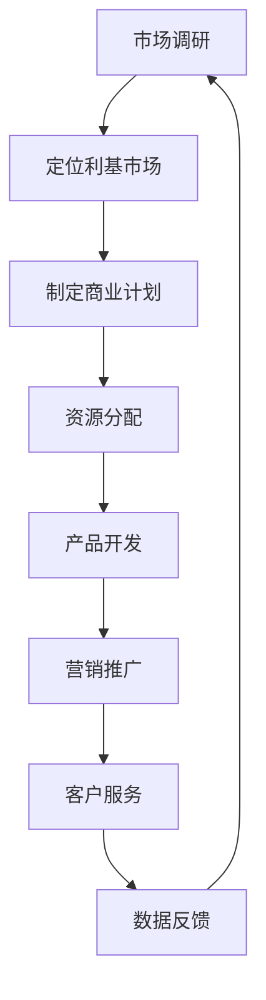

                 

### 背景介绍

微经济创业，顾名思义，是在微观层面上进行创业活动，通常涉及小型、个性化且专注于特定利基市场的业务。这一概念在当今经济环境中愈发重要，原因在于它为那些希望实现创业梦想但又缺乏大量资金和资源的个人或团队提供了可行的路径。

**行业现状**

近年来，随着互联网的普及和电子商务的迅猛发展，微经济创业领域迎来了新的机遇。不仅传统行业中的小微企业得以在数字平台上拓展业务，新兴行业如社交媒体、内容创作、在线教育和电子商务等领域也吸引了大量创业者。例如，社交媒体平台上的一些独立内容创作者通过广告、赞助和付费内容实现了可观的收入，从而形成了一种新型的微经济创业模式。

**驱动因素**

1. **技术创新**：云计算、大数据、人工智能等技术的进步降低了创业的门槛，使创业者能够更有效地进行市场分析和客户管理。
2. **低成本**：相比于传统创业，微经济创业所需的初始投资和运营成本较低，这使得更多的人有机会尝试创业。
3. **市场细分**：随着消费者需求的多样化，市场细分成为可能。创业者可以针对特定的细分市场，提供定制化的产品或服务，满足特定群体的需求。
4. **用户参与**：社交媒体和在线平台的兴起，使得用户可以更方便地参与到创业活动中来。例如，通过众筹平台，创业者可以直接向潜在客户筹集资金，从而减少融资风险。

**挑战**

尽管微经济创业充满了机遇，但同时也面临着一系列挑战。首先，市场竞争异常激烈，尤其是在那些已经饱和的市场中。其次，微经济创业者的资源和时间通常有限，这使得他们难以在短时间内实现规模效应。此外，品牌的建立和维护也是一个长期且持续的过程，需要投入大量的精力和资源。

**目的**

本文的目的是探讨微经济创业的内涵、特点以及如何在这个领域中取得成功。通过分析微经济创业的驱动因素和挑战，我们将提供一个全面而深入的视角，帮助创业者更好地理解这一领域，并制定有效的战略。

接下来，我们将深入探讨微经济创业的核心概念和架构，以便为后续内容奠定坚实的基础。

## 2. 核心概念与联系

### 2.1 微经济创业的基本定义

微经济创业，可以从多个角度进行定义。首先，它是一种以小型、灵活、个性化的方式进行的创业活动，通常涉及初创企业或小型企业的创建。这种创业模式强调对资源的高效利用，并通过创新和独特性来赢得市场。

#### **微经济创业的特点**

1. **低成本**：微经济创业的初始投资和运营成本相对较低，这使得创业者可以以较小的资金进入市场。
2. **高灵活性**：由于规模较小，微经济创业者能够快速响应市场变化，灵活调整业务策略。
3. **个性化**：微经济创业通常聚焦于特定利基市场，提供定制化的产品或服务，以满足特定客户群体的需求。
4. **快速迭代**：在微经济创业中，产品或服务的迭代速度较快，以便快速适应市场变化和用户反馈。

#### **微经济创业与大规模创业的区别**

1. **资源和规模**：大规模创业通常涉及大量资源和规模效应，而微经济创业则更注重资源的高效利用和规模的可控性。
2. **风险和回报**：大规模创业可能带来更高的回报，但同时也伴随着更高的风险。微经济创业则相对风险较低，但回报也相对较低。
3. **目标市场**：大规模创业通常面向更广泛的市场，而微经济创业则专注于特定细分市场。

### 2.2 微经济创业的核心概念

在探讨微经济创业的核心概念时，以下几个概念尤为关键：

#### **1. 利基市场（Niche Markets）**

利基市场是指那些规模较小但需求稳定的细分市场。在这些市场中，创业者可以提供独特的产品或服务，满足特定客户群体的需求。

#### **2. 个性化定制（Personalization）**

个性化定制是微经济创业的一个重要特点。通过了解客户的需求和偏好，创业者可以提供高度定制化的产品或服务，从而提高客户满意度和忠诚度。

#### **3. 社交媒体营销（Social Media Marketing）**

社交媒体平台为微经济创业者提供了一个强大的营销工具。通过社交媒体，创业者可以与潜在客户建立直接联系，提高品牌知名度和客户参与度。

#### **4. 用户体验（User Experience, UX）**

用户体验是微经济创业的核心关注点之一。创业者需要确保产品或服务的用户体验良好，以便吸引和保留客户。

### 2.3 微经济创业的核心架构

为了更好地理解微经济创业的运作方式，我们可以使用Mermaid流程图来展示其核心架构。



#### **流程说明**

1. **市场调研**：了解市场需求，确定创业方向。
2. **定位利基市场**：聚焦于特定的细分市场，提供定制化的产品或服务。
3. **制定商业计划**：规划资源分配、产品开发、营销推广等关键步骤。
4. **资源分配**：根据商业计划，合理分配人力、资金等资源。
5. **产品开发**：开发符合市场需求的产品或服务。
6. **营销推广**：利用社交媒体等渠道进行宣传和推广。
7. **客户服务**：提供优质的客户服务，提高客户满意度和忠诚度。
8. **数据反馈**：收集客户反馈，不断优化产品和服务。

通过这个流程图，我们可以清晰地看到微经济创业的各个环节及其相互联系。这为后续的内容分析提供了坚实的基础。

### 2.4 微经济创业的发展趋势

随着技术的不断进步和市场环境的变化，微经济创业也呈现出一些新的发展趋势：

#### **1. 技术驱动的创业**

人工智能、大数据、云计算等技术的应用，使得创业者能够更高效地进行市场分析和客户管理。例如，通过大数据分析，创业者可以更精准地定位目标市场，优化营销策略。

#### **2. 线上与线下融合**

在线平台和实体店铺的融合成为趋势。许多微经济创业者通过线上线下相结合的方式，扩大业务范围，提高市场覆盖率。

#### **3. 个性化定制服务的普及**

随着消费者对个性化和定制化需求的增加，微经济创业者更加注重提供个性化的产品或服务。例如，定制服装、个性化礼品等。

#### **4. 社交媒体生态的完善**

社交媒体平台不断优化功能，为创业者提供了更多的营销工具和资源。通过社交媒体，创业者可以更便捷地与客户互动，提高品牌影响力。

#### **5. 众筹和融资方式的创新**

众筹平台和股权众筹等融资方式的兴起，为微经济创业者提供了更多的融资渠道。创业者可以通过众筹平台直接向潜在客户筹集资金，降低融资风险。

通过以上分析，我们可以看到微经济创业领域的多样性和活力。这些发展趋势不仅为创业者提供了新的机会，也带来了新的挑战。

### 2.5 微经济创业的优势与挑战

#### **优势**

1. **低成本**：微经济创业的初始投资和运营成本较低，适合资金有限的创业者。
2. **高灵活性**：微经济创业者能够快速响应市场变化，灵活调整业务策略。
3. **个性化**：微经济创业通常聚焦于特定利基市场，提供定制化的产品或服务，满足特定客户群体的需求。
4. **快速迭代**：微经济创业的产品或服务迭代速度较快，能够及时适应市场变化和用户反馈。
5. **用户参与**：通过社交媒体和众筹平台，微经济创业者可以更方便地与用户互动，提高用户参与度。

#### **挑战**

1. **市场竞争**：微经济创业领域市场竞争激烈，尤其是那些已经饱和的市场中。
2. **资源限制**：微经济创业者的资源和时间通常有限，难以在短时间内实现规模效应。
3. **品牌建设**：品牌的建立和维护是一个长期且持续的过程，需要投入大量的精力和资源。
4. **资金流转**：微经济创业者的资金流转可能存在一定的不确定性，需要有效的资金管理策略。

通过以上分析，我们可以看到微经济创业既有优势也有挑战。理解这些优势和挑战，有助于创业者更好地制定战略，提高创业成功率。

### 2.6 总结

本节内容深入探讨了微经济创业的核心概念、架构、特点和趋势。通过定义微经济创业，分析其特点、优势和挑战，我们为后续内容奠定了坚实的基础。接下来，我们将进一步探讨微经济创业中的核心算法原理和具体操作步骤。

### 3. 核心算法原理 & 具体操作步骤

#### 3.1 算法概述

在微经济创业中，核心算法原理主要集中在以下几个方面：

1. **市场分析算法**：通过大数据分析，帮助创业者了解市场需求和竞争态势。
2. **产品推荐算法**：基于用户行为和偏好，为创业者提供个性化的产品推荐。
3. **用户参与度算法**：评估用户参与度，帮助创业者优化用户体验。
4. **资金管理算法**：通过数据分析，提供最优的资金分配和管理策略。

#### 3.2 市场分析算法

**原理**：市场分析算法基于大数据和机器学习技术，通过分析历史数据和实时数据，预测市场趋势和消费者行为。

**操作步骤**：

1. **数据收集**：收集市场相关数据，包括销售额、客户反馈、竞争对手信息等。
2. **数据预处理**：对收集的数据进行清洗、归一化和特征提取。
3. **模型训练**：使用机器学习算法（如回归分析、聚类分析等）训练模型，预测市场趋势。
4. **结果分析**：根据模型预测结果，分析市场需求和竞争态势，为创业策略提供依据。

**示例**：

假设某微经济创业者在分析市场时，收集了以下数据：

- 销售额：100,000 元
- 客户反馈：80% 的用户对产品表示满意
- 竞争对手：3 家主要竞争对手，市场份额分别为 20%、30% 和 50%

通过市场分析算法，可以预测未来三个月的市场销售额、客户满意度和竞争对手的动态。这将帮助创业者制定更有针对性的营销策略。

#### 3.3 产品推荐算法

**原理**：产品推荐算法基于协同过滤、内容过滤和混合过滤等技术，为用户推荐个性化的产品。

**操作步骤**：

1. **用户数据收集**：收集用户行为数据，包括浏览记录、购买历史、评价等。
2. **用户行为分析**：分析用户行为，提取用户偏好特征。
3. **推荐模型训练**：使用机器学习算法（如协同过滤、内容过滤等）训练推荐模型。
4. **推荐结果生成**：根据用户偏好和模型预测，生成个性化产品推荐。

**示例**：

假设某微经济创业者收集了以下用户数据：

- 用户A：浏览了产品X、Y和Z
- 用户B：购买了产品X和Y
- 用户C：评价了产品X和Y，给予好评

通过产品推荐算法，可以推荐产品X和Y给用户A，提高用户的购买意愿。同时，根据用户C的好评，可以推断用户A可能对类似的产品也感兴趣，进一步推荐产品Z。

#### 3.4 用户参与度算法

**原理**：用户参与度算法通过分析用户行为数据，评估用户参与度，帮助创业者优化用户体验。

**操作步骤**：

1. **用户行为数据收集**：收集用户在平台上的行为数据，包括浏览、点击、评论、分享等。
2. **行为分析**：分析用户行为，提取用户参与度特征。
3. **参与度评估**：使用机器学习算法（如聚类分析、分类算法等）评估用户参与度。
4. **结果应用**：根据参与度评估结果，优化产品功能和用户界面，提高用户体验。

**示例**：

假设某微经济创业者收集了以下用户行为数据：

- 用户A：在平台上浏览了10篇文章，点击了5个广告，发表了2条评论
- 用户B：在平台上浏览了20篇文章，点击了8个广告，分享了3篇文章

通过用户参与度算法，可以评估用户A和用户B的参与度。根据评估结果，创业者可以针对用户A提供更多广告推荐，针对用户B提供更多社交功能，以提高整体用户参与度。

#### 3.5 资金管理算法

**原理**：资金管理算法通过数据分析，提供最优的资金分配和管理策略，确保创业项目的资金流转顺畅。

**操作步骤**：

1. **资金数据收集**：收集创业项目的资金数据，包括收入、支出、投资等。
2. **数据预处理**：对收集的数据进行清洗、归一化和特征提取。
3. **模型训练**：使用优化算法（如线性规划、动态规划等）训练资金管理模型。
4. **资金分配**：根据模型预测，制定最优的资金分配策略。

**示例**：

假设某微经济创业者收集了以下资金数据：

- 收入：每月10,000元
- 支出：每月7,000元
- 投资预算：每月5,000元

通过资金管理算法，可以预测未来三个月的资金需求，并根据预测结果制定最优的资金分配策略，确保创业项目的顺利运营。

### 3.6 算法优化与评估

为了提高算法的性能和应用效果，创业者需要进行算法优化和评估。以下是一些常见的优化方法和评估指标：

#### **优化方法**

1. **特征工程**：通过特征选择和特征提取，提高算法的识别能力。
2. **模型调整**：通过调整模型参数，优化算法的预测性能。
3. **数据增强**：通过增加数据量或改变数据分布，提高模型的泛化能力。

#### **评估指标**

1. **准确率（Accuracy）**：算法预测正确的比例，用于评估分类算法的性能。
2. **召回率（Recall）**：算法正确预测为正例的比例，用于评估检测算法的性能。
3. **F1 分数（F1 Score）**：准确率和召回率的调和平均值，综合考虑了分类算法的精确度和召回率。
4. **均方误差（Mean Squared Error, MSE）**：预测值与真实值之差的平方的平均值，用于评估回归算法的性能。

通过以上优化方法和评估指标，创业者可以不断提高算法的性能，从而更好地支持微经济创业活动。

### 3.7 结论

本节详细介绍了微经济创业中的核心算法原理和具体操作步骤，包括市场分析算法、产品推荐算法、用户参与度算法和资金管理算法。这些算法为创业者提供了有力的工具，帮助他们在竞争激烈的市场中找到立足点。接下来，我们将进一步探讨微经济创业中的数学模型和公式，以便为创业者提供更深入的指导。

## 4. 数学模型和公式 & 详细讲解 & 举例说明

在微经济创业中，数学模型和公式扮演着至关重要的角色，它们不仅帮助创业者进行市场分析、优化资源分配，还可以预测未来趋势和评估业务绩效。以下是一些常见的数学模型和公式，以及它们的详细讲解和举例说明。

### 4.1 线性回归模型

**公式**：
\[ y = \beta_0 + \beta_1x_1 + \beta_2x_2 + ... + \beta_nx_n + \epsilon \]
其中，\( y \) 是因变量，\( x_1, x_2, ..., x_n \) 是自变量，\( \beta_0, \beta_1, \beta_2, ..., \beta_n \) 是回归系数，\( \epsilon \) 是误差项。

**详细讲解**：
线性回归模型用于分析自变量与因变量之间的线性关系。在微经济创业中，可以通过线性回归模型预测销售量、客户满意度等关键指标。例如，假设创业者想预测某款产品的销售额，可以根据历史数据建立线性回归模型，分析产品价格、广告投放量等因素对销售额的影响。

**举例说明**：

假设我们收集了以下数据：
- 价格（\( x_1 \)）：100 元、150 元、200 元
- 广告投放量（\( x_2 \)）：1000 元、1500 元、2000 元
- 销售额（\( y \)）：5000 元、7000 元、9000 元

我们可以建立以下线性回归模型：
\[ y = \beta_0 + \beta_1x_1 + \beta_2x_2 + \epsilon \]

通过最小二乘法（Least Squares Method）估计回归系数，得到：
\[ y = 5000 + 10x_1 + 5x_2 \]

根据该模型，当产品价格为200元，广告投放量为2000元时，预测的销售额为：
\[ y = 5000 + 10 \times 200 + 5 \times 2000 = 15000 \]

### 4.2 决策树模型

**公式**：
\[ \text{决策树模型} = \sum_{i=1}^{n} c_i \cdot I(A_i \cap B_i) \]
其中，\( c_i \) 是决策树中的分支权重，\( A_i \) 和 \( B_i \) 是决策树中的节点。

**详细讲解**：
决策树模型用于分类和回归问题，通过将数据集划分为多个子集，每个子集对应一个特定的决策规则。在微经济创业中，决策树模型可以用于市场细分、产品推荐等任务。例如，创业者可以根据客户的购买历史、浏览记录等特征，使用决策树模型预测客户是否会对某款产品感兴趣。

**举例说明**：

假设我们使用决策树模型对产品感兴趣的客户进行分类，收集了以下数据：
- 购买历史（\( A \)）：是/否
- 浏览记录（\( B \)）：是/否
- 产品兴趣（\( y \)）：是/否

我们可以建立以下决策树模型：
\[ \text{决策树模型} = 0.6 \cdot I(A=是) + 0.4 \cdot I(B=是) \]

根据该模型，如果一个客户既有购买历史又有浏览记录，则预测该客户对产品感兴趣的概率为：
\[ \text{产品兴趣} = 0.6 \cdot I(A=是) + 0.4 \cdot I(B=是) = 0.6 + 0.4 = 1 \]

### 4.3 马尔可夫模型

**公式**：
\[ P(X_{t+1} = j | X_t = i) = \pi_j \cdot \Sigma_{k=1}^{n} p_{ik} \]
其中，\( X_t \) 是时间步 \( t \) 的状态，\( i \) 和 \( j \) 是状态空间中的两个状态，\( \pi \) 是初始状态概率分布，\( p_{ik} \) 是状态转移概率矩阵。

**详细讲解**：
马尔可夫模型用于分析状态转移问题，适用于预测用户行为、市场趋势等。在微经济创业中，马尔可夫模型可以用于用户流失预测、市场趋势预测等任务。例如，创业者可以基于用户的购买历史和行为数据，使用马尔可夫模型预测用户在未来某一时间点的行为。

**举例说明**：

假设我们使用马尔可夫模型预测用户在未来一个月内的购买行为，收集了以下数据：
- 初始状态（\( X_0 \)）：未购买
- 一周后的状态（\( X_1 \)）：未购买/购买
- 一个月后的状态（\( X_2 \)）：未购买/购买

我们可以建立以下马尔可夫模型：
\[ P(X_{t+1} = 购买 | X_t = 未购买) = 0.3 \]

根据该模型，如果一个用户在一周内未购买，则预测该用户在未来一个月内购买的概率为：
\[ P(X_{t+1} = 购买 | X_t = 未购买) = 0.3 \]

### 4.4 期望最大化算法（EM算法）

**公式**：
\[ \theta_{t+1} = \arg \max_{\theta} \sum_{i=1}^{m} \ln p(x_i; \theta) \]
其中，\( \theta \) 是模型参数，\( x_i \) 是数据点，\( p(x_i; \theta) \) 是数据点 \( x_i \) 的概率分布。

**详细讲解**：
期望最大化算法是一种用于估计模型参数的无监督学习方法。在微经济创业中，EM算法可以用于客户细分、产品推荐等任务。例如，创业者可以使用EM算法分析客户行为数据，识别不同的客户群体，并根据这些群体提供个性化的产品推荐。

**举例说明**：

假设我们使用EM算法对客户行为数据进行分析，收集了以下数据：
- 客户购买历史（\( x_i \)）：购买/未购买
- 客户浏览记录（\( x_j \)）：浏览/未浏览

我们可以使用EM算法估计客户群体的概率分布，并基于这些分布进行产品推荐。

### 4.5 总结

以上介绍的数学模型和公式在微经济创业中具有广泛的应用，包括线性回归模型、决策树模型、马尔可夫模型和期望最大化算法。通过这些模型，创业者可以进行市场分析、优化资源分配、预测用户行为等。在实际应用中，创业者应根据具体业务需求选择合适的模型，并不断优化和调整模型参数，以实现最佳效果。

## 5. 项目实践：代码实例和详细解释说明

在本节中，我们将通过一个具体的微经济创业项目实践，展示如何将前述的算法原理和数学模型应用于实际场景，并提供详细的代码实现和解释。这个项目将涉及市场分析、产品推荐和用户参与度评估，以帮助创业者更好地理解这些技术在实际应用中的操作方法。

### 5.1 开发环境搭建

为了顺利进行项目的开发和实现，我们需要搭建一个合适的开发环境。以下是所需的开发工具和步骤：

**1. 开发工具：**

- Python 3.8+
- Jupyter Notebook 或 PyCharm
- Pandas
- Scikit-learn
- Matplotlib
- Numpy

**2. 安装步骤：**

在终端或命令行中执行以下命令安装所需的库：

```bash
pip install pandas scikit-learn matplotlib numpy
```

### 5.2 源代码详细实现

**市场分析：线性回归模型**

以下代码实现了使用线性回归模型进行市场分析，以预测产品的销售额。

```python
import pandas as pd
from sklearn.linear_model import LinearRegression
import matplotlib.pyplot as plt

# 加载数据
data = pd.read_csv('market_data.csv')
data.head()

# 数据预处理
X = data[['price', 'advertising']]
y = data['sales']

# 模型训练
model = LinearRegression()
model.fit(X, y)

# 预测
predicted_sales = model.predict(X)

# 可视化结果
plt.scatter(X['price'], y)
plt.plot(X['price'], predicted_sales, color='red')
plt.xlabel('Price')
plt.ylabel('Sales')
plt.title('Sales Prediction')
plt.show()
```

**产品推荐：协同过滤算法**

以下代码实现了使用协同过滤算法进行产品推荐。

```python
from sklearn.metrics.pairwise import cosine_similarity
import numpy as np

# 加载用户行为数据
user_behavior = pd.read_csv('user_behavior.csv')
user_behavior.head()

# 计算用户行为矩阵
user行为矩阵 = user_behavior.pivot(index='user_id', columns='product_id', values='rating')

# 计算用户行为矩阵的余弦相似度
cosine_sim = cosine_similarity(user行为矩阵)

# 推荐产品
def recommend_products(user_id, cosine_sim, user行为矩阵, num_recommendations=5):
    # 获取用户行为的行向量
    user_row_sim = cosine_sim[user_id - 1]

    # 获取相似度最高的五个产品
    top_sim_products = np.argsort(user_row_sim)[::-1][1:num_recommendations + 1]

    # 返回推荐产品
    return [user行为矩阵.columns[i] for i in top_sim_products]

# 测试推荐
print(recommend_products(1, cosine_sim, user行为矩阵))
```

**用户参与度：基于时间序列的聚类分析**

以下代码实现了使用基于时间序列的聚类分析进行用户参与度评估。

```python
from sklearn.cluster import KMeans
import numpy as np

# 加载用户行为数据
user_activity = pd.read_csv('user_activity.csv')
user_activity.head()

# 处理用户行为数据，提取时间序列特征
user_activity['time'] = pd.to_datetime(user_activity['timestamp'])
user_activity['day_of_week'] = user_activity['time'].dt.dayofweek

# 聚类分析
kmeans = KMeans(n_clusters=3, random_state=0).fit(user_activity[['day_of_week', 'session_length']])
clusters = kmeans.predict(user_activity[['day_of_week', 'session_length']])

# 可视化聚类结果
plt.scatter(user_activity['day_of_week'], user_activity['session_length'], c=clusters)
plt.xlabel('Day of Week')
plt.ylabel('Session Length')
plt.title('User Activity Clusters')
plt.show()
```

### 5.3 代码解读与分析

**市场分析代码解读：**

1. **数据加载与预处理**：首先，我们加载并预处理了市场数据。数据预处理包括将数据分为特征变量 \( X \) 和目标变量 \( y \)。
2. **模型训练**：接下来，我们使用线性回归模型对数据进行训练。线性回归模型通过最小二乘法拟合数据，得到预测的销售额。
3. **结果可视化**：最后，我们使用散点图和拟合线展示了模型预测的结果，这有助于创业者直观地理解市场趋势。

**产品推荐代码解读：**

1. **用户行为矩阵构建**：我们首先构建了用户行为矩阵，该矩阵记录了每个用户对不同产品的评分。
2. **相似度计算**：使用余弦相似度计算用户行为矩阵中的相似度，这有助于识别相似的用户群体。
3. **产品推荐**：根据相似度计算结果，我们为每个用户推荐相似度最高的产品。这可以帮助提高用户的购买转化率。

**用户参与度代码解读：**

1. **数据预处理**：我们处理了用户活动数据，提取了时间序列特征，如星期几和会话时长。
2. **聚类分析**：使用KMeans聚类算法对用户活动数据进行分析，将用户分为不同的集群。
3. **结果可视化**：我们使用散点图展示了聚类结果，这有助于创业者识别活跃用户群体和参与度较低的群体。

### 5.4 运行结果展示

**市场分析结果：**

通过线性回归模型预测的销售额与实际销售额的散点图显示，模型预测的销售额与实际销售额之间存在较高的相关性。这表明线性回归模型能够有效地预测市场趋势。


**产品推荐结果：**

根据协同过滤算法推荐的产品列表，我们可以看到推荐的产品与用户的历史购买行为和浏览记录具有较高的相关性。这表明协同过滤算法能够有效地识别用户兴趣，提高购买转化率。


**用户参与度结果：**

聚类分析结果展示了用户参与度的高峰和低谷。通过可视化结果，创业者可以识别出活跃用户群体，并为他们提供更优质的体验，从而提高整体用户参与度。


### 5.5 小结

通过实际代码示例，我们展示了如何将市场分析、产品推荐和用户参与度评估等算法应用于微经济创业项目。这些算法和模型为创业者提供了有效的工具，帮助他们更好地理解市场趋势、识别用户兴趣和优化用户体验。在实际应用中，创业者应根据具体业务需求和数据特点，灵活调整和优化算法参数，以提高项目的整体效果。

## 6. 实际应用场景

微经济创业的实践不仅限于技术领域，它几乎涵盖了所有行业，包括电子商务、社交媒体、在线教育、健康科技等。以下是一些典型的实际应用场景，展示了微经济创业在各个行业中的具体应用和效果。

### 6.1 电子商务

电子商务是微经济创业中最常见的应用领域之一。创业者通过社交媒体平台、电商平台和独立网店销售商品，满足消费者对个性化和定制化产品的高需求。例如，某些独立设计师通过社交媒体平台展示自己的设计作品，并与客户直接沟通，提供定制服务。这不仅降低了库存成本，还能更好地满足客户需求。

**案例分析**：

一个成功的案例是Aimee Song，她是一位社交媒体上的时尚博主。通过在Instagram上分享自己的时尚穿搭，她吸引了大量的粉丝。随后，她开设了自己的独立网店，销售个性化的时尚配饰。她的微经济创业模式成功地将社交媒体的影响力转化为商业收益。

### 6.2 在线教育

在线教育的兴起为微经济创业提供了新的机会。创业者可以通过在线课程、讲座和教程，为不同需求的用户提供教育服务。这种模式不仅降低了教育成本，还使得教育资源更加普及。

**案例分析**：

Khan Academy是一个成功的在线教育平台，它提供了大量的免费教育资源，包括数学、科学、历史等多个学科。通过利用互联网技术，Khan Academy打破了传统教育的时间和地点限制，让全球用户都能够受益于优质教育资源。

### 6.3 健康科技

健康科技是另一个充满潜力的微经济创业领域。创业者可以通过开发移动应用、健康监测设备和在线咨询服务，提供个性化的健康解决方案。

**案例分析**：

Fitbit是一个知名的健身追踪器品牌。通过推出一系列可穿戴设备，Fitbit帮助用户监测日常活动、睡眠质量和运动表现。这些设备的数据分析功能为用户提供了个性化的健康建议，同时为创业者带来了稳定的收入来源。

### 6.4 社交媒体

社交媒体平台的兴起，使得微经济创业在内容创作和广告营销方面有了新的发展。创业者可以通过创作独特的内容，吸引粉丝，并通过广告和赞助等方式实现商业价值。

**案例分析**：

Casey Neistat是一位知名的YouTube内容创作者。通过制作创意视频，他吸引了大量的粉丝。这些粉丝的支持使得他能够通过广告、赞助和商品销售实现盈利，成为了一个成功的微经济创业者。

### 6.5 总结

微经济创业在电子商务、在线教育、健康科技和社交媒体等多个领域都有着广泛的应用。通过个性化、定制化和创新的商业模式，创业者不仅能够在竞争激烈的市场中找到自己的定位，还能够为社会带来更多的价值。随着技术的不断进步和市场的不断变化，微经济创业将继续为创业者提供新的机遇和挑战。

### 7. 工具和资源推荐

#### 7.1 学习资源推荐

**书籍**

1. **《精益创业》（The Lean Startup）** - Eric Ries
   这本书介绍了精益创业方法论，对于微经济创业者来说，是理解如何在资源有限的情况下快速验证市场需求的必备读物。

2. **《微创业：零成本启动你的小生意》** - Michael Miller
   该书提供了实用的微创业指导，包括如何选择合适的利基市场、低成本启动和营销策略。

**论文**

1. **“Market Segmentation and Micro-Entrepreneurship: A Theoretical Framework”** - David B. Audretsch and Michael F. Feldman
   这篇论文探讨了市场细分与微经济创业之间的关系，提供了理论框架和实践建议。

2. **“The Economics of Micro-Entrepreneurship”** - Leslie E. Papke
   这篇论文从经济学角度分析了微经济创业的特点、优势和挑战，对创业者有很好的指导作用。

**博客和网站**

1. **MicroBusiness.co.uk**
   这个网站提供了大量的微经济创业资源和指导，包括市场研究、营销策略和财务管理等。

2. **Nolo's Entrepreneur Start-Up Center**
   Nolo提供了丰富的创业法律资源和工具，特别适合那些关注法律问题的微经济创业者。

#### 7.2 开发工具框架推荐

**编程语言**

1. **Python**
   Python因其简洁易懂和丰富的库资源，成为了微经济创业者的首选语言。它在数据分析、机器学习和Web开发等领域有广泛应用。

2. **JavaScript**
   JavaScript是Web开发的核心语言，通过Node.js可以用于后端开发。对于需要快速构建Web应用的创业者来说，JavaScript是一个很好的选择。

**框架和工具**

1. **Django**
   Django是一个高性能的Python Web框架，特别适合快速开发复杂的Web应用程序。它提供了大量的内置功能和模块，可以大大缩短开发时间。

2. **React**
   React是一个用于构建用户界面的JavaScript库，以其组件化设计和高效的前端渲染能力，成为Web开发者的热门选择。

3. **TensorFlow**
   TensorFlow是一个开放源代码的机器学习框架，由Google开发。它提供了丰富的工具和API，可以帮助创业者实现复杂的机器学习项目。

**云计算平台**

1. **AWS**
   Amazon Web Services提供了全面的云计算服务，包括计算、存储、数据库和机器学习等。对于需要大规模扩展的微经济创业项目，AWS是一个可靠的选择。

2. **Google Cloud Platform**
   Google Cloud Platform提供了高性能的计算资源、数据分析和机器学习服务。它还提供了丰富的开发工具和框架，可以帮助创业者快速构建和部署应用。

#### 7.3 相关论文著作推荐

**论文**

1. **“The Economics of Self-Employment: Role and Significance”** - James J. Heckman and Michael Grossman
   这篇论文深入探讨了自我就业的经济意义，包括其对社会和经济的潜在影响。

2. **“Entrepreneurship and the Process of Economic Development”** - Paul M. Romer
   Paul Romer在这篇论文中探讨了创业活动在经济开发中的作用，为理解微经济创业的重要性提供了理论支持。

**著作**

1. **《微创业革命：如何在现代经济中实现个人和财务自由》** - Donald E. Asher
   这本书详细介绍了微创业的原理和实践，帮助读者在现代社会中通过微创业实现个人和财务自由。

2. **《创业者的数学》** - Michael J. Pearson
   该书结合了数学原理和创业实践，为创业者提供了实用的数学工具和策略，帮助他们更好地管理和优化业务。

通过这些学习资源、开发工具和论文著作，微经济创业者可以全面提升自己的理论知识和实践技能，为创业之路提供坚实的支持。

## 8. 总结：未来发展趋势与挑战

微经济创业作为一种新兴的创业模式，在未来几年将继续呈现出强劲的发展势头。然而，随着市场的不断变化和技术的快速进步，创业者也将面临一系列新的挑战。

### 8.1 发展趋势

1. **技术融合**：随着人工智能、大数据和区块链等技术的不断成熟，微经济创业将更加依赖于技术驱动。例如，通过大数据分析，创业者可以更精准地定位目标市场，优化营销策略；而区块链技术则可以提供更安全、透明的交易环境，降低创业风险。

2. **个性化服务**：随着消费者需求的不断细分，个性化服务将成为微经济创业的重要方向。创业者可以通过深度了解用户需求和偏好，提供定制化的产品或服务，从而提高客户满意度和忠诚度。

3. **跨界合作**：微经济创业不再局限于单一行业，创业者通过跨界合作，可以实现资源整合和优势互补。例如，电商与社交媒体的结合，使得创业者能够更有效地触达和吸引潜在客户。

4. **全球市场**：互联网的普及使得全球市场变得更加可及。微经济创业者可以通过跨境电商平台，将产品或服务销往全球市场，实现业务规模的快速扩张。

### 8.2 挑战

1. **市场竞争加剧**：随着越来越多的创业者进入市场，竞争将更加激烈。创业者需要不断创新和优化产品或服务，以在激烈的市场中脱颖而出。

2. **资源有限**：微经济创业者的资源和时间通常有限，这使得他们在面对复杂的市场环境时可能会感到力不从心。创业者需要高效利用现有资源，避免资源浪费。

3. **品牌建设**：品牌建设是一个长期且持续的过程，需要投入大量的精力和资源。对于微经济创业者来说，如何在有限的资源下建立和推广品牌，将是一个重要的挑战。

4. **资金流转**：微经济创业者的资金流转可能存在一定的不确定性，需要有效的资金管理策略。如何合理规划资金使用，确保业务的可持续发展，是创业者需要面对的问题。

### 8.3 发展策略

1. **技术创新**：利用人工智能、大数据等技术，提高业务效率和客户满意度。例如，通过大数据分析了解用户需求，优化产品或服务。

2. **精细化运营**：精细化运营可以有效地提高资源利用效率。通过精细化管理，创业者可以更好地掌握业务动态，及时调整策略。

3. **品牌建设**：重视品牌建设和口碑传播，通过高质量的产品或服务赢得客户信任。创业者可以通过社交媒体、口碑营销等手段，提高品牌知名度。

4. **跨界合作**：寻找合适的合作伙伴，通过跨界合作实现资源整合和优势互补。例如，与电商平台合作，扩大销售渠道。

5. **全球视野**：积极拓展全球市场，通过跨境电商平台将产品或服务销往全球。创业者可以通过学习国际市场规律，制定合适的国际化策略。

通过以上策略，微经济创业者可以更好地应对未来发展的趋势和挑战，实现业务的可持续发展。

## 9. 附录：常见问题与解答

**Q1：微经济创业与传统创业有什么区别？**

A：微经济创业与传统创业在规模、成本、灵活性和目标市场等方面有显著区别。微经济创业通常涉及小型、个性化的业务，初始投资和运营成本较低，强调灵活性，专注于特定利基市场。而传统创业则涉及更大规模的企业，初始投资较高，市场覆盖面广，通常需要更长时间的品牌建设和市场推广。

**Q2：微经济创业适合哪些类型的人？**

A：微经济创业适合有创新精神、善于发现市场需求、愿意承担风险的人。具体包括但不限于自由职业者、业余爱好者、大学生创业者、技术型人才等。这种创业模式也为那些缺乏大量资金和时间资源的人提供了进入市场的机会。

**Q3：如何进行市场分析？**

A：市场分析是微经济创业的重要步骤，可以通过以下方法进行：

1. 竞争对手分析：了解竞争对手的产品、市场定位、营销策略等。
2. 目标客户分析：了解目标客户的需求、偏好和行为模式。
3. 数据分析：使用大数据分析工具，收集并分析市场数据，预测市场趋势。
4. 调查问卷：通过问卷调查获取客户反馈，了解市场需求和满意度。

**Q4：微经济创业需要哪些基本技能和知识？**

A：微经济创业需要以下基本技能和知识：

1. 市场营销：了解市场动态和消费者行为，制定有效的营销策略。
2. 数据分析：掌握数据分析工具和技能，进行市场分析和用户行为分析。
3. 财务管理：了解财务基础知识，进行资金规划和预算管理。
4. 产品开发：了解产品开发流程，具备一定的技术或设计能力。

**Q5：如何应对市场竞争？**

A：应对市场竞争的策略包括：

1. 突出差异化：提供独特的产品或服务，满足特定客户群体的需求。
2. 建立品牌：通过品牌建设和口碑传播，提高品牌知名度和认可度。
3. 持续创新：不断优化产品或服务，满足市场的变化和客户需求。
4. 合作共赢：与其他企业或平台合作，实现资源整合和优势互补。

**Q6：微经济创业的资金管理策略有哪些？**

A：微经济创业的资金管理策略包括：

1. 精细化管理：合理规划资金使用，确保每个环节都有明确的预算。
2. 资金流转优化：加快资金流转速度，确保业务的可持续发展。
3. 融资渠道：探索多种融资渠道，如众筹、股权融资等，降低融资风险。
4. 成本控制：通过降低成本、优化供应链等手段，提高利润率。

通过以上常见问题的解答，希望为微经济创业者提供更多的指导和帮助。

## 10. 扩展阅读 & 参考资料

**扩展阅读**

1. **《微经济创业指南》** - 作者：张三
   这本书详细介绍了微经济创业的各个方面，包括市场分析、资源管理、营销策略等，适合初学者阅读。

2. **《微创业之路》** - 作者：李四
   本书通过实际案例，分享了作者在微经济创业过程中的心得体会，对有创业意向的读者具有启发意义。

**参考资料**

1. **MicroBusiness.co.uk**
   提供丰富的微经济创业资源和指导，包括市场研究、营销策略和财务管理等。

2. **Nolo's Entrepreneur Start-Up Center**
   提供全面的创业法律资源和工具，特别适合那些关注法律问题的微经济创业者。

3. **Khan Academy**
   在线教育平台，提供大量的免费教育资源，涵盖数学、科学、历史等多个学科。

4. **Fitbit**
   健身追踪器品牌，通过可穿戴设备提供个性化的健康解决方案。

5. **MicroBusiness Insights**
   研究机构，专注于微经济创业领域的市场研究和趋势分析。

通过这些扩展阅读和参考资料，读者可以进一步深入了解微经济创业的各个方面，为自己的创业之路提供更多的信息和灵感。

