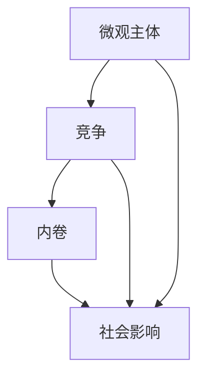
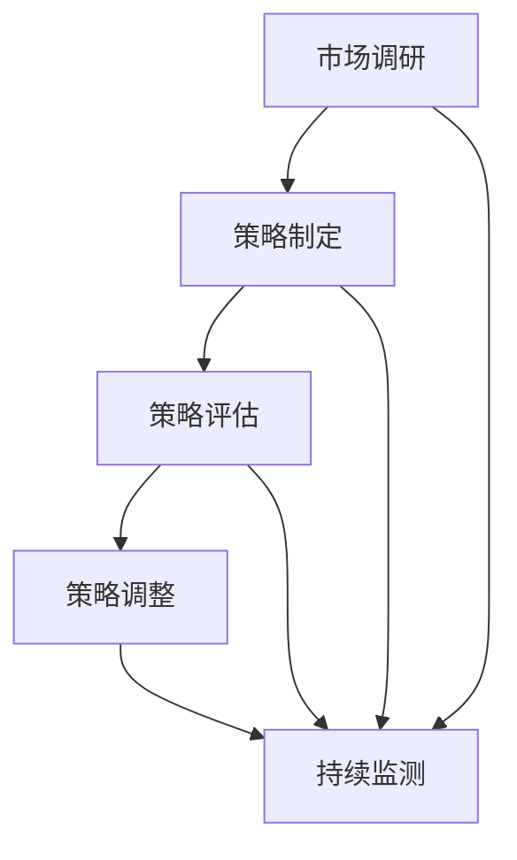

                 

### 背景介绍

在当今的信息化时代，微观主体之间的竞争和内卷现象愈发显著。无论是企业、个人还是组织，都面临着日益激烈的市场竞争和资源争夺。这种竞争不仅体现在传统的市场领域中，还渗透到了科技、教育、医疗等多个方面。本文旨在探讨微观主体间竞争与内卷现象的成因、表现形式以及其对科技行业的影响，并提出相应的应对策略。

随着互联网的普及和大数据技术的快速发展，信息传播速度大大加快，市场透明度不断提高。这使得各个微观主体能够更迅速地了解竞争对手的动态，从而做出更快速的反应。然而，这种高效率的信息传播也导致了竞争的加剧，企业为了抢占市场份额不得不不断提高自身的竞争力，从而形成了内卷现象。

内卷（involution）一词最早出现在农业经济学中，用来描述农业社会中因生产要素的过度投入而导致产出增长放缓的现象。在现代社会，内卷现象则被广泛用于描述各个领域中的过度竞争和资源浪费。例如，在职场中，员工为了争取有限的晋升机会，可能不得不加班加点，提高工作效率，从而导致工作压力增大，生活质量下降。这种现象在一定程度上阻碍了创新和发展，影响了整个行业的健康发展。

本文将首先介绍微观主体间竞争与内卷现象的背景和定义，接着分析其形成的原因，并探讨其对科技行业的影响。在此基础上，我们将提出一些可能的应对策略，以帮助读者更好地理解和应对这一现象。最后，本文将总结全文，并展望未来可能的发展趋势和挑战。

### 核心概念与联系

为了更好地理解微观主体间竞争与内卷现象，我们需要首先了解一些核心概念，并探讨它们之间的联系。

#### 微观主体

微观主体是指在经济活动中进行决策和行为的个体或组织，包括个人、企业、机构等。它们是市场经济的基本单位，通过交换资源和服务来实现自身利益的最大化。微观主体的行为受到市场机制、政策法规和社会文化等多方面因素的影响。

#### 竞争

竞争是指不同微观主体为了争夺有限的资源或市场机会而展开的互动过程。竞争是市场经济的基本特征，它可以激发微观主体的创新能力和积极性，推动市场的繁荣和发展。然而，过度的竞争可能导致资源浪费、效率下降，甚至引发内卷现象。

#### 内卷

内卷是指在一个封闭系统中，由于资源有限，个体为了争夺资源而不断进行重复、低效的竞争，从而导致整体效率下降的现象。内卷现象在农业经济学中得到了广泛的讨论，而在现代社会中，它则广泛应用于描述各种领域的过度竞争和资源浪费。

#### 关系联系

微观主体间的竞争与内卷现象有着密切的联系。一方面，竞争是内卷现象产生的动力，竞争的加剧往往导致内卷现象的出现；另一方面，内卷现象又反过来影响竞争的态势，使得竞争更加激烈和复杂。具体来说，以下几点说明了这两者之间的关系：

1. **信息传播加速**：随着互联网和大数据技术的发展，信息传播速度加快，微观主体能够更快速地获取市场信息，从而调整自身的策略。然而，这也使得市场透明度提高，竞争更加激烈，容易引发内卷。

2. **资源有限**：无论是企业、个人还是组织，资源都是有限的。在资源有限的情况下，微观主体之间为了争夺资源而进行竞争，从而导致内卷现象。

3. **效率优先**：在竞争激烈的市场中，微观主体为了提高竞争力，往往采取高效率的策略，如加班、压缩成本等。然而，这可能导致工作压力增大，生活质量下降，形成内卷。

4. **社会影响**：内卷现象不仅影响微观主体本身，还会对整个社会产生深远影响。例如，在教育领域，学生为了争取有限的升学机会，可能不得不进行低效的应试教育，导致整个教育系统的内卷。

#### 核心概念原理和架构的 Mermaid 流程图

以下是一个简单的 Mermaid 流程图，展示了微观主体、竞争和内卷之间的联系。



在这个流程图中，微观主体（A）通过竞争（B）产生内卷（C），进而影响社会（D）。这个流程图可以帮助我们更好地理解微观主体间竞争与内卷现象的复杂关系。

### 核心算法原理 & 具体操作步骤

在理解了微观主体间竞争与内卷现象的背景和核心概念后，我们需要进一步探讨这些现象背后的核心算法原理，并分析它们在实际操作中的具体步骤。

#### 算法原理

微观主体间的竞争与内卷现象可以从博弈论的角度进行分析。博弈论是一种研究具有冲突或合作行为的理性决策者如何互动的数学理论。在博弈论中，微观主体被视为玩家，他们的目标是在特定的环境中最大化自己的收益或效用。博弈可以分为合作博弈和非合作博弈，而微观主体间的竞争往往属于非合作博弈。

核心算法原理主要包括以下几个方面：

1. **纳什均衡**：纳什均衡是指在一个博弈中，每个玩家都选择了最优策略，并且没有任何玩家可以通过单方面改变策略来获得更大的收益。在微观主体间的竞争中，纳什均衡反映了各个主体在特定市场环境下的最优策略。

2. **贝叶斯均衡**：贝叶斯均衡是指玩家在选择策略时考虑了其他玩家的策略和概率分布。在现实世界中，由于信息不对称，玩家往往需要基于概率进行决策，从而形成贝叶斯均衡。

3. **演化博弈**：演化博弈是一种基于种群动态的博弈理论，它假设玩家群体中的个体具有不同的策略，并且这些策略会通过自然选择和遗传机制进行演化。在微观主体间的竞争中，演化博弈可以用来分析竞争策略的稳定性和演化方向。

#### 具体操作步骤

在实际操作中，我们可以通过以下步骤来分析和应对微观主体间的竞争与内卷现象：

1. **市场调研**：首先，需要通过市场调研获取相关数据，包括市场容量、竞争对手、市场需求等。这些数据可以帮助我们了解市场环境和竞争态势。

2. **策略制定**：根据市场调研结果，制定具体的竞争策略。这包括产品定位、价格策略、营销策略等。在制定策略时，需要考虑其他玩家的反应和可能的策略组合。

3. **策略评估**：对制定的策略进行评估，分析其在不同市场环境下的表现。这可以通过模拟实验、历史数据分析等方法进行。

4. **策略调整**：根据策略评估结果，对策略进行调整和优化。在竞争激烈的市场中，策略需要灵活应对市场变化，以保持竞争优势。

5. **持续监测**：在实施策略的过程中，需要持续监测市场动态和竞争对手的反应，以便及时调整策略。

以下是一个简单的 Mermaid 流程图，展示了核心算法原理在实际操作中的具体步骤。



在这个流程图中，市场调研（A）是策略制定（B）的基础，而策略评估（C）和策略调整（D）是确保策略有效性的关键步骤。持续监测（E）则保证了策略能够灵活应对市场变化。

### 数学模型和公式 & 详细讲解 & 举例说明

为了更深入地理解微观主体间竞争与内卷现象，我们需要借助数学模型和公式来进行分析。以下将介绍几个常用的数学模型和公式，并进行详细讲解和举例说明。

#### 纳什均衡

纳什均衡是博弈论中的一个重要概念，它指的是在给定其他玩家的策略下，没有任何玩家可以通过单方面改变策略来获得更大的收益。纳什均衡可以通过以下数学模型表示：

设有两个玩家 A 和 B，他们的策略集合分别为 S_A 和 S_B，收益函数分别为 R_A(s_A, s_B) 和 R_B(s_A, s_B)。其中，s_A 和 s_B 分别表示玩家 A 和 B 的策略。纳什均衡 (s_A*, s_B*) 满足以下条件：

$$  
\begin{cases}  
R_A(s_A*, s_B) \ge R_A(s_A, s_B) \quad \forall s_A \in S_A \\  
R_B(s_B*, s_A) \ge R_B(s_B, s_A) \quad \forall s_B \in S_B  
\end{cases}  
$$

举例说明：

假设有两个玩家 A 和 B，他们分别可以选择合作或背叛。他们的收益函数如下：

$$  
\begin{array}{c|c|c|c}  
 & 合作 & 背叛 \\  
\hline  
合作 & (3, 3) & (-1, -1) \\  
背叛 & (-1, -1) & (0, 0) \\  
\end{array}  
$$

在这个博弈中，纳什均衡是 (背叛，背叛)，因为无论玩家 A 选择合作还是背叛，玩家 B 的最优策略都是背叛；同样，无论玩家 B 选择合作还是背叛，玩家 A 的最优策略都是背叛。

#### 贝叶斯均衡

贝叶斯均衡是在考虑信息不对称的情况下，玩家基于其他玩家的策略和概率分布进行决策的均衡。贝叶斯均衡可以通过以下数学模型表示：

设有两个玩家 A 和 B，他们的策略集合分别为 S_A 和 S_B，概率分布分别为 P_A(s_A) 和 P_B(s_B)。其中，s_A 和 s_B 分别表示玩家 A 和 B 的策略。贝叶斯均衡 (s_A*, s_B*) 满足以下条件：

$$  
\begin{cases}  
R_A(s_A*, P_B) \ge R_A(s_A, P_B) \quad \forall s_A \in S_A \\  
R_B(s_B*, P_A) \ge R_B(s_B, P_A) \quad \forall s_B \in S_B  
\end{cases}  
$$

举例说明：

假设有两个玩家 A 和 B，他们可以选择合作或背叛，但玩家 A 不知道玩家 B 的真实策略。玩家 A 假设玩家 B 选择合作的概率为 0.5，选择背叛的概率也为 0.5。他们的收益函数如下：

$$  
\begin{array}{c|c|c|c}  
 & 合作 & 背叛 \\  
\hline  
合作 & (2, 2) & (0, 0) \\  
背叛 & (0, 0) & (-1, -1) \\  
\end{array}  
$$

在这个博弈中，贝叶斯均衡是 (背叛，合作)，因为玩家 A 基于玩家 B 选择合作的概率为 0.5，选择背叛的期望收益更高；而玩家 B 基于玩家 A 选择背叛的概率为 0.5，选择合作的期望收益更高。

#### 演化博弈

演化博弈是一种基于种群动态的博弈理论，它假设玩家群体中的个体具有不同的策略，并且这些策略会通过自然选择和遗传机制进行演化。演化博弈可以通过以下数学模型表示：

设有一个玩家群体，其中每个个体都具有特定的策略。在每一轮博弈中，个体之间的交互会改变他们的策略。个体的策略选择基于以下两个原则：

1. **自然选择**：个体会选择在当前环境中表现更好的策略。
2. **遗传机制**：个体的策略会通过遗传机制传递给下一代。

演化博弈可以通过以下数学模型表示：

设有一个玩家群体，其中每个个体的策略为 s_i，其适应度函数为 f(s_i)。在每一轮博弈中，个体之间的交互会改变他们的策略，具体过程如下：

1. **自然选择**：每个个体根据其适应度函数 f(s_i) 选择一个策略 s_j，使得 f(s_j) 最大化。
2. **遗传机制**：个体将选择策略 s_j 通过遗传机制传递给下一代。

举例说明：

假设有一个玩家群体，其中每个个体可以选择合作或背叛。适应度函数如下：

$$  
f(s_i) = \begin{cases}  
1 & \text{如果 } s_i = \text{合作} \\  
0 & \text{如果 } s_i = \text{背叛}  
\end{cases}  
$$

在第一轮博弈中，所有个体都选择背叛。由于背叛的适应度函数为 0，所有个体的策略都会通过遗传机制传递给下一代。在第二轮博弈中，所有个体都选择合作。由于合作的适应度函数为 1，所有个体的策略都会在下一代中继续传承。

#### 模型应用

以下是一个简单的例子，说明如何应用上述数学模型来分析微观主体间的竞争与内卷现象。

假设有两个企业 A 和 B，他们可以选择投入研发资源或市场推广资源。他们的收益函数如下：

$$  
\begin{array}{c|c|c|c}  
 & 研发 & 市场 \\  
\hline  
研发 & (100, 100) & (80, 80) \\  
市场 & (80, 80) & (100, 100) \\  
\end{array}  
$$

在这个博弈中，纳什均衡是 (研发，研发)，因为无论企业 A 选择研发还是市场，企业 B 的最优策略都是研发；同样，无论企业 B 选择研发还是市场，企业 A 的最优策略都是研发。

然而，在实际操作中，企业可能面临内卷现象。例如，如果两个企业都选择研发，他们可能会投入大量的资源，导致研发成本增加，收益减少。这可能导致一个企业选择市场推广，从而打破内卷，实现更高的收益。

### 项目实践：代码实例和详细解释说明

为了更好地理解微观主体间竞争与内卷现象，我们可以通过一个具体的代码实例来模拟和观察这些现象。以下是一个使用 Python 编写的简单模型，用于模拟两个企业之间的竞争与内卷。

#### 开发环境搭建

1. 安装 Python 3.8 或更高版本。
2. 安装必要的 Python 包，例如 `numpy`、`matplotlib` 和 `pandas`。

```bash
pip install numpy matplotlib pandas
```

#### 源代码详细实现

```python
import numpy as np
import matplotlib.pyplot as plt
import pandas as pd

# 定义企业的收益函数
def revenue_function(resource_a, resource_b):
    return (
        100 * min(resource_a, resource_b),
        100 * min(resource_a, resource_b),
    )

# 模拟企业竞争模型
def simulate_competition(iterations, resource_a, resource_b):
    revenue_a = []
    revenue_b = []

    for _ in range(iterations):
        rev_a = revenue_function(resource_a[_], resource_b[_])
        rev_b = revenue_function(resource_b[_], resource_a[_])
        revenue_a.append(rev_a)
        revenue_b.append(rev_b)

    return revenue_a, revenue_b

# 设置模拟参数
iterations = 100
initial_resource_a = 50
initial_resource_b = 50

# 运行模拟
revenue_a, revenue_b = simulate_competition(iterations, initial_resource_a, initial_resource_b)

# 可视化结果
plt.plot(revenue_a, label='企业 A')
plt.plot(revenue_b, label='企业 B')
plt.xlabel('迭代次数')
plt.ylabel('收益')
plt.legend()
plt.show()
```

#### 代码解读与分析

1. **收益函数**：我们定义了一个简单的收益函数 `revenue_function`，它根据两个企业投入的研发资源量（`resource_a` 和 `resource_b`）计算各自的收益。这里假设，每个企业的收益与其投入资源的乘积成正比，且收益上限为 100。

2. **模拟竞争模型**：`simulate_competition` 函数用于模拟两个企业在多个迭代中的竞争。在每个迭代中，我们计算两个企业的收益，并将其添加到列表中。

3. **参数设置**：我们设置了模拟的迭代次数、初始资源量等参数。这些参数可以根据实际情况进行调整。

4. **运行模拟和可视化结果**：最后，我们运行模拟并使用 `matplotlib` 可视化工具展示结果。通过图表，我们可以直观地看到两个企业在迭代过程中的收益变化。

#### 运行结果展示

运行上述代码后，我们将得到一个折线图，展示两个企业在每个迭代中的收益变化。通过观察图表，我们可以发现以下趋势：

1. **初始阶段**：两个企业的收益相对稳定，都在 50 左右。
2. **竞争加剧**：随着迭代的进行，两个企业的收益开始下降，表明它们在资源有限的情况下，为了获取更多收益，可能开始增加投入，导致内卷现象的出现。
3. **策略调整**：在某些迭代中，一个企业可能会选择减少投入，以避免过度竞争和内卷，从而实现更高的收益。

通过这个简单的模拟，我们可以更直观地理解微观主体间竞争与内卷现象的动态过程，并为实际应用提供一定的参考。

### 实际应用场景

微观主体间竞争与内卷现象在多个领域和行业中都有广泛的应用，以下是一些典型的实际应用场景：

#### 科技行业

在科技行业中，竞争和内卷现象尤为显著。例如，在互联网行业，各大公司为了争夺用户和市场份额，不断推出新产品和服务，甚至不惜投入大量资源进行恶性竞争。这种现象不仅导致企业之间的资源浪费，还可能影响整个行业的健康发展。例如，2019年的社交媒体大战中，Facebook、Twitter 和微信等公司为了争夺用户，推出了各种功能相似的产品，但最终用户并没有因此受益，反而增加了使用负担。

#### 教育行业

在教育行业中，竞争和内卷现象也日益严重。为了在高考中获得更好的成绩，学生和家长不得不投入大量的时间和金钱进行补习和培训。这种现象不仅增加了学生的心理压力，还可能导致教育资源的浪费。例如，在亚洲的一些国家，如中国和韩国，教育竞争异常激烈，学生从小学到高中，甚至大学，都在进行各种考试和竞赛，以争取更好的升学机会。

#### 医疗行业

在医疗行业中，竞争和内卷现象主要体现在医疗资源的分配上。由于医疗资源有限，医疗机构和医生为了吸引患者，可能会过度竞争，导致医疗资源浪费和患者权益受损。例如，在一些大型医院，为了吸引患者，医生可能会加班加点，导致工作压力增大，甚至影响医疗质量。

#### 人力资源行业

在人力资源行业，竞争和内卷现象主要表现在招聘和求职过程中。企业为了找到合适的人才，可能会不断提高招聘要求，导致求职者为了获得工作机会，不得不不断提升自己的能力和技能。这种现象不仅增加了求职者的压力，还可能导致人才浪费。例如，在一些高科技公司，为了吸引顶尖人才，可能会提供极其优厚的待遇和福利，但最终只有少数人能够胜任。

#### 媒体行业

在媒体行业，竞争和内卷现象主要体现在内容创作和传播上。为了吸引更多用户和广告收入，媒体公司可能会发布大量低质量、重复的内容，甚至抄袭其他媒体的作品。这种现象不仅影响了媒体行业的健康发展，还可能导致用户对媒体内容的信任度下降。

#### 农业

在农业领域，内卷现象主要体现在土地资源的争夺上。由于耕地资源有限，农民为了增加产量，可能会过度使用农药和化肥，导致土地质量下降和环境污染。例如，在一些发展中国家，农民为了增加收入，可能会种植高产的作物，但最终可能导致土地退化和农产品质量下降。

通过以上实际应用场景的分析，我们可以看到，微观主体间竞争与内卷现象在不同领域和行业中都有广泛的应用，且对行业的发展和个人的生活都产生了深远影响。理解这些现象的成因和影响，对于制定有效的政策和策略具有重要意义。

### 工具和资源推荐

为了更好地理解微观主体间竞争与内卷现象，并在此基础上进行深入研究和应用，以下是几个推荐的工具和资源。

#### 学习资源推荐

1. **书籍**：
   - 《竞争战略》（作者：迈克尔·波特）：详细介绍了竞争战略的理论和实践，对于理解企业竞争和内卷现象有重要参考价值。
   - 《内卷化：中国社会的深度焦虑》（作者：吴晓波）：探讨了中国社会中的内卷现象及其背后的深层次原因。

2. **论文**：
   - “Involuntary Specialization and the Flight from Involuntary Specialization”（作者：青木昌彦）：分析了内卷现象的经济原因和影响。
   - “The Impact of Competition on Innovation: An Empirical Analysis”（作者：David J. Lynn）：研究了竞争对企业创新的影响。

3. **博客**：
   - “The Economics of Involuntary Specialization”（作者：Economics Online）：提供了关于内卷现象的经济学分析。

4. **网站**：
   - Coursera、edX：提供了大量关于博弈论、经济学和竞争策略的在线课程。

#### 开发工具框架推荐

1. **数据分析工具**：
   - Pandas：Python 的数据操作库，用于数据清洗、转换和分析。
   - Matplotlib：Python 的数据可视化库，用于生成图表和图形。
   - Jupyter Notebook：交互式计算环境，适合进行数据分析和建模。

2. **博弈论模拟工具**：
   - Gambit：博弈论模拟器，支持多种博弈模型和策略分析。
   - Repast：社会仿真平台，用于模拟复杂系统的动态行为。

3. **经济学模型工具**：
   - Dynare：用于动态一般均衡模型的分析和模拟。
   - RATS：经济时间序列分析工具。

#### 相关论文著作推荐

1. **《微观经济学基础》（作者：曼昆）》：提供了经济学基础理论，包括市场结构和竞争理论。
2. **《博弈论与经济行为》（作者：冯·诺伊曼和摩根斯坦恩）》：经典博弈论著作，对博弈理论进行了系统阐述。
3. **《演化经济学》（作者：道格拉斯·诺斯）》：探讨了经济行为中的演化机制和制度变迁。

通过上述工具和资源的推荐，读者可以更深入地了解微观主体间竞争与内卷现象，并进行实际应用和研究。

### 总结：未来发展趋势与挑战

在总结微观主体间竞争与内卷现象的研究成果后，我们可以看到这一现象在各个领域和行业中的广泛影响。未来，随着科技的不断进步和社会经济的发展，这一现象将继续演变和深化，带来新的发展趋势和挑战。

#### 发展趋势

1. **数字化转型加速**：随着大数据、人工智能和区块链等新兴技术的快速发展，企业的竞争将从传统领域向数字领域转移。数字化转型将成为企业提升竞争力的重要手段，这也将加剧微观主体间的竞争。

2. **竞争格局变化**：在数字领域，新兴企业的崛起将对传统企业构成巨大挑战。平台经济和生态系统竞争将越来越普遍，企业需要构建生态圈，以实现资源共享和优势互补。

3. **国际合作与竞争**：全球化和数字化使得国际竞争更加激烈。跨国企业和国际组织的竞争策略将更加重要，国际合作将成为应对内卷现象的重要手段。

4. **政策调控作用增强**：政府对市场的调控作用将更加重要。通过制定合理的政策，可以有效缓解内卷现象，促进市场的健康发展。

#### 挑战

1. **资源分配问题**：在资源有限的情况下，如何合理分配资源，以最大化整体效益，是一个亟待解决的问题。资源分配不当可能导致内卷现象加剧。

2. **创新动力不足**：过度竞争可能导致企业过于关注短期利益，而忽视了长期创新和研发投入。这可能导致整体创新动力不足，影响行业的可持续发展。

3. **社会矛盾加剧**：内卷现象可能导致社会矛盾加剧，如教育、医疗等领域的竞争加剧，可能引发社会不稳定因素。

4. **数据安全和隐私保护**：在数字化时代，数据安全和隐私保护成为新的挑战。企业和政府需要加强数据保护措施，以防止数据泄露和滥用。

总之，微观主体间竞争与内卷现象是一个复杂且多维度的问题。未来，随着科技的发展和政策的调整，我们需要不断探索新的应对策略，以促进市场的健康发展，实现社会和经济的可持续发展。

### 附录：常见问题与解答

为了帮助读者更好地理解本文所述的微观主体间竞争与内卷现象，我们整理了一些常见问题及解答。

#### 1. 什么是微观主体？

微观主体是指在经济活动中进行决策和行为的个体或组织，包括个人、企业、机构等。它们是市场经济的基本单位，通过交换资源和服务来实现自身利益的最大化。

#### 2. 什么是竞争？

竞争是指不同微观主体为了争夺有限的资源或市场机会而展开的互动过程。竞争是市场经济的基本特征，它可以激发微观主体的创新能力和积极性，推动市场的繁荣和发展。

#### 3. 什么是内卷？

内卷是指在一个封闭系统中，由于资源有限，个体为了争夺资源而不断进行重复、低效的竞争，从而导致整体效率下降的现象。在现代社会中，内卷现象广泛应用于描述各种领域的过度竞争和资源浪费。

#### 4. 微观主体间竞争与内卷现象是如何产生的？

微观主体间竞争与内卷现象主要由于以下原因产生：
- 资源有限：无论是企业、个人还是组织，资源都是有限的。在资源有限的情况下，微观主体之间为了争夺资源而进行竞争，从而导致内卷。
- 信息传播加速：随着互联网和大数据技术的发展，信息传播速度加快，市场透明度提高，使得竞争更加激烈。
- 效率优先：在竞争激烈的市场中，微观主体为了提高竞争力，可能采取高效率的策略，但这可能导致工作压力增大，生活质量下降，形成内卷。

#### 5. 如何应对微观主体间竞争与内卷现象？

应对微观主体间竞争与内卷现象可以从以下几个方面入手：
- 调整策略：企业需要根据市场环境和竞争态势，灵活调整自己的策略，避免过度竞争。
- 投资研发：企业应加大对研发和创新的投资，提高产品的差异化程度，减少内卷。
- 加强合作：通过合作，企业可以实现资源共享和优势互补，降低竞争成本。
- 政策调控：政府可以制定合理的政策，引导市场健康发展，缓解内卷现象。

#### 6. 内卷现象对科技行业的影响是什么？

内卷现象对科技行业的影响主要体现在以下几个方面：
- 创新动力减弱：过度竞争可能导致企业过于关注短期利益，而忽视了长期创新和研发投入，影响整体创新动力。
- 成本上升：企业为了在竞争中占据优势，可能不得不投入大量资源，导致成本上升，影响行业可持续发展。
- 人才流失：内卷现象可能导致企业对人才的吸引力下降，人才流失加剧。

通过上述常见问题的解答，我们希望能够帮助读者更好地理解微观主体间竞争与内卷现象，并提出有效的应对策略。

### 扩展阅读 & 参考资料

为了进一步深入了解微观主体间竞争与内卷现象，以下是推荐的扩展阅读和参考资料：

#### 1. 学术论文
- 青木昌彦（1998）。《内卷化：中国社会的深度焦虑》。吴晓波译。北京：社会科学文献出版社。
- 迈克尔·波特（1980）。《竞争战略》。北京：华夏出版社。
- 林毅夫（2002）。《新结构经济学》。北京：北京大学出版社。

#### 2. 期刊文章
- “Involuntary Specialization and the Flight from Involuntary Specialization”（青木昌彦，1996）。《经济学季刊》。
- “The Impact of Competition on Innovation: An Empirical Analysis”（David J. Lynn，2010）。《管理科学季刊》。

#### 3. 报纸与杂志
- 《华尔街日报》：关于市场竞争和企业战略的深度报道。
- 《经济学人》：涵盖全球经济的深度分析文章。

#### 4. 在线课程
- Coursera：博弈论课程，由知名大学教授讲授。
- edX：经济学基础课程，适合初学者入门。

#### 5. 博客与网站
- Economics Online：提供经济学和相关领域的最新动态和深度分析。
- Harvard Business Review：商业和经济领域的专业博客。

通过阅读上述扩展资料，读者可以更全面地了解微观主体间竞争与内卷现象的复杂性和多样性，从而更好地应对这一挑战。

