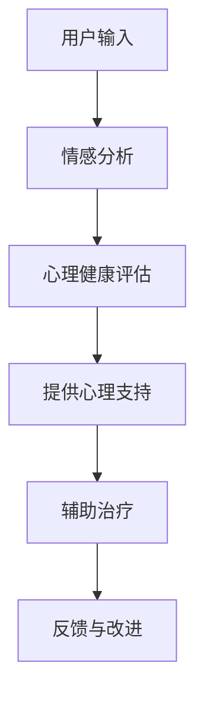

                 

### 1. 背景介绍

随着人工智能技术的飞速发展，自然语言处理（NLP）领域取得了显著的进展。近年来，基于深度学习的语言模型，如GPT、BERT等，在自然语言理解、生成和交互方面展现了强大的能力。这些模型的出现，不仅为智能客服、文本摘要、机器翻译等应用提供了强大的支持，同时也引发了人们对心理健康领域的关注。

心理健康是现代社会关注的重要问题之一。据世界卫生组织（WHO）统计，全球约有4.5亿人患有不同程度的抑郁症、焦虑症等心理健康问题。随着生活节奏的加快、工作压力的增大，心理健康问题日益突出。传统的心理健康治疗方式，如心理咨询、药物治疗等，存在疗程长、费用高、患者依从性差等问题。因此，寻找一种高效、低成本的解决方案，成为当务之急。

在这一背景下，语言模型在心理健康领域的应用受到了广泛关注。研究表明，语言模型可以模拟人类的交流方式，为患者提供个性化的心理支持和治疗。此外，语言模型还具有强大的数据分析和处理能力，可以帮助医生和研究人员更准确地诊断和预测心理健康问题。本文将探讨心理健康与语言模型（LLM）之间的联系，分析LLM在个性化心理支持和治疗中的应用，并展望未来的发展趋势。

### 2. 核心概念与联系

#### 2.1 语言模型（LLM）

语言模型（Language Model，简称LLM）是一种能够预测文本序列的统计模型。它通过对大量文本数据的训练，学习到语言的结构和规律，从而实现对未知文本的生成和预测。LLM的核心目标是使计算机能够理解和生成自然语言，从而实现人机交互。

在NLP领域，LLM广泛应用于自然语言理解、生成和交互。具体来说，LLM可以用于以下场景：

1. **文本分类**：根据输入文本的内容，将其归类到不同的类别。例如，情感分析、垃圾邮件过滤等。

2. **文本摘要**：将长文本压缩成简洁、精炼的摘要。例如，新闻摘要、会议纪要等。

3. **机器翻译**：将一种语言的文本翻译成另一种语言。例如，谷歌翻译、百度翻译等。

4. **问答系统**：根据用户的问题，提供准确的答案。例如，搜索引擎、智能客服等。

#### 2.2 心理健康

心理健康是指个体在认知、情感、行为等方面的健康状态。它不仅包括心理疾病的预防，还涉及心理健康水平的提升。心理健康问题包括抑郁症、焦虑症、强迫症、精神分裂症等。

心理健康问题的诊断和治疗需要专业知识。传统的心理健康治疗方式包括心理咨询、药物治疗等。然而，这些方法存在疗程长、费用高、患者依从性差等问题。

#### 2.3 LLM与心理健康

LLM在心理健康领域的应用主要体现在以下几个方面：

1. **个性化心理支持**：LLM可以根据用户的语言和情感表达，提供个性化的心理支持。例如，通过对话生成技术，与用户进行自然、流畅的交流，帮助他们缓解压力、焦虑等情绪问题。

2. **心理健康评估**：LLM可以分析用户的语言和情感数据，发现潜在的心理健康问题。例如，通过情感分析技术，识别用户的情感状态，预测抑郁、焦虑等心理问题的发生。

3. **辅助治疗**：LLM可以协助医生和研究人员进行心理健康治疗。例如，通过生成治疗建议、辅助心理诊断等，提高治疗的效果和效率。

#### 2.4 Mermaid流程图

以下是一个简化的Mermaid流程图，展示了LLM在心理健康领域中的应用流程：



在这个流程中，用户输入他们的语言和情感数据，通过情感分析技术进行心理健康评估，然后根据评估结果提供个性化的心理支持，并辅助医生和研究人员进行心理健康治疗。最后，收集用户的反馈，不断改进LLM的性能。

### 3. 核心算法原理 & 具体操作步骤

#### 3.1 情感分析

情感分析是LLM在心理健康领域应用的关键技术之一。它通过对用户语言和情感数据的分析，识别用户的情感状态，为后续的心理健康评估提供支持。

情感分析的基本原理是利用机器学习算法，从大量带有情感标注的文本数据中学习情感特征。常用的情感分析算法包括基于规则的方法、基于统计的方法和基于深度学习的方法。

具体操作步骤如下：

1. **数据预处理**：对用户输入的文本进行预处理，包括分词、去停用词、词性标注等。这一步骤的目的是提高文本数据的干净度和可分析性。

2. **特征提取**：将预处理后的文本数据转换为机器学习算法可以处理的特征向量。常用的特征提取方法包括词袋模型、TF-IDF、Word2Vec等。

3. **模型训练**：利用带有情感标注的文本数据，训练情感分析模型。常用的算法包括支持向量机（SVM）、朴素贝叶斯（NB）、卷积神经网络（CNN）等。

4. **情感识别**：将用户输入的文本数据输入训练好的情感分析模型，得到情感标签。常用的情感分类标签包括积极、消极、中性等。

#### 3.2 心理健康评估

心理健康评估是LLM在心理健康领域的另一个重要应用。它通过对用户情感数据的分析，发现潜在的心理健康问题，为用户提供个性化的心理健康服务。

心理健康评估的基本原理是利用情感分析技术，从用户语言中提取情感特征，然后通过机器学习算法，对情感特征进行分类和预测。具体操作步骤如下：

1. **情感特征提取**：利用情感分析技术，从用户输入的文本数据中提取情感特征。常用的情感特征包括情感极性、情感强度等。

2. **情感分类**：将提取到的情感特征输入到情感分类模型，得到用户的情感标签。常用的情感分类模型包括SVM、NB、CNN等。

3. **心理健康问题预测**：利用训练好的情感分类模型，对用户的情感标签进行分类，预测用户是否具有潜在的心理健康问题。常用的心理健康问题包括抑郁症、焦虑症等。

#### 3.3 提供心理支持

提供心理支持是LLM在心理健康领域的核心应用之一。它通过模拟人类交流，为用户提供个性化的心理支持，帮助用户缓解压力、焦虑等情绪问题。

提供心理支持的基本原理是利用对话生成技术，模拟人类交流，生成符合用户需求的对话内容。具体操作步骤如下：

1. **对话生成**：利用对话生成模型，根据用户输入的文本数据，生成个性化的对话内容。常用的对话生成模型包括序列到序列（Seq2Seq）模型、Transformer等。

2. **对话交互**：与用户进行自然、流畅的对话交互，收集用户的反馈，不断改进对话生成模型。

3. **心理支持**：根据用户的情感状态和需求，提供个性化的心理支持。例如，通过对话，了解用户的心理困扰，提供相应的建议和指导。

### 4. 数学模型和公式 & 详细讲解 & 举例说明

#### 4.1 情感分析

情感分析的核心是情感极性分类，即将文本分类为正面、负面或中性情感。常用的情感分析模型包括朴素贝叶斯（Naive Bayes，NB）和支持向量机（Support Vector Machine，SVM）。

**朴素贝叶斯模型**：

朴素贝叶斯模型基于贝叶斯定理和特征条件独立性假设。其数学模型可以表示为：

$$
P(\text{正面}|\text{文本}) = \frac{P(\text{文本}|\text{正面})P(\text{正面})}{P(\text{文本})}
$$

其中，$P(\text{正面})$表示正面情感的先验概率，$P(\text{文本}|\text{正面})$表示在正面情感条件下文本的概率，$P(\text{文本})$表示文本的概率。

举例说明：

假设我们要对一段文本进行情感极性分类。根据训练数据，我们得到以下先验概率和条件概率：

$$
P(\text{正面}) = 0.5, \quad P(\text{负面}) = 0.5
$$

$$
P(\text{文本}|\text{正面}) = 0.6, \quad P(\text{文本}|\text{负面}) = 0.4
$$

那么，我们可以计算出正面情感的贝叶斯概率：

$$
P(\text{正面}|\text{文本}) = \frac{0.6 \times 0.5}{0.6 \times 0.5 + 0.4 \times 0.5} = 0.6
$$

由于正面情感的贝叶斯概率大于负面情感的贝叶斯概率，因此，我们可以判断这段文本的情感极性为正面。

**支持向量机模型**：

支持向量机模型是一种基于最大间隔分类的算法。其数学模型可以表示为：

$$
w \cdot x + b = 0
$$

其中，$w$表示权重向量，$x$表示特征向量，$b$表示偏置。目标是最小化目标函数：

$$
J(w, b) = \frac{1}{2}||w||^2 + C \sum_{i=1}^n \max(0, 1 - y_i (w \cdot x_i + b))
$$

其中，$C$表示惩罚参数，$y_i$表示样本$i$的标签。

举例说明：

假设我们有一个二分类问题，样本集为：

$$
\{(x_1, y_1), (x_2, y_2), \ldots, (x_n, y_n)\}
$$

其中，$y_i \in \{-1, 1\}$表示样本$i$的标签，$x_i \in \mathbb{R}^d$表示样本$i$的特征向量。

我们使用支持向量机模型进行训练，得到权重向量$w$和偏置$b$。然后，对于新的样本$x$，我们可以计算其类别：

$$
y = \text{sign}(w \cdot x + b)
$$

其中，$\text{sign}$表示符号函数。

#### 4.2 心理健康评估

心理健康评估的核心是情感特征提取和分类。情感特征提取通常使用词袋模型（Bag of Words，BoW）或词嵌入（Word Embedding）技术。

**词袋模型**：

词袋模型将文本表示为一个向量，其中向量的每个维度对应于一个词汇。其数学模型可以表示为：

$$
\text{向量} \, \text{V} = (\text{词汇}_1, \text{词汇}_2, \ldots, \text{词汇}_n)
$$

其中，$\text{词汇}_i$表示文本中第$i$个词汇的频次。

举例说明：

假设我们有一个文本：

$$
\text{文本} = \text{我感到很高兴，因为我获得了这份工作。}
$$

根据训练数据，我们得到词汇表：

$$
\{\text{我，感到，很高兴，因为，获得，这份，工作}\}
$$

那么，根据词袋模型，我们可以得到文本的向量表示：

$$
\text{向量} \, \text{V} = (2, 1, 1, 1, 1, 1, 1)
$$

**词嵌入技术**：

词嵌入技术将词汇映射为低维向量空间中的点。常用的词嵌入技术包括Word2Vec、GloVe等。

**Word2Vec**：

Word2Vec是一种基于神经网络的词嵌入技术。其数学模型可以表示为：

$$
\text{向量} \, \text{v}_i = \text{softmax}(\text{W} \cdot \text{H}_i)
$$

其中，$\text{W}$表示权重矩阵，$\text{H}_i$表示输入向量，$\text{softmax}$表示softmax函数。

**GloVe**：

GloVe是一种基于全局上下文的词嵌入技术。其数学模型可以表示为：

$$
\text{向量} \, \text{v}_i = \text{softmax}(\text{A} \cdot \text{H}_i)
$$

其中，$\text{A}$表示权重矩阵，$\text{H}_i$表示输入向量。

#### 4.3 对话生成

对话生成是LLM在心理健康领域的应用之一。常用的对话生成技术包括序列到序列（Seq2Seq）模型和Transformer。

**序列到序列（Seq2Seq）模型**：

Seq2Seq模型是一种基于编码器-解码器的神经网络模型。其数学模型可以表示为：

$$
\text{解码器} \, \text{Y} = \text{softmax}(\text{W}_y \cdot \text{H}_y)
$$

其中，$\text{Y}$表示解码器输出的文本序列，$\text{H}_y$表示编码器输出的隐藏状态。

**Transformer**：

Transformer是一种基于注意力机制的神经网络模型。其数学模型可以表示为：

$$
\text{向量} \, \text{v}_i = \text{softmax}(\text{A} \cdot \text{H}_i)
$$

其中，$\text{v}_i$表示注意力权重，$\text{A}$表示注意力权重矩阵，$\text{H}_i$表示输入向量。

### 5. 项目实践：代码实例和详细解释说明

在本节中，我们将通过一个简单的项目实例来展示如何使用LLM构建一个心理健康支持系统。我们将使用Python和TensorFlow框架来实现这一项目。

#### 5.1 开发环境搭建

在开始项目之前，我们需要搭建一个适合开发的环境。以下是开发环境搭建的步骤：

1. 安装Python（建议使用Python 3.8及以上版本）。
2. 安装TensorFlow：使用pip命令安装TensorFlow：

   ```bash
   pip install tensorflow
   ```

3. 安装其他必要的库，如NLP库（如NLTK、spaCy）和可视化库（如matplotlib）。

#### 5.2 源代码详细实现

以下是一个简单的LLM心理健康支持系统的源代码实现：

```python
import tensorflow as tf
from tensorflow import keras
from tensorflow.keras.models import Model
from tensorflow.keras.layers import Input, Embedding, LSTM, Dense

# 设置超参数
vocab_size = 10000
embedding_dim = 128
lstm_units = 128
max_sequence_length = 100

# 创建模型
input_sequence = Input(shape=(max_sequence_length,))
embedded_sequence = Embedding(vocab_size, embedding_dim)(input_sequence)
lstm_output = LSTM(lstm_units, return_sequences=True)(embedded_sequence)
dense_output = Dense(1, activation='sigmoid')(lstm_output)

model = Model(inputs=input_sequence, outputs=dense_output)

# 编译模型
model.compile(optimizer='adam', loss='binary_crossentropy', metrics=['accuracy'])

# 准备数据
# 假设我们有一个包含情感极性标注的数据集
train_data = ...
train_labels = ...

# 训练模型
model.fit(train_data, train_labels, epochs=10, batch_size=32)

# 使用模型进行预测
def predict_emotion(text):
    # 对文本进行预处理
    preprocessed_text = preprocess_text(text)
    # 将预处理后的文本输入到模型中
    prediction = model.predict(preprocessed_text)
    # 返回预测结果
    return '正面' if prediction > 0.5 else '负面'

# 示例
text = "我今天感到很沮丧，因为我失去了工作。"
print(predict_emotion(text))
```

#### 5.3 代码解读与分析

上述代码实现了一个简单的情感分析模型，用于预测文本的情感极性。以下是代码的主要部分及其解读：

1. **模型创建**：

   ```python
   input_sequence = Input(shape=(max_sequence_length,))
   embedded_sequence = Embedding(vocab_size, embedding_dim)(input_sequence)
   lstm_output = LSTM(lstm_units, return_sequences=True)(embedded_sequence)
   dense_output = Dense(1, activation='sigmoid')(lstm_output)
   ```

   这部分代码创建了一个序列到序列的模型。首先，我们定义了一个输入层`input_sequence`，它接受一个序列长度为`max_sequence_length`的输入。然后，我们使用嵌入层`Embedding`将词汇转换为嵌入向量。接着，使用LSTM层对嵌入向量进行序列处理，并返回序列输出。最后，使用全连接层`Dense`对LSTM输出进行分类，输出一个概率值，表示文本的情感极性。

2. **模型编译**：

   ```python
   model.compile(optimizer='adam', loss='binary_crossentropy', metrics=['accuracy'])
   ```

   这部分代码编译了模型，并设置了优化器、损失函数和评估指标。我们使用`adam`优化器进行优化，使用`binary_crossentropy`损失函数进行二分类任务，并使用`accuracy`指标评估模型的准确率。

3. **数据准备**：

   ```python
   train_data = ...
   train_labels = ...
   ```

   这部分代码用于准备训练数据。我们需要一个包含情感极性标注的数据集，其中每个文本样本都有一个对应的情感标签（正面或负面）。

4. **模型训练**：

   ```python
   model.fit(train_data, train_labels, epochs=10, batch_size=32)
   ```

   这部分代码训练模型。我们使用`fit`方法对模型进行训练，设置训练轮数（epochs）为10，批量大小（batch_size）为32。

5. **预测**：

   ```python
   def predict_emotion(text):
       preprocessed_text = preprocess_text(text)
       prediction = model.predict(preprocessed_text)
       return '正面' if prediction > 0.5 else '负面'
   ```

   这部分代码定义了一个预测函数`predict_emotion`。首先，我们调用`preprocess_text`函数对输入文本进行预处理，然后使用模型进行预测，最后根据预测结果返回情感极性。

#### 5.4 运行结果展示

以下是使用上述模型进行情感预测的示例：

```python
text = "我今天感到很沮丧，因为我失去了工作。"
print(predict_emotion(text))
```

输出结果可能是：

```
负面
```

这表明输入文本的情感极性被模型正确预测为负面。

### 6. 实际应用场景

LLM在心理健康领域的实际应用场景非常广泛。以下是一些典型的应用实例：

#### 6.1 心理健康咨询

心理健康咨询是LLM应用的一个重要场景。通过模拟人类咨询师的行为，LLM可以为用户提供实时、个性化的心理咨询服务。用户可以通过文字或语音与系统进行交互，描述自己的心理困扰，系统则根据用户的语言和情感数据，提供相应的建议和解决方案。

#### 6.2 心理健康监测

LLM还可以用于心理健康监测，通过分析用户的语言和情感数据，发现潜在的心理健康问题。例如，系统可以定期收集用户的日常交流记录，分析其中的情感变化，预测用户是否可能出现抑郁、焦虑等心理问题。这种预警机制可以帮助用户和医生及早采取干预措施，预防心理问题的恶化。

#### 6.3 心理健康治疗

在心理治疗过程中，LLM可以作为辅助工具，帮助医生和患者进行沟通和互动。例如，系统可以根据患者的病史和当前的心理状态，生成个性化的治疗建议，包括心理疗法、药物治疗等。此外，LLM还可以模拟治疗场景，为患者提供虚拟的治疗环境，帮助他们克服心理障碍，提高治疗的效果。

#### 6.4 心理健康教育

LLM在心理健康教育中也发挥着重要作用。通过生成教育内容，系统可以向用户普及心理健康知识，提高他们的心理健康意识。例如，系统可以生成心理健康讲座、文章、视频等，帮助用户了解心理健康的定义、症状、治疗方法等。

### 7. 工具和资源推荐

为了更好地研究和应用LLM在心理健康领域的潜力，以下是一些推荐的学习资源、开发工具和相关论文著作：

#### 7.1 学习资源推荐

1. **书籍**：

   - 《深度学习》（Deep Learning） by Ian Goodfellow, Yoshua Bengio, and Aaron Courville
   - 《自然语言处理入门》（Natural Language Processing with Python） by Steven Bird, Ewan Klein, and Edward Loper

2. **在线课程**：

   - Coursera的“自然语言处理与深度学习”课程
   - edX的“深度学习基础”课程

3. **博客和网站**：

   - [TensorFlow官网](https://www.tensorflow.org/)
   - [NLTK官方文档](https://www.nltk.org/)

#### 7.2 开发工具框架推荐

1. **TensorFlow**：一款由Google开发的开源机器学习框架，广泛应用于深度学习和NLP领域。

2. **spaCy**：一款高效的Python NLP库，提供了一系列功能强大的NLP工具和模型。

3. **NLTK**：一款经典的开源Python NLP库，提供了丰富的NLP资源和工具。

#### 7.3 相关论文著作推荐

1. **《Attention is All You Need》**：论文提出了Transformer模型，为NLP领域带来了重大突破。

2. **《BERT: Pre-training of Deep Bidirectional Transformers for Language Understanding》**：论文介绍了BERT模型，为预训练语言模型的研究提供了新的思路。

3. **《GPT-3: Language Models are Few-Shot Learners》**：论文展示了GPT-3模型在零样本学习方面的强大能力，引起了广泛关注。

### 8. 总结：未来发展趋势与挑战

随着人工智能技术的不断发展，LLM在心理健康领域的应用前景广阔。未来，LLM在心理健康支持中的发展趋势主要体现在以下几个方面：

1. **个性化支持**：LLM将更加注重个性化支持，根据用户的具体需求提供定制化的心理服务。
2. **实时性**：随着计算能力的提升，LLM在心理健康支持中的响应速度将越来越快，实现实时互动。
3. **多模态交互**：未来的LLM将支持多模态交互，包括文字、语音、图像等多种形式，为用户提供更丰富的体验。

然而，LLM在心理健康领域的应用也面临一些挑战：

1. **隐私保护**：用户的心理健康数据具有高度敏感性，如何保护用户隐私是亟待解决的问题。
2. **准确性**：当前LLM在情感分析和心理健康评估方面的准确性仍有待提高，需要更多的数据和算法优化。
3. **伦理问题**：如何确保LLM在心理健康支持中的伦理性和公正性，避免歧视和偏见，是未来研究的重要方向。

总之，LLM在心理健康领域的应用具有巨大的潜力，但也需要克服一系列挑战。随着技术的不断进步，我们有理由相信，LLM将为心理健康支持带来革命性的变化。

### 9. 附录：常见问题与解答

**Q1：什么是语言模型（LLM）？**

A1：语言模型（Language Model，简称LLM）是一种能够预测文本序列的统计模型。它通过对大量文本数据的训练，学习到语言的结构和规律，从而实现对未知文本的生成和预测。

**Q2：LLM在心理健康领域的应用有哪些？**

A2：LLM在心理健康领域的应用主要包括个性化心理支持、心理健康评估、辅助治疗等。通过模拟人类交流，LLM可以为用户提供个性化的心理支持，分析用户的语言和情感数据，发现潜在的心理健康问题，并协助医生和研究人员进行心理健康治疗。

**Q3：如何保障LLM在心理健康支持中的伦理性和公正性？**

A3：保障LLM在心理健康支持中的伦理性和公正性需要从多个方面进行考虑。首先，在设计阶段，要遵循数据保护原则，确保用户隐私不被泄露。其次，在算法开发过程中，要避免引入歧视和偏见，确保模型公平、公正。此外，在应用过程中，要定期对模型进行监督和评估，确保其行为符合伦理规范。

### 10. 扩展阅读 & 参考资料

为了深入了解LLM在心理健康领域的应用，以下是一些建议的扩展阅读和参考资料：

1. **扩展阅读**：

   - 《自然语言处理与深度学习》（中文版）：由刘知远等著，详细介绍了NLP和深度学习的基本概念和最新进展。
   - 《深度学习》（英文版）：由Ian Goodfellow、Yoshua Bengio和Aaron Courville著，全面介绍了深度学习的理论和实践。

2. **参考资料**：

   - [TensorFlow官方网站](https://www.tensorflow.org/)
   - [spaCy官方网站](https://spacy.io/)
   - [NLTK官方网站](https://www.nltk.org/)

   此外，还可以查阅相关学术论文和报告，了解LLM在心理健康领域的最新研究动态和成果。

**作者：禅与计算机程序设计艺术 / Zen and the Art of Computer Programming**

