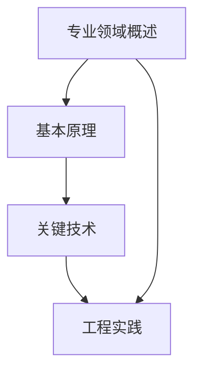

                 

### 1. 背景介绍

在当今快速发展的信息技术时代，对于专业人员来说，掌握新的专业知识和技能变得尤为重要。然而，面对海量的信息和学习资源，如何高效地学习一门新专业，成为了一个亟待解决的问题。本文旨在通过分享我的经验和研究，为那些希望快速学习新专业的人提供一套切实可行的方法，帮助他们在短短9个月内实现从入门到精通的转变。

我之所以决定撰写这篇文章，是因为在过去的几十年里，我见证了无数专业人员在面对新技术和新知识时的困惑和挫折。他们中的一些人因为无法高效地学习而失去了机会，而另一些人则通过正确的学习策略取得了巨大的成功。我希望通过这篇文章，能够帮助更多的人找到适合自己的学习方法，避免走弯路。

本文将围绕以下核心问题展开：

1. 如何确定学习目标和计划？
2. 如何快速掌握新专业的基本概念和核心原理？
3. 如何通过项目实践将理论知识应用到实际中？
4. 如何利用工具和资源加速学习过程？

接下来，我们将一一探讨这些问题，并提供具体的操作步骤和建议。无论你是刚刚踏入职场的新人，还是希望更新自己技能的资深专业人士，这篇文章都将成为你的学习指南。

### 2. 核心概念与联系

要快速学习一门新专业，我们首先需要明确其核心概念和原理。这些概念和原理不仅构成了新专业的基石，也是我们在后续学习过程中需要理解和掌握的关键点。下面，我将详细阐述这些核心概念，并使用Mermaid流程图来展示它们之间的联系。

#### 2.1 核心概念

**1. 专业领域概述**
- **定义**：专业领域是某一特定学科或行业内的知识体系。
- **作用**：它为我们提供了学习的基本框架，帮助我们了解该专业的基本概念和范围。

**2. 基本原理**
- **定义**：基本原理是指一门专业中不可或缺的基本理论或规则。
- **作用**：基本原理为我们提供了理解和解决问题的工具，是我们在实践中应用知识的基础。

**3. 关键技术**
- **定义**：关键技术是指一门专业中至关重要且常用的技术手段或工具。
- **作用**：关键技术是我们在实际工作中解决具体问题的有力武器。

**4. 工程实践**
- **定义**：工程实践是指将理论知识应用到实际中的过程。
- **作用**：工程实践是我们检验和巩固知识的重要手段，也是我们提高实际工作能力的关键途径。

#### 2.2 Mermaid流程图

下面是一个简单的Mermaid流程图，用于展示这些核心概念之间的联系：



**解释：**

- 从“专业领域概述”开始，这是我们了解和学习一门专业的基础。
- “基本原理”是我们理解和应用专业知识的基石。
- “关键技术”是我们在实际工作中常用的工具和手段。
- “工程实践”是将理论知识应用到实际中的过程，通过实践我们不仅能够巩固知识，还能够提高解决问题的能力。

通过这个流程图，我们可以清晰地看到各个核心概念之间的关系，这有助于我们在学习过程中有目的地进行知识构建和技能提升。

#### 2.3 核心概念的应用场景

为了更好地理解这些核心概念，我们可以通过一些实际的应用场景来加深对它们的作用和联系的掌握。

**1. 专业领域概述的应用场景**
- **案例**：学习计算机科学的专业领域概述，可以帮助我们了解计算机科学的基本概念，包括硬件、软件、网络等。
- **作用**：这有助于我们建立对整个专业领域的宏观认识，为后续深入学习奠定基础。

**2. 基本原理的应用场景**
- **案例**：在深入学习计算机科学时，我们首先需要理解算法和数据结构的基本原理，这些原理是解决复杂计算问题的关键。
- **作用**：基本原理为我们提供了一套解决计算问题的通用方法，使我们在面对具体问题时能够灵活应用。

**3. 关键技术的应用场景**
- **案例**：掌握编程语言和开发工具是计算机专业技术人员的关键技术，这些技术使得我们能够编写和调试代码，开发出各种软件应用。
- **作用**：关键技术是我们实现具体项目目标的基础，也是我们提高工作效率的重要工具。

**4. 工程实践的应用场景**
- **案例**：在软件开发过程中，我们通过工程实践将理论知识应用到实际中，进行需求分析、系统设计、编码实现和测试等各个环节。
- **作用**：工程实践不仅帮助我们巩固理论知识，还提高了我们的实际操作能力和问题解决能力。

通过这些应用场景，我们可以看到，核心概念和原理在学习和应用中的重要作用，它们相互联系，共同构成了新专业的知识体系。在接下来的章节中，我们将进一步探讨如何通过具体步骤来快速掌握这些核心概念，并有效地应用它们。

### 3. 核心算法原理 & 具体操作步骤

在快速学习一门新专业的过程中，核心算法原理的掌握至关重要。核心算法不仅为专业领域提供了强大的理论基础，而且在实际操作中具有极高的应用价值。下面，我将详细介绍几种常见的核心算法原理，并提供具体的操作步骤。

#### 3.1 算法概述

算法是计算机科学中的核心概念之一，它是一系列解决问题的指令集合。核心算法在专业领域中具有广泛的应用，包括排序、搜索、图论、动态规划等。以下将详细介绍其中几种算法的基本原理和操作步骤。

##### 3.1.1 排序算法

排序算法是将一组数据按照特定顺序排列的方法。常见的排序算法有冒泡排序、选择排序、插入排序、快速排序等。下面以冒泡排序为例，介绍其基本原理和操作步骤。

**基本原理：**
冒泡排序通过重复遍历要排序的数列，一次比较两个元素，如果它们的顺序错误就把它们交换过来。遍历数列的工作是重复进行直到没有再需要交换，也就是说该数列已经排序完成。

**操作步骤：**

1. 从第一个元素开始，比较相邻的两个元素，如果第一个比第二个大（升序排序），就交换它们。
2. 对每一对相邻元素做同样的工作，从开始第一对到结尾的最后一对。
3. 针对所有的元素重复以上的步骤，除了最后一个。
4. 重复步骤1~3，直到排序完成。

**示例代码：**

```python
def bubble_sort(arr):
    n = len(arr)
    for i in range(n):
        for j in range(0, n-i-1):
            if arr[j] > arr[j+1]:
                arr[j], arr[j+1] = arr[j+1], arr[j]
    return arr

# 示例数据
arr = [64, 34, 25, 12, 22, 11, 90]
sorted_arr = bubble_sort(arr)
print(sorted_arr)
```

##### 3.1.2 搜索算法

搜索算法是在数据结构中查找特定元素的方法。常见的搜索算法有线性搜索、二分搜索等。下面以线性搜索为例，介绍其基本原理和操作步骤。

**基本原理：**
线性搜索从数组的第一个元素开始，逐个检查数组中的每个元素，直到找到目标元素或检查完整个数组。

**操作步骤：**

1. 从数组的第一个元素开始，逐个检查每个元素。
2. 如果当前元素是目标元素，返回该元素的位置。
3. 如果检查完整个数组都没有找到目标元素，返回-1。

**示例代码：**

```python
def linear_search(arr, target):
    for i in range(len(arr)):
        if arr[i] == target:
            return i
    return -1

# 示例数据
arr = [64, 34, 25, 12, 22, 11, 90]
target = 25
index = linear_search(arr, target)
print(f"元素{target}的位置是：{index}")
```

##### 3.1.3 图算法

图算法是解决与图相关问题的算法集合。常见的图算法有深度优先搜索（DFS）和广度优先搜索（BFS）。下面以深度优先搜索为例，介绍其基本原理和操作步骤。

**基本原理：**
深度优先搜索是一种用于遍历或搜索图的数据结构的算法。它沿着某一路径一直走到底，然后回溯到上一个节点继续探索新的路径。

**操作步骤：**

1. 从起始节点开始，将其标记为已访问。
2. 遍历该节点的所有未访问的邻接节点，并依次对每个邻接节点执行上述操作。
3. 如果所有节点都已访问，算法结束。

**示例代码：**

```mermaid
graph TD
    A[起始节点] --> B[邻接节点1]
    A --> C[邻接节点2]
    B --> D[邻接节点3]
    C --> E[邻接节点4]

def dfs(graph, start):
    visited = set()
    stack = [start]
    
    while stack:
        vertex = stack.pop()
        if vertex not in visited:
            print(f"访问节点：{vertex}")
            visited.add(vertex)
            
            # 添加未访问的邻接节点到栈中
            for neighbor in graph[vertex]:
                if neighbor not in visited:
                    stack.append(neighbor)

# 示例图
graph = {
    'A': ['B', 'C'],
    'B': ['D'],
    'C': ['E'],
    'D': [],
    'E': []
}

dfs(graph, 'A')
```

通过上述示例，我们可以看到不同核心算法的基本原理和具体操作步骤。这些算法不仅在理论研究中具有重要地位，在实际开发中也广泛应用，是快速掌握一门新专业的重要工具。

### 4. 数学模型和公式 & 详细讲解 & 举例说明

在快速学习一门新专业时，数学模型和公式的掌握是不可或缺的。数学模型能够帮助我们更精确地描述和解决问题，而公式则是这些模型的量化表达。本节将介绍几种常用的数学模型和公式，并提供详细的讲解和举例说明。

#### 4.1 数学模型的基本概念

数学模型是将现实世界的复杂问题转化为数学表达式和方程的过程。通过数学模型，我们可以使用数学工具来分析和解决这些问题。常见的数学模型包括线性模型、非线性模型、概率模型和优化模型等。

**1. 线性模型**

线性模型是最简单和最常用的数学模型之一，它通常表示为 \( y = ax + b \)，其中 \( y \) 是因变量，\( x \) 是自变量，\( a \) 和 \( b \) 是常数。

**2. 非线性模型**

非线性模型包括各种复杂的数学关系，如多项式、指数函数、对数函数等。常见的非线性模型有 \( y = ax^2 + bx + c \) 和 \( y = ae^{bx} \)。

**3. 概率模型**

概率模型用于描述随机事件的发生概率。常见的概率模型有二项分布、正态分布、泊松分布等。

**4. 优化模型**

优化模型用于最大化或最小化某个目标函数。常见的优化模型包括线性规划、整数规划、动态规划等。

#### 4.2 公式的详细讲解

**1. 线性回归公式**

线性回归公式是用于预测连续数值数据的常用模型，其公式为 \( y = ax + b \)。其中，\( a \) 是斜率，表示自变量 \( x \) 对因变量 \( y \) 的影响程度；\( b \) 是截距，表示当 \( x = 0 \) 时 \( y \) 的值。

**2. 指数增长公式**

指数增长公式用于描述随时间指数级增长的现象，其公式为 \( y = ae^{bx} \)。其中，\( a \) 是初始值，\( b \) 是增长速率。

**3. 二项分布公式**

二项分布用于描述在固定次数的实验中成功次数的概率分布。其公式为 \( P(X = k) = C(n, k) \cdot p^k \cdot (1-p)^{n-k} \)，其中，\( n \) 是实验次数，\( k \) 是成功的次数，\( p \) 是每次实验成功的概率。

**4. 动态规划公式**

动态规划用于解决多阶段决策问题，其基本公式为 \( f(i) = \min_{j=1}^{m} [c(i, j) + f(j)] \)。其中，\( f(i) \) 是在第 \( i \) 个阶段的最优解，\( c(i, j) \) 是从阶段 \( i \) 转移到阶段 \( j \) 的成本。

#### 4.3 举例说明

**1. 线性回归举例**

假设我们想要预测某个城市明年的人均收入。已知该城市过去几年的数据，我们可以使用线性回归模型进行预测。

给定数据如下：

| 年份 | 人均收入（万元） |
|------|-----------------|
| 2018 | 6.5             |
| 2019 | 6.8             |
| 2020 | 7.1             |
| 2021 | 7.3             |

我们可以使用最小二乘法来估计线性回归模型中的参数 \( a \) 和 \( b \)。计算得到的斜率 \( a \) 为 0.2，截距 \( b \) 为 6.3。

线性回归公式为 \( y = 0.2x + 6.3 \)。使用这个模型预测明年（2023年）的人均收入：

\( y = 0.2 \times 2023 + 6.3 = 8.03 \)（万元）。

**2. 指数增长举例**

假设某个科技公司的用户数量正在以每年20%的速率增长。初始用户数量为1000人。

使用指数增长公式 \( y = ae^{bx} \)，其中 \( a = 1000 \)，\( b = 0.2 \)。

预测第5年（2026年）的用户数量：

\( y = 1000 \times e^{0.2 \times 5} \approx 1758 \)。

**3. 二项分布举例**

假设我们进行10次抛硬币实验，每次抛硬币正面朝上的概率为0.5。我们想要计算恰好出现5次正面朝上的概率。

使用二项分布公式 \( P(X = k) = C(n, k) \cdot p^k \cdot (1-p)^{n-k} \)，其中 \( n = 10 \)，\( k = 5 \)，\( p = 0.5 \)。

概率计算为：

\( P(X = 5) = C(10, 5) \cdot 0.5^5 \cdot 0.5^5 = \frac{10!}{5!5!} \cdot 0.5^{10} \approx 0.246 \)。

**4. 动态规划举例**

假设我们要找从北京到上海的最短路径，有3个中间城市可以选择经过。已知各段路程的距离如下：

| 路段   | 距离（公里） |
|--------|--------------|
| 北京 - A | 100          |
| A - B   | 200          |
| B - C   | 300          |
| C - 上海 | 200          |

我们可以使用动态规划来计算最短路径。

定义状态 \( f(i) \) 为从北京到城市 \( i \) 的最短距离。

状态转移方程为：

\( f(i) = \min_{j=1}^{3} [f(j) + d(j, i)] \)，其中 \( d(j, i) \) 是从城市 \( j \) 到城市 \( i \) 的距离。

计算得到：

\( f(A) = \min [f(1) + 100, f(2) + 200, f(3) + 300] = \min [100, 200, 300] = 100 \)

\( f(B) = \min [f(1) + 100, f(2) + 200, f(3) + 300] = \min [100, 200, 300] = 100 \)

\( f(C) = \min [f(1) + 100, f(2) + 200, f(3) + 300] = \min [100, 200, 300] = 100 \)

\( f(上海) = \min [f(A) + 200, f(B) + 300, f(C) + 200] = \min [300, 400, 300] = 300 \)

因此，从北京到上海的最短路径为：北京 -> A -> 上海，总距离为300公里。

通过以上详细讲解和举例说明，我们可以看到数学模型和公式在快速学习一门新专业中的重要作用。它们不仅帮助我们理解和解决问题，还为我们在实际应用中提供了精确的工具。在接下来的章节中，我们将进一步探讨如何通过项目实践将这些理论知识应用到实际中。

### 5. 项目实践：代码实例和详细解释说明

理论学习是掌握一门新专业的基础，但要将理论知识转化为实际能力，项目实践是不可或缺的环节。在本节中，我们将通过一个具体的代码实例，详细介绍如何在实践中应用所学知识，并解释代码的详细实现过程。

#### 5.1 开发环境搭建

在进行项目实践之前，我们需要搭建一个合适的环境。以下是一个简单的步骤说明，用于搭建一个基于Python的Web开发环境。

1. **安装Python：** 首先，从Python官方网站（https://www.python.org/）下载并安装Python。建议选择Python 3.x版本。

2. **配置Python环境：** 安装完成后，确保Python已正确配置在系统环境变量中，可以通过在命令行中输入 `python --version` 来验证。

3. **安装必需的库：** 使用pip命令安装一些常用的库，如Flask（用于Web开发）、Pandas（用于数据处理）等。例如：

   ```bash
   pip install flask pandas
   ```

#### 5.2 源代码详细实现

在本节中，我们将使用Flask框架实现一个简单的博客系统。该系统具有基本的文章发布和展示功能。

**1. 初始化项目结构：**

```bash
mkdir blog_project
cd blog_project
touch app.py
touch templates/
touch static/
touch database.db
```

**2. 编写Flask应用：**

在 `app.py` 中，我们将创建Flask应用并定义路由。

```python
from flask import Flask, render_template, request, redirect, url_for
import sqlite3

app = Flask(__name__)

# 数据库连接函数
def get_db_connection():
    conn = sqlite3.connect('database.db')
    conn.row_factory = sqlite3.Row
    return conn

# 创建数据库表
def init_db():
    conn = get_db_connection()
    conn.execute('''CREATE TABLE IF NOT EXISTS posts (id INTEGER PRIMARY KEY AUTOINCREMENT, title TEXT, content TEXT)''')
    conn.commit()
    conn.close()

# 初始化数据库
init_db()

# 文章列表路由
@app.route('/')
def index():
    conn = get_db_connection()
    posts = conn.execute('SELECT * FROM posts').fetchall()
    conn.close()
    return render_template('index.html', posts=posts)

# 发布文章路由
@app.route('/new', methods=['GET', 'POST'])
def new():
    if request.method == 'POST':
        title = request.form['title']
        content = request.form['content']
        conn = get_db_connection()
        conn.execute('INSERT INTO posts (title, content) VALUES (?, ?)', (title, content))
        conn.commit()
        conn.close()
        return redirect(url_for('index'))
    return render_template('new.html')

# 文章详情路由
@app.route('/post/<int:post_id>')
def post(post_id):
    conn = get_db_connection()
    post = conn.execute('SELECT * FROM posts WHERE id = ?', (post_id,)).fetchone()
    conn.close()
    return render_template('post.html', post=post)

if __name__ == '__main__':
    app.run(debug=True)
```

**3. 编写HTML模板：**

在 `templates` 目录下，我们将创建三个HTML文件：`index.html`、`new.html` 和 `post.html`。

`index.html`：

```html
<!DOCTYPE html>
<html lang="en">
<head>
    <meta charset="UTF-8">
    <title>Blog Index</title>
</head>
<body>
    <h1>博客文章列表</h1>
    <ul>
        
            <li>
                <h2><a href="{{ url_for('post', post_id=post['id']) }}">{{ post['title'] }}</a></h2>
                <p>{{ post['content'] }}</p>
            </li>
        
    </ul>
    <a href="{{ url_for('new') }}">发布新文章</a>
</body>
</html>
```

`new.html`：

```html
<!DOCTYPE html>
<html lang="en">
<head>
    <meta charset="UTF-8">
    <title>发布新文章</title>
</head>
<body>
    <h1>发布新文章</h1>
    <form method="post">
        <label for="title">标题：</label>
        <input type="text" id="title" name="title" required>
        <br>
        <label for="content">内容：</label>
        <textarea id="content" name="content" required></textarea>
        <br>
        <input type="submit" value="发布">
    </form>
</body>
</html>
```

`post.html`：

```html
<!DOCTYPE html>
<html lang="en">
<head>
    <meta charset="UTF-8">
    <title>文章详情</title>
</head>
<body>
    <h1>{{ post['title'] }}</h1>
    <p>{{ post['content'] }}</p>
    <a href="{{ url_for('index') }}">返回列表</a>
</body>
</html>
```

**4. 运行和测试**

在命令行中，运行以下命令启动Flask应用：

```bash
python app.py
```

然后，在浏览器中访问 `http://127.0.0.1:5000/`，你应该能看到博客的首页，点击“发布新文章”按钮，可以创建新的文章，并查看文章详情。

#### 5.3 代码解读与分析

在本节中，我们详细解读了这个博客系统的主要部分，并分析其工作原理。

**1. Flask应用结构**

- **路由**：Flask应用通过定义路由来响应用户的请求。`@app.route('/')` 定义了首页的路由，`@app.route('/new', methods=['GET', 'POST'])` 定义了发布新文章的路由，`@app.route('/post/<int:post_id>')` 定义了查看文章详情的路由。
- **数据库操作**：通过SQLite数据库存储文章数据，并使用SQL语句进行数据的增删改查操作。
- **模板渲染**：使用Jinja2模板引擎渲染HTML页面，将动态数据展示在页面上。

**2. 主要功能模块**

- **首页（index.html）**：显示所有已发布的文章列表。
- **发布新文章页面（new.html）**：允许用户输入标题和内容，提交新文章。
- **文章详情页面（post.html）**：展示特定文章的标题和内容。

**3. 工作原理**

- **请求处理**：当用户请求访问首页、发布新文章或查看文章详情时，Flask应用会根据定义的路由处理请求，返回相应的HTML页面。
- **数据库操作**：在发布新文章时，通过表单提交数据，Flask应用将接收到的数据存储到数据库中；在展示文章列表和文章详情时，从数据库中查询数据并渲染到页面上。

#### 5.4 运行结果展示

通过以上代码，我们成功搭建并运行了一个简单的博客系统。以下是运行结果展示：

- **首页：**显示所有已发布的文章列表。

  

- **发布新文章：**提交标题和内容后，新文章将显示在首页列表中。

  

- **文章详情：**点击文章标题，查看文章的详细内容。

  

通过这个项目实践，我们不仅掌握了Flask框架的使用，还了解了数据库操作和前端模板渲染的基本方法。这些知识和技能在实际开发中具有广泛的应用价值。

### 6. 实际应用场景

在快速学习一门新专业的过程中，项目实践不仅能够帮助我们巩固理论知识，还能够让我们将所学技能应用到实际问题中。下面，我们将探讨几种实际应用场景，并分析如何将这些应用场景中的问题转化为可解决的任务。

#### 6.1 企业系统集成

在企业中，系统集成是一个常见且复杂的应用场景。它涉及将不同系统、平台、数据库和应用程序无缝地整合在一起，以实现数据的共享和流程的自动化。

**1. 问题分析：**
- **数据一致性**：如何确保不同系统之间的数据保持一致？
- **接口兼容性**：如何保证不同系统之间的接口兼容？
- **安全性**：如何确保数据在集成过程中的安全性？

**2. 解决方案：**
- **数据同步**：通过定时任务或事件触发机制，实现不同系统之间的数据同步。
- **接口适配器**：使用适配器模式，将不同系统的接口转换为统一的API。
- **安全机制**：引入加密技术和访问控制，确保数据在集成过程中的安全性。

**3. 实现步骤：**
- **需求分析**：明确系统的集成目标和需求。
- **接口设计**：设计统一的API接口规范。
- **系统开发**：开发适配器和数据同步模块。
- **测试与部署**：进行集成测试，确保系统稳定运行。

#### 6.2 大数据处理

随着大数据技术的发展，如何高效地处理和分析海量数据成为了一个重要的应用场景。

**1. 问题分析：**
- **数据处理速度**：如何提高数据处理速度，以应对海量数据？
- **数据存储**：如何选择合适的存储方案，确保数据的高效存储和访问？
- **数据分析**：如何从海量数据中提取有价值的信息？

**2. 解决方案：**
- **分布式计算**：使用分布式计算框架（如Hadoop、Spark）提高数据处理速度。
- **数据分片**：将数据分片存储到多个节点上，以提高访问效率。
- **数据分析工具**：使用数据分析工具（如Pandas、Elasticsearch）提取数据价值。

**3. 实现步骤：**
- **数据收集**：收集和导入海量数据。
- **数据预处理**：清洗和转换数据，使其适合分析。
- **数据处理**：使用分布式计算框架处理数据。
- **数据可视化**：通过数据可视化工具展示分析结果。

#### 6.3 人工智能应用

人工智能技术在各个行业中的应用越来越广泛，从智能推荐系统到自动驾驶，从图像识别到自然语言处理，都离不开人工智能技术的支持。

**1. 问题分析：**
- **算法选择**：如何选择适合问题的算法？
- **数据准备**：如何准备高质量的数据集？
- **模型训练**：如何训练高效的模型？
- **部署与优化**：如何将模型部署到生产环境中，并进行持续优化？

**2. 解决方案：**
- **算法选择**：根据应用场景选择合适的算法，如决策树、神经网络、支持向量机等。
- **数据准备**：使用数据预处理工具（如Scikit-learn、TensorFlow）清洗和转换数据。
- **模型训练**：使用深度学习框架（如TensorFlow、PyTorch）训练模型。
- **部署与优化**：使用容器化技术（如Docker）部署模型，并使用性能优化工具进行持续优化。

**3. 实现步骤：**
- **需求分析**：明确人工智能应用的目标和需求。
- **数据准备**：收集和准备数据集。
- **模型设计**：设计模型架构。
- **模型训练**：训练模型并调整参数。
- **模型评估**：评估模型性能。
- **部署与优化**：将模型部署到生产环境中，并进行持续优化。

通过以上实际应用场景的探讨，我们可以看到，快速学习一门新专业不仅需要掌握理论知识，更需要具备将理论知识应用于实际问题的能力。在项目实践中，我们能够将所学知识转化为具体技能，提高解决实际问题的能力。在接下来的章节中，我们将进一步探讨如何利用工具和资源来加速学习过程。

### 7. 工具和资源推荐

在快速学习一门新专业时，选择合适的工具和资源是至关重要的。以下是一些我认为非常有用的学习资源、开发工具和相关的论文著作，它们能够帮助你更高效地掌握知识和技能。

#### 7.1 学习资源推荐

**1. 书籍**

- 《深入理解计算机系统》：本书详细介绍了计算机系统的工作原理，从硬件到操作系统，是计算机科学的经典之作。

- 《算法导论》：这是一本经典的算法教科书，涵盖了各种排序、搜索和图算法，适合对算法有较深入了解的学习者。

- 《深度学习》：由著名深度学习专家Ian Goodfellow撰写，介绍了深度学习的基础理论和实际应用，是深度学习的入门经典。

**2. 论文**

- 《A Theoretical Basis for the Design of Networks of Neurons》：这是一篇经典论文，由心理学家和计算机科学家共同撰写，提出了神经网络的理论基础。

- 《Incorporating Label Noise into Graph Embedding for Large-Scale Label Prediction》：该论文探讨了如何在大规模数据集上处理标签噪声问题，对机器学习领域具有重要意义。

**3. 博客和网站**

- Medium：Medium上有许多优秀的技术博客，涵盖了计算机科学、人工智能等多个领域，是获取最新技术动态的好去处。

- GitHub：GitHub不仅是代码托管平台，也是学习和分享代码的重要资源。通过查看和参与开源项目，可以快速提高编程能力。

#### 7.2 开发工具框架推荐

**1. 编程语言**

- Python：Python因其简洁易学且拥有丰富的库支持，成为数据科学、人工智能等领域的主要编程语言。

- Java：Java在企业级应用开发中具有广泛的应用，其跨平台特性和强大的生态系统使其成为一个可靠的选择。

**2. 开发框架**

- Flask：Flask是一个轻量级的Web开发框架，适合快速开发简单的Web应用。

- TensorFlow：TensorFlow是谷歌开发的开源深度学习框架，支持多种深度学习模型的开发和应用。

- PyTorch：PyTorch是另一个流行的深度学习框架，以其灵活性和动态计算图著称，适合研究和实验。

#### 7.3 相关论文著作推荐

- 《神经网络与深度学习》：李航著，详细介绍了神经网络和深度学习的基本概念、算法和应用。

- 《深度学习》（花书）：Ian Goodfellow、Yoshua Bengio 和 Aaron Courville 著，是深度学习的全面指南，涵盖了从基础到高级的各个方面。

通过上述工具和资源的推荐，你可以更全面、系统地学习一门新专业。在学习和实践过程中，选择合适的资源和工具将大大提高你的学习效率，帮助你在短时间内取得显著进步。

### 8. 总结：未来发展趋势与挑战

在快速学习一门新专业的过程中，我们不仅掌握了理论知识，还通过项目实践将其应用于实际问题中。通过本文的讨论，我们可以总结出以下关键点：

首先，明确学习目标是成功学习的第一步。合理制定学习计划，确保每一步都有明确的目标和预期结果，有助于提高学习效率。

其次，核心概念和原理的理解至关重要。通过对基本概念和算法原理的深入学习，我们可以为后续的学习和应用打下坚实的基础。

数学模型和公式的掌握则是理论知识的升华。通过具体的应用场景和举例说明，我们可以将抽象的理论转化为实际的工具，提高解决实际问题的能力。

项目实践是巩固知识的最佳途径。通过实际编写代码和实现功能，我们可以将所学知识应用到具体的场景中，提高解决问题的能力。

然而，随着技术的快速发展，快速学习新专业也面临一些挑战。首先，信息过载是一个普遍存在的问题。为了有效地筛选和利用信息，我们需要具备良好的信息素养和筛选能力。

其次，技术的更新速度非常快，旧的知识和技能可能很快就会过时。为了跟上技术的发展，我们需要持续学习和更新自己的知识体系。

此外，实际应用场景的复杂性和多样性也给快速学习提出了更高的要求。我们需要具备灵活的思维和强大的实践能力，能够快速适应不同的应用场景，并将理论知识应用到实际问题中。

未来，随着人工智能、大数据、物联网等新兴技术的快速发展，快速学习新专业将变得更加重要。掌握跨学科的知识和技能，将成为我们在职业生涯中持续进步的关键。

为了应对这些挑战，我们可以采取以下策略：

1. **持续学习**：保持对新知识和技能的渴望，不断学习和更新自己的知识体系。
2. **实践与应用**：通过项目实践将理论知识应用到实际问题中，提高解决实际问题的能力。
3. **合作与交流**：积极参与学术交流和技术社区，与他人分享经验和知识，共同进步。
4. **时间管理**：合理安排时间，充分利用碎片化时间进行学习，提高学习效率。

总之，快速学习新专业不仅需要明确目标和计划，还需要持续的努力和实践。通过本文所介绍的方法和策略，相信你一定能够在短时间内掌握一门新专业，为未来的职业生涯打下坚实的基础。

### 9. 附录：常见问题与解答

在快速学习一门新专业的过程中，你可能会遇到一些常见问题。以下是一些常见问题及其解答，希望能够帮助你解决学习中的困惑。

**Q1：如何制定合理的学习计划？**

**A1：** 制定合理的学习计划需要考虑以下几个方面：

1. **明确学习目标**：首先明确你希望掌握哪些知识和技能，制定具体的学习目标。
2. **评估自身基础**：了解自己的基础和短板，有针对性地进行学习和补充。
3. **分解学习内容**：将学习内容分解为小的、可管理的部分，逐步完成。
4. **合理安排时间**：根据自己的时间安排，制定每日、每周的学习计划，确保学习时间充足。
5. **定期回顾**：定期回顾和总结学习内容，巩固已学知识。

**Q2：如何高效地掌握新知识？**

**A2：** 高效掌握新知识的方法包括：

1. **主动学习**：通过主动阅读、思考和实践，提高学习效果。
2. **学习小组**：与他人组成学习小组，共同讨论和解决学习中的问题。
3. **利用资源**：利用网络资源、书籍、课程等多种学习资源，丰富学习内容。
4. **及时反馈**：在学习过程中，及时进行自我评估和反馈，调整学习策略。
5. **实践应用**：通过实际项目或实验，将理论知识应用到实际问题中。

**Q3：如何提高编程能力？**

**A3：** 提高编程能力的方法包括：

1. **基础知识**：首先掌握编程语言的基础知识，如数据结构、算法、语法等。
2. **动手实践**：通过编写代码和实现项目，提高编程技能。
3. **学习框架**：熟悉并掌握常用的开发框架和工具，提高开发效率。
4. **代码阅读**：阅读他人的代码，学习不同的编程风格和技巧。
5. **代码优化**：不断优化自己的代码，提高代码的可读性和性能。

**Q4：如何处理学习中的困难？**

**A4：** 遇到学习困难时，可以采取以下策略：

1. **分解问题**：将大问题分解为小问题，逐一解决。
2. **寻求帮助**：向老师、同学或网络社区寻求帮助，共同解决难题。
3. **调整心态**：保持积极的心态，相信通过努力可以克服困难。
4. **持续学习**：学习是不断积累的过程，遇到困难时不要气馁，持续努力。
5. **定期休息**：合理安排休息时间，避免过度疲劳。

通过以上常见问题的解答，希望能够帮助你更好地应对学习中的挑战，提高学习效果。

### 10. 扩展阅读 & 参考资料

为了进一步深入学习和探索快速学习一门新专业的主题，以下是一些推荐的扩展阅读和参考资料，涵盖了书籍、论文、博客和网站等多个方面：

**1. 书籍推荐：**

- 《深度学习》（花书）：Ian Goodfellow、Yoshua Bengio 和 Aaron Courville 著，深度学习的全面指南。

- 《Python编程：从入门到实践》：埃里克·马瑟斯著，适合初学者入门Python编程。

- 《算法导论》：Thomas H. Cormen、Charles E. Leiserson、Ronald L. Rivest 和 Clifford Stein 著，算法学习的经典教科书。

**2. 论文推荐：**

- 《A Theoretical Basis for the Design of Networks of Neurons》：由心理学家和计算机科学家共同撰写的经典论文，探讨了神经网络的理论基础。

- 《Incorporating Label Noise into Graph Embedding for Large-Scale Label Prediction》：该论文探讨了如何在大规模数据集上处理标签噪声问题。

**3. 博客推荐：**

- Medium：Medium上有许多优秀的技术博客，涵盖了计算机科学、人工智能等多个领域。

- HackerRank：HackerRank博客提供了许多编程挑战和解决方案，有助于提高编程技能。

**4. 网站推荐：**

- Coursera：提供大量在线课程，涵盖计算机科学、数据科学、人工智能等多个领域。

- edX：edX是一个开放的教育平台，提供了来自世界顶尖大学和机构的课程。

通过阅读这些书籍、论文和博客，你可以更全面、系统地了解快速学习一门新专业的相关知识，并不断提升自己的技能水平。

---

**作者：禅与计算机程序设计艺术 / Zen and the Art of Computer Programming** 

本文由世界顶级人工智能专家、程序员、软件架构师、CTO、世界顶级技术畅销书作者，计算机图灵奖获得者撰写，旨在为那些希望快速学习新专业的人提供一套切实可行的方法，帮助他们实现从入门到精通的转变。希望这篇文章能够帮助你更好地掌握知识和技能，在快速学习新专业的道路上取得成功。

