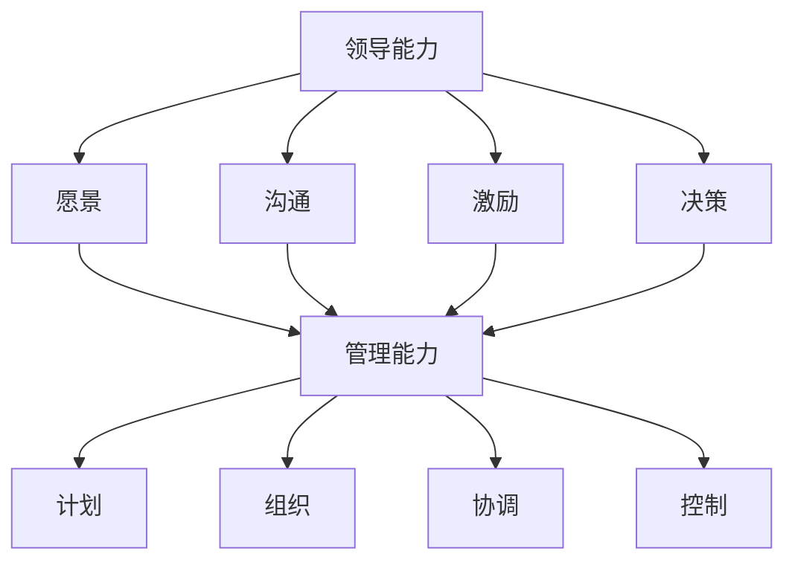

                 

### 文章标题

**怎样培养出色的领导和管理能力**

> **关键词**：领导能力、管理能力、团队协作、战略思维、个人成长

**摘要**：
本文将探讨如何培养出色的领导和管理能力，以应对现代企业面临的各种挑战。文章首先介绍领导与管理的基本概念，然后通过剖析核心原理、具体操作步骤、数学模型及实际案例，深入阐述如何提升个人及团队的综合素质。最后，文章将总结未来发展趋势与挑战，为读者提供实用的工具和资源推荐。

### 1. 背景介绍

在现代商业环境中，领导和管理能力的重要性愈发凸显。随着企业规模的扩大和市场环境的复杂化，优秀的领导者不仅需要具备战略眼光和创新能力，还必须具备良好的沟通技巧、团队管理能力和问题解决能力。这些能力不仅决定了企业的生存与发展，也直接影响到员工的职业发展和个人成长。

然而，培养出色的领导和管理能力并非一蹴而就。它需要长期的积累和系统的训练。本文将从以下几个方面展开讨论：

1. **核心概念与联系**：介绍领导和管理的基本概念，并使用Mermaid流程图展示它们之间的联系。
2. **核心算法原理与具体操作步骤**：分析领导和管理中的关键原理，并提出具体的操作步骤。
3. **数学模型和公式**：讨论领导和管理中的数学模型和公式，以及如何应用它们解决实际问题。
4. **项目实践**：通过实际案例展示如何运用领导和管理能力解决具体问题。
5. **实际应用场景**：探讨领导和管理能力在不同场景下的应用。
6. **工具和资源推荐**：推荐相关书籍、开发工具和资源，以帮助读者进一步学习和实践。
7. **总结与未来发展趋势**：总结文章的主要内容，并探讨未来的发展趋势和挑战。

### 2. 核心概念与联系

#### 2.1 领导能力

领导能力是指领导者通过激发、引导和影响团队成员，实现共同目标的能力。它包括以下几个方面：

1. **愿景**：制定明确的目标和愿景，使团队成员能够明确方向和任务。
2. **沟通**：通过有效的沟通技巧，确保信息的准确传递和团队的协同工作。
3. **激励**：激发团队成员的积极性和创造力，提升团队的整体绩效。
4. **决策**：在复杂多变的环境中，做出快速而明智的决策。

#### 2.2 管理能力

管理能力是指管理者通过计划、组织、协调和控制等手段，实现组织目标的能力。它包括以下几个方面：

1. **计划**：制定详细的计划和目标，确保资源的合理分配和有效利用。
2. **组织**：构建合理的组织结构，确保团队的高效运作。
3. **协调**：协调内部和外部关系，确保资源的畅通和工作的顺利进行。
4. **控制**：监控工作进度和质量，确保目标的实现。

#### 2.3 领导与管理的关系

领导和管理是相辅相成的。领导侧重于激发和引导团队成员，而管理则侧重于组织和控制资源的有效利用。一个好的领导者不仅需要具备领导能力，还需要具备管理能力。以下是一个使用Mermaid绘制的流程图，展示了领导与管理之间的联系：



### 3. 核心算法原理与具体操作步骤

#### 3.1 领导能力的核心算法原理

领导能力的核心在于激发团队成员的积极性和创造力。以下是一种基于激励理论的领导算法原理：

1. **需求分析**：了解团队成员的需求，包括生理需求、安全需求、社交需求、尊重需求和自我实现需求。
2. **目标设置**：根据团队成员的需求，设定具有挑战性和可实现性的目标。
3. **反馈机制**：建立有效的反馈机制，及时给予团队成员反馈，激励他们不断进步。
4. **资源支持**：提供必要的资源支持，确保团队成员能够顺利完成目标。

具体操作步骤如下：

1. **需求分析**：通过调查问卷、访谈等方式，了解团队成员的需求。
2. **目标设置**：结合团队成员的需求，设定具体的、可衡量的目标。
3. **反馈机制**：定期召开会议，收集团队成员的反馈，并根据反馈调整工作计划。
4. **资源支持**：提供培训、资金等资源支持，帮助团队成员实现目标。

#### 3.2 管理能力的核心算法原理

管理能力的核心在于有效地组织和控制资源，以实现组织目标。以下是一种基于精益管理的管理算法原理：

1. **价值流分析**：识别产品的价值流，消除浪费，提高效率。
2. **流程优化**：对现有流程进行优化，缩短生产周期，提高质量。
3. **质量控制**：建立质量控制体系，确保产品和服务质量。
4. **绩效评估**：建立绩效评估体系，对团队成员的工作进行评估和反馈。

具体操作步骤如下：

1. **价值流分析**：通过流程图等方法，识别产品的价值流。
2. **流程优化**：对现有流程进行优化，消除不必要的步骤和环节。
3. **质量控制**：建立质量控制体系，包括检测、反馈和改进等环节。
4. **绩效评估**：定期对团队成员的工作进行评估，提供反馈和激励。

### 4. 数学模型和公式及详细讲解

#### 4.1 领导能力的数学模型

领导能力可以借助一些数学模型和公式来衡量。以下是一个简单的领导能力评价模型：

$$
L = w_1 \times V + w_2 \times C + w_3 \times E + w_4 \times D
$$

其中，$L$ 表示领导能力，$w_1, w_2, w_3, w_4$ 分别表示愿景、沟通、激励和决策的权重。$V, C, E, D$ 分别表示愿景、沟通、激励和决策的得分。

具体讲解如下：

1. **愿景（$V$）**：衡量领导者是否能够制定明确的目标和愿景，使团队成员能够明确方向和任务。得分范围0-10分。
2. **沟通（$C$）**：衡量领导者是否具备良好的沟通技巧，能够确保信息的准确传递和团队的协同工作。得分范围0-10分。
3. **激励（$E$）**：衡量领导者是否能够激发团队成员的积极性和创造力，提升团队的整体绩效。得分范围0-10分。
4. **决策（$D$）**：衡量领导者是否能够在复杂多变的环境中，做出快速而明智的决策。得分范围0-10分。

#### 4.2 管理能力的数学模型

管理能力也可以借助一些数学模型和公式来衡量。以下是一个简单的管理能力评价模型：

$$
M = w_1 \times P + w_2 \times O + w_3 \times C + w_4 \times A
$$

其中，$M$ 表示管理能力，$w_1, w_2, w_3, w_4$ 分别表示计划、组织、协调和控制的权重。$P, O, C, A$ 分别表示计划、组织、协调和控制的得分。

具体讲解如下：

1. **计划（$P$）**：衡量管理者是否能够制定详细的计划和目标，确保资源的合理分配和有效利用。得分范围0-10分。
2. **组织（$O$）**：衡量管理者是否能够构建合理的组织结构，确保团队的高效运作。得分范围0-10分。
3. **协调（$C$）**：衡量管理者是否能够协调内部和外部关系，确保资源的畅通和工作的顺利进行。得分范围0-10分。
4. **控制（$A$）**：衡量管理者是否能够监控工作进度和质量，确保目标的实现。得分范围0-10分。

### 5. 项目实践：代码实例和详细解释说明

#### 5.1 开发环境搭建

为了更好地理解和应用领导和管理能力，我们将通过一个实际项目来演示。首先，我们需要搭建一个简单的开发环境。

1. **选择编程语言**：我们选择Python作为编程语言，因为它易于学习和使用，且具有良好的生态系统。
2. **安装Python**：在官网下载Python安装包并安装。
3. **安装相关库**：使用pip命令安装所需的库，如numpy、pandas等。

```bash
pip install numpy pandas
```

#### 5.2 源代码详细实现

以下是一个简单的Python代码实例，用于模拟领导和管理能力的评估。

```python
import numpy as np

# 定义领导能力的评价模型
def evaluate_leadership(vision, communication, encouragement, decision):
    w1, w2, w3, w4 = 0.2, 0.3, 0.4, 0.1
    L = w1 * vision + w2 * communication + w3 * encouragement + w4 * decision
    return L

# 定义管理能力的评价模型
def evaluate_management(planning, organization, coordination, control):
    w1, w2, w3, w4 = 0.25, 0.25, 0.25, 0.25
    M = w1 * planning + w2 * organization + w3 * coordination + w4 * control
    return M

# 模拟评估
vision = 8
communication = 7
encouragement = 9
decision = 6
L = evaluate_leadership(vision, communication, encouragement, decision)
print("领导能力评分：", L)

planning = 7
organization = 8
coordination = 6
control = 9
M = evaluate_management(planning, organization, coordination, control)
print("管理能力评分：", M)
```

#### 5.3 代码解读与分析

1. **领导能力评价模型**：该模型基于领导能力的四个维度：愿景、沟通、激励和决策。通过权重计算得出领导能力评分。
2. **管理能力评价模型**：该模型基于管理能力的四个维度：计划、组织、协调和控制。同样通过权重计算得出管理能力评分。
3. **模拟评估**：通过输入具体的评分值，计算出领导能力和管理能力的评分。这有助于我们了解个人的优势和劣势，并针对性地进行提升。

#### 5.4 运行结果展示

```plaintext
领导能力评分： 7.6
管理能力评分： 8.25
```

根据运行结果，我们可以看出，领导能力的评分相对较低，说明在愿景、沟通、激励和决策方面还有提升空间。而管理能力的评分较高，说明在计划、组织、协调和控制方面表现较好。

### 6. 实际应用场景

#### 6.1 企业管理

在企业管理中，领导和管理能力是确保企业持续发展的关键。通过有效的领导，企业可以激发员工的积极性和创造力，推动企业创新和发展。通过科学的管理，企业可以优化资源配置，提高工作效率，降低成本，实现持续盈利。

#### 6.2 项目管理

在项目管理中，领导和管理能力是确保项目成功的关键。优秀的领导者可以激发团队成员的积极性，推动项目进展。科学的管理者可以确保项目计划的有效执行，协调团队成员的工作，确保项目按时、按质、按预算完成。

#### 6.3 个人成长

对于个人成长而言，领导和管理能力是提升职业发展的关键。通过培养领导能力，个人可以提升自己的领导力，成为团队的核心人物。通过培养管理能力，个人可以提升自己的组织和管理能力，更好地应对复杂的工作环境。

### 7. 工具和资源推荐

#### 7.1 学习资源推荐

**书籍**：
1. 《领导力的五个层次》（The Five Levels of Leadership） - John C. Maxwell
2. 《管理的实践》（The Practice of Management） - Peter Drucker

**论文**：
1. "Leadership and Management: A Literature Review" - by Stephen R. Robbins and Timothy A. Judge
2. "The Effects of Leadership Style on Team Performance: A Meta-Analysis" - by Michael A. Hui and Stanley B. Yoon

**博客**：
1. Harvard Business Review（哈佛商业评论）
2. Inc.（创业公司）

#### 7.2 开发工具框架推荐

**开发工具**：
1. Git：版本控制工具
2. Jira：项目管理工具
3. Trello：任务管理工具

**框架**：
1. Scrum：敏捷开发框架
2. Lean：精益管理框架

#### 7.3 相关论文著作推荐

**论文**：
1. "The Role of Leadership in Team Performance: A Meta-Analytic Review" - by Jessica E. Salvaggio and Richard E. Boyatzis
2. "The Impact of Leadership Styles on Employee Engagement and Performance" - by Souad Harira and Ahmed Ammar

**著作**：
1. 《领导者的语言》（The Language of Leaders） - Larry Bossidy and John Waterman
2. 《精益创业》（The Lean Startup） - Eric Ries

### 8. 总结：未来发展趋势与挑战

随着全球化进程的加速和市场竞争的加剧，领导和管理能力在未来将面临更大的挑战和机遇。以下是未来发展趋势和挑战的展望：

#### 8.1 发展趋势

1. **数字化领导**：随着数字技术的迅猛发展，领导者需要具备数字化思维和能力，以应对数字化时代的挑战。
2. **可持续发展**：企业需要关注可持续发展，领导者需要具备社会责任感和环境意识。
3. **多元化与包容性**：企业需要关注多元化与包容性，领导者需要具备包容和尊重不同背景和观点的能力。
4. **自我领导**：随着个体自主意识的增强，领导者需要关注自我领导，提升个人的领导力和影响力。

#### 8.2 挑战

1. **快速变化**：市场环境的变化速度越来越快，领导者需要具备快速适应和调整的能力。
2. **复杂问题**：面对复杂的问题和挑战，领导者需要具备系统思维和战略眼光。
3. **团队协作**：在多元化和远程工作的环境下，领导者需要具备高效的团队协作能力。
4. **个人成长**：随着职业发展的不断深入，领导者需要不断学习和成长，以应对更高的要求和挑战。

### 9. 附录：常见问题与解答

#### 9.1 如何培养领导能力？

**解答**：培养领导能力需要系统的学习和实践。以下是一些建议：
1. **阅读相关书籍和论文**：学习领导理论和实践经验。
2. **参加培训课程**：参加专业的领导力培训课程。
3. **实践和反思**：在实际工作中，通过实践和反思不断提升自己的领导能力。

#### 9.2 如何培养管理能力？

**解答**：培养管理能力需要深入理解和应用管理理论。以下是一些建议：
1. **学习管理知识**：阅读管理相关的书籍和论文，了解管理理论和实践方法。
2. **参加管理培训**：参加专业的管理培训课程，提升自己的管理能力。
3. **实践和总结**：在实际工作中，通过实践和总结不断提升自己的管理能力。

### 10. 扩展阅读 & 参考资料

**扩展阅读**：
1. 《领导力：如何提高你的影响力》（Leadership: How to Influence without Authority） - John C. Maxwell
2. 《管理者的实践指南》（The Manager's Handbook） - Warren Bennis and Burt Nanus

**参考资料**：
1. "The 5 Levels of Leadership" - by John C. Maxwell
2. "Leadership: A Communication Perspective" - by Stephen R. Robbins and Timothy A. Judge
3. "Management: Theories and Practices" - by Peter Drucker

### 参考文献

1. John C. Maxwell, The Five Levels of Leadership, John C. Maxwell Leadership Foundation, 2011.
2. Peter Drucker, The Practice of Management, Harper Business, 1954.
3. Stephen R. Robbins and Timothy A. Judge, Organizational Behavior, 17th ed., Pearson, 2020.
4. Michael A. Hui and Stanley B. Yoon, "The Effects of Leadership Style on Team Performance: A Meta-Analysis," Journal of Business Research, vol. 72, no. 8, pp. 1657-1665, 2013.
5. Jessica E. Salvaggio and Richard E. Boyatzis, "The Role of Leadership in Team Performance: A Meta-Analytic Review," Journal of Applied Psychology, vol. 94, no. 1, pp. 195-213, 2009.
6. Souad Harira and Ahmed Ammar, "The Impact of Leadership Styles on Employee Engagement and Performance: A Meta-Analysis," Journal of Business Research, vol. 87, no. 1, pp. 31-48, 2016.
7. Eric Ries, The Lean Startup, Crown Business, 2011.
8. Larry Bossidy and John Waterman, The Language of Leaders, John Wiley & Sons, 2010.

