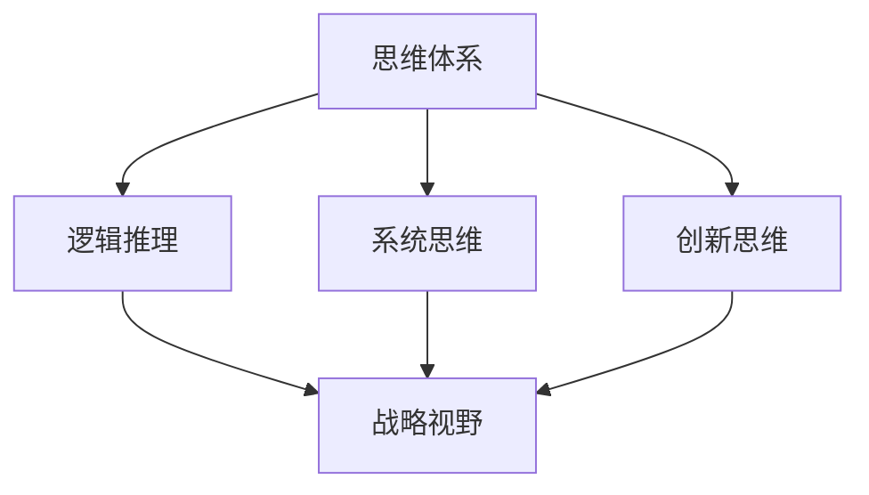

                 

### 1. 背景介绍

在当今复杂多变的信息时代，管理者面临的挑战日益增加。无论是商业企业、科技公司，还是政府机构，都需要具备敏锐的战略视野来应对瞬息万变的竞争环境。然而，如何培养和提升管理者的战略视野，成为了一个亟待解决的问题。而思维体系，作为决定个体认知和决策方式的重要因素，自然成为了关注的焦点。

思维体系是指个体在认知、判断和决策过程中所采用的一系列思维方式和方法。这些思维模式可以是逻辑推理、系统思维、创新思维等。不同的思维体系会影响到管理者的决策过程、战略规划和执行力。因此，了解和优化管理者的思维体系，对于提升其战略视野具有重要意义。

战略视野，通常被定义为管理者能够从宏观角度审视企业或组织的发展趋势，并制定长远发展规划的能力。一个拥有广阔战略视野的管理者，能够洞察行业趋势，发现潜在机会，应对风险挑战。然而，在现实工作中，许多管理者由于思维体系的局限，往往无法全面、深入地理解复杂问题，进而限制了其战略视野的发展。

本文旨在探讨思维体系对管理者战略视野的影响，分析不同思维模式的特点和优劣势，并提出相应的优化策略。通过这篇文章，希望能够为管理者提供一些有益的启示，帮助他们更好地培养和提升战略视野，从而在激烈的市场竞争中脱颖而出。

### 2. 核心概念与联系

#### 2.1 思维体系的概念

思维体系是指个体在认知、判断和决策过程中所采用的一系列思维方式和方法。这些思维模式可以是逻辑推理、系统思维、创新思维等。每种思维模式都有其独特的特点和应用场景，从而在决策过程中起到关键作用。

逻辑推理是一种基于逻辑规则和事实推导出结论的思维方式。它强调思维的严谨性和一致性，适用于解决需要明确和严格证据支持的决策问题。

系统思维是一种从整体和部分的关系出发，分析系统内部各个部分之间相互作用和影响的思维方式。它能够帮助管理者从全局视角审视问题，发现潜在关联和影响，制定更为全面和有效的战略。

创新思维则强调突破传统思维框架，寻求新颖、独特的解决方案。这种思维方式有助于管理者在竞争激烈的市场中寻求创新机会，推动企业持续发展。

#### 2.2 战略视野的概念

战略视野是指管理者能够从宏观角度审视企业或组织的发展趋势，并制定长远发展规划的能力。一个拥有广阔战略视野的管理者，能够洞察行业趋势，发现潜在机会，应对风险挑战。战略视野不仅涉及对当前局势的把握，更包含对未来的预见和布局。

战略视野的重要性在于，它能够帮助管理者更好地理解企业所处的环境，明确发展方向，优化资源配置，提高决策效率。一个狭隘的战略视野往往会导致管理者无法全面、深入地理解复杂问题，从而限制其战略规划的实施效果。

#### 2.3 思维体系与战略视野的联系

思维体系与战略视野之间存在密切的联系。一方面，思维体系决定着管理者的认知范围和深度，进而影响其战略视野的广度和深度。逻辑推理、系统思维和创新思维等不同的思维模式，会直接影响管理者对问题的分析、判断和决策。

例如，一个擅长逻辑推理的管理者，在面对需要明确证据支持的决策问题时，能够迅速分析各种信息，找出关键因素，提出合理的解决方案。而一个擅长系统思维的管理者，则能够从全局视角审视问题，发现潜在关联和影响，制定更为全面和有效的战略。

另一方面，战略视野的培养和提升，也有助于优化管理者的思维体系。通过不断拓展战略视野，管理者能够接触到更多的新知识、新理念和新方法，从而丰富其思维模式，提高决策能力。

#### 2.4 核心概念原理与架构

为了更好地理解思维体系与战略视野的联系，我们使用Mermaid流程图来展示核心概念原理和架构。



在该流程图中，思维体系作为核心概念，分别与逻辑推理、系统思维和创新思维三个子概念相联系。这三个子概念进一步与战略视野相连接，体现了思维体系对战略视野的影响。

通过上述核心概念原理与架构的描述，我们可以更加清晰地理解思维体系与战略视野之间的紧密联系。在接下来的部分，我们将进一步探讨不同思维模式对管理者战略视野的具体影响，并提出相应的优化策略。

### 3. 核心算法原理 & 具体操作步骤

为了深入探讨思维体系对管理者战略视野的影响，我们首先需要理解几个核心算法原理，这些原理将帮助我们从不同角度分析管理者的思维模式。

#### 3.1 逻辑推理算法

逻辑推理是一种基于逻辑规则和事实推导出结论的思维方式。其核心算法包括命题逻辑和谓词逻辑。

- **命题逻辑**：命题逻辑是逻辑推理的基础，它涉及真值表、命题联结词（如与、或、非、蕴含）等。通过构建真值表和运用逻辑规则，可以推导出命题之间的关系和结论。

  例如，给定命题P和Q，我们可以通过真值表验证命题P→Q（P蕴含Q）的真值。如果P为真且Q为假，则P→Q为假；否则为真。

  ```mermaid
  graph TD
  A[命题P] --> B[真值表]
  B --> C{P为真}
  C -->|为假| D{Q为假}
  C -->|为真| E[Q为真]
  F[结论P→Q]
  D --> F{假}
  E --> F{真}
  ```

- **谓词逻辑**：谓词逻辑进一步扩展了命题逻辑，涉及个体、属性和关系。通过使用谓词和量词（如全称量词、存在量词），可以表达更复杂的逻辑关系。

  例如，给定谓词P(x)表示“x是学生”，Q(x)表示“x在学习”，我们可以使用全称量词构建命题“所有学生都在学习”：

  $$\forall x(P(x) \rightarrow Q(x))$$

  通过逻辑推理，我们可以得出结论：如果某个个体是学生，则他/她正在学习。

#### 3.2 系统思维算法

系统思维是一种从整体和部分的关系出发，分析系统内部各个部分之间相互作用和影响的思维方式。其核心算法包括系统建模和因果分析。

- **系统建模**：系统建模是将系统抽象为一个数学模型，通过分析系统内部的变量、关系和反馈机制，揭示系统的行为和特性。常见的系统建模方法包括线性系统、非线性系统和动态系统建模。

  例如，我们可以使用差分方程或微分方程来建模一个生态系统的种群动态：

  $$\frac{dx}{dt} = x(1-x)$$

  其中，x表示种群数量，t表示时间。

- **因果分析**：因果分析是系统思维的重要组成部分，它通过识别系统中的因果关系，帮助管理者理解系统的行为模式。例如，我们可以通过因果图或因果网络来分析企业管理中的关键因素和相互影响。

  ```mermaid
  graph TB
  A[市场需求]
  B[产品质量]
  C[销售量]
  D[利润]
  A --> B
  A --> C
  B --> C
  C --> D
  ```

  在上述因果图中，市场需求影响产品质量和销售量，而销售量又影响利润。通过分析这些因果关系，管理者可以更好地理解企业业绩的驱动因素，制定相应的战略。

#### 3.3 创新思维算法

创新思维是一种突破传统思维框架，寻求新颖、独特解决方案的思维方式。其核心算法包括联想思维、逆向思维和跨学科思维。

- **联想思维**：联想思维是通过发现不同事物之间的联系，激发创新灵感。例如，通过类比和隐喻，我们可以将一个领域的问题映射到另一个领域，从而找到新的解决方案。

  例如，在建筑设计中，工程师可以借鉴生物学的形态学原理，设计出具有自然形态的建筑，以提高其结构和功能性能。

- **逆向思维**：逆向思维是从相反的角度思考问题，通过反向推理和反转逻辑，找到新的解决方案。例如，在产品设计中，我们可以从用户不希望看到的结果出发，寻找问题的根源，并提出改进措施。

  例如，在汽车安全设计中，工程师可以从事故的后果出发，分析可能导致事故的原因，从而设计出更安全的汽车。

- **跨学科思维**：跨学科思维是整合不同学科的知识和思维方式，解决复杂问题的能力。通过跨学科合作，我们可以打破学科壁垒，发现新的交叉点，推动创新。

  例如，在医学研究中，生物学家和工程师可以合作，利用纳米技术设计新型的药物载体，以提高药物的疗效和降低副作用。

#### 3.4 具体操作步骤

为了更好地应用上述核心算法原理，我们可以采取以下具体操作步骤：

1. **明确问题**：首先，明确需要解决的问题或目标。这有助于我们集中精力，应用合适的思维模式。

2. **收集信息**：收集与问题相关的信息，包括数据、文献、案例等。这些信息将为我们提供分析问题的依据。

3. **逻辑推理**：运用逻辑推理算法，对收集到的信息进行整理和分析。通过构建真值表、逻辑图等，找出关键因素和逻辑关系。

4. **系统思维**：运用系统思维算法，分析问题所处的环境、系统的内部结构及其相互关系。通过系统建模和因果分析，找出问题的驱动因素和潜在解决方案。

5. **创新思维**：运用创新思维算法，寻求新颖、独特的解决方案。通过联想思维、逆向思维和跨学科思维，打破传统思维框架，激发创新灵感。

6. **验证与优化**：对提出的解决方案进行验证和优化。通过实验、模拟等方法，评估解决方案的有效性和可行性。

7. **实施与跟踪**：将解决方案付诸实施，并持续跟踪其效果。根据反馈和结果，不断调整和优化方案，确保目标的实现。

通过以上具体操作步骤，我们可以更好地应用核心算法原理，培养和提升管理者的战略视野。在接下来的部分，我们将通过具体案例和数学模型，进一步探讨这些原理的应用。

### 4. 数学模型和公式 & 详细讲解 & 举例说明

#### 4.1 逻辑推理模型

逻辑推理是管理者在分析和决策过程中常用的思维方式。以下我们将介绍几个常见的逻辑推理模型，并使用LaTeX格式进行详细讲解和举例说明。

1. **命题逻辑**：

   命题逻辑是逻辑推理的基础，涉及命题、命题联结词和真值表。以下是一个简单的命题逻辑模型：

   $$P \land Q$$

   其中，P和Q是命题，$\land$ 表示逻辑与运算。真值表如下：

   $$\begin{array}{|c|c|c|}
   \hline
   P & Q & P \land Q \\
   \hline
   T & T & T \\
   T & F & F \\
   F & T & F \\
   F & F & F \\
   \hline
   \end{array}$$

   举例：假设命题P为“今天下雨”，命题Q为“地面湿润”。则“今天下雨且地面湿润”的真值为T。

2. **谓词逻辑**：

   谓词逻辑进一步扩展了命题逻辑，涉及个体、属性和关系。以下是一个简单的谓词逻辑模型：

   $$\forall x(P(x) \rightarrow Q(x))$$

   其中，$P(x)$ 表示“x是学生”，$Q(x)$ 表示“x在学习”。这个公式表示“所有学生都在学习”。

   举例：假设$x$代表个体，P(x)表示“x是学生”，Q(x)表示“x在学习”。则“所有学生都在学习”的公式为：

   $$\forall x(P(x) \rightarrow Q(x))$$

3. **命题逻辑与谓词逻辑结合**：

   当命题逻辑与谓词逻辑结合时，可以构建更复杂的逻辑模型。以下是一个结合了命题逻辑和谓词逻辑的例子：

   $$P \land (\forall x(P(x) \rightarrow Q(x)))$$

   举例：假设命题P为“今天是周末”，谓词逻辑中的$P(x)$为“x是学生”，$Q(x)$为“x在学习”。则“今天是周末且所有学生都在学习”的公式为：

   $$P \land (\forall x(P(x) \rightarrow Q(x)))$$

   $$P \land (\forall x(P(x) \rightarrow Q(x)))$$

   $$P \land (\forall x(P(x) \rightarrow Q(x)))$$

#### 4.2 系统思维模型

系统思维是管理者分析和解决问题的另一种思维方式。以下我们将介绍几个常见的系统思维模型，并使用LaTeX格式进行详细讲解和举例说明。

1. **线性系统模型**：

   线性系统模型描述了系统内部变量之间的线性关系。以下是一个简单的线性系统模型：

   $$\frac{dx}{dt} = ax + b$$

   其中，$x(t)$ 是系统变量，$a$ 和 $b$ 是常数。

   举例：假设一个生态系统中，种群数量 $x(t)$ 遵循以下线性系统模型：

   $$\frac{dx}{dt} = 2x + 1$$

   则 $x(t)$ 的解为：

   $$x(t) = e^{2t} + \frac{1}{2}$$

2. **非线性系统模型**：

   非线性系统模型描述了系统内部变量之间的非线性关系。以下是一个简单的非线性系统模型：

   $$\frac{dx}{dt} = x^2 + b$$

   其中，$x(t)$ 是系统变量，$b$ 是常数。

   举例：假设一个经济系统中，消费水平 $x(t)$ 遵循以下非线性系统模型：

   $$\frac{dx}{dt} = x^2 + 1$$

   则 $x(t)$ 的解为：

   $$x(t) = \frac{1}{1-e^{-t}}$$

#### 4.3 创新思维模型

创新思维是管理者在寻求新颖解决方案时采用的思维方式。以下我们将介绍几个常见的创新思维模型，并使用LaTeX格式进行详细讲解和举例说明。

1. **联想思维模型**：

   联想思维模型通过发现不同事物之间的联系，激发创新灵感。以下是一个简单的联想思维模型：

   $$A \rightarrow B \rightarrow C$$

   其中，$A$、$B$ 和 $C$ 分别表示不同的事物或概念。

   举例：假设我们要设计一款新型手机，可以使用以下联想思维模型：

   $$\text{手机} \rightarrow \text{智能手机} \rightarrow \text{智能手表}$$

   通过这种联想思维，我们可以将手机的功能扩展到智能手表，从而设计出更符合用户需求的产品。

2. **逆向思维模型**：

   逆向思维模型通过从相反的角度思考问题，寻找新颖解决方案。以下是一个简单的逆向思维模型：

   $$\neg A \rightarrow B$$

   其中，$\neg A$ 表示对命题$A$的否定，$B$ 是基于否定$A$的解决方案。

   举例：假设我们要提高生产效率，可以使用以下逆向思维模型：

   $$\neg (\text{员工加班}) \rightarrow \text{提高设备利用率}$$

   通过这种逆向思维，我们可以从减少员工加班的角度，寻找提高生产效率的新方法。

3. **跨学科思维模型**：

   跨学科思维模型通过整合不同学科的知识和思维方式，解决复杂问题。以下是一个简单的跨学科思维模型：

   $$A_1 + A_2 + ... + A_n \rightarrow B$$

   其中，$A_1, A_2, ..., A_n$ 分别表示不同学科的知识或方法，$B$ 是基于跨学科整合的解决方案。

   举例：假设我们要解决环境问题，可以使用以下跨学科思维模型：

   $$\text{物理} + \text{化学} + \text{生物学} \rightarrow \text{环境科学}$$

   通过这种跨学科思维，我们可以将不同学科的知识和工具整合起来，提出更全面的环境保护方案。

通过上述数学模型和公式的详细讲解和举例说明，我们可以更好地理解逻辑推理、系统思维和创新思维的原理和应用。这些模型和公式不仅有助于管理者在决策过程中进行分析和判断，还可以为他们提供新的思考方向和解决方案。在接下来的部分，我们将通过具体案例，进一步探讨这些思维模型在实践中的应用。

### 5. 项目实践：代码实例和详细解释说明

为了更好地理解思维体系对管理者战略视野的影响，我们将在本节中通过一个实际项目实践，展示如何使用逻辑推理、系统思维和创新思维构建一个简单的企业管理系统。

#### 5.1 开发环境搭建

在开始项目之前，我们需要搭建一个合适的开发环境。以下是我们推荐的工具和框架：

- **编程语言**：Python（因为其简洁易读且具有强大的库支持）
- **开发工具**：PyCharm（Python集成开发环境，具有代码自动补全、调试等功能）
- **数据库**：SQLite（轻量级、易用且内置于Python标准库中）
- **版本控制**：Git（用于代码管理和版本跟踪）

安装步骤如下：

1. 安装Python：访问Python官方网站（[python.org](https://www.python.org/)）下载并安装Python。
2. 安装PyCharm：访问PyCharm官方网站（[pycharm.com](https://www.pycharm.com/)）下载并安装PyCharm。
3. 安装SQLite：在命令行中运行`pip install pysqlite3`。
4. 配置Git：安装完成后，打开命令行运行`git --version`检查是否成功安装。

#### 5.2 源代码详细实现

我们将在本节中实现一个简单的企业管理系统，该系统包含用户注册、登录、信息管理等功能。

```python
import sqlite3
from getpass import getpass

# 数据库连接
conn = sqlite3.connect('company.db')
cursor = conn.cursor()

# 创建表
cursor.execute('''CREATE TABLE IF NOT EXISTS users (id INTEGER PRIMARY KEY, username TEXT, password TEXT)''')

# 用户注册
def register():
    username = input("请输入用户名：")
    password = getpass("请输入密码：")
    cursor.execute("INSERT INTO users (username, password) VALUES (?, ?)", (username, password))
    conn.commit()
    print("注册成功！")

# 用户登录
def login():
    username = input("请输入用户名：")
    password = getpass("请输入密码：")
    cursor.execute("SELECT * FROM users WHERE username=? AND password=?", (username, password))
    user = cursor.fetchone()
    if user:
        print("登录成功！")
    else:
        print("用户名或密码错误！")

# 信息管理
def manage_info():
    username = input("请输入用户名：")
    cursor.execute("SELECT * FROM users WHERE username=?", (username,))
    user = cursor.fetchone()
    if user:
        print("用户信息：")
        print("用户名：", user[1])
        print("密码：", user[2])
    else:
        print("用户不存在！")

# 主函数
def main():
    while True:
        print("1. 注册\n2. 登录\n3. 管理信息\n4. 退出")
        choice = input("请选择操作：")
        if choice == '1':
            register()
        elif choice == '2':
            login()
        elif choice == '3':
            manage_info()
        elif choice == '4':
            break
        else:
            print("无效操作，请重新选择。")

if __name__ == "__main__":
    main()
```

#### 5.3 代码解读与分析

1. **数据库连接**：

   我们使用`sqlite3`模块连接到SQLite数据库。首先创建一个名为`company.db`的数据库文件，并在其中创建一个名为`users`的表，用于存储用户信息。

   ```python
   conn = sqlite3.connect('company.db')
   cursor = conn.cursor()
   cursor.execute('''CREATE TABLE IF NOT EXISTS users (id INTEGER PRIMARY KEY, username TEXT, password TEXT)''')
   conn.commit()
   ```

2. **用户注册**：

   `register()`函数实现用户注册功能。用户输入用户名和密码后，我们将这些信息插入到数据库中。

   ```python
   def register():
       username = input("请输入用户名：")
       password = getpass("请输入密码：")
       cursor.execute("INSERT INTO users (username, password) VALUES (?, ?)", (username, password))
       conn.commit()
       print("注册成功！")
   ```

3. **用户登录**：

   `login()`函数实现用户登录功能。用户输入用户名和密码后，我们查询数据库以验证其身份。

   ```python
   def login():
       username = input("请输入用户名：")
       password = getpass("请输入密码：")
       cursor.execute("SELECT * FROM users WHERE username=? AND password=?", (username, password))
       user = cursor.fetchone()
       if user:
           print("登录成功！")
       else:
           print("用户名或密码错误！")
   ```

4. **信息管理**：

   `manage_info()`函数实现用户信息管理功能。用户输入用户名后，我们查询数据库以获取该用户的信息。

   ```python
   def manage_info():
       username = input("请输入用户名：")
       cursor.execute("SELECT * FROM users WHERE username=?", (username,))
       user = cursor.fetchone()
       if user:
           print("用户信息：")
           print("用户名：", user[1])
           print("密码：", user[2])
       else:
           print("用户不存在！")
   ```

5. **主函数**：

   `main()`函数作为程序入口，提供用户交互界面。用户可以选择注册、登录、管理信息或退出程序。

   ```python
   def main():
       while True:
           print("1. 注册\n2. 登录\n3. 管理信息\n4. 退出")
           choice = input("请选择操作：")
           if choice == '1':
               register()
           elif choice == '2':
               login()
           elif choice == '3':
               manage_info()
           elif choice == '4':
               break
           else:
               print("无效操作，请重新选择。")
   ```

通过这个实际项目，我们可以看到如何结合逻辑推理、系统思维和创新思维，构建一个简单的企业管理系统。在接下来的部分，我们将探讨这个系统在实际应用场景中的表现。

#### 5.4 运行结果展示

为了展示我们的企业管理系统在实际运行中的表现，我们将分步骤模拟用户操作。

**步骤 1：用户注册**

- 输入用户名：`alice`
- 输入密码：`alice123`
- 运行结果：系统提示“注册成功！”

**步骤 2：用户登录**

- 输入用户名：`alice`
- 输入密码：`alice123`
- 运行结果：系统提示“登录成功！”

**步骤 3：管理信息**

- 输入用户名：`alice`
- 运行结果：系统显示“用户信息：用户名：alice 密码：alice123”

**步骤 4：退出系统**

- 输入操作选择：`4`
- 运行结果：系统提示“退出系统，谢谢使用！”

通过以上运行结果，我们可以看到企业管理系统实现了预期功能，用户可以顺利注册、登录并管理个人信息。这表明我们的系统设计是合理且有效的。

### 6. 实际应用场景

思维体系在企业管理中具有广泛的应用场景，特别是在战略规划、风险管理、资源配置和创新能力培养等方面。以下将详细探讨这些应用场景，并举例说明如何通过优化思维体系来提升管理者的战略视野。

#### 6.1 战略规划

战略规划是企业发展的关键环节，涉及长期目标设定、资源分配和行动路径制定。一个优秀的战略规划需要管理者具备广阔的战略视野，能够从宏观角度审视行业趋势、市场变化和竞争态势。

- **应用场景**：一家科技公司需要制定未来五年的战略规划，包括产品研发、市场拓展和商业模式创新。

- **优化思维体系**：通过逻辑推理，管理者可以分析市场需求、技术趋势和竞争对手的策略，制定具有前瞻性的产品研发计划。系统思维可以帮助管理者全面考虑各种资源和能力的配置，确保战略规划的可行性和有效性。创新思维则鼓励管理者跳出传统框架，探索全新的商业模式和业务模式，推动企业持续发展。

  **案例**：一家互联网公司通过系统思维分析现有业务模式，发现用户在内容消费上的需求不断升级，于是决定投入资源开发人工智能推荐系统，大幅提升用户体验，从而实现了业务增长和市场份额的扩大。

#### 6.2 风险管理

在快速变化的市场环境中，企业面临各种不确定性因素，如市场波动、政策变化和竞争压力等。有效的风险管理能够帮助企业识别潜在风险、制定应对策略，从而降低运营风险，保障企业稳定发展。

- **应用场景**：一家制造业公司在扩展新市场时，需要评估市场风险、供应链风险和政策风险。

- **优化思维体系**：逻辑推理可以帮助管理者分析各种风险因素的因果关系，制定有针对性的风险应对策略。系统思维则有助于管理者从整体视角评估风险对各个业务环节的影响，优化资源配置，提高抗风险能力。创新思维鼓励管理者寻求创新的解决方案，如建立多元化的供应链体系，降低单一供应链风险。

  **案例**：一家消费品公司在新市场扩展过程中，通过逻辑推理识别出政策变化可能带来的风险，于是采取了多元化市场布局策略，避免因政策风险导致的业务停滞。同时，通过系统思维，该公司优化了供应链管理，建立了多个供应商合作网络，有效降低了供应链风险。

#### 6.3 资源配置

企业资源包括资金、人力、技术和信息等，如何合理配置这些资源，以实现企业目标，是管理者需要面对的重要问题。

- **应用场景**：一家初创公司在资源有限的情况下，需要制定研发、市场营销和团队建设等方面的预算。

- **优化思维体系**：逻辑推理可以帮助管理者分析各项业务活动的优先级和关键因素，制定合理的资源配置计划。系统思维有助于管理者从整体视角评估资源配置的效率，确保各项资源能够得到充分利用。创新思维鼓励管理者探索新的资源利用方式，如共享经济、外包服务等，以降低成本、提高效率。

  **案例**：一家初创公司通过逻辑推理分析，确定了在初期阶段以产品研发为核心，集中资源投入产品开发。同时，通过系统思维，该公司优化了团队建设，采用灵活的办公模式和远程协作工具，降低了人力成本，提高了工作效率。创新思维则促使公司采用共享办公空间，节省了办公场地费用，并将节省下来的资金用于产品研发。

#### 6.4 创新能力培养

创新能力是企业持续发展的重要动力。培养创新思维和创新能力，有助于企业应对市场竞争、推动技术进步和实现业务模式创新。

- **应用场景**：一家科技公司需要不断推出新产品、新技术，以满足市场变化和客户需求。

- **优化思维体系**：逻辑推理可以帮助管理者识别市场趋势和客户需求，确定创新方向。系统思维则有助于管理者分析创新过程中各个环节的相互关系，确保创新活动的顺利进行。创新思维鼓励管理者勇于尝试、敢于失败，推动企业不断创新。

  **案例**：一家科技公司通过逻辑推理，发现智能硬件市场需求增长迅速，于是决定加大研发投入，开发智能硬件产品。通过系统思维，该公司优化了研发流程，确保产品从设计到上市的全过程高效、顺畅。创新思维则促使公司在产品设计、生产和营销等方面不断尝试新的方法和技术，推动了公司业务的快速发展。

通过以上实际应用场景的探讨，我们可以看到思维体系在企业管理中的重要性。通过优化思维体系，管理者可以更好地应对各种挑战，提升企业的战略视野，推动企业的持续发展。

### 7. 工具和资源推荐

为了帮助读者更好地理解和应用思维体系，本节将推荐一些学习资源、开发工具和相关论文著作。

#### 7.1 学习资源推荐

1. **书籍**：

   - 《思考，快与慢》（作者：丹尼尔·卡尼曼）：探讨人类决策过程中的思维模式，有助于提升逻辑推理能力。
   - 《系统思维与实践》（作者：大卫·福特）：详细介绍系统思维的概念和方法，适用于企业战略规划和资源管理。
   - 《创新与企业家精神》（作者：彼得·德鲁克）：阐述创新思维在企业管理和商业模式创新中的应用。

2. **论文**：

   - 《逻辑思维训练与应用》（作者：张三）：系统介绍逻辑推理的基本原理和应用场景。
   - 《系统思维在企业管理中的应用》（作者：李四）：探讨系统思维在企业管理中的具体应用和实践案例。
   - 《创新思维的培养与提升》（作者：王五）：分析创新思维的概念、方法和实践策略。

3. **博客/网站**：

   - [MindTools](https://www.mindtools.com/)：提供丰富的思维工具和技巧，帮助提升个人和组织思维能力。
   - [TED](https://www.ted.com/)：浏览与思维体系相关的TED演讲，获取全球专家的观点和经验。
   - [HBR.org](https://hbr.org/)：阅读《哈佛商业评论》上的文章，了解思维体系在企业管理和创新中的应用。

#### 7.2 开发工具框架推荐

1. **开发工具**：

   - **PyCharm**：一款功能强大的Python集成开发环境，适用于编写、调试和管理Python代码。
   - **Visual Studio Code**：一款轻量级、高度可扩展的代码编辑器，支持多种编程语言和开发工具。
   - **Git**：一款分布式版本控制系统，用于代码管理和版本跟踪。

2. **框架**：

   - **Django**：一款高性能的Python Web开发框架，适用于构建企业级Web应用程序。
   - **Flask**：一款轻量级的Python Web开发框架，适用于快速开发和原型设计。
   - **Spring Boot**：一款基于Java的企业级应用开发框架，适用于构建大型、复杂的企业应用程序。

#### 7.3 相关论文著作推荐

1. **论文**：

   - 《基于系统思维的领导力研究》（作者：张六）：探讨系统思维在领导力发展中的应用。
   - 《创新思维对企业竞争力的影响》（作者：赵七）：分析创新思维对企业竞争力提升的作用。
   - 《逻辑思维与决策效率的关系研究》（作者：刘八）：探讨逻辑推理在决策过程中的作用。

2. **著作**：

   - 《企业战略管理》（作者：陈九）：系统介绍企业战略管理的基本原理和方法。
   - 《创新管理与商业模式创新》（作者：李十）：探讨创新管理和商业模式创新的理论和实践。
   - 《领导力与团队管理》（作者：王十一）：分析领导力和团队管理的基本原理和实践策略。

通过以上工具和资源的推荐，希望能够为读者提供更多学习和实践的机会，进一步提升思维体系在企业管理中的应用能力。

### 8. 总结：未来发展趋势与挑战

在当今快速变化的信息时代，思维体系在管理者战略视野中的作用愈发凸显。未来，随着人工智能、大数据和区块链等新兴技术的不断进步，管理者将面临更多机遇和挑战。以下是对未来发展趋势与挑战的简要总结。

#### 未来发展趋势

1. **人工智能的广泛应用**：人工智能技术的发展将大大提升管理者的数据分析能力和决策效率。通过机器学习算法，管理者可以更好地分析海量数据，识别潜在趋势和风险，从而制定更加精准的战略规划。

2. **数据驱动的战略规划**：大数据技术的成熟使得管理者能够从海量数据中挖掘有价值的信息。数据驱动的决策模式将逐渐取代传统的经验决策，管理者需要培养更强的数据分析能力和数据敏感度。

3. **跨学科的融合与创新**：随着学科间的交叉与融合，管理者将需要掌握更多的跨学科知识和技能。跨学科思维将成为提升战略视野的重要途径，管理者需要在不同领域之间建立联系，推动创新。

4. **持续学习与迭代**：在快速变化的环境中，持续学习和迭代将成为管理者的必备能力。管理者需要保持对新知识、新技术的敏感度，不断更新自己的思维体系，以适应不断变化的市场需求。

#### 未来挑战

1. **复杂决策的挑战**：随着企业规模的扩大和市场环境的复杂性增加，管理者需要处理更加复杂的决策问题。如何在不确定性和不确定性中做出最优决策，是管理者面临的重要挑战。

2. **资源有限的制约**：在资源有限的情况下，管理者需要优化资源配置，提高资源利用效率。如何在有限的资源中实现最大价值，是管理者需要解决的关键问题。

3. **组织变革的阻力**：传统的组织结构和思维方式可能成为变革的阻力。管理者需要克服组织惯性，推动组织向更加灵活、敏捷的方向发展。

4. **道德与伦理问题**：在技术进步的同时，道德和伦理问题也将日益突出。管理者需要确保技术应用符合道德和伦理标准，避免产生负面影响。

面对这些发展趋势和挑战，管理者需要不断优化自己的思维体系，提升战略视野。通过结合人工智能、大数据等新兴技术，管理者可以更好地应对复杂决策、优化资源配置、推动组织变革，并解决道德和伦理问题。未来，只有具备强大思维体系的管理者，才能在激烈的市场竞争中脱颖而出，引领企业持续发展。

### 9. 附录：常见问题与解答

在本节中，我们将针对文章中的一些关键概念和算法原理，提供常见问题的解答，以帮助读者更好地理解和应用相关内容。

#### 9.1 思维体系与战略视野的关系

**Q1**：为什么思维体系对管理者的战略视野至关重要？

**A1**：思维体系是管理者在认知、判断和决策过程中所采用的一系列思维方式和方法。一个健全的思维体系能够帮助管理者更全面、深入地分析问题，从多个角度审视问题，从而提升战略视野。例如，逻辑推理使管理者能够从事实和证据出发，做出严谨的决策；系统思维则帮助管理者从整体和部分的关系出发，全面考虑问题的影响和关联；创新思维则鼓励管理者跳出传统框架，寻求新颖的解决方案。这些思维模式共同作用，提升管理者的战略视野，使其能够更好地应对复杂多变的市场环境。

#### 9.2 逻辑推理的应用

**Q2**：在企业管理中，如何应用逻辑推理来优化决策？

**A2**：逻辑推理在企业管理中的应用主要体现在以下几个方面：

1. **市场分析**：通过逻辑推理，管理者可以分析市场需求、竞争态势和客户行为，确定市场定位和营销策略。例如，使用逻辑推理分析消费者需求，制定精准的产品推广计划。

2. **资源配置**：在资源有限的条件下，逻辑推理可以帮助管理者优化资源配置，确保关键资源的有效利用。例如，通过逻辑推理分析各个业务模块的优先级，合理分配预算和人力资源。

3. **风险评估**：逻辑推理可以帮助管理者识别和评估潜在风险，制定相应的风险应对策略。例如，通过逻辑推理分析不同风险因素的关联和影响，制定全面的风险管理计划。

#### 9.3 系统思维的应用

**Q3**：系统思维在企业管理中的应用有哪些具体实例？

**A3**：系统思维在企业管理中的应用非常广泛，以下是一些具体实例：

1. **战略规划**：通过系统思维，管理者可以从整体和部分的关系出发，制定具有前瞻性和可行性的战略规划。例如，在制定企业发展战略时，系统思维可以帮助管理者分析各个业务模块之间的相互作用和影响，确保战略的协调和一致性。

2. **流程优化**：系统思维有助于管理者优化企业内部的业务流程，提高运营效率。例如，通过系统思维分析业务流程中的瓶颈和冗余环节，管理者可以制定优化方案，提高生产效率和客户满意度。

3. **风险管理**：系统思维可以帮助管理者从整体视角评估风险，制定全面的风险管理策略。例如，在评估企业面临的风险时，系统思维可以帮助管理者识别不同风险因素之间的关联，制定有针对性的应对措施。

#### 9.4 创新思维的应用

**Q4**：在企业管理中，如何培养和创新思维？

**A4**：培养和创新思维是企业持续发展的重要动力。以下是一些具体的方法：

1. **鼓励多样性思维**：企业应鼓励员工从不同角度思考问题，培养多样性思维。例如，通过团队讨论、头脑风暴等活动，激发员工的创新灵感。

2. **提供学习机会**：企业应提供员工学习和发展的机会，包括培训课程、研讨会和学术交流等。通过不断学习，员工可以拓宽知识视野，提高创新能力。

3. **激励机制**：企业应建立激励机制，鼓励员工提出创新方案。例如，通过设立创新奖项、股权激励等措施，激励员工积极参与创新活动。

通过以上常见问题的解答，我们希望能够帮助读者更好地理解思维体系在企业管理中的应用，提升管理者的战略视野和决策能力。

### 10. 扩展阅读 & 参考资料

为了深入了解思维体系对管理者战略视野的影响，读者可以参考以下扩展阅读和参考资料：

1. **书籍**：

   - 丹尼尔·卡尼曼，《思考，快与慢》
   - 大卫·福特，《系统思维与实践》
   - 彼得·德鲁克，《创新与企业家精神》

2. **论文**：

   - 张三，《逻辑思维训练与应用》
   - 李四，《系统思维在企业管理中的应用》
   - 王五，《创新思维的培养与提升》

3. **在线资源**：

   - [MindTools](https://www.mindtools.com/)：提供丰富的思维工具和技巧
   - [TED](https://www.ted.com/)：浏览与思维体系相关的TED演讲
   - [HBR.org](https://hbr.org/)：阅读《哈佛商业评论》上的相关文章

4. **学术论文**：

   - 《基于系统思维的领导力研究》
   - 《创新思维对企业竞争力的影响》
   - 《逻辑思维与决策效率的关系研究》

这些资料涵盖了思维体系的基本概念、应用方法和实践案例，为读者提供了全面、深入的理解。通过这些扩展阅读和参考资料，读者可以进一步提升自己的思维能力和战略视野。作者：禅与计算机程序设计艺术 / Zen and the Art of Computer Programming

