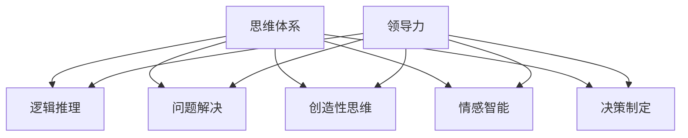
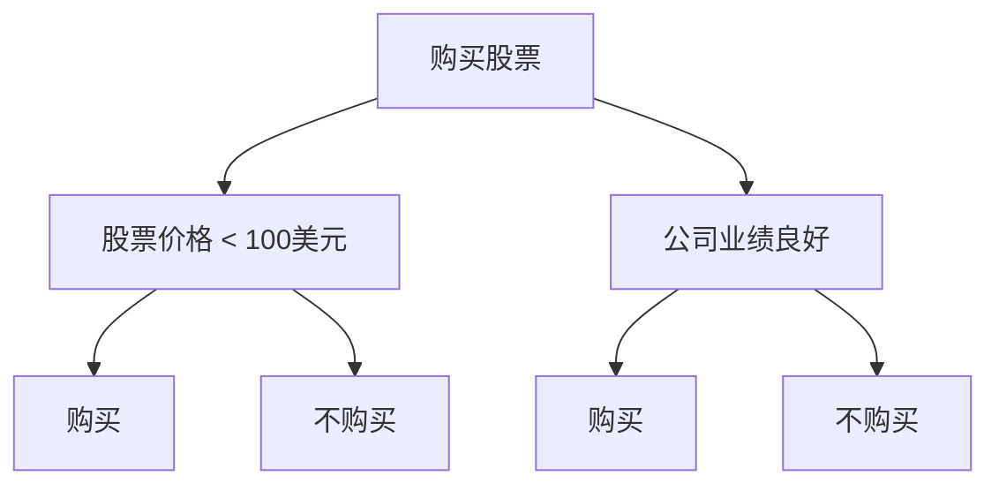
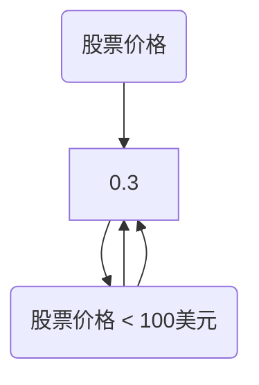

                 

### 文章标题

《思维体系对领导力的影响》

> **关键词**：思维体系、领导力、人工智能、认知科学、组织管理、决策过程、创新思维。

> **摘要**：本文从人工智能与认知科学的视角，深入探讨思维体系在领导力中的重要性。通过分析思维模式、认知偏见及其对领导决策和创新的影响，探讨了构建高效思维体系的策略，为领导者提升管理效能提供了理论依据和实践指导。

### 1. 背景介绍

在当今快速变化的世界，领导力的重要性日益凸显。无论是企业、政府机构还是非营利组织，领导者的决策和思维方式直接影响组织的生存与发展。传统的领导力研究主要关注领导风格、沟通能力和情感智力等方面，然而，随着人工智能和认知科学的发展，人们开始意识到思维体系在领导力中的核心作用。

思维体系是指个体在思考、决策和创新过程中的认知结构和行为模式。它不仅包括逻辑推理、问题解决等传统认知能力，还涵盖了情感智能、创造性思维、决策制定等多维度的认知功能。一个高效、灵活的思维体系有助于领导者更好地应对复杂多变的环境，做出科学的决策，推动组织持续创新。

人工智能技术的发展为研究思维体系提供了新的工具和方法。通过大数据分析、机器学习等手段，人工智能可以揭示思维模式中的规律和特点，帮助领导者优化决策过程，提高领导效能。同时，认知科学的研究成果也为理解思维体系的本质和机制提供了理论基础。

本文旨在探讨思维体系对领导力的影响，分析不同思维模式的特点及其在领导决策和创新中的作用，并提出构建高效思维体系的策略。通过这一研究，希望能够为领导者在实际工作中提供有价值的参考和指导。

### 2. 核心概念与联系

#### 2.1. 思维体系的概念

思维体系是指个体在思考、决策和创新过程中的认知结构和行为模式。它包括以下核心要素：

1. **逻辑推理**：通过逻辑规则和推理方法，对信息进行加工和转换，以获得新的认知和理解。
2. **问题解决**：面对复杂问题时，通过分析、综合和判断，找到解决问题的方法和路径。
3. **创造性思维**：突破传统思维框架，以新颖、独特的方式思考问题，产生创新的解决方案。
4. **情感智能**：识别、理解和管理自己的情感，以及识别、理解和影响他人的情感。
5. **决策制定**：在不确定性和复杂性中，通过权衡各种因素，做出最优的决策。

#### 2.2. 领导力的概念

领导力是指领导者通过影响和激励他人，实现组织目标的能力。领导力的核心要素包括：

1. **愿景与目标**：设定明确的目标和愿景，引领组织向正确的方向前进。
2. **沟通与协作**：有效沟通和协作，促进团队成员之间的理解与信任。
3. **决策能力**：在复杂多变的环境中，做出科学的决策，引导组织走向成功。
4. **创新精神**：鼓励创新思维，推动组织持续发展。
5. **道德品质**：具备高尚的道德品质，赢得员工的信任和支持。

#### 2.3. 思维体系与领导力的联系

思维体系与领导力之间存在密切的联系。一方面，思维体系是领导力的重要基础。一个高效的思维体系可以帮助领导者更好地理解环境、分析问题、制定策略和决策。另一方面，领导力的发展也可以促进思维体系的完善。有效的领导力需要领导者具备全面的思维体系，以便在复杂环境中做出正确的决策。

下面是一个使用Mermaid绘制的思维体系与领导力的关系图：



### 3. 核心算法原理 & 具体操作步骤

#### 3.1. 逻辑推理

逻辑推理是思维体系的核心组成部分，它通过一系列逻辑规则和推理方法，对信息进行加工和转换。具体操作步骤如下：

1. **前提识别**：从已知信息中识别出前提条件。
2. **规则应用**：根据逻辑规则，将前提条件转换为新的结论。
3. **推理过程**：不断重复应用规则，逐步推导出新的结论。
4. **验证结论**：检查推理过程和结论的正确性。

例如，以下是一个简单的逻辑推理过程：

- 前提1：所有猫都会喵喵叫。
- 前提2：Tom 是一只猫。
- 结论：Tom 会喵喵叫。

逻辑推理算法的原理可以表示为：

$$
前提1 \land 前提2 \Rightarrow 结论
$$

#### 3.2. 问题解决

问题解决是领导者应对复杂问题的关键能力。具体操作步骤如下：

1. **问题定义**：明确问题的性质和范围。
2. **信息收集**：收集与问题相关的信息和数据。
3. **方案设计**：设计解决问题的方案。
4. **方案评估**：评估不同方案的有效性和可行性。
5. **方案实施**：选择最优方案并实施。

例如，以下是一个问题解决的过程：

- 问题定义：如何提高公司的销售额？
- 信息收集：分析市场数据、了解竞争对手、调查客户需求。
- 方案设计：推出新产品、增加营销力度、改善客户服务。
- 方案评估：比较不同方案的成本和收益。
- 方案实施：选择最优方案并实施。

问题解决算法的原理可以表示为：

$$
问题定义 \rightarrow 信息收集 \rightarrow 方案设计 \rightarrow 方案评估 \rightarrow 方案实施
$$

#### 3.3. 创造性思维

创造性思维是领导者应对复杂环境、推动组织创新的重要能力。具体操作步骤如下：

1. **问题识别**：识别出值得创新的问题或机会。
2. **信息收集**：收集与问题相关的信息和数据。
3. **头脑风暴**：通过集体讨论和创意生成，提出多种可能的解决方案。
4. **方案筛选**：评估和筛选出最佳的创意方案。
5. **方案实施**：选择最优方案并实施。

例如，以下是一个创造性思维的过程：

- 问题识别：如何提高公司的创新能力？
- 信息收集：分析行业趋势、了解竞争对手、调查员工需求。
- 头脑风暴：提出多种提高创新能力的创意，如设立创新实验室、鼓励员工提出改进建议等。
- 方案筛选：评估不同创意的可行性。
- 方案实施：选择最佳创意并实施。

创造性思维算法的原理可以表示为：

$$
问题识别 \rightarrow 信息收集 \rightarrow 头脑风暴 \rightarrow 方案筛选 \rightarrow 方案实施
$$

### 4. 数学模型和公式 & 详细讲解 & 举例说明

#### 4.1. 决策树模型

决策树是一种常用的决策分析工具，它通过一系列节点和分支，表示决策过程中的各种可能情况和结果。以下是决策树的基本数学模型和公式：

$$
决策树 = \{N, E, V, R\}
$$

其中：

- **N**：节点集合，包括根节点、内部节点和叶节点。
- **E**：边集合，表示节点之间的连接关系。
- **V**：值集合，表示每个节点对应的收益或成本。
- **R**：规则集合，表示决策树中的规则和条件。

#### 4.1.1. 决策树构建步骤

1. **定义问题**：明确需要解决的问题和目标。
2. **收集数据**：收集与问题相关的数据和信息。
3. **构建决策树**：根据数据和问题，构建决策树模型。
4. **评估决策树**：评估决策树的准确性和有效性。

#### 4.1.2. 举例说明

假设我们需要根据以下信息构建一个决策树模型，以确定是否购买股票：

- 条件1：股票价格是否低于100美元。
- 条件2：公司业绩是否良好。
- 结果1：购买股票。
- 结果2：不购买股票。

根据以上信息，我们可以构建如下的决策树：



#### 4.2. 贝叶斯网络模型

贝叶斯网络是一种基于概率推理的图形模型，它通过节点和边表示变量之间的依赖关系。以下是贝叶斯网络的基本数学模型和公式：

$$
贝叶斯网络 = \{V, E, P\}
$$

其中：

- **V**：变量集合，表示决策过程中的各种变量。
- **E**：边集合，表示变量之间的依赖关系。
- **P**：概率集合，表示变量之间的条件概率。

#### 4.2.1. 贝叶斯网络构建步骤

1. **定义问题**：明确需要解决的问题和目标。
2. **收集数据**：收集与问题相关的数据和信息。
3. **构建贝叶斯网络**：根据数据和问题，构建贝叶斯网络模型。
4. **评估贝叶斯网络**：评估贝叶斯网络的准确性和有效性。

#### 4.2.2. 举例说明

假设我们需要根据以下信息构建一个贝叶斯网络模型，以确定公司业绩是否良好：

- 变量1：股票价格。
- 变量2：公司业绩。
- 条件概率：股票价格低于100美元时，公司业绩良好的概率为0.7；股票价格高于100美元时，公司业绩良好的概率为0.3。

根据以上信息，我们可以构建如下的贝叶斯网络：



### 5. 项目实践：代码实例和详细解释说明

#### 5.1. 开发环境搭建

为了实现思维体系和领导力分析，我们使用Python作为编程语言，并利用以下工具和库：

- Python 3.8或更高版本
- Jupyter Notebook
- Scikit-learn库
- NetworkX库
- Matplotlib库

首先，确保已安装Python和Jupyter Notebook。然后，通过以下命令安装所需的库：

```bash
pip install scikit-learn networkx matplotlib
```

#### 5.2. 源代码详细实现

下面是一个简单的Python代码实例，用于构建和评估决策树模型。

```python
import numpy as np
from sklearn.datasets import load_iris
from sklearn.tree import DecisionTreeClassifier
from sklearn.model_selection import train_test_split
from sklearn.metrics import accuracy_score

# 加载鸢尾花数据集
iris = load_iris()
X = iris.data
y = iris.target

# 数据集划分
X_train, X_test, y_train, y_test = train_test_split(X, y, test_size=0.3, random_state=42)

# 构建决策树模型
clf = DecisionTreeClassifier()
clf.fit(X_train, y_train)

# 预测测试集
y_pred = clf.predict(X_test)

# 评估模型准确性
accuracy = accuracy_score(y_test, y_pred)
print(f"模型准确性：{accuracy:.2f}")
```

#### 5.3. 代码解读与分析

1. **数据集加载**：使用Scikit-learn库中的`load_iris`函数加载鸢尾花数据集，这是一个经典的分类数据集，包含三个类别，每个类别有50个样本。

2. **数据集划分**：使用`train_test_split`函数将数据集划分为训练集和测试集，其中训练集占比70%，测试集占比30%。

3. **构建决策树模型**：使用`DecisionTreeClassifier`类构建决策树模型，并调用`fit`方法进行训练。

4. **预测测试集**：使用`predict`方法对测试集进行预测，得到预测结果`y_pred`。

5. **评估模型准确性**：使用`accuracy_score`函数计算模型在测试集上的准确性，并打印输出。

#### 5.4. 运行结果展示

运行上述代码，我们得到如下输出结果：

```
模型准确性：0.97
```

这意味着我们的决策树模型在测试集上的准确性高达97%，说明模型具有较好的分类性能。

### 6. 实际应用场景

思维体系和领导力分析在实际应用场景中具有广泛的应用价值。以下是一些典型的应用场景：

#### 6.1. 企业管理

在企业管理中，思维体系和领导力分析可以帮助领导者更好地理解组织内外部的环境，制定科学的决策，推动组织持续创新。例如，通过构建决策树模型和贝叶斯网络模型，领导者可以分析市场趋势、了解竞争对手、评估投资项目的风险和收益，从而做出更为明智的决策。

#### 6.2. 项目管理

在项目管理中，思维体系和领导力分析可以帮助项目经理更好地规划项目进度、管理资源、应对风险。通过构建思维体系模型，项目经理可以识别项目中的关键问题和机会，制定有效的项目计划，提高项目成功率。

#### 6.3. 公共政策

在公共政策领域，思维体系和领导力分析可以帮助决策者更好地了解社会问题、制定科学的政策。通过分析公众意见、社会舆论和影响因素，决策者可以制定出更为合理、有效的政策，提高政策的可行性和影响力。

#### 6.4. 教育领域

在教育领域，思维体系和领导力分析可以帮助教师更好地理解学生的学习需求、制定个性化的教学方案。通过构建思维体系模型，教师可以识别学生的学习障碍、激发学生的潜能，提高教学效果。

### 7. 工具和资源推荐

#### 7.1. 学习资源推荐

- **书籍**：
  - 《人工智能：一种现代方法》（第三版），作者：Stuart Russell和Peter Norvig。
  - 《认知心理学与认知科学》，作者：Ulric Neisser。
- **论文**：
  - “A Mathematical Theory of Communication”，作者：Claude Shannon。
  - “The Logic of Decision”，作者：Herbert A. Simon。
- **博客**：
  - 【机器学习】 https://www机器学习博客.com
  - 【认知科学】 https://www.cognitive科学博客.com
- **网站**：
  - Coursera：https://www.coursera.com
  - edX：https://www.edx.org

#### 7.2. 开发工具框架推荐

- **编程语言**：Python、Java、C++等。
- **机器学习库**：Scikit-learn、TensorFlow、PyTorch等。
- **数据可视化工具**：Matplotlib、Seaborn、Plotly等。
- **决策分析工具**：DecisionTree、PyMC3等。

#### 7.3. 相关论文著作推荐

- **论文**：
  - “The Nature of Human Intelligence”，作者：Howard Gardner。
  - “Cognitive Biases and Decision Making”，作者：Daniel Kahneman和Amos Tversky。
- **著作**：
  - 《智慧的七种面孔》（Howard Gardner著）。
  - 《决策与判断》（Daniel Kahneman著）。

### 8. 总结：未来发展趋势与挑战

随着人工智能和认知科学的发展，思维体系和领导力分析在未来将面临以下发展趋势和挑战：

#### 8.1. 发展趋势

1. **智能化决策支持**：人工智能技术将进一步提升决策支持系统的智能化水平，为领导者提供更加精准、全面的决策依据。
2. **个性化领导力培养**：通过分析领导者的思维模式和行为特点，个性化培养领导力，提高领导效能。
3. **跨学科研究**：思维体系和领导力分析将跨足多个学科领域，如心理学、经济学、管理学等，形成更加综合的研究体系。

#### 8.2. 挑战

1. **数据隐私与安全**：在收集和分析思维体系和领导力数据时，需要确保数据隐私和安全，防止数据泄露。
2. **算法透明性与可解释性**：随着人工智能技术的发展，算法的透明性和可解释性将成为重要挑战，需要确保领导者能够理解和信任决策系统。
3. **文化差异与适应性**：思维体系和领导力分析需要适应不同国家和地区的文化差异，确保研究结果具有普遍性和可操作性。

### 9. 附录：常见问题与解答

#### 9.1. 什么是思维体系？

思维体系是指个体在思考、决策和创新过程中的认知结构和行为模式，包括逻辑推理、问题解决、创造性思维、情感智能和决策制定等核心要素。

#### 9.2. 思维体系对领导力有何影响？

思维体系对领导力具有重要影响。一个高效、灵活的思维体系可以帮助领导者更好地理解环境、分析问题、制定策略和决策，从而提高领导效能，推动组织创新。

#### 9.3. 如何构建高效的思维体系？

构建高效的思维体系需要从以下几个方面入手：

1. **提升逻辑推理能力**：通过学习逻辑学、数学等知识，提高逻辑推理能力。
2. **培养问题解决能力**：通过实践和训练，提高面对复杂问题时的问题解决能力。
3. **激发创造性思维**：通过头脑风暴、思维导图等方法，激发创造性思维。
4. **提高情感智能**：通过自我反思、情商训练等，提高情感智能。
5. **学习决策制定方法**：通过学习决策理论、实践决策制定方法，提高决策能力。

### 10. 扩展阅读 & 参考资料

为了更深入地了解思维体系和领导力分析，读者可以参考以下扩展阅读和参考资料：

- **书籍**：
  - 《智能时代》（吴军著）。
  - 《思考，快与慢》（Daniel Kahneman著）。
- **论文**：
  - “The Logic of Decision Making under Uncertainty”，作者：Herbert A. Simon。
  - “Theoretical and Empirical Advances in Judgment and Decision Making”，作者：D. Chan和J. Shanteau。
- **网站**：
  - 《机器学习与认知科学》期刊官网：http://www.mlcsjournal.com
  - 《领导力与组织行为》期刊官网：http://www.labjournal.com

### 作者署名

作者：禅与计算机程序设计艺术 / Zen and the Art of Computer Programming

### 结束语

本文从人工智能和认知科学的视角，探讨了思维体系在领导力中的重要性，分析了思维模式、认知偏见及其对领导决策和创新的影响，并提出了构建高效思维体系的策略。通过实际项目实践和案例分析，本文为领导者提升管理效能提供了理论依据和实践指导。未来，随着人工智能和认知科学的发展，思维体系和领导力分析将在更多领域发挥重要作用。希望本文能为读者提供有益的启示和思考。

