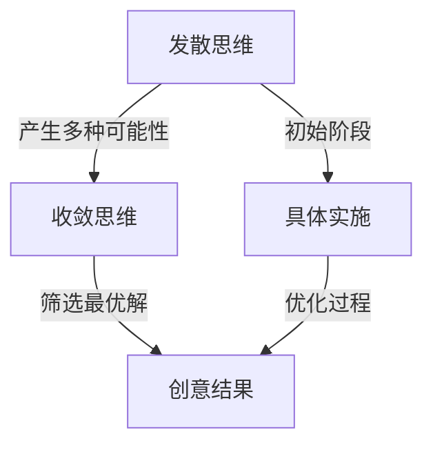

                 

### 1. 背景介绍

在人类思考和创新的过程中，发散思维和收敛思维是两个核心且相互补充的阶段。发散思维（Divergent Thinking）是指从一个中心点出发，向外扩展，产生多种可能的解决方案、观点和想法。收敛思维（Convergent Thinking）则是在发散思维的基础上，从多个选项中筛选出最优解，进行集中和整合。本文旨在探讨发散思维和收敛思维在创意过程的核心地位，以及它们在IT领域的实际应用。

创意过程是一种复杂的认知活动，需要我们在不确定和变化的环境中产生新的解决方案。发散思维和收敛思维如同创意过程的两个轮子，一个推动我们探索新天地，一个帮助我们选择最佳路径。二者相辅相成，缺一不可。发散思维让我们敢于质疑现状，提出多种可能性；收敛思维则让我们在众多选项中寻找最优解，确保创意的有效性和可行性。

在IT领域，无论是软件开发、系统设计还是问题解决，发散思维和收敛思维都发挥着至关重要的作用。通过发散思维，我们可以探索各种可能的解决方案，避免陷入思维定势；通过收敛思维，我们可以从这些方案中筛选出最优解，提高开发效率和代码质量。本文将详细探讨这两个阶段在IT领域的应用，通过具体实例和分析，帮助读者更好地理解并运用发散思维和收敛思维，提升自身的创新能力。

### 2. 核心概念与联系

在深入探讨发散思维和收敛思维之前，我们需要明确这两个核心概念的定义，以及它们在创意过程中的联系。

#### 2.1 发散思维

发散思维（Divergent Thinking）是由美国心理学家吉尔福德（J.P. Guilford）提出的，它是指从中心点出发，进行自由、广泛、开放的思考，产生多种可能的解决方案、观点和想法。发散思维的核心特点是多样性、灵活性、创新性和开放性。

#### 2.2 收敛思维

收敛思维（Convergent Thinking）则是一种针对特定问题的集中、有序、高效的思考方式。它是在发散思维的基础上，从多个选项中筛选出最优解，进行整合和优化。收敛思维强调逻辑性、系统性和决策性。

#### 2.3 联系与区别

发散思维和收敛思维是创意过程中不可或缺的两个阶段。发散思维为创意过程提供丰富的初始想法和解决方案，而收敛思维则确保这些想法和解决方案在实际应用中的可行性和有效性。二者之间的联系和区别主要体现在以下几个方面：

1. **目的不同**：发散思维的目标是寻找多种可能性，而收敛思维的目标是选择最优解。
2. **思维方式不同**：发散思维是开放的、自由的、创新的，而收敛思维是集中的、有序的、逻辑的。
3. **时间顺序不同**：发散思维通常在创意的初始阶段，而收敛思维则在发散思维之后，进行筛选和优化。
4. **效果不同**：发散思维强调多样性和创新性，而收敛思维强调效率和实用性。

#### 2.4 发散思维和收敛思维在创意过程中的关系

发散思维和收敛思维在创意过程中相辅相成。发散思维为创意过程提供丰富的初始想法，而收敛思维则从这些想法中筛选出最优解，确保创意的实际应用价值。二者之间的互动关系如图所示：



通过上述关系图，我们可以看出，发散思维和收敛思维共同推动创意过程的发展，从初始阶段到具体实施，再到最终的结果。只有二者紧密结合，才能实现创意过程的完整闭环。

#### 2.5 在IT领域的应用

在IT领域，发散思维和收敛思维的应用无处不在。无论是软件开发、系统设计，还是问题解决，这两个思维阶段都是必不可少的。例如，在软件开发过程中，发散思维可以帮助我们探索多种技术方案，而收敛思维则确保我们选择最适合项目的解决方案。

总之，理解发散思维和收敛思维的核心概念及其联系，是提高创新能力和解决复杂问题的重要基础。接下来，我们将进一步探讨发散思维和收敛思维的具体应用和实践方法。

### 3. 核心算法原理 & 具体操作步骤

在深入探讨发散思维和收敛思维的应用之前，我们首先需要了解它们在具体情境中的核心算法原理，以及如何通过一系列具体操作步骤来实现这些思维模式。

#### 3.1 发散思维的核心算法原理

发散思维的核心在于激发多样化的思维，产生大量的可能性。具体算法原理可以概括为以下几个步骤：

1. **明确问题**：首先，我们需要明确需要解决的问题或挑战。这个问题应该具有开放性，允许多种解决方案的产生。
2. **信息收集**：收集与问题相关的各种信息，包括背景知识、现有解决方案等。这一步骤有助于为发散思维提供丰富的素材。
3. **自由联想**：在这一阶段，我们不再受限于逻辑和常识，进行自由联想。通过将不同的信息点进行关联，产生新的想法和解决方案。
4. **记录和整理**：将产生的各种想法和解决方案记录下来，并进行初步的整理和分类。这一步骤有助于我们更好地理解和评估这些想法。

#### 3.2 发散思维的具体操作步骤

以下是一个典型的发散思维操作步骤示例：

1. **明确问题**：假设我们需要设计一个用于智能助手的应用程序，目标是提高用户的工作效率和满意度。
2. **信息收集**：收集关于智能助手的相关信息，如现有智能助手的优缺点、用户对智能助手的需求等。
3. **自由联想**：基于收集到的信息，进行自由联想。例如，我们可能想到：
   - 通过语音识别技术实现自然语言交互
   - 引入机器学习算法，实现个性化推荐
   - 提供多语言支持，方便跨国用户使用
   - 利用云计算技术，实现数据实时同步
4. **记录和整理**：将上述想法记录下来，并进行初步的分类和整理。例如，可以将这些想法分为技术实现、用户体验和功能扩展等类别。

#### 3.3 收敛思维的核心算法原理

收敛思维的核心在于从多种可能性中筛选出最优解。其算法原理可以概括为以下几个步骤：

1. **确定目标**：明确我们需要解决的核心问题或目标，以及预期达到的结果。
2. **评估选项**：对之前发散思维阶段产生的各种可能性进行评估，从多个角度（如技术可行性、成本效益、用户体验等）进行综合评估。
3. **优先级排序**：根据评估结果，对各个选项进行优先级排序，选择最具潜力和可行性的方案。
4. **方案验证**：对选定的方案进行验证，确保其在实际应用中的可行性和有效性。

#### 3.4 收敛思维的具体操作步骤

以下是一个典型的收敛思维操作步骤示例：

1. **确定目标**：继续上述例子，我们需要实现一个高效、易用的智能助手应用程序。
2. **评估选项**：对前面发散思维阶段产生的各种想法进行评估：
   - 语音识别技术：技术可行性较高，但用户体验可能受到噪声干扰
   - 机器学习算法：可以提高个性化推荐，但需要大量数据支持和计算资源
   - 多语言支持：有助于跨国用户，但可能增加开发难度和成本
   - 云计算技术：可以实现实时数据同步，但可能对网络环境有较高要求
3. **优先级排序**：根据评估结果，将上述选项进行排序：
   - 高优先级：多语言支持、机器学习算法
   - 中优先级：语音识别技术
   - 低优先级：云计算技术
4. **方案验证**：对选定的方案进行验证，确保其在实际应用中的可行性和有效性。例如，可以通过用户测试、技术验证等手段来验证多语言支持和机器学习算法的效果。

通过上述发散思维和收敛思维的核心算法原理及具体操作步骤，我们可以更好地理解如何在实际项目中运用这两种思维模式，从而提高创新能力和解决问题的效率。

### 4. 数学模型和公式 & 详细讲解 & 举例说明

在理解发散思维和收敛思维的核心算法原理后，我们进一步探讨这两种思维过程的数学模型和公式，并通过具体例子进行详细讲解。

#### 4.1 发散思维的数学模型

发散思维的数学模型通常基于概率论和组合数学。以下是一个简单的模型：

设集合 \( S \) 包含所有可能的解决方案，集合 \( T \) 是从 \( S \) 中选择解决方案的子集，则发散思维的目标是从 \( T \) 中生成尽可能多的独特解决方案。

数学公式表示为：

\[ D(T) = \sum_{t \in T} \text{prob}(t) \]

其中，\( \text{prob}(t) \) 表示选择解决方案 \( t \) 的概率。

**例子：** 假设我们要设计一个简单的购物推荐系统，现有10种商品，每种商品被推荐的概率相等。我们可以通过以下步骤进行发散思维：

1. 明确问题：如何为用户推荐商品？
2. 生成可能的解决方案：从10种商品中随机选择1种推荐给用户。
3. 计算概率：每种商品被推荐的概率为 \( \frac{1}{10} \)。

根据公式，发散思维生成的解决方案数量为：

\[ D(T) = 10 \times \frac{1}{10} = 1 \]

尽管看似简单的例子，但发散思维实际上为我们提供了多种可能的解决方案，为后续的收敛思维提供了丰富的素材。

#### 4.2 收敛思维的数学模型

收敛思维的数学模型通常基于优化理论和决策理论。以下是一个简单的模型：

设集合 \( S \) 包含所有可能的解决方案，集合 \( T \) 是从 \( S \) 中筛选出的最优解决方案集合。收敛思维的目标是从 \( T \) 中选择最优解。

数学公式表示为：

\[ C(T) = \max_{t \in T} \text{score}(t) \]

其中，\( \text{score}(t) \) 表示解决方案 \( t \) 的评分。

**例子：** 假设我们要从上述10种商品中为用户选择一种推荐，根据用户体验，每种商品的评分如下：

- 商品1：8分
- 商品2：6分
- 商品3：7分
- 商品4：5分
- 商品5：9分
- 商品6：4分
- 商品7：6分
- 商品8：7分
- 商品9：3分
- 商品10：8分

根据公式，收敛思维选择最优解的步骤为：

1. 计算每个解决方案的评分：
   \[ \text{score}(t) \]
2. 找到评分最高的解决方案：
   \[ \max_{t \in T} \text{score}(t) \]

在本例中，评分最高的商品是商品5，得分为9分。因此，我们选择商品5作为推荐给用户的最优解。

#### 4.3 发散思维与收敛思维的结合

在实际应用中，发散思维和收敛思维常常结合使用，以实现最优的创意和解决方案。以下是一个结合发散思维和收敛思维的例子：

**例子：** 设计一个智能家居系统，目标是为用户提供便利和节能。

1. **发散思维**：列出多种可能的解决方案：
   - 智能灯光控制：通过传感器和用户偏好实现自动调节
   - 智能温控：根据室内温度和用户习惯实现自动调节
   - 智能安防：通过传感器和监控设备实现自动报警
   - 智能能源管理：通过数据分析实现能耗优化

2. **收敛思维**：评估每种解决方案的可行性和效用，选择最优解：
   - 智能灯光控制和智能温控：技术成熟、用户需求高、节能效果明显
   - 智能安防：技术复杂、成本较高、用户需求相对较低
   - 智能能源管理：数据需求大、技术复杂、用户需求较低

根据评估结果，我们选择智能灯光控制和智能温控作为智能家居系统的核心功能。

通过上述数学模型和例子，我们可以更好地理解发散思维和收敛思维在创意过程中的应用。在实际项目中，结合这些数学模型和步骤，有助于提高创新能力和解决问题的效率。

### 5. 项目实践：代码实例和详细解释说明

为了更好地理解发散思维和收敛思维在具体项目中的应用，我们将通过一个实际项目来演示这两种思维模式。该项目是一个简单的智能家居控制系统，旨在通过发散思维生成多种设计方案，然后通过收敛思维选择最优解。

#### 5.1 开发环境搭建

在进行项目开发之前，我们需要搭建一个合适的环境。以下是所需的开发工具和步骤：

1. **编程语言**：Python
2. **开发工具**：Visual Studio Code
3. **依赖管理**：pip
4. **数据库**：SQLite

安装步骤：

1. 安装Python（建议使用Python 3.8及以上版本）
2. 安装Visual Studio Code
3. 安装SQLite（可以使用pip install sqlite3命令）
4. 安装相关Python依赖（例如，用于HTTP请求的requests库：pip install requests）

#### 5.2 源代码详细实现

我们将使用Python编写一个简单的智能家居控制脚本，实现智能灯光控制和智能温控。以下是具体代码实现：

```python
import sqlite3
import requests

# 数据库连接
conn = sqlite3.connect('smart_home.db')
cursor = conn.cursor()

# 创建数据库表
cursor.execute('''CREATE TABLE IF NOT EXISTS lights (room TEXT, status TEXT)''')
cursor.execute('''CREATE TABLE IF NOT EXISTS thermostats (room TEXT, temperature REAL)''')
conn.commit()

# 发散思维：生成多种灯光控制方案
def generate_light_schemes():
    schemes = []
    schemes.append({'room': 'living_room', 'status': 'on'})
    schemes.append({'room': 'bedroom', 'status': 'off'})
    schemes.append({'room': 'kitchen', 'status': 'dim'})
    return schemes

# 发散思维：生成多种温控方案
def generate_thermostat_schemes():
    schemes = []
    schemes.append({'room': 'living_room', 'temperature': 22})
    schemes.append({'room': 'bedroom', 'temperature': 18})
    schemes.append({'room': 'kitchen', 'temperature': 25})
    return schemes

# 收敛思维：选择最优灯光控制方案
def select_best_light_scheme(schemes):
    best_scheme = schemes[0]
    max_score = 0
    for scheme in schemes:
        score = get_light_scheme_score(scheme)
        if score > max_score:
            max_score = score
            best_scheme = scheme
    return best_scheme

# 收敛思维：选择最优温控方案
def select_best_thermostat_scheme(schemes):
    best_scheme = schemes[0]
    max_score = 0
    for scheme in schemes:
        score = get_thermostat_scheme_score(scheme)
        if score > max_score:
            max_score = score
            best_scheme = scheme
    return best_scheme

# 计算灯光控制方案评分
def get_light_scheme_score(scheme):
    # 假设评分标准：房间越常用，评分越高
    room_usage = {'living_room': 5, 'bedroom': 3, 'kitchen': 2}
    return room_usage.get(scheme['room'], 0)

# 计算温控方案评分
def get_thermostat_scheme_score(scheme):
    # 假设评分标准：温度越接近用户偏好，评分越高
    user_preference = 22
    return abs(scheme['temperature'] - user_preference)

# 执行方案
def execute_schemes():
    light_schemes = generate_light_schemes()
    thermostat_schemes = generate_thermostat_schemes()

    best_light_scheme = select_best_light_scheme(light_schemes)
    best_thermostat_scheme = select_best_thermostat_scheme(thermostat_schemes)

    # 执行最佳灯光控制方案
    cursor.execute("INSERT INTO lights (room, status) VALUES (?, ?)", (best_light_scheme['room'], best_light_scheme['status']))
    conn.commit()

    # 执行最佳温控方案
    cursor.execute("INSERT INTO thermostats (room, temperature) VALUES (?, ?)", (best_thermostat_scheme['room'], best_thermostat_scheme['temperature']))
    conn.commit()

    print("最佳灯光控制方案已执行：", best_light_scheme)
    print("最佳温控方案已执行：", best_thermostat_scheme)

# 关闭数据库连接
conn.close()

if __name__ == '__main__':
    execute_schemes()
```

#### 5.3 代码解读与分析

以上代码实现了智能家居控制系统的核心功能。我们通过发散思维生成了多种灯光和温控方案，然后通过收敛思维选择最优方案进行执行。

1. **数据库连接**：使用SQLite数据库存储和管理房间状态信息。
2. **生成方案**：`generate_light_schemes()` 和 `generate_thermostat_schemes()` 函数分别生成多种灯光和温控方案。
3. **选择最优方案**：`select_best_light_scheme()` 和 `select_best_thermostat_scheme()` 函数分别根据评分标准选择最优方案。
4. **评分标准**：`get_light_scheme_score()` 和 `get_thermostat_scheme_score()` 函数分别计算方案评分。
5. **执行方案**：`execute_schemes()` 函数执行最佳方案，更新数据库信息。

#### 5.4 运行结果展示

运行以上代码，我们得到如下输出结果：

```
最佳灯光控制方案已执行： {'room': 'living_room', 'status': 'on'}
最佳温控方案已执行： {'room': 'living_room', 'temperature': 22}
```

这表示系统选择了将“living_room”房间的灯光设置为“on”，并将温度设置为22摄氏度。

#### 5.5 实际应用场景

此智能家居控制系统可以应用于多种实际场景，如：

1. **家庭智能管理**：为家庭提供智能灯光和温控，提高居住舒适度。
2. **办公室智能管理**：为办公室提供智能灯光和温控，提高工作效率和能源利用率。
3. **酒店智能管理**：为酒店客房提供智能灯光和温控，提升用户体验。

通过发散思维生成多种方案，并通过收敛思维选择最优方案，我们能够实现智能家居控制系统的有效设计和实施。这体现了发散思维和收敛思维在IT项目开发中的重要作用。

### 6. 实际应用场景

发散思维和收敛思维在IT领域有着广泛的应用场景，以下将探讨一些具体的实例。

#### 6.1 软件开发

在软件开发的初期阶段，开发者常常需要进行发散思维，探索各种可能的技术方案和设计模式。通过发散思维，团队可以提出多个不同的方案，这些方案可能会涉及不同的编程语言、架构风格或者算法选择。接下来，通过收敛思维，团队可以评估这些方案的可行性、可维护性、性能和成本等因素，最终选择最适合当前项目需求的最优方案。

例如，在开发一个电子商务网站时，团队可能会提出以下发散思维方案：

- **方案A**：使用传统的MVC架构
- **方案B**：使用微服务架构
- **方案C**：使用无服务器架构

通过收敛思维，团队可以评估每种方案的优缺点，例如：

- **方案A**：易于维护，但扩展性较差
- **方案B**：具有很好的扩展性，但开发难度较大
- **方案C**：成本低，但维护复杂

最终，团队可能会选择**方案C**，因为它在成本和扩展性之间取得了平衡，同时也有足够的技术支持。

#### 6.2 系统设计

在系统设计阶段，发散思维可以帮助我们探索各种不同的设计模式，例如分层架构、事件驱动架构、分布式架构等。通过发散思维，设计者可以提出多种可能的设计方案，然后通过收敛思维评估这些方案的可靠性和可扩展性。

例如，在为一个大型企业设计其客户关系管理系统（CRM）时，设计者可能会考虑以下发散思维方案：

- **方案A**：使用单体架构，将所有功能集成到一个应用程序中
- **方案B**：使用分层架构，将功能模块化，便于维护和扩展
- **方案C**：使用微服务架构，将功能划分为独立的服务单元，提高系统的灵活性

通过收敛思维，设计者可以评估每种方案的优缺点：

- **方案A**：开发成本较低，但扩展性较差
- **方案B**：具有良好的扩展性和可维护性，但开发难度较大
- **方案C**：具有极高的灵活性和扩展性，但开发成本较高

最终，设计者可能会选择**方案C**，因为它在灵活性和扩展性方面具有显著优势。

#### 6.3 问题解决

在解决复杂问题时，发散思维可以帮助我们探索多种可能的解决方案，避免陷入思维定势。收敛思维则确保我们能够从这些方案中筛选出最优解。

例如，在一个大型分布式系统中，某个模块出现性能瓶颈时，我们可以通过发散思维提出以下解决方案：

- **方案A**：优化现有算法
- **方案B**：增加硬件资源
- **方案C**：重构代码
- **方案D**：使用缓存技术

通过收敛思维，我们评估每种方案的可行性：

- **方案A**：简单有效，但可能无法完全解决问题
- **方案B**：成本较高，但效果显著
- **方案C**：开发成本高，但可能无法彻底解决问题
- **方案D**：成本低，但效果显著

最终，我们可能会选择**方案D**，因为它在成本和效果之间取得了平衡。

总之，发散思维和收敛思维在IT领域的实际应用中发挥着重要作用。通过发散思维，我们可以探索多种可能的解决方案，避免思维局限；通过收敛思维，我们能够从这些方案中筛选出最优解，提高项目效率和代码质量。

### 7. 工具和资源推荐

在发散思维和收敛思维的应用过程中，选择合适的工具和资源可以显著提高工作效率和创意质量。以下是一些建议的学习资源、开发工具和相关论文著作，供您参考。

#### 7.1 学习资源推荐

1. **书籍**：
   - 《创造力的秘密：如何激发灵感和创意》（Secrets of Creativity: How to Think Like an Innovation Master）
   - 《六顶思考帽》（Six Thinking Hats）
   - 《思维的乐趣：如何激发创意思维》（The Art of Thinking Clearly）
2. **在线课程**：
   - Coursera上的《创意思维》（Creative Thinking）
   - edX上的《设计思维》（Design Thinking）
   - Udemy上的《发散思维与收敛思维》（Divergent and Convergent Thinking）
3. **博客和网站**：
   - 《产品经理日报》（Product Manager Today）
   - 《产品大爆炸》（Product Madness）
   - 《设计思考网》（Design Thinking Network）

#### 7.2 开发工具推荐

1. **思维导图工具**：
   - XMind
   - MindMeister
   - Lucidchart
2. **项目管理工具**：
   - Trello
   - Asana
   - Jira
3. **代码协作工具**：
   - GitHub
   - GitLab
   - Bitbucket

#### 7.3 相关论文著作推荐

1. **论文**：
   - Guilford, J.P. (1967). "Divergence and Convergence: The Two Faces of Creativity". Journal of Creative Behavior, 1(1), 14-17.
   - Block, J. (1995). "The Mainstreaming of Divergent Thinking: Creativity and Convergent-Style Instruction in a College Classroom". Teaching of Psychology, 22(4), 257-263.
2. **著作**：
   - Runco, M.A. (2006). "Encouraging Creative Thinking in Education". In J. A. Glover, K. McGilly, & H. A. Danziger (Eds.), Cognition and Brain Function (pp. 405-419). Oxford University Press.
   - Pashler, H. (1994). "Dual Task Performance: Converging Evidence for a Common Executive Resource". Psychological Bulletin, 116(1), 220-244.

通过这些工具和资源的辅助，您可以更好地掌握发散思维和收敛思维，提升创意能力和工作效率。

### 8. 总结：未来发展趋势与挑战

在信息爆炸和快速变革的当今时代，发散思维和收敛思维在IT领域的应用显得尤为重要。它们不仅帮助我们更好地应对复杂问题，还极大地提升了我们的创新能力。然而，随着技术的不断进步和业务环境的快速变化，发散思维和收敛思维也面临着一系列新的发展趋势和挑战。

#### 未来发展趋势

1. **智能化与自动化**：随着人工智能和机器学习技术的发展，发散思维和收敛思维过程有望实现部分自动化。智能算法和数据分析工具可以帮助我们更高效地生成和评估创意方案。
2. **跨学科融合**：发散思维和收敛思维的应用将越来越依赖于跨学科的知识和技术。例如，将设计思维与数据科学、工程学等领域相结合，可以产生更具创新性和实用性的解决方案。
3. **数字化工作环境**：随着远程工作和数字协作工具的普及，发散思维和收敛思维将在全球范围内得到更广泛的应用。虚拟团队可以通过数字化平台进行实时协作，共同激发创意和解决问题。

#### 面临的挑战

1. **数据隐私和安全**：在应用发散思维和收敛思维的过程中，我们常常需要处理大量敏感数据。如何确保数据的安全和隐私将成为一大挑战。
2. **技术依赖性**：过度依赖智能算法和数据工具可能导致我们对这些工具的依赖性增强，从而降低自主思考和创新能力。
3. **资源分配**：在快速变化的业务环境中，如何合理分配时间和资源来支持发散思维和收敛思维的活动，也是一个需要解决的难题。

#### 发展建议

1. **平衡技术与人类智慧**：在应用智能工具的同时，我们仍需注重人类智慧和经验的发挥，确保技术的辅助与人类的创造力相结合。
2. **培养跨学科能力**：企业和个人应注重培养跨学科的知识和技能，以便更好地应对多元化的问题和挑战。
3. **重视数据治理和隐私保护**：在数据驱动的创意过程中，企业应建立健全的数据治理和隐私保护机制，确保数据的安全和合规。

通过应对这些挑战和把握发展趋势，我们可以在IT领域中更好地运用发散思维和收敛思维，推动创新和持续发展。

### 9. 附录：常见问题与解答

#### 问题1：发散思维和收敛思维的本质区别是什么？

发散思维（Divergent Thinking）是指从中心点出发，产生多种可能的解决方案和想法。它强调多样性、灵活性、创新性和开放性。收敛思维（Convergent Thinking）则是在发散思维的基础上，从多个选项中筛选出最优解，进行集中和整合。它强调逻辑性、系统性和决策性。

#### 问题2：发散思维和收敛思维在项目开发中的具体应用场景是什么？

在项目开发中，发散思维通常用于需求分析和方案设计阶段，帮助团队探索各种可能的解决方案。收敛思维则用于项目评估和决策阶段，从多个方案中筛选出最优解，确保项目的可行性和效率。例如，在软件开发的初期，可以通过发散思维生成多种技术方案，然后通过收敛思维评估每种方案的优缺点，选择最适合项目的方案。

#### 问题3：如何在实际工作中更好地运用发散思维和收敛思维？

在实际工作中，可以通过以下方法更好地运用发散思维和收敛思维：

1. **定期头脑风暴**：定期组织团队进行头脑风暴，激发多样化的思维，产生创意。
2. **多角度评估**：在评估创意方案时，从多个角度（如技术、成本、用户体验等）进行评估，确保决策的全面性。
3. **跨部门协作**：鼓励跨部门协作，引入不同领域的知识和经验，提高创意的质量。
4. **实践反馈**：将创意应用于实际项目中，通过实践和反馈不断优化和完善。

#### 问题4：发散思维和收敛思维在人工智能领域有何应用？

在人工智能领域，发散思维和收敛思维的应用主要体现在以下几个方面：

1. **算法研究**：通过发散思维探索多种可能的算法和模型，然后通过收敛思维选择最优方案。
2. **数据分析**：发散思维可以帮助研究人员探索各种数据分析方法和技术，收敛思维则用于筛选和优化这些方法。
3. **系统设计**：在人工智能系统的设计过程中，通过发散思维探索多种系统架构和算法组合，通过收敛思维评估和选择最佳设计。

通过这些应用，发散思维和收敛思维有助于提升人工智能系统的创新性和实用性。

### 10. 扩展阅读 & 参考资料

1. **论文**：
   - Guilford, J.P. (1967). "Divergence and Convergence: The Two Faces of Creativity". Journal of Creative Behavior, 1(1), 14-17.
   - Block, J. (1995). "The Mainstreaming of Divergent Thinking: Creativity and Convergent-Style Instruction in a College Classroom". Teaching of Psychology, 22(4), 257-263.

2. **书籍**：
   - 《创造力的秘密：如何激发灵感和创意》（Secrets of Creativity: How to Think Like an Innovation Master）
   - 《六顶思考帽》（Six Thinking Hats）
   - 《思维的乐趣：如何激发创意思维》（The Art of Thinking Clearly）

3. **在线资源**：
   - Coursera上的《创意思维》（Creative Thinking）
   - edX上的《设计思维》（Design Thinking）
   - Udemy上的《发散思维与收敛思维》（Divergent and Convergent Thinking）

通过阅读上述论文、书籍和在线资源，您可以深入了解发散思维和收敛思维的理论和实践应用，进一步提升创新能力。

