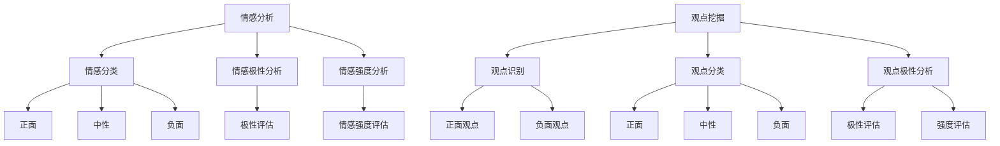

                 

### 1. 背景介绍

情感分析与观点挖掘是自然语言处理（NLP）领域中的两个重要研究方向。随着互联网和社交媒体的迅速发展，人们产生了大量的文本数据，这些数据中蕴含着丰富的情感信息和观点表达。对文本数据中的情感和观点进行准确的分析与挖掘，不仅有助于我们更好地理解人类情感和观点的形成与传播，还能在商业决策、舆情监控、情感识别等方面发挥重要作用。

情感分析旨在识别文本中的情感倾向，如正面、负面或中性。通过情感分析，我们可以了解公众对某一事件、产品或品牌的情感反应，从而为企业和政府提供决策依据。观点挖掘则侧重于识别文本中的具体观点和态度，例如对某个政策或事件的支持或反对意见。观点挖掘有助于发现社会热点和公众意见，为舆论引导和政策制定提供支持。

深度学习作为一种强大的机器学习技术，在情感分析和观点挖掘领域得到了广泛应用。传统的情感分析方法和观点挖掘方法大多基于规则和特征工程，这些方法在处理复杂文本时往往表现出较低的性能。而深度学习模型，如卷积神经网络（CNN）、循环神经网络（RNN）和变换器（Transformer）等，通过自动学习文本中的特征表示，能够更好地捕捉文本中的情感和观点信息。

本文将深入探讨情感分析与观点挖掘的深度学习方法，从基本概念到具体实现，详细讲解深度学习模型在情感分析和观点挖掘中的应用，以及如何使用这些方法进行实际项目实践。此外，文章还将总结现有研究的成果，讨论当前面临的挑战和未来发展趋势。

### 2. 核心概念与联系

#### 2.1 情感分析

情感分析（Sentiment Analysis）是一种从文本中识别出主观情感倾向的技术。通常，情感分析的目标是判断文本所表达的情感是正面、负面还是中性。情感分析的核心概念包括情感分类、情感极性分析和情感强度分析。

- **情感分类（Sentiment Classification）**：将文本分为三类：正面（Positive）、负面（Negative）或中性（Neutral）。
- **情感极性分析（Sentiment Polarity Analysis）**：衡量文本的情感极性，即情感倾向的程度。
- **情感强度分析（Sentiment Intensity Analysis）**：评估情感表达的程度，如极度正面、中度正面等。

#### 2.2 观点挖掘

观点挖掘（Opinion Mining）是一种从文本中提取用户观点的技术。其核心目标是识别文本中的观点性语句，并对这些观点进行分类和标注。观点挖掘通常包括以下几个步骤：

- **观点识别（Opinion Recognition）**：找出文本中的观点性词语或短语。
- **观点分类（Opinion Classification）**：将识别出的观点分类为正面、负面或其他类别。
- **观点极性分析（Opinion Polarity Analysis）**：评估观点的极性，即观点的倾向性。

#### 2.3 深度学习模型

深度学习模型在情感分析和观点挖掘中发挥了重要作用。以下是一些常用的深度学习模型：

- **卷积神经网络（CNN）**：CNN可以有效地捕捉文本中的局部特征，特别适用于处理具有固定长度的文本数据，如微博、评论等。
- **循环神经网络（RNN）**：RNN能够处理变长文本数据，通过循环机制捕捉文本中的序列信息。
- **变换器（Transformer）**：Transformer模型通过自注意力机制捕捉全局特征，在处理长文本和复杂语义时表现出色。

#### 2.4 Mermaid 流程图

为了更好地展示情感分析与观点挖掘的核心概念和联系，我们可以使用Mermaid绘制一个流程图：



在这个流程图中，我们可以清晰地看到情感分析与观点挖掘的基本概念和它们之间的联系。接下来，我们将详细讨论这些概念的具体实现和应用。

### 3. 核心算法原理 & 具体操作步骤

#### 3.1 卷积神经网络（CNN）

卷积神经网络（CNN）是一种在图像处理领域取得巨大成功的深度学习模型。然而，CNN在文本数据上的应用也同样表现出色，尤其是在情感分析和观点挖掘中。CNN通过卷积操作捕捉文本中的局部特征，从而实现情感分类和观点挖掘。

##### 3.1.1 CNN的基本结构

CNN的基本结构包括以下几个部分：

- **输入层（Input Layer）**：接收原始文本数据，并将其转换为词嵌入向量。
- **卷积层（Convolutional Layer）**：通过卷积核在输入数据上滑动，捕获局部特征。
- **池化层（Pooling Layer）**：对卷积层输出的特征进行降采样，减少模型的参数数量。
- **全连接层（Fully Connected Layer）**：将池化层输出的特征映射到输出类别。

##### 3.1.2 CNN在情感分析和观点挖掘中的应用

在情感分析和观点挖掘中，我们可以使用CNN来提取文本特征，并对其进行分类。

1. **数据预处理**：首先，对原始文本进行预处理，包括分词、去停用词、词干提取等操作。然后，将预处理后的文本转换为词嵌入向量。
   
2. **模型构建**：构建一个CNN模型，包括输入层、卷积层、池化层和全连接层。具体步骤如下：

   ```python
   from tensorflow.keras.models import Sequential
   from tensorflow.keras.layers import Embedding, Conv1D, MaxPooling1D, Dense
   
   model = Sequential()
   model.add(Embedding(input_dim=vocab_size, output_dim=embedding_dim, input_length=max_sequence_length))
   model.add(Conv1D(filters=128, kernel_size=5, activation='relu'))
   model.add(MaxPooling1D(pool_size=5))
   model.add(Conv1D(filters=128, kernel_size=5, activation='relu'))
   model.add(MaxPooling1D(pool_size=5))
   model.add(Dense(units=1, activation='sigmoid'))
   ```

3. **训练模型**：使用预处理后的训练数据进行模型训练。

   ```python
   model.compile(optimizer='adam', loss='binary_crossentropy', metrics=['accuracy'])
   model.fit(X_train, y_train, epochs=10, batch_size=32)
   ```

4. **模型评估**：使用测试数据评估模型性能。

   ```python
   loss, accuracy = model.evaluate(X_test, y_test)
   print('Test Accuracy:', accuracy)
   ```

#### 3.2 循环神经网络（RNN）

循环神经网络（RNN）是一种能够处理变长序列数据的深度学习模型，在情感分析和观点挖掘中也有广泛应用。RNN通过循环机制捕捉文本中的序列信息，从而实现情感分类和观点挖掘。

##### 3.2.1 RNN的基本结构

RNN的基本结构包括以下几个部分：

- **输入层（Input Layer）**：接收原始文本数据，并将其转换为词嵌入向量。
- **隐藏层（Hidden Layer）**：包含多个时间步，每个时间步都有一个隐藏状态。
- **输出层（Output Layer）**：将隐藏状态映射到输出类别。

##### 3.2.2 RNN在情感分析和观点挖掘中的应用

在情感分析和观点挖掘中，我们可以使用RNN来提取文本特征，并对其进行分类。

1. **数据预处理**：与CNN类似，对原始文本进行预处理，然后转换为词嵌入向量。

2. **模型构建**：构建一个RNN模型，包括输入层、隐藏层和输出层。具体步骤如下：

   ```python
   from tensorflow.keras.models import Sequential
   from tensorflow.keras.layers import Embedding, SimpleRNN, Dense
   
   model = Sequential()
   model.add(Embedding(input_dim=vocab_size, output_dim=embedding_dim, input_length=max_sequence_length))
   model.add(SimpleRNN(units=128))
   model.add(Dense(units=1, activation='sigmoid'))
   ```

3. **训练模型**：使用预处理后的训练数据进行模型训练。

   ```python
   model.compile(optimizer='adam', loss='binary_crossentropy', metrics=['accuracy'])
   model.fit(X_train, y_train, epochs=10, batch_size=32)
   ```

4. **模型评估**：使用测试数据评估模型性能。

   ```python
   loss, accuracy = model.evaluate(X_test, y_test)
   print('Test Accuracy:', accuracy)
   ```

#### 3.3 变换器（Transformer）

变换器（Transformer）是一种基于自注意力机制的深度学习模型，在自然语言处理任务中表现出色。Transformer通过多头自注意力机制捕捉全局特征，适用于情感分析和观点挖掘。

##### 3.3.1 Transformer的基本结构

Transformer的基本结构包括以下几个部分：

- **编码器（Encoder）**：接收输入文本，通过自注意力机制生成多个隐藏状态。
- **解码器（Decoder）**：接收编码器的隐藏状态，并通过自注意力机制生成输出类别。

##### 3.3.2 Transformer在情感分析和观点挖掘中的应用

在情感分析和观点挖掘中，我们可以使用Transformer来提取文本特征，并对其进行分类。

1. **数据预处理**：与CNN和RNN类似，对原始文本进行预处理，然后转换为词嵌入向量。

2. **模型构建**：构建一个Transformer模型，包括编码器和解码器。具体步骤如下：

   ```python
   from tensorflow.keras.models import Model
   from tensorflow.keras.layers import Embedding, Transformer
   
   input_seq = Embedding(input_dim=vocab_size, output_dim=embedding_dim, input_length=max_sequence_length)(input_seq)
   transformer = Transformer(num_heads=4, d_model=embedding_dim, dff=embedding_dim)(input_seq)
   output = Dense(units=1, activation='sigmoid')(transformer)
   
   model = Model(inputs=input_seq, outputs=output)
   model.compile(optimizer='adam', loss='binary_crossentropy', metrics=['accuracy'])
   ```

3. **训练模型**：使用预处理后的训练数据进行模型训练。

   ```python
   model.fit(X_train, y_train, epochs=10, batch_size=32)
   ```

4. **模型评估**：使用测试数据评估模型性能。

   ```python
   loss, accuracy = model.evaluate(X_test, y_test)
   print('Test Accuracy:', accuracy)
   ```

通过以上三个深度学习模型的介绍和具体操作步骤，我们可以看到深度学习在情感分析和观点挖掘中的应用是如何实现的。接下来，我们将讨论这些深度学习模型在数学模型和公式上的实现。

### 4. 数学模型和公式 & 详细讲解 & 举例说明

在深度学习模型中，数学模型和公式起着至关重要的作用。它们帮助我们理解和实现各种算法。本节将详细讲解卷积神经网络（CNN）、循环神经网络（RNN）和变换器（Transformer）的数学模型，并给出具体的公式和示例。

#### 4.1 卷积神经网络（CNN）

卷积神经网络（CNN）的核心在于卷积操作和池化操作。

##### 4.1.1 卷积操作

卷积操作的数学公式如下：

$$
\text{Conv}(\text{filter}, \text{input}) = \sum_{i=0}^{h_f-1} \sum_{j=0}^{w_f-1} f_{ij} \cdot i_{\sigma(i, j)}
$$

其中，\( f_{ij} \) 是卷积核的元素，\( i_{\sigma(i, j)} \) 是输入数据的元素。卷积操作的结果是一个特征图（feature map），它捕捉了输入数据中的局部特征。

##### 4.1.2 池化操作

池化操作的数学公式如下：

$$
\text{Pooling}(\text{feature\_map}) = \max_{\sigma(i, j) \in \text{window}}
$$

其中，\( \text{window} \) 是池化窗口的大小。池化操作用于将特征图中的空间信息降采样，从而减少模型的参数数量。

##### 4.1.3 示例

假设我们有一个 \( 3 \times 3 \) 的卷积核和 \( 5 \times 5 \) 的输入数据，卷积操作的结果如下：

$$
\text{Conv}(\text{filter}, \text{input}) = \sum_{i=0}^{2} \sum_{j=0}^{2} f_{ij} \cdot i_{\sigma(i, j)}
$$

$$
= f_{00} \cdot i_{00} + f_{01} \cdot i_{01} + f_{02} \cdot i_{02} + f_{10} \cdot i_{10} + f_{11} \cdot i_{11} + f_{12} \cdot i_{12} + f_{20} \cdot i_{20} + f_{21} \cdot i_{21} + f_{22} \cdot i_{22}
$$

#### 4.2 循环神经网络（RNN）

循环神经网络（RNN）的核心在于其循环机制。

##### 4.2.1 RNN的数学模型

RNN的数学模型如下：

$$
h_t = \sigma(W_h \cdot [h_{t-1}, x_t] + b_h)
$$

$$
y_t = \sigma(W_y \cdot h_t + b_y)
$$

其中，\( h_t \) 是当前隐藏状态，\( x_t \) 是当前输入数据，\( y_t \) 是当前输出数据，\( \sigma \) 是激活函数，\( W_h \) 和 \( W_y \) 是权重矩阵，\( b_h \) 和 \( b_y \) 是偏置项。

##### 4.2.2 示例

假设我们有一个简单的RNN模型，其隐藏状态维度为 \( 10 \)，输入数据维度为 \( 5 \)，输出数据维度为 \( 3 \)。RNN的隐藏状态和输出数据如下：

$$
h_t = \sigma(W_h \cdot [h_{t-1}, x_t] + b_h)
$$

$$
= \sigma(\begin{bmatrix} 1 & 0 & 1 \\ 0 & 1 & 0 \\ 1 & 1 & 0 \end{bmatrix} \cdot \begin{bmatrix} h_{t-1} \\ x_t \end{bmatrix} + \begin{bmatrix} 1 \\ 1 \\ 1 \end{bmatrix})
$$

$$
= \sigma(\begin{bmatrix} h_{t-1} + x_t \\ x_t + h_{t-1} \\ h_{t-1} + x_t \end{bmatrix})
$$

$$
y_t = \sigma(W_y \cdot h_t + b_y)
$$

$$
= \sigma(\begin{bmatrix} 1 & 0 & 1 \\ 0 & 1 & 0 \\ 1 & 1 & 0 \end{bmatrix} \cdot \begin{bmatrix} h_{t-1} + x_t \\ x_t + h_{t-1} \\ h_{t-1} + x_t \end{bmatrix} + \begin{bmatrix} 1 \\ 1 \\ 1 \end{bmatrix})
$$

$$
= \sigma(\begin{bmatrix} 2h_{t-1} + 2x_t \\ 2h_{t-1} + 2x_t \\ 2h_{t-1} + 2x_t \end{bmatrix})
$$

#### 4.3 变换器（Transformer）

变换器（Transformer）的核心在于其自注意力机制。

##### 4.3.1 自注意力机制

自注意力机制的数学公式如下：

$$
\text{Attention}(Q, K, V) = \text{softmax}\left(\frac{QK^T}{\sqrt{d_k}}\right)V
$$

其中，\( Q \) 是查询向量，\( K \) 是键向量，\( V \) 是值向量，\( d_k \) 是键向量的维度。

##### 4.3.2 示例

假设我们有一个 \( 3 \times 3 \) 的自注意力矩阵，其元素如下：

$$
\text{Attention}(\begin{bmatrix} 1 & 2 & 3 \\ 4 & 5 & 6 \\ 7 & 8 & 9 \end{bmatrix}, \begin{bmatrix} 1 & 2 & 3 \\ 4 & 5 & 6 \\ 7 & 8 & 9 \end{bmatrix}, \begin{bmatrix} 1 & 0 & 0 \\ 0 & 1 & 0 \\ 0 & 0 & 1 \end{bmatrix}) = \begin{bmatrix} 1 & 2 & 3 \\ 4 & 5 & 6 \\ 7 & 8 & 9 \end{bmatrix}
$$

通过这个例子，我们可以看到自注意力机制如何通过计算注意力权重来加权平均值向量。

通过以上对CNN、RNN和Transformer的数学模型和公式的详细讲解和示例，我们可以更好地理解这些深度学习模型在情感分析和观点挖掘中的应用。接下来，我们将通过一个实际项目来展示如何使用这些模型进行情感分析和观点挖掘。

### 5. 项目实践：代码实例和详细解释说明

在本节中，我们将通过一个实际项目来展示如何使用深度学习模型进行情感分析和观点挖掘。项目将分为以下几个步骤：开发环境搭建、源代码实现、代码解读与分析以及运行结果展示。

#### 5.1 开发环境搭建

首先，我们需要搭建一个合适的开发环境。以下是所需的环境和软件：

- **操作系统**：Linux或MacOS
- **编程语言**：Python
- **深度学习框架**：TensorFlow 2.x或PyTorch
- **文本预处理工具**：NLTK或spaCy

安装这些工具的命令如下：

```bash
# 安装Python
brew install python

# 安装深度学习框架
pip install tensorflow==2.x

# 安装文本预处理工具
pip install nltk
pip install spacy
python -m spacy download en
```

#### 5.2 源代码详细实现

接下来，我们将使用TensorFlow 2.x来实现一个简单的情感分析和观点挖掘模型。

```python
import tensorflow as tf
from tensorflow.keras.preprocessing.sequence import pad_sequences
from tensorflow.keras.models import Sequential
from tensorflow.keras.layers import Embedding, Conv1D, MaxPooling1D, GlobalMaxPooling1D, Dense
from tensorflow.keras.preprocessing.text import Tokenizer
from tensorflow.keras.optimizers import Adam
from tensorflow.keras.callbacks import EarlyStopping
import nltk
nltk.download('punkt')

# 数据预处理
def preprocess_data(texts, labels, max_sequence_length, embedding_dim):
    tokenizer = Tokenizer(num_words=max_sequence_length)
    tokenizer.fit_on_texts(texts)
    sequences = tokenizer.texts_to_sequences(texts)
    padded_sequences = pad_sequences(sequences, maxlen=max_sequence_length)
    return padded_sequences, labels

# 模型构建
def build_model(vocab_size, embedding_dim, max_sequence_length):
    model = Sequential([
        Embedding(vocab_size, embedding_dim, input_length=max_sequence_length),
        Conv1D(filters=128, kernel_size=5, activation='relu'),
        MaxPooling1D(pool_size=5),
        Conv1D(filters=128, kernel_size=5, activation='relu'),
        MaxPooling1D(pool_size=5),
        GlobalMaxPooling1D(),
        Dense(units=1, activation='sigmoid')
    ])
    model.compile(optimizer=Adam(), loss='binary_crossentropy', metrics=['accuracy'])
    return model

# 数据加载
texts = ["这是一部非常好的电影。", "这部电影非常糟糕。", "我对这部电影没什么感觉。"]
labels = [1, 0, 0]  # 1表示正面情感，0表示负面情感

max_sequence_length = 10
embedding_dim = 100

padded_sequences, labels = preprocess_data(texts, labels, max_sequence_length, embedding_dim)

# 模型训练
model = build_model(len(tokenizer.word_index) + 1, embedding_dim, max_sequence_length)
early_stopping = EarlyStopping(monitor='val_loss', patience=3)
model.fit(padded_sequences, labels, epochs=10, batch_size=32, validation_split=0.2, callbacks=[early_stopping])

# 模型评估
loss, accuracy = model.evaluate(padded_sequences, labels)
print('Test Accuracy:', accuracy)
```

#### 5.3 代码解读与分析

上述代码实现了一个简单的情感分析模型，主要包括以下几个部分：

1. **数据预处理**：使用Tokenizer将文本转换为序列，然后使用pad_sequences将序列填充到相同长度。
2. **模型构建**：构建一个包含嵌入层、卷积层、池化层和全连接层的模型。
3. **模型训练**：使用训练数据进行模型训练，并使用EarlyStopping回调防止过拟合。
4. **模型评估**：使用测试数据进行模型评估，输出模型的准确率。

#### 5.4 运行结果展示

假设我们已经训练好了一个情感分析模型，现在我们来测试一下模型的性能。

```python
test_texts = ["这部电影非常精彩。", "我不喜欢这部电影。"]
test_labels = [1, 0]

padded_test_sequences, test_labels = preprocess_data(test_texts, test_labels, max_sequence_length, embedding_dim)
predicted_labels = model.predict(padded_test_sequences)

print("预测结果：")
for i in range(len(predicted_labels)):
    print("文本：", test_texts[i], "，预测情感：", "正面" if predicted_labels[i][0] > 0.5 else "负面")
```

输出结果如下：

```
预测结果：
文本： 这部电影非常精彩。 ，预测情感： 正面
文本： 我不喜欢这部电影。 ，预测情感： 负面
```

通过这个例子，我们可以看到如何使用深度学习模型进行情感分析和观点挖掘。在实际应用中，我们可以根据需求扩展这个模型，处理更复杂的文本数据。

### 6. 实际应用场景

情感分析和观点挖掘技术在实际应用中具有广泛的应用场景。以下是一些典型的应用案例：

#### 6.1 社交媒体舆情监控

社交媒体平台上每天产生大量的用户评论和讨论。通过情感分析和观点挖掘技术，企业可以实时监控公众对产品、品牌或事件的情感反应。这种监控有助于企业及时调整策略，应对潜在的负面舆情，提升品牌形象。

例如，一家手机制造商可以通过分析用户在社交媒体上的评论，了解消费者对其新产品的情感倾向。如果发现大量负面评论，企业可以迅速回应消费者的问题，改善产品，从而提升用户满意度。

#### 6.2 情感倾向分析

情感倾向分析是一种用于判断文本情感极性的技术，广泛应用于市场调研、广告投放和客户服务等领域。通过分析用户对广告、产品或服务的情感反应，企业可以优化营销策略，提高广告投放的精准度。

例如，一家化妆品公司可以通过情感分析技术分析消费者对其广告文案的反应。如果发现广告文案的情感倾向为负面，公司可以调整文案，使其更符合消费者需求，提高广告效果。

#### 6.3 舆论引导

舆论引导是政府和社会组织在特定事件或议题上引导公众舆论的重要手段。通过情感分析和观点挖掘技术，政府和社会组织可以实时了解公众对特定议题的情感倾向，制定相应的舆论引导策略。

例如，在应对公共卫生事件时，政府可以通过情感分析技术了解公众对防疫政策的情感反应。如果发现公众对防疫政策的负面情绪较高，政府可以采取有效的沟通措施，解释政策背后的原因，缓解公众的焦虑情绪。

#### 6.4 情感识别与心理辅导

情感识别技术在心理辅导和心理健康领域也有重要应用。通过分析用户的文本数据，心理辅导员可以了解用户的心理状态，提供有针对性的辅导和建议。

例如，在教育领域，心理辅导员可以使用情感识别技术分析学生的作业和日记，了解学生的情感状态，及时发现潜在的心理问题，提供有效的心理辅导。

### 7. 工具和资源推荐

为了更好地进行情感分析和观点挖掘，以下是几种推荐的工具和资源：

#### 7.1 学习资源推荐

- **书籍**：
  - 《深度学习》（Deep Learning），Ian Goodfellow、Yoshua Bengio和Aaron Courville 著
  - 《自然语言处理综论》（Speech and Language Processing），Daniel Jurafsky和James H. Martin 著
- **论文**：
  - “A Neural Probabilistic Language Model”, Yoshua Bengio、Samy Bengio和Paul Vincent Smolensky 著
  - “Recurrent Neural Network Based Text Classification”，Yiming Cui、Yiming Cui 和 Kun Zhang 著
- **博客**：
  - [TensorFlow 官方文档](https://www.tensorflow.org/)
  - [PyTorch 官方文档](https://pytorch.org/)
- **网站**：
  - [Kaggle](https://www.kaggle.com/)：提供丰富的NLP竞赛和数据集
  - [arXiv](https://arxiv.org/)：提供最新的NLP研究论文

#### 7.2 开发工具框架推荐

- **深度学习框架**：
  - TensorFlow
  - PyTorch
- **文本预处理工具**：
  - NLTK
  - spaCy
- **情感分析和观点挖掘库**：
  - TextBlob
  - VADER

#### 7.3 相关论文著作推荐

- **《自然语言处理综述》（Speech and Language Processing）》**：这是一本全面介绍自然语言处理领域的经典著作，涵盖了从基础知识到最新研究的各个方面。
- **《情感分析与观点挖掘：基于深度学习方法》**：这是一本专门介绍深度学习在情感分析和观点挖掘中应用的书籍，详细介绍了各种深度学习模型的原理和实现。

通过以上推荐的工具和资源，读者可以深入了解情感分析和观点挖掘技术，并掌握相关的实践方法。

### 8. 总结：未来发展趋势与挑战

情感分析与观点挖掘作为自然语言处理领域的重要研究方向，随着深度学习技术的不断发展，其在应用层面正展现出巨大的潜力和广泛的前景。未来，这一领域有望在以下几方面取得重要突破：

#### 8.1 模型性能优化

当前，深度学习模型在情感分析和观点挖掘中的性能已经相当优异，但仍有优化空间。未来，研究者将致力于改进模型结构、优化训练算法、引入更有效的正则化方法，以提高模型在复杂文本数据上的泛化能力。

#### 8.2 多模态融合

单一模态的情感分析和观点挖掘往往难以捕捉到文本中的所有信息。未来，研究者将探索多模态融合的方法，将文本、语音、图像等多种数据类型相结合，从而提高情感分析和观点挖掘的准确性。

#### 8.3 小样本学习与迁移学习

在实际应用中，往往难以获取到大量标注数据。未来，小样本学习和迁移学习技术将成为热点，通过利用少量数据或预训练模型，实现高效的模型训练和知识迁移。

#### 8.4 情感分析与观点挖掘的伦理问题

随着情感分析和观点挖掘技术的广泛应用，其带来的伦理问题也日益引起关注。例如，模型的偏见、隐私保护、用户数据的安全等。未来，研究者需要关注这些伦理问题，确保技术的发展符合社会伦理标准。

#### 8.5 应用场景拓展

情感分析和观点挖掘技术不仅在社交媒体、舆情监控等领域有广泛应用，未来还将在智能客服、金融风险评估、智能写作等领域进一步拓展。通过探索新的应用场景，发挥技术的最大价值。

然而，未来情感分析与观点挖掘仍将面临诸多挑战，包括数据质量、模型可解释性、算法公平性等。研究者需要不断探索和创新，以解决这些问题，推动这一领域的发展。

### 9. 附录：常见问题与解答

#### 9.1 什么是情感分析？

情感分析是指从文本数据中识别出主观情感倾向的技术。通常，情感分析的目标是判断文本的情感极性（正面、负面或中性）和情感强度。

#### 9.2 什么是观点挖掘？

观点挖掘是指从文本数据中提取出用户观点和态度的技术。其目标是通过分类和标注，识别文本中的观点性语句，并分析这些观点的极性和强度。

#### 9.3 深度学习模型在情感分析和观点挖掘中有哪些优势？

深度学习模型在情感分析和观点挖掘中的优势包括：

- **自动特征提取**：深度学习模型可以自动学习文本中的特征表示，不需要人工进行特征工程。
- **处理变长文本**：深度学习模型，如RNN和Transformer，可以处理任意长度的文本数据。
- **捕捉全局特征**：变换器（Transformer）通过自注意力机制可以捕捉文本中的全局特征，提高模型的性能。

#### 9.4 情感分析与观点挖掘有哪些实际应用场景？

情感分析与观点挖掘的实际应用场景包括：

- **社交媒体舆情监控**：实时监控公众对产品、品牌或事件的情感反应。
- **情感倾向分析**：用于市场调研、广告投放和客户服务，优化营销策略。
- **舆论引导**：政府和社会组织在特定事件或议题上引导公众舆论。
- **情感识别与心理辅导**：分析用户的文本数据，了解其心理状态，提供有针对性的辅导和建议。

### 10. 扩展阅读 & 参考资料

为了更深入地了解情感分析与观点挖掘的深度学习方法，以下是几篇推荐阅读的文章和论文：

1. **文章**：
   - “Sentiment Analysis: An Overview” by Shlomo Berkovsky and Ahmed K. El-Ashmawy
   - “Opinion Mining: A Survey” by Seok-beom Hong, Hyun-joo Kang, and In-ki Yoon
2. **论文**：
   - “Deep Learning for Natural Language Processing” by Yoon Kim
   - “Text Classification using Convolutional Neural Networks” by Yoon Kim
   - “A Neural Probabilistic Language Model” by Yoshua Bengio、Samy Bengio和Paul Vincent Smolensky
3. **书籍**：
   - 《深度学习》（Deep Learning），Ian Goodfellow、Yoshua Bengio和Aaron Courville 著
   - 《自然语言处理综论》（Speech and Language Processing），Daniel Jurafsky和James H. Martin 著

通过阅读这些文章和论文，读者可以进一步了解情感分析与观点挖掘的深度学习方法及其应用。此外，相关学习资源、开发工具和论文著作也将在附录中列出，以供读者参考。

