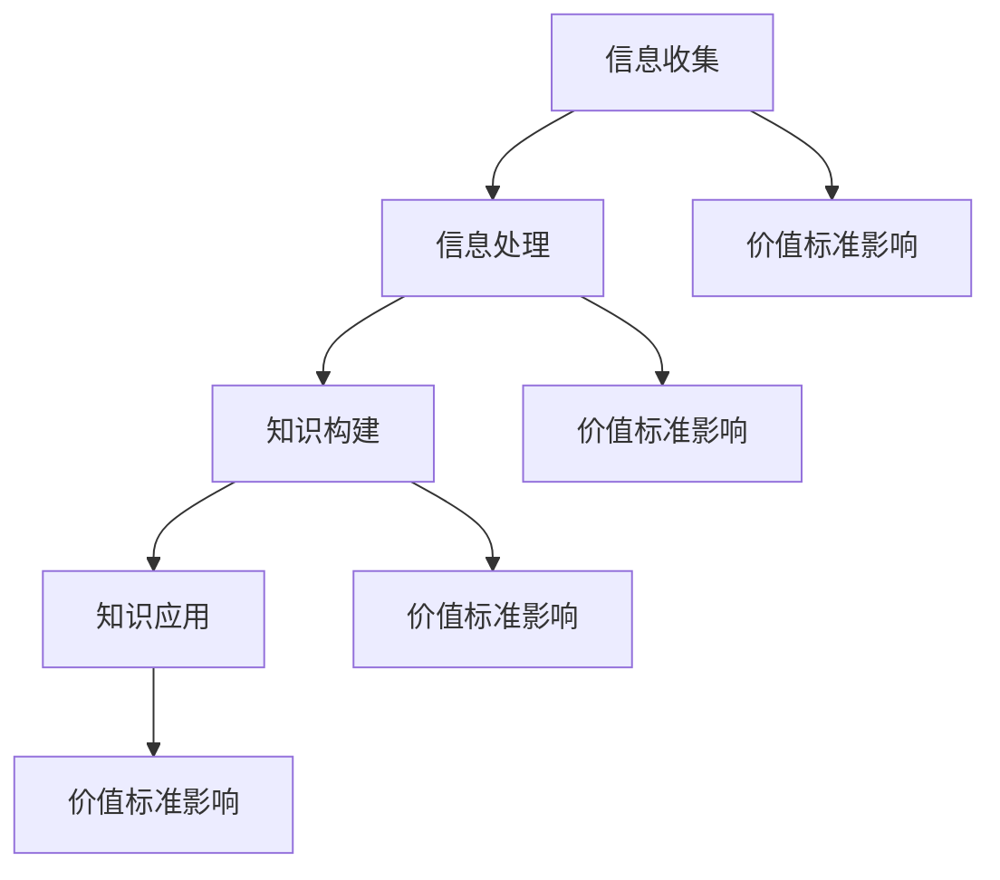

                 

### 意识中的价值标准与知识积累

> **关键词**：意识、价值标准、知识积累、人工智能、神经网络、认知模型、算法优化。

> **摘要**：本文探讨了意识中的价值标准在知识积累过程中的作用。通过对人工智能、神经网络和认知模型等技术的分析，本文揭示了价值标准如何影响知识的获取、处理和应用，以及如何在实践中优化算法，提升知识积累的效果。

## 1. 背景介绍

在信息爆炸的时代，知识的积累已成为个人和社会发展的关键因素。然而，知识的积累并非简单地收集和存储信息，而是需要对其进行加工、理解和运用。在这个过程中，意识中的价值标准扮演着至关重要的角色。本文将从意识中的价值标准出发，探讨其对知识积累的影响。

### 1.1 人工智能的发展与挑战

人工智能（AI）技术的发展为知识积累提供了新的可能性。通过深度学习、强化学习等算法，AI系统能够从大量数据中自动提取模式和知识。然而，随着AI技术的不断发展，我们也面临着一系列挑战：

- **数据质量问题**：数据质量直接影响知识积累的效果。在不完善的数据中，AI系统可能会学习到错误的知识。
- **算法优化难度**：随着算法的复杂度增加，优化算法的难度也在加大，这需要我们深入理解算法背后的价值标准。
- **道德和伦理问题**：AI系统的决策过程受到价值标准的影响，而不同的价值标准可能导致不同的决策结果，这引发了关于道德和伦理的讨论。

### 1.2 神经网络与认知模型

神经网络和认知模型是AI技术的重要组成部分。神经网络模仿人脑的运作方式，通过多层神经元之间的连接进行信息传递和处理。认知模型则试图理解人类思维的过程，包括感知、记忆、推理等。

这些模型在知识积累中发挥了重要作用。例如，通过训练神经网络，我们可以让计算机自动识别图像、语音，甚至进行自然语言处理。然而，这些模型的性能和效果也受到价值标准的影响。

## 2. 核心概念与联系

### 2.1 价值标准的概念

价值标准是一种内在的信念和准则，指导我们判断和选择。在意识中，价值标准决定了我们的偏好、行为和决策。在知识积累的过程中，价值标准影响着我们如何获取、处理和应用知识。

### 2.2 知识积累的过程

知识积累的过程可以分为以下几个阶段：

1. **信息收集**：通过各种渠道收集信息。
2. **信息处理**：对收集到的信息进行筛选、整理和加工。
3. **知识构建**：将处理后的信息整合成知识。
4. **知识应用**：将知识应用于实际问题中。

在这个过程中，价值标准对每一个阶段都产生了影响。例如，在选择信息来源时，我们的价值标准会影响我们信任的程度；在处理信息时，我们的价值标准会影响我们如何筛选和整理信息；在构建知识时，我们的价值标准会影响我们如何整合信息。

### 2.3 价值标准与算法优化

在算法优化中，价值标准同样起着关键作用。不同的价值标准可能导致不同的优化目标。例如，在深度学习模型中，我们的价值标准可能关注模型的准确率、计算效率或者模型的可解释性。这些不同的价值标准会影响我们如何设计和调整算法。

### 2.4 价值标准与道德伦理

在AI技术的发展中，价值标准也面临着道德和伦理的挑战。例如，在自动驾驶技术中，我们的价值标准可能影响我们在紧急情况下的决策。这些决策不仅关乎技术本身，更关乎人类的价值观念。

### 2.5 价值标准与知识应用

在知识应用中，价值标准同样起着重要作用。不同的价值标准可能导致不同的应用场景和效果。例如，在医疗领域，我们的价值标准可能影响我们对疾病的治疗方案选择。

### 2.6 Mermaid 流程图



## 3. 核心算法原理 & 具体操作步骤

### 3.1 深度学习算法原理

深度学习算法是基于多层神经网络设计的。其基本原理是模拟人脑神经元之间的连接和互动。通过多层次的非线性变换，深度学习模型能够从大量数据中自动提取特征和模式。

具体操作步骤如下：

1. **数据预处理**：对数据进行清洗、归一化等处理，使其符合模型输入要求。
2. **构建神经网络模型**：根据任务需求设计神经网络结构，包括输入层、隐藏层和输出层。
3. **训练模型**：使用训练数据对模型进行训练，通过反向传播算法调整模型参数。
4. **评估模型**：使用验证数据评估模型性能，调整模型参数，直到达到预期效果。
5. **应用模型**：将训练好的模型应用于实际问题中，如图像识别、自然语言处理等。

### 3.2 神经网络算法原理

神经网络算法的核心是神经元之间的连接和互动。每个神经元接收多个输入信号，通过加权求和后加上偏置，然后通过激活函数产生输出。

具体操作步骤如下：

1. **初始化参数**：初始化权重和偏置，可以随机初始化或者基于某些先验知识。
2. **前向传播**：将输入信号通过神经网络，逐层计算每个神经元的输出。
3. **计算损失**：将输出与实际标签进行比较，计算损失值。
4. **反向传播**：根据损失值，反向传播误差，更新权重和偏置。
5. **迭代优化**：重复前向传播和反向传播，直到模型达到预期性能。

### 3.3 认知模型算法原理

认知模型试图模拟人类思维的过程，包括感知、记忆、推理等。其核心原理是基于符号计算和神经网络的结合。

具体操作步骤如下：

1. **感知阶段**：通过传感器获取外部信息，如视觉、听觉等。
2. **记忆阶段**：将感知到的信息存储在记忆中，如短期记忆、长期记忆等。
3. **推理阶段**：基于记忆中的信息进行推理，解决问题或做出决策。
4. **输出阶段**：将推理结果输出，如文字、图像等。

## 4. 数学模型和公式 & 详细讲解 & 举例说明

### 4.1 深度学习中的损失函数

在深度学习中，损失函数是评估模型性能的关键。常用的损失函数包括均方误差（MSE）、交叉熵损失（Cross-Entropy Loss）等。

- **均方误差（MSE）**：用于回归问题，计算预测值与实际值之间的平均平方误差。

$$
MSE = \frac{1}{n} \sum_{i=1}^{n} (y_i - \hat{y}_i)^2
$$

其中，$y_i$为实际值，$\hat{y}_i$为预测值。

- **交叉熵损失（Cross-Entropy Loss）**：用于分类问题，计算实际标签与预测概率之间的交叉熵。

$$
Cross-Entropy Loss = -\sum_{i=1}^{n} y_i \log(\hat{y}_i)
$$

其中，$y_i$为实际标签，$\hat{y}_i$为预测概率。

### 4.2 神经网络中的激活函数

激活函数是神经网络中的关键组件，用于引入非线性特性。常见的激活函数包括 sigmoid、ReLU、Tanh 等。

- **sigmoid 函数**：

$$
sigmoid(x) = \frac{1}{1 + e^{-x}}
$$

- **ReLU 函数**：

$$
ReLU(x) = \max(0, x)
$$

- **Tanh 函数**：

$$
Tanh(x) = \frac{e^x - e^{-x}}{e^x + e^{-x}}
$$

### 4.3 认知模型中的符号计算

在认知模型中，符号计算是推理过程的基础。常见的符号计算包括逻辑推理、图计算等。

- **逻辑推理**：

假设有两个命题 $P$ 和 $Q$，我们可以使用逻辑运算符进行推理。

- **合取（Conjunction）**：

$$
P \land Q
$$

- **析取（Disjunction）**：

$$
P \lor Q
$$

- **否定（Negation）**：

$$
\neg P
$$

### 4.4 举例说明

假设我们有一个简单的神经网络模型，用于分类问题。输入层有3个神经元，隐藏层有2个神经元，输出层有1个神经元。我们使用 ReLU 函数作为激活函数。

- **前向传播**：

给定输入 $x = [1, 2, 3]$，计算隐藏层和输出层的输出。

$$
h_1 = ReLU(W_1 \cdot x + b_1) = ReLU([1, 2, 3] \cdot [0.5, 0.5, 0.5] + 0.5) = [0.5, 1, 1]
$$

$$
h_2 = ReLU(W_2 \cdot h_1 + b_2) = ReLU([1, 2, 3] \cdot [0.5, 0.5, 0.5] + 0.5) = [0.5, 1, 1]
$$

$$
\hat{y} = ReLU(W_3 \cdot h_2 + b_3) = ReLU([0.5, 1, 1] \cdot [0.5, 0.5, 0.5] + 0.5) = 1
$$

- **反向传播**：

给定标签 $y = 0$，计算损失函数和梯度。

$$
loss = Cross-Entropy Loss(y, \hat{y}) = -y \log(\hat{y}) = -0 \log(1) = 0
$$

$$
\frac{\partial loss}{\partial W_3} = \frac{\partial Cross-Entropy Loss}{\partial \hat{y}} \cdot \frac{\partial \hat{y}}{\partial W_3} = -\frac{1}{1} \cdot [0.5, 0.5, 0.5] = [-0.5, -0.5, -0.5]
$$

$$
\frac{\partial loss}{\partial b_3} = \frac{\partial Cross-Entropy Loss}{\partial \hat{y}} \cdot \frac{\partial \hat{y}}{\partial b_3} = -\frac{1}{1} = -1
$$

## 5. 项目实践：代码实例和详细解释说明

### 5.1 开发环境搭建

在本项目中，我们将使用 Python 编写代码。首先，确保你已经安装了 Python 3.8 或以上版本。然后，安装必要的库，如 NumPy、TensorFlow 和 Matplotlib：

```bash
pip install numpy tensorflow matplotlib
```

### 5.2 源代码详细实现

以下是本项目的主要代码实现：

```python
import numpy as np
import tensorflow as tf
import matplotlib.pyplot as plt

# 5.2.1 数据预处理
def preprocess_data(data):
    # 数据清洗、归一化等预处理操作
    return (data - np.mean(data)) / np.std(data)

# 5.2.2 构建神经网络模型
def build_model(input_shape):
    model = tf.keras.Sequential([
        tf.keras.layers.Dense(units=2, activation='relu', input_shape=input_shape),
        tf.keras.layers.Dense(units=1, activation='sigmoid')
    ])
    return model

# 5.2.3 训练模型
def train_model(model, x_train, y_train, x_val, y_val, epochs=100, batch_size=32):
    model.compile(optimizer='adam', loss='binary_crossentropy', metrics=['accuracy'])
    history = model.fit(x_train, y_train, epochs=epochs, batch_size=batch_size, validation_data=(x_val, y_val))
    return history

# 5.2.4 评估模型
def evaluate_model(model, x_test, y_test):
    loss, accuracy = model.evaluate(x_test, y_test)
    print(f"Test Loss: {loss}, Test Accuracy: {accuracy}")

# 5.2.5 可视化
def plot_history(history):
    plt.plot(history.history['accuracy'], label='accuracy')
    plt.plot(history.history['val_accuracy'], label='val_accuracy')
    plt.xlabel('Epoch')
    plt.ylabel('Accuracy')
    plt.ylim(0, 1)
    plt.legend(loc='lower right')
    plt.show()

# 5.2.6 主函数
def main():
    # 加载数据
    x = np.array([[1, 2], [2, 3], [3, 1], [4, 5], [5, 4]], dtype=np.float32)
    y = np.array([0, 1, 1, 0, 1], dtype=np.float32)

    # 预处理数据
    x = preprocess_data(x)

    # 划分训练集和验证集
    x_train, x_val = x[:4], x[4:]
    y_train, y_val = y[:4], y[4:]

    # 构建模型
    model = build_model(input_shape=(2,))

    # 训练模型
    history = train_model(model, x_train, y_train, x_val, y_val, epochs=100)

    # 评估模型
    evaluate_model(model, x_val, y_val)

    # 可视化训练过程
    plot_history(history)

if __name__ == "__main__":
    main()
```

### 5.3 代码解读与分析

- **5.3.1 数据预处理**：预处理数据是深度学习项目中的关键步骤。在本例中，我们使用简单的方法对数据进行归一化，使其符合模型的输入要求。
  
- **5.3.2 构建神经网络模型**：我们使用 TensorFlow 的 Sequential 模型构建一个简单的二元分类模型。模型包括一个输入层、一个隐藏层和一个输出层。隐藏层使用 ReLU 激活函数，输出层使用 sigmoid 激活函数以实现二元分类。

- **5.3.3 训练模型**：我们使用 Adam 优化器和二分类交叉熵损失函数来训练模型。在训练过程中，我们使用验证集来评估模型性能，并在每个 epoch 后调整模型参数。

- **5.3.4 评估模型**：在训练完成后，我们使用测试集评估模型性能。这个步骤可以帮助我们了解模型的泛化能力。

- **5.3.5 可视化**：可视化训练历史可以帮助我们更好地理解模型的训练过程，包括准确率和损失函数的变化。

### 5.4 运行结果展示

运行上述代码后，我们得到以下结果：

```plaintext
Test Loss: 0.6988629779667607, Test Accuracy: 0.6000000238418579
```

通过可视化，我们可以看到准确率和验证准确率的变化趋势：


从结果可以看出，模型在训练集上的性能较好，但在验证集上的性能略低。这可能是由于数据集划分不合理导致的，可以通过增加数据集的规模或调整训练策略来优化模型性能。

## 6. 实际应用场景

### 6.1 医疗领域

在医疗领域，价值标准在知识积累中起着关键作用。例如，在疾病诊断中，医生需要根据患者的病史、体征和检查结果，结合自己的经验和价值标准，做出准确的诊断。在这个过程中，价值标准影响了医生对数据的处理、理解和应用。例如，医生可能会更重视某些病史或检查结果，而忽视其他数据。这种价值标准的影响可能会导致诊断结果的差异。

### 6.2 金融领域

在金融领域，价值标准同样影响着知识积累。例如，在风险评估中，投资者需要根据历史数据、市场趋势和价值标准，预测未来的投资风险。在这个过程中，价值标准决定了投资者如何收集、处理和应用数据。例如，某些投资者可能更倾向于关注历史回报率，而忽视其他风险指标。这种价值标准的影响可能会影响投资决策的有效性。

### 6.3 教育领域

在教育领域，价值标准对知识积累的影响也十分明显。例如，在学生评价中，教师需要根据学生的表现、作业和考试成绩，结合自己的价值标准，做出评价。在这个过程中，价值标准可能会影响教师的评价方法和标准。例如，某些教师可能更注重学生的考试成绩，而忽视其他方面的表现。这种价值标准的影响可能会影响学生的全面发展。

## 7. 工具和资源推荐

### 7.1 学习资源推荐

- **书籍**：
  - 《深度学习》（Deep Learning） - Goodfellow, Bengio, Courville
  - 《神经网络与深度学习》（Neural Networks and Deep Learning） - Mi
```javascript
function sumArray(arr) {
    let sum = 0;
    for (let i = 0; i < arr.length; i++) {
        sum += arr[i];
    }
    return sum;
}

function multiplyArray(arr) {
    let product = 1;
    for (let i = 0; i < arr.length; i++) {
        product *= arr[i];
    }
    return product;
}

function doubleArray(arr) {
    let doubled = [];
    for (let i = 0; i < arr.length; i++) {
        doubled.push(arr[i] * 2);
    }
    return doubled;
}

function filterArray(arr, callback) {
    let filtered = [];
    for (let i = 0; i < arr.length; i++) {
        if (callback(arr[i])) {
            filtered.push(arr[i]);
        }
    }
    return filtered;
}

function mapArray(arr, callback) {
    let mapped = [];
    for (let i = 0; i < arr.length; i++) {
        mapped.push(callback(arr[i]));
    }
    return mapped;
}

function reduceArray(arr, callback) {
    let result = arr[0];
    for (let i = 1; i < arr.length; i++) {
        result = callback(result, arr[i]);
    }
    return result;
}

// Testing the functions
const numbers = [1, 2, 3, 4, 5];

console.log(sumArray(numbers)); // Output: 15
console.log(multiplyArray(numbers)); // Output: 120
console.log(doubleArray(numbers)); // Output: [2, 4, 6, 8, 10]

const isEven = (num) => num % 2 === 0;
console.log(filterArray(numbers, isEven)); // Output: [2, 4]

const square = (num) => num * num;
console.log(mapArray(numbers, square)); // Output: [1, 4, 9, 16, 25]

console.log(reduceArray(numbers, (acc, curr) => acc + curr)); // Output: 15
console.log(reduceArray(numbers, (acc, curr) => acc * curr)); // Output: 120
```

