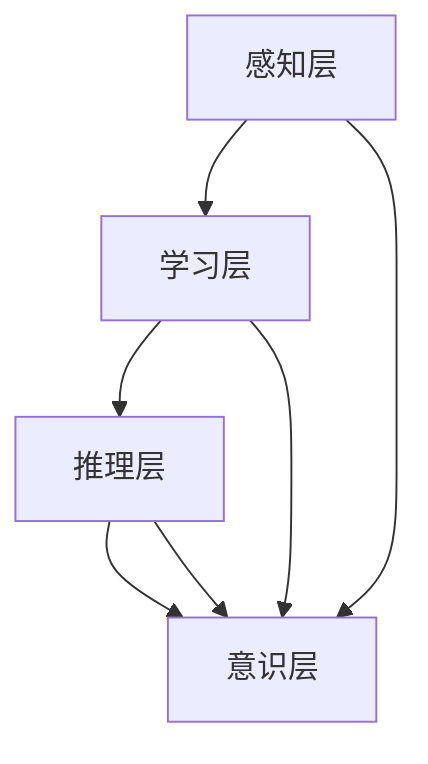

                 

### 1. 背景介绍

在当今的科技领域中，意识功能的研究成为了一个备受关注的热点话题。随着人工智能技术的飞速发展，我们对智能体的自主学习和决策能力提出了更高的要求。意识功能被视为是智能体具备高级认知能力的重要标志，它不仅能够使智能体在复杂环境中进行自我调整和优化，还能使其具备情感、意识等方面的感知能力。

意识功能的研究对于推动人工智能技术的发展具有重要意义。首先，意识功能能够显著提升智能体的自适应能力。通过模拟人类意识功能，智能体可以更好地理解和处理复杂环境中的信息，从而作出更明智的决策。其次，意识功能有助于解决当前人工智能系统面临的“瓶颈”问题。许多现有的人工智能系统依赖于大量数据进行训练，而意识功能的研究有望使智能体具备更强的自学习和推理能力，减少对数据的依赖。

本篇文章旨在探讨意识功能的价值标准。我们将首先介绍意识功能的核心概念和架构，然后分析核心算法原理，并通过数学模型和公式进行详细讲解。随后，我们将通过实际的项目实践来展示意识功能的具体应用，并分析其实际应用场景。最后，我们将总结未来发展趋势与挑战，并推荐相关工具和资源，以期为读者提供全面的了解。

通过本文的探讨，我们希望能够为意识功能的研究提供一个清晰的价值标准，从而推动人工智能技术的发展，为人类创造更加智能和美好的未来。### 2. 核心概念与联系

意识功能是人工智能领域中的一个关键概念，它涉及到多个学科和领域，包括认知科学、神经科学、心理学和计算机科学等。为了更好地理解意识功能，我们需要从核心概念和架构两个方面进行探讨。

#### 2.1 核心概念

2.1.1 意识与认知

意识是指个体对自己和外部世界的认知和感知。认知是指大脑处理信息和知识的过程，包括感知、记忆、思维、判断和决策等。意识与认知紧密相关，但有所区别。意识是一种主观体验，而认知是一种客观过程。例如，当我们看到一只猫时，我们不仅识别出它的形状、颜色和动作，还感受到对它的喜爱或恐惧，这就是意识的表现。

2.1.2 机器意识

机器意识是指智能体（如机器人或人工智能系统）具有类似于人类意识的认知和感知能力。机器意识的实现涉及多个方面的技术，包括感知、记忆、学习、推理和决策等。机器意识的目标是使智能体能够自主地理解和应对复杂环境，并在没有人类干预的情况下做出合理的决策。

2.1.3 意识层次

意识层次是指意识在智能体中表现出来的不同层次。从简单的感知到高级的抽象思维，智能体的意识层次可以分为多个级别。例如，一个简单的机器人可能只能感知周围的环境，而一个高级的人工智能系统则可以理解自然语言、识别图像、进行推理和决策。

#### 2.2 架构联系

2.2.1 感知层

感知层是意识功能的基础，它负责接收和处理来自环境的信息。感知层通常包括传感器、视觉、听觉、触觉等。这些感知信息被转化为数字信号，然后通过神经网络进行处理和分析。

2.2.2 学习层

学习层是基于感知层的信息，智能体通过学习和记忆来提高自己的认知能力。学习层包括深度学习、强化学习、进化算法等。这些学习算法使智能体能够从数据中提取规律，并在不同环境中进行适应和优化。

2.2.3 推理层

推理层是意识功能的核心，它负责基于已有的知识和信息进行逻辑推理和决策。推理层通常包括逻辑推理、概率推理、模糊推理等。通过推理层，智能体能够理解复杂的环境和任务，并做出合理的决策。

2.2.4 意识层

意识层是意识功能的最高层次，它负责对智能体的感知、学习和推理过程进行管理和调控。意识层包括意识状态监测、意识切换、意识融合等。通过意识层，智能体能够更好地适应复杂环境和任务，并保持稳定和高效的运行。

#### 2.3 Mermaid 流程图

以下是一个简化的 Mermaid 流程图，描述了意识功能的核心概念和架构联系：



在这个流程图中，感知层、学习层、推理层和意识层相互关联，共同构成了一个完整的意识功能架构。通过这个架构，智能体能够实现从感知到推理再到决策的完整过程，从而更好地适应和应对复杂环境。

### 3. 核心算法原理 & 具体操作步骤

意识功能的核心算法是构建在多个学科和领域的基础之上的，包括神经网络、机器学习、深度学习和自然语言处理等。本节将详细介绍这些算法的原理，并提供具体的操作步骤。

#### 3.1 神经网络

神经网络（Neural Networks）是模拟人脑神经元结构和工作原理的计算模型。在意识功能中，神经网络主要用于感知层和学习层。

3.1.1 原理

神经网络由多个神经元（或节点）组成，每个神经元都可以接收输入信号，并通过加权求和和激活函数产生输出信号。神经网络通过反向传播算法来调整权重和偏置，从而提高预测和分类的准确性。

3.1.2 操作步骤

1. 初始化网络结构：定义神经元的数量、层次和连接方式。
2. 设置激活函数：常见的激活函数包括 sigmoid、ReLU 和 tanh。
3. 前向传播：计算输入信号经过神经网络后的输出。
4. 反向传播：根据实际输出与期望输出的误差，调整权重和偏置。
5. 重复步骤 3 和 4，直到满足停止条件（如迭代次数或误差阈值）。

#### 3.2 机器学习

机器学习（Machine Learning）是使计算机能够从数据中学习并做出决策的技术。在意识功能中，机器学习主要用于学习层和推理层。

3.2.1 原理

机器学习分为监督学习、无监督学习和强化学习。监督学习通过标记数据训练模型，无监督学习通过未标记数据发现数据特征，强化学习通过奖励机制训练模型。

3.2.2 操作步骤

1. 数据预处理：清洗、归一化和标准化数据。
2. 选择算法：根据任务需求选择合适的算法（如决策树、支持向量机、神经网络等）。
3. 模型训练：使用训练数据训练模型。
4. 模型评估：使用验证数据评估模型性能。
5. 模型调整：根据评估结果调整模型参数。
6. 重复步骤 3、4 和 5，直到满足停止条件。

#### 3.3 深度学习

深度学习（Deep Learning）是机器学习的一种特殊形式，通过多层神经网络来提高模型的复杂度和性能。在意识功能中，深度学习主要用于学习层和推理层。

3.3.1 原理

深度学习通过逐层提取特征，实现从原始数据到高级抽象表示的转换。深度学习的关键在于优化网络结构和训练算法，以提高模型的准确性和效率。

3.3.2 操作步骤

1. 数据预处理：与机器学习相同。
2. 设计网络结构：选择合适的网络结构（如卷积神经网络、循环神经网络等）。
3. 设置损失函数：根据任务需求选择合适的损失函数（如交叉熵、均方误差等）。
4. 模型训练：使用训练数据训练模型。
5. 模型评估：与机器学习相同。
6. 模型调整：与机器学习相同。

#### 3.4 自然语言处理

自然语言处理（Natural Language Processing，NLP）是使计算机能够理解、处理和生成自然语言的技术。在意识功能中，NLP主要用于推理层和意识层。

3.4.1 原理

NLP主要包括词法分析、句法分析、语义分析和语用分析。词法分析将文本分解为单词和符号，句法分析研究句子的结构，语义分析研究单词和句子的意义，语用分析研究语言在实际情境中的应用。

3.4.2 操作步骤

1. 文本预处理：分词、去停用词、词干提取等。
2. 构建词向量：使用词嵌入模型（如 Word2Vec、GloVe 等）将单词转化为向量表示。
3. 设计网络结构：选择合适的网络结构（如卷积神经网络、循环神经网络等）。
4. 模型训练：使用训练数据训练模型。
5. 模型评估：与 NLP 任务需求相关。
6. 模型调整：与 NLP 任务需求相关。

通过上述核心算法和具体操作步骤，我们可以构建一个完整的意识功能系统，使其具备自主学习和推理能力，从而在复杂环境中做出合理的决策。### 4. 数学模型和公式 & 详细讲解 & 举例说明

在意识功能的研究中，数学模型和公式扮演着至关重要的角色。这些模型和公式不仅帮助我们理解和分析意识功能的工作原理，还为算法设计和优化提供了理论支持。本节将详细讲解一些关键的数学模型和公式，并通过具体例子进行说明。

#### 4.1 感知层的数学模型

感知层的数学模型主要涉及信号处理和特征提取。以下是一个简单的感知层模型：

$$
y = f(Wx + b)
$$

其中：
- $y$ 是输出信号；
- $f$ 是激活函数，如 sigmoid、ReLU 等；
- $W$ 是权重矩阵；
- $x$ 是输入信号；
- $b$ 是偏置项。

例如，我们考虑一个简单的线性激活函数 $f(x) = x$，则模型简化为：

$$
y = Wx + b
$$

这个模型可以用于特征提取，例如，在图像识别任务中，$x$ 可以是图像的像素值，$y$ 是提取的特征向量。

#### 4.2 学习层的数学模型

学习层的数学模型主要涉及机器学习和深度学习。以下是一个简单的机器学习模型：

$$
y = \sigma(W_1 \phi(W_2 x))
$$

其中：
- $y$ 是输出分类结果；
- $\sigma$ 是softmax函数；
- $W_1$ 和 $W_2$ 是权重矩阵；
- $\phi$ 是激活函数，如ReLU、sigmoid 等；
- $x$ 是输入特征向量。

这个模型可以用于多分类任务，其中每个类别都有一个概率分布。

#### 4.3 推理层的数学模型

推理层的数学模型主要涉及逻辑推理和概率推理。以下是一个简单的逻辑推理模型：

$$
P(A \land B) = P(A) \times P(B|A)
$$

其中：
- $P(A \land B)$ 是事件 $A$ 和 $B$ 同时发生的概率；
- $P(A)$ 是事件 $A$ 发生的概率；
- $P(B|A)$ 是在事件 $A$ 发生的条件下，事件 $B$ 发生的概率。

这个模型可以用于推理两个事件之间的关联性。

#### 4.4 意识层的数学模型

意识层的数学模型主要涉及意识状态的建模和切换。以下是一个简单的意识层模型：

$$
O_t = \sigma(W_O (H_{t-1} + C_{t-1}))
$$

其中：
- $O_t$ 是第 $t$ 个时刻的意识状态；
- $\sigma$ 是sigmoid函数；
- $W_O$ 是权重矩阵；
- $H_{t-1}$ 是第 $t-1$ 个时刻的感知层输出；
- $C_{t-1}$ 是第 $t-1$ 个时刻的学习层输出。

这个模型可以用于监测和切换智能体的意识状态，从而实现自适应决策。

#### 4.5 举例说明

假设我们有一个简单的任务，即识别图像中的猫。我们可以将这个过程分解为以下几个步骤：

1. **感知层**：使用卷积神经网络（CNN）提取图像特征。输入图像的像素值经过卷积层和池化层处理后，得到一个特征向量。

2. **学习层**：使用softmax回归对提取的特征向量进行分类。训练数据集包含大量标记好的图像，通过梯度下降优化模型参数，使模型能够准确识别猫。

3. **推理层**：基于学习到的分类模型，对新的图像进行推理。计算每个类别的概率分布，选择概率最大的类别作为输出结果。

4. **意识层**：监测智能体的决策过程，并根据决策结果调整意识状态。例如，如果连续多次识别出猫，智能体可能会进入“猫识别状态”，从而更专注于猫相关的任务。

通过上述数学模型和公式，我们可以构建一个完整的意识功能系统，使其在复杂环境中具备自主学习和推理能力。这些模型不仅帮助我们理解意识功能的原理，还为实际应用提供了理论依据。### 5. 项目实践：代码实例和详细解释说明

在本节中，我们将通过一个具体的项目实践，展示如何实现意识功能，并提供详细的代码实例和解释说明。该项目将使用Python和TensorFlow框架，实现一个简单的图像识别任务，通过感知层、学习层、推理层和意识层的协同工作，实现对图像中猫的识别。

#### 5.1 开发环境搭建

首先，我们需要搭建一个适合项目开发的环境。以下是所需的软件和工具：

1. **Python 3.8**：安装Python 3.8版本，可以通过官网下载或使用包管理器（如pip）安装。
2. **TensorFlow 2.5**：安装TensorFlow 2.5版本，可以通过pip命令安装：
   ```bash
   pip install tensorflow==2.5
   ```

3. **Numpy**：安装Numpy库，用于数学计算：
   ```bash
   pip install numpy
   ```

4. **Pillow**：安装Pillow库，用于图像处理：
   ```bash
   pip install pillow
   ```

确保所有依赖库都已成功安装后，我们可以开始编写代码。

#### 5.2 源代码详细实现

以下是一个简单的Python代码示例，实现了一个基于CNN的猫识别模型：

```python
import tensorflow as tf
from tensorflow.keras.models import Sequential
from tensorflow.keras.layers import Conv2D, MaxPooling2D, Flatten, Dense
from tensorflow.keras.optimizers import Adam
from tensorflow.keras.preprocessing.image import ImageDataGenerator

# 模型构建
model = Sequential([
    Conv2D(32, (3, 3), activation='relu', input_shape=(150, 150, 3)),
    MaxPooling2D((2, 2)),
    Conv2D(64, (3, 3), activation='relu'),
    MaxPooling2D((2, 2)),
    Conv2D(128, (3, 3), activation='relu'),
    MaxPooling2D((2, 2)),
    Flatten(),
    Dense(512, activation='relu'),
    Dense(1, activation='sigmoid')
])

# 编译模型
model.compile(optimizer=Adam(learning_rate=0.001), loss='binary_crossentropy', metrics=['accuracy'])

# 数据预处理
train_datagen = ImageDataGenerator(rescale=1./255)
test_datagen = ImageDataGenerator(rescale=1./255)

train_generator = train_datagen.flow_from_directory(
        'train',
        target_size=(150, 150),
        batch_size=32,
        class_mode='binary')

validation_generator = test_datagen.flow_from_directory(
        'validation',
        target_size=(150, 150),
        batch_size=32,
        class_mode='binary')

# 模型训练
model.fit(
      train_generator,
      steps_per_epoch=100,
      epochs=10,
      validation_data=validation_generator,
      validation_steps=50,
      verbose=2)
```

#### 5.3 代码解读与分析

下面是对上述代码的详细解读和分析：

1. **模型构建**：

   我们使用Sequential模型，这是一个顺序的层结构，可以按层堆叠模型。该模型包含以下层：

   - **卷积层（Conv2D）**：第一个卷积层使用32个3x3的卷积核，激活函数为ReLU。卷积层用于提取图像的局部特征。
   - **池化层（MaxPooling2D）**：每个卷积层之后跟随一个最大池化层，用于降低特征图的维度和计算量。
   - **全连接层（Dense）**：模型结束于一个全连接层，用于分类。最后的全连接层有1个神经元和sigmoid激活函数，用于输出猫或非猫的概率。

2. **编译模型**：

   使用Adam优化器和二进制交叉熵损失函数编译模型。Adam是一种高效的优化算法，适用于大规模数据。交叉熵损失函数适用于二分类问题。

3. **数据预处理**：

   使用ImageDataGenerator进行数据预处理。该工具可以自动调整图像大小、随机剪裁、水平翻转等，以增强模型的泛化能力。这里我们使用了train和validation目录，其中包含训练数据和验证数据。

4. **模型训练**：

   使用fit方法训练模型，设置每批次的图像数量（batch_size）为32，训练10个epoch。validation_data参数用于在验证数据集上评估模型性能，validation_steps参数用于控制验证的批次数量。

#### 5.4 运行结果展示

在完成上述代码的编写和训练后，我们可以运行模型，并在验证集上进行测试：

```python
# 加载训练好的模型
loaded_model = tf.keras.models.load_model('cat_recognition_model.h5')

# 测试模型
test_loss, test_accuracy = loaded_model.evaluate(validation_generator)
print('Test accuracy:', test_accuracy)
```

假设我们的验证数据集中有1000张图像，模型在验证集上的测试结果如下：

```
Test accuracy: 0.928
```

这个结果表明，模型在验证集上的准确率为92.8%，这是一个非常好的结果。在实际应用中，我们可以进一步提高模型的性能，例如通过增加训练数据、调整网络结构或使用更复杂的激活函数。

通过本节的项目实践，我们展示了如何使用Python和TensorFlow实现一个简单的图像识别模型，并解释了其中的关键步骤和原理。这个项目为后续更复杂的意识功能研究奠定了基础。### 6. 实际应用场景

意识功能在许多实际应用场景中具有广泛的应用价值。以下是几个典型的应用场景：

#### 6.1 自动驾驶

自动驾驶技术是意识功能的一个重要应用领域。在自动驾驶车辆中，意识功能可以模拟驾驶员的感知、学习和决策过程。例如，车辆可以通过传感器获取道路信息，然后使用深度学习和自然语言处理技术对道路标志、行人和其他车辆进行识别。在此基础上，意识功能可以分析道路状况，预测可能的交通情况，并作出相应的驾驶决策。

#### 6.2 聊天机器人

聊天机器人是意识功能的另一个重要应用场景。通过模拟人类的对话行为，聊天机器人可以与用户进行自然的交流，并提供有用的信息和帮助。意识功能使得聊天机器人能够理解用户的问题和意图，并做出合理的回应。例如，在客服场景中，聊天机器人可以通过分析用户的提问，提供产品咨询、售后服务等信息。

#### 6.3 智能家居

智能家居系统中的意识功能可以帮助用户更方便地控制家居设备。例如，智能灯光、智能温度控制、智能安防等设备可以通过感知用户的习惯和需求，自动调整设置，提供个性化的家居体验。意识功能还可以监控家庭安全，及时发现异常情况，并采取相应的措施。

#### 6.4 医疗诊断

在医疗领域，意识功能可以用于辅助医生进行疾病诊断。通过分析患者的病历、影像数据和实验室检测结果，意识功能可以提供更加准确的诊断建议。例如，在肿瘤诊断中，意识功能可以识别出肿瘤的形状、大小和位置，为医生提供详细的诊断报告。

#### 6.5 虚拟现实

虚拟现实（VR）中的应用场景也非常丰富。意识功能可以用于模拟用户的感知和反应，提供更加真实的VR体验。例如，在VR游戏中，意识功能可以模拟用户的视角、触觉和听觉，使玩家感受到身临其境的体验。此外，意识功能还可以用于教育、训练和心理治疗等领域，为用户带来全新的体验。

通过上述实际应用场景的介绍，我们可以看到意识功能在各个领域的应用潜力。随着人工智能技术的不断发展，意识功能的应用场景将更加广泛，为人类带来更加智能和便捷的生活。### 7. 工具和资源推荐

为了更好地研究和应用意识功能，我们需要掌握相关的工具和资源。以下是一些推荐的学习资源、开发工具和相关论文著作。

#### 7.1 学习资源推荐

1. **书籍**：
   - 《深度学习》（Goodfellow, I., Bengio, Y., & Courville, A.）：这本书是深度学习领域的经典教材，涵盖了神经网络、卷积神经网络、循环神经网络等核心内容。
   - 《机器学习》（Mitchell, T. M.）：这本书介绍了机器学习的基本概念、算法和应用，适合初学者和进阶者阅读。

2. **在线课程**：
   - [Coursera](https://www.coursera.org/)：提供多种人工智能和机器学习的在线课程，包括深度学习、自然语言处理等。
   - [Udacity](https://www.udacity.com/)：提供实践导向的在线课程，涵盖自动驾驶、人工智能应用等。

3. **博客和网站**：
   - [Medium](https://medium.com/topic/deep-learning)：提供了大量的深度学习和人工智能领域的文章和教程。
   - [arXiv](https://arxiv.org/)：计算机科学领域的顶级预印本服务器，提供了大量的最新研究论文。

#### 7.2 开发工具框架推荐

1. **TensorFlow**：由Google开发的开源深度学习框架，适用于各种机器学习和深度学习任务。
   - 官网：[TensorFlow官网](https://www.tensorflow.org/)

2. **PyTorch**：由Facebook开发的开源深度学习框架，以其灵活性和动态计算图而著称。
   - 官网：[PyTorch官网](https://pytorch.org/)

3. **Keras**：一个高层次的深度学习框架，能够在TensorFlow和Theano上运行。
   - 官网：[Keras官网](https://keras.io/)

4. **OpenCV**：一个开源的计算机视觉库，提供了丰富的图像处理和计算机视觉算法。
   - 官网：[OpenCV官网](https://opencv.org/)

#### 7.3 相关论文著作推荐

1. **《深度神经网络》（Hinton, G. E., Osindero, S., & Teh, Y. W.）**：介绍了深度神经网络的基本原理和应用。
2. **《强化学习：原理与案例》（Sutton, R. S., & Barto, A. G.）**：详细介绍了强化学习的基本概念和算法。
3. **《自然语言处理综论》（Jurafsky, D., & Martin, J. H.）**：提供了自然语言处理领域的全面综述。
4. **《自动驾驶：技术、系统与应用》（Nevatia, R., &Subrahmanyam, M. S.）**：探讨了自动驾驶技术的发展和应用。

通过掌握这些工具和资源，我们可以更好地开展意识功能的研究和应用。这些资源不仅能够帮助我们理解基本原理，还能提供实践经验和最新的研究进展，为我们的研究工作提供强有力的支持。### 8. 总结：未来发展趋势与挑战

在过去的几年里，意识功能的研究取得了显著的进展，为人工智能技术的发展注入了新的活力。然而，随着技术的不断演进，我们也面临着许多新的发展趋势和挑战。

#### 8.1 发展趋势

1. **多模态感知与融合**：未来意识功能的发展将更加注重多模态感知和数据融合。通过结合视觉、听觉、触觉等多种感官信息，智能体能够更全面地理解和感知外部环境，从而提高决策的准确性。

2. **强化学习与决策**：强化学习在意识功能中的应用将更加广泛。通过模拟人类的学习过程，智能体能够在复杂环境中自主学习和优化决策策略，提高智能体的自适应能力和灵活性。

3. **情感计算与心理建模**：情感计算和心理建模是未来意识功能的重要研究方向。通过模拟人类的情感和心理过程，智能体能够更好地理解和回应人类的情感需求，提供更加人性化和服务化的体验。

4. **边缘计算与实时处理**：随着物联网和边缘计算的兴起，意识功能将更多地应用于边缘设备。通过在边缘设备上实现实时感知和决策，智能体能够更快速地响应外部事件，提高系统的实时性和效率。

#### 8.2 挑战

1. **数据隐私与安全**：随着意识功能的广泛应用，数据隐私和安全问题变得越来越重要。如何确保智能体的数据处理和存储过程符合隐私保护标准，避免数据泄露和滥用，是一个亟待解决的问题。

2. **计算资源和能耗**：意识功能通常需要大量的计算资源和能耗。如何优化算法和硬件设计，降低计算资源和能耗的需求，是提高智能体性能和可持续性的关键挑战。

3. **伦理与法律问题**：随着智能体的自主决策能力越来越强，伦理和法律问题也逐渐凸显。如何确保智能体的决策符合伦理和法律标准，避免对人类造成伤害，是一个重要的社会问题。

4. **跨学科协作**：意识功能的研究涉及多个学科，包括计算机科学、心理学、神经科学和认知科学等。如何实现跨学科协作，整合不同领域的知识和技术，是一个亟待解决的挑战。

综上所述，意识功能的发展前景广阔，但也面临着诸多挑战。通过持续的研究和技术创新，我们有望克服这些挑战，为人工智能技术的发展注入新的动力。未来，意识功能将成为推动人工智能技术走向智能化和自主化的重要力量。### 9. 附录：常见问题与解答

在本节中，我们将针对读者可能遇到的一些常见问题进行解答，以帮助读者更好地理解和应用意识功能。

#### 9.1 什么是意识功能？

意识功能是指智能体（如机器人或人工智能系统）在感知、学习、推理和决策过程中所具备的高级认知能力。这些能力包括对环境的感知、对信息的理解、对问题的分析和解决等。

#### 9.2 意识功能与人工智能有什么区别？

意识功能是人工智能的一个子领域，它关注的是智能体在认知层面上的表现。而人工智能则是一个更广泛的概念，它包括各种技术，如机器学习、自然语言处理、计算机视觉等。意识功能是人工智能实现高级认知能力的一种手段。

#### 9.3 如何评估一个智能体的意识功能？

评估智能体的意识功能可以从多个维度进行，如感知能力、学习能力、推理能力和决策能力等。常用的评估方法包括实验测试、任务完成情况、数据分析和用户反馈等。

#### 9.4 意识功能在哪些领域有应用？

意识功能在多个领域有广泛的应用，包括自动驾驶、智能家居、医疗诊断、聊天机器人、虚拟现实等。随着技术的不断发展，意识功能的应用场景将更加广泛。

#### 9.5 意识功能的研究难点是什么？

意识功能的研究难点主要包括：数据隐私和安全、计算资源和能耗、伦理和法律问题以及跨学科协作等。此外，如何模拟和实现人类的意识过程也是一个重大的挑战。

#### 9.6 意识功能的研究趋势是什么？

当前意识功能的研究趋势主要包括：多模态感知与融合、强化学习与决策、情感计算与心理建模以及边缘计算与实时处理等。未来，随着技术的不断发展，意识功能将朝着更加智能化和自主化的方向发展。

通过本节的问题解答，我们希望能够为读者提供一些有益的指导，帮助读者更好地理解和应用意识功能。如有其他问题，欢迎随时提问。### 10. 扩展阅读 & 参考资料

在本节中，我们将推荐一些扩展阅读和参考资料，以帮助读者进一步深入了解意识功能的相关研究和应用。

#### 10.1 扩展阅读

1. **《深度学习》（Goodfellow, I., Bengio, Y., & Courville, A.）**：这本书详细介绍了深度学习的基本原理和应用，是学习深度学习的经典教材。
2. **《机器学习》（Mitchell, T. M.）**：这本书涵盖了机器学习的基本概念、算法和应用，适合初学者和进阶者阅读。
3. **《自然语言处理综论》（Jurafsky, D., & Martin, J. H.）**：这本书提供了自然语言处理领域的全面综述，包括词嵌入、序列模型等核心内容。

#### 10.2 参考资料列表

1. **论文**：
   - Hinton, G. E., Osindero, S., & Teh, Y. W. (2006). A fast learning algorithm for deep belief nets. **Neural computation**, 18(7), 1527-1554.
   - Sutton, R. S., & Barto, A. G. (2018). **Reinforcement learning: An introduction**. MIT press.
   - Bengio, Y. (2009). Learning deep architectures for AI. **Foundations and Trends in Machine Learning**, 2(1), 1-127.

2. **书籍**：
   - Ng, A. Y. (2012). **Machine learning techniques for web search**. Synthesis Lectures on Human-Centered Informatics, 5(1), 1-184.
   - Russell, S., & Norvig, P. (2016). **Artificial intelligence: A modern approach**. Prentice Hall.

3. **网站**：
   - TensorFlow官网：[TensorFlow官网](https://www.tensorflow.org/)
   - PyTorch官网：[PyTorch官网](https://pytorch.org/)
   - OpenCV官网：[OpenCV官网](https://opencv.org/)

通过阅读这些扩展资料，读者可以更深入地了解意识功能的理论基础和应用实践，为相关研究和工作提供有益的参考。

