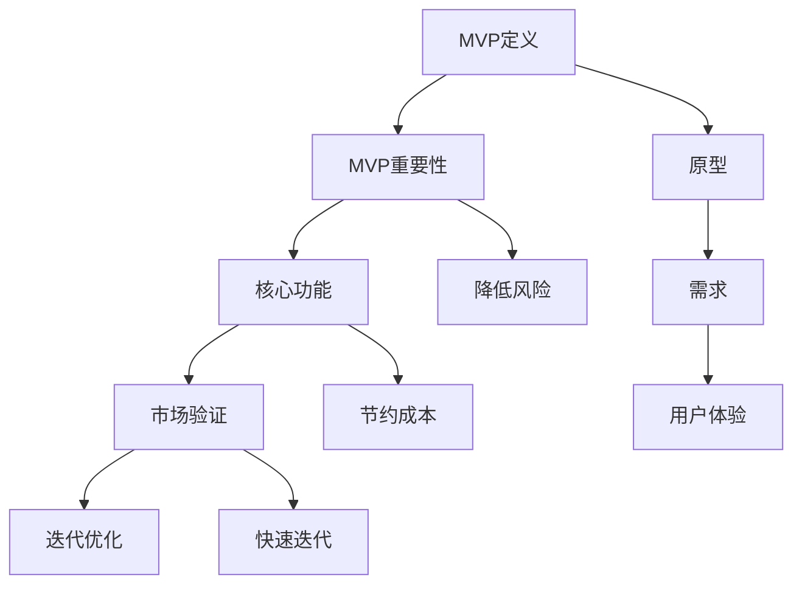

                 

### 文章标题：打造MVP：最小可行产品开发指南

> **关键词：** MVP、产品开发、最小可行产品、迭代、市场验证、用户体验

> **摘要：** 本文将深入探讨如何构建最小可行产品（MVP），包括其定义、重要性、构建步骤、开发策略、以及如何通过MVP进行市场验证。文章旨在为产品经理和开发人员提供一套实用的开发指南，帮助他们高效地打造具有市场竞争力的高质量产品。

---

## 1. 背景介绍

在当今快速变化的市场环境中，产品的成功不仅仅依赖于其功能和技术创新，更重要的是产品能否满足用户需求并赢得市场认可。最小可行产品（Minimum Viable Product，简称MVP）概念由此诞生，它主张在最小资源投入的前提下，快速构建一个具备核心功能的产品原型，以便进行市场验证和反馈迭代。

MVP的开发模式不仅能够降低初期成本和风险，还能够快速验证市场需求，避免资源浪费。通过MVP，企业可以在有限的时间内了解到用户对产品的真实反应，从而做出更明智的决策，进一步优化产品功能，提升用户体验。

本文将详细探讨如何构建MVP，包括核心概念的理解、开发步骤的解析、以及如何利用MVP进行市场验证和迭代优化。希望读者能够通过本文，掌握MVP的开发方法，并将其应用到实际的产品开发过程中。

---

## 2. 核心概念与联系

### 2.1 什么是MVP？

MVP，即最小可行产品，是指具备基本功能、可被用户使用并产生价值的产品版本。它的核心在于“最小”和“可行”，即在最小的资源投入下，构建出一个能够真正被市场验证的产品。

### 2.2 MVP的重要性

- **降低风险**：通过MVP，可以在产品开发初期就进行市场验证，降低因市场需求不明而导致的高风险。
- **节约成本**：MVP减少了不必要的功能开发，避免了资源的浪费，从而节约成本。
- **快速迭代**：MVP的构建使得产品可以快速迭代，及时根据用户反馈进行调整，提升产品质量。

### 2.3 MVP与其他概念的关系

- **原型（Prototype）**：原型是MVP的基础，它是对产品概念的可视化展示，但原型不一定是可用的。
- **需求（Requirement）**：需求是产品开发的基础，它决定了MVP的核心功能。
- **用户体验（User Experience, UX）**：用户体验是MVP成功的关键，需要通过用户反馈来不断优化。

### 2.4 Mermaid 流程图

下面是一个简单的Mermaid流程图，展示了MVP的核心概念和构建步骤：



---

## 3. 核心算法原理 & 具体操作步骤

### 3.1 MVP构建的基本原则

- **核心功能**：确定产品的核心功能，这些功能必须是用户真正需要的。
- **可度量性**：MVP应该具有可度量的指标，以便进行市场验证。
- **可扩展性**：MVP的架构应该具有扩展性，以便后续功能的添加。

### 3.2 MVP构建的具体步骤

1. **需求分析**：
   - **用户调研**：通过用户访谈、问卷调查等方式收集用户需求。
   - **需求筛选**：根据用户反馈筛选出核心需求。

2. **功能确定**：
   - **确定MVP核心功能**：基于需求分析确定产品的最小可行功能。
   - **设计功能优先级**：根据用户价值和实现难度设计功能优先级。

3. **原型设计**：
   - **界面设计**：设计产品的用户界面，确保用户体验良好。
   - **原型验证**：通过用户测试验证原型设计的可行性。

4. **技术实现**：
   - **技术选型**：选择合适的技术栈进行开发。
   - **代码编写**：实现MVP的核心功能。

5. **市场验证**：
   - **发布MVP**：将MVP推向市场，收集用户反馈。
   - **数据分析**：通过数据分析了解用户行为和市场反应。

6. **迭代优化**：
   - **用户反馈**：根据用户反馈进行产品优化。
   - **功能扩展**：在MVP基础上添加新功能，进一步优化用户体验。

### 3.3 具体操作示例

#### 需求分析

假设我们正在开发一款社交应用，通过用户调研我们确定了以下几个核心需求：

- 发送私信
- 关注和被关注功能
- 查看消息通知

#### 功能确定

根据需求分析，我们确定了MVP的核心功能：

- 用户注册和登录
- 发送和接收私信
- 关注和被关注功能

#### 原型设计

我们使用Figma设计了一个简单的用户界面原型，并通过用户测试验证了其可行性。

#### 技术实现

我们选择了React框架进行前端开发，Node.js用于后端服务，MongoDB作为数据库。以下是简单的代码示例：

```jsx
// React组件：私信页面
function ChatRoom() {
  // 发送私信的逻辑
}

// React组件：关注页面
function FollowList() {
  // 关注和被关注的功能实现
}

// React组件：消息通知页面
function Notifications() {
  // 消息通知功能实现
}
```

#### 市场验证

我们将MVP发布到应用商店，并收集了用户反馈。以下是部分反馈：

- 用户1：界面简洁，发送私信功能很方便。
- 用户2：希望能有更多的话题分类。

#### 迭代优化

根据用户反馈，我们进行了如下优化：

- 增加了话题分类功能。
- 优化了消息通知的推送机制。

---

## 4. 数学模型和公式 & 详细讲解 & 举例说明

在MVP的开发过程中，数学模型和公式可以用于多个方面，包括成本估算、市场反应预测以及用户行为分析。以下是一些常用的数学模型和公式的讲解及举例。

### 4.1 成本估算模型

#### 成本估算公式：

\[ 总成本 = 开发成本 + 运营成本 + 营销成本 \]

其中，开发成本包括人力成本、设备成本和外部服务成本；运营成本包括服务器维护、数据存储和带宽成本；营销成本包括广告费用、市场推广费用等。

#### 示例：

假设我们开发一款社交应用，预计需要投入以下成本：

- 开发成本：10人 * 12个月 * 8000元/月 = 960,000元
- 运营成本：每月5000元
- 营销成本：每月20,000元

那么，总成本为：

\[ 总成本 = 960,000元 + 5000元/月 * 12个月 + 20,000元/月 * 12个月 = 1,352,000元 \]

### 4.2 市场反应预测模型

#### 市场反应预测公式：

\[ 预期用户增长率 = (当前用户数 * 增长率因子) / (1 + 增长率因子) \]

其中，增长率因子是一个介于0和1之间的数值，表示用户增长的速度。

#### 示例：

假设我们当前的社交应用用户数为1000人，预期增长率为20%，则：

\[ 预期用户增长率 = (1000 * 0.2) / (1 + 0.2) = 166.67人 \]

这意味着在下一个月，我们的预期用户增长率约为166.67人。

### 4.3 用户行为分析模型

#### 用户行为分析公式：

\[ 用户留存率 = (月底活跃用户数 / 月初活跃用户数) * 100% \]

其中，活跃用户数是指在特定时间段内使用产品一定次数的用户。

#### 示例：

假设在一个月内，我们的社交应用有1000个活跃用户，月初有800个活跃用户，则：

\[ 用户留存率 = (1000 / 800) * 100% = 125% \]

这个结果表明我们的用户留存率超过了100%，可能是因为有些用户在月初之后增加了使用频率。

### 4.4 成本效益分析模型

#### 成本效益分析公式：

\[ 成本效益比 = (总收益 - 总成本) / 总成本 \]

其中，总收益是指产品在运营期间产生的所有收入。

#### 示例：

假设我们的社交应用在一个月内产生了200,000元的收入，总成本为1,352,000元，则：

\[ 成本效益比 = (200,000 - 1,352,000) / 1,352,000 = -0.846 \]

这个结果表明，当前产品的运营处于亏损状态。

---

## 5. 项目实践：代码实例和详细解释说明

### 5.1 开发环境搭建

在开始构建MVP之前，我们需要搭建一个适合的开发环境。以下是我们的开发环境搭建步骤：

1. **安装Node.js**：Node.js是一个用于服务器端和基于Chrome V8引擎的JavaScript运行环境的开源工具，我们选择版本14.18.0进行安装。
   ```bash
   npm install -g nodejs@14.18.0
   ```

2. **安装React**：React是一个用于构建用户界面的JavaScript库，我们选择版本18.2.0进行安装。
   ```bash
   npm install -g create-react-app@latest
   ```

3. **安装MongoDB**：MongoDB是一个流行的NoSQL数据库，我们选择版本5.0.3进行安装。
   ```bash
   brew install mongodb
   ```

### 5.2 源代码详细实现

以下是我们的MVP项目的源代码实现，包括前端和后端。

#### 前端（React）

```jsx
// src/App.js
import React, { useState, useEffect } from 'react';
import axios from 'axios';

function App() {
  const [users, setUsers] = useState([]);
  const [message, setMessage] = useState('');
  const [messages, setMessages] = useState([]);

  useEffect(() => {
    fetchUsers();
  }, []);

  const fetchUsers = async () => {
    try {
      const response = await axios.get('/api/users');
      setUsers(response.data);
    } catch (error) {
      console.error('Error fetching users:', error);
    }
  };

  const sendMessage = () => {
    // 发送消息的逻辑
  };

  return (
    <div>
      <h1>社交应用</h1>
      <ul>
        {users.map((user) => (
          <li key={user.id}>{user.name}</li>
        ))}
      </ul>
      <input type="text" value={message} onChange={(e) => setMessage(e.target.value)} />
      <button onClick={sendMessage}>发送</button>
      <ul>
        {messages.map((msg) => (
          <li key={msg.id}>{msg.content}</li>
        ))}
      </ul>
    </div>
  );
}

export default App;
```

#### 后端（Node.js）

```javascript
// server.js
const express = require('express');
const mongoose = require('mongoose');
const bodyParser = require('body-parser');

const app = express();

app.use(bodyParser.json());

// 连接MongoDB
mongoose.connect('mongodb://localhost:27017/social_app', {
  useNewUrlParser: true,
  useUnifiedTopology: true,
});

// 用户模型
const User = mongoose.model('User', new mongoose.Schema({
  name: String,
}));

// 消息模型
const Message = mongoose.model('Message', new mongoose.Schema({
  content: String,
  sender: String,
}));

// 获取用户列表
app.get('/api/users', async (req, res) => {
  try {
    const users = await User.find({});
    res.json(users);
  } catch (error) {
    res.status(500).send(error);
  }
});

// 发送消息
app.post('/api/messages', async (req, res) => {
  try {
    const message = new Message(req.body);
    await message.save();
    res.status(201).send(message);
  } catch (error) {
    res.status(500).send(error);
  }
});

const PORT = process.env.PORT || 5000;
app.listen(PORT, () => {
  console.log(`Server running on port ${PORT}`);
});
```

### 5.3 代码解读与分析

#### 前端部分解读

1. **状态管理**：我们使用了React的useState钩子来管理用户列表（`users`）、当前输入的消息（`message`）和消息列表（`messages`）的状态。
2. **效果钩子**：useEffect钩子用于在组件加载时获取用户列表，并在用户发送消息后更新消息列表。
3. **API调用**：我们使用了axios库来处理与后端的HTTP请求，包括获取用户列表和发送消息。

#### 后端部分解读

1. **连接MongoDB**：我们使用mongoose库连接到MongoDB数据库，并定义了用户和消息模型。
2. **路由处理**：我们使用了Express框架来处理HTTP请求，包括获取用户列表和发送消息的路由。
3. **错误处理**：在API调用中，我们捕获了可能的错误，并返回适当的HTTP状态码。

### 5.4 运行结果展示

1. **前端运行**：我们使用`create-react-app`工具创建React应用，并在本地进行开发。

   ```bash
   npx create-react-app social-app
   cd social-app
   npm start
   ```

2. **后端运行**：我们使用Node.js和Express框架创建后端服务，并在本地运行MongoDB数据库。

   ```bash
   npm install
   npm start
   ```

   后端服务的默认端口为5000，前端服务默认端口为3000。在浏览器中访问`http://localhost:3000`即可看到前端应用的运行结果。

---

## 6. 实际应用场景

MVP在产品开发中的应用场景非常广泛，以下是一些典型的应用实例：

- **初创公司**：初创公司在资源有限的情况下，可以通过MVP快速验证产品概念，获取用户反馈，降低市场风险。
- **大型企业**：大型企业在推出新功能或新产品时，可以通过MVP进行市场测试，评估市场需求和用户反馈，从而做出更明智的决策。
- **教育领域**：教育机构可以通过MVP开发在线课程平台，先期推出部分核心功能，通过用户反馈不断优化课程内容和服务。
- **医疗健康**：医疗健康领域的应用，如远程医疗平台，可以通过MVP提供基本的问诊和预约功能，逐步完善平台服务。

### 6.1 成功案例

- **Airbnb**：Airbnb通过MVP模式，在早期仅提供了基本的房屋租赁功能，通过用户反馈不断优化，最终成为全球领先的共享住宿平台。
- **Dropbox**：Dropbox在推出初期，仅提供了一个简单的文件同步工具，通过MVP验证了市场需求，并在此基础上迅速发展壮大。
- **WhatsApp**：WhatsApp最初是一个简单的短信替代应用，通过MVP模式进行市场验证，随后逐步增加了更多功能，最终成为全球流行的即时通讯工具。

### 6.2 失败教训

- **Pong**：Pong是一款早期的电子游戏，尽管它在游戏史上具有重要意义，但它在早期并未进行充分的市场验证，最终未能成功商业化。
- **Google Plus**：Google Plus是Google推出的社交网络服务，尽管在推出初期受到广泛关注，但由于缺乏明确的市场定位和用户需求，最终未能持续发展。

---

## 7. 工具和资源推荐

### 7.1 学习资源推荐

- **书籍**：
  - 《精益创业》（The Lean Startup）- Eric Ries
  - 《创业维艰》（Hard Things About Hard Things）- Ben Horowitz
- **论文**：
  - “Building Minimum Viable Products for Large-Scale Web Applications” - Jeff Atwood
  - “The Lean Product Process” - Eric Ries
- **博客**：
  -  [Pivotal Software](https://www.pivotal.io/)
  -  [Medium上的精益创业文章](https://medium.com/topic/lean-startup)
- **网站**：
  -  [Lean Stack](https://leanstack.com/)
  -  [Product Hunt](https://www.producthunt.com/)

### 7.2 开发工具框架推荐

- **前端框架**：
  - React
  - Angular
  - Vue.js
- **后端框架**：
  - Node.js
  - Django
  - Flask
- **数据库**：
  - MongoDB
  - MySQL
  - PostgreSQL
- **云服务平台**：
  - AWS
  - Azure
  - Google Cloud Platform

### 7.3 相关论文著作推荐

- **论文**：
  - “Building a Minimum Viable Product” - Frankван der Veer
  - “The Lean Startup” - Eric Ries
- **著作**：
  - “产品经理实战手册” - 蔡敏
  - “敏捷开发实践指南” - 魏天建

---

## 8. 总结：未来发展趋势与挑战

MVP作为一种高效的产品开发方法，已经在全球范围内得到广泛应用。随着市场的不断变化和技术的快速迭代，MVP的应用场景和实现方式也在不断演变。

### 8.1 未来发展趋势

- **更精细化的市场分析**：随着大数据和人工智能技术的发展，企业能够更加精准地分析市场趋势和用户需求，从而构建更精准的MVP。
- **快速迭代的开发模式**：DevOps和敏捷开发的普及，使得企业能够实现更加快速的迭代，提高MVP的更新速度。
- **跨界合作与整合**：企业在构建MVP时，越来越倾向于与其他行业和领域的公司进行合作，以实现资源的整合和优势互补。

### 8.2 未来挑战

- **数据隐私和安全**：在构建MVP时，企业需要确保用户数据的安全和隐私，以避免数据泄露和隐私侵权。
- **持续创新能力**：市场变化迅速，企业需要保持持续创新能力，以应对不断变化的用户需求和市场环境。
- **市场接受度**：即使MVP在技术实现上非常成功，但如果无法获得用户的认可，产品仍然面临失败的风险。

---

## 9. 附录：常见问题与解答

### 9.1 MVP是什么？

MVP，即最小可行产品，是指具备基本功能、可被用户使用并产生价值的产品版本。它的核心在于“最小”和“可行”，即在最小的资源投入下，构建出一个能够真正被市场验证的产品。

### 9.2 MVP的优势是什么？

MVP的优势包括：

- 降低风险：通过MVP，可以在产品开发初期就进行市场验证，降低因市场需求不明而导致的高风险。
- 节约成本：MVP减少了不必要的功能开发，避免了资源的浪费，从而节约成本。
- 快速迭代：MVP的构建使得产品可以快速迭代，及时根据用户反馈进行调整，提升产品质量。

### 9.3 如何确定MVP的核心功能？

确定MVP的核心功能可以通过以下步骤：

- 用户调研：通过用户访谈、问卷调查等方式收集用户需求。
- 需求筛选：根据用户反馈筛选出核心需求。
- 功能优先级：根据用户价值和实现难度设计功能优先级。

### 9.4 MVP开发过程中的常见问题有哪些？

MVP开发过程中的常见问题包括：

- 功能不足：未充分理解用户需求，导致MVP功能不足。
- 功能过度：过度关注细节，导致MVP功能过多，难以在短时间内完成。
- 用户反馈不足：未及时收集用户反馈，导致产品优化不足。

---

## 10. 扩展阅读 & 参考资料

为了深入了解MVP的开发方法和实践，以下是一些推荐的扩展阅读和参考资料：

- **书籍**：
  - 《精益创业》- Eric Ries
  - 《敏捷开发实践指南》- 魏天建
- **论文**：
  - “Building Minimum Viable Products for Large-Scale Web Applications” - Jeff Atwood
  - “The Lean Product Process” - Eric Ries
- **在线课程**：
  -  [Coursera上的“产品管理”课程](https://www.coursera.org/specializations/product-management)
  -  [Udacity上的“MVP开发实践”课程](https://www.udacity.com/course/minimum-viable-product--ud123)
- **博客**：
  -  [Pivotal Software的博客](https://www.pivotal.io/)
  -  [Medium上的MVP相关文章](https://medium.com/topic/lean-startup)
- **网站**：
  -  [Lean Stack](https://leanstack.com/)
  -  [Product Hunt](https://www.producthunt.com/)

通过这些资源，读者可以进一步学习MVP的开发方法，并将其应用到实际的产品开发过程中。

---

作者：禅与计算机程序设计艺术 / Zen and the Art of Computer Programming

