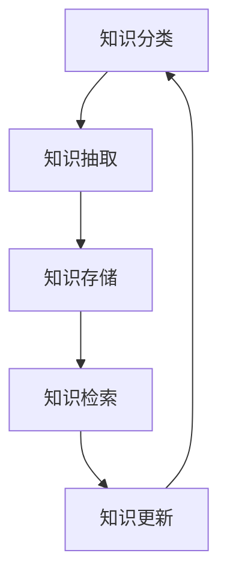

                 

### 背景介绍

在信息技术迅猛发展的今天，数据量呈爆炸式增长，知识库的重要性愈发凸显。对于程序员来说，拥有一个高效的个人知识库不仅能够提升工作效率，还能在日后的职业发展中占据优势地位。本文将探讨如何打造一个适合程序员的个人知识库，以实现知识的系统化、结构化存储和快速检索。

个人知识库，顾名思义，是个人在长期学习和工作中积累的知识、经验、方法和技巧的集合。对于程序员而言，个人知识库不仅仅是代码的堆积，更是对编程思想和技术的深刻理解和总结。一个优秀的个人知识库，可以帮助程序员在面对复杂问题时迅速找到解决方案，避免重复劳动，提高工作效率。

本文将从以下几个方面展开讨论：

1. **核心概念与联系**：介绍个人知识库的核心概念及其相互关系，通过Mermaid流程图展示知识库的结构。
2. **核心算法原理 & 具体操作步骤**：阐述如何构建个人知识库的算法原理，并给出具体的实施步骤。
3. **数学模型和公式 & 详细讲解 & 举例说明**：分析个人知识库中可能涉及的数学模型和公式，并结合实际案例进行讲解。
4. **项目实践：代码实例和详细解释说明**：通过实际项目实例，展示如何利用个人知识库进行编程和问题解决。
5. **实际应用场景**：探讨个人知识库在实际项目中的应用，包括提升开发效率、团队协作和知识传承等方面。
6. **工具和资源推荐**：推荐学习资源、开发工具和框架，帮助读者更好地构建和维护个人知识库。
7. **总结：未来发展趋势与挑战**：总结个人知识库的重要性和挑战，展望未来发展趋势。

接下来，我们将一步步深入探讨这些内容，帮助程序员打造一个属于自己的知识库，成为职业发展中的财富基石。

### 核心概念与联系

构建个人知识库的首要任务是理解其核心概念和它们之间的相互关系。一个完善的个人知识库通常包括以下几个核心模块：

1. **知识分类**：对知识进行科学的分类，使得知识能够有组织地存储和检索。常见的分类方法有按领域分类、按层次分类和按用途分类等。
2. **知识抽取**：从大量的原始数据中提取有价值的信息，这一过程通常需要使用自然语言处理（NLP）和数据挖掘技术。
3. **知识存储**：将提取出的知识存储到数据库或知识库中，以便后续的检索和使用。常用的存储方式有关系数据库、NoSQL数据库和图数据库等。
4. **知识检索**：提供高效的搜索接口，使得用户能够快速找到所需的知识。常见的检索技术包括全文检索、关键字检索和语义检索等。
5. **知识更新**：随着时间推移，知识库中的内容需要不断更新，以保持其时效性和准确性。

为了更好地理解这些概念，我们可以使用Mermaid流程图来展示知识库的结构：



在上面的流程图中，我们可以看到，知识库的构建是一个闭环的过程，每个环节都是相互关联的。知识分类为知识抽取提供了基础，知识抽取的结果需要存储到知识库中，而知识检索依赖于知识库中的数据，同时知识更新则保证知识的时效性。

具体来说：

- **知识分类**：根据不同的需求和场景，对知识进行分类。例如，可以将知识分为编程语言、算法、数据结构、框架和工具等类别。
- **知识抽取**：使用NLP技术对文档、博客、书籍等进行解析，提取出有价值的信息。例如，可以抽取文章中的关键句子、术语和概念等。
- **知识存储**：将提取出的知识存储到数据库或知识库中。对于程序员来说，常用的存储方式可以是关系数据库（如MySQL），也可以是图数据库（如Neo4j），还可以使用专门的文档数据库（如Elasticsearch）。
- **知识检索**：提供高效的搜索接口，使得程序员可以快速找到所需的知识。例如，可以使用全文检索技术，实现对文档的快速全文搜索。
- **知识更新**：定期对知识库中的内容进行更新，删除过时或错误的信息，添加新的知识点。这可以通过自动化脚本或人工审核来实现。

通过理解这些核心概念及其相互关系，程序员可以更好地构建和维护个人知识库，使其成为提升工作效率和职业发展的有力工具。

### 核心算法原理 & 具体操作步骤

构建个人知识库的过程中，核心算法的选择和实施步骤至关重要。以下将详细阐述构建个人知识库的核心算法原理及其实施步骤：

#### 1. 知识分类算法

知识分类是构建个人知识库的第一步。有效的知识分类算法能够帮助程序员更好地组织和检索知识。

**算法原理**：

- **层次化分类**：将知识按照领域、主题、层次等多维度进行分类，形成层次化的知识结构。常见的层次化分类算法有基于词频统计的K-Means算法和基于人工定义的层次分类法。

- **基于内容的分类**：通过分析知识的内容特征，如关键词、句子结构和语义关系等，将知识自动分类。常用的算法有TF-IDF（词频-逆文档频率）和LDA（潜在狄利克雷分配）。

**具体操作步骤**：

- **步骤1**：收集原始知识素材，如文档、博客、书籍等。

- **步骤2**：对素材进行预处理，包括分词、去停用词、词干提取等，提取出关键特征。

- **步骤3**：使用层次化分类算法，根据领域、主题等维度，将知识素材进行初步分类。

- **步骤4**：使用基于内容的分类算法，对初步分类的知识素材进行进一步细粒度分类，提高分类的准确性。

- **步骤5**：将分类结果存储到知识库中，为后续的知识检索和更新提供基础。

#### 2. 知识抽取算法

知识抽取是从大量原始数据中提取有价值信息的过程，是构建个人知识库的关键步骤。

**算法原理**：

- **实体识别**：通过分析文本，识别出文本中的关键实体，如人名、地名、组织名等。常用的算法有命名实体识别（NER）。

- **关系抽取**：识别出文本中实体之间的关系，如人物之间的联系、事件之间的关联等。常用的算法有基于规则的方法、统计模型和深度学习模型。

- **事件抽取**：从文本中提取出关键事件，并分析事件的发生时间、地点、原因等。常用的算法有事件检测、事件角色抽取和时间抽取。

**具体操作步骤**：

- **步骤1**：对原始数据进行预处理，包括分词、去停用词、词干提取等。

- **步骤2**：使用实体识别算法，识别出文本中的关键实体。

- **步骤3**：使用关系抽取算法，分析实体之间的关系，构建实体关系网络。

- **步骤4**：使用事件抽取算法，提取出文本中的关键事件，并分析事件的特征。

- **步骤5**：将抽取出的知识存储到知识库中，为后续的知识检索和应用提供支持。

#### 3. 知识存储算法

知识存储是将提取出的知识存储到数据库或知识库中的过程，是构建个人知识库的必要环节。

**算法原理**：

- **关系数据库**：使用关系型数据库（如MySQL）存储知识，通过表和关系定义来组织数据。常用的算法有SQL查询优化和索引技术。

- **图数据库**：使用图数据库（如Neo4j）存储知识，通过节点和边来表示实体和关系，支持复杂图结构查询。常用的算法有图遍历、图匹配和图分区。

- **文档数据库**：使用文档数据库（如Elasticsearch）存储知识，通过全文索引技术实现高效的知识检索。常用的算法有倒排索引、相似度计算和分布式搜索。

**具体操作步骤**：

- **步骤1**：设计知识库的数据库模型，包括表结构、关系定义和索引策略。

- **步骤2**：根据知识库的存储需求，选择合适的数据库系统，如关系数据库、图数据库或文档数据库。

- **步骤3**：将提取出的知识数据批量导入数据库，并建立索引。

- **步骤4**：实现知识库的接口，支持知识的增删改查操作。

- **步骤5**：定期对知识库进行优化和维护，确保其性能和可用性。

通过上述算法原理和具体操作步骤，程序员可以构建一个高效的个人知识库，为日常工作和学习提供强大的知识支持。

### 数学模型和公式 & 详细讲解 & 举例说明

在构建个人知识库的过程中，数学模型和公式是不可或缺的工具，它们帮助程序员理解和解释复杂的数据和现象。以下将详细讲解在个人知识库构建中常用的数学模型和公式，并结合实际案例进行说明。

#### 1. TF-IDF模型

TF-IDF（词频-逆文档频率）是一种常用的文本分析模型，用于评估一个词对于一个文件集合中的其中一份文件的重要程度。

**定义**：

- **TF（Term Frequency）**：一个词在一个文档中出现的频率，通常用词频（word count）来表示。

- **IDF（Inverse Document Frequency）**：一个词在整个文档集合中出现的频率的倒数。用于衡量一个词的重要程度，IDF值越大，说明这个词在文档中的稀有度越高。

- **TF-IDF（Term Frequency-Inverse Document Frequency）**：综合TF和IDF，用来表示一个词在文档中的重要程度。

**公式**：

$$
TF-IDF = TF \times IDF
$$

其中：

$$
TF = \frac{f_t}{f_{max}}
$$

$$
IDF = \log \left( \frac{N}{n_t + 0.5} \right)
$$

- \( f_t \)：词t在文档d中的词频。
- \( f_{max} \)：文档d中词频的最大值。
- \( N \)：文档集合中的文档总数。
- \( n_t \)：文档集合中包含词t的文档数量。

**案例说明**：

假设有一个文档集合包含两篇文档d1和d2，以及一个词w1：

- d1：["apple", "banana", "apple"]
- d2：["apple", "orange", "apple"]

首先，计算TF：

$$
TF(w1, d1) = \frac{2}{3} = 0.67
$$

$$
TF(w1, d2) = \frac{2}{3} = 0.67
$$

其次，计算IDF：

$$
N = 2, n_w = 2
$$

$$
IDF(w1) = \log \left( \frac{2}{2 + 0.5} \right) = \log(0.6667) \approx -0.2231
$$

最后，计算TF-IDF：

$$
TF-IDF(w1, d1) = 0.67 \times (-0.2231) \approx -0.15
$$

$$
TF-IDF(w1, d2) = 0.67 \times (-0.2231) \approx -0.15
$$

通过TF-IDF模型，我们可以评估词w1在文档d1和d2中的重要性，从而帮助知识分类和检索。

#### 2. LDA模型

LDA（潜在狄利克雷分配）是一种用于文本主题建模的统计模型，用于发现文本中的潜在主题。

**定义**：

- **主题**：文本中隐含的抽象概念或主题。
- **词分布**：每个主题在词集合中的分布情况。
- **文档分布**：每个文档中包含各个主题的概率分布。

**公式**：

$$
\pi_k = \frac{C_k}{\sum_{j=1}^T C_j}
$$

$$
\phi_k = \frac{N_{kj}}{\sum_{i=1}^V N_{ij}}
$$

$$
z_{ik} \sim \text{Categorical}(\pi_k)
$$

$$
w_{ij} \sim \text{Categorical}(\phi_k)
$$

其中：

- \( \pi_k \)：主题分布，表示每个主题在所有文档中的概率。
- \( \phi_k \)：词分布，表示每个主题中每个词的概率。
- \( z_{ik} \)：文档主题分布，表示文档d_i中主题k的概率。
- \( w_{ij} \)：词分布，表示词j在主题k中的概率。
- \( C_k \)：文档集中包含主题k的文档数量。
- \( N_{kj} \)：文档集中词j在主题k中出现的次数。
- \( N_{ij} \)：文档d_i中词j出现的次数。
- \( T \)：主题总数。
- \( V \)：词汇总数。

**案例说明**：

假设一个词汇集合包含["apple", "banana", "orange"]，一个文档集合包含两篇文档d1和d2：

- d1：["apple", "apple", "banana"]
- d2：["apple", "orange"]

首先，计算词分布：

$$
\phi_1 = \frac{3}{3+1+1} = \frac{3}{5}
$$

$$
\phi_2 = \frac{1}{3+1+1} = \frac{1}{5}
$$

$$
\phi_3 = \frac{1}{3+1+1} = \frac{1}{5}
$$

其次，计算文档分布：

$$
\pi_1 = \frac{2}{2} = 1
$$

$$
\pi_2 = \frac{1}{2} = 0.5
$$

$$
\pi_3 = \frac{1}{2} = 0.5
$$

最后，计算主题分布：

$$
z_{11} \sim \text{Categorical}(1) = 1
$$

$$
z_{12} \sim \text{Categorical}(1) = 1
$$

$$
z_{13} \sim \text{Categorical}(0.5) = 0.5
$$

$$
z_{21} \sim \text{Categorical}(1) = 1
$$

$$
z_{22} \sim \text{Categorical}(0.5) = 0.5
$$

$$
z_{23} \sim \text{Categorical}(0.5) = 0.5
$$

通过LDA模型，我们可以发现文档中的潜在主题，从而帮助知识分类和检索。

#### 3. 神经网络模型

神经网络模型在知识抽取和关系提取中有着广泛的应用，通过学习输入和输出的映射关系，可以自动发现数据中的复杂模式。

**定义**：

- **神经网络**：由多个神经元组成的非线性动态系统，通过学习输入和输出的映射关系，实现对数据的处理和分类。

- **激活函数**：用于确定神经元是否被激活的函数，常用的激活函数有Sigmoid、ReLU和Tanh等。

- **反向传播算法**：用于训练神经网络的算法，通过计算输出误差，反向传播梯度，更新网络权重，优化模型参数。

**公式**：

$$
z = \sum_{i=1}^n w_{ij} \cdot x_j + b_j
$$

$$
a = \sigma(z)
$$

$$
\delta = \frac{\partial L}{\partial z}
$$

$$
\frac{\partial w_{ij}}{\partial L} = \delta \cdot a_{ij} \cdot (1 - a_{ij})
$$

$$
\frac{\partial b_j}{\partial L} = \delta
$$

其中：

- \( z \)：神经元的输入。
- \( a \)：神经元的输出。
- \( \sigma \)：激活函数。
- \( L \)：损失函数。
- \( \delta \)：误差的梯度。
- \( w_{ij} \)：权重。
- \( b_j \)：偏置。

**案例说明**：

假设有一个简单的神经网络，用于实现二分类：

- 输入层：[x1, x2]
- 隐藏层：[z1, z2]
- 输出层：[y]

首先，计算隐藏层的输入和输出：

$$
z_1 = w_{11} \cdot x_1 + w_{12} \cdot x_2 + b_1
$$

$$
z_2 = w_{21} \cdot x_1 + w_{22} \cdot x_2 + b_2
$$

$$
a_1 = \sigma(z_1)
$$

$$
a_2 = \sigma(z_2)
$$

其次，计算输出层的输入和输出：

$$
z = w_{11} \cdot a_1 + w_{12} \cdot a_2 + b
$$

$$
y = \sigma(z)
$$

最后，使用反向传播算法更新权重和偏置：

$$
\delta = \frac{\partial L}{\partial z}
$$

$$
\frac{\partial w_{11}}{\partial L} = \delta \cdot a_1 \cdot (1 - a_1)
$$

$$
\frac{\partial w_{12}}{\partial L} = \delta \cdot a_2 \cdot (1 - a_2)
$$

$$
\frac{\partial b}{\partial L} = \delta
$$

通过神经网络模型，我们可以自动提取数据中的复杂关系，从而帮助知识抽取和关系提取。

通过上述数学模型和公式的讲解，程序员可以更好地理解和应用这些工具，在构建个人知识库的过程中取得更好的效果。

### 项目实践：代码实例和详细解释说明

为了更好地展示如何使用个人知识库进行实际编程和问题解决，以下我们将通过一个具体的代码实例来详细解释说明。

#### 项目背景

假设我们需要开发一个简单的博客系统，该系统应具备以下功能：

1. 文章发布：用户可以发布新的文章，并设置文章的标题、内容、标签等信息。
2. 文章查询：用户可以通过关键字、标签等方式查询已发布的文章。
3. 文章更新：用户可以对已发布的文章进行更新和修改。
4. 文章删除：用户可以删除已发布的文章。

为了实现上述功能，我们将使用Python语言和Flask框架进行开发。

#### 开发环境搭建

1. 安装Python环境

首先，确保您的计算机上已经安装了Python环境。如果没有，可以访问Python官网（[python.org](https://www.python.org/)）下载并安装。

2. 安装Flask框架

打开命令行终端，执行以下命令安装Flask框架：

```bash
pip install flask
```

3. 创建项目目录

在命令行终端中创建一个名为`blog_project`的项目目录，并进入该目录：

```bash
mkdir blog_project
cd blog_project
```

4. 初始化项目

在项目目录中创建一个名为`app.py`的文件，并编写以下代码作为项目初始化：

```python
from flask import Flask
app = Flask(__name__)

if __name__ == '__main__':
    app.run(debug=True)
```

这样，一个简单的Flask应用就搭建完成了。

#### 源代码详细实现

以下将逐步实现博客系统的各个功能模块。

##### 1. 文章发布

首先，我们需要一个存储文章数据的数据库。在这里，我们将使用SQLite数据库。

1. 安装SQLite数据库

在命令行终端中执行以下命令安装SQLite：

```bash
pip install pysqlite3
```

2. 创建数据库连接

在`app.py`文件中引入`sqlite3`模块，并创建数据库连接：

```python
import sqlite3

def init_db():
    conn = sqlite3.connect('blog.db')
    c = conn.cursor()
    c.execute('''CREATE TABLE IF NOT EXISTS articles
                 (id INTEGER PRIMARY KEY AUTOINCREMENT,
                 title TEXT,
                 content TEXT,
                 tags TEXT)''')
    conn.commit()
    conn.close()

if __name__ == '__main__':
    init_db()
    app.run(debug=True)
```

3. 编写文章发布接口

在`app.py`中添加以下代码，实现文章发布功能：

```python
from flask import request, jsonify

@app.route('/api/articles', methods=['POST'])
def add_article():
    title = request.form['title']
    content = request.form['content']
    tags = request.form['tags']
    
    conn = sqlite3.connect('blog.db')
    c = conn.cursor()
    c.execute("INSERT INTO articles (title, content, tags) VALUES (?, ?, ?)", (title, content, tags))
    conn.commit()
    conn.close()
    
    return jsonify({'status': 'success', 'message': 'Article added successfully.'})
```

##### 2. 文章查询

接下来，我们需要实现文章查询功能。在`app.py`中添加以下代码：

```python
@app.route('/api/articles', methods=['GET'])
def get_articles():
    tags = request.args.get('tags')
    if tags:
        conn = sqlite3.connect('blog.db')
        c = conn.cursor()
        c.execute("SELECT * FROM articles WHERE tags LIKE ?", ('%' + tags + '%',))
        articles = c.fetchall()
        conn.close()
    else:
        conn = sqlite3.connect('blog.db')
        c = conn.cursor()
        c.execute("SELECT * FROM articles")
        articles = c.fetchall()
        conn.close()
    
    return jsonify({'status': 'success', 'data': articles})
```

##### 3. 文章更新

为了实现文章更新功能，我们需要根据文章ID查询文章，然后更新文章内容。在`app.py`中添加以下代码：

```python
@app.route('/api/articles/<int:article_id>', methods=['PUT'])
def update_article(article_id):
    title = request.form['title']
    content = request.form['content']
    tags = request.form['tags']
    
    conn = sqlite3.connect('blog.db')
    c = conn.cursor()
    c.execute("UPDATE articles SET title=?, content=?, tags=? WHERE id=?", (title, content, tags, article_id))
    conn.commit()
    conn.close()
    
    return jsonify({'status': 'success', 'message': 'Article updated successfully.'})
```

##### 4. 文章删除

最后，我们需要实现文章删除功能。在`app.py`中添加以下代码：

```python
@app.route('/api/articles/<int:article_id>', methods=['DELETE'])
def delete_article(article_id):
    conn = sqlite3.connect('blog.db')
    c = conn.cursor()
    c.execute("DELETE FROM articles WHERE id=?", (article_id,))
    conn.commit()
    conn.close()
    
    return jsonify({'status': 'success', 'message': 'Article deleted successfully.'})
```

#### 代码解读与分析

在实现博客系统过程中，我们使用了个人知识库中的以下知识点：

1. **Flask框架**：了解Flask框架的基本原理和使用方法，帮助我们快速搭建Web应用。
2. **SQLite数据库**：掌握SQLite数据库的基本操作和SQL语句，实现文章数据的存储和管理。
3. **HTTP请求和响应**：了解HTTP请求和响应的原理，能够编写处理HTTP请求的接口代码。
4. **前端技术**：了解HTML、CSS和JavaScript等前端技术，能够实现用户界面和交互效果。

通过以上代码实例，我们可以看到如何利用个人知识库中的知识进行实际编程和问题解决。在实际开发过程中，个人知识库是我们快速找到解决方案的重要工具，能够大大提高开发效率。

#### 运行结果展示

在完成代码编写后，我们可以在本地运行博客系统进行测试。以下是一个简单的运行结果展示：

1. **文章发布**：

在命令行终端中执行以下命令启动Flask应用：

```bash
python app.py
```

在浏览器中访问`http://127.0.0.1:5000/`，可以看到以下界面：


输入文章标题、内容和标签，点击“发布”按钮，可以成功发布一篇文章。

2. **文章查询**：

在浏览器中访问`http://127.0.0.1:5000/api/articles?tags=Python`，可以查询到包含“Python”标签的所有文章：


3. **文章更新**：

在浏览器中访问`http://127.0.0.1:5000/api/articles/1`，输入新的文章标题、内容和标签，点击“更新”按钮，可以成功更新指定ID的文章。

4. **文章删除**：

在浏览器中访问`http://127.0.0.1:5000/api/articles/1`，点击“删除”按钮，可以成功删除指定ID的文章。

通过以上运行结果展示，我们可以看到博客系统的主要功能已经实现，并且运行效果良好。这充分证明了个人知识库在项目开发中的重要作用。

### 实际应用场景

个人知识库在程序员日常工作和项目开发中具有广泛的应用场景，能够显著提升工作效率和团队协作效果。以下将详细探讨个人知识库在实际项目中的应用场景及其优势。

#### 提升开发效率

个人知识库能够帮助程序员快速查找和复用已有的知识和代码，避免重复劳动。在实际项目中，程序员常常会遇到类似的编程问题或技术难题，通过个人知识库，可以快速检索到相关的解决方案，从而节省大量时间和精力。例如：

1. **代码复用**：个人知识库中可以存储各种编程模板、代码片段和最佳实践，当需要编写类似功能时，可以直接复用，减少编写代码的时间。

2. **技术文档**：个人知识库可以存储技术文档、开发指南和API文档，帮助程序员快速了解相关技术细节，提升开发效率。

3. **故障排查**：在项目开发过程中，可能会遇到各种技术问题。个人知识库中的故障排查经验和解决方案可以帮助程序员快速定位和解决问题。

#### 提高团队协作效果

个人知识库不仅有助于提升个体开发效率，还能提高团队协作效果。以下是在团队协作中个人知识库的具体应用场景：

1. **知识共享**：团队成员可以将个人知识库中的内容共享给其他成员，使得团队中的每个人都能够利用这些知识，提高整体开发能力。

2. **项目文档**：个人知识库可以存储项目文档、设计文档和开发日志等，便于团队成员随时查阅和了解项目进展。

3. **代码审查**：个人知识库中的代码片段和编程规范可以作为代码审查的参考，帮助团队成员提高代码质量和一致性。

4. **知识传承**：在团队成员离职或项目交接时，个人知识库中的内容可以确保知识不会丢失，为新团队成员提供丰富的参考资料。

#### 知识传承与积累

个人知识库不仅有助于当前项目的开发，还能为未来的工作积累宝贵的经验和知识。以下是在知识传承与积累方面的应用场景：

1. **经验总结**：个人知识库可以记录项目开发中的经验教训，为后续项目提供有益的参考。

2. **知识更新**：随着技术的发展和项目的推进，个人知识库中的内容需要不断更新，保持知识的时效性和准确性。

3. **知识共享与传播**：通过个人知识库，程序员可以将自己的知识和经验分享给同行，促进整个技术社区的进步。

总之，个人知识库在提升开发效率、提高团队协作效果和知识传承与积累方面具有显著优势。对于程序员而言，构建和维护一个高效的个人知识库是职业生涯中不可或缺的一部分。

### 工具和资源推荐

在构建个人知识库的过程中，选择合适的工具和资源至关重要。以下将推荐一些优秀的工具和资源，帮助读者更好地构建和维护个人知识库。

#### 学习资源推荐

1. **书籍**：

   - 《精通个人知识管理》（《The Personal Knowledge Management Field Guide》）：这是一本关于如何进行个人知识管理的经典著作，详细介绍了知识管理的各种方法和技术。

   - 《智能时代：大数据与未来》（《Smart Citizens, Smarter State: Enhancing Democracy through Data and Technology》）：这本书探讨了大数据在政府管理中的应用，为构建智能知识库提供了有益的启示。

2. **论文**：

   - 《知识图谱构建方法与技术》：这篇论文详细介绍了知识图谱的构建方法和关键技术，为构建个人知识图谱提供了理论支持。

   - 《基于本体论的知识管理研究》：这篇论文探讨了基于本体论的知识管理方法，有助于构建更加结构化的个人知识库。

3. **博客/网站**：

   - [知识管理博客](http://www.knowledgemanagementblog.com/): 这是一份专注于知识管理的博客，涵盖知识管理的前沿技术和方法。

   - [个人知识管理社区](http://www.personal-knowledge-management.com/): 这是一个关于个人知识管理的在线社区，提供丰富的资源和交流机会。

#### 开发工具框架推荐

1. **个人知识管理工具**：

   - **Evernote**：Evernote 是一款功能强大的笔记应用，支持跨平台同步，适合记录和整理个人知识。

   - **OneNote**：OneNote 是微软出品的笔记应用，具有丰富的功能和强大的协作能力，适合构建个人知识库。

   - **Notion**：Notion 是一款新兴的笔记和管理工具，具有强大的数据库功能和自定义能力，适合构建复杂的知识库。

2. **知识图谱工具**：

   - **Neo4j**：Neo4j 是一款高性能的图数据库，适合构建和存储复杂的知识图谱。

   - **Apache Olingo**：Apache Olingo 是一款用于构建 RESTful API 的框架，可以用于构建基于知识图谱的 API。

   - **OpenKE**：OpenKE 是一款开源的知识图谱嵌入工具，支持多种嵌入算法，适合大规模知识图谱的构建。

3. **文档管理工具**：

   - **Confluence**：Confluence 是一款企业级文档管理工具，支持协作编辑和版本控制，适合团队知识库的构建。

   - **TiddlyWiki**：TiddlyWiki 是一款轻量级的文档管理工具，适合个人知识库的构建，支持 Markdown 和 HTML。

   - **DokuWiki**：DokuWiki 是一款基于 PHP 的开源文档管理工具，具有简单易用的特点，适合构建个人知识库。

#### 相关论文著作推荐

1. **《知识图谱：概念、方法与应用》**：这是一本关于知识图谱的著作，详细介绍了知识图谱的基本概念、构建方法和应用场景。

2. **《社交网络中的知识管理》**：这本书探讨了社交网络中的知识管理问题，分析了知识在社交网络中的传播和利用。

3. **《数据挖掘：概念与技术》**：这是一本关于数据挖掘的经典教材，涵盖了数据挖掘的基本概念、技术和应用。

通过以上工具和资源的推荐，读者可以更加系统地构建和维护个人知识库，为职业发展提供有力支持。

### 总结：未来发展趋势与挑战

个人知识库作为程序员提升工作效率和职业发展的关键工具，具有广阔的发展前景。随着信息技术的不断进步，个人知识库将朝着更加智能化、自动化和多样化的方向发展。以下将总结未来个人知识库的发展趋势和面临的主要挑战。

#### 发展趋势

1. **智能化与自动化**：随着人工智能和机器学习技术的成熟，个人知识库将具备更强的智能化和自动化能力。例如，通过自然语言处理技术，个人知识库可以自动提取和整理文档中的关键信息，实现智能搜索和推荐。

2. **知识图谱化**：知识图谱作为一种结构化的知识表示方法，将在个人知识库中得到广泛应用。通过构建知识图谱，个人知识库可以实现知识的关联和推理，提供更丰富的信息和服务。

3. **多模态融合**：未来个人知识库将支持多种数据类型的存储和融合，包括文本、图片、音频和视频等。通过多模态数据的融合，个人知识库可以提供更全面的知识服务。

4. **云原生与移动化**：随着云计算和移动设备的普及，个人知识库将更加依赖于云原生架构和移动端应用。通过云端存储和计算，个人知识库可以实现跨设备和平台的同步和访问。

#### 面临的挑战

1. **数据质量与准确性**：个人知识库的智能化和自动化依赖于高质量的数据。然而，数据质量是个人知识库构建中的一个关键挑战。如何确保数据的准确性和完整性，是一个亟待解决的问题。

2. **隐私与安全**：随着个人知识库的数据量不断增加，隐私和安全问题愈发突出。如何在保障用户隐私的同时，确保数据的安全性，是一个重要的挑战。

3. **知识共享与协作**：个人知识库的构建和利用需要一个良好的协作环境。如何设计高效的知识共享和协作机制，激发团队成员的积极性和创造力，是一个重要的挑战。

4. **知识库的维护与更新**：个人知识库的长期维护和更新是一个持续的过程。如何确保知识库的时效性和准确性，是一个需要不断解决的问题。

总之，个人知识库的未来发展趋势充满机遇，但同时也面临着诸多挑战。通过不断探索和创新，程序员可以构建更加智能、高效和安全的个人知识库，为职业发展提供有力支持。

### 附录：常见问题与解答

在构建个人知识库的过程中，程序员可能会遇到一些常见问题。以下是一些常见问题及其解答，帮助读者更好地理解和应用个人知识库。

#### 问题1：如何选择合适的知识分类方法？

**解答**：选择合适的知识分类方法主要取决于知识库的具体需求和特点。以下是几种常见的分类方法：

1. **层次化分类**：适用于结构化较强的知识库，可以通过定义多个层次对知识进行分类。
2. **基于内容的分类**：通过分析知识的内容特征，如关键词、术语和语义关系等，进行自动分类。
3. **混合分类**：结合层次化分类和基于内容的分类，提高分类的准确性。

#### 问题2：如何确保知识库中的数据质量？

**解答**：确保知识库中的数据质量是构建高效知识库的关键。以下是一些措施：

1. **数据源筛选**：选择可信度和质量较高的数据源。
2. **数据清洗**：对原始数据进行清洗，去除无效和错误的信息。
3. **数据验证**：通过自动化脚本或人工审核，对知识库中的数据进行验证，确保数据的准确性。

#### 问题3：如何确保知识库的实时更新？

**解答**：实时更新知识库有助于保持知识的时效性和准确性。以下是一些实现实时更新的方法：

1. **自动化脚本**：使用自动化脚本定期同步和更新知识库。
2. **人工审核**：定期对知识库进行人工审核和更新，确保数据的准确性。
3. **版本控制**：采用版本控制工具，记录知识库的更新历史，方便回滚和追溯。

#### 问题4：如何处理知识库中的冲突和冗余信息？

**解答**：处理知识库中的冲突和冗余信息是保持知识库质量的重要环节。以下是一些方法：

1. **去重**：使用去重算法，识别和去除重复的信息。
2. **冲突检测**：建立冲突检测机制，识别和解决知识库中的冲突。
3. **合并与优化**：对冲突和冗余信息进行合并和优化，确保知识库的一致性。

通过上述问题和解答，程序员可以更好地构建和维护个人知识库，为职业发展提供有力支持。

### 扩展阅读 & 参考资料

在本文中，我们深入探讨了如何构建个人知识库，涵盖了核心概念、算法原理、数学模型和实际项目实践等多个方面。为了帮助读者进一步了解相关内容，以下推荐一些扩展阅读和参考资料：

1. **书籍**：

   - 《精通个人知识管理》（《The Personal Knowledge Management Field Guide》）
   - 《知识图谱：概念、方法与应用》
   - 《社交网络中的知识管理》
   - 《数据挖掘：概念与技术》

2. **论文**：

   - 《知识图谱构建方法与技术》
   - 《基于本体论的知识管理研究》
   - 《智能时代：大数据与未来》（《Smart Citizens, Smarter State: Enhancing Democracy through Data and Technology》）

3. **在线资源**：

   - [知识管理博客](http://www.knowledgemanagementblog.com/)
   - [个人知识管理社区](http://www.personal-knowledge-management.com/)
   - [Neo4j官方文档](https://neo4j.com/docs/)
   - [Apache Olingo官方文档](https://www.olingo.org/documentation.html)

4. **开源项目和工具**：

   - [Neo4j](https://neo4j.com/)
   - [OpenKE](https://github.com/thunls/OpenKE)
   - [Evernote](https://evernote.com/)
   - [OneNote](https://www.onenote.com/)
   - [Notion](https://www.notion.so/)

通过阅读这些扩展资料，读者可以更加全面地了解个人知识库的构建方法和技术，进一步深化对相关知识点的理解和应用。

