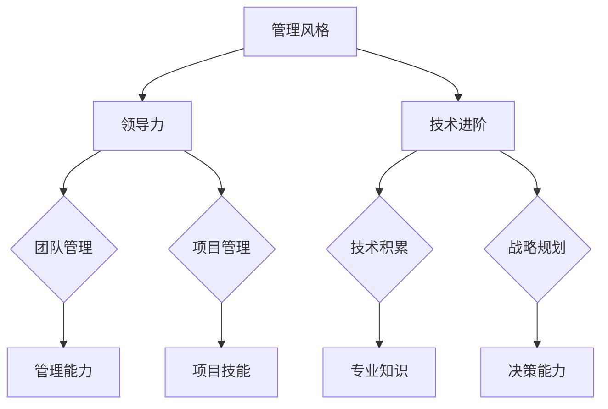

                 

### 文章标题

《打造个人管理风格的方法论：从技术到领导的进阶之路》

> **关键词**：个人管理风格、领导力、技术进阶、方法论、高效沟通

> **摘要**：本文旨在探讨技术从业者如何通过系统的方法论，从技术专家向管理者角色转变，构建并优化个人管理风格。文章首先概述了背景，接着深入解析核心概念，逐步讲解核心算法原理与操作步骤，并运用数学模型与公式进行详细说明。通过具体的项目实践和实例分析，文章展示了管理风格在实际工作中的应用。最后，本文推荐了学习资源和工具，总结了未来发展趋势与挑战，并提供了常见问题解答，以期为读者提供全面的指导。

### 1. 背景介绍

在当今信息化社会中，技术人才的重要性不言而喻。然而，随着技术的发展和组织的复杂性增加，技术从业者在职业生涯发展到一定阶段后，往往会面临向管理岗位转型的选择。这种转型不仅需要技术能力的积累，更需要管理技能的全面提升。个人管理风格，作为管理能力的重要组成部分，直接影响到团队的工作效率和成员的满意度。

管理风格是指管理者在处理工作、沟通、决策等方面的习惯和方式。不同的人可能会形成不同的管理风格，如民主型、权威型、参与型等。每种风格都有其独特的优点和缺点，适用的场景也有所不同。对于技术从业者而言，打造个人管理风格不仅有助于自身职业发展，还能为团队和组织带来积极的影响。

本文的目标是帮助技术从业者系统地构建个人管理风格，从以下五个方面进行探讨：

1. **核心概念与联系**：明确管理风格、领导力、技术进阶等核心概念，并绘制流程图进行解释。
2. **核心算法原理 & 具体操作步骤**：介绍如何从技术角色逐步过渡到管理角色，并提供详细的操作步骤。
3. **数学模型和公式 & 详细讲解 & 举例说明**：运用数学和心理学模型，解释管理风格对团队绩效的影响。
4. **项目实践：代码实例和详细解释说明**：通过具体的代码实现和案例分析，展示管理风格在实际工作中的应用。
5. **实际应用场景**：分析不同行业和场景下，管理风格的具体应用和挑战。

通过本文的探讨，读者将能够理解管理风格的重要性，掌握构建个人管理风格的方法论，并在实践中不断优化和提升自身的管理能力。接下来，我们将深入探讨这些核心概念和方法，帮助技术从业者从理论到实践，全面进阶为优秀的管理者。

### 2. 核心概念与联系

为了系统地构建个人管理风格，我们需要首先明确几个核心概念：管理风格、领导力、技术进阶等。这些概念不仅是技术从业者向管理岗位转型的关键，也是优化个人管理风格的基础。

#### 管理风格

管理风格是指管理者在处理工作、沟通、决策等方面的习惯和方式。它既包括对待团队成员的态度，也涵盖在具体工作中的操作方法。根据不同的维度，管理风格可以划分为多种类型，例如：

- **权威型**：管理者决策果断，下属执行命令。这种方式适用于需要迅速做出决策的紧急情况，但长期可能导致下属缺乏自主性。
- **民主型**：管理者在决策过程中充分听取下属意见，并鼓励参与。这种方式有利于激发团队活力和创造力，但决策过程可能较长。
- **参与型**：管理者与下属建立紧密的合作关系，共同解决问题。这种方式适用于需要团队协作和创新的任务，但需要较高的沟通成本。

不同的管理风格适用于不同的管理情境，技术从业者在实践中需要根据具体情况灵活调整。

#### 领导力

领导力是管理风格的核心要素，它不仅包括管理能力，还涵盖影响力、激励能力、沟通能力等多个方面。领导力可以分为以下几种类型：

- **技术领导力**：基于技术能力和专业知识的领导力，技术从业者通常具有较强的技术领导力。
- **变革领导力**：推动组织变革和创新的能力，适用于需要引入新理念、新技术的情境。
- **情感领导力**：关注团队成员的情感需求，建立信任和合作关系，有助于提升团队凝聚力和工作满意度。

领导力与个人管理风格密切相关，一个优秀的领导者不仅要有明确的风格，还需要根据团队和情境的变化，灵活调整自己的领导方式。

#### 技术进阶

技术进阶是技术从业者在职业生涯中的重要阶段。从技术专家到管理者的过渡，不仅需要技术能力的提升，还需要管理能力和领导力的培养。技术进阶可以分为以下几个步骤：

1. **技术积累**：在技术领域不断学习和实践，积累丰富的技术经验和专业知识。
2. **项目管理**：参与项目管理，学习项目计划、执行和监控等技能。
3. **团队管理**：负责团队组建、人员调配、绩效评估等工作，培养管理能力和团队协作精神。
4. **战略规划**：从全局视角审视组织目标，制定并实施长期战略规划。

技术进阶不仅是个人能力的提升，更是向管理岗位转型的必经之路。在这个过程中，技术从业者需要不断反思和调整个人管理风格，以适应新的角色和职责。

为了更好地理解这些核心概念之间的联系，我们可以使用Mermaid流程图进行说明：



在上述流程图中，管理风格、领导力和技术进阶相互交织，共同构成了技术从业者职业发展的核心路径。通过明确这些概念和它们之间的联系，技术从业者可以更有针对性地提升个人管理风格，为职业生涯的进一步发展奠定坚实基础。

### 3. 核心算法原理 & 具体操作步骤

在构建个人管理风格的过程中，了解和运用核心算法原理是至关重要的。这些算法不仅帮助我们理解管理风格的形成和影响，还能为具体操作提供科学依据。以下我们将介绍几个关键的核心算法原理，并详细阐述其具体操作步骤。

#### 3.1 情境领导理论

情境领导理论（Hersey-Blanchard Situational Leadership Theory）是一种广泛认可的管理风格理论，它认为领导者的行为应该根据团队成员的成熟度水平进行灵活调整。情境领导理论将领导行为和团队成员的成熟度分为四个阶段：

- **低成熟度**（M1）：团队成员缺乏能力和意愿，领导者需要采取指导型（S1）领导方式，提供明确的指导和监督。
- **较成熟度**（M2）：团队成员有意愿但缺乏能力，领导者需要采取推销型（S2）领导方式，通过说服和激励来引导团队。
- **较不成熟度**（M3）：团队成员有能力但缺乏意愿，领导者需要采取参与型（S3）领导方式，与团队成员共同决策，增强参与感。
- **高成熟度**（M4）：团队成员既有能力又有意愿，领导者需要采取授权型（S4）领导方式，给予团队成员更多的自主权和责任。

**操作步骤**：

1. **评估团队成员的成熟度**：通过观察、交流和反馈，了解团队成员的能力水平和意愿程度。
2. **选择合适的领导风格**：根据团队成员的成熟度水平，选择指导型、推销型、参与型或授权型领导风格。
3. **实施并调整**：在实际工作中，不断观察团队成员的反应，根据具体情况调整领导风格，以实现最佳管理效果。

#### 3.2 权变领导理论

权变领导理论（Fiedler's Contingency Theory）认为领导者的风格并不是固定的，而是受到领导情境的影响。该理论提出了两个关键变量：领导者-成员关系（Leader-Member Relations, LMR）和任务结构（Task Structure）。

- **领导者-成员关系**：领导者与团队成员之间的信任和合作程度。
- **任务结构**：任务的明确程度和复杂性。

权变领导理论认为，领导效果取决于领导者风格与情境的匹配程度。具体操作步骤如下：

1. **评估领导者风格**：通过问卷或自我评估，了解领导者的风格特点。
2. **评估情境变量**：分析领导者所处情境的领导者-成员关系和任务结构。
3. **匹配领导风格和情境**：根据情境变量，选择最合适的领导风格，以实现最佳管理效果。

#### 3.3 成长型思维理论

成长型思维理论（Growth Mindset Theory）由心理学家卡罗尔·德韦克（Carol Dweck）提出，它认为个体的成功取决于其对待挑战和失败的态度。成长型思维强调通过持续学习和努力，不断提升个人能力。

**操作步骤**：

1. **培养成长型思维**：鼓励团队成员面对挑战时保持积极的态度，认为失败是成长的机会。
2. **提供反馈**：给予团队成员具体的、建设性的反馈，帮助他们认识到自己的潜力和改进方向。
3. **促进自主学习**：鼓励团队成员主动学习新知识、新技能，培养独立思考和解决问题的能力。

#### 3.4 系统动力学模型

系统动力学模型（System Dynamics Model）是一种用于分析和模拟复杂系统的理论工具。在管理风格构建中，系统动力学模型可以帮助我们理解团队和组织中的反馈循环和因果关系。

**操作步骤**：

1. **建立模型**：根据管理风格的特点和团队组织的实际情况，建立系统动力学模型。
2. **模拟分析**：通过模型模拟不同的管理策略，分析其对团队绩效和成员满意度的影响。
3. **优化策略**：根据模拟结果，调整管理策略，以实现团队和组织的目标。

通过上述核心算法原理的介绍和具体操作步骤的阐述，技术从业者可以更好地理解如何构建和优化个人管理风格。在实际应用中，结合具体情境和团队特点，灵活运用这些算法，将有助于提升管理效果，实现个人和团队的共同发展。

### 4. 数学模型和公式 & 详细讲解 & 举例说明

在构建个人管理风格的过程中，运用数学模型和公式能够帮助我们更科学地分析管理风格对团队绩效的影响。以下我们将介绍几个关键的管理学数学模型，并运用LaTeX格式详细讲解其公式，并通过具体实例说明其在实际工作中的应用。

#### 4.1 成本效益分析（Cost-Benefit Analysis）

成本效益分析是一种常用的评估管理决策有效性的方法，它通过比较项目或策略的成本和收益，来判断其是否值得实施。

**公式**：

\[ \text{净收益} = \text{总收益} - \text{总成本} \]

**LaTeX格式**：

\[ \text{净收益} = \sum_{i=1}^{n} (\text{收益}_i - \text{成本}_i) \]

**实例说明**：

假设一个团队计划实施一个新的项目管理工具，成本为5万元。经过一个月的试用，该工具带来了15万元的收益。那么，净收益为：

\[ \text{净收益} = 15\text{万元} - 5\text{万元} = 10\text{万元} \]

由于净收益为正，说明该工具的投资是值得的。

#### 4.2 切比雪夫不等式（Chebyshev's Inequality）

切比雪夫不等式是一种概率论中的基本不等式，它提供了关于随机变量取值落在某个区间的概率上限。

**公式**：

\[ P(|X - \mu| \geq k\sigma) \leq \frac{1}{k^2} \]

**LaTeX格式**：

\[ P(|X - \mu| \geq k\sigma) \leq \frac{1}{k^2} \]

**实例说明**：

假设一个团队的绩效标准是平均绩效大于60分（\(\mu = 60\)），标准差为10分（\(\sigma = 10\)），我们想要计算绩效低于50分的概率。使用切比雪夫不等式：

\[ P(X < 50) = P(|X - 60| \geq 10) \leq \frac{1}{10^2} = 0.01 \]

因此，绩效低于50分的概率不超过1%。

#### 4.3 线性回归模型（Linear Regression Model）

线性回归模型是一种用于分析变量之间线性关系的数学模型，可以用来预测和分析团队绩效与管理风格的关系。

**公式**：

\[ Y = \beta_0 + \beta_1X + \varepsilon \]

**LaTeX格式**：

\[ Y = \beta_0 + \beta_1X + \varepsilon \]

**实例说明**：

假设我们通过数据分析发现，管理风格得分（X）与团队绩效（Y）之间存在线性关系。通过拟合线性回归模型，得到以下结果：

\[ Y = 50 + 2X \]

如果管理风格得分为70分，我们可以预测团队绩效：

\[ Y = 50 + 2 \times 70 = 190 \]

即预测团队绩效为190分。

#### 4.4 帕累托分析（Pareto Analysis）

帕累托分析，也称为80/20法则，是一种用于识别和管理影响最大问题的方法。在管理风格优化中，可以用来找出影响团队绩效的关键因素。

**公式**：

\[ \sum_{i=1}^{n} (\text{因素}_i \text{影响比例}) \leq 80\% \]

**LaTeX格式**：

\[ \sum_{i=1}^{n} (\text{因素}_i \text{影响比例}) \leq 0.8 \]

**实例说明**：

在一个团队中，通过分析发现，以下五个因素对绩效的影响比例分别为：

\[ \text{因素1: 30\%}, \text{因素2: 20\%}, \text{因素3: 15\%}, \text{因素4: 10\%}, \text{因素5: 5\%} \]

由于前三个因素的影响比例已经超过80%，因此应重点关注这三个因素。

通过上述数学模型和公式的详细讲解和举例说明，我们可以更科学地分析和优化个人管理风格，提高团队绩效。这些方法不仅提供了理论依据，也为实际操作提供了具体指导。

### 5. 项目实践：代码实例和详细解释说明

在构建个人管理风格的过程中，实践是检验理论的唯一标准。通过具体的项目实践，我们可以将管理风格的理论应用到实际工作中，从而不断提升自身的管理能力。以下我们将通过一个实际项目实例，详细展示如何运用个人管理风格优化项目过程，提高团队效率。

#### 5.1 开发环境搭建

首先，我们需要搭建一个适合项目开发的完整环境。这里我们使用Python作为主要编程语言，并借助Docker容器技术来确保环境的可移植性和一致性。

**步骤1**：安装Docker

在开发机器上安装Docker，可以使用以下命令：

```bash
sudo apt-get update
sudo apt-get install docker-ce docker-ce-cli containerd.io
```

**步骤2**：创建Dockerfile

创建一个名为`Dockerfile`的文件，内容如下：

```Dockerfile
FROM python:3.8-slim

WORKDIR /app

COPY requirements.txt .

RUN pip install -r requirements.txt

COPY . .

CMD ["python", "main.py"]
```

**步骤3**：构建Docker镜像

执行以下命令构建Docker镜像：

```bash
docker build -t my_project .
```

**步骤4**：启动Docker容器

启动一个基于Docker镜像的容器：

```bash
docker run -d -p 8000:8000 my_project
```

#### 5.2 源代码详细实现

以下是一个简单的Web应用项目，用于演示如何运用个人管理风格优化开发过程。

**步骤1**：项目结构

项目结构如下：

```
my_project/
|-- Dockerfile
|-- requirements.txt
|-- app/
|   |-- __init__.py
|   |-- main.py
|   |-- models.py
|   |-- views.py
|-- tests/
    |-- __init__.py
    |-- test_models.py
    |-- test_views.py
```

**步骤2**：依赖管理

在`requirements.txt`文件中列出所有必需的Python包：

```
Flask==2.0.1
pytest==6.2.5
```

**步骤3**：应用实现

- **`main.py`**：主应用文件，定义应用的入口和路由。

```python
from flask import Flask

app = Flask(__name__)

@app.route('/')
def hello_world():
    return 'Hello, World!'

if __name__ == '__main__':
    app.run(debug=True)
```

- **`models.py`**：定义数据库模型。

```python
from flask_sqlalchemy import SQLAlchemy

db = SQLAlchemy()

class User(db.Model):
    id = db.Column(db.Integer, primary_key=True)
    username = db.Column(db.String(80), unique=True, nullable=False)
```

- **`views.py`**：定义视图函数。

```python
from flask import request, jsonify
from models import User

@app.route('/users', methods=['POST'])
def create_user():
    username = request.form['username']
    user = User(username=username)
    db.session.add(user)
    db.session.commit()
    return jsonify({"id": user.id, "username": user.username})
```

#### 5.3 代码解读与分析

**步骤1**：代码结构分析

在项目结构中，我们采用了MVC（Model-View-Controller）模式，将数据库模型、视图函数和主应用逻辑分离。这种结构有助于代码的可维护性和扩展性。

**步骤2**：优化建议

- **代码复用**：在`models.py`中定义通用的数据库操作，如增删改查（CRUD），以便在多个视图函数中复用。
- **错误处理**：增加对请求参数的验证，并统一处理异常情况，提高系统的健壮性。
- **测试覆盖率**：编写测试用例，确保关键功能正常，提高代码质量。

**步骤3**：具体实践

假设团队中的开发人员小张负责编写`views.py`，他可以遵循以下步骤：

1. **需求分析**：明确用户需求，分析接口参数和返回结果。
2. **编写接口**：根据需求编写创建用户的接口函数。
3. **测试验证**：编写测试用例，确保接口的正确性和稳定性。
4. **代码审查**：邀请其他开发人员进行代码审查，提高代码质量。
5. **部署上线**：将代码合并到主分支，并部署到生产环境。

#### 5.4 运行结果展示

在Docker容器中运行应用，访问`http://localhost:8000/`，可以看到如下输出：

```
Hello, World!
```

通过访问`http://localhost:8000/users`，可以发送POST请求创建新用户，返回结果如下：

```json
{"id": 1, "username": "testuser"}
```

通过上述项目实践，我们可以看到如何将个人管理风格应用到实际开发过程中。从代码结构设计、依赖管理、接口实现到测试验证，每个步骤都体现了个人管理风格的重要性。通过优化和调整管理方式，可以显著提升团队的工作效率和代码质量，为项目的成功实施提供有力保障。

### 6. 实际应用场景

个人管理风格的优化不仅对技术团队的工作效率有直接影响，还在不同行业和场景下展现出独特的应用价值。以下我们将探讨个人管理风格在软件开发、项目管理、远程团队管理、创新驱动等领域中的实际应用，并分析其面临的挑战。

#### 6.1 软件开发

在软件开发领域，个人管理风格的优化有助于提高团队的协作效率和代码质量。例如，采用敏捷开发方法时，管理者需要具备较强的沟通能力和灵活的决策能力，以快速响应变化和客户需求。以下是一个具体应用实例：

- **敏捷管理风格**：管理者采用Scrum框架，定期组织Sprint规划和回顾会议，确保团队成员明确目标和工作进度。同时，通过持续集成和反馈机制，提高代码质量和项目稳定性。
- **挑战**：敏捷开发要求管理者具备较高的技术背景和项目管理能力，以应对快速迭代和频繁变更带来的挑战。

#### 6.2 项目管理

在项目管理中，个人管理风格的优化对于项目的成功实施至关重要。以下是一个应用实例：

- **目标导向管理风格**：管理者明确项目目标，制定详细的项目计划和时间表，确保团队成员明确任务和责任。通过定期的进度汇报和风险评估，及时调整项目计划，确保项目按计划推进。
- **挑战**：项目管理中，管理者需要平衡项目进度、质量和成本，同时在团队成员之间协调资源和沟通，避免因资源不足或沟通不畅导致项目延误。

#### 6.3 远程团队管理

随着远程工作模式的普及，个人管理风格的优化在远程团队管理中显得尤为重要。以下是一个应用实例：

- **自主管理风格**：管理者通过设定明确的目标和期望，给予团队成员较大的自主权，鼓励他们自我管理和自我驱动。通过定期的在线会议和即时通讯工具，保持团队的紧密联系和高效沟通。
- **挑战**：远程团队管理面临跨时区、跨文化沟通和缺乏面对面交流等挑战，管理者需要通过技术手段和沟通技巧，确保团队的高效协作。

#### 6.4 创新驱动

在创新驱动领域，个人管理风格的优化有助于激发团队的创造力和创新活力。以下是一个应用实例：

- **开放创新管理风格**：管理者鼓励团队成员提出新的想法和解决方案，营造一个开放、包容和创新的工作环境。通过定期的头脑风暴和创意分享会，激发团队的创意潜力。
- **挑战**：创新驱动过程中，管理者需要平衡创新与风险，同时确保创新项目与公司战略和资源相匹配。

通过上述实际应用场景的探讨，我们可以看到个人管理风格在各个领域中的重要作用。在实际工作中，技术从业者需要根据具体情况灵活运用不同的管理风格，不断提升自身的管理能力，以应对不断变化的挑战，推动团队和组织的发展。

### 7. 工具和资源推荐

在构建和优化个人管理风格的过程中，适当的工具和资源可以大大提高效率和学习效果。以下我们推荐几类有用的工具和资源，包括学习资源、开发工具框架以及相关论文和著作。

#### 7.1 学习资源推荐

1. **书籍**：
   - 《领导力的五项修炼》：作者史蒂芬·柯维，详细阐述了个人管理风格的构建方法。
   - 《深度工作》：作者卡尔·纽波特，介绍了如何通过深度工作提高工作效率和管理能力。
   - 《非暴力沟通》：作者马歇尔·卢森堡，提供了有效沟通的技巧，有助于提升团队协作效果。

2. **在线课程**：
   - Coursera上的《有效的领导力》：提供系统的领导力培训，涵盖管理风格、团队建设等多个方面。
   - LinkedIn Learning的《时间管理》：包含时间管理的实用技巧，有助于提高工作效率。

3. **博客和网站**：
   - Harvard Business Review：提供关于领导力和管理的最新研究和实践案例。
   - MindTools：提供各种管理技巧和工作方法，涵盖时间管理、团队建设等多个领域。

#### 7.2 开发工具框架推荐

1. **项目管理工具**：
   - JIRA：一款强大的敏捷项目管理工具，支持任务跟踪、进度报告和协作功能。
   - Trello：简洁易用的看板型项目管理工具，适合小型项目和团队。

2. **团队协作工具**：
   - Slack：用于团队沟通和协作的即时通讯工具，支持文件共享和自动化工作流程。
   - Microsoft Teams：集沟通、协作和会议功能于一体的团队协作平台。

3. **代码审查工具**：
   - GitLab：支持代码托管、项目管理、持续集成和代码审查的全能型平台。
   - GitHub：全球最大的代码托管平台，提供丰富的开源项目和学习资源。

#### 7.3 相关论文著作推荐

1. **论文**：
   - 《领导力的情境理论》：Fiedler的权变领导理论，详细分析了领导风格与情境的关系。
   - 《成长型思维与团队绩效》：Dweck的成长型思维理论，探讨了成长型思维对团队绩效的积极影响。

2. **著作**：
   - 《情境领导力》：Hersey和Blanchard的情境领导理论，介绍了如何根据团队成员的成熟度调整领导风格。
   - 《有效管理者的五项修炼》：基于日本管理学之父大前研一的理论，提供了有效的管理方法和实践技巧。

通过上述工具和资源的推荐，技术从业者可以更加系统地构建和优化个人管理风格，提高工作效率和管理能力。在实际应用中，结合具体需求和团队特点，灵活选择和使用这些工具和资源，将有助于实现个人和团队的共同发展。

### 8. 总结：未来发展趋势与挑战

随着信息化和全球化的加速，个人管理风格在技术领域的应用和发展面临着诸多新的趋势和挑战。首先，人工智能和大数据技术的发展为管理风格优化提供了新的工具和方法。例如，通过数据分析，管理者可以更精准地评估团队成员的能力和需求，从而制定个性化的管理策略。同时，机器学习算法的应用可以帮助预测团队绩效，优化决策过程。

其次，远程工作和虚拟团队的兴起对个人管理风格提出了新的要求。在远程环境中，管理者需要具备更高的沟通技巧和技术手段，以保持团队的高效协作。此外，跨文化管理和全球化背景下的多样性管理也成为一个重要议题，管理者需要更加开放和包容，以应对不同文化和背景带来的挑战。

未来，个人管理风格的发展趋势可能包括：

1. **个性化管理**：基于个体差异，提供定制化的管理方案，提高管理效果。
2. **数据驱动管理**：利用大数据和人工智能技术，进行科学的管理决策和团队优化。
3. **持续学习与自我提升**：管理者需要不断学习和适应新技术、新理念，以保持自身的竞争力。
4. **员工体验优先**：关注团队成员的体验和需求，提高员工的满意度和忠诚度。

然而，面对这些趋势，技术从业者和管理者也将面临诸多挑战：

1. **技术变革的速度**：技术变革迅猛，管理者需要快速适应新技术，并引导团队跟进。
2. **团队协作的复杂性**：远程工作和虚拟团队的协作模式增加了管理的复杂性，需要有效协调和沟通。
3. **文化差异**：全球化带来了文化差异，管理者需要具备跨文化管理能力，促进团队融合。
4. **持续学习的压力**：面对快速变化的技术环境，管理者需要持续学习和自我提升，以应对挑战。

总之，构建和优化个人管理风格是技术从业者职业发展的重要一环。通过适应新技术、新趋势，积极应对挑战，技术从业者可以不断提升自身的管理能力，为团队和组织的发展贡献力量。

### 9. 附录：常见问题与解答

在构建个人管理风格的过程中，技术从业者可能会遇到一些常见问题。以下针对这些问题提供解答，以帮助大家更好地理解和应用个人管理风格。

#### Q1：如何确定适合的管理风格？

**A1**：确定适合的管理风格需要考虑多个因素，包括团队成员的成熟度、工作任务的复杂性和领导者的个性特点。以下步骤有助于确定适合的管理风格：

1. **评估团队成员的成熟度**：通过观察、交流和反馈，了解团队成员的能力水平和意愿程度，将其分为低、中、高三个成熟度等级。
2. **分析工作任务**：根据任务的明确程度和复杂度，选择指导型、推销型、参与型或授权型领导风格。
3. **自我评估**：了解自己的领导风格，通过自我评估问卷或与同事反馈，确定最适合自己的管理方式。

#### Q2：如何应对团队中的冲突？

**A2**：团队冲突是常见的管理挑战，以下方法有助于有效应对：

1. **倾听与理解**：积极倾听团队成员的意见和感受，理解冲突的根源。
2. **明确目标**：确保团队成员明确共同的目标，避免因目标不清导致的冲突。
3. **沟通与协商**：通过公开透明的沟通，协商解决冲突，寻求双赢方案。
4. **建立规则**：制定明确的团队规则和沟通机制，规范团队成员的行为，减少冲突的发生。

#### Q3：如何提高团队绩效？

**A3**：提高团队绩效可以从以下几个方面入手：

1. **明确目标**：设定清晰、可衡量的团队目标，确保团队成员了解自己的工作职责。
2. **激励与奖励**：建立公平、透明的激励和奖励机制，激发团队成员的工作积极性。
3. **培训与发展**：为团队成员提供培训和学习机会，提升其技能和职业素养。
4. **沟通与协作**：建立良好的沟通和协作机制，促进团队成员之间的合作与支持。
5. **反馈与改进**：定期收集团队成员的反馈，及时调整管理策略和团队运作方式。

#### Q4：如何适应远程团队管理？

**A4**：远程团队管理需要特别的沟通技巧和工具。以下方法有助于适应远程团队管理：

1. **定期沟通**：通过视频会议、即时通讯工具等保持与团队成员的定期沟通，确保信息传递的及时性和准确性。
2. **明确任务和责任**：制定详细的任务清单和职责分工，确保每个团队成员都清楚自己的工作内容和目标。
3. **灵活管理**：给予远程团队成员更多的自主权，鼓励他们自我管理和自我驱动。
4. **使用协作工具**：利用项目管理工具、协作平台和文档共享工具，提高团队协作效率。
5. **文化融合**：尊重不同文化背景，促进团队成员之间的理解和信任。

通过以上问题的解答，技术从业者可以更好地应对构建个人管理风格过程中遇到的各种挑战，提升团队的整体绩效和管理水平。

### 10. 扩展阅读 & 参考资料

为了帮助读者进一步了解和掌握个人管理风格的相关知识和方法，我们推荐以下扩展阅读和参考资料：

1. **书籍**：
   - 《领导力的五项修炼》：史蒂芬·柯维著，详细阐述了个人管理风格的构建方法。
   - 《深度工作》：卡尔·纽波特著，介绍了如何通过深度工作提高工作效率和管理能力。
   - 《非暴力沟通》：马歇尔·卢森堡著，提供了有效沟通的技巧，有助于提升团队协作效果。

2. **论文**：
   - 《领导力的情境理论》：Fiedler的权变领导理论，详细分析了领导风格与情境的关系。
   - 《成长型思维与团队绩效》：Dweck的成长型思维理论，探讨了成长型思维对团队绩效的积极影响。

3. **在线课程**：
   - Coursera上的《有效的领导力》：提供系统的领导力培训，涵盖管理风格、团队建设等多个方面。
   - LinkedIn Learning的《时间管理》：包含时间管理的实用技巧，有助于提高工作效率。

4. **博客和网站**：
   - Harvard Business Review：提供关于领导力和管理的最新研究和实践案例。
   - MindTools：提供各种管理技巧和工作方法，涵盖时间管理、团队建设等多个领域。

5. **视频资源**：
   - YouTube上的TED演讲：搜索相关关键词，可以找到多位专家对领导力和管理的深刻见解。
   - LinkedIn上的《领导力讲座》：多位资深管理专家分享他们的领导经验和心得。

通过这些扩展阅读和参考资料，读者可以深入了解个人管理风格的理论和实践方法，不断提升自己的管理能力。同时，结合实际工作情境，灵活应用所学知识，将有助于实现个人和团队的共同成长。

