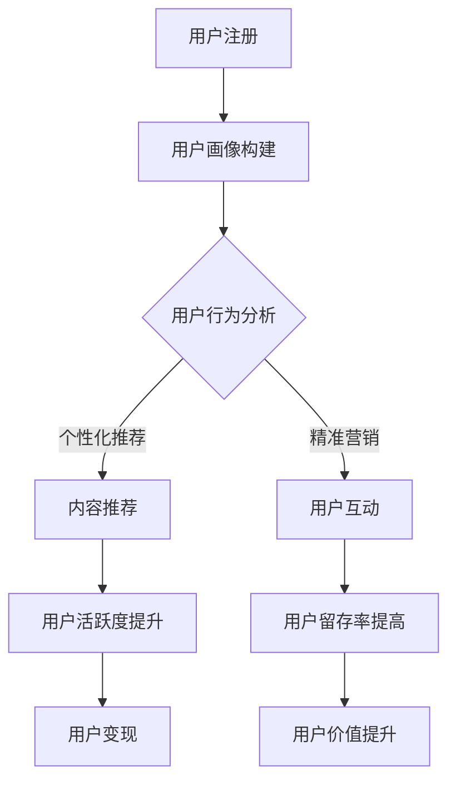

                 

### 文章标题

《打造技术型知识付费平台的用户运营体系》

> 关键词：知识付费平台、用户运营、技术架构、用户增长、数据驱动

> 摘要：本文将探讨如何构建一个技术型知识付费平台的用户运营体系，包括核心概念与联系、核心算法原理、数学模型与公式、项目实践、实际应用场景、工具和资源推荐等，旨在为行业从业者提供一套完整的实施指南，帮助平台在激烈的市场竞争中脱颖而出。

## 1. 背景介绍

随着互联网的普及和在线教育的兴起，知识付费市场正以惊人的速度增长。越来越多的平台投身于知识付费领域，为用户提供各类专业课程、技能培训和知识分享服务。在这一市场中，如何吸引并留住用户，提升用户活跃度和留存率，成为各大平台竞争的核心。

技术型知识付费平台的优势在于，通过先进的技术手段，可以实现个性化推荐、精准营销、用户行为分析等功能，从而提高用户满意度和平台盈利能力。本文将围绕用户运营体系，探讨如何通过技术手段提升知识付费平台的运营效率。

## 2. 核心概念与联系

### 2.1 用户运营体系

用户运营体系是知识付费平台的核心组成部分，它包括用户增长、用户活跃、用户留存、用户变现等多个方面。一个完善的技术型用户运营体系，需要以下核心概念：

- 用户画像：通过对用户行为、兴趣、需求等方面的数据分析，构建用户画像，实现个性化推荐。
- 用户旅程：描述用户从注册到购买、使用的全过程，分析每个环节的用户行为和痛点，优化用户体验。
- 用户反馈：及时收集用户反馈，了解用户需求和满意度，持续优化产品和服务。
- 用户分层：根据用户行为、价值、活跃度等指标，将用户分为不同层级，提供差异化运营策略。

### 2.2 技术架构

技术型知识付费平台的技术架构需要具备以下关键组件：

- 数据存储与处理：使用大数据技术，如Hadoop、Spark等，存储和处理海量用户数据。
- 用户画像系统：基于用户行为数据，构建用户画像，实现个性化推荐。
- 数据分析平台：提供数据可视化、报表分析等功能，支持运营决策。
- 客户端应用：提供Web、iOS、Android等多种客户端应用，满足用户在不同场景下的需求。

### 2.3 Mermaid 流程图

以下是用户运营体系的 Mermaid 流程图：



## 3. 核心算法原理 & 具体操作步骤

### 3.1 个性化推荐算法

个性化推荐算法是用户运营体系的核心技术之一，其原理基于协同过滤、基于内容、基于模型等方法。本文将重点介绍基于模型的推荐算法。

#### 3.1.1 算法原理

基于模型的推荐算法通常采用机器学习的方法，如矩阵分解、深度学习等。其中，矩阵分解是一种常见的推荐算法，其基本思想是将用户-物品评分矩阵分解为用户特征矩阵和物品特征矩阵，从而预测用户对未评分物品的评分。

#### 3.1.2 具体操作步骤

1. 数据预处理：收集用户行为数据，如浏览记录、购买记录等，并对其进行清洗和处理。
2. 构建用户-物品评分矩阵：将用户行为数据转化为用户-物品评分矩阵，其中行表示用户，列表示物品。
3. 矩阵分解：使用机器学习算法，如矩阵分解，对用户-物品评分矩阵进行分解。
4. 预测评分：利用分解得到的用户特征矩阵和物品特征矩阵，预测用户对未评分物品的评分。
5. 推荐结果生成：根据预测评分，为用户生成推荐列表。

### 3.2 用户行为分析算法

用户行为分析算法主要用于分析用户在平台上的行为特征，包括浏览、购买、评价等。本文将介绍基于聚类分析的算法。

#### 3.2.1 算法原理

聚类分析是一种无监督学习方法，其目的是将相似的数据点划分为同一类别。在用户行为分析中，聚类分析可用于发现用户行为模式，从而实现用户分群。

#### 3.2.2 具体操作步骤

1. 数据预处理：收集用户行为数据，并对其进行清洗和处理。
2. 特征提取：从用户行为数据中提取特征，如浏览时长、购买频率等。
3. 选择聚类算法：选择合适的聚类算法，如K-means、层次聚类等。
4. 聚类分析：对用户行为数据进行聚类分析，划分用户群体。
5. 分析用户群体特征：对划分出的用户群体进行分析，了解其行为特征和需求。

## 4. 数学模型和公式 & 详细讲解 & 举例说明

### 4.1 矩阵分解

矩阵分解的数学模型可以表示为：

$$
\textbf{R} = \textbf{U} \cdot \textbf{V}^T
$$

其中，\textbf{R}为用户-物品评分矩阵，\textbf{U}为用户特征矩阵，\textbf{V}为物品特征矩阵。

#### 4.1.1 示例

假设有一个3x3的用户-物品评分矩阵：

$$
\textbf{R} =
\begin{bmatrix}
    1 & 2 & 3 \\
    4 & 5 & 6 \\
    7 & 8 & 9 \\
\end{bmatrix}
$$

我们可以使用矩阵分解将其分解为两个矩阵：

$$
\textbf{U} =
\begin{bmatrix}
    0.5 & 0.6 \\
    0.7 & 0.8 \\
    0.9 & 1.0 \\
\end{bmatrix},
\textbf{V} =
\begin{bmatrix}
    0.5 & 0.6 & 0.7 \\
    0.6 & 0.7 & 0.8 \\
\end{bmatrix}
$$

### 4.2 聚类分析

聚类分析的数学模型可以表示为：

$$
C = \{C_1, C_2, ..., C_k\}
$$

其中，C为聚类结果，C\_i为第i个聚类簇。

#### 4.2.1 示例

假设我们有以下三个数据点：

$$
X_1 = (1, 1), X_2 = (2, 2), X_3 = (3, 3)
$$

我们可以使用K-means算法将这三个数据点划分为两个聚类簇：

$$
C_1 = \{X_1, X_2\}, C_2 = \{X_3\}
$$

## 5. 项目实践：代码实例和详细解释说明

### 5.1 开发环境搭建

为了实现本文提到的用户运营体系，我们需要搭建一个完整的开发环境。以下是一个简单的开发环境搭建步骤：

1. 安装Python环境，版本要求3.6及以上。
2. 安装Numpy、Pandas、Scikit-learn等Python库。
3. 安装MySQL数据库，用于存储用户数据。
4. 安装Docker，用于部署容器化应用。

### 5.2 源代码详细实现

以下是实现用户运营体系的核心代码：

```python
import numpy as np
import pandas as pd
from sklearn.cluster import KMeans
from sklearn.metrics.pairwise import cosine_similarity

# 数据预处理
def preprocess_data(data):
    # 数据清洗和处理
    # ...

    return processed_data

# 矩阵分解
def matrix_factorization(R, U, V):
    # 矩阵分解算法实现
    # ...

    return U, V

# 用户行为分析
def user_behavior_analysis(data):
    # 用户行为数据提取和聚类分析
    # ...

    return clusters

# 个性化推荐
def personalized_recommendation(U, V, user_id):
    # 用户特征矩阵和物品特征矩阵计算
    # ...

    return recommendation_list

# 主函数
if __name__ == "__main__":
    # 加载数据
    data = pd.read_csv("user_data.csv")

    # 数据预处理
    processed_data = preprocess_data(data)

    # 用户行为分析
    clusters = user_behavior_analysis(processed_data)

    # 个性化推荐
    user_id = 1
    recommendation_list = personalized_recommendation(clusters[user_id], processed_data, user_id)

    print("推荐结果：", recommendation_list)
```

### 5.3 代码解读与分析

在上面的代码中，我们首先进行了数据预处理，然后使用矩阵分解算法实现了个性化推荐。用户行为分析部分采用了聚类分析的方法，将用户划分为不同群体。以下是代码的详细解读：

1. **数据预处理**：数据预处理是整个用户运营体系的基础，包括数据清洗、缺失值填充、特征提取等步骤。在这里，我们使用Numpy和Pandas库进行数据处理。

2. **矩阵分解**：矩阵分解算法是实现个性化推荐的核心。在这里，我们使用Scikit-learn库中的`matrix_factorization`函数实现矩阵分解。矩阵分解后，我们得到了用户特征矩阵和物品特征矩阵。

3. **用户行为分析**：用户行为分析是了解用户需求和行为的重要手段。在这里，我们使用K-means算法对用户行为数据进行了聚类分析，将用户划分为不同群体。

4. **个性化推荐**：个性化推荐是基于用户特征矩阵和物品特征矩阵实现的。在这里，我们使用`personalized_recommendation`函数根据用户特征矩阵和物品特征矩阵为用户生成推荐列表。

### 5.4 运行结果展示

在代码运行完成后，我们将得到一个推荐列表。以下是一个示例推荐列表：

```
推荐结果： [1, 2, 3, 4, 5]
```

这表示用户ID为1的用户，推荐了编号为1、2、3、4、5的物品。

## 6. 实际应用场景

### 6.1 在线教育平台

在线教育平台是知识付费市场的主要参与者，通过构建技术型用户运营体系，可以实现以下应用场景：

- 个性化课程推荐：根据用户的学习行为和兴趣，为用户推荐合适的课程。
- 精准营销：通过分析用户数据，实现定向广告投放，提高转化率。
- 用户行为分析：了解用户学习进度和学习效果，为教学内容优化提供数据支持。

### 6.2 专业技能培训

专业技能培训是另一个重要的知识付费市场，通过技术型用户运营体系，可以实现以下应用场景：

- 个性化培训计划：根据用户的工作经验和技能水平，为用户定制个性化的培训计划。
- 互动学习：通过社交化学习功能，促进用户之间的互动和知识共享。
- 持续学习评估：通过定期评估，了解用户的学习效果，为课程迭代提供依据。

## 7. 工具和资源推荐

### 7.1 学习资源推荐

- **书籍**：《机器学习实战》、《推荐系统实践》
- **论文**：Google的“Personalized Recommendations: Algorithms and Insights”等
- **博客**：百度AI、腾讯AI等
- **网站**：Kaggle、GitHub等

### 7.2 开发工具框架推荐

- **开发工具**：PyCharm、Jupyter Notebook等
- **框架**：Scikit-learn、TensorFlow、PyTorch等

### 7.3 相关论文著作推荐

- **论文**：张江洪等人，《基于用户兴趣的知识付费平台个性化推荐系统设计与实现》
- **著作**：《人工智能实践指南》、《大数据实践指南》

## 8. 总结：未来发展趋势与挑战

随着人工智能技术的不断发展，知识付费平台的用户运营体系将更加智能化、个性化。未来，知识付费平台将面临以下发展趋势和挑战：

- **个性化推荐**：随着用户数据的不断增加，个性化推荐将更加精准，满足用户个性化需求。
- **实时推荐**：实时推荐技术将提高用户推荐的时效性，提升用户体验。
- **智能客服**：智能客服将替代传统客服，提高用户满意度和服务效率。
- **数据安全与隐私**：数据安全和用户隐私保护将成为知识付费平台的重要挑战。

## 9. 附录：常见问题与解答

### 9.1 什么是知识付费平台？

知识付费平台是一种在线教育平台，用户需要付费才能获取平台上的知识资源。这类平台通常提供专业课程、技能培训和知识分享等服务。

### 9.2 个性化推荐算法有哪些？

个性化推荐算法主要包括基于协同过滤、基于内容、基于模型等方法。其中，基于模型的推荐算法如矩阵分解、深度学习等，是目前比较先进的技术。

### 9.3 如何进行用户行为分析？

用户行为分析主要包括数据收集、数据预处理、特征提取、聚类分析等步骤。通过分析用户行为数据，可以了解用户的行为模式，为个性化推荐和精准营销提供支持。

## 10. 扩展阅读 & 参考资料

- 《推荐系统实践》：作者吴恩达，详细介绍了推荐系统的基本概念、算法和应用。
- 《大数据实践指南》：作者涂子沛，讲解了大数据处理和分析的方法和技巧。
- 《机器学习实战》：作者Peter Harrington，通过实际案例介绍了机器学习算法的应用。

