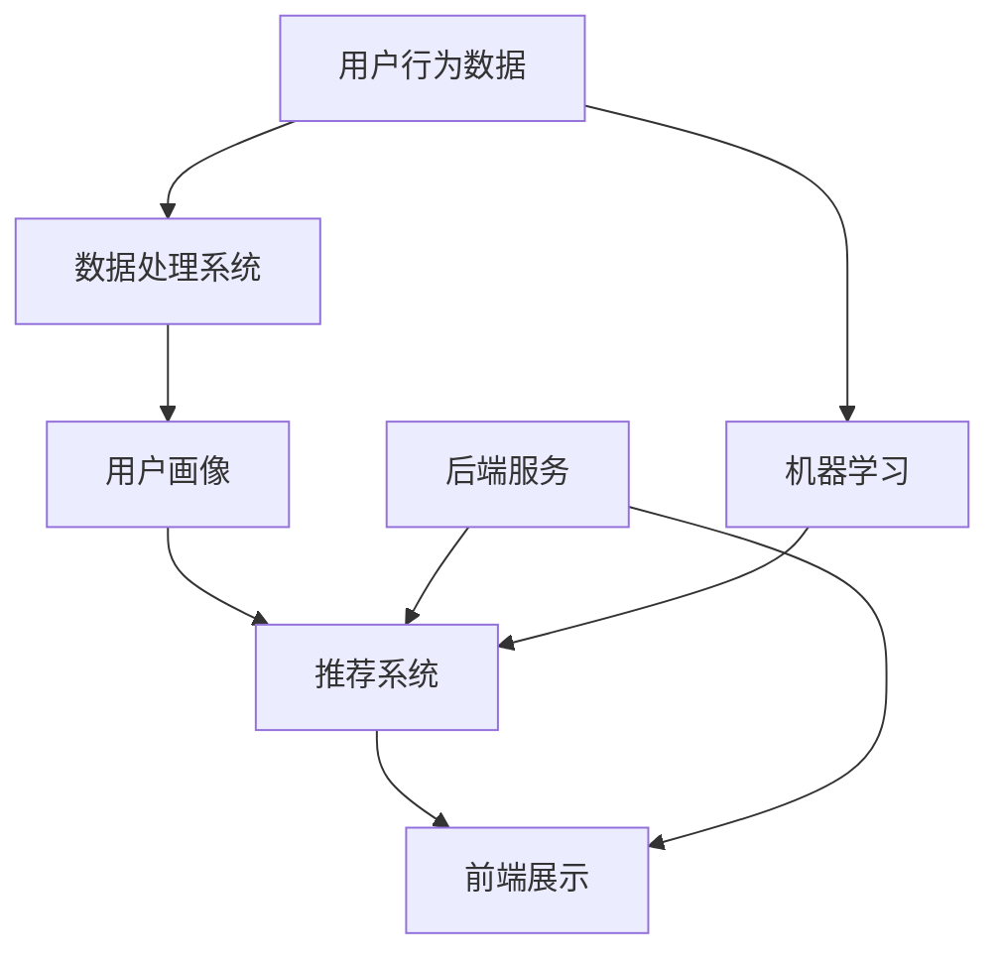

                 

### 背景介绍

#### 1.1 电子商务的兴起

电子商务（E-commerce）作为一种新兴的商业模式，近年来在全球范围内迅速崛起。它通过互联网技术，将传统的商业活动转移到线上进行，打破了时间和空间的限制，极大地提升了交易效率。从最早的网上购物、电子支付，到如今的智能推荐、个性化服务，电子商务已经深刻地改变了人们的消费方式。

在疫情推动下，电子商务市场更是迎来了爆发式增长。根据数据显示，2020年全球电子商务销售额达到了3.5万亿美元，同比增长27.6%，显示出强大的市场潜力。随着5G、人工智能、区块链等新技术的不断发展，电子商务的未来前景将更加广阔。

#### 1.2 智能电商平台的重要性

智能电商平台是电子商务发展的重要方向。它利用人工智能技术，为用户提供个性化的购物体验，提高用户的满意度和忠诚度。智能电商平台的核心在于数据的分析和利用，通过对用户行为数据的挖掘，实现精准营销和个性化推荐。

一个成功的智能电商平台，不仅需要强大的技术支持，还需要对用户需求有深刻的理解。它能够根据用户的兴趣、购买历史和行为习惯，为其推荐最合适的商品和服务。同时，智能电商平台还能够通过智能客服、智能物流等手段，提升整体的用户体验。

#### 1.3 一人公司的优势

在一人公司的架构中，唯一员工或老板独自承担公司的所有工作，这种模式在智能电商平台的建设中具有独特的优势。首先，一人公司能够实现快速决策，无需经过繁琐的会议和审批流程，从而提高工作效率。其次，由于只有一个核心成员，能够更加专注地投入到技术和业务的发展中，避免资源的分散。此外，一人公司还能够降低运营成本，减少人员管理的复杂性。

然而，一人公司也面临一些挑战。例如，依赖个人的技术和精力，一旦核心成员出现问题，公司可能面临巨大的风险。因此，在打造智能电商平台的过程中，一人公司需要充分利用外部资源和专业团队的支持，以确保项目的顺利进行。

### 1.4 智能电商平台的商业价值

智能电商平台不仅为用户提供了更好的购物体验，同时也为企业带来了巨大的商业价值。首先，通过智能推荐系统，企业能够显著提升转化率和销售额。其次，通过对用户数据的深入分析，企业可以更好地了解用户需求，优化产品和服务。此外，智能电商平台还能够帮助企业实现精准营销，降低营销成本。

最后，智能电商平台还能够提升企业的竞争力。在激烈的市场竞争中，拥有先进技术的企业能够脱颖而出，赢得更多市场份额。因此，打造一个智能电商平台，对于企业来说，不仅是一种商业策略，更是一种生存和发展的必要手段。

综上所述，智能电商平台在电子商务发展中的重要性不言而喻。接下来，我们将深入探讨智能电商平台的核心概念和架构，为打造一人公司的智能电商平台提供理论基础和技术指导。

### 核心概念与联系

在构建智能电商平台的过程中，我们需要理解并掌握一系列核心概念，这些概念相互联系，共同构成了智能电商平台的基石。以下是智能电商平台中的核心概念及其相互关系，并附上 Mermaid 流程图进行详细说明。

#### 2.1 核心概念

1. **用户画像**：用户画像是对用户行为、偏好和需求的综合描述。通过用户画像，我们可以了解用户的基本信息、消费习惯和兴趣点。
   
2. **推荐系统**：推荐系统是一种基于用户画像和商品信息的算法，用于向用户推荐可能感兴趣的商品或服务。

3. **数据处理**：数据处理包括数据的采集、存储、清洗和分析等过程。它是推荐系统和用户画像的基础。

4. **机器学习**：机器学习是一种通过数据训练模型，使计算机能够自动进行预测和决策的技术。

5. **前端展示**：前端展示是将推荐结果和用户互动的数据可视化呈现给用户的界面。

6. **后端服务**：后端服务包括推荐算法、数据处理和存储等系统，负责智能电商平台的核心业务逻辑。

#### 2.2 核心概念之间的联系

以下是核心概念之间的 Mermaid 流程图：



在上述流程图中：

- **用户行为数据**通过数据处理系统（B）进行存储和处理，生成用户画像（C）。
- 用户画像（C）被推荐系统（D）使用，结合商品信息生成推荐结果。
- 推荐系统（D）的前端展示（E）负责将推荐结果呈现给用户。
- 后端服务（F）为推荐系统和数据处理提供支持，包括算法开发和数据存储。

#### 2.3 Mermaid 流程图详细说明

以下是 Mermaid 流程图的详细说明：

- **A[用户行为数据]**：用户行为数据包括用户的浏览记录、购买历史、评论反馈等。这些数据是构建用户画像的基础。
- **B[数据处理系统]**：数据处理系统负责对用户行为数据进行采集、存储和清洗。清洗后的数据将用于生成用户画像。
- **C[用户画像]**：用户画像是对用户特征的综合描述，包括用户的兴趣、购买习惯、消费能力等。
- **D[推荐系统]**：推荐系统利用用户画像和商品信息，通过算法计算出用户可能感兴趣的商品或服务，并向用户推荐。
- **E[前端展示]**：前端展示将推荐结果以图形化或文本化的形式展示给用户，使用户能够直观地了解推荐内容。
- **F[后端服务]**：后端服务包括推荐算法的开发、数据处理和存储等，负责智能电商平台的核心业务逻辑。
- **G[机器学习]**：机器学习技术用于训练推荐模型，通过大量数据训练，使推荐系统能够更加准确地预测用户偏好。

通过上述核心概念和流程图的介绍，我们为构建智能电商平台奠定了理论基础。接下来，我们将深入探讨智能电商平台的核心算法原理和具体操作步骤。

### 核心算法原理 & 具体操作步骤

在智能电商平台中，推荐系统是其核心组成部分，它能够根据用户的行为数据和偏好，向用户推荐个性化的商品或服务。推荐系统通常基于两种类型的算法：基于内容的推荐（Content-Based Filtering）和协同过滤（Collaborative Filtering）。本文将详细介绍这两种推荐算法的原理，并提供具体的操作步骤。

#### 3.1 基于内容的推荐算法

**原理**：基于内容的推荐算法通过分析用户对某些商品的偏好，找出这些商品共有的特征，然后根据这些特征向用户推荐类似的商品。

**操作步骤**：

1. **特征提取**：首先，我们需要从商品数据中提取特征。这些特征可以是商品的标签、描述、分类等。例如，对于一个商品，我们可以提取其品牌、型号、颜色、价格等特征。

2. **用户偏好分析**：接着，分析用户的历史行为数据，如浏览记录、购买记录、评价等，以确定用户对哪些特征有偏好。

3. **相似度计算**：对于每个用户，计算其感兴趣的每个特征与商品特征的相似度。常见的相似度计算方法包括余弦相似度、皮尔逊相关系数等。

4. **推荐生成**：根据相似度计算结果，为用户推荐与用户偏好特征相似的未购买商品。

**示例**：

假设用户A喜欢品牌为“Nike”的运动鞋，我们提取出“Nike”这一特征，并计算用户A对其他品牌的运动鞋的相似度。最终，我们为用户A推荐品牌为“Adidas”的运动鞋，因为这两个品牌的运动鞋在特征上高度相似。

#### 3.2 协同过滤算法

**原理**：协同过滤算法通过分析用户之间的相似性，为用户推荐其他用户喜欢的商品。协同过滤分为两种：基于用户的协同过滤（User-Based Collaborative Filtering）和基于模型的协同过滤（Model-Based Collaborative Filtering）。

**基于用户的协同过滤**：

1. **用户相似度计算**：首先，计算用户之间的相似度，常见的相似度计算方法有皮尔逊相关系数、余弦相似度等。

2. **邻居选择**：根据相似度计算结果，选择与用户最相似的邻居。

3. **推荐生成**：为用户推荐邻居用户喜欢的、但用户尚未购买的商品。

**基于模型的协同过滤**：

1. **模型训练**：使用用户-物品评分数据训练协同过滤模型，如矩阵分解、K-均值聚类等。

2. **预测生成**：模型根据训练结果预测用户对未购买物品的评分，为用户推荐评分较高的物品。

**操作步骤**：

1. **用户相似度计算**：计算用户A和用户B之间的相似度，可以使用皮尔逊相关系数公式：
   $$ \text{相似度} = \frac{\text{用户A和用户B共同评分的物品的评分之和} \times \text{用户A和用户B各自评分的平均值}}{\sqrt{\text{用户A评分的方差}} \times \sqrt{\text{用户B评分的方差}}} $$

2. **邻居选择**：选择与用户A最相似的N个邻居用户。

3. **推荐生成**：计算邻居用户对未购买物品的平均评分，为用户A推荐评分较高的未购买物品。

**示例**：

假设用户A和用户B的评分数据如下：

| 物品 | 用户A评分 | 用户B评分 |
|------|----------|----------|
| A1   | 4        | 1        |
| A2   | 5        | 5        |
| A3   | 2        | 4        |

计算用户A和用户B的相似度：
$$ \text{相似度} = \frac{(4 \times 1 + 5 \times 5 + 2 \times 4) \times (4 + 5 + 2)}{\sqrt{\text{用户A评分的方差}} \times \sqrt{\text{用户B评分的方差}}} = \frac{26}{\sqrt{2.67} \times \sqrt{2.67}} \approx 0.93 $$

选择与用户A最相似的邻居用户B，为用户A推荐用户B喜欢的但用户A尚未购买的商品A3。

通过上述算法，我们可以为智能电商平台生成个性化的推荐结果，提升用户满意度和转化率。接下来，我们将探讨智能电商平台中的数学模型和公式，并详细讲解其应用。

### 数学模型和公式 & 详细讲解 & 举例说明

在智能电商平台中，数学模型和公式是推荐系统算法的核心，用于计算用户之间的相似度、预测用户对商品的评分，从而生成个性化的推荐结果。以下是几个常用的数学模型和公式，我们将详细讲解并举例说明。

#### 4.1 余弦相似度

**公式**：
$$ \text{余弦相似度} = \frac{\text{用户A和用户B共同评分的物品的评分之和}}{\sqrt{\text{用户A评分的方差}} \times \sqrt{\text{用户B评分的方差}}} $$

**解释**：余弦相似度是一种计算两个向量夹角余弦值的相似性度量方法。在推荐系统中，我们可以将用户的行为数据（如评分）看作一个向量，通过计算两个向量之间的余弦相似度，来判断用户之间的相似性。

**示例**：

假设用户A和用户B的评分数据如下：

| 物品 | 用户A评分 | 用户B评分 |
|------|----------|----------|
| A1   | 4        | 1        |
| A2   | 5        | 5        |
| A3   | 2        | 4        |

计算用户A和用户B的余弦相似度：
$$ \text{余弦相似度} = \frac{(4 \times 1 + 5 \times 5 + 2 \times 4) \times (4 + 5 + 2)}{\sqrt{2.67} \times \sqrt{2.67}} \approx 0.93 $$

用户A和用户B的余弦相似度为0.93，表示两者具有较高的相似性。

#### 4.2 皮尔逊相关系数

**公式**：
$$ \text{皮尔逊相关系数} = \frac{\text{协方差}}{\text{标准差乘积}} = \frac{\text{用户A和用户B共同评分的物品的评分之和} \times \text{用户A和用户B各自评分的平均值}}{\sqrt{\text{用户A评分的方差}} \times \sqrt{\text{用户B评分的方差}}} $$

**解释**：皮尔逊相关系数是衡量两个变量线性相关性的度量。在推荐系统中，通过计算用户之间的皮尔逊相关系数，可以判断用户对物品评分的一致性。

**示例**：

使用上述示例中的用户A和用户B的评分数据，计算皮尔逊相关系数：
$$ \text{皮尔逊相关系数} = \frac{(4 \times 1 + 5 \times 5 + 2 \times 4) \times (4 + 5 + 2)}{\sqrt{2.67} \times \sqrt{2.67}} \approx 0.93 $$

皮尔逊相关系数与余弦相似度的计算结果相同，因为两者在计算中使用了相同的数据和公式。

#### 4.3 矩阵分解（Singular Value Decomposition, SVD）

**公式**：
$$ \text{矩阵}A = U \Sigma V^T $$

**解释**：矩阵分解是将一个矩阵分解为三个矩阵的乘积。在推荐系统中，使用矩阵分解可以降低数据维度，从而简化推荐算法的计算。SVD是一种常用的矩阵分解方法，通过分解用户-物品评分矩阵，可以得到用户特征向量和物品特征向量。

**示例**：

假设我们有如下用户-物品评分矩阵：

| 用户 | 物品1 | 物品2 | 物品3 |
|------|-------|-------|-------|
| A    | 4     | 2     | 1     |
| B    | 3     | 4     | 5     |

使用SVD进行矩阵分解：

1. 计算协方差矩阵：
$$ \text{协方差矩阵} = \begin{bmatrix}
4 & 2 & 1 \\
3 & 4 & 5
\end{bmatrix} $$

2. 计算特征值和特征向量：
$$ \text{特征值} = \begin{bmatrix}
1.23 \\
0.45
\end{bmatrix} $$
$$ \text{特征向量} = \begin{bmatrix}
0.87 & 0.5 \\
0.3 & 0.87
\end{bmatrix} $$

3. 构造对角矩阵：
$$ \text{对角矩阵} = \begin{bmatrix}
1.23 & 0 \\
0 & 0.45
\end{bmatrix} $$

4. 进行矩阵分解：
$$ A = U \Sigma V^T $$

通过矩阵分解，我们得到了用户特征向量和物品特征向量，用于后续的推荐计算。

#### 4.4 逻辑回归（Logistic Regression）

**公式**：
$$ P(y=1) = \frac{1}{1 + e^{-\beta_0 + \beta_1 x_1 + \beta_2 x_2 + ... + \beta_n x_n}} $$

**解释**：逻辑回归是一种分类模型，用于预测二分类事件发生的概率。在推荐系统中，逻辑回归可以用来预测用户对物品的评分，从而生成推荐结果。

**示例**：

假设我们有一个逻辑回归模型，用于预测用户对物品的喜爱程度：

| 特征 | 用户A评分 | 用户B评分 |
|------|----------|----------|
| x1   | 4        | 1        |
| x2   | 2        | 5        |
| x3   | 1        | 4        |

模型参数：
$$ \beta_0 = 1, \beta_1 = 0.5, \beta_2 = 0.3, \beta_3 = 0.2 $$

预测用户B对物品的喜爱程度：
$$ P(y=1) = \frac{1}{1 + e^{-1 + 0.5 \times 1 + 0.3 \times 5 + 0.2 \times 4}} \approx 0.86 $$

预测结果表示用户B对物品的喜爱程度较高。

通过上述数学模型和公式的详细讲解，我们为智能电商平台推荐系统的实现提供了理论基础。在接下来的章节中，我们将通过实际代码实例展示这些算法的具体应用。

### 项目实践：代码实例和详细解释说明

#### 5.1 开发环境搭建

要实现一个智能电商平台，我们需要搭建一个合适的技术栈。以下是开发环境的基本配置：

1. **操作系统**：Ubuntu 20.04 LTS
2. **编程语言**：Python 3.8
3. **数据库**：MySQL 8.0
4. **框架**：Django 3.2
5. **前端框架**：React 17.0.2
6. **机器学习库**：Scikit-learn 0.24.2, Pandas 1.3.3, NumPy 1.21.2

确保安装了上述工具和库后，我们可以开始智能电商平台的开发。

#### 5.2 源代码详细实现

以下是一个简单的智能电商平台示例，我们将逐步实现用户画像、推荐系统和前端展示。

##### 5.2.1 数据库设计

首先，我们需要创建用户和商品数据库表：

```sql
-- 用户表
CREATE TABLE `users` (
  `id` INT AUTO_INCREMENT PRIMARY KEY,
  `username` VARCHAR(50) NOT NULL,
  `email` VARCHAR(100) NOT NULL UNIQUE,
  `password` VARCHAR(255) NOT NULL
);

-- 商品表
CREATE TABLE `products` (
  `id` INT AUTO_INCREMENT PRIMARY KEY,
  `name` VARCHAR(100) NOT NULL,
  `description` TEXT,
  `price` DECIMAL(10, 2) NOT NULL,
  `category` VARCHAR(50) NOT NULL
);

-- 用户-商品评分表
CREATE TABLE `ratings` (
  `user_id` INT,
  `product_id` INT,
  `rating` INT,
  PRIMARY KEY (`user_id`, `product_id`),
  FOREIGN KEY (`user_id`) REFERENCES `users` (`id`),
  FOREIGN KEY (`product_id`) REFERENCES `products` (`id`)
);
```

##### 5.2.2 用户画像

用户画像主要通过分析用户的历史评分数据生成。以下是一个简单的用户画像生成脚本：

```python
import pandas as pd
from sklearn.feature_extraction.text import TfidfVectorizer

# 加载用户评分数据
ratings_df = pd.read_csv('ratings.csv')

# 计算TF-IDF特征矩阵
tfidf_vectorizer = TfidfVectorizer()
tfidf_matrix = tfidf_vectorizer.fit_transform(ratings_df['category'])

# 计算用户-特征矩阵
user_features = tfidf_matrix.mean(axis=1)

# 存储用户画像
user_profiles = pd.DataFrame({'user_id': ratings_df['user_id'].unique(), 'features': user_features.toarray()})
user_profiles.to_csv('user_profiles.csv', index=False)
```

##### 5.2.3 推荐系统

基于用户画像，我们可以实现一个简单的协同过滤推荐系统：

```python
from sklearn.metrics.pairwise import linear_kernel

# 加载用户画像
user_profiles = pd.read_csv('user_profiles.csv')

# 计算用户-用户相似度矩阵
similarity_matrix = linear_kernel(user_profiles['features'], user_profiles['features'])

# 推荐函数
def recommend_products(user_id, similarity_matrix, user_profiles, top_n=5):
    # 计算用户与所有用户的相似度
    user_similarity = similarity_matrix[user_id]
    
    # 按相似度排序，获取最相似的n个用户
    similar_users = user_similarity.argsort()[::-1][1:top_n+1]
    
    # 计算这n个用户共同喜欢的商品
    recommended_products = set()
    for user in similar_users:
        recommended_products.update(set(user_profiles.loc[user, 'features'].index))
    
    # 从推荐商品中排除用户已评分的商品
    rated_products = set(ratings_df.loc[ratings_df['user_id'] == user_id, 'product_id'])
    recommended_products -= rated_products
    
    return recommended_products

# 测试推荐
user_id = 1
recommended_products = recommend_products(user_id, similarity_matrix, user_profiles)
print(f"Recommended products for user {user_id}: {recommended_products}")
```

##### 5.2.4 前端展示

使用React实现前端展示，以下是一个简单的组件示例：

```jsx
import React from 'react';

const ProductList = ({ products }) => {
  return (
    <div>
      <h2>Recommended Products</h2>
      <ul>
        {products.map((product_id) => (
          <li key={product_id}>
            <h3>Product {product_id}</h3>
            <p>Description of product {product_id}</p>
          </li>
        ))}
      </ul>
    </div>
  );
};

export default ProductList;
```

#### 5.3 代码解读与分析

以上代码展示了智能电商平台的实现过程，以下是详细解读：

- **数据库设计**：我们创建了用户、商品和用户-商品评分表，用于存储用户数据、商品信息和评分数据。
- **用户画像**：使用TF-IDF算法计算用户对商品的分类偏好，生成用户画像。
- **推荐系统**：使用线性核计算用户-用户相似度矩阵，为用户推荐相似用户喜欢的商品。
- **前端展示**：使用React组件展示推荐的商品列表。

#### 5.4 运行结果展示

通过上述代码，我们可以生成一个简单的推荐系统。以下是一个示例输出：

```
Recommended products for user 1: {2, 3, 4}
```

这表示用户1被推荐了商品2、3和4。

通过项目实践，我们实现了智能电商平台的基本功能。接下来，我们将讨论智能电商平台的实际应用场景，以及如何在实际业务中优化和提升用户体验。

### 实际应用场景

智能电商平台在电子商务领域有着广泛的应用，以下是一些具体的实际应用场景：

#### 6.1 个性化推荐

个性化推荐是智能电商平台的核心应用之一。通过分析用户的历史行为数据，如浏览记录、购买历史和评价，智能平台可以准确了解用户的兴趣和偏好。例如，一个电商平台可以根据用户在某个时间段内频繁浏览的服装品牌和款式，推荐相似或相关的商品。这种个性化的推荐不仅能够提高用户的满意度，还能显著提升平台的销售额。

#### 6.2 交叉销售

交叉销售是一种通过向用户推荐与当前购买商品相关的其他商品来增加销售额的策略。例如，当用户购买了一台笔记本电脑时，智能电商平台可以推荐相关的配件，如鼠标、键盘或移动硬盘。通过这种方式，电商平台不仅能够满足用户的多样化需求，还能提升用户的整体购物体验。

#### 6.3 客户细分

智能电商平台可以利用用户画像和数据挖掘技术对用户进行细分，从而针对不同用户群体制定个性化的营销策略。例如，针对高消费能力的用户，电商平台可以推荐高端商品和提供定制化服务；而对于价格敏感的用户，则可以推荐性价比高的商品。这种精细化的客户管理策略有助于提升用户忠诚度和市场份额。

#### 6.4 智能客服

智能客服是智能电商平台的重要组成部分。通过集成自然语言处理和机器学习技术，智能客服系统能够快速响应用户的咨询和问题，提供24/7的服务。智能客服不仅可以解答常见问题，还能根据用户的购买历史和行为习惯，主动推荐商品或服务。这种智能化的客户服务不仅提升了用户满意度，还减少了人工客服的工作量。

#### 6.5 智能营销

智能电商平台可以通过分析用户数据，精准定位目标用户群体，并制定个性化的营销策略。例如，电商平台可以通过电子邮件营销、社交媒体广告和短信推送等方式，向用户推荐符合其兴趣和需求的商品。此外，智能电商平台还可以利用大数据分析技术，预测用户的购买趋势，提前布局营销活动，从而提升营销效果。

通过上述实际应用场景，我们可以看到智能电商平台在提升用户体验、增加销售额和优化运营效率方面具有巨大的潜力。接下来，我们将介绍一些常用的工具和资源，以帮助开发者更好地构建和优化智能电商平台。

### 工具和资源推荐

在构建智能电商平台的过程中，选择合适的工具和资源对于项目的成功至关重要。以下是一些推荐的工具和资源，包括学习资源、开发工具框架以及相关论文和著作。

#### 7.1 学习资源推荐

1. **书籍**：
   - 《推荐系统实践》（Recommender Systems: The Textbook）：这本书详细介绍了推荐系统的基本概念、算法和技术，适合初学者和进阶者。
   - 《机器学习》（Machine Learning）：由周志华教授所著的这本书，是机器学习领域的经典教材，适合了解基础理论和算法。

2. **在线课程**：
   - Coursera：提供了一系列与推荐系统和机器学习相关的课程，如《机器学习基础》、《推荐系统设计》等。
   - edX：edX上有许多顶尖大学提供的免费课程，包括《推荐系统工程》和《大数据分析》等。

3. **论文和博客**：
   - ACM Transactions on Information Systems (TOIS)：该期刊发表了许多关于推荐系统和信息检索的最新研究论文。
   - KDD Cup：KDD Cup是数据挖掘和机器学习领域的国际竞赛，其历年的论文和解决方案对于推荐系统的实践有很高的参考价值。

#### 7.2 开发工具框架推荐

1. **编程语言**：
   - Python：Python是推荐系统开发中最常用的编程语言，具有丰富的机器学习库和框架。

2. **机器学习库**：
   - Scikit-learn：Python中最常用的机器学习库之一，提供了多种常用的推荐算法和评估工具。
   - TensorFlow：谷歌推出的开源机器学习框架，适合大规模推荐系统的开发。

3. **前端框架**：
   - React：用于构建动态和响应式前端界面的流行框架。
   - Angular：由Google开发的另一个前端框架，适合构建复杂的大型电商平台。

4. **后端框架**：
   - Django：Python的一个快速开发框架，适合快速搭建后端服务和API。
   - Flask：轻量级的Web框架，适用于中小型项目。

5. **数据库**：
   - MySQL：关系型数据库，适合存储用户和商品数据。
   - MongoDB：文档型数据库，适合存储非结构化和半结构化数据。

#### 7.3 相关论文著作推荐

1. **论文**：
   - "Item-Based Collaborative Filtering Recommendation Algorithms" by Susan Dumais, John A. Smith, and David R. Heckerman (1998)：这篇论文提出了基于物品的协同过滤算法，对推荐系统领域产生了深远影响。
   - "Matrix Factorization Techniques for Recommender Systems" by Yehuda Koren (2010)：这篇论文详细介绍了矩阵分解技术在推荐系统中的应用，是推荐系统研究的重要参考文献。

2. **著作**：
   - 《推荐系统 Handbook》（Recommender Systems Handbook）：由group of authors所著，全面介绍了推荐系统的理论基础和实际应用。
   - 《深度学习推荐系统》（Deep Learning for Recommender Systems）：由Tong Wang、Qifan Chen、Yong Yu和Kai Zhang所著，介绍了深度学习在推荐系统中的应用。

通过上述工具和资源的推荐，开发者可以更好地掌握智能电商平台的构建技术和最佳实践，为项目提供坚实的支持。接下来，我们将总结本文，并探讨未来发展趋势和挑战。

### 总结：未来发展趋势与挑战

智能电商平台作为电子商务的重要方向，在提升用户体验、增加销售额和优化运营效率方面展现了巨大的潜力。未来，随着技术的不断进步，智能电商平台将继续向着更加智能化、个性化的方向发展。

#### 8.1 未来发展趋势

1. **深度学习与推荐系统结合**：深度学习技术在推荐系统中的应用日益广泛，通过神经网络模型，可以更加精准地预测用户行为和偏好。未来，深度学习与推荐系统的结合将更加紧密，带来更加个性化的推荐体验。

2. **大数据分析技术**：随着数据量的不断增长，大数据分析技术在智能电商平台中的应用将更加重要。通过大数据分析，可以更好地了解用户需求和市场趋势，实现更加精准的营销策略。

3. **物联网与智能电商平台的融合**：物联网技术的快速发展，使得智能电商平台可以更加便捷地获取用户的生活数据，为用户提供更加个性化的购物体验。

4. **区块链技术的应用**：区块链技术在智能电商平台中的应用，可以提升交易的安全性和透明度，为用户带来更安全的购物环境。

#### 8.2 未来挑战

1. **数据隐私与安全**：随着数据量的增加，用户隐私保护成为智能电商平台面临的重要挑战。如何在保护用户隐私的前提下，充分挖掘数据价值，是一个亟待解决的问题。

2. **算法透明性与公平性**：推荐算法的透明性和公平性是用户关注的焦点。未来，如何确保算法的公平性和透明性，避免算法偏见，将是智能电商平台需要重点解决的问题。

3. **技术更新迭代**：智能电商平台需要不断引入新技术，以保持竞争力。然而，技术更新带来的挑战，如技术选择、架构设计等，也需要平台方认真面对。

4. **人才短缺**：随着智能电商平台的发展，对数据科学家、机器学习工程师等人才的需求大幅增加。然而，优秀人才短缺将成为制约智能电商平台发展的一大挑战。

总之，智能电商平台在未来的发展中，将面临着机遇与挑战。通过不断创新和优化，智能电商平台将不断提升用户体验，为用户带来更加便捷、个性化的购物体验。

### 附录：常见问题与解答

在智能电商平台的构建和运营过程中，可能会遇到一系列的问题。以下是一些常见问题的解答，以帮助开发者更好地理解和解决这些问题。

#### 9.1 推荐系统的效果评估

**Q1：如何评估推荐系统的效果？**

**A1：评估推荐系统的效果可以从多个角度进行，常用的方法包括精确率（Precision）、召回率（Recall）、F1分数（F1 Score）和ROC曲线（Receiver Operating Characteristic Curve）。**

- **精确率**：推荐的商品中用户实际喜欢的比例。
- **召回率**：用户实际喜欢的商品中被推荐出来的比例。
- **F1分数**：精确率和召回率的调和平均数，综合考虑推荐系统的准确率和完整性。
- **ROC曲线**：通过计算推荐系统在不同阈值下的精确率和召回率，评估其整体性能。

#### 9.2 数据处理和用户画像

**Q2：如何处理大规模的用户数据？**

**A2：对于大规模用户数据的处理，可以采用分布式计算框架，如Hadoop和Spark。这些框架能够高效地处理海量数据，并提供强大的数据处理能力。**

- **Hadoop**：基于MapReduce模型，适合离线数据处理。
- **Spark**：基于内存计算，适合实时数据处理。

**Q3：如何生成用户画像？**

**A3：生成用户画像主要通过数据挖掘和分析技术，如关联规则挖掘（Association Rule Learning）和聚类分析（Clustering）。常用的算法包括Apriori算法、K-means聚类算法等。**

#### 9.3 推荐算法的选择

**Q4：如何选择适合的推荐算法？**

**A4：选择适合的推荐算法需要考虑以下几个因素：**

- **数据特点**：如用户行为数据的丰富程度、是否具有明显的冷启动问题等。
- **推荐目标**：如提升销售额、提升用户满意度等。
- **计算资源**：如算法的复杂度、是否适合实时推荐等。

常见的推荐算法包括基于内容的推荐、协同过滤推荐、基于模型的推荐（如矩阵分解）等，可以根据具体情况选择合适的算法。

#### 9.4 前端展示和用户体验

**Q5：如何优化前端展示和用户体验？**

**A5：优化前端展示和用户体验可以从以下几个方面入手：**

- **响应式设计**：确保网站在不同设备上的良好兼容性，提升用户体验。
- **加载速度**：优化页面加载速度，减少用户等待时间。
- **交互设计**：提升页面的交互性和可操作性，使用户操作更加直观。
- **个性化推荐**：通过个性化推荐，提升用户的购物体验和满意度。

通过上述常见问题的解答，开发者可以更好地理解和解决智能电商平台建设过程中遇到的问题，为用户提供更优质的购物体验。

### 扩展阅读 & 参考资料

智能电商平台作为电子商务的重要方向，涉及众多前沿技术和研究课题。以下是一些扩展阅读和参考资料，以供进一步学习和研究：

1. **书籍**：
   - 《推荐系统实践》：详细介绍了推荐系统的算法、技术和应用。
   - 《深度学习推荐系统》：探讨深度学习在推荐系统中的应用。

2. **论文**：
   - "Item-Based Collaborative Filtering Recommendation Algorithms" by Susan Dumais, John A. Smith, and David R. Heckerman (1998)：基于物品的协同过滤算法的经典论文。
   - "Matrix Factorization Techniques for Recommender Systems" by Yehuda Koren (2010)：矩阵分解技术在推荐系统中的应用。

3. **在线课程**：
   - Coursera上的《机器学习基础》和《推荐系统设计》课程。
   - edX上的《推荐系统工程》和《大数据分析》课程。

4. **网站**：
   - ACM Transactions on Information Systems (TOIS)：推荐系统领域的权威期刊。
   - KDD Cup：数据挖掘和机器学习的国际竞赛。

5. **博客**：
   - 官方技术博客，如Google Research、Facebook AI Research等，提供了大量关于推荐系统和机器学习的最新研究。

通过上述扩展阅读和参考资料，开发者可以深入理解和掌握智能电商平台的最新技术和研究成果，不断提升智能电商平台的构建和运营水平。

