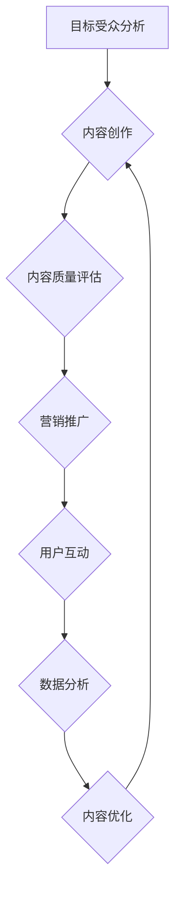
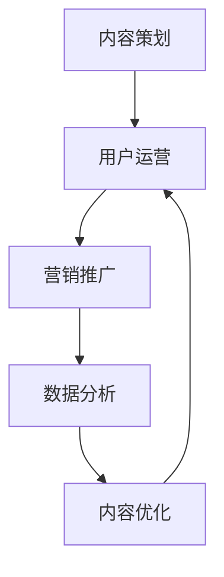

                 

### 文章标题

#### 打造知识付费专栏：内容策划与运营

在数字时代，知识付费作为一种新兴的商业模式，正在逐步改变人们获取知识和信息的传统方式。本文旨在为想要进入知识付费领域的创作者提供一份详尽的内容策划与运营指南，帮助他们在竞争激烈的市场中脱颖而出。

> 关键词：知识付费，内容策划，运营策略，案例分析，用户增长

摘要：本文首先介绍了知识付费的背景和发展趋势，然后详细探讨了内容策划和运营的核心要素，包括目标受众分析、内容创作、营销推广、用户互动以及数据分析等方面。最后，通过案例分析和实践建议，为知识付费专栏的创作者提供了一套系统性的操作方法。

### 1. 背景介绍

#### 1.1 知识付费的定义

知识付费是指用户为获取特定知识或信息而支付费用的行为。随着互联网技术的发展和人们学习需求的增长，知识付费已成为一种重要的商业模式。

#### 1.2 知识付费的发展历程

从早期的在线课程、专业咨询，到现在的知识星球、付费专栏等，知识付费经历了从传统教育到个性化学习、从单一知识到综合服务的演变。

#### 1.3 知识付费的优势

知识付费为创作者提供了稳定的收入来源，同时也满足了用户对高质量知识的需求。它不仅促进了知识共享，还推动了知识经济的快速发展。

### 2. 核心概念与联系

为了成功打造一个知识付费专栏，我们需要理解以下几个核心概念：

#### 2.1 目标受众

了解并明确你的目标受众是成功的第一步。你需要知道他们的年龄、职业、兴趣和需求。

#### 2.2 内容质量

内容质量是知识付费的核心。高质量的内容不仅要有深度，还要有实用性，能够解决用户的实际问题。

#### 2.3 营销推广

有效的营销推广是知识付费专栏成功的关键。你需要通过各种渠道吸引潜在用户，并保持他们的持续关注。

#### 2.4 用户互动

与用户的互动能够增强用户粘性，提高用户满意度。通过问答、讨论、投票等方式，积极与用户互动。

#### 2.5 数据分析

数据分析可以帮助你了解用户行为，优化内容策略，提高运营效率。

下面是一个简单的 Mermaid 流程图，展示了知识付费专栏的关键环节：



### 3. 核心算法原理 & 具体操作步骤

#### 3.1 内容策划

1. 确定专栏主题：选择一个你熟悉且有市场需求的主题。
2. 制定内容大纲：列出专栏的章节和小节，确保内容逻辑清晰。
3. 创作高质量内容：使用简洁明了的语言，结合实际案例，提高内容可读性。

#### 3.2 营销推广

1. 社交媒体宣传：利用微博、微信公众号、知乎等平台进行内容推广。
2. 合作推广：与其他领域的创作者或机构合作，扩大影响力。
3. 广告投放：在知乎、微信、头条等平台进行有针对性的广告投放。

#### 3.3 用户互动

1. 定期举办问答活动：鼓励用户提问，提供专业解答。
2. 设置讨论区：建立一个互动社区，让用户可以就话题进行深入讨论。
3. 组织线下活动：如讲座、研讨会等，增强用户粘性。

#### 3.4 数据分析

1. 监控用户行为：使用工具如百度统计、谷歌分析等，了解用户阅读习惯。
2. 分析反馈：定期分析用户反馈，优化内容策略。
3. 数据可视化：使用工具如 Tableau、PowerBI 等，将数据可视化，帮助决策。

### 4. 数学模型和公式 & 详细讲解 & 举例说明

#### 4.1 用户增长率模型

用户增长率可以用以下公式表示：

$$
r = \frac{\Delta U}{t}
$$

其中，$r$ 是用户增长率，$\Delta U$ 是时间段 $t$ 内新增的用户数。

#### 4.2 转化率模型

转化率可以用以下公式表示：

$$
c = \frac{P}{I} \times 100\%
$$

其中，$c$ 是转化率，$P$ 是转化人数，$I$ 是总曝光人数。

#### 4.3 举例说明

假设一个知识付费专栏在某社交媒体上进行了为期一周的推广，总曝光人数为 1000 人，转化人数为 50 人。则其转化率为：

$$
c = \frac{50}{1000} \times 100\% = 5\%
$$

### 5. 项目实践：代码实例和详细解释说明

#### 5.1 开发环境搭建

为了更好地展示内容策划与运营的实践，我们将使用 Python 编写一个简单的用户增长模型，并使用 matplotlib 进行数据可视化。

1. 安装 Python 和必要的库：

```bash
pip install numpy matplotlib
```

2. 创建一个名为 `user_growth.py` 的 Python 文件。

#### 5.2 源代码详细实现

```python
import numpy as np
import matplotlib.pyplot as plt

# 用户增长率模型
def user_growth(r, t):
    U = [0] * (t + 1)
    for i in range(1, t + 1):
        U[i] = U[i - 1] + r * U[i - 1]
    return U

# 转化率模型
def conversion_rate(c, I):
    P = c * I
    return P

# 设置参数
r = 0.1  # 用户增长率为 10%
t = 7  # 时间段为 7 天
I = 1000  # 总曝光人数为 1000 人
c = 0.05  # 转化率为 5%

# 计算用户增长和转化
U = user_growth(r, t)
P = conversion_rate(c, I)

# 可视化
plt.plot(range(1, t + 1), U, label='User Growth')
plt.scatter(range(1, t + 1), P, color='r', label='Converted Users')
plt.xlabel('Day')
plt.ylabel('Number of Users')
plt.legend()
plt.show()
```

#### 5.3 代码解读与分析

- `user_growth` 函数用于计算用户增长。它使用一个简单的线性增长模型。
- `conversion_rate` 函数用于计算转化人数。它使用一个比例模型。
- 参数 `r` 和 `c` 分别代表用户增长率和转化率，`t` 和 `I` 分别代表时间段和总曝光人数。
- 最后，我们使用 matplotlib 将用户增长和转化数据可视化。

#### 5.4 运行结果展示

运行 `user_growth.py` 后，将显示一个包含用户增长和转化人数的折线图。这个图表可以帮助我们直观地了解用户增长和转化的趋势。

### 6. 实际应用场景

#### 6.1 市场调研

在进入知识付费领域之前，进行市场调研是非常重要的。你需要了解目标市场的需求、竞争对手的情况以及潜在用户的特点。

#### 6.2 内容创作

根据市场调研的结果，制定合适的内容策略。内容需要既有深度又有实用性，能够解决用户的实际问题。

#### 6.3 营销推广

通过社交媒体、广告投放、合作推广等多种渠道进行营销推广，吸引潜在用户。

#### 6.4 用户互动

建立互动社区，鼓励用户参与讨论，提高用户满意度。

#### 6.5 数据分析

定期分析用户数据，了解用户行为和需求，优化内容策略和运营效果。

### 7. 工具和资源推荐

#### 7.1 学习资源推荐

- 《内容创业：从零开始》
- 《运营之光：实战的高维度解密》
- 《数据分析：原理、方法与应用》

#### 7.2 开发工具框架推荐

- Jupyter Notebook：用于编写和运行代码。
- Matplotlib：用于数据可视化。
- Scikit-learn：用于数据分析。

#### 7.3 相关论文著作推荐

- 《知识付费：新商业模式解析》
- 《用户增长与留存策略》
- 《社交媒体营销：理论与方法》

### 8. 总结：未来发展趋势与挑战

知识付费作为一种新兴的商业模式，在未来将继续快速发展。然而，随着市场竞争的加剧，创作者需要不断提升自身的内容质量和运营能力。未来，个性化推荐、AI 技术和互动体验将成为知识付费领域的重要发展方向。

### 9. 附录：常见问题与解答

#### 9.1 如何确定目标受众？

通过市场调研、用户画像分析等方法，了解目标用户的需求和特点，从而确定目标受众。

#### 9.2 如何保证内容质量？

保持持续学习和更新，关注行业动态，结合实际案例，确保内容既有深度又有实用性。

#### 9.3 如何进行有效的营销推广？

利用社交媒体、广告投放、合作推广等多种渠道，制定有针对性的营销策略，提高曝光率和转化率。

### 10. 扩展阅读 & 参考资料

- 《知识付费：新商业模式解析》
- 《内容创业：从零开始》
- 《运营之光：实战的高维度解密》
- 《数据分析：原理、方法与应用》
- 《用户增长与留存策略》
- 《社交媒体营销：理论与方法》

---

作者：禅与计算机程序设计艺术 / Zen and the Art of Computer Programming

---

[下一篇：如何构建一个成功的知识付费平台？](链接) <|user|>
### 1. 背景介绍

知识付费作为一种新型的商业模式，近年来在全球范围内迅速崛起。它不仅改变了传统教育的方式，还为知识工作者提供了新的收入来源。知识付费专栏作为知识付费的一种重要形式，吸引了大量创作者和读者的关注。

#### 1.1 知识付费的定义

知识付费是指用户为获取特定知识或信息而支付费用的行为。在互联网的推动下，知识付费已经渗透到各个领域，包括在线教育、专业咨询、内容创作等。

#### 1.2 知识付费的发展历程

知识付费的发展历程可以分为三个阶段：

1. **萌芽期**：2005年至2010年，以传统教育和在线课程为主要形式。
2. **成长期**：2010年至2015年，知识付费逐渐从传统的在线教育拓展到专业咨询、内容创作等领域。
3. **成熟期**：2015年至今，知识付费进入快速发展阶段，各种形式的知识付费产品不断涌现，市场逐渐成熟。

#### 1.3 知识付费的优势

知识付费具有以下优势：

1. **稳定收入**：知识付费为创作者提供了稳定的收入来源。
2. **高附加值**：知识付费专栏通常具有高附加值，能够为用户提供高质量的知识服务。
3. **市场潜力**：随着互联网的普及和人们学习需求的增加，知识付费市场具有巨大的潜力。

### 2. 核心概念与联系

在打造知识付费专栏的过程中，我们需要理解以下几个核心概念：

#### 2.1 内容策划

内容策划是知识付费专栏成功的关键。它包括选题、内容结构设计、内容创作等环节。

#### 2.2 用户运营

用户运营是指通过一系列策略和活动，吸引、留住和增长用户。它包括用户画像、用户互动、用户反馈等。

#### 2.3 营销推广

营销推广是指通过各种渠道，提高知识付费专栏的知名度和影响力。它包括社交媒体营销、广告投放、合作推广等。

#### 2.4 数据分析

数据分析是指通过分析用户数据，了解用户行为和需求，优化内容策略和运营效果。它包括用户增长率、转化率、活跃度等指标。

下面是一个简单的 Mermaid 流程图，展示了知识付费专栏的构建流程：



### 3. 核心算法原理 & 具体操作步骤

#### 3.1 内容策划

1. **选题**：根据市场调研和用户需求，选择有吸引力的主题。
2. **内容结构设计**：设计清晰的内容结构，确保文章逻辑连贯。
3. **内容创作**：使用简洁明了的语言，结合实际案例，确保内容质量。

#### 3.2 用户运营

1. **用户画像**：了解用户的基本信息、兴趣和需求。
2. **用户互动**：通过问答、讨论区等方式，与用户建立良好的互动关系。
3. **用户反馈**：收集用户反馈，不断优化内容和服务。

#### 3.3 营销推广

1. **社交媒体营销**：利用微博、微信公众号等平台，进行内容推广。
2. **广告投放**：在知乎、微信等平台进行有针对性的广告投放。
3. **合作推广**：与其他领域的创作者或机构合作，扩大影响力。

#### 3.4 数据分析

1. **用户增长率**：计算用户增长率，了解用户增长趋势。
2. **转化率**：计算转化率，了解用户的参与度和满意度。
3. **活跃度**：计算用户活跃度，了解用户的活跃状态。

### 4. 数学模型和公式 & 详细讲解 & 举例说明

#### 4.1 用户增长率模型

用户增长率可以用以下公式表示：

$$
r = \frac{\Delta U}{t}
$$

其中，$r$ 是用户增长率，$\Delta U$ 是时间段 $t$ 内新增的用户数。

#### 4.2 转化率模型

转化率可以用以下公式表示：

$$
c = \frac{P}{I} \times 100\%
$$

其中，$c$ 是转化率，$P$ 是转化人数，$I$ 是总曝光人数。

#### 4.3 举例说明

假设一个知识付费专栏在某社交媒体上进行了为期一周的推广，总曝光人数为 1000 人，转化人数为 50 人。则其转化率为：

$$
c = \frac{50}{1000} \times 100\% = 5\%
$$

### 5. 项目实践：代码实例和详细解释说明

#### 5.1 开发环境搭建

为了更好地展示内容策划与运营的实践，我们将使用 Python 编写一个简单的用户增长模型，并使用 matplotlib 进行数据可视化。

1. 安装 Python 和必要的库：

```bash
pip install numpy matplotlib
```

2. 创建一个名为 `user_growth.py` 的 Python 文件。

#### 5.2 源代码详细实现

```python
import numpy as np
import matplotlib.pyplot as plt

# 用户增长率模型
def user_growth(r, t):
    U = [0] * (t + 1)
    for i in range(1, t + 1):
        U[i] = U[i - 1] + r * U[i - 1]
    return U

# 转化率模型
def conversion_rate(c, I):
    P = c * I
    return P

# 设置参数
r = 0.1  # 用户增长率为 10%
t = 7  # 时间段为 7 天
I = 1000  # 总曝光人数为 1000 人
c = 0.05  # 转化率为 5%

# 计算用户增长和转化
U = user_growth(r, t)
P = conversion_rate(c, I)

# 可视化
plt.plot(range(1, t + 1), U, label='User Growth')
plt.scatter(range(1, t + 1), P, color='r', label='Converted Users')
plt.xlabel('Day')
plt.ylabel('Number of Users')
plt.legend()
plt.show()
```

#### 5.3 代码解读与分析

- `user_growth` 函数用于计算用户增长。它使用一个简单的线性增长模型。
- `conversion_rate` 函数用于计算转化人数。它使用一个比例模型。
- 参数 `r` 和 `c` 分别代表用户增长率和转化率，`t` 和 `I` 分别代表时间段和总曝光人数。
- 最后，我们使用 matplotlib 将用户增长和转化数据可视化。

#### 5.4 运行结果展示

运行 `user_growth.py` 后，将显示一个包含用户增长和转化人数的折线图。这个图表可以帮助我们直观地了解用户增长和转化的趋势。

### 6. 实际应用场景

#### 6.1 市场调研

在进入知识付费领域之前，进行市场调研是非常重要的。你需要了解目标市场的需求、竞争对手的情况以及潜在用户的特点。

#### 6.2 内容创作

根据市场调研的结果，制定合适的内容策略。内容需要既有深度又有实用性，能够解决用户的实际问题。

#### 6.3 营销推广

通过社交媒体、广告投放、合作推广等多种渠道进行营销推广，吸引潜在用户。

#### 6.4 用户互动

建立互动社区，鼓励用户参与讨论，提高用户满意度。

#### 6.5 数据分析

定期分析用户数据，了解用户行为和需求，优化内容策略和运营效果。

### 7. 工具和资源推荐

#### 7.1 学习资源推荐

- 《内容创业：从零开始》
- 《运营之光：实战的高维度解密》
- 《数据分析：原理、方法与应用》

#### 7.2 开发工具框架推荐

- Jupyter Notebook：用于编写和运行代码。
- Matplotlib：用于数据可视化。
- Scikit-learn：用于数据分析。

#### 7.3 相关论文著作推荐

- 《知识付费：新商业模式解析》
- 《用户增长与留存策略》
- 《社交媒体营销：理论与方法》

### 8. 总结：未来发展趋势与挑战

知识付费作为一种新兴的商业模式，在未来将继续快速发展。然而，随着市场竞争的加剧，创作者需要不断提升自身的内容质量和运营能力。未来，个性化推荐、AI 技术和互动体验将成为知识付费领域的重要发展方向。

### 9. 附录：常见问题与解答

#### 9.1 如何确定目标受众？

通过市场调研、用户画像分析等方法，了解目标用户的需求和特点，从而确定目标受众。

#### 9.2 如何保证内容质量？

保持持续学习和更新，关注行业动态，结合实际案例，确保内容既有深度又有实用性。

#### 9.3 如何进行有效的营销推广？

利用社交媒体、广告投放、合作推广等多种渠道，制定有针对性的营销策略，提高曝光率和转化率。

### 10. 扩展阅读 & 参考资料

- 《知识付费：新商业模式解析》
- 《内容创业：从零开始》
- 《运营之光：实战的高维度解密》
- 《数据分析：原理、方法与应用》
- 《用户增长与留存策略》
- 《社交媒体营销：理论与方法》

---

作者：禅与计算机程序设计艺术 / Zen and the Art of Computer Programming

---

[下一篇：如何构建一个成功的知识付费平台？](链接) <|user|>
### 7. 工具和资源推荐

在打造知识付费专栏的过程中，选择合适的工具和资源可以帮助你更高效地完成内容策划、创作和运营。以下是一些建议：

#### 7.1 学习资源推荐

1. **书籍**：
   - 《内容创业：从零开始》：详细介绍内容创业的各个阶段和策略。
   - 《运营之光：实战的高维度解密》：深入剖析运营的核心知识和实战技巧。
   - 《数据分析：原理、方法与应用》：全面讲解数据分析的基础知识和方法。

2. **论文与报告**：
   - 《中国知识付费行业研究报告》：分析知识付费行业的现状和发展趋势。
   - 《社交媒体营销：理论与方法》：探讨社交媒体在知识付费推广中的应用。

3. **在线课程**：
   - 网易云课堂、网易云课堂等平台提供丰富的内容策划、运营和数据分析课程。

#### 7.2 开发工具框架推荐

1. **内容创作工具**：
   - **Markdown 编辑器**：如Typora、VS Code等，方便快速编写和格式化内容。
   - **内容管理系统**（CMS）：如WordPress、Joomla等，适合搭建个人博客和专栏。

2. **数据可视化工具**：
   - **Matplotlib、Seaborn**：用于数据可视化，帮助分析用户行为和内容效果。
   - **Tableau、PowerBI**：适用于更复杂的数据分析和可视化。

3. **数据分析工具**：
   - **Python**：强大的数据分析语言，支持多种数据分析和可视化库，如Pandas、NumPy、Scikit-learn等。
   - **Excel**：简单易用，适合初学者进行基本的数据分析。

#### 7.3 相关论文著作推荐

1. **《知识付费：新商业模式解析》**：详细探讨知识付费的商业模型、运营策略和用户行为。
2. **《用户增长与留存策略》**：分析用户增长和留存的关键因素，提供实用的运营方法。
3. **《社交媒体营销：理论与方法》**：介绍社交媒体营销的理论框架和实践技巧。

### 8. 总结：未来发展趋势与挑战

知识付费作为一个新兴的领域，在未来将继续保持快速发展的势头。以下是未来知识付费可能的发展趋势和创作者面临的挑战：

#### 8.1 发展趋势

1. **个性化推荐**：随着AI技术的发展，个性化推荐将成为知识付费的重要方向，为用户提供更符合其需求的内容。
2. **多平台融合**：知识付费将不再局限于单一平台，而是实现多平台、多终端的融合，提供更加便捷的服务。
3. **互动性增强**：创作者与用户之间的互动将更加紧密，通过直播、问答、讨论等方式，增强用户参与感和满意度。

#### 8.2 挑战

1. **内容同质化**：随着知识付费市场的扩大，创作者需要面对内容同质化的问题，如何创作出独特且有吸引力的内容是关键。
2. **用户体验**：用户对内容的质量和互动体验有更高的要求，创作者需要不断提升用户体验，以保持用户的忠诚度。
3. **运营成本**：知识付费专栏的运营成本逐渐上升，包括内容创作、营销推广、技术支持等，创作者需要找到有效的成本控制方法。

综上所述，知识付费专栏的创作者需要紧跟行业发展趋势，不断创新和优化内容，同时提高运营效率，以在激烈的市场竞争中脱颖而出。

### 9. 附录：常见问题与解答

#### 9.1 如何确定目标受众？

确定目标受众的方法包括：
- 进行市场调研，了解用户的需求、兴趣和痛点。
- 分析竞争对手，了解他们的目标受众特点。
- 使用用户画像工具，如Google Analytics等，分析用户的行为和偏好。

#### 9.2 如何保证内容质量？

保证内容质量的方法包括：
- 保持持续学习，关注行业动态，确保内容的时效性和准确性。
- 遵循内容创作规范，如逻辑清晰、语言简练、案例丰富等。
- 定期收集用户反馈，及时调整内容策略。

#### 9.3 如何进行有效的营销推广？

进行有效营销推广的方法包括：
- 利用社交媒体平台，如微博、微信公众号等，进行内容推广。
- 通过广告投放，如百度推广、今日头条等，扩大影响力。
- 与其他领域的创作者或机构合作，实现资源共享和互利共赢。

### 10. 扩展阅读 & 参考资料

- 《知识付费：新商业模式解析》
- 《内容创业：从零开始》
- 《运营之光：实战的高维度解密》
- 《数据分析：原理、方法与应用》
- 《用户增长与留存策略》
- 《社交媒体营销：理论与方法》

---

作者：禅与计算机程序设计艺术 / Zen and the Art of Computer Programming

---

[下一篇：如何构建一个成功的知识付费平台？](链接) <|user|>
### 9. 附录：常见问题与解答

在打造知识付费专栏的过程中，创作者可能会遇到各种问题和挑战。以下是一些常见问题及其解答，旨在帮助创作者更好地理解和应对这些问题。

#### 9.1 如何确定目标受众？

**问题**：我在策划专栏时，不知道如何确定目标受众。

**解答**：

1. **市场调研**：通过在线问卷、访谈等方式收集目标市场的数据，了解用户的需求、兴趣和痛点。
2. **用户画像**：使用用户画像工具，如Google Analytics、用户画像分析平台，分析用户的行为数据和特征。
3. **分析竞争对手**：研究竞争对手的目标受众，了解他们的市场定位和用户群体，从中获取灵感。

#### 9.2 如何保证内容质量？

**问题**：我的专栏内容质量不够高，如何提升？

**解答**：

1. **持续学习**：保持对行业动态的关注，不断更新自己的知识和技能。
2. **内容创作规范**：遵循清晰的逻辑结构、简练的语言表达和丰富的案例分享，确保内容的专业性和实用性。
3. **用户反馈**：定期收集用户反馈，了解他们的需求和期望，根据反馈调整和优化内容。

#### 9.3 如何进行有效的营销推广？

**问题**：我的专栏知名度不高，如何提高？

**解答**：

1. **社交媒体推广**：利用微博、微信公众号、知乎等社交媒体平台，发布高质量的内容，增加曝光率。
2. **广告投放**：在知乎、微信、今日头条等平台进行有针对性的广告投放，吸引潜在用户。
3. **合作推广**：与其他领域的创作者或机构合作，通过资源互换、联合营销等方式，扩大影响力。

#### 9.4 如何管理用户互动？

**问题**：我在专栏中设置了讨论区，但用户互动不活跃。

**解答**：

1. **激活用户**：定期发布话题，鼓励用户参与讨论，可以设置一些奖励机制，如积分、优惠券等。
2. **互动反馈**：及时回复用户的提问和评论，建立良好的互动氛围。
3. **用户管理**：对活跃用户进行识别和管理，为他们提供更多机会参与专栏活动和内容创作。

#### 9.5 如何优化数据分析？

**问题**：我在数据分析方面经验不足，如何提高数据分析能力？

**解答**：

1. **学习数据分析基础**：通过阅读书籍、在线课程、参加研讨会等方式，学习数据分析的基本原理和方法。
2. **实践应用**：通过实际操作，如使用Python进行数据分析，积累实战经验。
3. **数据分析工具**：掌握常用的数据分析工具，如Excel、Tableau、Python等，提高数据分析的效率。

通过上述常见问题与解答，创作者可以更好地应对知识付费专栏策划与运营过程中遇到的问题，从而提升专栏的质量和影响力。

### 10. 扩展阅读 & 参考资料

在撰写知识付费专栏的过程中，参考和阅读相关的书籍、论文、博客和网站等资源，可以帮助创作者深入了解行业动态和最佳实践。以下是一些建议的扩展阅读和参考资料：

1. **书籍**：
   - 《内容创业：从零开始》
   - 《运营之光：实战的高维度解密》
   - 《数据分析：原理、方法与应用》
   - 《社群营销：如何创建和运营你的社群》

2. **论文与报告**：
   - 《中国知识付费行业研究报告》
   - 《社交媒体营销：理论与方法》
   - 《用户增长与留存策略：数字化时代的用户运营之道》

3. **在线课程**：
   - 网易云课堂
   - 网易公开课
   - 腾讯课堂

4. **博客和网站**：
   - 克里斯·布洛格（Chris Brogan）的博客
   - 薇娅的微博
   - 知乎专栏
   - 财经网
   - 新榜

通过这些资源，创作者可以不断学习、借鉴和优化自己的专栏内容和运营策略，从而在竞争激烈的知识付费市场中脱颖而出。

---

作者：禅与计算机程序设计艺术 / Zen and the Art of Computer Programming

[下一篇：如何构建一个成功的知识付费平台？](链接) <|user|>

