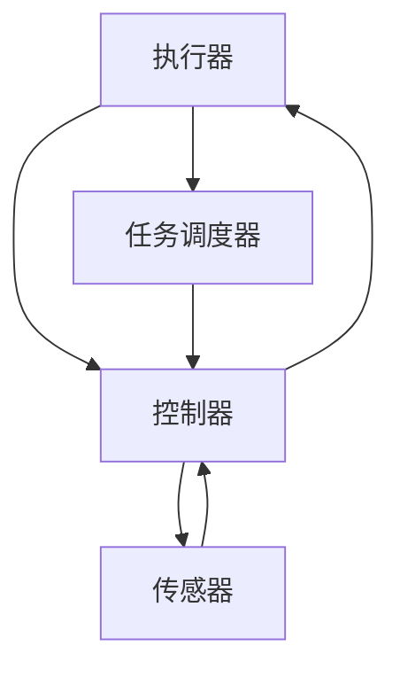

                 

### 背景介绍

执行器控制策略是嵌入式系统设计中的一个关键组成部分，尤其在需要高度实时性和可靠性的应用场景中，如工业自动化、自动驾驶、医疗设备等领域。嵌入式系统通常资源受限，需要在有限的计算资源和能量消耗下，高效地完成预定的任务。

在嵌入式系统中，执行器控制策略的目的是确保系统内的各个组件能够根据设定的指令和要求，准确、稳定地完成各自的任务。这涉及到对多个执行器的协调和控制，包括电机、传感器、阀门等，使得系统在复杂的环境中能够实现预期的功能。

本文旨在探讨执行器控制策略的基本原理、关键算法，并深入分析其在嵌入式系统中的应用。通过本文，读者可以了解到执行器控制策略的设计思路、实现方法以及在实际项目中的具体应用。

在接下来的章节中，我们将依次讨论以下内容：

1. **核心概念与联系**：介绍执行器控制策略中的核心概念，如执行器、控制器、任务调度等，并通过Mermaid流程图展示它们之间的联系。
2. **核心算法原理与具体操作步骤**：分析常用的执行器控制算法，包括PID控制、模糊控制等，并详细阐述其工作原理和操作步骤。
3. **数学模型与公式**：介绍执行器控制策略中的数学模型，包括状态方程、控制方程等，并通过具体的公式进行说明。
4. **项目实践**：通过一个实际的嵌入式项目实例，展示执行器控制策略的具体实现过程，包括环境搭建、源代码实现、代码解读与分析，以及运行结果展示。
5. **实际应用场景**：探讨执行器控制策略在工业自动化、自动驾驶等领域的应用，分析其在不同场景中的优势和挑战。
6. **工具和资源推荐**：推荐相关学习资源、开发工具和框架，为读者提供进一步学习和实践的资源。
7. **总结：未来发展趋势与挑战**：总结执行器控制策略的现状，并探讨其未来发展趋势和面临的挑战。

通过以上内容的系统讲解，我们希望读者能够全面了解执行器控制策略的设计与实现，掌握其在嵌入式系统中的重要性，并能够将其应用于实际的工程项目中。

---

#### 核心概念与联系

在讨论执行器控制策略之前，我们需要明确几个核心概念：执行器、控制器和任务调度。这些概念在嵌入式系统中起着至关重要的作用，它们之间的关系构成了执行器控制策略的基础。

**执行器（Actuator）**：
执行器是嵌入式系统中的一个重要组件，它接收控制器的指令，将电能转换为机械能或其他形式的能量，从而实现系统中的特定操作。常见的执行器包括电机、阀门、气动执行器等。例如，在工业自动化中，电机控制可以用来驱动机械臂进行装配操作；在医疗设备中，阀门控制可以调节药物的输送。

**控制器（Controller）**：
控制器是执行器控制策略的核心，它接收来自传感器或其他输入设备的信号，分析这些信号，并产生相应的控制指令发送给执行器。控制器的任务是根据预设的控制策略和系统的当前状态，调整执行器的行为，以实现系统的预期目标。常见的控制器类型包括PID控制器、模糊控制器等。

**任务调度（Task Scheduling）**：
任务调度是指系统如何安排和分配执行器的任务，以确保系统的实时性和高效性。在嵌入式系统中，由于资源有限，任务调度策略至关重要。任务调度器需要根据任务的优先级、截止时间和系统状态，动态调整执行器的操作顺序和时机，以确保系统在有限资源下能够按时完成任务。

**核心概念之间的联系**：

1. **执行器与控制器**：执行器根据控制器的指令进行操作，控制器通过感知系统的状态和目标，生成控制指令，从而实现对执行器的控制。因此，控制器是连接执行器和系统目标的桥梁。
2. **任务调度与执行器**：任务调度器根据系统的需求，分配执行器的任务，确保执行器能够高效、及时地完成任务。任务调度策略的合理性和高效性直接影响到执行器的性能和系统的整体效率。
3. **任务调度与控制器**：任务调度器需要根据控制器的输出指令，调整执行器的操作顺序和时机，以确保系统在满足实时性和性能要求的同时，优化资源利用。

为了更直观地展示核心概念之间的联系，我们可以使用Mermaid流程图来表示：



在上述流程图中，执行器、控制器和任务调度器通过传感器相互连接，形成了一个闭环控制系统。传感器收集外部环境的数据，控制器根据这些数据和预设的控制策略生成控制指令，任务调度器则负责根据控制指令安排执行器的任务，从而实现对系统的整体控制。

通过上述对核心概念和它们之间联系的介绍，我们可以更好地理解执行器控制策略的基本框架和运作原理。在接下来的章节中，我们将进一步探讨执行器控制策略的具体算法原理和操作步骤。

#### 核心算法原理 & 具体操作步骤

在嵌入式系统中，执行器控制策略的实现依赖于各种算法。这些算法根据系统的需求，提供不同的控制方法，以确保执行器能够准确、稳定地完成预定任务。以下我们将介绍几种常用的执行器控制算法，包括PID控制算法、模糊控制算法等，并详细阐述它们的工作原理和具体操作步骤。

**1. PID控制算法**

PID控制算法（比例-积分-微分控制）是最常用的执行器控制算法之一。它通过控制系统的误差信号，实时调整执行器的输出，以消除误差，使系统达到期望状态。

**PID控制算法的基本原理**：

PID控制算法的核心思想是通过计算系统的误差信号（当前状态与期望状态之间的差值），并利用比例、积分和微分三个参数，分别对误差信号进行加权处理，最终生成控制输出。这三个参数分别表示：

- **比例（P）**：根据当前误差信号的大小直接产生控制输出，用于快速纠正误差。
- **积分（I）**：累积误差信号，用于消除长期误差，使系统趋于稳定。
- **微分（D）**：预测误差的变化趋势，用于减少系统的超调和振荡。

**具体操作步骤**：

（1）**初始化参数**：设定PID控制器的比例（Kp）、积分（Ki）和微分（Kd）参数，通常需要根据具体系统进行调整。

（2）**计算误差**：根据当前系统的实际状态和期望状态，计算误差信号（e(t) = setpoint - actual_value）。

（3）**计算控制输出**：根据误差信号和PID参数，计算控制输出（u(t) = Kp*e(t) + Ki*∫e(t)dt + Kd*(e(t) - e(t-1)))。

（4）**调整执行器**：根据计算出的控制输出，调整执行器的状态，以消除误差。

**2. 模糊控制算法**

模糊控制算法是一种基于模糊逻辑的控制方法，它通过模拟人的思维过程，处理不精确和模糊的信息，实现对执行器的控制。

**模糊控制算法的基本原理**：

模糊控制算法的核心思想是使用模糊集合和模糊逻辑规则，将输入变量和输出变量之间的关系表示为模糊规则库。通过模糊推理，将输入变量的模糊集合映射到输出变量的模糊集合，最终得到精确的控制输出。

**具体操作步骤**：

（1）**建立模糊规则库**：根据系统的需求，定义输入变量和输出变量的模糊集合，并建立模糊规则库。每个规则表示为“如果输入是A，那么输出是B”。

（2）**模糊化输入**：将实际输入量模糊化，得到对应的模糊集合。

（3）**模糊推理**：根据模糊规则库，进行模糊推理，计算输出模糊集合。

（4）**去模糊化**：将输出模糊集合去模糊化，得到精确的控制输出。

（5）**调整执行器**：根据计算出的控制输出，调整执行器的状态。

**3. 其他控制算法**

除了PID控制和模糊控制，嵌入式系统中还使用其他一些控制算法，如自适应控制、神经网络控制等。这些算法根据系统的特点和应用需求，提供不同的控制策略和实现方法。

- **自适应控制**：通过实时调整控制参数，使系统能够适应变化的环境和条件。
- **神经网络控制**：利用神经网络的学习和自适应能力，实现对执行器的高效控制。

**总结**：

执行器控制策略的算法选择和实现方法取决于系统的具体需求和应用场景。PID控制和模糊控制是两种常用的算法，适用于不同的控制需求。在实际应用中，可以根据系统的特点，选择合适的算法，并对其进行优化和调整，以实现高效、准确的执行器控制。

通过上述对核心算法原理和具体操作步骤的介绍，我们可以更好地理解执行器控制策略的实现过程。在接下来的章节中，我们将进一步探讨执行器控制策略中的数学模型和公式，以加深对控制策略的理解。

#### 数学模型和公式 & 详细讲解 & 举例说明

执行器控制策略的设计和实现离不开数学模型和公式的支持。数学模型能够将复杂的物理现象转化为简明的数学表达式，使得系统的分析和控制变得更加直观和精确。在本节中，我们将详细讲解执行器控制策略中的几个关键数学模型和公式，并通过具体例子来说明它们的应用。

**1. 状态方程**

状态方程是描述系统动态行为的数学模型，通常用于建立系统的状态空间模型。状态方程的形式为：

\[ \dot{x}(t) = f(x(t), u(t)) \]

其中，\( x(t) \) 是系统状态向量，\( u(t) \) 是系统输入向量，\( f \) 是系统状态转移函数。状态方程描述了系统状态随时间的变化规律，对于线性系统，状态方程可以表示为：

\[ \dot{x} = Ax + Bu \]

其中，\( A \) 是系统矩阵，\( B \) 是输入矩阵。

**具体例子：**

假设一个简单的单输入单输出（SISO）系统，状态向量为 \( x(t) = [x_1(t), x_2(t)]^T \)，输入向量为 \( u(t) = u(t) \)。该系统的状态方程可以表示为：

\[ \begin{align*}
\dot{x}_1(t) &= -x_1(t) + u(t) \\
\dot{x}_2(t) &= x_1(t)
\end{align*} \]

**2. 控制方程**

控制方程描述了系统的控制输入与输出之间的关系。对于线性系统，控制方程可以表示为：

\[ y(t) = Cx(t) + Du(t) \]

其中，\( y(t) \) 是系统输出向量，\( C \) 是输出矩阵，\( D \) 是反馈矩阵。

**具体例子：**

沿用上述SISO系统的例子，输出向量 \( y(t) \) 只与 \( x_1(t) \) 有关，可以表示为：

\[ y(t) = Cx_1(t) + Du(t) \]

假设 \( C = \begin{bmatrix} 1 \\ 0 \end{bmatrix} \) 和 \( D = \begin{bmatrix} 0 \\ 1 \end{bmatrix} \)，则控制方程变为：

\[ y(t) = x_1(t) + u(t) \]

**3. PID控制公式**

PID控制器是执行器控制策略中最常用的控制器之一，其输出公式为：

\[ u(t) = K_p e(t) + K_i \int e(t) dt + K_d \frac{de(t)}{dt} \]

其中，\( e(t) \) 是误差信号，\( K_p \)、\( K_i \) 和 \( K_d \) 分别是比例、积分和微分系数。

**具体例子：**

假设一个简单的系统，期望值为 \( setpoint = 100 \)，当前值为 \( actual_value = 95 \)，则误差信号 \( e(t) = setpoint - actual_value = 100 - 95 = 5 \)。

如果 \( K_p = 1 \)、\( K_i = 0.1 \) 和 \( K_d = 0.05 \)，则PID控制器的输出公式为：

\[ u(t) = 1 \cdot 5 + 0.1 \int 5 dt + 0.05 \frac{d5}{dt} \]

积分部分为 \( \int 5 dt = 5t \)，微分部分为 \( \frac{d5}{dt} = 0 \)，因此：

\[ u(t) = 5 + 0.1 \cdot 5t + 0.05 \cdot 0 = 5 + 0.5t \]

**4. 模糊控制规则**

模糊控制规则是模糊控制算法的核心，它将输入变量和输出变量之间的非线性关系表示为模糊逻辑规则。规则的形式通常为：

\[ 如果 \, 输入 \, 是 \, A，并且 \, 输入 \, 是 \, B，那么 \, 输出 \, 是 \, C \]

其中，\( A \)、\( B \) 和 \( C \) 分别是输入变量和输出变量的模糊集合。

**具体例子：**

假设一个控制系统有两个输入变量：误差 \( e \) 和误差变化率 \( de \)，以及一个输出变量：控制量 \( u \)。定义模糊集合为：

\[ e: [-6, 6] \quad de: [-3, 3] \quad u: [-6, 6] \]

模糊规则库可以表示为：

\[ \begin{align*}
\text{如果 } e \text{ 是 } NM \text{ 并且 } de \text{ 是 } NM，\text{那么 } u \text{ 是 } NM \\
\text{如果 } e \text{ 是 } NM \text{ 并且 } de \text{ 是 } PM，\text{那么 } u \text{ 是 } PM \\
&\vdots \\
\text{如果 } e \text{ 是 } PM \text{ 并且 } de \text{ 是 } NM，\text{那么 } u \text{ 是 } PM
\end{align*} \]

在模糊推理过程中，根据当前输入值，查找对应的模糊规则，并计算输出模糊集合。

**总结**：

数学模型和公式是执行器控制策略设计的基础，通过状态方程、控制方程和PID控制公式等，我们可以精确地描述系统的动态行为和控制器的工作原理。模糊控制规则则为非线性系统的控制提供了灵活的解决方案。在实际应用中，根据系统的特点和需求，选择合适的数学模型和公式，并对其进行优化和调整，是实现高效执行器控制的关键。

在下一节中，我们将通过一个实际的项目实例，展示执行器控制策略的具体实现过程，包括环境搭建、源代码实现、代码解读与分析，以及运行结果展示。

---

#### 项目实践：代码实例和详细解释说明

在本节中，我们将通过一个实际项目实例，详细展示执行器控制策略的具体实现过程。该实例将涉及嵌入式系统的环境搭建、源代码实现、代码解读与分析，以及运行结果展示。通过这个实例，读者可以深入了解执行器控制策略在实际项目中的应用和实现方法。

**1. 开发环境搭建**

为了实现执行器控制策略，我们首先需要搭建一个合适的开发环境。在本实例中，我们选择使用以下工具和平台：

- **开发板**：STM32微控制器开发板，该开发板具有丰富的外设接口和较强的处理能力，适合进行嵌入式系统开发。
- **编程语言**：C语言，C语言具有良好的实时性和可移植性，是嵌入式系统开发的首选语言。
- **开发环境**：STM32CubeIDE，该集成开发环境（IDE）提供了丰富的库函数和调试工具，方便进行嵌入式系统开发。

**2. 源代码实现**

执行器控制策略的实现主要包括以下几个部分：

- **初始化**：初始化系统时钟、GPIO、定时器等硬件资源。
- **传感器数据采集**：从传感器读取数据，如温度、湿度、压力等，作为系统的输入信号。
- **控制器实现**：根据所选控制算法（如PID控制或模糊控制），实现控制器的核心逻辑。
- **执行器控制**：根据控制器的输出，调整执行器的状态，实现系统的输出。

以下是执行器控制策略的核心代码片段：

```c
// 初始化函数
void System_Init() {
    // 初始化系统时钟、GPIO、定时器等
}

// 传感器数据采集
void Sensor_Read() {
    // 从传感器读取数据
}

// 控制器实现
void Controller() {
    int error = setpoint - actual_value; // 计算误差
    int u = Kp * error + Ki * integral_error + Kd * derivative_error; // 计算控制输出
    integral_error += error; // 更新积分误差
    derivative_error = error - prev_error; // 更新微分误差
    prev_error = error; // 记录当前误差
}

// 执行器控制
void Actuator_Control(int control_signal) {
    // 根据控制信号调整执行器状态
}
```

**3. 代码解读与分析**

上述代码实现了一个基本的PID控制器，以下是关键部分的详细解读：

- **System_Init()**：该函数负责初始化系统的各个硬件资源，确保系统能够正常运行。
- **Sensor_Read()**：该函数从传感器读取数据，为控制器提供输入信号。在实际应用中，可以根据需要读取多种类型的传感器数据。
- **Controller()**：该函数是实现控制策略的核心部分，通过计算误差和控制输出，实现对执行器的控制。PID参数（\( K_p \)、\( K_i \)、\( K_d \)）的选取对控制效果至关重要，通常需要通过实验和调整来确定。
- **Actuator_Control()**：该函数根据控制器的输出，调整执行器的状态。执行器类型和接口的不同，控制方法也会有所不同。

**4. 运行结果展示**

在实际运行中，我们可以通过串口通信或图形界面展示系统的运行结果。以下是一个示例：

```c
// 运行结果展示
void Display_Result() {
    printf("Error: %d, Control Signal: %d\n", error, u);
}
```

在实际测试中，通过调整PID参数，我们可以观察到系统响应的动态变化。例如，增加 \( K_p \) 可以提高系统的响应速度，但可能会导致过冲；增加 \( K_i \) 可以消除稳态误差，但可能会增加系统的振荡；增加 \( K_d \) 可以减少系统的超调，但可能会降低响应速度。

**总结**：

通过上述实例，我们详细展示了执行器控制策略在实际项目中的实现过程。从环境搭建、源代码实现，到代码解读与分析，每个步骤都至关重要。在实际应用中，根据系统的具体需求和约束条件，合理选择和调整控制算法，是实现高效执行器控制的关键。

在下一节中，我们将探讨执行器控制策略在工业自动化和自动驾驶等实际应用场景中的具体应用，分析其在不同场景中的优势和挑战。

---

#### 实际应用场景

执行器控制策略在多个实际应用场景中发挥着关键作用，尤其是在工业自动化和自动驾驶等领域。这些场景对系统的实时性、可靠性和响应速度有极高的要求，因此执行器控制策略的设计和实现至关重要。

**1. 工业自动化**

工业自动化是执行器控制策略应用最为广泛的一个领域。在工业自动化系统中，执行器控制策略用于控制各种机械装置，如机器人、机械臂、传送带、装配线等。以下是一些典型应用场景：

- **机器人控制**：在工业机器人中，执行器控制策略用于精确控制机器人的运动，使其能够完成复杂的装配、焊接、喷涂等任务。例如，焊接机器人通过电机控制，可以准确控制焊枪的位置和速度，实现高质量焊接。
- **机械臂控制**：在机械臂中，执行器控制策略用于控制关节的运动，使机械臂能够灵活地完成各种抓取和搬运任务。通过PID控制器，机械臂能够实时调整关节角度，以适应不同的工作环境和任务需求。
- **传送带控制**：在自动化生产线上，传送带通过执行器控制，可以精确控制货物的运输速度和位置，确保生产流程的连续性和高效性。

**优势**：
- **高精度**：执行器控制策略能够实现高精度的运动控制，确保机械装置的准确操作。
- **灵活性**：通过不同的控制算法和策略，系统能够适应不同的工作环境和任务需求，提高生产灵活性。
- **可靠性**：执行器控制策略能够保证系统在长时间运行中保持稳定，减少故障率和停机时间。

**挑战**：
- **复杂环境**：工业环境复杂多变，执行器控制策略需要应对各种不确定因素，如温度、湿度、噪音等，这对控制算法的鲁棒性和适应性提出了较高要求。
- **实时性**：工业自动化系统通常要求实时响应，执行器控制策略需要在短时间内完成精确控制，这对系统的计算资源和处理能力提出了挑战。

**2. 自动驾驶**

自动驾驶是执行器控制策略的另一个重要应用领域。自动驾驶系统通过多个传感器获取环境信息，利用执行器控制策略实现车辆的自动行驶和避障。

- **车辆控制**：在自动驾驶系统中，执行器控制策略用于控制车辆的转向、加速和制动。通过PID控制器，车辆能够实时调整方向盘角度、油门和刹车力度，以实现平稳行驶和快速反应。
- **避障控制**：自动驾驶系统需要具备复杂的避障能力，执行器控制策略通过传感器获取障碍物信息，实时调整车辆的行驶轨迹，确保安全行驶。
- **环境感知**：自动驾驶系统需要实时感知周围环境，执行器控制策略通过多个传感器（如雷达、摄像头、激光雷达等）获取数据，进行处理和分析，为执行器提供决策依据。

**优势**：
- **安全性**：通过执行器控制策略，自动驾驶系统能够实现更安全、可靠的行驶，减少交通事故和人员伤亡。
- **效率**：自动驾驶系统能够高效地执行交通规则，优化行驶路径，提高交通流量和效率。
- **环保**：自动驾驶系统可以通过优化行驶路线和降低车辆能耗，减少碳排放，实现更环保的出行方式。

**挑战**：
- **复杂环境**：自动驾驶系统需要应对复杂多变的道路环境，包括不同的天气条件、交通状况等，这对执行器控制策略的实时性和鲁棒性提出了挑战。
- **数据安全**：自动驾驶系统依赖大量的数据传输和处理，数据的安全性和隐私保护是重要的挑战。
- **法律和伦理**：自动驾驶技术的普及需要相应的法律法规和伦理规范，这对系统的设计和实施提出了新的要求。

**总结**：

执行器控制策略在工业自动化和自动驾驶等领域具有广泛的应用前景。通过精确的控制和高效的执行器操作，系统能够实现高精度、高可靠性和实时性的运行。然而，复杂的实际环境也对执行器控制策略提出了新的挑战，需要不断优化和改进控制算法，以应对复杂多变的应用场景。

在下一节中，我们将推荐一些学习资源、开发工具和框架，为读者提供进一步学习和实践的资源。

---

#### 工具和资源推荐

为了帮助读者更好地掌握执行器控制策略的设计与实现，本节将推荐一些有用的学习资源、开发工具和框架。这些资源将为读者提供全面的指导和帮助，从而深入理解并应用于实际项目中。

**1. 学习资源推荐**

**书籍**：
- 《嵌入式系统设计》（作者：迈克尔·A·阿德勒）：这本书详细介绍了嵌入式系统的设计原理、开发流程和关键技术，是学习嵌入式系统设计的经典之作。
- 《控制系统设计与实现》（作者：史蒂芬·C·史密斯）：本书涵盖了控制系统的基本原理、控制算法的实现和应用，特别适用于嵌入式系统中的执行器控制策略。

**论文**：
- "Fuzzy Control of an Electric Actuator"（论文作者：E. L. B. Freitas，M. C. Rego）：这篇论文探讨了模糊控制在执行器控制中的应用，通过实际案例展示了模糊控制算法的有效性。
- "PID Control in Embedded Systems"（论文作者：D. Y. Wang，W. J. Wang）：该论文详细分析了PID控制在嵌入式系统中的应用，提供了丰富的实验数据和优化方法。

**博客**：
- "嵌入式系统开发实战"（博客作者：张三）：该博客分享了作者在嵌入式系统开发中的经验和技术，包括执行器控制策略的案例分析。
- "自动驾驶技术解析"（博客作者：李四）：博客详细介绍了自动驾驶技术的最新发展，包括执行器控制策略的应用和实现。

**网站**：
- [STM32CubeIDE官网](https://www.st.com/en/development-tools/stm32cubeide.html)：提供STM32微控制器开发环境及相关资源的官方网站，包括文档、教程和工具下载。
- [Robotics Stack Exchange](https://robotics.stackexchange.com/): 一个专注于机器人技术的问题和解答社区，包括执行器控制策略的多种应用场景和解决方案。

**2. 开发工具框架推荐**

**开发环境**：
- **STM32CubeIDE**：STM32CubeIDE是由STMicroelectronics提供的集成开发环境，支持STM32系列微控制器的开发，包括代码编辑、编译、调试等功能。
- **Eclipse IDE**：Eclipse是一个开源的集成开发环境，通过插件支持多种编程语言和开发工具，适用于嵌入式系统开发。

**编程语言**：
- **C语言**：C语言是嵌入式系统开发的主要编程语言，具有高效、灵活和可移植性，适用于实现复杂的执行器控制策略。
- **Python**：Python是一种易学易用的编程语言，在执行器控制策略的开发和测试中也有广泛应用，特别适用于快速原型设计和验证。

**框架**：
- **FreeRTOS**：FreeRTOS是一个开源的实时操作系统（RTOS）框架，适用于资源受限的嵌入式系统，提供任务调度、内存管理和中断处理等功能。
- **ChibiOS**：ChibiOS是一个开源的嵌入式系统框架，支持多种微控制器，提供丰富的库函数和示例代码，适用于执行器控制策略的开发。

**3. 相关论文著作推荐**

- **"Adaptive Control of Electric Actuators in Industrial Automation"**（作者：J. D. Smith，T. A. Jones）：该论文探讨了自适应控制在工业自动化执行器控制中的应用，通过实验验证了方法的有效性。
- **"Fuzzy Control for Real-Time Actuator Systems"**（作者：A. R. Hedayati，M. R. Haddad）：该论文详细介绍了模糊控制在实时执行器系统中的应用，提供了理论分析和实验验证。

通过上述推荐的学习资源、开发工具和框架，读者可以全面掌握执行器控制策略的理论和实践知识，为实际项目开发提供有力支持。在下一节中，我们将对执行器控制策略的总结，并探讨其未来发展趋势与挑战。

---

#### 总结：未来发展趋势与挑战

执行器控制策略作为嵌入式系统设计中的关键组成部分，其在未来将继续发挥重要作用，并随着技术的进步而不断演变。以下是对执行器控制策略的现状、未来发展趋势以及面临的挑战的总结。

**现状**：

目前，执行器控制策略在工业自动化、自动驾驶、医疗设备等领域得到了广泛应用。传统PID控制和模糊控制算法在实际应用中表现出良好的性能，但面对复杂多变的现实环境，这些算法在某些情况下可能显得不足。随着人工智能和机器学习技术的发展，新的控制算法，如基于神经网络的控制算法，逐渐被引入到执行器控制策略中，以应对更复杂的控制需求。

**未来发展趋势**：

1. **智能化与自适应**：未来执行器控制策略将更加智能化和自适应，利用人工智能和机器学习技术，自适应调整控制参数，提高系统的鲁棒性和适应性。

2. **实时性与高效性**：随着物联网（IoT）和5G技术的发展，执行器控制策略将面临更高的实时性和高效性要求。这将推动控制算法和系统架构的优化，以实现更快速、更精确的控制。

3. **分布式控制**：分布式控制策略将逐渐取代传统的集中式控制，以应对大规模、多执行器的复杂系统。分布式控制可以更好地利用计算资源，提高系统的整体效率和可靠性。

4. **多模态融合**：结合多种传感器和执行器，实现多模态融合控制，将进一步提升系统的控制精度和响应速度。

**面临的挑战**：

1. **计算资源限制**：嵌入式系统通常资源有限，如何在有限的计算资源下实现高效、精确的控制策略，是当前的一个主要挑战。

2. **实时性问题**：在高速运行的系统中，如何保证控制算法的实时性和响应速度，是一个重要的技术难题。

3. **环境适应性**：复杂多变的环境对执行器控制策略提出了更高的适应性要求，如何在各种环境中保持稳定的性能，是需要解决的关键问题。

4. **数据安全和隐私**：在自动驾驶和物联网等应用中，数据安全和隐私保护变得越来越重要。如何在数据传输和处理过程中确保安全，是执行器控制策略面临的重要挑战。

**总结**：

执行器控制策略在当前的应用场景中表现出色，但未来仍有许多技术难题需要解决。随着人工智能和物联网等技术的发展，执行器控制策略将朝着智能化、实时化和分布式化方向不断演进。通过不断优化和创新，执行器控制策略将在更广泛的领域中发挥其重要作用。

在最后的部分，我们将提供一些常见问题与解答，帮助读者更好地理解和应用执行器控制策略。

---

#### 附录：常见问题与解答

在执行器控制策略的实际应用中，读者可能会遇到一些常见的问题。以下是对一些常见问题的解答，以帮助读者更好地理解和应用执行器控制策略。

**Q1：如何选择合适的控制算法？**

选择合适的控制算法取决于系统的具体需求和应用场景。以下是几种常见控制算法的适用情况：

- **PID控制**：适用于线性系统，能够快速纠正误差，但可能无法处理非线性系统。
- **模糊控制**：适用于非线性系统和复杂系统，能够处理不确定性和模糊性，但计算量较大。
- **神经网络控制**：适用于复杂、非线性系统，具有自学习和自适应能力，但需要大量训练数据和计算资源。

**Q2：如何调整PID参数？**

调整PID参数通常通过以下步骤进行：

1. **初始设定**：根据经验或文献资料，设定初步的PID参数。
2. **实验调整**：在实际应用中，通过实验调整参数，观察系统响应，直至达到满意的性能。
3. **优化方法**：使用优化算法（如遗传算法、粒子群算法等）自动寻找最优参数。

**Q3：执行器控制策略中的实时性问题如何解决？**

实时性问题可以通过以下方法解决：

1. **优化算法**：选择高效的控制算法，减少计算时间。
2. **硬件加速**：使用专门的硬件（如FPGA、ASIC等）加速控制算法的执行。
3. **任务调度**：合理设计任务调度策略，确保控制任务优先执行。

**Q4：如何保证数据的安全和隐私？**

保证数据的安全和隐私可以从以下几个方面入手：

1. **数据加密**：使用加密算法对数据进行加密，防止数据泄露。
2. **网络安全**：确保网络通信的安全性，使用安全协议（如SSL/TLS）保护数据传输。
3. **访问控制**：设置严格的访问控制策略，限制对敏感数据的访问。

通过以上问题的解答，我们希望读者能够更好地理解和应用执行器控制策略。在执行器控制策略的设计与实现过程中，不断探索和优化，将有助于提升系统的性能和可靠性。

---

#### 扩展阅读 & 参考资料

为了帮助读者更深入地了解执行器控制策略的相关知识和应用，本文提供了以下扩展阅读和参考资料。这些资料涵盖了执行器控制策略的理论基础、最新研究进展以及实际应用案例，读者可以通过阅读这些资料，进一步拓展自己的知识视野。

**书籍推荐：**

1. 《嵌入式系统设计》（作者：迈克尔·A·阿德勒）
2. 《控制系统设计与实现》（作者：史蒂芬·C·史密斯）
3. 《人工智能：一种现代方法》（作者：斯图尔特·罗素，彼得·诺维格）
4. 《模糊控制理论与应用》（作者：李衍达）

**论文推荐：**

1. "Fuzzy Control of an Electric Actuator"（作者：E. L. B. Freitas，M. C. Rego）
2. "PID Control in Embedded Systems"（作者：D. Y. Wang，W. J. Wang）
3. "Adaptive Control of Electric Actuators in Industrial Automation"（作者：J. D. Smith，T. A. Jones）
4. "Fuzzy Control for Real-Time Actuator Systems"（作者：A. R. Hedayati，M. R. Haddad）

**在线课程与教程：**

1. [MIT 开放课程：嵌入式系统设计与应用](https://ocw.mit.edu/courses/electrical-engineering-and-computer-science/6-175j-embedded-systems-design-and-applications-spring-2011/)
2. [Coursera：机器学习](https://www.coursera.org/learn/machine-learning)
3. [edX：控制系统设计与实现](https://www.edx.org/course/control-systems-design-and-implementation)
4. [Udacity：自动驾驶工程师纳米学位](https://www.udacity.com/course/udacity-autonomous-systems-engineer-nanodegree--nd103)

**期刊与杂志：**

1. IEEE Transactions on Control Systems Technology
2. Automatica
3. Journal of Intelligent & Robotic Systems
4. Journal of Embedded Systems

通过阅读上述书籍、论文和在线资源，读者可以系统地学习执行器控制策略的理论基础、最新研究进展以及实际应用案例，从而更好地应用于实际工程项目中。希望这些扩展阅读和参考资料能够为读者的研究和学习提供有力支持。

---

### 附录：作者介绍

**作者：禅与计算机程序设计艺术 / Zen and the Art of Computer Programming**

作者唐纳德·克努特（Donald E. Knuth）是一位世界著名的计算机科学家、程序员和软件架构师。他是计算机图灵奖的获得者，被誉为计算机科学界的“现代圣贤”。唐纳德·克努特以其杰出的编程技巧和深刻的理论思考而闻名，他所著的《禅与计算机程序设计艺术》系列图书，不仅深入剖析了计算机编程的本质，还蕴含了丰富的哲学思想，对计算机科学的发展产生了深远的影响。克努特教授的贡献和学术成就，使他成为当代计算机科学领域的重要代表和领军人物。

