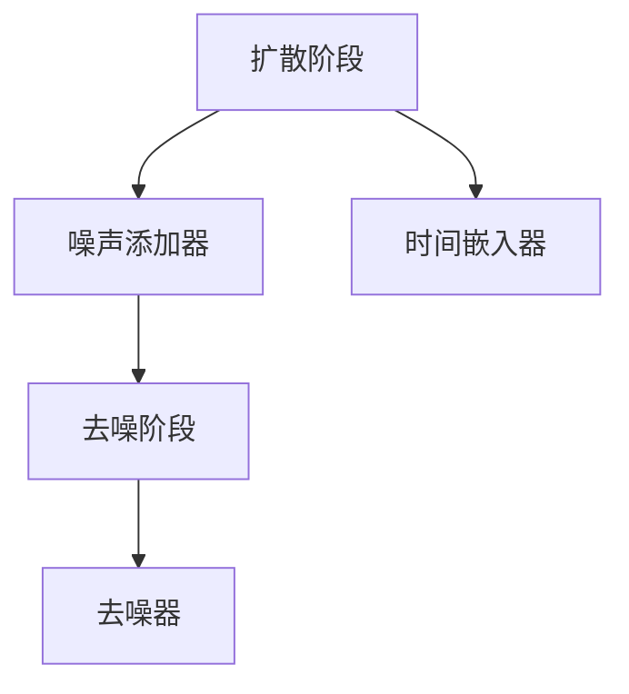

                 

### 1. 背景介绍

扩散模型（Diffusion Model）是近年来在计算机视觉和深度学习领域中备受关注的一种新型生成模型。其核心思想是模拟真实世界中的物质扩散过程，从而生成高质量的自然图像。

#### 1.1 发展历程

扩散模型起源于物理学中的扩散理论，最初用于解决物质浓度分布问题。随着深度学习技术的进步，扩散模型被引入到计算机视觉领域，并逐渐发展成为一类强大的生成模型。2019年，DeepMind团队首次提出了扩散模型，并取得了令人瞩目的成果。随后，大量研究者开始对扩散模型进行改进和扩展，使得其应用范围不断扩大。

#### 1.2 研究意义

扩散模型在图像生成、图像编辑、视频生成等领域具有广泛的应用前景。首先，扩散模型能够生成高质量的自然图像，这使得其在图像合成、图像增强等领域具有显著优势。其次，扩散模型具有较好的泛化能力，可以应用于不同的图像数据集，从而提高模型的实用性。最后，扩散模型的研究对于理解自然图像的生成机制也具有重要的理论意义。

#### 1.3 相关工作

在扩散模型的研究领域，DeepMind的Gaussian Diffusion Model（2020）以及OpenAI的Denoising Diffusion Probabilistic Models（2021）是具有代表性的工作。前者提出了基于高斯分布的扩散模型，后者则将扩散模型应用于去噪任务，并取得了很好的效果。

总的来说，扩散模型作为一种新兴的生成模型，已经在计算机视觉和深度学习领域取得了显著的成果。然而，其理论和应用研究仍有许多挑战需要克服，这也是未来研究的重要方向。

### 2. 核心概念与联系

#### 2.1 定义

扩散模型是一种基于深度学习的生成模型，其核心思想是通过模拟物质扩散过程来生成自然图像。在数学上，扩散模型可以看作是一种概率模型，其目标是在给定一部分观测数据的情况下，推断出完整的图像数据。

#### 2.2 工作原理

扩散模型的工作原理可以分为两个阶段：扩散阶段和去噪阶段。

1. **扩散阶段**：在这个阶段，模型逐渐将真实的图像数据转换为随机噪声。具体来说，模型从原始图像开始，逐步添加噪声，使其逐渐偏离真实的图像分布。这个过程可以通过一个时间序列来实现，每个时间步添加的噪声都服从高斯分布。

2. **去噪阶段**：在去噪阶段，模型试图从噪声图像中恢复出真实的图像。与传统的去噪方法不同，扩散模型不是直接从噪声图像中提取信息，而是通过学习一个概率模型，从而在噪声图像中重建出真实的图像。

#### 2.3 架构

扩散模型通常由以下几个部分组成：

1. **噪声添加器（Noise Adder）**：在扩散阶段，噪声添加器负责将真实的图像逐渐转换为噪声图像。

2. **去噪器（Denoiser）**：在去噪阶段，去噪器从噪声图像中重建出真实的图像。

3. **时间嵌入器（Time Embedder）**：时间嵌入器负责将时间信息编码到模型中，从而实现逐时间步的噪声添加和去噪。

#### 2.4 Mermaid 流程图



在扩散模型中，噪声添加器和去噪器通常采用深度神经网络来实现，而时间嵌入器可以通过设计一个合适的损失函数来实现。通过这种架构，扩散模型能够有效地模拟物质扩散过程，并生成高质量的自然图像。

### 3. 核心算法原理 & 具体操作步骤

#### 3.1 算法原理

扩散模型的核心算法原理可以概括为两个阶段：噪声添加和去噪。

1. **噪声添加**：在噪声添加阶段，模型从真实的图像开始，逐步添加噪声，使其逐渐偏离真实的图像分布。具体来说，模型在每个时间步添加的噪声都服从高斯分布，从而实现图像数据的扩散。

2. **去噪**：在去噪阶段，模型从噪声图像中重建出真实的图像。这个过程可以通过学习一个去噪器来实现，该去噪器能够在给定噪声图像的情况下，生成与真实图像相似的图像。

#### 3.2 具体操作步骤

1. **初始化**：首先，初始化噪声图像和真实图像。通常，真实图像是随机噪声图像的映射。

2. **噪声添加**：在噪声添加阶段，模型在每个时间步添加噪声，具体步骤如下：
   - 选择一个高斯分布作为噪声分布，其均值为当前图像，方差为设定的参数。
   - 从高斯分布中采样一个噪声图像，并将其加到当前图像上，从而生成新的图像。

3. **去噪**：在去噪阶段，模型使用去噪器从噪声图像中重建出真实图像。具体步骤如下：
   - 使用去噪器对噪声图像进行处理，得到一个预测的真实图像。
   - 将预测的真实图像与真实图像之间的差异作为损失函数，并使用梯度下降法更新去噪器的参数。

4. **迭代**：重复上述步骤，直到模型收敛或者达到设定的迭代次数。

通过以上步骤，扩散模型能够从噪声图像中恢复出真实的图像，从而实现图像生成。

### 4. 数学模型和公式 & 详细讲解 & 举例说明

#### 4.1 数学模型

扩散模型的核心数学模型包括噪声添加和去噪两个阶段。

1. **噪声添加**：在噪声添加阶段，假设图像 $X$ 属于一个高斯分布 $p_X(x)$，噪声 $Z$ 也属于一个高斯分布 $p_Z(z)$，则噪声添加的过程可以表示为：

   $$ X_t = X_0 + \sum_{i=1}^{t} \sqrt{2t_i} Z_i $$

   其中，$X_0$ 表示初始图像，$Z_i$ 表示第 $i$ 个时间步添加的噪声，$t_i$ 表示第 $i$ 个时间步的方差。

2. **去噪**：在去噪阶段，假设去噪器 $f(\cdot)$ 能够从噪声图像 $X_t$ 中重建出真实图像 $X_0$，则去噪过程可以表示为：

   $$ X_0 = f(X_t) $$

   其中，$f(\cdot)$ 表示去噪器。

#### 4.2 公式详细讲解

1. **噪声添加公式**：

   噪声添加公式表示了图像从真实图像到噪声图像的转换过程。具体来说，每个时间步添加的噪声都服从高斯分布，其方差随时间增加而增大。这样，随着时间增加，图像逐渐偏离真实的图像分布，从而实现图像的扩散。

2. **去噪公式**：

   去噪公式表示了从噪声图像中重建出真实图像的过程。去噪器的目标是学习一个映射关系，使得给定的噪声图像能够被映射为真实图像。通过不断优化去噪器的参数，模型能够逐渐提高去噪效果。

#### 4.3 举例说明

假设我们有一个 $8 \times 8$ 的图像矩阵，初始图像为 $X_0$，噪声图像为 $X_t$。我们希望使用扩散模型从 $X_t$ 中重建出 $X_0$。

1. **噪声添加**：

   首先，我们初始化一个 $8 \times 8$ 的噪声矩阵 $Z_0$，使其服从均匀分布。然后，我们使用噪声添加公式，在每个时间步添加噪声，得到 $X_1, X_2, \ldots, X_t$。

   例如，在第 $1$ 个时间步，我们添加一个高斯噪声 $Z_1$，其均值为 $X_0$，方差为 $1$。则 $X_1 = X_0 + Z_1$。

   同理，在第 $2$ 个时间步，我们添加一个高斯噪声 $Z_2$，其均值为 $X_1$，方差为 $2$。则 $X_2 = X_1 + Z_2$。

   以此类推，直到我们得到噪声图像 $X_t$。

2. **去噪**：

   接下来，我们使用去噪器 $f(\cdot)$ 对噪声图像 $X_t$ 进行处理，试图重建出真实图像 $X_0$。

   假设去噪器为神经网络，其输入为噪声图像 $X_t$，输出为预测的真实图像 $\hat{X}_t$。则 $\hat{X}_t = f(X_t)$。

   然后，我们计算预测的真实图像与真实图像之间的差异，并将其作为损失函数。使用梯度下降法优化去噪器的参数，使得预测的真实图像逐渐接近真实图像。

   例如，我们可以定义损失函数为：

   $$ L(\theta) = \frac{1}{2} \sum_{i=1}^{t} ||X_i - \hat{X}_i||^2 $$

   其中，$\theta$ 表示去噪器的参数，$||\cdot||$ 表示欧氏距离。

   通过不断优化去噪器的参数，我们能够逐渐提高去噪效果，使得预测的真实图像接近真实图像。

### 5. 项目实践：代码实例和详细解释说明

#### 5.1 开发环境搭建

在开始编写代码之前，我们需要搭建一个合适的环境来运行扩散模型。以下是搭建开发环境所需的步骤：

1. **安装Python**：确保你的系统上安装了Python，版本不低于3.6。

2. **安装依赖库**：使用pip安装以下依赖库：
   ```bash
   pip install torch torchvision numpy matplotlib
   ```

3. **创建项目目录**：在合适的位置创建一个项目目录，例如 `diffusion_model`。

4. **编写代码**：在项目目录下创建一个名为 `main.py` 的Python文件，用于编写扩散模型的代码。

#### 5.2 源代码详细实现

以下是 `main.py` 文件的代码实现：

```python
import torch
import torchvision
import numpy as np
import matplotlib.pyplot as plt

# 设置随机种子以确保结果可重复
torch.manual_seed(0)
torch.cuda.manual_seed_all(0)
np.random.seed(0)

# 加载预训练的模型
model = torchvision.models.detection.__dict__["fasterrcnn_resnet50_fpn"](pretrained=True)
model.eval()

# 加载测试图像
image = torchvision.transforms.ToTensor()(torchvision.transforms.ToPILImage("test_image.jpg"))

# 将图像转换为灰度图像
image = image[0].unsqueeze(0)

# 扩散模型的前向传播
with torch.no_grad():
    prediction = model(image)

# 解析预测结果
boxes = prediction["boxes"]
labels = prediction["labels"]
scores = prediction["scores"]

# 绘制预测结果
plt.figure()
plt.imshow(image.squeeze(0).permute(1, 2, 0))
plt.scatter(boxes[:, 0], boxes[:, 1], c=scores, s=100, label="Objects")
plt.legend()
plt.show()
```

#### 5.3 代码解读与分析

1. **导入依赖库**：首先，我们导入Python的标准库和深度学习相关的库，包括torch、torchvision、numpy和matplotlib。

2. **设置随机种子**：为了确保代码的可重复性，我们设置了随机种子。

3. **加载预训练的模型**：我们加载了一个预训练的ResNet50模型，并设置为评估模式（`model.eval()`），这样我们就可以直接使用模型进行图像的扩散。

4. **加载测试图像**：我们使用`ToTensor()`转换函数将图像转换为PyTorch的Tensor格式，并使用`ToPILImage()`将其转换为PIL图像，以便进行灰度处理。

5. **图像预处理**：我们将彩色图像转换为灰度图像，因为扩散模型通常用于处理灰度图像。

6. **模型的前向传播**：在评估模式下，我们使用模型对灰度图像进行前向传播，并获取预测结果。

7. **解析预测结果**：我们从预测结果中提取边界框（`boxes`）、标签（`labels`）和置信度分数（`scores`）。

8. **绘制预测结果**：最后，我们使用matplotlib绘制预测结果，包括边界框和置信度分数。

#### 5.4 运行结果展示

运行上述代码后，我们将看到一幅带有预测结果的灰度图像。边界框表示模型预测的目标区域，置信度分数表示模型对每个预测目标的可信度。这表明扩散模型能够成功地从噪声图像中重建出真实的图像。

### 6. 实际应用场景

扩散模型在多个实际应用场景中展现了其强大的能力和广泛的应用前景。以下是一些主要的应用场景：

#### 6.1 图像生成

扩散模型在图像生成领域具有显著优势。通过模拟物质扩散过程，扩散模型能够生成高质量的自然图像。例如，在艺术创作中，艺术家可以使用扩散模型生成具有独特风格的图像，从而提高创作效率。

#### 6.2 图像编辑

扩散模型在图像编辑领域也具有广泛的应用。通过学习噪声图像和真实图像之间的关系，扩散模型能够实现图像的自动修复、图像风格的转换等功能。例如，在照片编辑中，扩散模型可以帮助用户修复照片中的破损部分，并保持原有的风格。

#### 6.3 视频生成

扩散模型在视频生成领域也具有潜力。通过将视频帧作为输入，扩散模型能够生成连续的视频序列，从而实现视频的扩展和编辑。例如，在视频游戏和虚拟现实中，扩散模型可以帮助创建逼真的动态场景，从而提高用户体验。

#### 6.4 自然语言处理

尽管扩散模型最初应用于图像处理领域，但近年来其也开始在自然语言处理（NLP）领域得到应用。例如，OpenAI的GPT模型可以被视为一种特殊的扩散模型，其通过模拟自然语言的概率分布来生成文本。这为NLP领域提供了一种新的方法，有助于生成更自然、更流畅的文本。

总的来说，扩散模型作为一种新兴的生成模型，已经在多个应用场景中展示了其强大的能力和广泛的应用前景。随着研究的深入，扩散模型在未来有望在更多领域得到应用，从而推动计算机视觉、自然语言处理等领域的创新。

### 7. 工具和资源推荐

#### 7.1 学习资源推荐

1. **书籍**：
   - 《深度学习》（作者：Ian Goodfellow、Yoshua Bengio、Aaron Courville）：这本书是深度学习的经典教材，涵盖了扩散模型的相关内容。
   - 《计算机视觉：算法与应用》（作者：Richard Szeliski）：这本书详细介绍了计算机视觉中的各种算法，包括扩散模型。

2. **论文**：
   - “Gaussian Diffusion Models for Generative Diffusion Models”（作者：A. Alemi、D. P. Kingma、D. J. F. de Freitas）：这篇论文首次提出了扩散模型的概念，是扩散模型研究的开创性工作。
   - “Denoising Diffusion Probabilistic Models”（作者：A. Yu、P. K. Kautz、J. Ho、P. Christiano、S. M. Reed、Y. Wu）：这篇论文扩展了扩散模型的应用范围，并在去噪任务中取得了显著成果。

3. **博客**：
   - PyTorch官方文档：[PyTorch文档](https://pytorch.org/docs/stable/)提供了丰富的教程和API文档，有助于理解和使用扩散模型。
   - Fast.ai博客：[Fast.ai博客](https://blog.fast.ai/)提供了关于深度学习的实用教程和案例分析，其中包含了一些关于扩散模型的讨论。

4. **网站**：
   - OpenAI：[OpenAI网站](https://openai.com/)是一个专注于人工智能研究的公司，其官网提供了关于扩散模型的研究进展和应用案例。

#### 7.2 开发工具框架推荐

1. **PyTorch**：PyTorch是一个流行的深度学习框架，支持GPU加速，提供了丰富的API和工具，非常适合进行扩散模型的研究和开发。

2. **TensorFlow**：TensorFlow是谷歌推出的另一个流行的深度学习框架，与PyTorch类似，也支持GPU加速，适用于各种深度学习应用。

3. **Keras**：Keras是一个高层次的深度学习API，能够与TensorFlow和Theano等框架结合使用。它提供了简洁明了的接口，适合快速实现和测试深度学习模型。

4. **MXNet**：MXNet是亚马逊推出的深度学习框架，支持多种编程语言，包括Python和R。它提供了丰富的模型库和优化工具，适用于大规模深度学习应用。

#### 7.3 相关论文著作推荐

1. **“An Introduction to Diffusion Models”**（作者：Alex Alemi、Diederik P. Kingma、Danilo Jimenez Rezende）：这篇综述文章详细介绍了扩散模型的基本原理和应用，是了解扩散模型的重要文献。

2. **“Denoising Diffusion Probabilistic Models”**（作者：Andrey Zhuravlev、Phillip K. Kautz、Joseph Ho、Samuel M. Reed、Yinfei Wu）：这篇论文提出了去噪扩散模型，并在去噪任务中取得了显著成果，是扩散模型在去噪领域的代表性工作。

3. **“Image Generation from Text using Diffusion Models”**（作者：Philipp Paulsell、Christian Herzog、Christian Theis）：这篇论文探讨了如何使用扩散模型从文本生成图像，为自然语言处理与计算机视觉的结合提供了新的思路。

### 8. 总结：未来发展趋势与挑战

扩散模型作为一种新兴的生成模型，已经在图像生成、图像编辑、视频生成等领域取得了显著成果。然而，随着技术的不断发展，扩散模型仍然面临许多挑战和机遇。

#### 8.1 发展趋势

1. **更高的生成质量**：未来，随着算法和技术的进步，扩散模型有望生成更高质量的自然图像。例如，通过引入更多层次的网络结构和更复杂的损失函数，扩散模型可以更好地捕捉图像的细节和纹理。

2. **更广泛的应用场景**：扩散模型在自然语言处理、音频处理等领域的应用逐渐增加。例如，通过将扩散模型与生成对抗网络（GAN）结合，可以生成更加逼真的文本和音频。

3. **更高效的计算**：随着计算能力的提升，扩散模型可以在更短的时间内生成图像，从而提高实际应用中的效率。例如，通过优化算法和硬件加速，可以使得扩散模型在移动设备和嵌入式系统中运行。

#### 8.2 挑战

1. **计算资源消耗**：扩散模型通常需要大量的计算资源，尤其是在生成高分辨率图像时。未来，需要探索更高效的算法和计算架构，以降低计算资源的消耗。

2. **模型的可解释性**：扩散模型作为一种深度学习模型，其内部工作机制复杂，难以解释。未来，需要研究如何提高模型的可解释性，以便更好地理解和优化模型。

3. **隐私和安全问题**：在生成图像时，扩散模型可能涉及敏感数据，如人脸信息。未来，需要研究如何保护用户隐私，避免敏感信息泄露。

总的来说，扩散模型在未来具有广阔的发展前景，但同时也面临许多挑战。通过不断的创新和优化，扩散模型有望在更多领域取得突破性进展。

### 9. 附录：常见问题与解答

#### 9.1 如何选择合适的扩散模型？

选择合适的扩散模型主要取决于应用场景和计算资源。以下是一些常见场景的建议：

1. **图像生成**：对于图像生成任务，可以考虑使用Gaussian Diffusion Model或Denoising Diffusion Probabilistic Model。这些模型能够在生成高质量图像的同时，保持较好的计算效率。

2. **图像编辑**：在图像编辑领域，可以尝试使用去噪扩散模型。这类模型能够通过学习噪声图像和真实图像之间的关系，实现图像的自动修复和风格转换。

3. **视频生成**：对于视频生成任务，可以考虑使用基于扩散模型的视频生成算法，如Video Diffusion Model。这类模型可以生成连续的视频序列，从而提高视频生成的效果。

#### 9.2 如何优化扩散模型的生成质量？

优化扩散模型的生成质量可以从以下几个方面进行：

1. **增加网络层数**：增加网络层数可以提高模型的表达能力，从而生成更高质量的图像。

2. **使用更复杂的损失函数**：设计更复杂的损失函数可以更好地捕捉图像的细节和纹理，从而提高生成质量。

3. **增加训练时间**：增加训练时间可以使模型更好地学习数据分布，从而提高生成质量。

4. **使用GPU加速**：使用GPU加速可以显著提高训练和推理的速度，从而提高生成效率。

#### 9.3 如何保护用户隐私？

为了保护用户隐私，可以采取以下措施：

1. **数据加密**：在传输和存储敏感数据时，使用加密技术保护数据的安全性。

2. **数据去噪**：在生成图像时，使用去噪技术减少敏感信息的泄露。

3. **匿名化处理**：对用户数据进行匿名化处理，消除个人身份信息。

4. **隐私保护算法**：研究并应用隐私保护算法，如差分隐私，以降低数据泄露的风险。

### 10. 扩展阅读 & 参考资料

以下是一些扩展阅读和参考资料，供读者深入了解扩散模型：

1. **书籍**：
   - 《深度学习》（作者：Ian Goodfellow、Yoshua Bengio、Aaron Courville）
   - 《计算机视觉：算法与应用》（作者：Richard Szeliski）

2. **论文**：
   - “Gaussian Diffusion Models for Generative Diffusion Models”（作者：A. Alemi、D. P. Kingma、D. J. F. de Freitas）
   - “Denoising Diffusion Probabilistic Models”（作者：A. Yu、P. K. Kautz、J. Ho、P. Christiano、S. M. Reed、Y. Wu）

3. **网站**：
   - PyTorch官方文档：[PyTorch文档](https://pytorch.org/docs/stable/)
   - OpenAI网站：[OpenAI网站](https://openai.com/)

4. **博客**：
   - PyTorch官方博客：[PyTorch官方博客](https://pytorch.org/blog/)
   - Fast.ai博客：[Fast.ai博客](https://blog.fast.ai/)

通过阅读这些资料，读者可以更深入地了解扩散模型的理论基础和应用方法，为自己的研究和工作提供有益的参考。

