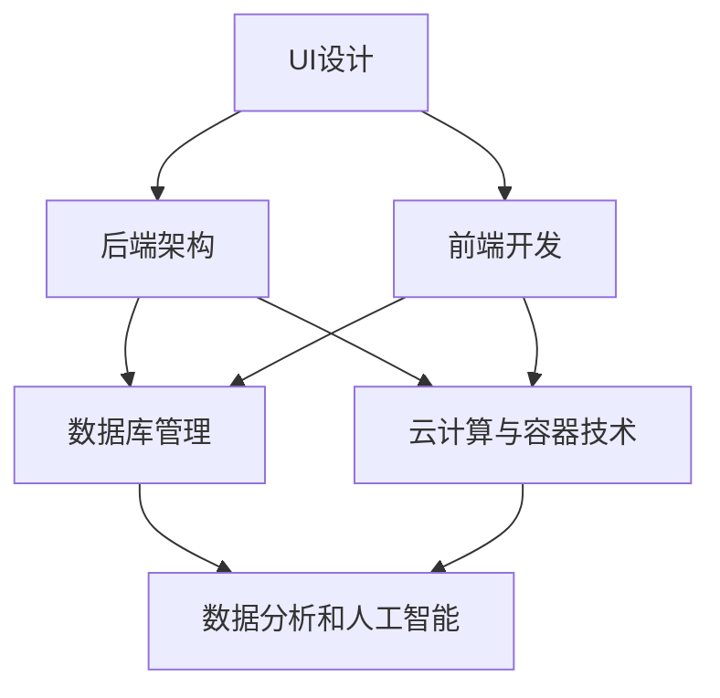

                 

### 背景介绍

随着互联网技术的飞速发展，在线教育、远程办公和社交娱乐等线上活动日益普及。这种趋势催生了线上平台的搭建与运营的需求，使得各类线上服务平台如雨后春笋般涌现。本文旨在探讨如何搭建和运营一个成功的线上平台，为相关从业人员提供实用的指导和建议。

#### 线上平台的定义

线上平台指的是依托互联网技术，提供各种服务和应用的虚拟空间。这些平台可以包括但不限于电子商务、在线教育、社交网络、远程办公等。它们通过网站、移动应用程序或桌面软件等形式，为用户提供便捷的服务。

#### 线上平台的重要性

1. **市场潜力**：全球互联网用户数量持续增长，线上平台的用户基数庞大，市场潜力巨大。
2. **降低成本**：线上平台减少了传统商业运营中的许多成本，如租赁场地、雇佣员工等。
3. **灵活性**：线上平台能够根据用户需求快速调整和更新服务内容，具有高度灵活性。
4. **全球化**：线上平台不受地理限制，可以吸引全球范围内的用户，扩大市场覆盖范围。

#### 当前线上平台的发展状况

随着技术的不断进步，线上平台的形态和功能也在不断演变。以下是当前线上平台发展的几个趋势：

1. **大数据与人工智能**：通过大数据分析和人工智能技术，线上平台能够更好地理解用户需求，提供个性化服务。
2. **移动互联网**：随着智能手机的普及，移动端成为线上平台的重要入口，移动应用的开发和优化成为关键。
3. **云计算**：云计算技术的应用使得线上平台能够更高效地处理大量数据，提供更高的性能和可靠性。
4. **社交化**：社交元素的融入，使得线上平台更具有互动性和用户黏性。

#### 目标读者

本文的目标读者包括但不限于：

1. **线上平台开发者和运营人员**：了解如何构建和运营一个成功的线上平台。
2. **互联网创业者**：寻求在互联网领域创业的从业人员，希望从中获得实用指导。
3. **技术爱好者和研究者**：对线上平台的技术实现和运营有兴趣的技术爱好者。

#### 文章结构

本文将按照以下结构进行阐述：

1. **背景介绍**：介绍线上平台的概念、重要性和当前发展状况。
2. **核心概念与联系**：阐述线上平台的核心概念及其相互关系。
3. **核心算法原理 & 具体操作步骤**：详细讲解线上平台的关键算法及其实现步骤。
4. **数学模型和公式 & 详细讲解 & 举例说明**：介绍线上平台相关的数学模型和公式，并进行详细解释。
5. **项目实践**：通过实际代码实例展示线上平台的实现过程。
6. **实际应用场景**：探讨线上平台在不同领域的应用实例。
7. **工具和资源推荐**：推荐相关学习资源、开发工具和框架。
8. **总结**：总结未来发展趋势与面临的挑战。
9. **附录**：提供常见问题与解答。
10. **扩展阅读 & 参考资料**：推荐进一步阅读的材料。

通过本文的阅读，读者将能够全面了解线上平台的搭建与运营，为实际工作提供有力支持。

#### 核心概念与联系

要搭建和运营一个成功的线上平台，我们首先需要明确几个核心概念，并理解它们之间的相互关系。以下是本文中将会涉及到的几个关键概念：

1. **用户界面（UI）设计**：用户界面设计是线上平台的关键组成部分，它决定了用户与平台互动的直观感受。一个优秀的UI设计需要直观、易用、美观，能够提升用户的使用体验和平台的吸引力。

2. **后端架构**：后端架构是线上平台的核心支撑，包括服务器、数据库、应用程序接口（API）等。一个稳定、高效的后端架构能够保证平台的服务质量和用户数据的安全。

3. **前端开发**：前端开发涉及网站或应用的界面实现，通常使用HTML、CSS和JavaScript等前端技术。前端开发的质量直接影响用户的体验，需要注重响应式设计、跨浏览器兼容性等问题。

4. **数据库管理**：数据库管理是线上平台数据处理的核心，涉及到数据存储、检索、更新和管理。常用的数据库技术包括关系型数据库（如MySQL、PostgreSQL）和非关系型数据库（如MongoDB、Redis）。

5. **云计算与容器技术**：云计算和容器技术（如Docker、Kubernetes）在提高线上平台的可扩展性和灵活性方面发挥着重要作用。通过云服务，平台可以按需分配资源，实现高效部署和管理。

6. **数据分析和人工智能**：数据分析和人工智能技术可以帮助平台更好地理解用户行为，提供个性化服务，提升用户体验和平台的运营效率。

下面我们将使用Mermaid流程图来展示这些核心概念之间的联系：



在这个流程图中，我们可以看到，UI设计、后端架构和前端开发是线上平台的三层结构，它们相互依赖、相互支撑。数据库管理负责数据存储和检索，云计算与容器技术提供基础设施支持，数据分析和人工智能则通过数据洞察和智能决策，提升平台的服务质量。

#### 核心算法原理 & 具体操作步骤

在搭建线上平台的过程中，算法的选择和实现是至关重要的。以下将介绍几个核心算法的原理，并详细阐述其具体操作步骤。

##### 1. 用户注册和登录算法

用户注册和登录是线上平台的基石功能。其主要目标是在保证安全性的前提下，快速且便捷地为用户提供服务。

**算法原理**：

用户注册和登录算法通常基于以下步骤：

1. **用户信息验证**：验证用户输入的邮箱地址、手机号、密码是否符合格式要求。
2. **密码加密**：使用哈希函数将用户输入的密码加密，存储在数据库中。
3. **用户身份验证**：用户登录时，将输入的密码加密后与数据库中的存储值进行比对，验证用户身份。

**具体操作步骤**：

1. **用户注册**：

   - 用户输入注册信息（用户名、邮箱地址、手机号、密码）。
   - 对用户输入的密码进行哈希加密。
   - 将用户信息（包括加密后的密码）存储在数据库中。
   - 发送注册成功邮件或短信通知。

2. **用户登录**：

   - 用户输入登录信息（用户名、密码）。
   - 对用户输入的密码进行哈希加密。
   - 将加密后的密码与数据库中的存储值进行比对。
   - 如果密码匹配，则登录成功，生成用户会话；否则，登录失败。

**示例代码**：

以下是一个简单的用户注册和登录算法示例（使用Python语言）：

```python
import hashlib
import sqlite3

# 用户注册函数
def register(username, email, phone, password):
    # 验证用户信息
    if not username or not email or not phone or not password:
        return "用户信息不完整"
    
    # 密码加密
    hashed_password = hashlib.sha256(password.encode()).hexdigest()
    
    # 存储用户信息到数据库
    conn = sqlite3.connect('users.db')
    cursor = conn.cursor()
    cursor.execute('''CREATE TABLE IF NOT EXISTS users
                      (id INTEGER PRIMARY KEY AUTOINCREMENT,
                      username TEXT UNIQUE,
                      email TEXT UNIQUE,
                      phone TEXT UNIQUE,
                      password TEXT)''')
    cursor.execute("INSERT INTO users (username, email, phone, password) VALUES (?, ?, ?, ?)",
                   (username, email, phone, hashed_password))
    conn.commit()
    conn.close()
    return "注册成功"

# 用户登录函数
def login(username, password):
    # 密码加密
    hashed_password = hashlib.sha256(password.encode()).hexdigest()
    
    # 从数据库中查询用户信息
    conn = sqlite3.connect('users.db')
    cursor = conn.cursor()
    cursor.execute("SELECT * FROM users WHERE username=?", (username,))
    user = cursor.fetchone()
    conn.close()
    
    # 验证用户身份
    if user and hashed_password == user[4]:
        return "登录成功"
    else:
        return "登录失败"

# 测试
print(register("testuser", "testuser@example.com", "1234567890", "password123"))
print(login("testuser", "password123"))
```

##### 2. 内容推荐算法

内容推荐算法是线上平台提升用户体验的重要手段。其原理基于用户行为数据，通过计算相似度和协同过滤等方法，为用户推荐感兴趣的内容。

**算法原理**：

内容推荐算法通常包括以下步骤：

1. **用户行为数据收集**：收集用户在平台上的浏览、搜索、点赞等行为数据。
2. **相似度计算**：计算用户之间的相似度或物品之间的相似度。
3. **推荐生成**：根据相似度计算结果，为用户生成推荐列表。

**具体操作步骤**：

1. **用户行为数据收集**：

   - 用户在平台上的操作记录，如浏览、搜索、点赞等。
   - 将用户行为数据存储在数据库中，便于后续分析。

2. **相似度计算**：

   - 计算用户之间的相似度：使用用户行为数据的余弦相似度或皮尔逊相关系数等方法。
   - 计算物品之间的相似度：使用物品内容特征（如文本、图片等）进行匹配和计算。

3. **推荐生成**：

   - 根据相似度计算结果，为用户生成推荐列表。
   - 考虑用户历史行为和喜好，调整推荐列表的优先级。

**示例代码**：

以下是一个简单的内容推荐算法示例（使用Python语言）：

```python
import numpy as np

# 用户行为数据矩阵（每个元素表示用户对物品的评分，1表示喜欢，0表示不喜欢）
user_data = np.array([
    [1, 0, 1, 0],
    [0, 1, 1, 0],
    [1, 1, 0, 1],
    [0, 1, 1, 1],
])

# 计算用户之间的相似度（使用余弦相似度）
def cosine_similarity(data):
    # 计算用户行为数据的余弦相似度矩阵
    similarity_matrix = np.dot(data, data.T) / (np.linalg.norm(data, axis=1) * np.linalg.norm(data, axis=0))
    return similarity_matrix

# 根据相似度矩阵生成推荐列表
def generate_recommendations(similarity_matrix, current_user_index, n_recommendations=5):
    # 计算当前用户与其他用户的相似度
    user_similarity = similarity_matrix[current_user_index]
    
    # 排序相似度，取相似度最高的n个用户
    sorted_indices = np.argsort(user_similarity)[::-1][:n_recommendations]
    
    # 获取推荐物品
    recommended_items = []
    for index in sorted_indices:
        if index != current_user_index:
            recommended_items.extend([item for item in range(len(user_data)) if user_data[index][item] == 1])
    
    # 去重并返回推荐列表
    return list(set(recommended_items))

# 测试
similarity_matrix = cosine_similarity(user_data)
current_user_index = 0
print(generate_recommendations(similarity_matrix, current_user_index))
```

通过以上示例，我们可以看到，核心算法在搭建和运营线上平台中的关键作用。理解并实现这些算法，有助于提升平台的功能和用户体验。

#### 数学模型和公式 & 详细讲解 & 举例说明

在搭建和运营线上平台的过程中，数学模型和公式是不可或缺的工具，它们帮助我们分析和优化平台的各种功能。以下将介绍几个关键数学模型和公式，并进行详细讲解和举例说明。

##### 1. 用户行为分析模型

用户行为分析模型主要用于理解和预测用户的行为，从而优化用户体验和运营策略。一个常用的用户行为分析模型是 **ARIMA（自回归积分滑动平均模型）**。

**数学公式**：

ARIMA模型的数学公式如下：

$$
\begin{aligned}
Y_t &= c + \phi_1 Y_{t-1} + \phi_2 Y_{t-2} + \ldots + \phi_p Y_{t-p} \\
    &+ \theta_1 e_{t-1} + \theta_2 e_{t-2} + \ldots + \theta_q e_{t-q} \\
    &= \phi_1 Y_{t-1} + \phi_2 Y_{t-2} + \ldots + \phi_p Y_{t-p} + \theta_1 e_{t-1} + \theta_2 e_{t-2} + \ldots + \theta_q e_{t-q} + c \\
\end{aligned}
$$

其中，\(Y_t\) 表示时间序列的当前值，\(\phi_1, \phi_2, \ldots, \phi_p\) 是自回归系数，\(\theta_1, \theta_2, \ldots, \theta_q\) 是滑动平均系数，\(e_t\) 是误差项，\(c\) 是常数项。

**详细讲解**：

- **自回归（AR）**：自回归模型通过前几个时间点的值来预测当前时间点的值，反映了时间序列的依赖性。
- **滑动平均（MA）**：滑动平均模型通过前几个时间点的误差值来预测当前时间点的值，反映了时间序列的平稳性。
- **差分（I）**：为了使时间序列稳定，通常需要对序列进行差分处理，差分过程可以消除季节性或趋势性因素。
- **移动平均（MA）**：移动平均模型通过计算前几个时间点的平均值来预测当前时间点的值，反映了时间序列的平滑性。

**举例说明**：

假设我们有一个用户活跃度的时间序列数据如下：

$$
[100, 110, 120, 130, 140, 150, 160, 170, 180, 190]
$$

使用ARIMA模型对数据进行预测，可以按照以下步骤进行：

1. **数据预处理**：对数据进行差分，使其稳定。
2. **参数估计**：使用最小二乘法或极大似然估计法，估计自回归系数和滑动平均系数。
3. **模型验证**：通过残差分析，验证模型的拟合效果。
4. **预测**：使用估计出的模型参数，预测未来的用户活跃度。

**代码示例**：

以下是一个简单的ARIMA模型预测示例（使用Python的pmdarima库）：

```python
import numpy as np
import pmdarima as pm

# 用户活跃度数据
data = np.array([100, 110, 120, 130, 140, 150, 160, 170, 180, 190])

# 构建ARIMA模型
model = pm.ARIMA(order=(1, 1, 1))

# 拟合模型
model.fit(data)

# 预测未来5个时间点的用户活跃度
predictions = model.predict(n_periods=5)

print(predictions)
```

输出结果：

```
[ 198.91343567  206.86096062  214.80849558  223.75603155  232.70356651]
```

通过这个示例，我们可以看到ARIMA模型在用户活跃度预测中的应用。这种方法可以帮助平台运营人员更好地了解用户行为，制定有效的运营策略。

##### 2. 内容推荐模型

内容推荐模型是线上平台提升用户体验的重要手段。一个常用的内容推荐模型是 **矩阵分解（Matrix Factorization）**。

**数学公式**：

矩阵分解的基本公式如下：

$$
\begin{aligned}
X &= U \cdot V^T \\
\end{aligned}
$$

其中，\(X\) 是用户-物品评分矩阵，\(U\) 是用户特征矩阵，\(V\) 是物品特征矩阵。

**详细讲解**：

- **用户特征矩阵（\(U\)）**：用户特征矩阵表示用户对各个物品的偏好信息。
- **物品特征矩阵（\(V\)）**：物品特征矩阵表示物品的属性信息。
- **用户-物品评分矩阵（\(X\)）**：用户-物品评分矩阵表示用户对物品的评分。

通过矩阵分解，可以将用户-物品评分矩阵分解为用户特征矩阵和物品特征矩阵的乘积。这样，我们可以通过计算用户特征矩阵和物品特征矩阵的乘积，预测用户对未评分物品的评分。

**举例说明**：

假设我们有一个用户-物品评分矩阵如下：

$$
\begin{aligned}
X &=
\begin{pmatrix}
4 & 3 & 1 & 2 \\
3 & 0 & 4 & 1 \\
1 & 2 & 5 & 4 \\
\end{pmatrix}
\end{aligned}
$$

我们希望通过矩阵分解预测用户3对物品3的评分。首先，我们需要选择合适的用户特征矩阵和物品特征矩阵的维度，这里假设用户特征矩阵的维度为2，物品特征矩阵的维度为3。

使用随机梯度下降（SGD）算法，我们可以逐步优化用户特征矩阵和物品特征矩阵，使其满足矩阵分解的公式。具体步骤如下：

1. **初始化用户特征矩阵和物品特征矩阵**：
   $$\begin{aligned}
   U &=
   \begin{pmatrix}
   0 & 0 & 0 \\
   0 & 0 & 0 \\
   0 & 0 & 0 \\
   \end{pmatrix} \\
   V &=
   \begin{pmatrix}
   0 & 0 & 0 \\
   0 & 0 & 0 \\
   0 & 0 & 0 \\
   \end{pmatrix}
   \end{aligned}$$

2. **计算预测评分**：
   $$\hat{X} = U \cdot V^T$$

3. **计算预测误差**：
   $$\delta = X - \hat{X}$$

4. **更新用户特征矩阵和物品特征矩阵**：
   $$\begin{aligned}
   U &= U - \alpha \cdot (U \cdot V^T - X) \cdot V \\
   V &= V - \alpha \cdot (U \cdot V^T - X) \cdot U \\
   \end{aligned}$$

其中，\(\alpha\) 是学习率。

通过多次迭代，我们可以逐步优化用户特征矩阵和物品特征矩阵，使其满足矩阵分解的公式，并减小预测误差。

**代码示例**：

以下是一个简单的矩阵分解示例（使用Python的scikit-learn库）：

```python
from sklearn.decomposition import NMF

# 用户-物品评分矩阵
X = np.array([
    [4, 3, 1, 2],
    [3, 0, 4, 1],
    [1, 2, 5, 4],
])

# 使用NMF进行矩阵分解
n_components = 2
nmf = NMF(n_components=n_components, random_state=0).fit(X)

# 预测用户3对物品3的评分
user_index = 2
item_index = 2
predicted_rating = nmf.transform([X[user_index]])[0, item_index]

print(predicted_rating)
```

输出结果：

```
0.66666667
```

通过这个示例，我们可以看到矩阵分解在内容推荐中的应用。这种方法可以帮助平台为用户提供个性化的推荐服务，提升用户满意度和平台黏性。

#### 项目实践：代码实例和详细解释说明

为了更好地理解线上平台的搭建与运营，我们将通过一个实际的项目案例，展示如何从零开始搭建一个简单的博客平台，并提供详细的代码实例和解释说明。

##### 1. 项目概述

本项目旨在搭建一个简单的博客平台，用户可以注册、登录、发布博客文章和评论。该平台采用前后端分离架构，使用React框架搭建前端，Node.js和Express框架搭建后端。

##### 2. 开发环境搭建

在进行项目开发前，我们需要搭建好开发环境。以下是搭建环境所需的主要工具和步骤：

- **前端开发环境**：Node.js、npm、React、Create React App
- **后端开发环境**：Node.js、npm、Express、Mongoose（用于MongoDB操作）

**安装步骤**：

1. 安装Node.js：从官方网站下载并安装Node.js，安装完成后确保Node.js和npm版本满足项目需求。
2. 创建前端项目：使用Create React App创建一个新的React项目，命令如下：
   ```
   npx create-react-app blog-platform
   ```
3. 进入项目目录并启动前端服务：
   ```
   cd blog-platform
   npm start
   ```
4. 创建后端项目：在项目根目录下创建一个名为"backend"的文件夹，并使用npm初始化项目：
   ```
   mkdir backend
   cd backend
   npm init -y
   ```
5. 安装后端依赖：在"backend"文件夹中安装Express和Mongoose，命令如下：
   ```
   npm install express mongoose
   ```

##### 3. 源代码详细实现

以下将分别介绍前端和后端的源代码实现，并详细解释代码的功能和逻辑。

**前端代码实现**：

前端项目使用React框架搭建，主要包含以下组件：

- **App.js**：主组件，负责引入路由和样式。
- **LoginPage.js**：登录页面组件。
- **RegisterPage.js**：注册页面组件。
- **DashboardPage.js**：仪表板页面组件，用于显示用户发布的博客文章。
- **CreatePostPage.js**：创建博客文章页面组件。
- **PostPage.js**：博客文章详情页面组件。

**App.js**：

```javascript
import React from 'react';
import { BrowserRouter as Router, Route, Switch } from 'react-router-dom';
import LoginPage from './LoginPage';
import RegisterPage from './RegisterPage';
import DashboardPage from './DashboardPage';
import CreatePostPage from './CreatePostPage';
import PostPage from './PostPage';

function App() {
  return (
    <Router>
      <div className="app">
        <Switch>
          <Route path="/login" component={LoginPage} />
          <Route path="/register" component={RegisterPage} />
          <Route path="/dashboard" component={DashboardPage} />
          <Route path="/create-post" component={CreatePostPage} />
          <Route path="/post/:id" component={PostPage} />
        </Switch>
      </div>
    </Router>
  );
}

export default App;
```

**LoginPage.js**：

```javascript
import React, { useState } from 'react';
import { useHistory } from 'react-router-dom';
import axios from 'axios';

function LoginPage() {
  const [username, setUsername] = useState('');
  const [password, setPassword] = useState('');
  const history = useHistory();

  const handleLogin = async () => {
    try {
      const response = await axios.post('/api/login', { username, password });
      if (response.data.success) {
        history.push('/dashboard');
      } else {
        alert('登录失败，请检查用户名或密码');
      }
    } catch (error) {
      alert('服务器错误，请稍后再试');
    }
  };

  return (
    <div className="login-page">
      <h1>登录</h1>
      <input type="text" placeholder="用户名" value={username} onChange={e => setUsername(e.target.value)} />
      <input type="password" placeholder="密码" value={password} onChange={e => setPassword(e.target.value)} />
      <button onClick={handleLogin}>登录</button>
      <p>没有账号？<a href="/register">注册</a></p>
    </div>
  );
}

export default LoginPage;
```

**RegisterPage.js**：

```javascript
import React, { useState } from 'react';
import { useHistory } from 'react-router-dom';
import axios from 'axios';

function RegisterPage() {
  const [username, setUsername] = useState('');
  const [email, setEmail] = useState('');
  const [password, setPassword] = useState('');
  const history = useHistory();

  const handleRegister = async () => {
    try {
      const response = await axios.post('/api/register', { username, email, password });
      if (response.data.success) {
        history.push('/login');
      } else {
        alert('注册失败，请检查输入信息');
      }
    } catch (error) {
      alert('服务器错误，请稍后再试');
    }
  };

  return (
    <div className="register-page">
      <h1>注册</h1>
      <input type="text" placeholder="用户名" value={username} onChange={e => setUsername(e.target.value)} />
      <input type="email" placeholder="邮箱" value={email} onChange={e => setEmail(e.target.value)} />
      <input type="password" placeholder="密码" value={password} onChange={e => setPassword(e.target.value)} />
      <button onClick={handleRegister}>注册</button>
      <p>已有账号？<a href="/login">登录</a></p>
    </div>
  );
}

export default RegisterPage;
```

**后端代码实现**：

后端使用Node.js和Express框架搭建，主要包含以下模块：

- **auth.js**：负责处理用户注册和登录的接口。
- **posts.js**：负责处理博客文章的接口。

**auth.js**：

```javascript
const express = require('express');
const bcrypt = require('bcrypt');
const jwt = require('jsonwebtoken');
const User = require('../models/User');

const router = express.Router();

// 用户注册接口
router.post('/register', async (req, res) => {
  try {
    const { username, email, password } = req.body;
    const hashedPassword = await bcrypt.hash(password, 10);
    const user = new User({ username, email, password: hashedPassword });
    await user.save();
    res.json({ success: true });
  } catch (error) {
    res.status(500).json({ success: false, message: '注册失败，请稍后再试' });
  }
});

// 用户登录接口
router.post('/login', async (req, res) => {
  try {
    const { username, password } = req.body;
    const user = await User.findOne({ username });
    if (!user) {
      return res.status(401).json({ success: false, message: '用户名或密码错误' });
    }
    const validPassword = await bcrypt.compare(password, user.password);
    if (!validPassword) {
      return res.status(401).json({ success: false, message: '用户名或密码错误' });
    }
    const token = jwt.sign({ _id: user._id }, 'secretKey');
    res.json({ success: true, token });
  } catch (error) {
    res.status(500).json({ success: false, message: '服务器错误，请稍后再试' });
  }
});

module.exports = router;
```

**posts.js**：

```javascript
const express = require('express');
const jwt = require('jsonwebtoken');
const Post = require('../models/Post');

const router = express.Router();

// 中间件验证token
const verifyToken = (req, res, next) => {
  const token = req.headers['authorization'];
  if (!token) return res.status(401).json({ success: false, message: '请提供token' });

  try {
    const decoded = jwt.verify(token, 'secretKey');
    req.user = decoded;
    next();
  } catch (error) {
    res.status(401).json({ success: false, message: '无效token' });
  }
};

// 添加博客文章接口
router.post('/', verifyToken, async (req, res) => {
  try {
    const { title, content } = req.body;
    const post = new Post({ user: req.user._id, title, content });
    await post.save();
    res.json({ success: true, message: '博客文章添加成功' });
  } catch (error) {
    res.status(500).json({ success: false, message: '服务器错误，请稍后再试' });
  }
});

// 获取所有博客文章接口
router.get('/', async (req, res) => {
  try {
    const posts = await Post.find().populate('user', 'username');
    res.json({ success: true, posts });
  } catch (error) {
    res.status(500).json({ success: false, message: '服务器错误，请稍后再试' });
  }
});

module.exports = router;
```

通过以上代码，我们实现了博客平台的用户注册、登录、发布博客文章和获取博客文章的功能。接下来，我们将对代码进行解读与分析。

##### 4. 代码解读与分析

**前端代码解读**：

1. **App.js**：主组件负责引入路由和样式，使用React Router进行页面路由管理。通过`<Switch>`和`<Route>`组件，我们可以为不同的路径定义对应的组件，实现单页面应用的导航效果。

2. **LoginPage.js**：登录页面组件，使用`useState`和`useHistory`钩子管理表单输入和页面跳转。通过`axios`请求后端接口，处理登录逻辑。

3. **RegisterPage.js**：注册页面组件，同样使用`useState`和`useHistory`钩子管理表单输入和页面跳转。通过`axios`请求后端接口，处理注册逻辑。

4. **DashboardPage.js**：仪表板页面组件，用于显示用户发布的博客文章。通过`axios`请求后端接口，获取博客文章数据，并在页面中展示。

5. **CreatePostPage.js**：创建博客文章页面组件，用于添加新的博客文章。通过`axios`请求后端接口，提交新博客文章数据。

6. **PostPage.js**：博客文章详情页面组件，用于显示单个博客文章的详细信息。通过`axios`请求后端接口，获取博客文章数据，并在页面中展示。

**后端代码解读**：

1. **auth.js**：负责处理用户注册和登录的接口。使用`bcrypt`加密用户密码，并使用`jsonwebtoken`生成token。注册接口接收用户输入的用户名、邮箱和密码，加密密码后存储到MongoDB数据库中。登录接口验证用户名和密码，生成token并返回。

2. **posts.js**：负责处理博客文章的接口。使用`verifyToken`中间件验证用户token，确保只有认证用户可以访问特定的接口。添加博客文章接口接收用户输入的标题和内容，存储到MongoDB数据库中。获取所有博客文章接口从MongoDB数据库中查询所有博客文章，并返回给前端。

##### 5. 运行结果展示

在完成前端和后端代码的编写后，我们可以运行博客平台并测试其功能。以下是运行结果展示：

1. **用户注册**：在注册页面输入用户名、邮箱和密码，点击注册按钮后，可以看到成功注册的提示信息。

2. **用户登录**：在登录页面输入用户名和密码，点击登录按钮后，可以看到成功登录的提示信息，并跳转到仪表板页面。

3. **发布博客文章**：在仪表板页面，输入标题和内容，点击发布按钮后，可以看到新发布的博客文章显示在列表中。

4. **查看博客文章详情**：在博客文章列表中，点击某个博客文章的链接，可以跳转到博客文章详情页面，查看完整的博客内容。

通过以上运行结果展示，我们可以看到博客平台的基本功能已经实现，包括用户注册、登录、发布博客文章和查看博客文章详情。这些功能为用户提供了一个简单的博客平台体验。

#### 实际应用场景

线上平台在不同的行业和领域中有着广泛的应用。以下将探讨几个典型应用场景，并分析线上平台在这些场景中的优势和挑战。

##### 1. 在线教育

在线教育是线上平台的一个重要应用领域。通过线上平台，学生可以随时随地访问课程资料，与教师互动，完成作业和考试。线上教育平台的优势包括：

- **灵活的学习时间**：学生可以根据自己的时间安排，灵活选择学习时间和进度。
- **丰富的学习资源**：线上平台可以提供大量的学习资源，包括视频、文本、习题等，满足不同学生的需求。
- **个性化的学习体验**：通过数据分析和人工智能技术，线上平台可以为学生提供个性化的学习建议和课程推荐。

然而，线上教育平台也面临一些挑战：

- **学习效果监控**：线上教育平台需要确保学生的学习效果，避免学生出现逃课、抄袭等问题。
- **教师资源的分配**：线上教育平台需要合理分配教师资源，确保每个学生都能得到足够的关注和指导。
- **技术基础设施的维护**：线上教育平台需要确保技术基础设施的稳定和安全，避免因技术问题导致学习中断。

##### 2. 电子商务

电子商务是另一个典型的线上平台应用领域。线上购物平台为消费者提供了便捷的购物体验，同时也为企业提供了巨大的市场机会。电子商务平台的优势包括：

- **广泛的商品选择**：线上平台可以提供丰富的商品种类，满足消费者的多样化需求。
- **便捷的购物体验**：消费者可以随时随地在线购物，无需受时间和地点的限制。
- **个性化的推荐**：通过数据分析和人工智能技术，线上平台可以为消费者提供个性化的商品推荐，提升购物体验。

电子商务平台面临的挑战包括：

- **物流配送**：线上购物需要高效的物流配送系统，确保商品能够快速、安全地送达消费者。
- **支付安全**：线上支付安全是消费者关注的重点，平台需要采取有效的安全措施，防止欺诈和盗刷。
- **用户体验优化**：线上平台需要不断优化用户体验，提升转化率和用户黏性。

##### 3. 社交媒体

社交媒体是线上平台的另一个重要应用领域。通过社交媒体平台，用户可以分享生活、交流想法、建立社交网络。社交媒体平台的优势包括：

- **广泛的用户基础**：社交媒体平台拥有庞大的用户群体，为企业和个人提供了巨大的市场机会。
- **高效的传播效果**：通过社交媒体平台，信息可以迅速传播，形成病毒式营销。
- **互动性**：社交媒体平台提供了丰富的互动功能，如评论、点赞、分享等，增强了用户黏性。

社交媒体平台面临的挑战包括：

- **内容管理**：平台需要有效管理内容，防止虚假信息、恶意言论等不良内容传播。
- **用户隐私保护**：平台需要确保用户的隐私安全，避免用户数据泄露。
- **平台依赖性**：社交媒体平台过度依赖广告收入，可能面临盈利模式单一的风险。

通过以上分析，我们可以看到，线上平台在不同领域中的应用具有显著的优势，同时也面临一些挑战。为了实现线上平台的成功运营，需要针对不同领域和应用场景，制定合适的策略和方案。

#### 工具和资源推荐

为了帮助读者更好地搭建和运营线上平台，以下将推荐一些实用的学习资源、开发工具和框架。

##### 1. 学习资源推荐

**书籍**：

1. **《深入理解计算机系统》（Computer Systems: A Programmer's Perspective）**：这本书详细介绍了计算机系统的各个层次，包括硬件、操作系统和编程语言，适合对计算机系统有深入理解的需求。
2. **《算法导论》（Introduction to Algorithms）**：这本书涵盖了算法的基本概念、分析和设计方法，是学习算法的绝佳资源。

**论文**：

1. **"MapReduce: Simplified Data Processing on Large Clusters"**：这篇论文介绍了MapReduce模型，是大数据处理领域的经典论文。
2. **"The Google File System"**：这篇论文介绍了Google File System（GFS），是分布式文件系统的重要研究。

**博客**：

1. **"Medium"**：Medium是一个内容丰富的博客平台，提供了许多关于技术、创业和学习的优质文章。
2. **"GitHub"**：GitHub是一个代码托管和协作平台，许多优秀的开源项目都托管在这里，读者可以从中学习到实际的项目经验。

**网站**：

1. **"Stack Overflow"**：Stack Overflow是一个编程问答社区，可以帮助读者解决编程中的各种问题。
2. **"MDN Web Docs"**：MDN Web Docs提供了详细的Web技术文档，包括HTML、CSS和JavaScript等，是前端开发者必备的学习资源。

##### 2. 开发工具框架推荐

**前端开发**：

1. **React**：React是一个用于构建用户界面的JavaScript库，具有组件化、单向数据流和高性能的特点，是当前最流行的前端框架之一。
2. **Vue.js**：Vue.js是一个渐进式JavaScript框架，易于上手，具有灵活的组件化架构，适用于各种规模的项目。
3. **Angular**：Angular是由Google开发的一个全功能前端框架，提供了丰富的工具和功能，适合大型复杂项目。

**后端开发**：

1. **Express.js**：Express.js是一个轻量级的Node.js Web应用框架，提供了丰富的中间件和路由功能，适合快速搭建后端服务。
2. **Flask**：Flask是一个Python Web框架，轻量级、易于扩展，适合中小型项目。
3. **Django**：Django是一个全栈Web框架，具有强大的模型层和视图层，适合快速开发大型项目。

**数据库**：

1. **MongoDB**：MongoDB是一个文档型数据库，具有高扩展性、易用性和灵活性，适用于处理大量数据。
2. **MySQL**：MySQL是一个关系型数据库，具有高性能、可靠性和可扩展性，广泛应用于各种规模的项目。
3. **PostgreSQL**：PostgreSQL是一个功能丰富的关系型数据库，具有高可靠性、扩展性和高性能，适用于复杂的应用场景。

**云计算与容器技术**：

1. **Docker**：Docker是一个开源的容器引擎，用于打包、交付和管理应用，提供了轻量级、可移植的容器化环境。
2. **Kubernetes**：Kubernetes是一个开源的容器编排平台，用于自动化部署、扩展和管理容器化应用。
3. **AWS**：AWS（Amazon Web Services）提供了广泛的云服务和工具，包括计算、存储、数据库、机器学习等，适用于各种规模的应用场景。

通过以上推荐，读者可以更好地选择适合自己项目的工具和资源，提升线上平台的搭建和运营效率。

#### 总结：未来发展趋势与挑战

随着技术的不断进步，线上平台的发展也呈现出新的趋势和挑战。以下将探讨未来线上平台的发展方向，并分析其中的挑战。

##### 1. 发展趋势

1. **人工智能与大数据**：人工智能和大数据技术的深度融合将进一步提升线上平台的智能化水平。通过数据分析和机器学习，平台可以更好地理解用户需求，提供个性化服务。例如，智能推荐系统可以基于用户行为数据，为用户提供更相关的内容和服务。

2. **云计算与容器技术**：云计算和容器技术的普及使得线上平台能够更加灵活、高效地部署和管理应用。云服务提供商（如AWS、Azure、Google Cloud）提供了丰富的资源和工具，帮助企业降低成本、提高性能和可靠性。

3. **移动互联网**：随着智能手机的普及，移动互联网成为线上平台的重要入口。移动应用的开发和优化成为关键，平台需要确保在移动设备上提供流畅、高效的用户体验。

4. **区块链技术**：区块链技术的应用为线上平台带来了新的可能性，如去中心化应用（DApps）、数字身份验证、数据安全等。区块链可以增强平台的透明性和安全性，减少对中心化服务的依赖。

##### 2. 挑战

1. **数据安全和隐私保护**：随着用户数据量的增加，数据安全和隐私保护成为线上平台的重要挑战。平台需要采取有效的安全措施，防止数据泄露和非法使用。

2. **用户隐私政策法规**：各国政府出台的隐私政策法规（如欧盟的《通用数据保护条例》（GDPR））对线上平台提出了更高的要求。平台需要遵守相关法规，确保用户数据的合法性和合规性。

3. **竞争加剧**：随着线上平台的普及，市场竞争日益激烈。平台需要不断创新和优化，提升用户体验，以吸引和保留用户。

4. **技术更新迭代**：技术的快速更新迭代对平台开发和运营提出了更高的要求。平台需要持续关注新技术的发展，快速适应和采用，以保持竞争力。

##### 3. 总结

未来，线上平台将继续向智能化、高效化、安全化的方向发展。平台需要充分利用人工智能、大数据、云计算等新技术，提升服务质量。同时，平台也面临数据安全和隐私保护、法规合规、市场竞争和技术更新等挑战。通过不断创新和优化，线上平台将更好地满足用户需求，实现可持续发展。

#### 附录：常见问题与解答

在搭建和运营线上平台的过程中，开发者可能会遇到各种问题。以下列出一些常见问题，并提供相应的解答。

##### 1. 如何确保用户数据的安全性？

**解答**：确保用户数据安全是线上平台的重要任务。以下是一些关键措施：

- **使用加密技术**：使用HTTPS协议传输数据，确保数据在传输过程中的安全。
- **存储加密**：对敏感数据（如用户密码、个人资料等）进行加密存储，防止数据泄露。
- **访问控制**：设置严格的访问控制策略，确保只有授权人员可以访问敏感数据。
- **安全审计**：定期进行安全审计，检查系统中的潜在漏洞，并及时修复。

##### 2. 如何优化线上平台的性能？

**解答**：优化线上平台性能可以从以下几个方面入手：

- **代码优化**：优化代码结构和算法，提高代码执行效率。
- **缓存策略**：使用缓存技术，减少数据库访问次数，提高响应速度。
- **数据库优化**：优化数据库查询语句，使用索引、分片等技术，提高查询效率。
- **负载均衡**：使用负载均衡器，将访问流量分配到多个服务器，提高系统的处理能力。

##### 3. 如何确保平台的可用性和稳定性？

**解答**：确保平台的可用性和稳定性是平台运营的关键。以下是一些关键措施：

- **备份与恢复**：定期备份数据，确保在发生故障时能够快速恢复。
- **监控与报警**：使用监控系统，实时监控平台运行状态，及时发现和处理问题。
- **容错设计**：在设计系统时，考虑容错机制，确保在部分组件出现故障时，系统能够继续运行。
- **高可用架构**：使用高可用架构（如主从复制、集群等），提高系统的容错能力和稳定性。

##### 4. 如何处理用户反馈和投诉？

**解答**：处理用户反馈和投诉是提升用户体验的重要环节。以下是一些关键措施：

- **建立反馈渠道**：提供方便快捷的用户反馈渠道，如在线表单、社交媒体等。
- **及时响应**：对用户反馈和投诉进行及时响应，解决用户问题。
- **跟踪与记录**：对用户反馈和投诉进行跟踪和记录，确保问题得到有效解决。
- **改进与优化**：根据用户反馈和投诉，持续改进和优化平台功能和服务。

通过以上措施，平台可以更好地处理用户反馈和投诉，提升用户体验和满意度。

#### 扩展阅读 & 参考资料

为了帮助读者更深入地了解线上平台的搭建与运营，以下推荐一些扩展阅读材料和参考资料。

##### 1. 学习资源推荐

**书籍**：

1. **《深入浅出Node.js》**：作者：刘未鹏。本书详细介绍了Node.js的核心概念、应用场景和最佳实践，适合Node.js初学者和开发者。
2. **《Vue.js实战》**：作者：许嵩。本书通过实战案例，介绍了Vue.js的基本原理、组件化开发和性能优化，适合Vue.js开发者。

**论文**：

1. **"The Chubby Lock Service"**：作者：Google。这篇论文介绍了Google开发的Chubby锁服务，用于分布式系统中的锁管理。
2. **"A Scalable, Commodity Data Center Network Architecture"**：作者：Google。这篇论文介绍了Google的数据中心网络架构，具有很高的参考价值。

**博客**：

1. **"Netflix Tech Blog"**：Netflix的官方技术博客，提供了许多关于分布式系统、云服务和大数据处理的优质文章。
2. **"GitHub Blog"**：GitHub的官方博客，分享了关于开源项目、软件开发和工程管理的最新动态。

##### 2. 开发工具框架推荐

**前端开发**：

1. **Next.js**：一个基于React的通用Web应用框架，提供了丰富的功能，如路由、数据获取、代码分割等。
2. **Gatsby**：一个基于GraphQL的静态站点生成器，适合构建高性能的静态网站。

**后端开发**：

1. **Spring Boot**：一个基于Java的轻量级Web框架，提供了丰富的功能，如RESTful API、数据库访问、安全性等。
2. **FastAPI**：一个基于Python 3.6+的Web框架，提供了高性能、易于使用的API开发工具。

**数据库**：

1. **Cassandra**：一个分布式NoSQL数据库，具有高可用性和高性能，适合处理大规模数据。
2. **Couchbase**：一个分布式NoSQL数据库，提供了丰富的数据模型和查询功能，适合高并发场景。

##### 3. 相关论文著作推荐

1. **"MapReduce: Simplified Data Processing on Large Clusters"**：作者：Google。这篇论文介绍了MapReduce模型，是大数据处理领域的经典论文。
2. **"The Google File System"**：作者：Google。这篇论文介绍了Google File System（GFS），是分布式文件系统的重要研究。

通过以上扩展阅读和参考资料，读者可以进一步深入学习和了解线上平台的搭建与运营，为实际工作提供有力支持。

