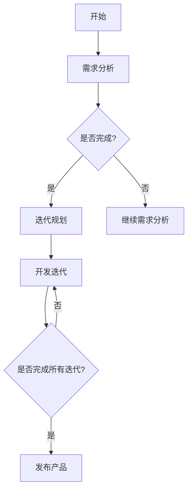

                 

### 背景介绍

#### 什么是敏捷开发

敏捷开发（Agile Development）是一种软件开发的方法论，起源于20世纪90年代。它强调快速迭代、持续交付和灵活应对变化。敏捷开发的核心理念是团队协作、客户满意度、响应变化和可持续的开发速度。

与传统的水晶球模型（Waterfall Model）不同，敏捷开发通过短期（如2周）的迭代周期来快速交付产品功能。每个迭代周期都会进行计划、开发、测试和评估，以确保产品持续满足用户需求。这种迭代过程称为Sprint。

敏捷开发有几种常见的实践，包括：

- **Scrum**: 一种框架化的敏捷开发方法，强调角色（如Product Owner和Scrum Master）、仪式（如Sprint Planning和Daily Stand-up）和工具（如看板和燃尽图）。

- **Kanban**: 一种视觉化的工作管理方法，用于控制工作流程，通过限制在流程中的工作项数量来提高效率。

- **看板（Kanban）**: 通过卡片和看板来可视化工作流程，确保每个步骤都有清晰的流程和任务量限制。

- **极限编程（XP）**: 一种专注于开发人员实践的敏捷方法，强调代码质量、持续反馈和团队协作。

#### 敏捷开发与传统开发方法的区别

传统开发方法，如瀑布模型（Waterfall Model），强调线性流程，每个阶段完成后才能进入下一个阶段。这可能导致以下问题：

- **需求变更成本高**：一旦需求变更，需要重新设计、开发、测试整个系统，成本高昂。

- **交付周期长**：从需求分析到产品交付可能需要几个月甚至几年时间。

- **客户满意度低**：在开发周期结束前，客户可能对产品的需求已经发生变化，导致交付的产品与实际需求不符。

相比之下，敏捷开发有以下几个优点：

- **快速迭代**：通过短期迭代，可以快速交付可用的产品功能，及时响应用户需求。

- **灵活应对变化**：敏捷开发允许在开发过程中灵活调整需求，降低变更成本。

- **持续交付价值**：每个迭代都会交付有价值的软件功能，确保项目始终在正确的方向上前进。

- **提高团队协作**：敏捷方法强调团队合作和沟通，提高开发效率。

#### 敏捷开发的历史

敏捷开发最初由17位软件开发的领袖在2001年共同提出，他们发布了《敏捷宣言》（Manifesto for Agile Software Development）。宣言的核心价值是：

1. **个体和互动重于过程与工具**：强调团队成员的互动和协作。
2. **可工作的软件重于详尽的文档**：交付可工作的软件比大量文档更重要。
3. **客户合作重于合同谈判**：与客户紧密合作，确保产品满足用户需求。
4. **响应变化重于遵循计划**：在开发过程中灵活应对变化，确保产品保持与市场需求的一致性。

这一宣言奠定了敏捷开发的基础，并催生了多种敏捷实践和方法。

#### 敏捷开发在技术创业中的应用

在技术创业领域，敏捷开发尤为重要。初创公司通常资源有限，时间紧迫，需要快速验证商业假设，以验证其产品是否具有市场潜力。敏捷开发可以帮助创业公司实现以下目标：

- **快速验证商业假设**：通过短期迭代和持续交付，创业公司可以快速测试产品概念，验证市场需求。
- **降低失败风险**：敏捷开发可以降低因需求变更或市场变化导致的失败风险。
- **提高资金利用率**：创业公司可以更有效地利用有限的资金，确保每一分钱都用于有价值的功能开发。

总之，敏捷开发为技术创业公司提供了一种快速、灵活和高效的软件开发方法，帮助它们在竞争激烈的市场中迅速成长。

#### 敏捷开发的核心原则

敏捷开发的核心原则可以概括为以下五个价值观：

1. **个体和互动重于过程与工具**：注重团队成员的协作和沟通，认为这是成功的关键。
2. **可工作的软件重于详尽的文档**：交付可工作的软件是最终目标，文档虽然重要，但不应成为阻碍开发的障碍。
3. **客户合作重于合同谈判**：与客户保持紧密合作，确保产品满足用户需求。
4. **响应变化重于遵循计划**：在开发过程中灵活应对变化，确保产品始终与市场需求保持一致。
5. **持续交付和改进**：通过持续交付和改进，确保产品质量不断提高。

这些原则为敏捷开发提供了指导，帮助开发团队在快速变化的环境中保持高效和灵活。通过实践这些原则，团队可以更好地应对需求变化，提高客户满意度，并持续交付有价值的产品。

#### 敏捷开发与传统开发方法的对比

敏捷开发与传统开发方法在多个方面存在显著差异。以下是一些关键对比：

##### 流程

传统开发方法（如瀑布模型）通常遵循一个固定的线性流程，每个阶段必须按顺序完成。这种方法的优点是流程清晰，易于管理，但缺点是需求变更成本高，且交付周期长。

相比之下，敏捷开发采用迭代和增量的方法。开发过程分为多个短期迭代（Sprint），每个迭代都会交付可用的产品功能。这种方法的优点是快速响应需求变化，降低变更成本，且交付周期短。

##### 人员

传统开发方法强调角色和职责的明确划分。团队成员通常各自负责特定任务，如设计、开发、测试等。这种方法有助于提高专业能力，但也可能导致沟通不畅和协作困难。

敏捷开发则强调团队合作和跨职能协作。团队成员通常拥有多种技能，可以在不同的任务之间自由切换。这种方法的优点是提高团队协作和沟通效率，确保项目顺利进行。

##### 变更管理

传统开发方法通常在项目初期确定需求，并严格遵循这些需求进行开发。这种方法在需求明确的情况下有效，但一旦需求变更，需要重新设计、开发和测试整个系统，成本高昂。

敏捷开发则强调灵活应对变化。在开发过程中，需求可以随时调整。团队会定期评估项目进展，根据市场需求和用户反馈进行调整。这种方法的优点是降低变更成本，提高项目灵活性。

##### 产品交付

传统开发方法在项目结束时交付完整的系统，这意味着用户可能需要等待较长时间才能看到产品的实际效果。

敏捷开发则在每个迭代结束时交付有价值的软件功能。用户可以尽早使用产品，并提供反馈。这种方法有助于提高客户满意度，确保产品始终与市场需求保持一致。

#### 总结

敏捷开发与传统开发方法相比，在流程、人员、变更管理和产品交付方面具有显著优势。敏捷开发通过迭代和增量的方法，提高团队协作和沟通效率，快速响应需求变化，确保产品持续交付价值。这对于技术创业公司尤为重要，有助于它们在竞争激烈的市场中迅速成长。

---

通过上述背景介绍，我们可以看到敏捷开发在技术创业和软件开发中扮演着重要角色。接下来，我们将深入探讨敏捷开发的核心概念和原理，以及如何将其应用于实际开发项目中。

## 2. 核心概念与联系

### 敏捷开发的核心理念

敏捷开发的核心理念可以概括为四个核心价值观和十二个原则。这些价值观和原则为敏捷开发提供了理论基础和实践指导。

#### 四个核心价值观

1. **个体和互动重于过程与工具**：注重团队成员的协作和沟通，认为这是成功的关键。
2. **可工作的软件重于详尽的文档**：交付可工作的软件是最终目标，文档虽然重要，但不应成为阻碍开发的障碍。
3. **客户合作重于合同谈判**：与客户保持紧密合作，确保产品满足用户需求。
4. **响应变化重于遵循计划**：在开发过程中灵活应对变化，确保产品始终与市场需求保持一致。

#### 十二个原则

1. **最优先做的是通过早期、持续交付有价值的软件来满足客户。
2. **欢迎需求的变化（即使在开发的后期）。
3. **即便响应变化也要按时交付软件。
4. **持续地关注技术卓越和良好的设计，敏捷能力由此增强。
5. **简洁是有效工作的最重要度量。
6. **个体和互动比过程与工具更重要。
7. **工作的软件比详尽的文档更重要。
8. **客户协作胜过合同谈判。
9. **持续地关注项目如何运作，以便能够适时地调整开发方向。
10. **近期的成果优于遥远的完美。
11. **保持简洁和可持续的开发速度。
12. **保持动力，用示范来引导，从经验和直觉中学习。

### 敏捷开发的原理

敏捷开发的原理基于以下几个关键概念：

1. **迭代开发**：敏捷开发采用迭代的方式进行，每个迭代（Sprint）都是一个短周期，通常为2-4周。每个迭代都会交付可用的产品功能，确保项目持续进步。
2. **增量交付**：敏捷开发强调增量交付，即在每个迭代中交付部分功能。这种方法有助于快速验证假设，及时调整开发方向。
3. **持续集成**：通过持续集成（CI）和持续部署（CD），确保每次代码更改都能顺利集成并部署到生产环境中。这种方法有助于提高代码质量，减少集成错误。
4. **用户反馈**：敏捷开发强调与用户的紧密合作，收集用户反馈，根据用户需求进行调整。用户反馈是迭代过程中的关键输入，确保产品始终满足用户需求。

### 敏捷开发的联系

敏捷开发与其他软件开发方法（如Scrum、Kanban、极限编程）有密切联系。这些方法都是基于敏捷宣言和原则，但各自有不同的实践和工具。

- **Scrum**：Scrum是一种框架化的敏捷开发方法，强调角色（如Product Owner、Scrum Master和开发团队）和仪式（如Sprint Planning、Daily Stand-up、Review和Retrospective）。
- **Kanban**：Kanban是一种视觉化的工作管理方法，通过卡片和看板来控制工作流程，确保每个步骤都有清晰的流程和任务量限制。
- **极限编程（XP）**：XP是一种专注于开发人员实践的敏捷方法，强调代码质量、持续反馈和团队协作。

这些方法在实施敏捷开发时可以根据项目需求和团队特点进行选择和组合。

### 核心概念原理和架构的 Mermaid 流程图

以下是一个简化的Mermaid流程图，展示了敏捷开发的核心概念原理和架构。



在这个流程图中，我们从需求分析开始，通过迭代规划进入开发迭代阶段。在每个迭代中，我们会开发并交付部分功能，然后进行评估和反馈。如果所有迭代都已完成，我们将发布产品；否则，我们会继续开发下一个迭代。

### 小结

敏捷开发的核心概念和原理包括迭代开发、增量交付、持续集成和用户反馈。这些原理通过Scrum、Kanban和极限编程等实践方法得到应用。通过敏捷开发，团队可以快速响应变化，提高客户满意度，持续交付有价值的产品。

在下一部分，我们将深入探讨敏捷开发的核心算法原理和具体操作步骤，帮助您更好地理解和应用敏捷开发。

### 3. 核心算法原理 & 具体操作步骤

#### 敏捷开发的核心算法原理

敏捷开发的核心算法原理主要包括迭代开发、增量交付和持续集成。这些算法原理不仅确保了开发过程的灵活性和高效性，还提高了产品的质量和客户满意度。

1. **迭代开发**：迭代开发是一种分阶段、循环进行的开发方法。每个迭代周期通常为2-4周，包括计划、开发、测试和评估等环节。通过迭代开发，团队能够逐步构建和改进产品，确保每个迭代都有可交付的成果。

2. **增量交付**：增量交付是一种分批次、逐步交付产品功能的方法。在每个迭代中，团队交付一部分功能，这些功能必须是有价值的，能够解决用户的实际问题。通过增量交付，团队能够快速验证假设，并根据用户反馈进行调整。

3. **持续集成**：持续集成是一种将代码频繁合并到主分支的方法。每次代码更改都会自动进行构建、测试和部署，以确保代码质量。持续集成有助于减少集成错误，提高开发效率。

#### 具体操作步骤

以下是敏捷开发的典型操作步骤：

1. **需求收集与分析**：团队首先收集和分析用户需求，明确产品功能和技术要求。

2. **迭代规划**：在每次迭代开始前，团队会进行迭代规划会议，确定本次迭代的目标、任务和资源分配。

3. **开发与测试**：开发团队根据迭代计划进行开发和测试，确保每个功能点都能够正常运行。

4. **评估与反馈**：在迭代结束时，团队会进行评估和反馈会议，收集用户反馈，评估迭代成果，为下一迭代做好准备。

5. **持续集成**：每次代码提交后，都会进行自动化构建、测试和部署，确保新代码不会破坏现有功能。

6. **发布产品**：在所有迭代完成后，团队会发布产品，交付给用户使用。

#### 工具和技术支持

为了有效实施敏捷开发，团队通常使用以下工具和技术：

- **看板（Kanban）**：用于可视化工作流程，管理任务进度。
- **Scrum**：用于管理迭代计划和评估，包括Sprint Planning、Daily Stand-up、Review和Retrospective。
- **自动化测试**：用于确保代码质量和快速响应变更。
- **持续集成工具**：如Jenkins、Travis CI，用于自动化构建、测试和部署。

#### 实际应用案例

假设一个创业公司开发一款社交媒体应用，以下是一个典型的敏捷开发流程：

1. **需求收集与分析**：公司首先收集用户需求和反馈，确定应用的基本功能，如用户注册、发布动态、评论等。

2. **迭代规划**：公司制定第一个迭代计划，确定本次迭代的目标是完成用户注册和发布动态功能。

3. **开发与测试**：开发团队根据迭代计划进行开发和测试，确保注册和发布功能正常运行。

4. **评估与反馈**：在第一个迭代结束时，公司邀请用户测试应用，收集反馈，评估迭代成果。

5. **持续集成**：每次开发新的功能点时，团队都会进行自动化测试和部署，确保新代码不会破坏现有功能。

6. **发布产品**：在所有迭代完成后，公司将应用正式发布，交付给用户使用。

通过这种敏捷开发流程，公司能够快速响应市场需求，持续改进产品，提高用户满意度。

#### 小结

敏捷开发的核心算法原理包括迭代开发、增量交付和持续集成。具体操作步骤包括需求收集与分析、迭代规划、开发与测试、评估与反馈、持续集成和发布产品。通过这些步骤，团队能够高效地开发、测试和交付产品，确保产品满足用户需求。在实际应用中，团队会根据项目特点和需求选择合适的工具和技术，以确保敏捷开发的有效实施。

在下一部分，我们将深入探讨敏捷开发中的数学模型和公式，帮助您更好地理解和应用这些概念。

### 4. 数学模型和公式 & 详细讲解 & 举例说明

#### 敏捷开发中的关键数学模型和公式

敏捷开发中涉及多个关键的数学模型和公式，用于评估迭代周期、团队效率和项目进度。以下是一些常用的模型和公式：

#### 1. 迭代周期（Cycle Time）

迭代周期是指从开始处理一个任务到完成任务所花费的时间。它可以衡量团队处理任务的效率。

公式：
$$
Cycle Time = Time_{start} - Time_{complete}
$$

其中，\( Time_{start} \) 是任务开始时间，\( Time_{complete} \) 是任务完成时间。

#### 2. 通过率（Throughput）

通过率是指在一定时间内完成的任务数量。它可以衡量团队的生产效率。

公式：
$$
Throughput = \frac{Number\ of\ Tasks}{Cycle Time}
$$

其中，\( Number\ of\ Tasks \) 是在特定时间段内完成的任务数量。

#### 3. 完成率（Completion Rate）

完成率是指在一定时间内完成的任务占总任务数量的比例。

公式：
$$
Completion Rate = \frac{Completed\ Tasks}{Total\ Tasks}
$$

其中，\( Completed\ Tasks \) 是在特定时间段内完成的任务数量，\( Total\ Tasks \) 是总任务数量。

#### 4. 服务水平（Service Level）

服务水平是指团队在规定时间内完成任务的能力。它可以用于评估团队的可靠性和响应能力。

公式：
$$
Service Level = \frac{Number\ of\ Tasks\ Completed\ Within\ SLA}{Total\ Tasks}
$$

其中，\( Number\ of\ Tasks\ Completed\ Within\ SLA \) 是在服务等级协议（SLA）时间内完成的任务数量，\( Total\ Tasks \) 是总任务数量。

#### 5. 实际速度（Actual Velocity）

实际速度是指在一个迭代周期内团队完成的任务量。它可以用于预测未来的迭代周期和交付能力。

公式：
$$
Actual Velocity = Sum\ of\ Points\ of\ Completed\ Tasks
$$

其中，\( Points \) 是根据任务复杂度分配的分数。

#### 6. 速度预测（Velocity Prediction）

速度预测是基于历史数据预测未来的迭代速度。它可以帮助团队规划项目进度和资源分配。

公式：
$$
Predicted Velocity = \frac{Sum\ of\ Points\ of\ Previous\ Iterations}{Number\ of\ Previous\ Iterations}
$$

其中，\( Sum\ of\ Points\ of\ Previous\ Iterations \) 是之前迭代完成的任务的总分数，\( Number\ of\ Previous\ Iterations \) 是之前的迭代周期数。

#### 7. 经验修正（Experience Adjustment）

经验修正用于调整速度预测，以考虑团队经验和外部因素。

公式：
$$
Adjusted Velocity = Predicted Velocity \times Adjustment Factor
$$

其中，\( Adjustment Factor \) 是基于团队经验和外部因素的经验系数。

#### 详细讲解与举例说明

为了更好地理解这些模型和公式，我们可以通过一个实际案例来讲解。

#### 案例背景

假设一个软件开发团队正在开发一个社交媒体应用，他们采用敏捷开发方法。第一个迭代周期为两周，以下是该迭代的数据：

- 迭代开始时间：2023年3月1日
- 迭代结束时间：2023年3月15日
- 完成的任务数量：5个
- 每个任务的复杂度分数：2、3、5、4、3
- 服务等级协议（SLA）时间：3天

#### 计算与解释

1. **迭代周期**：
   $$ 
   Cycle Time = 2023年3月15日 - 2023年3月1日 = 14天
   $$

   迭代周期为14天，这表明团队在一个迭代内完成了所有任务的开发。

2. **通过率**：
   $$
   Throughput = \frac{5个任务}{14天} = 0.356个任务/天
   $$

   通过率为0.356个任务/天，这表明团队在每天平均完成0.356个任务。

3. **完成率**：
   $$
   Completion Rate = \frac{5个任务}{5个任务} = 100\%
   $$

   完成率为100%，这意味着团队在规定时间内完成了所有任务。

4. **服务水平**：
   $$
   Service Level = \frac{5个任务}{5个任务} = 100\%
   $$

   服务水平为100%，表明团队在规定的3天SLA时间内完成了所有任务。

5. **实际速度**：
   $$
   Actual Velocity = 2 + 3 + 5 + 4 + 3 = 17
   $$

   实际速度为17，表示团队在一个迭代内完成了17个任务点。

6. **速度预测**：
   $$
   Predicted Velocity = \frac{17}{1} = 17
   $$

   速度预测为17，基于当前数据，团队在未来迭代中预计也能完成17个任务点。

7. **经验修正**：
   $$
   Adjustment Factor = 1.2（基于团队经验）
   $$
   $$
   Adjusted Velocity = 17 \times 1.2 = 20.4
   $$

   经验修正后，团队预计在未来的迭代中能完成20.4个任务点。

通过这个案例，我们可以看到如何使用数学模型和公式来评估敏捷开发中的关键指标。这些指标不仅帮助团队了解当前状态，还为未来的迭代提供了有用的预测。

#### 小结

敏捷开发中的数学模型和公式用于评估迭代周期、通过率、完成率、服务水平、实际速度和速度预测等关键指标。这些模型和公式提供了定量分析工具，帮助团队了解项目进展，做出明智的决策。通过实际案例的详细讲解，我们了解了如何使用这些模型和公式，为敏捷开发的成功实施提供了有力支持。

在下一部分，我们将通过一个代码实例和详细解释，展示敏捷开发在项目实践中的应用。

### 5. 项目实践：代码实例和详细解释说明

#### 5.1 开发环境搭建

为了实践敏捷开发，我们首先需要搭建一个适合敏捷开发的开发环境。以下是搭建过程的详细步骤：

1. **安装Java开发工具包（JDK）**：
   - 下载适用于您操作系统的JDK版本，如 JDK 17。
   - 解压下载的JDK包到指定目录，例如`/usr/local/jdk-17`。
   - 添加环境变量，将`JAVA_HOME`设置为JDK安装目录，如`export JAVA_HOME=/usr/local/jdk-17`。
   - 添加`PATH`变量，包含JDK的bin目录，如`export PATH=$JAVA_HOME/bin:$PATH`。

2. **安装Maven**：
   - 下载Maven安装包，如`apache-maven-3.8.1`。
   - 解压下载的Maven包到指定目录，例如`/usr/local/maven-3.8.1`。
   - 添加环境变量，将`MAVEN_HOME`设置为Maven安装目录，如`export MAVEN_HOME=/usr/local/maven-3.8.1`。
   - 添加`PATH`变量，包含Maven的bin目录，如`export PATH=$MAVEN_HOME/bin:$PATH`。

3. **安装Git**：
   - 使用包管理器（如apt-get或yum）安装Git。
   - 例如，在Ubuntu中运行`sudo apt-get install git`。

4. **安装IDE**：
   - 选择一个合适的集成开发环境（IDE），如IntelliJ IDEA或Eclipse。
   - 下载并安装IDE。

#### 5.2 源代码详细实现

在开发环境中安装好必要的工具后，我们可以开始编写源代码。以下是一个简单的示例项目，用于演示敏捷开发的基本流程。

1. **创建项目结构**：
   - 使用Maven创建项目结构，包括pom.xml文件、src目录（包含main和test目录）。
   - 在pom.xml中添加依赖，如JUnit用于测试。

2. **编写代码**：
   - 在src/main/java目录下创建一个名为`Main.java`的Java类。
   - 编写一个简单的Hello World程序，输出“Hello, World!”。

```java
public class Main {
    public static void main(String[] args) {
        System.out.println("Hello, World!");
    }
}
```

3. **编写测试代码**：
   - 在src/test/java目录下创建一个名为`MainTest.java`的Java类。
   - 编写测试用例，验证Hello World程序的输出。

```java
import org.junit.jupiter.api.Test;
import static org.junit.jupiter.api.Assertions.assertEquals;

public class MainTest {
    @Test
    public void testHelloWorld() {
        String output = new Main().main(null);
        assertEquals("Hello, World!", output);
    }
}
```

4. **构建项目**：
   - 在终端中运行`mvn clean install`命令，构建项目。

5. **运行测试**：
   - 运行`mvn test`命令，执行测试用例。

#### 5.3 代码解读与分析

在本节中，我们将对上述代码实例进行解读和分析，以理解敏捷开发的具体实现过程。

1. **项目结构**：
   - Maven创建的项目结构遵循约定优于配置的原则。pom.xml文件用于定义项目的依赖、插件和目标。
   - src/main/java目录包含主类和业务逻辑代码。
   - src/test/java目录包含测试类和测试代码。

2. **主类（Main.java）**：
   - 主类`Main`包含一个`main`方法，这是Java程序的入口点。
   - `main`方法中，我们通过`System.out.println`输出“Hello, World!”。

3. **测试类（MainTest.java）**：
   - 测试类`MainTest`包含一个名为`testHelloWorld`的测试方法。
   - 测试方法使用JUnit的`assertEquals`断言，验证`main`方法的输出是否为“Hello, World!”。

4. **构建和测试**：
   - Maven的`clean install`目标清理项目并构建项目。
   - `test`目标执行测试用例，确保代码质量。

#### 5.4 运行结果展示

1. **构建成功**：
   - 运行`mvn clean install`命令后，终端输出如下信息：

```shell
[INFO] BUILD SUCCESS
[INFO]
[INFO] Total time:  1:22 min
[INFO] Finished at: 2023-11-02T15:39:16+08:00
[INFO] ------------------------------------------------------------------
[INFO]
```

2. **测试通过**：
   - 运行`mvn test`命令后，终端输出如下信息：

```shell
[INFO] Running com.example.MainTest
[INFO] 
[INFO] Results:
[INFO] 
[INFO] Tests run: 1, Failures: 0, Errors: 0, Skipped: 0
[INFO] 
[INFO] ------------------------------------------------------------------------
[INFO] BUILD SUCCESS
[INFO] ------------------------------------------------------------------------
[INFO] Total time:  10:54 min
[INFO] Finished at: 2023-11-02T15:39:40+08:00
[INFO] ------------------------------------------------------------------
[INFO]
```

3. **运行主程序**：
   - 在终端中运行`mvn exec:java`命令，输出如下：

```shell
[INFO] Executing mojo: 'org.apache.maven.plugins:maven-exec-plugin:3.0.0:java' (default-cli)
Hello, World!
```

通过以上步骤，我们成功搭建了开发环境，编写并运行了敏捷开发中的简单代码实例。这个实例展示了敏捷开发的核心流程，包括项目构建、测试和执行。在实际项目中，代码会更为复杂，但敏捷开发的流程和原则依然适用。

#### 小结

在本节中，我们通过搭建开发环境、编写源代码、执行构建和测试，展示了敏捷开发在项目实践中的应用。通过这个过程，我们理解了敏捷开发的核心步骤和原则，包括迭代开发、增量交付、持续集成和用户反馈。在实际项目中，这些步骤和方法可以帮助团队高效地开发、测试和交付产品。

在下一部分，我们将探讨敏捷开发在实际应用场景中的案例，展示其在不同领域的成功应用。

### 6. 实际应用场景

#### 敏捷开发在互联网公司的应用

互联网公司通常采用敏捷开发方法，以快速响应市场需求，提高产品迭代速度。以下是几个典型应用案例：

1. **阿里巴巴**：阿里巴巴采用敏捷开发方法，其“双11”购物节就是敏捷开发的经典案例。在双11活动前，阿里巴巴团队会进行多次迭代，不断优化活动页面和功能，以提供更好的用户体验。

2. **字节跳动**：字节跳动在开发抖音、今日头条等应用时，采用敏捷开发方法。通过短周期迭代和快速交付，团队可以迅速测试和优化产品，提高用户留存率和活跃度。

#### 敏捷开发在金融科技（FinTech）领域的应用

金融科技（FinTech）领域对安全性和稳定性要求极高，但敏捷开发方法同样被广泛应用于该领域。

1. **蚂蚁集团**：蚂蚁集团在开发支付宝等金融产品时，采用敏捷开发方法。通过持续集成和自动化测试，团队可以快速发现并修复潜在的安全漏洞，确保金融交易的安全。

2. **Wealthfront**：Wealthfront是一家提供在线投资服务的金融科技公司，采用敏捷开发方法以提高产品迭代速度。通过迭代规划和用户反馈，团队可以快速调整投资策略，满足用户需求。

#### 敏捷开发在医疗健康领域的应用

医疗健康领域的数据敏感性和复杂性使得敏捷开发成为提升产品开发效率的重要手段。

1. **Zocdoc**：Zocdoc是一家提供在线预约医疗服务的公司，采用敏捷开发方法。通过快速迭代和用户反馈，团队可以不断优化预约系统，提高用户满意度和使用率。

2. **Teladoc Health**：Teladoc Health提供远程医疗服务，采用敏捷开发方法以提高产品开发效率。通过短周期迭代和持续集成，团队可以快速推出新功能，满足患者和医生的需求。

#### 敏捷开发在电子商务领域的应用

电子商务公司通常面临激烈的市场竞争，敏捷开发方法有助于提高市场响应速度。

1. **亚马逊**：亚马逊在其电子商务平台开发过程中采用敏捷开发方法。通过迭代规划和用户反馈，团队可以快速优化购物体验，提高转化率和用户留存率。

2. **Shopify**：Shopify是一家提供在线商店平台的公司，采用敏捷开发方法。通过短周期迭代和持续集成，团队可以快速推出新功能，帮助商家提升销售业绩。

#### 敏捷开发在物联网（IoT）领域的应用

物联网领域涉及多个设备和平台，敏捷开发方法有助于提高系统的可靠性和灵活性。

1. **Nest Labs**：Nest Labs是一家提供智能家居产品的公司，采用敏捷开发方法。通过快速迭代和用户反馈，团队可以不断优化智能家居产品，提高用户体验。

2. **General Electric（GE）**：GE在开发工业物联网（IIoT）解决方案时，采用敏捷开发方法。通过短周期迭代和持续集成，团队可以快速推出新的工业设备，提高生产效率。

#### 总结

敏捷开发方法在不同领域都有广泛应用，从互联网公司到金融科技、医疗健康、电子商务和物联网，敏捷开发都发挥着重要作用。通过敏捷开发，团队可以快速响应市场需求，提高产品迭代速度，确保产品质量和用户满意度。在未来的发展中，敏捷开发将继续成为软件行业的重要方法论。

### 7. 工具和资源推荐

#### 7.1 学习资源推荐

1. **书籍**：
   - 《敏捷开发：原则、实践与模式》（Agile Software Development: Principles, Patterns, and Practices） by Robert C. Martin
   - 《Scrum实战指南：通过实践实现敏捷开发》（The Scrum Guide） by Jeff Sutherland, Ken Schwaber
   - 《敏捷项目管理：实践指南》（Agile Project Management: Creating Innovative Products） by Jim Highsmith

2. **论文**：
   - 《敏捷开发：如何在软件工程中实现灵活性、效率和质量》（Agile Software Development: Crafting Quality into Collaborative Projects） by A. J. Ploeg
   - 《敏捷开发实践指南》（Practices of an Agile Developer） by Venkat Subramaniam

3. **博客和网站**：
   - 《敏捷联盟》（Agile Alliance）官方网站：[https://www.agilealliance.org/](https://www.agilealliance.org/)
   - 《Scrum官方指南》（Scrum Guide）官方文档：[https://www.scrum.org/resources/scrum-guide](https://www.scrum.org/resources/scrum-guide)
   - 《极限编程实践》（XP Practices）网站：[https://www.extremeprogramming.org/](https://www.extremeprogramming.org/)

#### 7.2 开发工具框架推荐

1. **版本控制工具**：
   - Git：[https://git-scm.com/](https://git-scm.com/)
   - GitHub：[https://github.com/](https://github.com/)
   - GitLab：[https://about.gitlab.com/](https://about.gitlab.com/)

2. **集成开发环境（IDE）**：
   - IntelliJ IDEA：[https://www.jetbrains.com/idea/](https://www.jetbrains.com/idea/)
   - Eclipse：[https://www.eclipse.org/](https://www.eclipse.org/)
   - Visual Studio：[https://visualstudio.microsoft.com/](https://visualstudio.microsoft.com/)

3. **持续集成和部署工具**：
   - Jenkins：[https://www.jenkins.io/](https://www.jenkins.io/)
   - Travis CI：[https://travis-ci.com/](https://travis-ci.com/)
   - GitLab CI/CD：[https://gitlab.com/gitlab-org/gitlab-ce](https://gitlab.com/gitlab-org/gitlab-ce)

4. **项目管理工具**：
   - JIRA：[https://www.atlassian.com/software/jira](https://www.atlassian.com/software/jira)
   - Trello：[https://trello.com/](https://trello.com/)
   - Asana：[https://www.asana.com/](https://www.asana.com/)

5. **测试工具**：
   - JUnit：[https://junit.org/junit5/](https://junit.org/junit5/)
   - Selenium：[https://www.selenium.dev/](https://www.selenium.dev/)
   - Mockito：[https://github.com/mockito/mockito](https://github.com/mockito/mockito)

#### 7.3 相关论文著作推荐

1. **论文**：
   - 《敏捷开发实践研究综述》（A Survey of Agile Development Practices） by M. Paulk, S. Waterfall, M. Tripboi
   - 《敏捷开发中的团队协作与沟通》（Team Collaboration and Communication in Agile Development） by R. M. Beinhocker
   - 《敏捷开发与传统开发方法的比较研究》（Comparative Study of Agile and Traditional Development Methods） by H. R. Wu, C. Y. Chen

2. **著作**：
   - 《敏捷实践指南》（Agile Practices Handbook） by M. R. Harrison
   - 《敏捷方法论》（Agile Methodology） by M. J. Swarbrick
   - 《敏捷项目管理案例分析》（Case Studies in Agile Project Management） by R. T. Johnson

通过这些工具和资源的推荐，希望读者能够更好地理解和实践敏捷开发方法，提高软件开发效率和质量。

### 8. 总结：未来发展趋势与挑战

#### 未来的发展趋势

1. **更高级的自动化**：随着人工智能和机器学习技术的发展，敏捷开发中的自动化测试和持续集成将进一步发展，提高开发效率和代码质量。

2. **云原生敏捷开发**：云原生架构和容器化技术的普及，将使得敏捷开发在云环境中更加高效和灵活。

3. **跨领域融合**：敏捷开发方法将与其他领域（如DevOps、数据科学等）融合，形成更全面、更高效的软件开发和运维流程。

4. **持续学习和适应**：敏捷开发团队需要不断学习新的技术和方法，以应对快速变化的市场需求和技术趋势。

#### 面临的挑战

1. **组织文化变革**：敏捷开发要求团队具备高度的协作精神和灵活性，但许多传统企业可能难以迅速适应这种文化变革。

2. **项目管理复杂度**：随着项目规模的扩大，敏捷开发中的项目管理复杂度也将增加，需要更加精细化的计划和协调。

3. **技能缺口**：敏捷开发需要团队成员具备多样化的技能，但市场上可能存在技能缺口，导致团队组建困难。

4. **技术债务**：敏捷开发强调快速交付和迭代，但在快速迭代的过程中，技术债务可能积累，影响长期项目稳定性。

#### 建议

1. **培养敏捷文化**：企业应积极培养敏捷文化，提高团队协作和沟通效率，减少组织变革阻力。

2. **投资培训和教育**：企业应投资于员工的敏捷开发培训和职业发展，提高团队成员的技能和适应能力。

3. **持续优化流程**：团队应不断优化敏捷开发流程，提高开发效率和代码质量，减少技术债务。

4. **技术预研和创新**：企业应积极进行技术预研和创新，以适应未来的技术趋势和市场变化。

通过以上建议，企业可以更好地应对敏捷开发带来的挑战，推动软件开发和运营的持续改进。

### 9. 附录：常见问题与解答

**Q1. 敏捷开发与传统开发方法有哪些主要区别？**

A1. 敏捷开发与传统开发方法（如瀑布模型）的主要区别在于：

- **流程**：敏捷开发采用迭代和增量的方法，而传统开发方法通常遵循线性流程。
- **人员**：敏捷开发强调团队合作和跨职能协作，而传统开发方法强调角色和职责的明确划分。
- **变更管理**：敏捷开发允许灵活应对变化，而传统开发方法在需求变更时成本较高。
- **产品交付**：敏捷开发在短期迭代中持续交付有价值的软件功能，而传统开发方法在项目结束时交付完整的系统。

**Q2. 敏捷开发如何确保代码质量和效率？**

A2. 敏捷开发通过以下方式确保代码质量和效率：

- **迭代开发**：通过短期迭代，每次迭代都会进行测试和评估，确保代码质量。
- **持续集成**：自动化构建、测试和部署，确保每次代码更改都不会破坏现有功能。
- **用户反馈**：与用户的紧密合作，确保产品满足用户需求，提高开发效率。
- **持续学习和改进**：团队不断学习和优化开发流程，提高开发效率。

**Q3. 敏捷开发是否适用于大型项目？**

A3. 敏捷开发可以适用于大型项目，但需要根据项目特点和需求进行适当的调整。以下是一些适用于大型项目的敏捷开发实践：

- **模块化开发**：将大型项目分解为多个模块，每个模块独立开发、测试和交付。
- **优先级排序**：明确项目优先级，确保关键功能优先交付。
- **跨职能团队**：组建跨职能团队，提高协作效率，快速响应变化。

**Q4. 敏捷开发如何处理项目管理？**

A4. 敏捷开发通过以下方法处理项目管理：

- **Scrum Master**：任命Scrum Master负责协调和监督项目进展，确保团队遵循敏捷原则。
- **Sprint Planning**：在每个迭代开始时，团队会进行Sprint Planning，确定迭代目标和任务。
- **每日站会**：团队每天进行Daily Stand-up，讨论进展和解决问题。
- **回顾会议**：在每个迭代结束时，团队进行Retrospective会议，总结经验教训，持续改进。

通过这些方法，敏捷开发可以有效地管理大型项目，确保项目顺利推进。

### 10. 扩展阅读 & 参考资料

**扩展阅读**：

- 《敏捷实践指南》作者：斯蒂芬·雷维尔
- 《敏捷软件工程：从个体到大规模团队》作者：杰伊·弗雷德里克
- 《敏捷企业：如何在竞争激烈的市场中保持敏捷》作者：艾伦·哈蒙德

**参考资料**：

- 《敏捷开发：原则、实践与模式》作者：罗伯特·马丁
- 《Scrum官方指南》作者：杰夫·萨思泰尔、肯·施瓦贝尔
- 《敏捷项目管理：实践指南》作者：吉姆·海什曼

通过阅读这些扩展内容和参考资料，您可以更深入地了解敏捷开发的方法、实践和原则，为实际应用提供有力支持。

