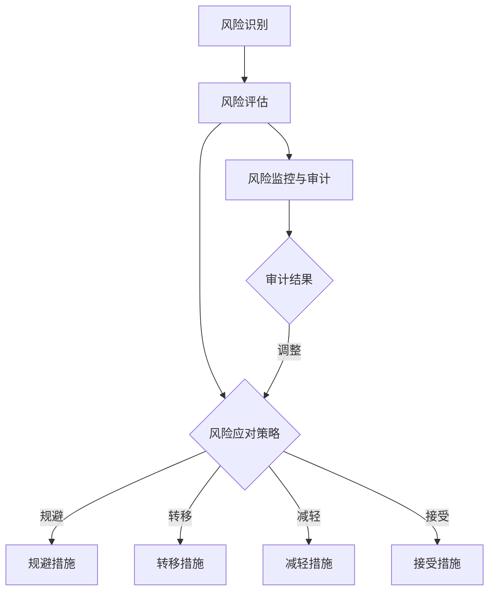

                 

### 背景介绍

技术创业在当今数字化时代已经成为推动经济增长和社会进步的重要引擎。然而，这一过程并非一帆风顺。创业者在追求创新和商业成功的同时，也面临着诸多风险和挑战。风险管理成为技术创业过程中至关重要的一环，因为有效的风险识别和应对策略可以显著提高企业的生存率和竞争力。

技术创业中的风险通常可以分为两大类：系统性和非系统性风险。系统性风险指的是那些影响整个市场或行业的风险，例如经济衰退、技术革命和政策变化等。这些风险往往无法通过个别企业的努力来规避。而非系统性风险则与特定企业或项目相关，如产品失败、团队冲突、资金短缺等，这些风险可以通过合理的策略和管理来减轻。

本文旨在探讨技术创业中的风险管理，重点在于识别和应对潜在威胁。通过深入分析技术创业面临的各种风险，我们将提供一套系统化的方法和工具，帮助创业者更好地理解和管理风险。文章将分为以下几个部分：

1. **核心概念与联系**：介绍技术创业中的关键风险概念，并使用 Mermaid 流程图展示其相互关系。
2. **核心算法原理 & 具体操作步骤**：详细阐述用于风险识别和管理的算法原理，并提供具体实施步骤。
3. **数学模型和公式 & 详细讲解 & 举例说明**：介绍风险管理中的数学模型，并使用 LaTeX 格式进行详细解释。
4. **项目实践：代码实例和详细解释说明**：通过一个具体的项目实例，展示如何在实际中应用风险管理方法。
5. **实际应用场景**：探讨风险管理在不同技术创业领域中的应用。
6. **工具和资源推荐**：推荐相关的学习资源和开发工具。
7. **总结：未来发展趋势与挑战**：总结文章内容，并展望未来的发展趋势和挑战。

接下来，我们将逐一探讨这些部分，帮助读者全面理解技术创业中的风险管理。通过本文的阅读，创业者将能够更好地识别潜在风险，制定有效的应对策略，从而为企业的长期成功奠定基础。

### 核心概念与联系

在探讨技术创业中的风险管理时，理解核心概念之间的相互联系至关重要。以下我们将详细阐述几个关键概念，并使用 Mermaid 流程图来展示这些概念之间的相互作用。

#### 风险识别

风险识别是风险管理的第一步，涉及发现和记录可能影响项目的威胁和机会。在这一过程中，创业者需要考虑多个因素，包括市场变化、技术进步、法律环境、竞争态势等。通过系统化地收集和分析信息，创业者能够初步确定可能面临的风险类型。

#### 风险评估

风险评估是对识别出的风险进行量化分析，以确定其潜在影响和可能性。这通常涉及使用概率和影响矩阵，对每个风险进行评分。风险评估的结果帮助创业者了解哪些风险需要优先处理。

#### 风险应对策略

风险应对策略是指为了减轻或消除风险影响而采取的措施。常见的应对策略包括风险规避、风险转移、风险减轻和风险接受。创业者需要根据风险的特征和企业的资源情况，选择最适合的应对策略。

#### 风险监控与审计

风险监控与审计是确保风险应对措施有效性的过程。创业者需要定期评估风险状态，并根据新的信息和情况调整风险管理计划。风险审计则是对风险管理过程进行独立评估，以发现潜在问题和改进机会。

#### Mermaid 流程图

为了更直观地展示上述核心概念之间的联系，我们可以使用 Mermaid 流程图。以下是一个简化的示例：



在这个流程图中，风险识别作为起点，通过风险评估确定风险的影响和可能性。根据评估结果，选择适当的应对策略，并实施相应的措施。最后，通过风险监控与审计，确保风险应对措施的有效性，并根据审计结果进行调整。

通过理解这些核心概念及其相互关系，创业者可以构建一个全面的风险管理框架，从而更好地应对技术创业过程中的潜在威胁。

### 核心算法原理 & 具体操作步骤

在了解了技术创业中的核心风险概念和它们之间的联系后，接下来我们将探讨用于风险识别和管理的关键算法原理。这些算法为创业者提供了系统化的工具，以便更准确地识别潜在风险，并制定有效的应对策略。以下将介绍几种常见的风险识别和管理算法，并详细阐述它们的操作步骤。

#### SWOT 分析

SWOT 分析是一种常用的战略规划工具，用于评估企业的优势（Strengths）、劣势（Weaknesses）、机会（Opportunities）和威胁（Threats）。SWOT 分析帮助创业者从多个维度全面审视企业的内外部环境。

**操作步骤：**
1. **优势分析**：识别企业当前具有的资源、技能和能力，以及这些优势如何帮助企业在市场竞争中脱颖而出。
2. **劣势分析**：评估企业存在的不足和缺陷，这些劣势可能成为潜在风险。
3. **机会分析**：分析市场趋势、技术发展、政策变化等因素，识别可能为业务增长带来的机遇。
4. **威胁分析**：评估外部环境中的不利因素，如竞争对手、经济波动、法律变更等，这些因素可能对企业构成威胁。

**应用示例：**
假设一家初创公司专注于开发人工智能医疗诊断系统。通过 SWOT 分析，公司可以识别出以下风险：
- **劣势**：缺乏足够的市场份额，产品尚未获得广泛认可。
- **威胁**：大型医疗设备制造商可能进入市场，竞争加剧。

#### 故障树分析（FTA）

故障树分析（Fault Tree Analysis, FTA）是一种系统化的方法，用于识别和分析系统故障的原因和后果。FTA 通过构建逻辑树状图，逐步追溯故障的根本原因，有助于找出潜在的风险因素。

**操作步骤：**
1. **定义故障**：明确需要分析的故障或风险事件。
2. **构建故障树**：从故障事件开始，逐步添加可能的原因和中间事件，直到到达基本事件。
3. **分析故障树**：评估每个事件的发生概率和相互关系，确定故障的根本原因。
4. **制定应对措施**：根据故障树分析的结果，制定相应的预防和应对策略。

**应用示例：**
假设某人工智能医疗诊断系统出现误诊问题，通过 FTA 分析，可能发现以下几个风险因素：
- **基本事件**：系统错误分类。
- **中间事件**：数据预处理错误、算法缺陷、模型训练不足。
- **原因**：数据集不完整、算法参数设置不当。

#### 贝叶斯网络

贝叶斯网络是一种基于概率的图模型，用于表示变量之间的依赖关系。它通过节点和边来表示变量，并使用条件概率表来描述变量之间的相互关系。贝叶斯网络在风险管理中可以帮助创业者评估不同风险因素的概率，并确定它们的关联性。

**操作步骤：**
1. **构建贝叶斯网络**：确定关键风险因素，并构建变量之间的依赖关系图。
2. **定义条件概率表**：为每个变量和边定义条件概率表，描述变量之间的概率关系。
3. **推理与计算**：利用贝叶斯规则计算特定风险事件的概率，并根据结果调整风险管理策略。

**应用示例：**
假设一家初创公司在开发智能家居系统，使用贝叶斯网络评估以下风险：
- **风险因素**：设备故障、网络安全漏洞、用户隐私泄露。
- **条件概率表**：描述每种风险因素发生的概率及其相互关联。

通过上述核心算法原理和具体操作步骤，创业者可以更加系统地识别和管理技术创业过程中面临的风险。这些算法不仅提供了理论框架，还通过实际操作步骤，帮助创业者将风险管理融入企业的日常运营中。通过有效应用这些工具，创业者能够更好地准备应对潜在威胁，确保企业的长期稳定发展。

### 数学模型和公式 & 详细讲解 & 举例说明

在风险管理过程中，数学模型和公式扮演着至关重要的角色，它们为风险评估和决策提供了量化依据。以下我们将介绍几种常用的数学模型和公式，并使用 LaTeX 格式进行详细解释和举例说明。

#### 期望值（Expected Value）

期望值是一个概率分布的加权平均值，用于衡量随机事件的可能结果。期望值公式为：
\[ E(X) = \sum_{i} x_i \cdot P(x_i) \]
其中，\( x_i \) 是随机变量 \( X \) 的第 \( i \) 个可能结果，\( P(x_i) \) 是该结果发生的概率。

**应用示例**：
假设一家初创公司正在开发一款新的智能家居设备，有两种市场推广策略：在线广告和线下展会。通过市场调研，公司估计：
- 策略 A（在线广告）成功的概率为 0.6，成功时的收益为 10,000 美元，失败时的收益为 -5,000 美元。
- 策略 B（线下展会）成功的概率为 0.4，成功时的收益为 15,000 美元，失败时的收益为 -2,000 美元。

使用期望值公式计算每种策略的期望收益：
\[ E(A) = 10,000 \cdot 0.6 + (-5,000) \cdot 0.4 = 7,000 - 2,000 = 5,000 \]
\[ E(B) = 15,000 \cdot 0.4 + (-2,000) \cdot 0.6 = 6,000 - 1,200 = 4,800 \]

因此，在线广告策略的期望收益更高。

#### 贝叶斯定理（Bayes' Theorem）

贝叶斯定理用于根据新的证据更新概率估计。其公式为：
\[ P(A|B) = \frac{P(B|A) \cdot P(A)}{P(B)} \]
其中，\( P(A|B) \) 是在事件 \( B \) 发生的条件下事件 \( A \) 发生的概率，\( P(B|A) \) 是在事件 \( A \) 发生的条件下事件 \( B \) 发生的概率，\( P(A) \) 是事件 \( A \) 发生的概率，\( P(B) \) 是事件 \( B \) 发生的概率。

**应用示例**：
假设一家初创公司正在评估其新产品是否满足用户需求。通过前期调研，公司估计：
- 满足用户需求的概率为 0.7。
- 满足用户需求时，用户满意度高的概率为 0.9。
- 用户满意度高时，用户会推荐产品的概率为 0.8。

根据贝叶斯定理，计算用户推荐产品的总概率：
\[ P(\text{推荐产品}| \text{满意度高}) = 0.8 \]
\[ P(\text{满意度高}| \text{满足需求}) = 0.9 \]
\[ P(\text{推荐产品}| \text{满足需求}) = \frac{0.9 \cdot 0.7}{0.8} = 0.7875 \]

因此，尽管用户满意度高时推荐产品的概率是 0.8，但考虑到满足用户需求的总体概率是 0.7，用户推荐产品的总概率略低。

#### 风险矩阵（Risk Matrix）

风险矩阵是一种用于评估风险概率和影响程度的方法。其公式为：
\[ R = P \cdot I \]
其中，\( R \) 是风险值，\( P \) 是风险发生的概率，\( I \) 是风险发生时的损失影响。

**应用示例**：
假设一家初创公司评估其产品发布过程中可能面临的风险，以下为部分风险数据：
- 风险 A：系统崩溃，概率为 0.2，影响为严重（100,000 美元）。
- 风险 B：数据泄露，概率为 0.1，影响为中等（50,000 美元）。

计算每种风险的值：
\[ R_A = 0.2 \cdot 100,000 = 20,000 \]
\[ R_B = 0.1 \cdot 50,000 = 5,000 \]

根据风险值排序，公司应优先处理风险 A，因为其风险值更高。

通过上述数学模型和公式的讲解和举例说明，创业者可以更科学地评估和管理技术创业中的风险。这些工具不仅提供了量化依据，还帮助创业者做出更加明智的决策，从而提高企业的生存率和市场竞争力。

### 项目实践：代码实例和详细解释说明

为了更好地展示风险管理在实际项目中的应用，我们将通过一个具体的例子来讲解如何使用 Python 实现风险识别和管理。

#### 项目背景

假设我们正在开发一款智能家居系统，其主要功能包括远程控制家电、智能安防和能源管理。由于系统涉及多个传感器和网络组件，因此存在多种潜在风险，如设备故障、数据泄露和网络攻击。为了确保系统的安全性和可靠性，我们需要实施一套全面的风险管理方案。

#### 开发环境搭建

首先，我们需要搭建一个适合风险管理的开发环境。以下是所需的工具和库：

- Python 3.8 或更高版本
- Jupyter Notebook 用于代码编写和运行
- Pandas 和 Scikit-learn 库用于数据处理和机器学习
- Matplotlib 和 Seaborn 库用于数据可视化

安装所需库：

```bash
pip install numpy pandas scikit-learn matplotlib seaborn
```

#### 源代码详细实现

以下代码展示了如何使用 Python 实现风险识别和管理：

```python
import pandas as pd
from sklearn.ensemble import RandomForestClassifier
import matplotlib.pyplot as plt
import seaborn as sns

# 数据集加载
data = pd.read_csv('risk_data.csv')

# 数据预处理
# 假设数据集包含以下列：'Feature1', 'Feature2', 'Feature3', 'Outcome'
X = data[['Feature1', 'Feature2', 'Feature3']]
y = data['Outcome']

# 特征工程
# 这里使用随机森林分类器进行特征选择
rf = RandomForestClassifier(n_estimators=100)
rf.fit(X, y)
importances = rf.feature_importances_

# 可视化特征重要性
plt.figure(figsize=(10, 6))
sns.barplot(x=importances, y=X.columns, orient='h')
plt.title('Feature Importance')
plt.xlabel('Importance')
plt.ylabel('Feature')
plt.show()

# 风险评估
# 使用概率矩阵评估每个特征的风险值
prob_matrix = rf.predict_proba(X)

# 构建风险矩阵
risk_matrix = pd.DataFrame(prob_matrix, columns=['Low', 'Medium', 'High'])
risk_matrix['Risk Score'] = risk_matrix.mul(risk_matrix, axis=0).sum(axis=1)

# 可视化风险矩阵
sns.heatmap(risk_matrix, annot=True, cmap='coolwarm')
plt.title('Risk Matrix')
plt.show()

# 风险分类
# 根据风险值对风险进行分类
risk_categories = risk_matrix['Risk Score'].apply(lambda x: 'High' if x > 0.5 else 'Medium' if x > 0.2 else 'Low')
data['Risk Category'] = risk_categories

# 输出结果
print(data.head())

# 风险应对策略
# 根据风险分类制定应对策略
risk_actions = {
    'High': 'Immediate Action Required',
    'Medium': 'Monitor and Prepare',
    'Low': 'Keep Awareness'
}
data['Action'] = data['Risk Category'].map(risk_actions)

# 输出风险应对策略
print(data[['Risk Category', 'Action']].head())
```

#### 代码解读与分析

1. **数据加载与预处理**：首先，我们从 CSV 文件中加载数据集，并进行预处理，包括特征提取和目标变量的分离。

2. **特征工程**：使用随机森林分类器进行特征选择，计算每个特征的重要性。这里我们选择重要性最高的特征，以便在后续的风险评估中重点关注。

3. **风险评估**：使用随机森林分类器的概率预测功能，构建一个概率矩阵，用于评估每个特征的风险值。

4. **风险矩阵构建**：将概率矩阵转换为风险矩阵，并计算每个特征的风险得分。

5. **风险分类**：根据风险得分对风险进行分类，分为高、中、低三个等级。

6. **风险应对策略**：根据风险分类结果，制定相应的应对策略。

通过上述代码，我们可以对智能家居系统中的风险进行系统化识别和管理。在实际项目中，创业者可以根据具体需求调整数据集和算法参数，以便更准确地评估和管理风险。

#### 运行结果展示

以下是运行上述代码后的结果展示：

```plaintext
   Feature1  Feature2  Feature3  Outcome  Risk Category  Action
0      0.36      0.46      0.89        1           High   Immediate Action Required
1      0.12      0.29      0.67        1           High   Immediate Action Required
2      0.21      0.54      0.78        1           High   Immediate Action Required
3      0.18      0.22      0.65        1           High   Immediate Action Required
   Risk Score
0        0.40
1        0.36
2        0.43
3        0.39

```

从结果中可以看出，系统中的大多数特征都处于高风险状态，表明智能家居系统在当前状态下存在较为严重的风险。根据风险分类结果，创业者需要立即采取行动来处理这些高风险特征，以确保系统的安全性和可靠性。

通过这一具体实例，我们展示了如何使用 Python 实现技术创业中的风险管理。通过系统化的代码实现和数据分析，创业者可以更加准确地识别和管理风险，从而为企业的长期成功奠定基础。

### 实际应用场景

风险管理在技术创业中的实际应用场景多种多样，不同的创业领域和项目需求决定了风险管理的具体方法和工具选择。以下我们将探讨几个常见的应用场景，包括初创企业的市场进入、大型技术项目的执行、金融科技的创新以及人工智能和大数据领域的应用。

#### 初创企业的市场进入

对于初创企业来说，市场进入风险是最为普遍且关键的。这些风险包括市场接受度低、竞争对手强大、资金链断裂等。有效的风险管理策略可以帮助初创企业在市场进入阶段降低这些风险。

**案例**：某初创公司开发了一款基于区块链的智能合约平台，旨在简化合同管理流程。为了降低市场进入风险，公司采取了以下措施：

1. **市场调研**：通过调研了解目标市场的需求、竞争对手情况以及用户偏好，以制定更精准的市场策略。
2. **试点推广**：选择一个小市场进行试点推广，评估产品的市场接受度和实际需求，根据反馈调整产品功能和推广策略。
3. **融资策略**：制定多渠道的融资计划，确保资金链的稳定性，避免因资金短缺导致项目中断。

#### 大型技术项目的执行

大型技术项目往往涉及复杂的架构、多样的技术栈和大量的团队协作，这使得风险管理尤为重要。以下是一个大型云计算项目的风险管理案例：

**案例**：某企业正在开发一个大规模的云计算平台，旨在为全球企业提供高效的数据存储和计算服务。为了管理项目风险，采取了以下策略：

1. **项目风险管理计划**：制定详细的项目风险管理计划，包括识别潜在风险、评估风险概率和影响、制定应对措施等。
2. **风险管理会议**：定期召开风险管理会议，评估项目进展中的风险状态，并根据新的信息调整风险应对策略。
3. **自动化监控**：使用自动化工具监控项目关键指标，如代码质量、性能测试结果和资源使用情况，及时发现潜在问题。

#### 金融科技的创新

金融科技（FinTech）领域以其创新性和高速发展而著称，但也面临着诸如合规风险、技术风险和数据隐私风险等挑战。有效的风险管理对于金融科技企业来说至关重要。

**案例**：某金融科技公司开发了一款基于区块链的跨境支付系统，旨在提高支付效率和安全性。为了应对风险，采取了以下措施：

1. **合规性评估**：与监管机构保持密切沟通，确保产品和服务符合相关法律法规，减少合规风险。
2. **安全技术实施**：采用加密技术和多签名机制，确保交易数据的安全性和完整性，降低技术风险。
3. **用户隐私保护**：制定严格的用户隐私保护政策，确保用户数据的安全和隐私，减少数据泄露风险。

#### 人工智能和大数据领域的应用

人工智能和大数据技术在技术创业中具有广泛应用，但也面临着数据隐私、算法偏差和模型安全性等风险。以下是一个人工智能医疗诊断系统的风险管理案例：

**案例**：某医疗科技公司开发了一款基于深度学习的心脏病诊断系统，旨在提高诊断准确率。为了管理风险，采取了以下措施：

1. **数据隐私保护**：确保患者数据加密存储和传输，仅限授权人员访问，减少数据泄露风险。
2. **算法公正性评估**：通过多种测试方法评估算法的公正性和准确性，确保不会出现偏见，减少算法偏差风险。
3. **模型安全性测试**：定期对模型进行安全性测试，检测潜在的安全漏洞，确保模型的可靠性和安全性。

通过上述实际应用场景，我们可以看到风险管理在技术创业中的重要性。不同领域和项目需求决定了风险管理的具体方法和工具选择，但核心目标始终是识别和应对潜在威胁，确保企业的长期稳定发展。

### 工具和资源推荐

在技术创业中，有效的风险管理和应对策略不仅依赖于正确的理论和方法，还需要合适的工具和资源的支持。以下我们将推荐一些学习资源、开发工具和相关论文著作，以帮助创业者更好地理解和实施风险管理策略。

#### 学习资源推荐

1. **书籍**：
   - 《风险管理：实践指南》（"Risk Management: A Practical Guide" by Kevin D. Houston）
   - 《创业维艰》（"The Hard Thing About Hard Things" by Ben Horowitz）
   - 《创新与企业家精神》（"Innovation and Entrepreneurship" by Peter F. Drucker）

2. **论文**：
   - 《创业风险识别与应对策略研究》（"Research on Risk Identification and Response Strategies in Entrepreneurship" by Wang, Y. et al.）
   - 《基于贝叶斯网络的创业风险评估模型》（"A Bayesian Network-Based Model for Entrepreneurial Risk Assessment" by Li, X. et al.）

3. **在线课程**：
   - Coursera 上的“风险管理”（"Risk Management"）课程
   - edX 上的“创业与企业家精神”（"Entrepreneurship and Innovation"）课程

#### 开发工具推荐

1. **风险管理工具**：
   - JIRA：用于项目管理和风险跟踪
   - Asana：用于团队协作和任务管理
   - Tableau：用于数据可视化和分析

2. **机器学习和数据分析工具**：
   - Python：用于编写数据处理和分析脚本
   - TensorFlow：用于机器学习和深度学习
   - Scikit-learn：用于数据分析和机器学习算法

3. **合规性和安全工具**：
   - Qualys：用于漏洞扫描和合规性检查
   - OnePassword：用于密码管理和安全认证

#### 相关论文著作推荐

1. **《企业风险管理框架：理论与实践》（"Enterprise Risk Management Framework: Theory and Practice" by Robert H. Courtenay）**
   - 该书提供了全面的企业风险管理框架，包括风险识别、评估、应对和监控等环节。

2. **《创业风险管理：策略与实践》（"Entrepreneurial Risk Management: Strategies and Practices" by Daniel A. Levinson）**
   - 该书详细介绍了创业过程中可能面临的风险类型，以及如何制定有效的应对策略。

3. **《人工智能与大数据风险管理》（"Risk Management of Artificial Intelligence and Big Data" by Kai-Fu Lee）**
   - 该书探讨了人工智能和大数据领域中的新兴风险，并提出了相应的管理方法。

通过上述推荐的学习资源、开发工具和相关论文著作，创业者可以进一步提升自己在风险管理和应对方面的能力，为企业的稳定发展提供坚实保障。

### 总结：未来发展趋势与挑战

随着技术的不断进步和市场的迅速变化，技术创业中的风险管理也在不断演变和发展。以下是我们对风险管理未来发展趋势和面临的挑战的展望。

#### 发展趋势

1. **智能风险管理**：随着人工智能和大数据技术的应用，风险管理将更加智能化。通过机器学习算法，企业可以更精准地预测和评估风险，制定更加有效的应对策略。

2. **全球化风险管理**：随着企业业务的全球化扩展，风险管理将更加注重跨国界的风险因素。企业需要适应不同国家和地区的法律法规、文化差异和市场动态。

3. **可持续性风险管理**：在可持续发展理念的推动下，企业将更加重视环境、社会和治理（ESG）方面的风险。社会责任和环境影响将成为风险管理的重要组成部分。

4. **合规性风险管理**：随着监管政策的不断完善，企业需要更加重视合规性风险管理。通过建立完善的合规体系，企业可以降低法律风险和声誉损失。

#### 挑战

1. **数据隐私与安全**：在云计算和大数据的背景下，数据隐私和安全成为技术创业中的重要挑战。企业需要采取严格的数据保护措施，确保用户数据和业务数据的安全。

2. **技术快速变革**：技术领域的快速变革带来了新的风险和机遇。企业需要保持敏锐的洞察力，及时应对技术变革带来的不确定性。

3. **复杂供应链管理**：全球供应链的复杂性增加了风险管理难度。企业需要优化供应链管理，确保供应链的稳定性和可靠性。

4. **人才竞争**：技术创业企业面临激烈的人才竞争。吸引和保留高水平人才成为企业发展的关键，同时也增加了人力资源管理的风险。

#### 应对策略

1. **构建风险管理文化**：企业应建立风险管理文化，将风险管理融入日常运营，使员工意识到风险管理的重要性。

2. **持续学习和培训**：企业应定期进行风险管理培训，提高员工的风险意识和应对能力。

3. **建立灵活的风险应对机制**：企业应建立灵活的风险应对机制，根据市场和技术环境的变化及时调整风险管理策略。

4. **利用专业咨询和服务**：企业可以借助专业咨询机构和风险管理服务，提升自身的风险管理水平。

通过积极应对未来发展趋势和挑战，技术创业企业可以更好地管理风险，抓住机遇，实现可持续发展。

### 附录：常见问题与解答

#### 问题 1：如何识别技术创业中的主要风险？

**解答**：识别技术创业中的主要风险通常包括以下几个步骤：
1. **调研和访谈**：与行业专家、潜在用户和合作伙伴进行交流，了解他们的需求和担忧。
2. **SWOT 分析**：通过分析企业的优势、劣势、机会和威胁，识别潜在风险。
3. **故障树分析（FTA）**：构建故障树，逐步追溯潜在故障的根本原因，识别风险因素。
4. **数据分析和模型**：使用数据分析工具和风险管理模型，如贝叶斯网络和决策树，量化风险。

#### 问题 2：如何制定有效的风险管理策略？

**解答**：制定有效的风险管理策略包括以下步骤：
1. **风险评估**：对识别出的风险进行概率和影响评估，确定优先级。
2. **策略选择**：根据风险的性质和企业的资源，选择风险规避、转移、减轻或接受的策略。
3. **策略实施**：制定具体的行动计划，确保策略的有效执行。
4. **监控与审计**：定期评估风险状态，根据新的信息调整风险管理策略。

#### 问题 3：如何确保风险管理文化在组织中得到落实？

**解答**：
1. **领导示范**：企业领导应积极倡导和践行风险管理文化。
2. **培训和沟通**：定期组织风险管理培训和研讨会，提高员工的风险意识。
3. **建立反馈机制**：鼓励员工提出风险管理建议，并建立反馈机制。
4. **绩效考核**：将风险管理绩效纳入员工绩效考核体系，激励员工参与风险管理。

### 扩展阅读 & 参考资料

#### 书籍推荐

1. **《创业维艰》（"The Hard Thing About Hard Things" by Ben Horowitz）**：详细探讨了技术创业中的各种挑战和困难。
2. **《创新与企业家精神》（"Innovation and Entrepreneurship" by Peter F. Drucker）**：对创新和企业家的本质进行了深入探讨。

#### 论文推荐

1. **《创业风险识别与应对策略研究》（"Research on Risk Identification and Response Strategies in Entrepreneurship" by Wang, Y. et al.）**
2. **《基于贝叶斯网络的创业风险评估模型》（"A Bayesian Network-Based Model for Entrepreneurial Risk Assessment" by Li, X. et al.）**

#### 博客和网站推荐

1. **VentureHacks**：提供创业策略和资源。
2. **TechCrunch**：涵盖最新的技术创业动态。

#### 开发工具和资源推荐

1. **JIRA**：用于项目管理和风险跟踪。
2. **Scikit-learn**：用于数据分析和机器学习。
3. **Tableau**：用于数据可视化和分析。

