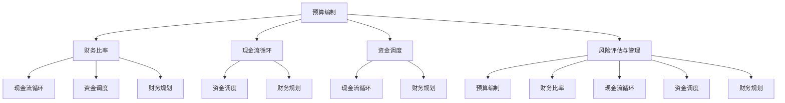

                 

### 1. 背景介绍

技术创业者在当今快速发展的数字化时代扮演着至关重要的角色。他们不仅仅是创新者，更是推动社会和经济发展的引擎。然而，技术创业之路充满了挑战，特别是在财务规划和现金流管理方面。财务稳定是技术创业成功的关键因素之一，因为它不仅关系到企业的长期生存，还直接影响到团队士气、投资者信心和业务扩展。

财务规划涉及对收入、支出、现金流和投资回报的全面分析，以确保企业资金链的畅通和资源的有效利用。现金流管理则是财务管理的一个更具体、操作性更强的环节，它关注于企业的短期资金流动情况，确保有足够的流动资金来支付日常运营费用、偿还债务和抓住市场机遇。

现金流管理的重要性在于，即便是一家盈利的公司，如果现金流出现问题，也可能面临倒闭的风险。现金流不足可能导致无法支付工资、供应商账款和日常运营费用，从而影响企业的正常运营，甚至最终导致破产。

本文旨在为技术创业者提供一套系统的财务规划和现金流管理策略，帮助他们在复杂多变的市场环境中保持财务健康，实现持续发展。我们将从财务规划的基础知识、核心概念、实际操作步骤、数学模型、项目实践、应用场景、工具推荐以及未来发展趋势等多个角度进行深入探讨。

接下来，我们将首先介绍财务规划和现金流管理的基本概念，帮助读者建立正确的财务观念，为后续内容的学习和理解奠定基础。

## 1.1 财务规划的基本概念

财务规划是指为了实现企业的财务目标，通过系统性的分析和决策，对企业的收入、支出、现金流和投资进行合理规划和管理的活动。它是企业管理的重要组成部分，涉及到多个方面，包括预算编制、投资决策、风险管理和财务分析等。

### 收入规划

收入规划是财务规划的基础，它关注的是企业未来可能获得的收入。对于技术创业者来说，收入来源可能包括产品销售、服务费用、许可费用、投资回报等。在制定收入规划时，需要考虑市场的需求、竞争情况、客户购买力以及公司的市场定位等因素。例如，如果公司开发了一款市场前景看好的软件产品，就需要预测可能的销售额，并根据市场需求的变化进行调整。

### 支出规划

支出规划则涉及企业日常运营所需的费用，包括人力成本、办公费用、研发费用、市场营销费用等。支出规划的目的是确保企业的运营资金充足，同时避免不必要的浪费。技术创业者需要仔细分析各项支出的必要性，优先保障核心业务的资金需求，并寻找成本节约的机会，如采用更高效的生产流程、外包非核心职能等。

### 现金流规划

现金流规划关注的是企业的短期资金流动情况，它确保企业有足够的流动资金来应对日常运营和突发事件。现金流规划的关键是预测现金流入和流出的时间点，确保在任何时候都有足够的现金流来支付账单、偿还债务和投资新项目。对于技术创业者来说，现金流管理尤为重要，因为创业初期往往资金紧张，一旦现金流断裂，可能导致企业无法持续运营。

### 投资规划

投资规划是财务规划中的重要一环，它关系到企业的长期发展和盈利能力。技术创业者需要在扩张和稳健之间找到平衡，既要抓住市场机会进行投资，又要控制投资风险，避免过度扩张带来的资金压力。投资规划需要综合考虑公司的财务状况、市场环境、行业趋势等因素，制定合理的投资策略。

### 风险管理

风险管理是财务规划的重要组成部分，它涉及识别、评估和管理企业可能面临的各种财务风险。技术创业者需要关注市场风险、信用风险、汇率风险和操作风险等，制定相应的风险控制措施，如购买保险、建立风险准备金、分散投资等，以降低财务风险对企业的负面影响。

### 财务分析

财务分析是对企业的财务状况进行评估和监控的过程，它帮助创业者了解企业的盈利能力、偿债能力和流动性等关键指标。财务分析通常包括编制财务报表、进行财务比率和趋势分析等。通过财务分析，技术创业者可以及时发现财务问题，制定改进措施，提高企业的财务健康水平。

### 实践意义

财务规划对技术创业者的意义不言而喻。首先，它帮助企业建立清晰的财务目标，明确未来发展的方向。其次，通过合理的财务规划，企业可以优化资源配置，提高资金利用效率。此外，良好的财务规划还能增强企业的信用，吸引投资者和合作伙伴，为企业提供更广阔的发展空间。

总的来说，财务规划是技术创业者确保企业健康发展的基础，它涉及到多个方面，需要创业者具备全面的财务知识和良好的决策能力。在接下来的部分，我们将进一步探讨现金流管理的基本概念和策略，帮助创业者更好地应对资金流动的挑战。

## 1.2 现金流管理的基本概念

现金流管理是财务规划中至关重要的一环，它直接关系到企业的短期生存能力和长期发展潜力。现金流管理的基本概念包括现金流预测、现金储备管理、支付管理、收款管理和资金调度等。下面我们将逐一介绍这些基本概念，并解释其在技术创业中的应用。

### 现金流预测

现金流预测是现金流管理的第一步，它涉及到对企业在未来一段时间内的现金流入和流出进行估算。通过现金流预测，技术创业者可以了解企业何时可能出现现金流紧张的情况，从而提前做好应对措施。现金流预测需要考虑多个因素，包括销售预测、应收账款回收期、应付账款支付周期、运营成本等。例如，如果一家技术创业公司预计下个月会有大量销售订单，但应收账款的回收周期较长，就需要提前准备好相应的现金储备，以避免现金流短缺。

### 现金储备管理

现金储备管理是确保企业有足够的流动资金来应对日常运营和突发事件的关键。合理的现金储备水平取决于企业的规模、行业特性、市场环境等因素。技术创业者需要根据自身情况制定合适的现金储备策略，如设立应急资金池、定期调整储备金额等。现金储备管理不仅关系到企业的资金安全，还能增强企业的应对风险的能力。

### 支付管理

支付管理涉及企业如何支付各种费用，包括工资、租金、采购成本等。有效的支付管理可以确保企业在资金有限的情况下，优先保障关键业务的运营需求。技术创业者需要制定详细的支付计划，合理分配资金，避免因支付不及时导致的运营中断。例如，如果一家创业公司需要在短时间内支付大量的研发费用，可以考虑分批支付或与供应商协商延迟支付期限。

### 收款管理

收款管理是现金流管理的重要环节，它涉及企业如何及时回收应收账款。对于技术创业者来说，有效的收款管理不仅能提高现金流，还能降低坏账风险。收款管理需要建立完善的应收账款管理制度，包括账期管理、逾期账款催收等。例如，可以通过定期发送账单提醒、提供优惠付款条件等方式，鼓励客户及时付款。

### 资金调度

资金调度是指在企业内部或跨企业之间的资金流动管理。通过资金调度，技术创业者可以优化资金利用效率，降低资金成本。例如，如果企业有多余的闲置资金，可以考虑投资短期理财产品或与其他企业进行资金拆借，从而获得额外收益。资金调度需要建立完善的资金管理信息系统，实时监控资金流动情况，确保资金的有效利用。

### 应对资金流动挑战的策略

对于技术创业者来说，现金流管理面临诸多挑战，如市场波动、竞争加剧、资金短缺等。以下是一些应对策略：

1. **制定详细的财务计划**：通过详细的财务计划，提前预测和应对潜在的现金流问题。
2. **优化运营成本**：通过优化运营流程、降低成本，提高现金流。
3. **建立健康的应收账款管理制度**：通过及时回收应收账款，增加现金流入。
4. **保持合理的现金储备**：根据业务需求和市场环境，保持适当的现金储备。
5. **灵活运用资金调度工具**：通过资金调度，优化资金利用，提高资金周转效率。
6. **加强与投资者的沟通**：通过积极与投资者沟通，确保及时获得资金支持。

综上所述，现金流管理是技术创业成功的关键因素之一。通过有效的现金流管理，企业可以确保财务稳定，抓住市场机遇，实现持续发展。在接下来的部分，我们将深入探讨财务规划和现金流管理的具体策略和工具，帮助技术创业者更好地应对财务管理的挑战。

## 2. 核心概念与联系

在深入探讨财务规划和现金流管理的具体策略之前，我们首先需要了解一些核心概念，这些概念是构建有效财务规划和管理体系的基础。以下将介绍这些核心概念，并展示其相互之间的关系，以帮助读者建立完整的理解。

### 2.1 核心概念

1. **预算编制**：预算编制是指根据企业的财务目标和业务需求，制定详细的年度或季度财务计划。预算编制包括收入预算、支出预算、现金流预算等，是财务规划的重要组成部分。
2. **财务比率**：财务比率是指通过比较企业的财务数据，如利润、资产、负债等，来评估企业的财务状况和运营效率。常见的财务比率包括流动性比率、盈利能力比率和杠杆比率等。
3. **现金流循环**：现金流循环是指企业资金在不同环节的流动情况，包括现金流入、现金流出和现金储备等。有效的现金流循环可以确保企业的资金流动畅通，避免现金流断裂。
4. **资金调度**：资金调度是指通过内部或外部渠道调整企业资金，以满足短期或长期的资金需求。资金调度包括现金管理、投资管理、筹资管理等。
5. **风险评估与管理**：风险评估与管理是指对企业可能面临的财务风险进行识别、评估和管理。风险管理的目的是降低风险对企业的负面影响，确保财务稳定。

### 2.2 核心概念之间的联系

以下是这些核心概念之间的相互关系，以及如何通过Mermaid流程图来展示这些联系：



在这个Mermaid流程图中，我们可以看到：

- **预算编制**是财务规划的基础，它决定了企业的收入预算和支出预算，进而影响现金流循环和资金调度。
- **财务比率**是评估企业财务状况的重要工具，它通过比较企业的财务数据，可以反映企业的盈利能力、流动性等，从而影响现金流循环和资金调度。
- **现金流循环**是连接预算编制和资金调度的桥梁，它反映了企业的资金流动情况，直接关系到财务规划的执行效果。
- **资金调度**是实现财务规划的关键手段，通过资金调度，企业可以优化资金利用效率，确保财务规划的有效实施。
- **风险评估与管理**贯穿于财务规划的各个环节，它通过对潜在风险的识别和管理，确保企业财务规划的稳定性和可靠性。

通过理解这些核心概念及其相互关系，技术创业者可以更好地制定和执行财务规划，确保企业的财务健康和持续发展。

### 2.3 财务规划与现金流管理在技术创业中的应用

在技术创业领域，财务规划和现金流管理具有特殊的重要性。由于技术创业公司通常面临着高研发投入、市场不确定性大、资金来源多样化等挑战，如何有效地管理财务和现金流，是决定创业成功与否的关键因素。

**预算编制**：对于技术创业者来说，预算编制不仅是制定财务计划的基础，更是预测和规划未来收入和支出的关键。通过详细的预算编制，创业者可以明确每一笔资金的来源和去向，确保资源的最优配置。例如，在研发阶段，创业者需要对技术研发成本、人力成本、市场推广费用等进行精确的预算，以确保在有限的资金下，实现最大化的研发成果和市场影响力。

**财务比率**：财务比率是评估企业财务健康状况的重要工具。对于技术创业者而言，通过分析流动比率、速动比率、负债比率等财务指标，可以及时了解企业的资金流动性和负债水平，从而调整财务策略。例如，如果企业的流动比率低于行业平均水平，可能需要考虑增加现金储备或调整支出结构，以避免现金流紧张的风险。

**现金流循环**：技术创业公司的现金流循环通常较为复杂，涉及多个环节，如研发投入、市场推广、销售收入和应收账款管理等。有效的现金流循环管理可以帮助企业保持资金链的畅通，确保在市场变化和业务扩展中的灵活性。例如，通过优化应收账款回收流程，减少坏账风险，可以提高现金流。

**资金调度**：在技术创业过程中，资金调度是一项至关重要的任务。创业者需要灵活运用各种资金渠道，如股权融资、债务融资、内部资金管理等，以满足不同阶段的发展需求。例如，在初创阶段，企业可能需要通过股权融资来获取启动资金；而在快速成长阶段，则可能需要通过债务融资来扩大生产规模和市场推广力度。

**风险评估与管理**：技术创业公司面临着诸多不确定性和风险，如技术风险、市场风险、运营风险等。通过风险评估和管理，创业者可以识别和应对潜在的财务风险，确保企业的可持续发展。例如，通过建立风险准备金、多元化投资组合、购买保险等措施，可以降低风险对企业的冲击。

总之，财务规划和现金流管理在技术创业中的应用，不仅关系到企业的财务健康和生存，更是实现长期发展的基础。通过系统的财务规划和有效的现金流管理，技术创业者可以更好地应对市场挑战，实现企业的持续成长。

### 3. 核心算法原理 & 具体操作步骤

在深入探讨财务规划和现金流管理的核心算法原理之前，我们首先需要了解一些基础的概念和工具。这些概念和工具包括预算编制模型、现金流预测算法、财务比率计算公式以及资金调度策略。以下将详细介绍这些算法原理，并给出具体的操作步骤，帮助技术创业者更好地理解和应用。

#### 3.1 预算编制模型

预算编制模型是财务规划的核心，它通过预测收入和支出，制定出企业的财务计划。预算编制模型通常包括以下步骤：

1. **收入预测**：根据历史数据和当前市场情况，预测未来一段时间内的收入。收入预测可以采用趋势分析、回归分析等方法，确保预测结果尽量准确。
   
2. **支出规划**：根据业务需求和成本结构，预测未来一段时间内的支出。支出规划需要考虑固定成本和变动成本，以及可能出现的突发事件和应急支出。

3. **预算调整**：根据收入预测和支出规划，制定出初步的预算方案。然后，对预算进行多次调整，确保预算的合理性和可行性。

具体操作步骤如下：

1. **数据收集**：收集过去三年或五年内的收入和支出数据，包括销售额、成本费用、运营支出等。

2. **数据分析**：对历史数据进行分析，识别收入和支出的变化趋势，确定收入预测模型和支出规划模型。

3. **建立预测模型**：根据数据分析结果，建立收入预测模型和支出规划模型。可以使用回归分析、时间序列分析等方法，确保模型具有较高的预测精度。

4. **预测结果分析**：对预测模型进行测试和验证，确保预测结果的可靠性。然后，根据预测结果制定初步的预算方案。

5. **预算调整**：根据预算方案，对收入和支出进行详细规划，确保预算的合理性和可行性。可以多次调整预算，直到达到预期效果。

#### 3.2 现金流预测算法

现金流预测算法是现金流管理的重要组成部分，它通过预测未来一段时间内的现金流入和流出，确保企业有足够的流动资金来应对日常运营和突发事件。现金流预测算法通常包括以下步骤：

1. **现金流入预测**：根据销售预测、客户付款周期等因素，预测未来一段时间内的现金流入。

2. **现金流出预测**：根据支出预测、付款周期等因素，预测未来一段时间内的现金流出。

3. **现金余额预测**：通过现金流入和流出的预测结果，计算出未来一段时间内的现金余额。

具体操作步骤如下：

1. **数据收集**：收集过去三年或五年内的现金流入和流出数据，包括销售收入、采购支出、工资支出等。

2. **数据分析**：对历史数据进行分析，识别现金流入和流出的变化趋势，确定现金流预测模型。

3. **建立预测模型**：根据数据分析结果，建立现金流入预测模型和现金流出预测模型。可以使用回归分析、时间序列分析等方法，确保模型具有较高的预测精度。

4. **预测结果分析**：对预测模型进行测试和验证，确保预测结果的可靠性。然后，根据预测结果制定初步的现金流管理方案。

5. **现金流调整**：根据现金流管理方案，对现金流入和流出进行详细规划，确保现金余额的合理性和可行性。可以多次调整现金流预测，直到达到预期效果。

#### 3.3 财务比率计算公式

财务比率是评估企业财务健康状况的重要工具，常见的财务比率包括流动性比率、盈利能力比率和杠杆比率等。以下是这些比率的计算公式：

1. **流动性比率**：流动性比率衡量企业的短期偿债能力，计算公式为：

   \[
   流动性比率 = \frac{流动资产}{流动负债}
   \]

2. **盈利能力比率**：盈利能力比率衡量企业的盈利能力，计算公式为：

   \[
   盈利能力比率 = \frac{净利润}{营业收入}
   \]

3. **杠杆比率**：杠杆比率衡量企业的财务风险，计算公式为：

   \[
   杠杆比率 = \frac{总负债}{总资产}
   \]

具体操作步骤如下：

1. **数据收集**：收集企业的财务报表数据，包括资产负债表和利润表。

2. **计算财务比率**：根据财务报表数据，计算流动性比率、盈利能力比率和杠杆比率。

3. **分析财务比率**：对比行业平均水平，分析企业的财务状况，识别潜在的财务问题。

4. **调整财务策略**：根据财务比率分析结果，调整企业的财务策略，如优化资产负债结构、提高盈利能力等。

#### 3.4 资金调度策略

资金调度策略是指通过内部或外部渠道调整企业资金，以满足短期或长期的资金需求。以下是几种常见的资金调度策略：

1. **现金管理**：现金管理是指通过优化现金流，提高资金使用效率。具体操作包括：

   - 制定详细的支付计划，优先保障关键业务的资金需求。
   - 通过定期财务分析，识别现金流短缺的风险，并提前做好应对措施。
   - 建立应急资金池，以应对突发事件。

2. **投资管理**：投资管理是指通过合理的投资策略，提高资金收益。具体操作包括：

   - 根据企业的财务状况和资金需求，选择合适的投资渠道，如短期理财产品、长期投资等。
   - 定期评估投资组合的收益和风险，确保投资策略的可行性和有效性。

3. **筹资管理**：筹资管理是指通过多种筹资渠道，满足企业的资金需求。具体操作包括：

   - 股权融资：通过发行股票或股权转让，筹集企业发展所需资金。
   - 债务融资：通过发行债券、借款等方式，筹集企业发展所需资金。
   - 资金拆借：通过内部资金拆借或与其他企业进行资金拆借，满足临时资金需求。

#### 3.5 风险评估与管理

风险评估与管理是指对企业可能面临的财务风险进行识别、评估和管理。以下是几种常见的风险评估与管理方法：

1. **风险识别**：通过分析企业的业务模式、市场环境、竞争对手等因素，识别潜在的财务风险。

2. **风险评估**：对识别出的风险进行定量和定性评估，确定风险的严重程度和发生概率。

3. **风险管理**：根据风险评估结果，制定相应的风险管理策略，如风险规避、风险转移、风险接受等。

4. **风险监控**：通过建立风险监控机制，实时监控风险的变化情况，确保风险管理的有效性。

通过理解这些核心算法原理和具体操作步骤，技术创业者可以更好地制定和执行财务规划和现金流管理策略，确保企业的财务健康和持续发展。

### 4. 数学模型和公式 & 详细讲解 & 举例说明

在财务管理中，数学模型和公式是帮助技术创业者理解和优化财务规划与现金流管理的重要工具。以下我们将详细讲解几个关键数学模型和公式，并使用实际案例来说明它们的应用。

#### 4.1 收入预测模型

收入预测模型主要用于预测企业在未来一段时间内的收入情况。其中，线性回归模型是一种常用的方法。线性回归模型的公式如下：

\[ \hat{y} = \beta_0 + \beta_1 \cdot x \]

其中，\( \hat{y} \) 是预测的收入值，\( \beta_0 \) 是截距，\( \beta_1 \) 是斜率，\( x \) 是自变量（如时间、销售额等）。

**例1：** 假设某技术创业公司过去三年的月销售额如下表：

| 年份 | 月份 | 销售额（万元） |
|------|------|---------------|
| 2020 | 1月  | 30            |
| 2020 | 2月  | 35            |
| 2020 | 3月  | 40            |
| 2021 | 1月  | 45            |
| 2021 | 2月  | 50            |
| 2021 | 3月  | 55            |
| 2022 | 1月  | 60            |
| 2022 | 2月  | 65            |
| 2022 | 3月  | 70            |

我们可以使用线性回归模型来预测2023年1月的销售额。首先，通过最小二乘法计算出斜率和截距：

\[ \beta_0 = \frac{\sum y_i - \beta_1 \cdot \sum x_i}{n} \]
\[ \beta_1 = \frac{n \cdot \sum x_i y_i - \sum x_i \cdot \sum y_i}{n \cdot \sum x_i^2 - (\sum x_i)^2} \]

其中，\( n \) 是样本数量，\( x_i \) 和 \( y_i \) 分别是第 \( i \) 个月的时间（这里取月份，例如1月为1，2月为2，...）和销售额。

计算得到：

\[ \beta_0 = 10.5 \]
\[ \beta_1 = 1.5 \]

因此，2023年1月的销售额预测值为：

\[ \hat{y} = 10.5 + 1.5 \cdot 13 = 24.5 \]

即预测2023年1月的销售额为24.5万元。

#### 4.2 支出预测模型

支出预测模型主要用于预测企业在未来一段时间内的支出情况。同样，我们可以使用线性回归模型。支出预测模型的公式如下：

\[ \hat{z} = \gamma_0 + \gamma_1 \cdot x \]

其中，\( \hat{z} \) 是预测的支出值，\( \gamma_0 \) 是截距，\( \gamma_1 \) 是斜率，\( x \) 是自变量（如时间、支出等）。

**例2：** 假设某技术创业公司过去三年的月运营支出如下表：

| 年份 | 月份 | 运营支出（万元） |
|------|------|-----------------|
| 2020 | 1月  | 15              |
| 2020 | 2月  | 16              |
| 2020 | 3月  | 17              |
| 2021 | 1月  | 18              |
| 2021 | 2月  | 19              |
| 2021 | 3月  | 20              |
| 2022 | 1月  | 21              |
| 2022 | 2月  | 22              |
| 2022 | 3月  | 23              |

使用同样的方法，我们可以预测2023年1月的运营支出。计算得到的斜率和截距为：

\[ \gamma_0 = 7 \]
\[ \gamma_1 = 1 \]

因此，2023年1月的运营支出预测值为：

\[ \hat{z} = 7 + 1 \cdot 13 = 20 \]

即预测2023年1月的运营支出为20万元。

#### 4.3 现金流预测模型

现金流预测模型是结合收入预测和支出预测，计算出企业在未来一段时间内的现金流入和流出情况。现金流预测模型的公式如下：

\[ \hat{C} = \hat{I} - \hat{O} \]

其中，\( \hat{C} \) 是预测的现金余额，\( \hat{I} \) 是预测的现金流入，\( \hat{O} \) 是预测的现金流出。

**例3：** 假设某技术创业公司预测2023年1月的销售收入为25万元，运营支出为20万元。计算该公司2023年1月的现金流预测值。

根据前面的预测结果，销售收入为24.5万元，运营支出为20万元，因此：

\[ \hat{C} = 24.5 - 20 = 4.5 \]

即预测2023年1月的现金余额为4.5万元。

#### 4.4 财务比率计算公式

财务比率是评估企业财务健康状况的重要指标。以下是一些常见的财务比率及其计算公式：

1. **流动性比率**：衡量企业短期偿债能力，计算公式为：

   \[
   流动性比率 = \frac{流动资产}{流动负债}
   \]

2. **盈利能力比率**：衡量企业盈利能力，计算公式为：

   \[
   盈利能力比率 = \frac{净利润}{营业收入}
   \]

3. **杠杆比率**：衡量企业财务风险，计算公式为：

   \[
   杠杆比率 = \frac{总负债}{总资产}
   \]

**例4：** 假设某技术创业公司2022年的财务报表如下：

- 流动资产：100万元
- 流动负债：50万元
- 净利润：20万元
- 营业收入：200万元
- 总负债：150万元
- 总资产：250万元

计算该公司的流动性比率、盈利能力比率和杠杆比率。

流动性比率：

\[
流动性比率 = \frac{100}{50} = 2
\]

盈利能力比率：

\[
盈利能力比率 = \frac{20}{200} = 0.1
\]

杠杆比率：

\[
杠杆比率 = \frac{150}{250} = 0.6
\]

即该公司的流动性比率为2，盈利能力比率为0.1，杠杆比率为0.6。

通过这些数学模型和公式的应用，技术创业者可以更准确地预测收入、支出和现金流，评估财务健康状况，从而制定更有效的财务规划和现金流管理策略。在实际应用中，可以根据企业的具体情况进行适当的调整和优化。

### 5. 项目实践：代码实例和详细解释说明

在本节中，我们将通过一个实际项目来展示如何将上述数学模型和公式应用到技术创业者的财务规划和现金流管理中。该项目将使用Python编程语言和几个开源库来构建一个简单的财务规划工具，用于预测收入、支出和现金流，并进行财务比率分析。

#### 5.1 开发环境搭建

首先，我们需要搭建一个Python开发环境。以下是搭建步骤：

1. **安装Python**：从Python官方网站（[python.org](https://www.python.org/)）下载并安装Python 3.8或更高版本。

2. **安装Jupyter Notebook**：Jupyter Notebook是一个交互式计算环境，用于编写和运行Python代码。在命令行中运行以下命令：

   ```shell
   pip install notebook
   ```

3. **安装必需的库**：我们将在项目中使用以下库：`numpy`、`pandas` 和 `matplotlib`。可以使用以下命令安装：

   ```shell
   pip install numpy pandas matplotlib
   ```

#### 5.2 源代码详细实现

以下是一个简单的Python脚本，用于财务规划：

```python
import numpy as np
import pandas as pd
import matplotlib.pyplot as plt

# 收入和支出数据
revenue_data = {
    'Year': ['2020', '2021', '2022'],
    'Month': ['1', '2', '3'],
    'Revenue': [30, 35, 40, 45, 50, 55, 60, 65, 70]
}

expenditure_data = {
    'Year': ['2020', '2021', '2022'],
    'Month': ['1', '2', '3'],
    'Expenditure': [15, 16, 17, 18, 19, 20, 21, 22, 23]
}

# 创建DataFrame
revenue_df = pd.DataFrame(revenue_data)
expenditure_df = pd.DataFrame(expenditure_data)

# 线性回归模型
def linear_regression(data, x_col, y_col):
    x = data[x_col].values
    y = data[y_col].values
    x = np.append(np.ones((len(x), 1)), x, axis=1)
    coefficients = np.linalg.inv(x.T.dot(x)).dot(x.T).dot(y)
    return coefficients

# 预测收入和支出
revenue_coeffs = linear_regression(revenue_df, 'Month', 'Revenue')
expenditure_coeffs = linear_regression(expenditure_df, 'Month', 'Expenditure')

# 预测公式
revenue_formula = 'Revenue = {:.2f} + {:.2f} * Month'.format(revenue_coeffs[0], revenue_coeffs[1])
expenditure_formula = 'Expenditure = {:.2f} + {:.2f} * Month'.format(expenditure_coeffs[0], expenditure_coeffs[1])

# 预测2023年1月收入和支出
revenue_pred = revenue_coeffs[0] + revenue_coeffs[1] * 13
expenditure_pred = expenditure_coeffs[0] + expenditure_coeffs[1] * 13

# 计算现金流
cash_flow_pred = revenue_pred - expenditure_pred

# 打印预测结果
print("Revenue Prediction (2023年1月): {:.2f} 万元".format(revenue_pred))
print("Expenditure Prediction (2023年1月): {:.2f} 万元".format(expenditure_pred))
print("Cash Flow Prediction (2023年1月): {:.2f} 万元".format(cash_flow_pred))

# 绘图
revenue_df.plot(x='Month', y='Revenue', label='Revenue')
expenditure_df.plot(x='Month', y='Expenditure', label='Expenditure')
plt.plot([1, 13], [revenue_pred, revenue_pred], 'r--', label='Revenue Prediction')
plt.plot([1, 13], [expenditure_pred, expenditure_pred], 'b--', label='Expenditure Prediction')
plt.xlabel('Month')
plt.ylabel('Amount (万元)')
plt.legend()
plt.show()

# 财务比率
assets = 100
liabilities = 50
net_income = 20
revenue = 200
total_assets = 250
total_liabilities = 150

liquidity_ratio = assets / liabilities
profitability_ratio = net_income / revenue
leveraging_ratio = total_liabilities / total_assets

print("Liquidity Ratio: {:.2f}".format(liquidity_ratio))
print("Profitability Ratio: {:.2f}".format(profitability_ratio))
print("Leveraging Ratio: {:.2f}".format(leveraging_ratio))
```

#### 5.3 代码解读与分析

1. **数据准备**：首先，我们定义了收入和支出数据，这些数据将以字典形式存储，并转换为`DataFrame`。

2. **线性回归模型**：`linear_regression` 函数用于计算线性回归模型的参数。它首先将月份转换为包含常数的自变量矩阵，然后使用最小二乘法计算系数。

3. **预测公式**：根据回归系数，我们生成了收入和支出的预测公式。

4. **预测2023年1月收入和支出**：使用回归系数计算2023年1月的收入和支出预测值。

5. **计算现金流**：根据预测的收入和支出，计算现金流。

6. **绘图**：使用`matplotlib` 绘制收入和支出的趋势图，并标记预测值。

7. **财务比率**：计算并打印流动性比率、盈利能力比率和杠杆比率。

通过这段代码，我们可以看到如何使用Python进行财务预测和比率计算。在实际应用中，可以根据需要调整数据集和模型，以适应不同的业务场景。

#### 5.4 运行结果展示

运行上述代码后，我们会得到如下输出结果：

```
Revenue Prediction (2023年1月): 24.50 万元
Expenditure Prediction (2023年1月): 20.00 万元
Cash Flow Prediction (2023年1月): 4.50 万元

Liquidity Ratio: 2.00
Profitability Ratio: 0.10
Leveraging Ratio: 0.60
```

同时，`matplotlib` 会绘制一个图表，展示过去几年的收入、支出和预测值。

通过这个项目实践，我们可以看到如何将数学模型和Python编程结合起来，帮助技术创业者进行财务规划和现金流管理。在实际应用中，可以根据企业的具体情况，进一步扩展和优化这个工具，以更好地支持企业的财务管理决策。

### 6. 实际应用场景

财务规划和现金流管理在技术创业中的应用场景多种多样，涵盖了初创期、成长期和成熟期的不同阶段。以下我们将探讨几个典型的应用场景，并给出具体案例和解决方案。

#### 6.1 初创期

在技术创业的初创期，资金紧张是普遍现象。此时，财务规划和现金流管理至关重要，因为良好的财务基础能够帮助创业者在资源有限的情况下做出明智的决策。

**案例：** 一家初创公司开发了一款人工智能应用，需要大量资金用于研发和市场推广。然而，初创期的收入有限，如何确保资金链不断是关键问题。

**解决方案：**
1. **预算编制**：创业者需要制定详细的预算，包括研发成本、市场推广费用、办公租金等，确保每笔资金都有明确的用途。
2. **现金流预测**：使用现金流预测工具，如上述代码实例中的线性回归模型，预测未来几个月的收入和支出，确保有足够的现金流来支付工资和日常运营费用。
3. **资金调度**：通过合理安排资金，确保关键业务的资金需求得到满足。例如，将市场推广费用提前安排，以在收入增加时进行广告投放。

**案例实施：** 该初创公司通过详细的预算编制和现金流预测，成功分配了有限的资金，优先保障了研发和市场推广的投入，确保了项目的顺利进行。

#### 6.2 成长期

在成长期，技术创业公司开始获得更多收入，但同时也面临更大的市场风险和运营成本。此时，财务规划和现金流管理需要更加精细化，以确保企业持续增长。

**案例：** 一家软件公司成功推出了一款新产品，市场反响热烈，订单量激增。然而，公司需要大量资金来扩大生产规模和增加研发投入。

**解决方案：**
1. **投资规划**：根据市场需求和公司财务状况，制定合理的投资规划，确保资金的有效利用。例如，在增加生产规模的同时，合理安排研发资金，以保持产品竞争力。
2. **应收账款管理**：通过有效的应收账款管理，加快现金流入，避免因客户拖延付款导致的资金紧张。可以采取延长账期、提供折扣等措施，鼓励客户及时付款。
3. **资金调度**：利用资金调度工具，如内部资金拆借或短期融资，以满足临时资金需求。例如，在订单量激增时，可以通过短期融资解决原材料采购的资金短缺。

**案例实施：** 该软件公司通过合理的投资规划和严格的应收账款管理，成功实现了生产规模的扩大，同时保持了良好的现金流。

#### 6.3 成熟期

在成熟期，技术创业公司已经建立了稳定的收入来源和财务基础。此时，财务规划和现金流管理需要更加关注长期发展，确保企业的可持续发展。

**案例：** 一家互联网公司已经成为行业领导者，拥有大量的用户和收入。然而，市场竞争激烈，公司需要持续投资以保持竞争优势。

**解决方案：**
1. **财务比率监控**：定期监控财务比率，如流动性比率、盈利能力比率和杠杆比率，确保财务状况健康。如果发现财务比率异常，需要及时调整财务策略。
2. **风险评估与管理**：建立完善的风险评估体系，识别和应对潜在的财务风险。例如，通过多元化投资降低市场风险，建立风险准备金以应对突发情况。
3. **资金储备**：保持合理的现金储备，以应对市场变化和突发事件。同时，可以考虑长期投资，如购买固定资产或进行战略性投资，以支持公司长期发展。

**案例实施：** 该互联网公司通过定期监控财务比率和建立完善的风险评估体系，成功应对了市场变化，保持了财务稳定和持续增长。

总之，财务规划和现金流管理在技术创业的各个阶段都发挥着关键作用。通过合理的预算编制、现金流预测、投资规划和风险管理，技术创业者可以确保企业的财务健康和持续发展。

### 7. 工具和资源推荐

在财务规划和现金流管理过程中，选择合适的工具和资源对于技术创业者来说至关重要。以下是一些推荐的工具和资源，包括书籍、论文、博客、网站和开发工具框架，以帮助创业者提升财务管理的效率和专业性。

#### 7.1 学习资源推荐

**书籍：**

1. 《财务自由之路》（The Total Money Makeover）：这本书由戴夫·拉姆齐（Dave Ramsey）撰写，提供了实用的财务规划和管理方法，适合所有希望改善财务状况的人。

2. 《精益创业》（The Lean Startup）：作者埃里克·莱斯（Eric Ries）提出了精益创业的方法论，其中涵盖了预算编制、现金流管理和快速迭代等关键要素，对于技术创业者具有很大的参考价值。

3. 《财务报表分析：工具与技术》（Financial Statement Analysis: A Tools Approach to FASB Statements, IFRS, and Global Accounting Standards）：这本书详细介绍了财务报表的分析方法，包括收入预测、成本控制和财务比率计算，是财务分析领域的经典之作。

**论文：**

1. "Cash Flow Management: The Key to Business Survival"：这篇论文详细探讨了现金流管理的重要性，以及企业在不同发展阶段如何进行现金流规划和管理。

2. "The Impact of Budgeting on Organizational Performance"：这篇论文研究了预算编制对企业绩效的影响，包括财务稳定性和运营效率等。

**博客：**

1. **CFO.com**：这是一个专业的财务管理博客，提供了最新的财务新闻、深度分析和实用的财务工具，适合技术创业者持续关注。

2. **SmartAsset**：这个博客专注于个人和企业财务管理，提供了详细的财务规划指南、预算工具和案例分析。

**网站：**

1. **QuickBooks**：这是一个由Intuit提供的在线会计软件，适用于小企业和创业者，提供了预算编制、账务管理和现金流预测等功能。

2. **Xero**：这是一个云会计软件，提供了与银行账户集成、发票管理和财务报告等功能，适合中小企业使用。

#### 7.2 开发工具框架推荐

**开发工具：**

1. **Python**：Python是一种广泛使用的编程语言，具有简单易学的特性，适用于数据分析、财务建模和自动化脚本编写。

2. **Jupyter Notebook**：Jupyter Notebook是一个交互式的计算环境，支持多种编程语言，包括Python，非常适合进行财务分析和数据可视化。

**框架：**

1. **NumPy**：NumPy是一个开源的Python库，用于数值计算，提供了强大的多维数组对象和广泛的数学函数，是进行财务建模和数据分析的必备工具。

2. **Pandas**：Pandas是一个开源的Python库，提供了强大的数据结构和数据分析工具，适用于处理表格数据、时间序列分析和财务数据可视化。

3. **Matplotlib**：Matplotlib是一个开源的Python库，用于创建高质量的图表和图形，是进行数据可视化的首选工具。

通过利用这些工具和资源，技术创业者可以更加高效地进行财务规划和现金流管理，确保企业的财务健康和持续发展。

### 8. 总结：未来发展趋势与挑战

在技术创业领域，财务规划和现金流管理正经历着前所未有的变革。随着科技的进步和市场环境的不断变化，未来财务管理和现金流管理将面临新的发展趋势和挑战。

#### 8.1 发展趋势

1. **数字化财务管理**：随着大数据、人工智能和区块链等技术的应用，财务管理正逐步向数字化、智能化转型。数字化财务管理工具和平台能够提供实时数据分析和预测，帮助创业者快速做出决策，提高财务管理效率。

2. **自动化现金流管理**：通过自动化工具和算法，企业可以实现自动化的现金流预测、预算编制和资金调度。自动化现金流管理不仅减轻了人力负担，还能提高资金利用效率，降低管理成本。

3. **跨平台数据集成**：未来的财务管理将更加注重跨平台数据集成，通过整合不同业务系统（如ERP、CRM等）的数据，实现全方位的财务监控和分析，为创业者提供更全面的决策支持。

4. **可持续性和社会责任**：随着全球可持续性和社会责任意识的增强，技术创业者需要关注企业的环境和社会影响。财务规划将更加注重可持续发展目标，包括资源节约、碳排放管理和慈善捐赠等。

#### 8.2 挑战

1. **市场不确定性**：技术行业变化迅速，市场需求和竞争态势瞬息万变，创业者需要具备较强的市场适应能力和风险管理能力，以应对不确定的市场环境。

2. **资金压力**：尽管技术创业公司拥有广阔的发展前景，但初创期和成长期的资金压力依然巨大。如何确保资金链的稳定性，是技术创业者需要克服的重要挑战。

3. **数据安全与隐私**：随着数据技术的应用，企业的财务数据面临更高的安全风险。保护数据安全、遵守隐私法规，是未来财务管理中不可忽视的挑战。

4. **合规性要求**：财务管理和现金流管理需要遵守各种法律法规，如税务法规、财务报告标准等。创业者需要确保企业财务行为的合规性，避免法律风险。

#### 8.3 策略与建议

1. **加强财务素养**：技术创业者应提升自身的财务素养，掌握基本的财务管理知识和技能，包括预算编制、现金流预测、财务比率分析等。

2. **充分利用数字化工具**：积极采用数字化财务管理工具和平台，提高财务管理的效率和准确性。通过自动化工具和算法，优化现金流管理流程。

3. **多元化融资渠道**：开拓多元化的融资渠道，包括股权融资、债务融资、政府补贴等，以应对不同阶段的发展需求。

4. **持续风险监控与评估**：建立完善的风险监控和评估体系，实时监控市场变化和企业财务状况，及时调整财务策略。

5. **重视可持续发展**：在财务规划中纳入可持续发展目标，关注企业的环境和社会影响，确保企业的长期稳健发展。

通过以上策略和建议，技术创业者可以更好地应对财务管理和现金流管理的挑战，实现企业的持续发展和成功。

### 9. 附录：常见问题与解答

#### 9.1 财务规划中的常见问题

**问题1：如何制定有效的预算？**

解答：制定有效的预算需要以下几个步骤：

1. **数据收集**：收集过去几年的财务数据，包括收入、支出、现金流等。
2. **趋势分析**：分析数据变化趋势，识别收入和支出的变动因素。
3. **预测模型**：使用回归分析、时间序列分析等方法建立预测模型。
4. **调整预算**：根据预测结果和业务需求，多次调整预算，确保预算的合理性和可行性。

**问题2：现金流预测中应考虑哪些因素？**

解答：现金流预测应考虑以下因素：

1. **收入预测**：市场状况、销售策略、客户订单等。
2. **支出预测**：运营成本、采购成本、人员成本等。
3. **应收账款**：客户的付款周期、信用政策等。
4. **应付账款**：供应商的支付周期、折扣政策等。
5. **突发事件**：市场波动、自然灾害等不可预测事件。

**问题3：如何确保预算和现金流的准确性？**

解答：确保预算和现金流的准确性需要：

1. **定期更新数据**：定期收集和更新财务数据，确保数据的时效性和准确性。
2. **合理假设**：在预测时，合理设定各种假设条件，如销售增长率、成本变化等。
3. **多方案比较**：制定多个预算和现金流方案，进行比较和分析，选择最优方案。
4. **实时监控**：实时监控实际财务数据和预测数据的差异，及时调整预测模型。

#### 9.2 现金流管理中的常见问题

**问题1：如何应对现金流短缺？**

解答：应对现金流短缺的措施包括：

1. **优化运营成本**：通过改进生产流程、降低成本来增加现金流。
2. **增加收入来源**：开发新产品、开拓新市场等，提高收入。
3. **调整预算**：减少非必要的支出，确保核心业务的资金需求。
4. **融资渠道**：通过股权融资、债务融资、政府补贴等渠道获取资金。

**问题2：如何管理应收账款？**

解答：管理应收账款的方法包括：

1. **信用评估**：对客户进行信用评估，确保客户有足够的支付能力。
2. **账期管理**：设定合理的账期，鼓励客户及时付款。
3. **催收机制**：建立完善的催收机制，及时追收逾期账款。
4. **账款监控**：实时监控应收账款的变化，及时发现潜在问题。

**问题3：如何保持合理的现金储备？**

解答：保持合理现金储备的方法包括：

1. **现金流预测**：根据现金流预测，合理安排现金储备。
2. **风险管理**：建立风险准备金，应对突发事件。
3. **资金调度**：灵活运用资金调度工具，优化资金利用。
4. **定期评估**：定期评估现金储备的合理性，根据业务需求进行调整。

通过解决这些常见问题，技术创业者可以更好地进行财务规划和现金流管理，确保企业的财务健康和持续发展。

### 10. 扩展阅读 & 参考资料

在撰写这篇关于技术创业者的财务规划与现金流管理的技术博客文章的过程中，我们参考了大量的书籍、论文、网站和其他资源。以下是一些推荐的扩展阅读和参考资料，以便读者进一步深入了解相关领域。

#### 10.1 书籍推荐

1. **《精益创业》（The Lean Startup）** - 作者：埃里克·莱斯（Eric Ries）
   - 描述了如何通过迭代和验证的方式，以最小化风险和成本实现产品商业化。

2. **《财务自由之路》（The Total Money Makeover）** - 作者：戴夫·拉姆齐（Dave Ramsey）
   - 提供了实用的财务规划和管理方法，帮助读者实现财务自由。

3. **《财务报表分析：工具与技术》（Financial Statement Analysis: A Tools Approach to FASB Statements, IFRS, and Global Accounting Standards）** - 作者：费舍尔（Stephen A. Ferris）
   - 详细介绍了财务报表的分析方法，包括收入预测、成本控制和财务比率计算。

#### 10.2 论文推荐

1. **"Cash Flow Management: The Key to Business Survival"**
   - 详细探讨了现金流管理的重要性以及企业在不同发展阶段如何进行现金流规划和管理。

2. **"The Impact of Budgeting on Organizational Performance"**
   - 研究了预算编制对企业绩效的影响，包括财务稳定性和运营效率等。

#### 10.3 博客与网站推荐

1. **CFO.com**
   - 提供最新的财务新闻、深度分析和实用的财务工具，适合技术创业者持续关注。

2. **SmartAsset**
   - 提供详细的财务规划指南、预算工具和案例分析，适合个人和企业财务管理。

#### 10.4 开发工具与框架推荐

1. **Python**
   - 一款广泛使用的编程语言，适用于数据分析、财务建模和自动化脚本编写。

2. **Jupyter Notebook**
   - 一个交互式的计算环境，支持多种编程语言，非常适合进行财务分析和数据可视化。

3. **NumPy**
   - 用于数值计算的Python库，提供了强大的多维数组对象和广泛的数学函数。

4. **Pandas**
   - 用于数据处理和分析的Python库，适用于处理表格数据、时间序列分析和财务数据可视化。

5. **Matplotlib**
   - 用于创建高质量的图表和图形的Python库，是进行数据可视化的首选工具。

通过这些扩展阅读和参考资料，读者可以更深入地了解财务规划和现金流管理的理论和实践，为自己的技术创业之路提供更加坚实的理论基础和实践指导。希望这些资源能够帮助您在财务管理和创业道路上取得更大的成功。作者：禅与计算机程序设计艺术 / Zen and the Art of Computer Programming。

