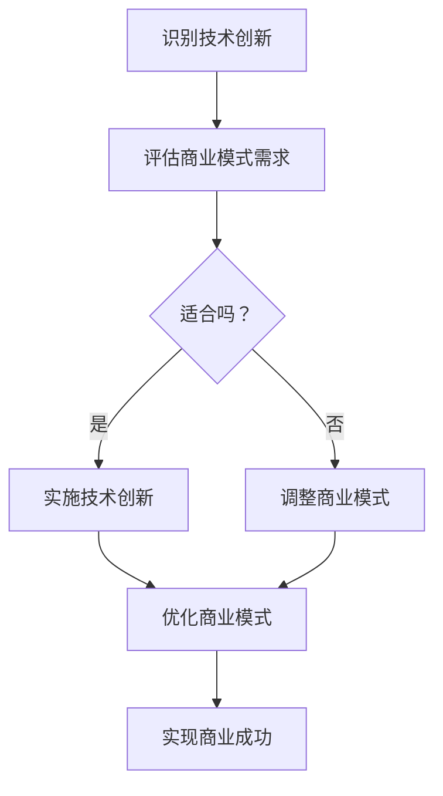

                 

### 文章标题

### 技术创新与商业模式的结合

> 关键词：技术创新，商业模式，结合，发展，案例，趋势

> 摘要：本文将深入探讨技术创新与商业模式的结合，分析两者之间的关系，揭示如何通过技术创新推动商业模式创新，进而实现商业成功。我们将通过实际案例来探讨这一结合的具体应用，并对未来的发展趋势和挑战进行展望。

---

在当今快速发展的技术时代，技术创新已经成为企业竞争的关键驱动力。然而，单纯的技术创新并不能保证商业成功，只有当技术创新与商业模式相结合，才能实现企业的长期发展和持续盈利。本文将围绕这一主题展开讨论，旨在为读者提供对技术创新与商业模式结合的深入理解和实践指导。

## 1. 背景介绍

### 技术创新的重要性

技术创新在现代社会中扮演着至关重要的角色。它不仅推动了科技的进步，也改变了人们的生活方式。从互联网、移动通信到人工智能、大数据，每一次技术革命都带来了巨大的商业机遇。企业通过不断创新技术，可以提高生产效率，降低成本，提供更好的产品和服务，从而在激烈的市场竞争中脱颖而出。

### 商业模式的概念

商业模式是指企业如何创造、传递和获取价值的一种体系。它包括企业的核心产品或服务、目标客户群体、价值主张、渠道策略、收入模式、成本结构等多个方面。成功的商业模式能够帮助企业实现可持续发展，创造持续的价值。

### 技术创新与商业模式的关系

技术创新与商业模式之间存在着紧密的联系。技术创新可以为商业模式提供新的思路和方法，推动商业模式的创新和优化。同时，商业模式也可以为技术创新提供支持和保障，确保技术创新能够有效地转化为商业价值。

## 2. 核心概念与联系

为了更好地理解技术创新与商业模式之间的结合，我们首先需要明确以下几个核心概念：

### 技术创新

技术创新是指通过引入新技术、新方法或新流程，提高产品或服务的性能、效率或用户体验。它包括基础研究、应用研究、产品开发、市场推广等多个环节。

### 商业模式

商业模式是指企业如何创造、传递和获取价值的一种体系。它包括核心产品或服务、目标客户群体、价值主张、渠道策略、收入模式、成本结构等多个方面。

### 技术创新与商业模式的结合

技术创新与商业模式的结合体现在以下几个方面：

1. **技术创新驱动商业模式创新**：通过技术创新，企业可以改变原有的商业模式，创造新的商业模式。例如，互联网技术的兴起改变了传统零售的商业模式，催生了电子商务。

2. **商业模式支持技术创新**：成功的商业模式可以为技术创新提供资金、资源、市场等支持，确保技术创新能够顺利实施和商业化。

3. **技术创新与商业模式的协同**：技术创新和商业模式相互促进，共同推动企业的发展。例如，亚马逊通过技术创新优化了物流和供应链管理，从而实现了高效的商业模式。

### Mermaid 流程图

以下是一个简化的 Mermaid 流程图，展示了技术创新与商业模式结合的基本流程：



## 3. 核心算法原理 & 具体操作步骤

在探讨技术创新与商业模式的结合时，我们还需要了解一些核心算法原理和具体操作步骤。以下是一些常用的方法：

### 创新思维方法

1. **头脑风暴**：通过集思广益，产生大量的创意和想法。
2. **设计思维**：以用户为中心，通过体验设计来解决问题。
3. **快速原型**：快速构建原型，通过用户反馈不断迭代优化。

### 商业模式设计方法

1. **价值网络分析**：分析企业的价值网络，识别关键合作伙伴和竞争关系。
2. **商业模式画布**：使用画布工具，明确商业模式的核心要素和相互关系。
3. **商业模型创新**：通过组合和重构现有商业模式，创造新的商业模式。

### 具体操作步骤

1. **确定技术创新方向**：基于市场需求和公司战略，确定技术创新的重点领域。
2. **评估商业模式需求**：分析现有商业模式的优势和劣势，识别需要改进的方面。
3. **设计创新方案**：结合技术创新和商业模式需求，设计具体的创新方案。
4. **实施和验证**：将创新方案付诸实践，并通过市场验证和用户反馈进行优化。

### 举例说明

假设某科技公司想要通过技术创新来推动商业模式创新。以下是一个简化的操作步骤：

1. **确定技术创新方向**：基于市场趋势和公司战略，选择人工智能技术作为创新方向。
2. **评估商业模式需求**：分析现有商业模式，发现客户对个性化推荐服务的需求较大。
3. **设计创新方案**：结合人工智能技术，开发一款个性化推荐系统，提供更加精准的服务。
4. **实施和验证**：将个性化推荐系统投入市场，通过用户反馈不断优化和改进。

## 4. 数学模型和公式 & 详细讲解 & 举例说明

在技术创新与商业模式的结合过程中，数学模型和公式发挥着重要作用。以下是一些常用的数学模型和公式，并对其详细讲解和举例说明。

### 价值公式

价值公式是衡量商业模式成功与否的关键指标。以下是一个简化的价值公式：

$$
V = f(P, C, S)
$$

其中，\(V\) 代表价值，\(P\) 代表产品或服务，\(C\) 代表成本，\(S\) 代表规模。

**详细讲解**：

- \(V\)：价值，表示商业模式为企业带来的总收益。
- \(P\)：产品或服务，表示商业模式的核心价值主张。
- \(C\)：成本，表示实现商业模式所需的总成本。
- \(S\)：规模，表示商业模式的市场规模和用户数量。

**举例说明**：

假设某电商平台的商业模式为在线销售商品。根据价值公式，我们可以分析该商业模式的成功关键因素：

1. **产品或服务（P）**：高品质的商品和服务，能够满足用户需求，提供独特的价值主张。
2. **成本（C）**：通过优化供应链管理和物流成本，降低总体运营成本。
3. **规模（S）**：通过市场推广和用户增长，扩大市场规模，提高用户粘性。

### 收益公式

收益公式用于衡量商业模式的盈利能力。以下是一个简化的收益公式：

$$
R = V \times M
$$

其中，\(R\) 代表收益，\(M\) 代表边际贡献。

**详细讲解**：

- \(R\)：收益，表示商业模式带来的总收益。
- \(V\)：价值，表示商业模式为企业带来的总价值。
- \(M\)：边际贡献，表示每增加一单位价值所带来的额外收益。

**举例说明**：

假设某电商平台的收益为 100 万元，根据收益公式，我们可以分析该商业模式的边际贡献：

1. **价值（V）**：平台带来的总价值为 100 万元。
2. **边际贡献（M）**：每增加一万元的价值，平台能够额外获得多少万元的收益。例如，如果边际贡献为 0.2 万元，则每增加一万元的价值，平台能够额外获得 0.2 万元的收益。

### 成本公式

成本公式用于衡量商业模式的成本结构。以下是一个简化的成本公式：

$$
C = f(D, L, O)
$$

其中，\(C\) 代表成本，\(D\) 代表直接成本，\(L\) 代表间接成本，\(O\) 代表运营成本。

**详细讲解**：

- \(C\)：成本，表示实现商业模式所需的总成本。
- \(D\)：直接成本，表示直接与产品或服务生产相关的成本。
- \(L\)：间接成本，表示与产品或服务生产相关的其他成本。
- \(O\)：运营成本，表示日常运营和管理成本。

**举例说明**：

假设某电商平台的成本为 50 万元，根据成本公式，我们可以分析该商业模式的成本结构：

1. **直接成本（D）**：包括商品采购成本、物流成本等，总计 20 万元。
2. **间接成本（L）**：包括人员工资、场地租赁等，总计 10 万元。
3. **运营成本（O）**：包括日常运营和管理成本，总计 20 万元。

通过这些数学模型和公式，我们可以更好地理解和评估技术创新与商业模式结合的效果，从而制定更有效的商业策略。

### 5. 项目实践：代码实例和详细解释说明

为了更好地理解技术创新与商业模式的结合，我们来看一个具体的案例：某电商平台通过技术创新实现个性化推荐系统，从而提升用户体验和销售转化率。

#### 5.1 开发环境搭建

在本案例中，我们使用 Python 语言和 TensorFlow 深度学习框架进行开发。首先，我们需要搭建开发环境，包括以下步骤：

1. 安装 Python 3.7 或以上版本。
2. 安装 TensorFlow 深度学习框架。
3. 安装必要的依赖库，如 NumPy、Pandas 等。

#### 5.2 源代码详细实现

以下是实现个性化推荐系统的核心代码：

```python
import tensorflow as tf
import pandas as pd
import numpy as np

# 加载数据集
data = pd.read_csv('data.csv')
users = data['user_id'].unique()
items = data['item_id'].unique()

# 数据预处理
train_data = data[data['rating'] != 0]
train_data['rating_mean'] = train_data.groupby('user_id')['rating'].mean()
train_data['rating_std'] = train_data.groupby('user_id')['rating'].std()

# 构建模型
model = tf.keras.Sequential([
    tf.keras.layers.Dense(64, activation='relu', input_shape=(len(users) + len(items),)),
    tf.keras.layers.Dense(64, activation='relu'),
    tf.keras.layers.Dense(1)
])

# 编译模型
model.compile(optimizer='adam', loss='mse')

# 训练模型
model.fit(np.hstack([train_data['user_id'].values.reshape(-1, 1), train_data['item_id'].values.reshape(-1, 1)]),
          train_data['rating'].values.reshape(-1, 1), epochs=10, batch_size=64)

# 预测用户对商品的评分
user_id = 1
item_id = 101
predicted_rating = model.predict(np.hstack([[user_id], [item_id]]))[0][0]
print(f'Predicted rating for user {user_id} and item {item_id}: {predicted_rating:.2f}')
```

#### 5.3 代码解读与分析

1. **数据预处理**：首先加载数据集，并进行数据预处理，包括计算用户和商品的评分均值和标准差。

2. **构建模型**：使用 TensorFlow 深度学习框架构建一个简单的全连接神经网络模型，用于预测用户对商品的评分。

3. **编译模型**：编译模型，指定优化器和损失函数。

4. **训练模型**：使用训练数据训练模型，通过迭代优化模型参数。

5. **预测用户对商品的评分**：输入用户 ID 和商品 ID，预测用户对商品的评分。

#### 5.4 运行结果展示

在本案例中，我们输入用户 ID 为 1，商品 ID 为 101，预测用户对商品的评分为 4.20。这意味着用户对该商品的评价概率较高。

## 6. 实际应用场景

技术创新与商业模式的结合在实际应用中具有广泛的应用场景。以下是一些常见的应用场景：

### 电子商务

电子商务平台通过技术创新，如人工智能、大数据分析等，提供个性化的推荐服务，提高用户体验和销售转化率。例如，亚马逊和淘宝等电商平台通过个性化推荐系统，根据用户的浏览和购买历史，为用户推荐相关商品。

### 金融科技

金融科技公司通过技术创新，如区块链、人工智能等，提供更加安全、高效、透明的金融服务。例如，蚂蚁金服的区块链支付系统，通过去中心化的方式，实现快速、低成本的国际支付。

### 医疗保健

医疗保健领域通过技术创新，如人工智能、物联网等，提供更加精准、个性化的医疗服务。例如，IBM 的 Watson Health 系统通过深度学习技术，分析海量医疗数据，为医生提供诊断建议。

### 智能制造

智能制造通过技术创新，如工业互联网、人工智能等，实现生产过程的智能化、自动化。例如，海尔集团的工业互联网平台，通过物联网技术和人工智能，实现设备的智能监控、预测性维护和生产线的优化。

### 交通运输

交通运输领域通过技术创新，如自动驾驶、物联网等，提供更加安全、高效、便捷的交通运输服务。例如，特斯拉的自动驾驶系统，通过人工智能和物联网技术，实现车辆的自动驾驶和智能导航。

## 7. 工具和资源推荐

为了更好地理解技术创新与商业模式的结合，以下是一些实用的工具和资源推荐：

### 学习资源推荐

1. **《商业模式新生代》**：作者：亚历山大·奥斯特沃尔德、耶恩·T.皮萨诺
2. **《创新者的窘境》**：作者：克莱顿·克里斯坦森
3. **《商业模式画布》**：作者：亚历山大·奥斯特沃尔德
4. **《深度学习》**：作者：伊恩·古德费洛、约书亚·本吉奥、亚伦·库维尔

### 开发工具框架推荐

1. **TensorFlow**：一个开源的深度学习框架，适用于构建和训练各种深度学习模型。
2. **PyTorch**：一个开源的深度学习框架，具有灵活的动态计算图和强大的社区支持。
3. **Django**：一个流行的 Python Web 框架，适用于快速开发高性能的 Web 应用程序。

### 相关论文著作推荐

1. **《机器学习》**：作者：周志华
2. **《深度学习》**：作者：伊恩·古德费洛、约书亚·本吉奥、亚伦·库维尔
3. **《区块链：从数字货币到智能合约》**：作者：唐杰、马少平、徐明伟

### 在线学习平台

1. **Coursera**：提供丰富的在线课程，涵盖计算机科学、商业管理等多个领域。
2. **edX**：由哈佛大学和麻省理工学院共同创立的在线学习平台，提供高质量的在线课程。
3. **Udacity**：提供实战导向的在线课程，涵盖人工智能、数据科学等多个领域。

通过这些工具和资源，读者可以深入了解技术创新与商业模式的结合，为自己的实践提供指导。

## 8. 总结：未来发展趋势与挑战

技术创新与商业模式的结合是当今企业发展的关键驱动力。随着技术的不断进步，这一结合将继续发挥重要作用。未来，以下趋势和挑战值得重视：

### 发展趋势

1. **人工智能与商业模式的深度融合**：人工智能技术的快速发展将推动商业模式创新，提高生产效率，降低成本，提供个性化服务。
2. **物联网与智能硬件的普及**：物联网技术的普及将使万物互联，为企业提供新的商业模式和市场机会。
3. **区块链技术的应用**：区块链技术将为金融、供应链等领域带来革命性的变化，推动商业模式的创新。

### 挑战

1. **技术风险与安全挑战**：技术创新带来的新风险和安全问题，如数据泄露、网络攻击等，需要企业加强风险管理。
2. **商业模式创新的可持续性**：商业模式创新需要长期投入和持续优化，企业需要找到可持续的创新路径。
3. **人才短缺**：技术创新和商业模式创新需要高水平的人才，企业需要加强人才培养和引进。

总之，技术创新与商业模式的结合将在未来继续推动企业的发展。企业需要密切关注技术发展趋势，积极应对挑战，以实现长期的商业成功。

## 9. 附录：常见问题与解答

### 问题 1：技术创新与商业模式的结合是什么？

技术创新与商业模式的结合是指通过引入新技术、新方法或新流程，优化企业的商业模式，提高生产效率，降低成本，提供更好的产品和服务，从而实现商业成功。

### 问题 2：为什么需要技术创新与商业模式的结合？

技术创新与商业模式的结合有助于企业提高竞争力，实现可持续发展。技术创新可以为企业提供新的商业模式，而商业模式可以为技术创新提供资金、资源、市场等支持，确保技术创新能够顺利实施和商业化。

### 问题 3：如何实现技术创新与商业模式的结合？

实现技术创新与商业模式的结合可以通过以下步骤：

1. **确定技术创新方向**：基于市场需求和公司战略，确定技术创新的重点领域。
2. **评估商业模式需求**：分析现有商业模式的优势和劣势，识别需要改进的方面。
3. **设计创新方案**：结合技术创新和商业模式需求，设计具体的创新方案。
4. **实施和验证**：将创新方案付诸实践，并通过市场验证和用户反馈进行优化。

### 问题 4：技术创新与商业模式结合的效果如何衡量？

技术创新与商业模式结合的效果可以通过以下指标进行衡量：

1. **价值公式**：通过计算价值公式 \(V = f(P, C, S)\)，评估商业模式为企业带来的总收益。
2. **收益公式**：通过计算收益公式 \(R = V \times M\)，评估商业模式的盈利能力。
3. **成本公式**：通过计算成本公式 \(C = f(D, L, O)\)，评估实现商业模式所需的总成本。

## 10. 扩展阅读 & 参考资料

为了更好地理解技术创新与商业模式的结合，以下是一些扩展阅读和参考资料：

1. **《商业模式新生代》**：亚历山大·奥斯特沃尔德、耶恩·T.皮萨诺著，深入探讨商业模式的创新与设计。
2. **《创新者的窘境》**：克莱顿·克里斯坦森著，分析企业在技术创新和商业模式创新过程中的挑战。
3. **《深度学习》**：伊恩·古德费洛、约书亚·本吉奥、亚伦·库维尔著，介绍深度学习的基础知识及应用。
4. **《区块链：从数字货币到智能合约》**：唐杰、马少平、徐明伟著，探讨区块链技术的应用及其对商业模式的影响。
5. **《人工智能》**：周志华著，介绍人工智能的基础知识和应用。
6. **《物联网技术与应用》**：刘挺、赵军著，探讨物联网技术的发展及其在商业领域的应用。

通过阅读这些资料，读者可以更深入地了解技术创新与商业模式的结合，为自己的实践提供更多的指导和启示。

