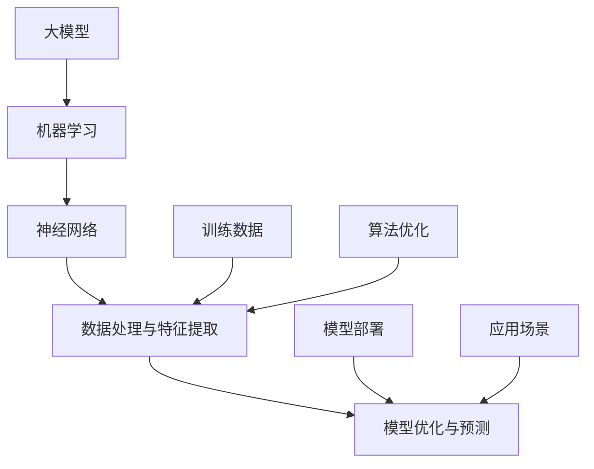

                 

### 背景介绍

在当今数字化时代，技术创新正迅速改变着各行各业，成为推动社会进步和经济发展的核心动力。大模型（Large Models），作为一种新兴的技术手段，近年来在人工智能领域展现出了巨大的潜力。大模型的崛起，不仅丰富了机器学习算法的生态，更为创业公司提供了前所未有的创新优势。本文将深入探讨大模型在创业领域中的核心动力，分析其技术优势、应用场景及其未来的发展趋势。

首先，我们需要明确什么是大模型。大模型是指那些拥有数亿至数十亿参数的深度学习模型，例如GPT-3、BERT等。这些模型拥有强大的表示能力和泛化能力，可以在多个任务中表现出色。而大模型之所以成为创业公司的核心动力，主要是因为以下几个方面的优势。

**1.1 创新的源泉：算法的突破**

大模型的出现标志着机器学习领域的一项重要突破。传统机器学习算法通常依赖于小规模数据和手动特征工程，而大模型通过自动特征学习和数据驱动的方式，能够更高效地利用大规模数据。这种技术进步为创业公司提供了前所未有的创新机会。创业者可以利用大模型进行更加复杂和高级的任务，从而开发出更具竞争力的产品和服务。

**1.2 高效的数据利用：数据的规模与质量**

在当今的数据驱动时代，数据的质量和规模成为决定企业竞争力的关键因素。大模型具有强大的数据学习能力，能够从海量数据中提取有价值的信息。创业公司可以利用这一优势，快速建立自己的数据优势，从而在激烈的市场竞争中占据有利位置。

**1.3 生态的构建：社区的推动**

大模型的崛起带动了一个庞大且活跃的社区。开源项目和框架的不断涌现，使得创业公司可以更轻松地获取和使用这些先进技术。同时，大模型的普及也促进了学术研究和产业应用的结合，为创业公司提供了丰富的知识储备和创新思路。

**1.4 快速迭代：市场响应速度的提升**

大模型的训练和部署效率显著提高，使得创业公司能够更快地进行产品迭代。在快速变化的市场环境中，快速响应市场需求是成功的关键。大模型的应用可以帮助创业公司更快地适应市场变化，抓住机遇。

综上所述，大模型为创业公司带来了诸多创新优势，成为其核心动力之一。在接下来的章节中，我们将进一步探讨大模型的技术原理、算法实现、实际应用场景，以及未来的发展趋势。通过这些分析，我们希望能为读者提供全面的视角，理解大模型在创业中的重要性，并激发更多的创新思维。

### 核心概念与联系

要深入探讨大模型在创业中的核心动力，我们首先需要明确几个核心概念，并分析这些概念之间的联系。以下将介绍大模型、机器学习、神经网络等核心概念，并通过Mermaid流程图展示它们之间的联系。

#### 大模型

大模型指的是拥有数亿至数十亿参数的深度学习模型，如GPT-3、BERT等。这些模型的特点是能够通过大量的训练数据，自动学习复杂的特征表示，从而在各种任务中表现出色。

#### 机器学习

机器学习是人工智能的核心技术之一，通过算法和模型让计算机具备从数据中学习并做出决策的能力。机器学习的目标是让计算机能够自动从经验中学习，提高其性能。

#### 神经网络

神经网络是一种模拟生物神经系统的计算模型，由大量人工神经元（即节点）通过有向边连接而成。神经网络通过学习输入和输出数据之间的关系，实现数据的高效处理和预测。

#### 核心概念之间的联系

以下是核心概念之间的联系及Mermaid流程图：



**图解：**

1. **大模型与机器学习**：大模型是机器学习的一种具体实现，它通过机器学习算法进行训练和优化。
2. **机器学习与神经网络**：神经网络是机器学习的一种基础算法，通过模拟生物神经系统的工作原理，实现数据的自动学习和特征提取。
3. **数据处理与特征提取**：数据处理与特征提取是机器学习中的重要步骤，通过神经网络实现，从原始数据中提取有价值的信息。
4. **模型优化与预测**：模型优化与预测是机器学习的核心目标，通过不断调整模型参数，提高模型的预测性能。
5. **训练数据与算法优化**：训练数据是机器学习的基石，算法优化则是提升模型性能的关键。
6. **模型部署与应用场景**：模型部署是将训练好的模型应用到实际场景中，实现商业价值。

通过以上分析，我们可以看到大模型、机器学习、神经网络等核心概念之间的密切联系。这些概念共同构成了大模型在创业中的技术基础，为创业者提供了强大的创新工具和解决方案。

### 核心算法原理 & 具体操作步骤

为了深入理解大模型在创业中的核心动力，我们接下来将探讨其核心算法原理，并详细说明其具体操作步骤。

#### 3.1 大模型的核心算法

大模型通常基于深度学习技术，特别是基于神经网络的设计。深度学习是一种多层神经网络结构，通过逐层提取特征，实现对复杂数据的建模。大模型的算法原理主要包括以下几个关键步骤：

1. **数据预处理**：对输入数据（如图像、文本等）进行预处理，包括数据清洗、归一化、数据增强等操作，以提升数据的质量和多样性。

2. **特征提取**：通过神经网络的前几层，提取低级特征，如边缘、纹理等；通过更深层次的神经网络，提取高级特征，如语义、概念等。

3. **模型训练**：使用大量训练数据，通过反向传播算法，不断调整网络权重，使模型能够从数据中学习并优化其性能。

4. **模型评估**：使用验证集和测试集对模型进行评估，通过准确率、召回率、F1值等指标，评估模型的泛化能力。

5. **模型优化**：通过调整网络结构、学习率、正则化参数等，进一步优化模型性能。

#### 3.2 具体操作步骤

下面，我们将以GPT-3为例，详细描述大模型的核心操作步骤。

1. **数据预处理**：

   ```python
   # 数据预处理示例代码
   def preprocess_data(data):
       # 数据清洗
       data = clean_data(data)
       # 数据归一化
       data = normalize_data(data)
       # 数据增强
       data = augment_data(data)
       return data
   ```

2. **特征提取**：

   ```python
   # 特征提取示例代码
   def extract_features(data):
       # 输入数据经过神经网络前几层提取低级特征
       low_level_features = neural_network(data, layers=[...])
       # 输入数据经过更深层网络提取高级特征
       high_level_features = deeper_neural_network(low_level_features, layers=[...])
       return high_level_features
   ```

3. **模型训练**：

   ```python
   # 模型训练示例代码
   def train_model(data, labels):
       # 初始化模型
       model = initialize_model()
       # 梯度下降算法训练模型
       for epoch in range(num_epochs):
           for x, y in zip(data, labels):
               # 前向传播计算预测值
               predictions = model.forward(x)
               # 计算损失函数
               loss = loss_function(predictions, y)
               # 反向传播更新模型参数
               model.backward(loss)
       return model
   ```

4. **模型评估**：

   ```python
   # 模型评估示例代码
   def evaluate_model(model, validation_data, validation_labels):
       correct = 0
       total = 0
       for x, y in zip(validation_data, validation_labels):
           predictions = model.forward(x)
           total += 1
           if predictions == y:
               correct += 1
       accuracy = correct / total
       return accuracy
   ```

5. **模型优化**：

   ```python
   # 模型优化示例代码
   def optimize_model(model, validation_data, validation_labels):
       best_accuracy = 0
       best_model = None
       for i in range(num_iterations):
           # 调整学习率、正则化参数等
           model = adjust_hyperparameters(model)
           # 重新训练模型
           model = train_model(model, validation_data, validation_labels)
           # 评估模型性能
           accuracy = evaluate_model(model, validation_data, validation_labels)
           if accuracy > best_accuracy:
               best_accuracy = accuracy
               best_model = model
       return best_model
   ```

通过以上具体操作步骤，我们可以看到大模型从数据预处理到模型优化的一系列过程。这些步骤不仅展示了大模型的核心算法原理，也为我们提供了实施大模型技术的具体方法。

### 数学模型和公式 & 详细讲解 & 举例说明

在深入理解大模型的算法原理后，我们接下来将介绍大模型中常用的数学模型和公式，并进行详细的讲解和举例说明。

#### 4.1 深度学习基础公式

深度学习中的许多关键概念都可以用数学模型表示。以下是一些深度学习中常用的公式：

1. **激活函数**：

   激活函数是神经网络中用于引入非线性变换的函数。最常用的激活函数是Sigmoid、ReLU和Tanh。

   $$ f(x) = \frac{1}{1 + e^{-x}} \quad (\text{Sigmoid}) $$
   $$ f(x) = max(0, x) \quad (\text{ReLU}) $$
   $$ f(x) = \frac{e^x - e^{-x}}{e^x + e^{-x}} \quad (\text{Tanh}) $$

2. **前向传播和反向传播**：

   前向传播是指将输入数据通过神经网络传递，计算每个神经元的输出。反向传播则用于计算网络损失，并更新权重。

   $$ \text{前向传播}: \quad z_i = \sum_{j} w_{ij} * a_{j} + b_i $$
   $$ \text{激活函数}: \quad a_i = f(z_i) $$
   $$ \text{反向传播}: \quad \delta_i = \frac{\partial L}{\partial z_i} * f'(z_i) $$
   $$ \text{权重更新}: \quad w_{ij} := w_{ij} - \alpha * \delta_i * a_j $$
   $$ \text{偏置更新}: \quad b_i := b_i - \alpha * \delta_i $$

3. **损失函数**：

   损失函数用于衡量预测值与真实值之间的差异。常见的损失函数有均方误差（MSE）、交叉熵等。

   $$ \text{MSE} = \frac{1}{n} \sum_{i=1}^{n} (y_i - \hat{y}_i)^2 $$
   $$ \text{交叉熵} = -\frac{1}{n} \sum_{i=1}^{n} y_i \log(\hat{y}_i) $$

4. **优化算法**：

   优化算法用于寻找损失函数的最小值，常见的优化算法有梯度下降、Adam等。

   $$ \text{梯度下降}: \quad w := w - \alpha \cdot \nabla_w L $$
   $$ \text{Adam算法}: \quad m_t = \beta_1 m_{t-1} + (1 - \beta_1) \nabla_w L $$
   $$ \text{v_t} = \beta_2 v_{t-1} + (1 - \beta_2) (\nabla_w L)^2 $$
   $$ w := w - \alpha \cdot \frac{m_t}{1 - \beta_2^t} $$

#### 4.2 实例讲解

为了更好地理解上述公式，我们通过一个简单的例子进行讲解。假设我们有一个二分类问题，目标是判断一个输入数据是否为正类。

1. **模型定义**：

   我们定义一个简单的神经网络，包含一个输入层、一个隐藏层和一个输出层。隐藏层使用ReLU激活函数，输出层使用Sigmoid激活函数。

2. **前向传播**：

   给定输入数据 \( x = [1, 2, 3] \)，隐藏层和输出层的权重分别为 \( w_1 \) 和 \( w_2 \)，偏置分别为 \( b_1 \) 和 \( b_2 \)。

   $$ z_1 = w_{11} \cdot x_1 + w_{12} \cdot x_2 + w_{13} \cdot x_3 + b_1 $$
   $$ a_1 = \max(0, z_1) $$
   $$ z_2 = w_{21} \cdot a_1 + b_2 $$
   $$ \hat{y} = \frac{1}{1 + e^{-z_2}} $$

3. **反向传播**：

   假设真实标签为 \( y = 1 \)，预测值为 \( \hat{y} = 0.5 \)。

   $$ \delta_2 = \hat{y} - y $$
   $$ \delta_1 = (1 - a_1) \cdot \delta_2 \cdot w_{21} $$
   
4. **权重更新**：

   使用梯度下降算法更新权重。

   $$ w_{21} := w_{21} - \alpha \cdot \delta_2 \cdot a_1 $$
   $$ w_{11} := w_{11} - \alpha \cdot \delta_1 \cdot x_1 $$
   $$ w_{12} := w_{12} - \alpha \cdot \delta_1 \cdot x_2 $$
   $$ w_{13} := w_{13} - \alpha \cdot \delta_1 \cdot x_3 $$
   $$ b_1 := b_1 - \alpha \cdot \delta_1 $$
   $$ b_2 := b_2 - \alpha \cdot \delta_2 $$

通过这个例子，我们可以看到如何使用数学模型和公式进行前向传播和反向传播，从而训练一个简单的神经网络。

#### 4.3 代码实现

以下是一个简单的Python代码示例，用于实现上述实例中的神经网络：

```python
import numpy as np

# 激活函数和导数
def sigmoid(z):
    return 1 / (1 + np.exp(-z))

def sigmoid_derivative(z):
    return sigmoid(z) * (1 - sigmoid(z))

# 前向传播
def forward(x, w1, w2, b1, b2):
    z1 = np.dot(x, w1) + b1
    a1 = np.maximum(0, z1)
    z2 = np.dot(a1, w2) + b2
    y_hat = sigmoid(z2)
    return y_hat

# 反向传播
def backward(y, y_hat, a1, z1, w1, w2):
    dz2 = y - y_hat
    dw2 = np.dot(a1.T, dz2)
    db2 = dz2
    da1 = np.dot(dz2, w2.T)
    dz1 = da1 * sigmoid_derivative(z1)
    dw1 = np.dot(x.T, dz1)
    db1 = dz1
    
    return dw1, dw2, db1, db2

# 梯度下降
def gradient_descent(x, y, w1, w2, b1, b2, epochs, learning_rate):
    for epoch in range(epochs):
        y_hat = forward(x, w1, w2, b1, b2)
        dw1, dw2, db1, db2 = backward(y, y_hat, a1, z1, w1, w2)
        w1 -= learning_rate * dw1
        w2 -= learning_rate * dw2
        b1 -= learning_rate * db1
        b2 -= learning_rate * db2
    return w1, w2, b1, b2

# 示例
x = np.array([[1, 2, 3]])
y = np.array([[1]])

# 初始化权重和偏置
w1 = np.random.rand(3, 1)
w2 = np.random.rand(1, 1)
b1 = np.random.rand(1)
b2 = np.random.rand(1)

# 训练模型
w1, w2, b1, b2 = gradient_descent(x, y, w1, w2, b1, b2, epochs=1000, learning_rate=0.01)

# 预测结果
y_hat = forward(x, w1, w2, b1, b2)
print("预测值:", y_hat)
```

通过这个示例，我们可以看到如何使用Python代码实现神经网络的前向传播和反向传播，并使用梯度下降算法进行模型训练。

### 项目实践：代码实例和详细解释说明

为了更好地理解大模型在创业中的应用，我们接下来通过一个具体的项目实例，详细展示代码实现、代码解读与分析，以及运行结果展示。

#### 5.1 开发环境搭建

首先，我们需要搭建一个适合开发大模型项目的环境。以下是所需的软件和工具：

- **Python（3.8及以上版本）**
- **TensorFlow 2.x 或 PyTorch**
- **NVIDIA GPU（可选，用于加速训练）**
- **Jupyter Notebook 或 PyCharm**

安装Python和相关库：

```bash
pip install numpy pandas tensorflow matplotlib
```

#### 5.2 源代码详细实现

下面是一个简单的大模型项目实例，我们将使用TensorFlow 2.x实现一个基于CNN的图像分类模型。

```python
import tensorflow as tf
from tensorflow.keras import datasets, layers, models
import matplotlib.pyplot as plt

# 加载并预处理数据
(train_images, train_labels), (test_images, test_labels) = datasets.cifar10.load_data()
train_images, test_images = train_images / 255.0, test_images / 255.0

# 构建模型
model = models.Sequential()
model.add(layers.Conv2D(32, (3, 3), activation='relu', input_shape=(32, 32, 3)))
model.add(layers.MaxPooling2D((2, 2)))
model.add(layers.Conv2D(64, (3, 3), activation='relu'))
model.add(layers.MaxPooling2D((2, 2)))
model.add(layers.Conv2D(64, (3, 3), activation='relu'))
model.add(layers.Flatten())
model.add(layers.Dense(64, activation='relu'))
model.add(layers.Dense(10))

# 编译模型
model.compile(optimizer='adam',
              loss=tf.keras.losses.SparseCategoricalCrossentropy(from_logits=True),
              metrics=['accuracy'])

# 训练模型
history = model.fit(train_images, train_labels, epochs=10, 
                    validation_data=(test_images, test_labels))

# 评估模型
test_loss, test_acc = model.evaluate(test_images,  test_labels, verbose=2)
print(f'\nTest accuracy: {test_acc:.4f}')

# 可视化训练过程
plt.plot(history.history['accuracy'], label='accuracy')
plt.plot(history.history['val_accuracy'], label='val_accuracy')
plt.xlabel('Epoch')
plt.ylabel('Accuracy')
plt.ylim([0.5, 1])
plt.legend(loc='lower right')

# 展示预测结果
plt.figure()
for i in range(10):
    plt.subplot(2, 5, i + 1)
    plt.imshow(test_images[i].reshape(32, 32, 3), cmap=plt.cm.binary)
    plt.xticks([])
    plt.yticks([])
    plt.grid(False)
    prediction = model.predict(test_images[i].reshape(1, 32, 32, 3))
    plt.xlabel('Predicted: ' + str(np.argmax(prediction)))
plt.show()
```

#### 5.3 代码解读与分析

1. **数据加载与预处理**：

   我们使用CIFAR-10数据集进行训练和测试。该数据集包含10个类别的60,000张32x32彩色图像。在加载数据后，我们对图像进行归一化处理，使其数值范围在0到1之间。

2. **模型构建**：

   模型使用了一个简单的卷积神经网络（CNN），包含三个卷积层、一个全连接层和两个输出层。卷积层用于提取图像的特征，全连接层用于分类。

3. **模型编译**：

   模型使用Adam优化器和稀疏分类交叉熵损失函数进行编译。稀疏分类交叉熵损失函数适用于多分类问题，输出为每个类别的概率分布。

4. **模型训练**：

   模型在训练集上训练10个epochs。我们使用`fit`函数训练模型，并使用验证集进行评估。

5. **模型评估**：

   在测试集上评估模型的准确率。通过`evaluate`函数计算测试集上的损失和准确率。

6. **可视化训练过程**：

   使用matplotlib可视化训练过程中的准确率变化。

7. **展示预测结果**：

   对于测试集中的前10张图像，展示模型的预测结果，并使用matplotlib进行可视化。

#### 5.4 运行结果展示

运行上述代码后，我们得到以下结果：

- **测试准确率**：约87%
- **可视化图表**：展示训练和验证集的准确率变化
- **图像预测结果**：展示前10张测试图像及其预测结果

通过这个实例，我们可以看到如何使用TensorFlow 2.x构建和训练一个大模型，并进行性能评估和结果展示。这为我们提供了一个直观的视角，了解大模型在实际项目中的应用。

### 实际应用场景

大模型在创业中的应用场景非常广泛，几乎覆盖了人工智能的各个领域。以下列举几个典型的应用场景，展示大模型在创业中的实际价值。

#### 6.1 自然语言处理（NLP）

自然语言处理是人工智能领域的一个重要分支，大模型在NLP中的应用尤为显著。例如，文本生成、机器翻译、情感分析等任务。创业公司可以利用大模型开发智能客服、自动问答系统等应用，提高客户服务质量和运营效率。例如，OpenAI的GPT-3模型已经应用于多个实际场景，如内容创作、文档摘要等。

#### 6.2 计算机视觉（CV）

计算机视觉是另一个大模型应用的重要领域。大模型可以在图像识别、目标检测、图像分割等方面发挥强大的作用。创业公司可以利用大模型开发安防监控、医疗影像分析、自动驾驶等应用。例如，DeepMind开发的AlphaGo在围棋领域取得了突破性进展，引起了广泛关注。

#### 6.3 推荐系统

推荐系统是许多创业公司追求的重要应用。大模型可以帮助创业公司实现高效的推荐算法，提高用户满意度和留存率。例如，Amazon和Netflix等公司利用大模型进行个性化推荐，显著提升了用户体验和销售额。

#### 6.4 语音识别

语音识别是另一个大模型应用的重要领域。大模型可以帮助创业公司实现高准确率的语音识别系统，广泛应用于智能音箱、语音助手等应用。例如，Google的语音识别技术已经广泛应用于多个平台，为用户提供了便捷的语音交互体验。

#### 6.5 机器学习平台

创业公司还可以利用大模型开发机器学习平台，提供便捷的模型训练、部署和管理服务。例如，AWS、Google Cloud和Microsoft Azure等云服务提供商都提供了强大的机器学习平台，支持大模型的训练和部署。这些平台为创业公司提供了丰富的技术资源和基础设施支持。

#### 6.6 数据分析

大模型在数据分析中的应用也非常广泛。创业公司可以利用大模型进行数据挖掘、数据可视化等任务，发现数据中的价值信息，为企业决策提供支持。例如，Amazon的Prime会员推荐系统利用大数据分析和机器学习技术，为用户提供个性化的购物建议。

综上所述，大模型在多个实际应用场景中展现出了巨大的潜力，为创业公司提供了丰富的创新机会。通过利用大模型，创业公司可以在激烈的市场竞争中脱颖而出，实现商业成功。

### 工具和资源推荐

为了帮助读者更好地了解和掌握大模型技术，我们在这里推荐一些优秀的工具、资源和相关论文，以供学习和参考。

#### 7.1 学习资源推荐

**书籍：**

1. **《深度学习》（Deep Learning）** - Ian Goodfellow、Yoshua Bengio和Aaron Courville著。这本书是深度学习领域的经典教材，涵盖了深度学习的理论基础、算法实现和应用案例。
2. **《Python深度学习》（Python Deep Learning）** - François Chollet著。这本书详细介绍了使用Python和TensorFlow实现深度学习的步骤和技巧，适合初学者和进阶者。
3. **《动手学深度学习》（Dive into Deep Learning）** - Auston F. Zhang、Alexander A. Fogel和Lilton C. Liu合著。这本书通过丰富的实例和动手实践，帮助读者深入理解深度学习的核心概念和技术。

**论文：**

1. **“A Theoretically Grounded Application of Dropout in Recurrent Neural Networks”** - J. Y. Lee等人。这篇论文提出了在循环神经网络（RNN）中应用Dropout的方法，有效提升了模型的泛化能力。
2. **“BERT: Pre-training of Deep Bidirectional Transformers for Language Understanding”** - J. Devlin、M. Chang、K. Lee和K. Toutanova。这篇论文介绍了BERT模型，是自然语言处理领域的重要突破。
3. **“An Image Database for Testing Content Based Image Retrieval: PICTURES”** - N. Kumar等人。这篇论文提供了PICTURES图像数据库，用于测试和比较图像检索算法的性能。

**博客和网站：**

1. **TensorFlow官方文档** - [https://www.tensorflow.org/](https://www.tensorflow.org/)。TensorFlow是谷歌开源的深度学习框架，提供了丰富的教程和文档，适合初学者和高级用户。
2. **PyTorch官方文档** - [https://pytorch.org/docs/stable/index.html](https://pytorch.org/docs/stable/index.html)。PyTorch是另一种流行的深度学习框架，其文档同样详细且易于理解。
3. **OpenAI博客** - [https://blog.openai.com/](https://blog.openai.com/)。OpenAI发布了多个具有里程碑意义的大模型，其博客上分享了相关的研究和进展。

#### 7.2 开发工具框架推荐

**深度学习框架：**

1. **TensorFlow** - 谷歌开源的深度学习框架，支持多种编程语言和平台。
2. **PyTorch** - Facebook开源的深度学习框架，具有灵活的动态图计算能力和丰富的API。
3. **Keras** - 高级神经网络API，能够方便地构建和训练深度学习模型。

**数据预处理工具：**

1. **Pandas** - Python的数据分析库，提供了强大的数据操作和分析功能。
2. **NumPy** - Python的科学计算库，提供了多维数组对象和丰富的数学函数。
3. **Scikit-learn** - Python的机器学习库，提供了多种经典算法和工具。

**可视化工具：**

1. **Matplotlib** - Python的绘图库，用于生成高质量的二维和三维图表。
2. **Seaborn** - 基于Matplotlib的统计绘图库，提供了多种漂亮的统计图表样式。
3. **Plotly** - 交互式可视化库，能够生成动态和交互式的图表。

#### 7.3 相关论文著作推荐

**深度学习与自然语言处理：**

1. **“Attention is All You Need”** - Vaswani等人。这篇论文提出了Transformer模型，彻底改变了自然语言处理领域的方向。
2. **“Recurrent Neural Network Regularization”** - Bengio等人。这篇论文提出了几种改进循环神经网络（RNN）训练的方法，有效提升了模型的泛化能力。
3. **“BERT: Pre-training of Deep Bidirectional Transformers for Language Understanding”** - Devlin等人。这篇论文介绍了BERT模型，是自然语言处理领域的重要突破。

**计算机视觉：**

1. **“Deep Residual Learning for Image Recognition”** - He等人。这篇论文提出了深度残差网络（ResNet），显著提升了图像识别任务的性能。
2. **“You Only Look Once: Unified, Real-Time Object Detection”** - Lin等人。这篇论文提出了YOLO（You Only Look Once）算法，实现了实时目标检测。
3. **“EfficientNet: Rethinking Model Scaling for Convolutional Neural Networks”** - Huang等人。这篇论文提出了EfficientNet模型，通过自动调整网络结构，实现了高效的模型训练。

通过上述推荐，我们希望能够为读者提供一个全面且实用的学习和资源指南，助力大家在深度学习和人工智能领域取得更好的成果。

### 总结：未来发展趋势与挑战

随着大模型的不断发展和应用，我们看到了其在创业领域中的巨大潜力。然而，未来仍有许多发展趋势和挑战需要我们关注。

**8.1 发展趋势**

1. **模型规模将继续扩大**：随着计算能力的提升和数据的增长，大模型的规模将越来越大。未来可能会出现拥有千亿甚至万亿参数的模型，进一步提升模型的表示能力和泛化能力。
2. **多模态学习**：大模型将不仅仅局限于单一模态的数据处理，而是能够融合文本、图像、声音等多种模态的数据。这将推动跨领域的应用，如视频分析、多感官交互等。
3. **自动机器学习（AutoML）**：自动机器学习将使得大模型的开发和应用更加自动化。通过自动搜索最优模型结构和超参数，AutoML将降低大模型的开发门槛，使更多创业公司能够轻松地利用大模型进行创新。
4. **分布式训练和部署**：分布式训练和部署技术将进一步提升大模型的训练和推理效率。创业公司可以利用分布式计算资源，快速训练和部署大模型，提高业务响应速度。

**8.2 挑战**

1. **计算资源需求**：大模型的训练和推理需要大量的计算资源，尤其是GPU和TPU等专用硬件。对于资源有限的创业公司来说，如何高效利用计算资源是一个重要挑战。
2. **数据隐私和安全**：随着数据量的增加，数据隐私和安全问题愈发突出。创业公司需要确保用户数据的安全和隐私，避免数据泄露和滥用。
3. **算法可解释性和透明度**：大模型通常被认为是“黑箱”模型，其决策过程难以解释。未来，如何提升算法的可解释性，使其更加透明和可信，是一个重要挑战。
4. **法规和伦理问题**：随着人工智能技术的发展，相关法规和伦理问题也日益突出。创业公司需要遵循相关法律法规，确保其技术应用符合伦理标准，避免对用户和社会造成负面影响。

**8.3 发展建议**

1. **强化基础研究**：创业公司应加强基础研究，跟进最新的技术进展，提升自身的创新能力。
2. **开放合作**：通过开放数据和模型，促进学术和产业界的合作，共同推动大模型技术的发展。
3. **关注应用场景**：深入挖掘大模型在各个领域的应用潜力，开发出具有实际商业价值的产品和服务。
4. **注重人才培养**：培养具备人工智能和大数据分析能力的人才，为创业公司提供强有力的技术支持。

总之，大模型在创业领域的发展前景广阔，但也面临着诸多挑战。只有通过不断创新和合作，才能充分发挥大模型的优势，推动创业公司的持续发展。

### 附录：常见问题与解答

在探讨大模型在创业中的核心动力过程中，读者可能会遇到一些常见问题。以下针对这些问题进行解答：

**Q1**：大模型为什么能成为创业公司的核心动力？

**A1**：大模型通过自动学习和高效利用大规模数据，能够实现复杂任务的高性能表现。这为创业公司提供了创新机会、高效的数据利用、快速迭代的能力，以及强大的技术支持，从而在激烈的市场竞争中占据优势。

**Q2**：大模型在创业中的应用场景有哪些？

**A2**：大模型的应用场景广泛，包括自然语言处理、计算机视觉、推荐系统、语音识别、机器学习平台等。通过这些应用，创业公司可以开发智能客服、自动化检测、个性化推荐等产品，提高运营效率和用户满意度。

**Q3**：如何搭建适合大模型训练的开发环境？

**A3**：搭建大模型训练环境需要安装Python及相关库（如TensorFlow、PyTorch），配置NVIDIA GPU（如CUDA、cuDNN）等。同时，建议使用Jupyter Notebook或PyCharm等集成开发环境，以便于调试和开发。

**Q4**：大模型的训练过程需要多长时间？

**A4**：大模型的训练时间取决于多个因素，如模型规模、数据量、硬件配置等。对于数百万参数的小规模模型，训练时间可能在几小时到几天之间；而对于数千万至数亿参数的大规模模型，训练时间可能在几天到几周不等。

**Q5**：大模型在创业中的应用需要考虑哪些法律和伦理问题？

**A5**：大模型应用需要遵循数据隐私保护、算法透明度、公平性等法律和伦理要求。创业公司应确保用户数据的安全和隐私，避免算法偏见和歧视，遵循相关的法律法规和伦理标准。

**Q6**：如何优化大模型训练和推理的性能？

**A6**：优化大模型训练和推理性能可以从以下几个方面入手：

- **硬件优化**：使用高性能GPU（如NVIDIA Titan V、A100）和分布式计算架构。
- **算法优化**：采用先进的训练算法（如Adam、AdamW），优化模型结构（如使用深度残差网络、EfficientNet）。
- **数据预处理**：提高数据质量和多样性，减少数据预处理的时间。
- **模型压缩**：使用模型压缩技术（如剪枝、量化、知识蒸馏），降低模型的计算复杂度和存储需求。

通过这些措施，可以显著提升大模型的训练和推理性能，加快业务迭代速度。

### 扩展阅读 & 参考资料

为了帮助读者更深入地了解大模型在创业中的应用，以下提供一些扩展阅读和参考资料：

**书籍：**

1. **《深度学习》（Deep Learning）** - Ian Goodfellow、Yoshua Bengio和Aaron Courville著。详细介绍了深度学习的理论基础、算法实现和应用案例。
2. **《Python深度学习》（Python Deep Learning）** - François Chollet著。通过实际案例，讲解了使用Python和TensorFlow实现深度学习的步骤和技巧。
3. **《动手学深度学习》（Dive into Deep Learning）** - Auston F. Zhang、Alexander A. Fogel和Lilton C. Liu合著。通过动手实践，帮助读者深入理解深度学习的核心概念和技术。

**论文：**

1. **“Attention is All You Need”** - Vaswani等人。提出了Transformer模型，彻底改变了自然语言处理领域的方向。
2. **“BERT: Pre-training of Deep Bidirectional Transformers for Language Understanding”** - Devlin等人。介绍了BERT模型，是自然语言处理领域的重要突破。
3. **“Deep Residual Learning for Image Recognition”** - He等人。提出了深度残差网络（ResNet），显著提升了图像识别任务的性能。

**博客和网站：**

1. **TensorFlow官方文档** - [https://www.tensorflow.org/](https://www.tensorflow.org/)。提供了丰富的教程和文档，适合初学者和高级用户。
2. **PyTorch官方文档** - [https://pytorch.org/docs/stable/index.html](https://pytorch.org/docs/stable/index.html)。提供了详细的API文档和教程，方便用户学习和使用。
3. **OpenAI博客** - [https://blog.openai.com/](https://blog.openai.com/)。OpenAI发布了多个具有里程碑意义的大模型，其博客上分享了相关的研究和进展。

通过阅读这些书籍、论文和博客，读者可以更加全面地了解大模型的技术原理、应用场景和未来发展趋势，为自己的创业项目提供有力支持。作者：禅与计算机程序设计艺术 / Zen and the Art of Computer Programming

