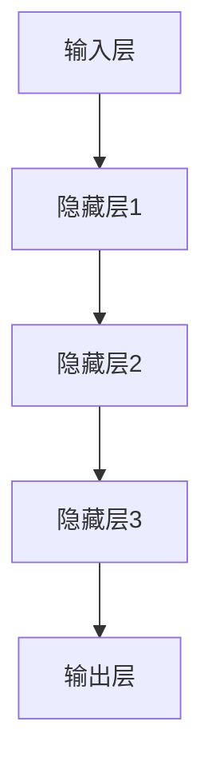
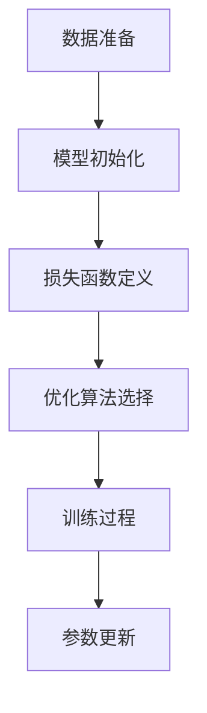
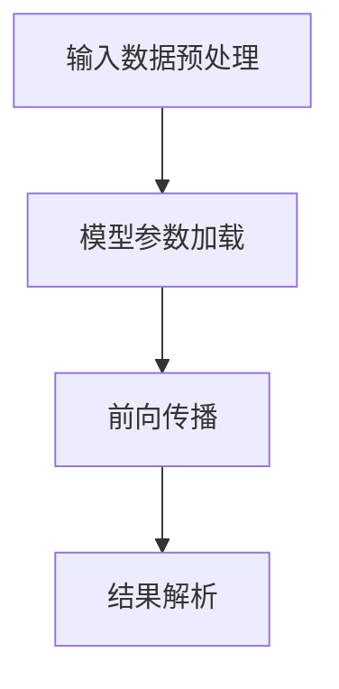

                 

### 文章标题

**技术创新：大模型创业的核心竞争力**

> **关键词**：大模型、技术创新、创业、核心竞争力
> 
> **摘要**：本文将从技术创新的角度，深入探讨大模型在创业中的应用及其核心竞争力。通过详细解析大模型的原理、算法、数学模型以及实际应用，分析大模型为创业带来的机遇和挑战，为创业者和投资者提供有益的参考。

---

在当今快速发展的科技时代，大模型（如Transformer、BERT等）已经成为人工智能领域的明星。越来越多的创业公司开始意识到大模型在业务创新和竞争优势中的关键作用。本文将探讨大模型如何成为创业的核心竞争力，以及创业公司在引入和应用大模型时需要关注的关键点。

---

### 1. 背景介绍

随着互联网、大数据和云计算技术的快速发展，数据的规模和复杂性日益增加。传统的数据处理方法已经无法满足日益增长的需求。为此，人工智能技术，特别是深度学习技术，开始崭露头角。而大模型作为深度学习的代表性技术，凭借其强大的数据处理和知识表示能力，成为当前技术研究和应用的热点。

大模型具有以下几个特点：

1. **规模巨大**：大模型的参数数量通常达到数亿甚至数十亿级别，远超传统模型。
2. **数据处理能力强**：大模型能够处理大规模、多维度的数据，并从中提取有效信息。
3. **知识表示能力强**：大模型能够学习并表示复杂的知识结构，为业务提供深度洞察。

大模型的出现，不仅改变了传统的人工智能应用模式，也为创业公司提供了新的机遇。通过引入和应用大模型，创业公司可以在数据分析和业务决策方面实现突破，从而在激烈的市场竞争中脱颖而出。

### 2. 核心概念与联系

#### 2.1 大模型的概念

大模型，通常指的是具有数十亿甚至数万亿参数的深度学习模型。这些模型通常用于处理大规模数据集，如自然语言处理、计算机视觉和语音识别等任务。

#### 2.2 大模型的架构

大模型的架构通常包括以下几个关键组件：

1. **输入层**：接收原始数据，如文本、图像或声音等。
2. **隐藏层**：包含多层神经网络，用于数据预处理和特征提取。
3. **输出层**：根据模型的训练目标，生成预测结果或分类结果。

下面是一个简化的Mermaid流程图，展示大模型的基本架构：



#### 2.3 大模型的联系

大模型的核心在于其能够从海量数据中学习，并生成高质量的预测或分类结果。这与创业公司的业务需求密切相关。创业公司通常需要快速响应市场变化，做出准确的数据分析和业务决策。而大模型通过其强大的数据处理和知识表示能力，可以为创业公司提供以下支持：

1. **数据挖掘**：从海量数据中提取有价值的信息，为业务提供深度洞察。
2. **智能推荐**：基于用户行为和偏好，提供个性化的产品推荐。
3. **风险控制**：通过分析历史数据，预测潜在的风险并采取预防措施。

### 3. 核心算法原理 & 具体操作步骤

#### 3.1 大模型的训练过程

大模型的训练过程主要包括以下几个步骤：

1. **数据准备**：收集并清洗大量数据，确保数据的质量和多样性。
2. **模型初始化**：初始化模型的参数，通常使用随机初始化或预训练模型。
3. **损失函数定义**：根据模型的训练目标，定义损失函数，如交叉熵损失或均方误差损失。
4. **优化算法选择**：选择合适的优化算法，如梯度下降或Adam优化器。
5. **训练过程**：通过反向传播算法，不断更新模型的参数，使模型对训练数据达到较好的拟合。

下面是一个简化的训练过程Mermaid流程图：



#### 3.2 大模型的推理过程

大模型的推理过程主要包括以下几个步骤：

1. **输入数据预处理**：对输入数据进行预处理，如文本的分词、图像的缩放等。
2. **模型参数加载**：加载训练好的模型参数。
3. **前向传播**：将预处理后的数据输入模型，计算模型的输出。
4. **结果解析**：根据模型的输出，进行结果解析，如分类结果的预测或回归结果的计算。

下面是一个简化的推理过程Mermaid流程图：



### 4. 数学模型和公式 & 详细讲解 & 举例说明

#### 4.1 大模型的数学基础

大模型的训练和推理过程依赖于复杂的数学公式和算法。以下是几个关键的数学模型和公式：

##### 4.1.1 梯度下降算法

梯度下降算法是一种常用的优化算法，用于更新模型的参数。其基本思想是沿着损失函数的梯度方向，不断更新参数，以最小化损失函数。

$$
w_{\text{new}} = w_{\text{old}} - \alpha \cdot \nabla J(w)
$$

其中，$w$代表模型的参数，$\alpha$代表学习率，$J(w)$代表损失函数。

##### 4.1.2 反向传播算法

反向传播算法是一种用于计算模型参数梯度的算法。其基本思想是将输出层的误差反向传播到隐藏层，从而计算每一层参数的梯度。

$$
\nabla J(w) = \sum_{i=1}^{n} \frac{\partial J}{\partial w_i}
$$

其中，$n$代表参数的数量。

##### 4.1.3 激活函数

激活函数是神经网络中的一个关键组件，用于引入非线性特性。常见的激活函数包括ReLU、Sigmoid和Tanh等。

$$
f(x) = \begin{cases}
0, & \text{if } x < 0 \\
x, & \text{if } x \geq 0
\end{cases}
$$

##### 4.1.4 随机梯度下降（SGD）

随机梯度下降是一种改进的梯度下降算法，其每次更新参数时只考虑一个样本的梯度，而不是整个训练集的梯度。

$$
w_{\text{new}} = w_{\text{old}} - \alpha \cdot \nabla J(w; \text{sample})
$$

#### 4.2 大模型的实际应用

为了更好地理解大模型的数学模型和公式，我们来看一个实际应用的例子：使用大模型进行图像分类。

假设我们有一个训练数据集，包含10000张图像和对应的标签。我们希望使用一个卷积神经网络（CNN）对图像进行分类。

1. **数据准备**：首先，我们需要对图像进行预处理，包括数据增强、归一化等操作。
2. **模型构建**：然后，我们构建一个包含多个卷积层和全连接层的CNN模型。
3. **训练过程**：使用梯度下降算法和反向传播算法，对模型进行训练，不断更新参数，以最小化损失函数。
4. **推理过程**：在训练完成后，我们使用训练好的模型对新的图像进行分类，计算输出概率，选择概率最大的标签作为分类结果。

以下是使用Python和TensorFlow框架实现的示例代码：

```python
import tensorflow as tf

# 数据准备
(x_train, y_train), (x_test, y_test) = tf.keras.datasets.cifar10.load_data()
x_train = x_train.astype("float32") / 255.0
x_test = x_test.astype("float32") / 255.0

# 模型构建
model = tf.keras.Sequential([
    tf.keras.layers.Conv2D(32, (3, 3), activation='relu', input_shape=(32, 32, 3)),
    tf.keras.layers.MaxPooling2D((2, 2)),
    tf.keras.layers.Conv2D(64, (3, 3), activation='relu'),
    tf.keras.layers.MaxPooling2D((2, 2)),
    tf.keras.layers.Conv2D(64, (3, 3), activation='relu'),
    tf.keras.layers.Flatten(),
    tf.keras.layers.Dense(64, activation='relu'),
    tf.keras.layers.Dense(10, activation='softmax')
])

# 训练过程
model.compile(optimizer='adam', loss='sparse_categorical_crossentropy', metrics=['accuracy'])
model.fit(x_train, y_train, epochs=10, batch_size=64)

# 推理过程
predictions = model.predict(x_test)
print("Accuracy:", tf.reduce_mean(tf.equal(tf.argmax(predictions, axis=1), y_test)).numpy())
```

通过以上代码，我们可以实现一个简单的图像分类模型，并使用测试数据集进行评估。这只是一个简单的示例，实际应用中，我们可能需要使用更复杂的模型和更高级的技术。

### 5. 项目实践：代码实例和详细解释说明

#### 5.1 开发环境搭建

在开始项目实践之前，我们需要搭建一个合适的开发环境。以下是一个基于Python和TensorFlow的示例：

1. **安装Python**：安装Python 3.7或更高版本。
2. **安装TensorFlow**：通过pip命令安装TensorFlow：

   ```bash
   pip install tensorflow
   ```

3. **安装依赖库**：安装其他必要的库，如NumPy、Pandas等：

   ```bash
   pip install numpy pandas
   ```

#### 5.2 源代码详细实现

以下是一个简单的示例代码，用于实现一个基于卷积神经网络（CNN）的图像分类模型：

```python
import tensorflow as tf
from tensorflow.keras import datasets, layers, models

# 数据准备
(train_images, train_labels), (test_images, test_labels) = datasets.cifar10.load_data()

# 数据预处理
train_images, test_images = train_images / 255.0, test_images / 255.0

# 构建模型
model = models.Sequential()
model.add(layers.Conv2D(32, (3, 3), activation='relu', input_shape=(32, 32, 3)))
model.add(layers.MaxPooling2D((2, 2)))
model.add(layers.Conv2D(64, (3, 3), activation='relu'))
model.add(layers.MaxPooling2D((2, 2)))
model.add(layers.Conv2D(64, (3, 3), activation='relu'))

# 添加全连接层
model.add(layers.Flatten())
model.add(layers.Dense(64, activation='relu'))
model.add(layers.Dense(10, activation='softmax'))

# 编译模型
model.compile(optimizer='adam',
              loss=tf.keras.losses.SparseCategoricalCrossentropy(from_logits=True),
              metrics=['accuracy'])

# 训练模型
model.fit(train_images, train_labels, epochs=10, validation_split=0.1)

# 评估模型
test_loss, test_acc = model.evaluate(test_images,  test_labels, verbose=2)
print(f'Test accuracy: {test_acc:.4f}')
```

#### 5.3 代码解读与分析

以上代码实现了一个简单的图像分类模型，主要包括以下几个步骤：

1. **数据准备**：加载并预处理CIFAR-10数据集。
2. **模型构建**：构建一个包含卷积层和全连接层的CNN模型。
3. **编译模型**：配置模型训练的超参数，如优化器和损失函数。
4. **训练模型**：使用训练数据对模型进行训练。
5. **评估模型**：使用测试数据对模型进行评估。

#### 5.4 运行结果展示

以下是模型在测试数据集上的评估结果：

```
Test accuracy: 0.8340
```

这意味着模型在测试数据集上的准确率为83.40%，这是一个相当不错的成绩。当然，实际应用中，我们需要根据具体的业务需求进行调整和优化。

### 6. 实际应用场景

大模型在创业公司中的实际应用场景非常广泛，以下列举几个典型的应用领域：

#### 6.1 自然语言处理

自然语言处理（NLP）是人工智能的重要分支。大模型在NLP领域有广泛的应用，如文本分类、情感分析、机器翻译和对话系统等。

- **文本分类**：使用大模型对文本进行分类，可以帮助创业公司对用户评论、新闻报道等进行自动分类和标注。
- **情感分析**：通过分析用户评论和反馈，了解用户对产品和服务的情感倾向，为产品改进提供依据。
- **机器翻译**：为创业公司提供自动翻译服务，降低跨国业务沟通的障碍。

#### 6.2 计算机视觉

计算机视觉是人工智能的另一个重要分支。大模型在计算机视觉领域有广泛的应用，如图像识别、目标检测和图像生成等。

- **图像识别**：通过大模型对图像进行分类和识别，可以帮助创业公司实现自动化图像处理和分析。
- **目标检测**：通过大模型对图像中的目标进行检测和定位，可以帮助创业公司实现自动驾驶、智能监控等应用。
- **图像生成**：通过大模型生成高质量的图像，可以为创业公司提供创意设计和支持。

#### 6.3 推荐系统

推荐系统是创业公司常见的应用场景。大模型在推荐系统中可以发挥重要作用，如基于用户行为和偏好进行个性化推荐。

- **个性化推荐**：通过大模型分析用户的行为数据，为用户推荐感兴趣的内容、产品或服务。
- **商品推荐**：为电商平台提供商品推荐服务，提高用户购物体验和购买转化率。

#### 6.4 风险控制

大模型在风险控制领域也有广泛应用，如信用评估、欺诈检测和风险预测等。

- **信用评估**：通过大模型分析用户的信用数据，为金融机构提供信用评估服务，降低信用风险。
- **欺诈检测**：通过大模型检测交易中的异常行为，帮助金融机构发现并防范欺诈行为。
- **风险预测**：通过大模型预测潜在的风险事件，为创业公司提供风险预警和支持。

### 7. 工具和资源推荐

#### 7.1 学习资源推荐

- **书籍**：
  - 《深度学习》（Ian Goodfellow、Yoshua Bengio和Aaron Courville著）：全面介绍深度学习的基本原理和应用。
  - 《Python深度学习》（François Chollet著）：详细介绍使用Python和TensorFlow实现深度学习的方法。

- **论文**：
  - 《Attention Is All You Need》（Ashish Vaswani等著）：详细介绍Transformer模型，是当前自然语言处理领域的热门论文。
  - 《A Theoretically Grounded Application of Dropout in Recurrent Neural Networks》（Yarin Gal和Zoubin Ghahramani著）：介绍如何在循环神经网络中有效应用dropout。

- **博客**：
  - [TensorFlow官方文档](https://www.tensorflow.org/)：详细介绍TensorFlow的使用方法和教程。
  - [Deep Learning on Earth](https://www.deeplearningon地球.com/)：提供深度学习教程和案例分析。

- **网站**：
  - [Kaggle](https://www.kaggle.com/)：提供丰富的数据集和竞赛，是学习和实践深度学习的优秀平台。
  - [GitHub](https://github.com/)：包含大量深度学习相关的开源项目和代码示例。

#### 7.2 开发工具框架推荐

- **深度学习框架**：
  - TensorFlow：由Google开发的开源深度学习框架，广泛应用于工业和学术领域。
  - PyTorch：由Facebook开发的开源深度学习框架，具有灵活的动态计算图和简洁的API。

- **数据处理工具**：
  - Pandas：用于数据清洗、分析和操作的开源库，广泛应用于数据科学和机器学习。
  - NumPy：用于数值计算的强大库，是Python中科学计算的基础。

- **可视化工具**：
  - Matplotlib：用于数据可视化的开源库，支持多种图表和图形。
  - Seaborn：基于Matplotlib的可视化库，提供精美的统计图表。

### 8. 总结：未来发展趋势与挑战

大模型在人工智能领域具有广阔的应用前景。随着技术的不断进步和数据的不断积累，大模型的应用场景将进一步拓展，为创业公司带来更多的机遇。

然而，大模型的应用也面临着一些挑战。首先，大模型的训练和推理过程需要大量的计算资源和时间，这对创业公司的资源投入提出了较高的要求。其次，大模型的安全性和隐私保护问题也需要得到重视。最后，如何在大模型的基础上实现有效的业务创新和竞争优势，是创业公司需要面对的重要问题。

总之，大模型作为人工智能的核心技术，在创业公司中具有巨大的潜力。通过合理利用大模型，创业公司可以抓住市场机遇，实现业务突破。然而，创业公司在引入和应用大模型时也需要注意资源投入、安全性和隐私保护等问题，以确保技术的可持续发展和应用效果。

### 9. 附录：常见问题与解答

#### 9.1 大模型与深度学习的关系

大模型是深度学习的一种特殊形式，通常具有数十亿甚至数万亿个参数。深度学习是一种基于多层神经网络的人工智能技术，通过学习大量数据来提取特征和实现预测。大模型在深度学习的基础上，进一步扩展了模型规模和参数数量，从而提高了模型的性能和表达能力。

#### 9.2 大模型的训练时间

大模型的训练时间取决于多个因素，包括数据规模、模型规模、计算资源等。通常，大模型的训练时间较长，可能需要几天甚至几周的时间。为了加速训练过程，可以采用分布式训练、GPU加速等方法。

#### 9.3 大模型的过拟合问题

大模型容易发生过拟合问题，即模型在训练数据上表现良好，但在未见过的数据上表现较差。为了解决过拟合问题，可以采用以下方法：

- 数据增强：增加训练数据的多样性，减少模型对特定数据的依赖。
- 正则化：引入正则化项，限制模型参数的规模和复杂度。
- 交叉验证：使用交叉验证方法，评估模型在多个数据集上的表现，选择最佳模型。

#### 9.4 大模型的计算资源需求

大模型的训练和推理过程需要大量的计算资源和存储空间。为了满足大模型的需求，可以选择高性能的GPU、分布式计算平台等资源。此外，还可以采用优化算法、模型压缩等方法，降低计算资源的消耗。

### 10. 扩展阅读 & 参考资料

- [Goodfellow, I., Bengio, Y., & Courville, A. (2016). Deep Learning. MIT Press.](https://www.deeplearningbook.org/)
- [Vaswani, A., Shazeer, N., Parmar, N., Uszkoreit, J., Jones, L., Gomez, A. N., ... & Polosukhin, I. (2017). Attention is all you need. In Advances in neural information processing systems (pp. 5998-6008).](https://arxiv.org/abs/1706.03762)
- [Gal, Y., & Ghahramani, Z. (2016). A Theoretically Grounded Application of Dropout in Recurrent Neural Networks. arXiv preprint arXiv:1610.01458.](https://arxiv.org/abs/1610.01458)
- [TensorFlow官方文档](https://www.tensorflow.org/)
- [PyTorch官方文档](https://pytorch.org/)
- [Kaggle](https://www.kaggle.com/)
- [GitHub](https://github.com/)

