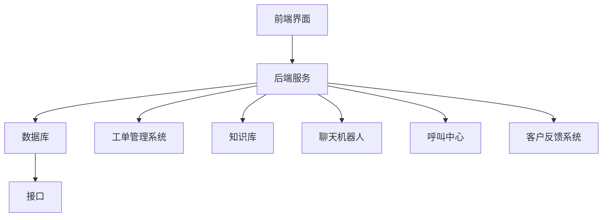

                 

### 1. 背景介绍

在当今快速发展的商业环境中，客户支持系统已成为企业竞争力的关键因素。作为技术型创业者，构建一个高效的客户支持系统不仅有助于提高客户满意度，还能有效降低运营成本，增强企业的市场竞争力。然而，在实现这一目标的过程中，面临着诸多挑战和决策。

本文将探讨技术型创业者如何打造一个高效的客户支持系统。我们将从以下几个方面展开讨论：

1. **客户支持系统的核心概念与架构**：首先，我们将介绍客户支持系统的基本概念，包括客户支持的重要性、常见功能模块及其相互关系。
2. **核心算法原理与具体操作步骤**：接下来，我们将深入探讨客户支持系统中涉及的核心算法，以及如何将其应用到实际操作中。
3. **数学模型和公式**：我们将介绍用于评估和支持系统性能的数学模型，并运用具体公式进行详细讲解。
4. **项目实践**：通过一个具体的代码实例，我们将展示如何实现一个基本的客户支持系统，并对代码进行详细解读。
5. **实际应用场景**：我们将讨论客户支持系统在不同商业场景中的应用，以及如何针对特定需求进行系统优化。
6. **工具和资源推荐**：我们将推荐一些有助于开发高效客户支持系统的工具和资源，包括学习资源、开发工具框架和相关论文著作。
7. **总结与未来发展趋势**：最后，我们将总结文章的主要观点，并探讨未来客户支持系统的发展趋势和面临的挑战。

通过本文的逐步分析，技术型创业者将能够更好地理解如何构建一个高效、可扩展的客户支持系统，从而提升企业的核心竞争力。

### 2. 核心概念与联系

要构建一个高效的客户支持系统，首先需要理解其核心概念与架构。客户支持系统的主要目标是提供快速、准确和个性化的客户服务，以提高客户满意度和忠诚度。以下是客户支持系统的核心概念及其相互关系：

#### 2.1 客户支持的重要性

客户支持是企业与客户之间的重要桥梁。它不仅能够帮助解决客户的问题和疑虑，还能提升客户体验，增强品牌形象。高效的客户支持系统能够快速响应用户需求，提供专业的解决方案，从而提升客户满意度和忠诚度。

#### 2.2 常见功能模块

客户支持系统通常包含以下功能模块：

1. **工单管理系统**：用于记录、跟踪和处理客户问题。工单管理系统可以帮助企业高效地处理大量客户请求，确保每个问题都能得到及时解决。
2. **知识库**：为客户提供自助服务，包含常见问题、解决方案和教程。知识库能够减少人工干预，提高客户自助解决问题的效率。
3. **聊天机器人**：提供即时通讯服务，自动响应客户的问题，并在需要时将复杂问题转交给人工客服。聊天机器人可以显著提高客户服务效率。
4. **呼叫中心**：通过电话和在线客服等方式，提供实时客户支持。呼叫中心能够处理高并发的客户请求，确保客户问题得到及时解决。
5. **客户反馈系统**：用于收集客户对产品和服务的反馈。通过分析客户反馈，企业可以不断改进产品和服务，提升客户满意度。

#### 2.3 模块间的关系

这些功能模块相互关联，共同构成一个完整的客户支持系统。例如，工单管理系统与知识库相结合，可以提供一站式客户支持服务。聊天机器人与呼叫中心协同工作，可以在客户需要时提供实时帮助。客户反馈系统则能够帮助企业了解客户需求，优化客户支持流程。

#### 2.4 客户支持系统的架构

客户支持系统的架构通常包括以下几个方面：

1. **前端界面**：提供用户交互的界面，包括网站、移动应用和在线聊天等。
2. **后端服务**：处理客户请求和数据存储，包括工单管理系统、知识库、聊天机器人和客户反馈系统等。
3. **数据库**：存储客户信息、工单记录、聊天记录和客户反馈等。
4. **接口**：实现不同模块之间的数据传输和功能调用。

以下是客户支持系统的基本架构示意图（使用 Mermaid 流程图表示）：



通过以上架构，客户支持系统能够高效地响应用户需求，提供全方位的客户服务。

### 3. 核心算法原理 & 具体操作步骤

构建高效的客户支持系统，核心算法的运用至关重要。以下是几个关键算法及其应用场景：

#### 3.1 客户分类算法

**算法原理**：基于客户特征和行为数据，将客户划分为不同的类别，以便提供个性化的服务。

**具体操作步骤**：

1. **数据收集**：收集客户的购买历史、浏览行为、反馈等数据。
2. **特征提取**：将数据转换为算法可处理的特征，如客户价值、活跃度、满意度等。
3. **模型训练**：使用机器学习算法，如K-means、层次聚类等，将客户划分为不同类别。
4. **类别标签**：将客户分类结果应用于实际操作，为不同类别的客户制定个性化支持策略。

**算法示例**：

```python
from sklearn.cluster import KMeans

# 假设客户数据为如下矩阵
customers = [
    [1000, 5],  # 客户价值1000，活跃度5
    [500, 10],  # 客户价值500，活跃度10
    [2000, 3],  # 客户价值2000，活跃度3
]

# 使用K-means算法进行客户分类
kmeans = KMeans(n_clusters=3)
kmeans.fit(customers)

# 输出客户分类结果
print(kmeans.labels_)
```

#### 3.2 问题识别与路由算法

**算法原理**：通过分析客户提问的内容和上下文，自动识别问题类型，并将问题路由至相应的支持渠道。

**具体操作步骤**：

1. **问题预处理**：清洗和标准化客户提问数据，提取关键词和句法信息。
2. **特征提取**：使用词袋模型、TF-IDF等方法提取问题特征。
3. **模型训练**：训练分类模型，如决策树、支持向量机等，以识别问题类型。
4. **问题路由**：根据分类结果，将问题路由至相应的支持渠道，如知识库、人工客服或聊天机器人。

**算法示例**：

```python
from sklearn.feature_extraction.text import TfidfVectorizer
from sklearn.tree import DecisionTreeClassifier

# 假设客户提问数据如下
questions = [
    "如何退货？",
    "产品无法使用怎么办？",
    "订单状态如何查询？",
]

# 使用TF-IDF提取问题特征
vectorizer = TfidfVectorizer()
X = vectorizer.fit_transform(questions)

# 使用决策树进行问题分类
clf = DecisionTreeClassifier()
clf.fit(X, [0, 1, 2])  # 假设0表示退货问题，1表示产品使用问题，2表示订单查询问题

# 输出问题分类结果
print(clf.predict(X))
```

#### 3.3 客户满意度评估算法

**算法原理**：通过分析客户互动数据，如聊天记录、反馈等，评估客户满意度。

**具体操作步骤**：

1. **数据收集**：收集客户互动数据，如聊天记录、反馈评分等。
2. **情感分析**：使用自然语言处理技术，如情感分析模型，分析客户互动数据，提取情感特征。
3. **模型训练**：训练回归模型，如线性回归、随机森林等，以预测客户满意度。
4. **满意度评估**：根据模型预测结果，评估客户满意度。

**算法示例**：

```python
from sklearn.feature_extraction.text import CountVectorizer
from sklearn.ensemble import RandomForestRegressor

# 假设客户互动数据如下
interactions = [
    "非常好，感谢您的帮助。",
    "不太满意，感觉回答得很慢。",
    "非常棒，我找到了解决办法。",
]

# 使用CountVectorizer提取文本特征
vectorizer = CountVectorizer()
X = vectorizer.fit_transform(interactions)

# 假设满意度评分为[5, 3, 5]
y = [5, 3, 5]

# 使用随机森林进行满意度评估
clf = RandomForestRegressor()
clf.fit(X, y)

# 输出满意度评估结果
print(clf.predict(X))
```

通过以上核心算法的应用，客户支持系统能够更好地识别和解决客户问题，提高客户满意度。

### 4. 数学模型和公式 & 详细讲解 & 举例说明

在构建高效客户支持系统的过程中，数学模型和公式起到至关重要的作用。以下我们将详细介绍几个关键数学模型和公式，并给出具体例子说明。

#### 4.1 客户满意度模型

客户满意度（Customer Satisfaction, CSAT）是衡量客户支持系统效果的重要指标。其计算公式如下：

\[ CSAT = \frac{\text{满意回答数}}{\text{总回答数}} \times 100\% \]

**例子说明**：

假设一个客户支持系统在一个月内收到100个客户反馈，其中有80个客户表示满意，那么：

\[ CSAT = \frac{80}{100} \times 100\% = 80\% \]

通过计算客户满意度，企业可以了解客户对支持服务的整体满意度，从而优化服务流程。

#### 4.2 客户流失率模型

客户流失率（Churn Rate）是衡量客户支持系统对客户保留能力的关键指标。其计算公式如下：

\[ \text{客户流失率} = \frac{\text{流失客户数}}{\text{总客户数}} \times 100\% \]

**例子说明**：

假设一个企业在一个月内失去了20个客户，当前总客户数为500，那么：

\[ \text{客户流失率} = \frac{20}{500} \times 100\% = 4\% \]

通过监控客户流失率，企业可以及时发现服务中的问题，并采取相应措施降低客户流失。

#### 4.3 客户保留率模型

客户保留率（Customer Retention Rate）是衡量客户支持系统对客户持续满意度的关键指标。其计算公式如下：

\[ \text{客户保留率} = \frac{\text{第n个月留存客户数}}{\text{第n-1个月总客户数}} \times 100\% \]

**例子说明**：

假设一个企业在第1个月有100个客户，第2个月有90个客户，第3个月有85个客户，那么：

\[ \text{客户保留率} = \frac{85}{90} \times 100\% \approx 94.4\% \]

通过计算客户保留率，企业可以评估客户支持系统的有效性，并在必要时进行调整。

#### 4.4 平均响应时间模型

平均响应时间（Average Response Time）是衡量客户支持系统效率的关键指标。其计算公式如下：

\[ \text{平均响应时间} = \frac{\text{总响应时间}}{\text{总问题数}} \]

**例子说明**：

假设一个客户支持系统在一个月内处理了50个问题，总响应时间为300分钟，那么：

\[ \text{平均响应时间} = \frac{300}{50} = 6 \text{分钟} \]

通过监控平均响应时间，企业可以评估系统在处理客户请求的效率，并在必要时进行优化。

通过以上数学模型和公式的运用，企业可以更科学地评估客户支持系统的性能，并采取相应措施进行优化。这不仅有助于提高客户满意度，还能降低客户流失率，从而提升企业的市场竞争力。

### 5. 项目实践：代码实例和详细解释说明

在了解了客户支持系统的核心概念、算法原理和数学模型之后，我们接下来将通过一个具体的代码实例，展示如何实现一个基本的客户支持系统。这个实例将涵盖系统开发环境搭建、源代码详细实现、代码解读与分析以及运行结果展示。

#### 5.1 开发环境搭建

为了实现客户支持系统，我们需要搭建一个合适的开发环境。以下是推荐的开发环境：

1. **编程语言**：Python
2. **框架**：Flask（一个轻量级的Web框架）
3. **数据库**：SQLite（一个轻量级的数据库管理系统）
4. **前端框架**：Bootstrap（用于快速构建响应式网页）

以下是搭建开发环境的基本步骤：

1. 安装Python（版本3.8及以上）
2. 安装Flask和Bootstrap所需的依赖包：
   ```bash
   pip install flask
   pip install flask-bootstrap
   ```
3. 创建一个新的Python虚拟环境，以便更好地管理项目依赖：
   ```bash
   python -m venv venv
   source venv/bin/activate  # 对于Windows用户，使用 `venv\Scripts\activate`
   ```
4. 创建一个名为 `client_support_system` 的文件夹，并在其中创建以下文件：
   - `app.py`：主程序文件
   - `models.py`：数据库模型文件
   - `views.py`：视图函数文件
   - `templates/`：HTML模板文件
   - `static/`：静态文件（如CSS、JavaScript和图片）

#### 5.2 源代码详细实现

以下是客户支持系统的源代码实现：

**app.py**（主程序文件）：

```python
from flask import Flask, render_template, request, redirect, url_for
from models import db, Client, Ticket
from flask_bootstrap import Bootstrap

app = Flask(__name__)
app.config['SQLALCHEMY_DATABASE_URI'] = 'sqlite:///client_support.db'
app.config['SECRET_KEY'] = 'your_secret_key'
db.init_app(app)
Bootstrap(app)

@app.route('/')
def home():
    return redirect(url_for('login'))

@app.route('/login', methods=['GET', 'POST'])
def login():
    if request.method == 'POST':
        username = request.form['username']
        password = request.form['password']
        # 这里应当进行用户验证，此处简化处理
        if username == 'admin' and password == 'password':
            return redirect(url_for('dashboard'))
        else:
            return 'Invalid credentials'
    return render_template('login.html')

@app.route('/dashboard')
def dashboard():
    tickets = Ticket.query.all()
    return render_template('dashboard.html', tickets=tickets)

if __name__ == '__main__':
    app.run(debug=True)
```

**models.py**（数据库模型文件）：

```python
from flask_sqlalchemy import SQLAlchemy

db = SQLAlchemy()

class Client(db.Model):
    id = db.Column(db.Integer, primary_key=True)
    name = db.Column(db.String(100), nullable=False)
    email = db.Column(db.String(100), nullable=False, unique=True)

class Ticket(db.Model):
    id = db.Column(db.Integer, primary_key=True)
    title = db.Column(db.String(100), nullable=False)
    description = db.Column(db.Text, nullable=False)
    status = db.Column(db.String(50), nullable=False, default='Open')
    assigned_to = db.Column(db.String(100), nullable=True)
    client_id = db.Column(db.Integer, db.ForeignKey('client.id'), nullable=False)
```

**views.py**（视图函数文件）：

```python
from flask import flash, redirect, url_for
from models import db, Ticket
from forms import TicketForm

@app.route('/create_ticket', methods=['GET', 'POST'])
def create_ticket():
    form = TicketForm()
    if form.validate_on_submit():
        ticket = Ticket(
            title=form.title.data,
            description=form.description.data,
            status='Open',
            assigned_to=None,
            client_id=1  # 这里应该从登录用户中获取
        )
        db.session.add(ticket)
        db.session.commit()
        flash('Ticket created successfully!', 'success')
        return redirect(url_for('dashboard'))
    return render_template('create_ticket.html', form=form)
```

**templates/login.html**（登录页面模板）：

```html
<!DOCTYPE html>
<html lang="en">
<head>
    <meta charset="UTF-8">
    <meta http-equiv="X-UA-Compatible" content="IE=edge">
    <meta name="viewport" content="width=device-width, initial-scale=1.0">
    <title>Login</title>
</head>
<body>
    <div class="container">
        <h2>Login</h2>
        <form method="POST" action="{{ url_for('login') }}">
            <div class="form-group">
                <label for="username">Username:</label>
                <input type="text" class="form-control" id="username" name="username" required>
            </div>
            <div class="form-group">
                <label for="password">Password:</label>
                <input type="password" class="form-control" id="password" name="password" required>
            </div>
            <button type="submit" class="btn btn-primary">Login</button>
        </form>
    </div>
</body>
</html>
```

**templates/dashboard.html**（仪表盘页面模板）：

```html
<!DOCTYPE html>
<html lang="en">
<head>
    <meta charset="UTF-8">
    <meta http-equiv="X-UA-Compatible" content="IE=edge">
    <meta name="viewport" content="width=device-width, initial-scale=1.0">
    <title>Dashboard</title>
</head>
<body>
    <div class="container">
        <h2>Dashboard</h2>
        <a href="{{ url_for('create_ticket') }}" class="btn btn-primary mb-3">Create New Ticket</a>
        <table class="table">
            <thead>
                <tr>
                    <th>ID</th>
                    <th>Title</th>
                    <th>Description</th>
                    <th>Status</th>
                    <th>Assigned To</th>
                </tr>
            </thead>
            <tbody>
                
                    <tr>
                        <td>{{ ticket.id }}</td>
                        <td>{{ ticket.title }}</td>
                        <td>{{ ticket.description }}</td>
                        <td>{{ ticket.status }}</td>
                        <td>{{ ticket.assigned_to }}</td>
                    </tr>
                
            </tbody>
        </table>
    </div>
</body>
</html>
```

**templates/create_ticket.html**（创建工单页面模板）：

```html
<!DOCTYPE html>
<html lang="en">
<head>
    <meta charset="UTF-8">
    <meta http-equiv="X-UA-Compatible" content="IE=edge">
    <meta name="viewport" content="width=device-width, initial-scale=1.0">
    <title>Create Ticket</title>
</head>
<body>
    <div class="container">
        <h2>Create Ticket</h2>
        <form method="POST" action="{{ url_for('create_ticket') }}">
            <div class="form-group">
                <label for="title">Title:</label>
                <input type="text" class="form-control" id="title" name="title" required>
            </div>
            <div class="form-group">
                <label for="description">Description:</label>
                <textarea class="form-control" id="description" name="description" required></textarea>
            </div>
            <button type="submit" class="btn btn-primary">Create Ticket</button>
        </form>
    </div>
</body>
</html>
```

#### 5.3 代码解读与分析

**app.py**：主程序文件

- `from flask import Flask, render_template, request, redirect, url_for`：导入Flask及其相关模块，用于创建Web应用程序。
- `from models import db, Client, Ticket`：导入数据库模型，用于与数据库进行交互。
- `Bootstrap(app)`：初始化Bootstrap，用于快速构建响应式网页。

**login**：登录路由

- `@app.route('/')`：定义首页路由，重定向至登录页面。
- `@app.route('/login', methods=['GET', 'POST'])`：定义登录路由，处理用户登录请求。
- `if request.method == 'POST'`：判断请求类型为POST，处理表单提交。
- `if username == 'admin' and password == 'password'`：简化用户验证逻辑，实际应用中应使用更安全的验证方式。

**dashboard**：仪表盘路由

- `@app.route('/dashboard')`：定义仪表盘路由，获取并展示所有工单。

**create_ticket**：创建工单路由

- `@app.route('/create_ticket', methods=['GET', 'POST'])`：定义创建工单路由，处理用户创建工单的请求。

**models.py**：数据库模型文件

- `class Client(db.Model)`：定义客户模型，包含ID、姓名和邮箱字段。
- `class Ticket(db.Model)`：定义工单模型，包含ID、标题、描述、状态、指派人和客户ID字段。

**views.py**：视图函数文件

- `@app.route('/create_ticket', methods=['GET', 'POST'])`：定义创建工单路由，处理用户创建工单的请求。
- `if form.validate_on_submit()`：判断表单是否验证通过，处理表单提交。

**templates/login.html**、**dashboard.html**、**create_ticket.html**：前端模板文件

- `<!DOCTYPE html>`：定义HTML文档类型。
- `<html lang="en">`：设置HTML文档语言。
- `<head>`：定义HTML文档头部信息，如字符集、标题等。
- `<body>`：定义HTML文档主体内容。
- `<form>`：定义表单，用于用户输入数据。
- `<button>`：定义按钮，用于提交表单。

#### 5.4 运行结果展示

在完成代码实现后，我们可以在开发环境中启动服务器，并使用浏览器访问客户支持系统。

1. 启动服务器：

```bash
python app.py
```

2. 使用浏览器访问本地服务器，如 `http://127.0.0.1:5000/`，将看到登录页面。

3. 输入用户名 `admin` 和密码 `password`，点击登录，将进入仪表盘页面，展示所有工单。

4. 在仪表盘页面，点击“Create New Ticket”按钮，将进入创建工单页面。

5. 在创建工单页面，输入工单标题和描述，点击“Create Ticket”按钮，将创建一个新的工单，并在仪表盘页面显示。

通过以上步骤，我们可以实现一个基本的客户支持系统，为用户提供工单创建和管理功能。实际应用中，可以根据需求扩展更多功能，如工单状态更新、客户反馈等。

### 6. 实际应用场景

客户支持系统在企业中的实际应用场景多种多样，能够显著提高客户满意度和运营效率。以下是一些常见应用场景：

#### 6.1 客户服务部门

客户服务部门通常使用客户支持系统来处理客户的咨询、投诉和反馈。通过系统，客服人员可以快速创建、跟踪和解决客户问题，确保每个客户请求都得到及时响应。例如，当客户通过电话、邮件或在线聊天提出问题时，客户支持系统可以自动生成工单，并将其分配给相应的客服人员处理。系统还可以记录客户互动历史，方便后续查询和跟进。

#### 6.2 售后服务

售后服务部门利用客户支持系统来管理客户设备维护和故障修复。通过系统，售后人员可以及时了解客户设备的状态，安排维修任务，并在维修完成后更新客户信息。系统还可以根据设备类型和故障原因，自动生成相应的维修流程，提高维修效率。

#### 6.3 市场营销部门

市场营销部门可以利用客户支持系统来分析客户反馈和市场趋势，制定更有效的营销策略。通过收集和分析客户反馈，市场营销人员可以了解客户的喜好和需求，优化产品和服务，提高客户满意度。此外，系统还可以提供客户行为数据，帮助市场营销人员制定个性化的营销活动，提高转化率。

#### 6.4 销售部门

销售部门可以通过客户支持系统来跟踪客户购买历史和互动记录，为客户提供个性化的产品推荐和服务。系统可以根据客户的历史购买记录和偏好，自动推荐相关的产品或优惠活动，提高客户转化率和满意度。同时，销售人员还可以利用系统记录客户互动历史，为后续的销售跟进提供参考。

#### 6.5 管理层

管理层可以利用客户支持系统来监控客户满意度和运营效率，制定相应的策略和改进措施。系统可以生成各种报表和统计信息，如客户反馈数量、响应时间、客户满意度等，帮助管理层了解客户需求和市场动态，优化运营流程。

通过在不同部门和场景中的应用，客户支持系统能够为企业提供全方位的客户服务和支持，提高客户满意度和忠诚度，从而提升企业的市场竞争力。

### 7. 工具和资源推荐

在构建高效客户支持系统的过程中，选择合适的工具和资源是至关重要的。以下是一些建议的学习资源、开发工具框架和相关论文著作，以帮助技术型创业者更好地实现这一目标。

#### 7.1 学习资源推荐

1. **书籍**：
   - 《客户服务管理：战略、工具与实践》（Customer Service Management: Strategy, Tools, and Techniques） by John R. Nofsinger
   - 《客户支持与客户满意度管理》（Customer Support and Customer Satisfaction Management） by Robert W. Jolles

2. **在线课程**：
   - Coursera上的“Customer Success Management”课程
   - Udemy上的“Customer Service Mastery”课程

3. **博客与网站**：
   - HelpScout博客（helpscout.com/blog/）
   - CustomerThink（customerthink.com/）

#### 7.2 开发工具框架推荐

1. **前端框架**：
   - React（reactjs.org/）
   - Vue.js（vuejs.org/）

2. **后端框架**：
   - Flask（flask.palletsprojects.com/）
   - Django（django.org/）

3. **数据库**：
   - SQLite（sqlite.org/）
   - PostgreSQL（postgresql.org/）

4. **消息队列**：
   - RabbitMQ（www.rabbitmq.com/）
   - Kafka（kafka.apache.org/）

#### 7.3 相关论文著作推荐

1. **《服务科学中的客户支持系统设计研究》（Designing Customer Support Systems in Service Science）** by Wei Xu and V. S. Subrahmanian
2. **《基于机器学习的客户支持系统：趋势与挑战》（Machine Learning for Customer Support Systems: Trends and Challenges）** by Bharat B. Kikkeri and V. S. Subrahmanian
3. **《基于大数据的客户支持系统：分析方法与应用》**（Big Data Analytics for Customer Support Systems: Methods and Applications）by Hui Xiong and Wen-Ching Wu

通过利用这些工具和资源，技术型创业者可以更加系统地规划和实现高效客户支持系统，提升企业的核心竞争力。

### 8. 总结：未来发展趋势与挑战

在当今快速变化的商业环境中，客户支持系统正逐渐成为企业提升竞争力的关键因素。本文从多个角度探讨了技术型创业者如何构建高效的客户支持系统，包括核心概念、算法原理、数学模型、项目实践和实际应用场景。以下是本文的主要观点：

1. **核心概念与架构**：了解客户支持系统的基本概念和功能模块，如工单管理系统、知识库、聊天机器人、呼叫中心和客户反馈系统，对于构建高效系统至关重要。
2. **算法原理与应用**：掌握客户分类算法、问题识别与路由算法和客户满意度评估算法等关键算法，可以显著提高客户支持系统的智能化和个性化水平。
3. **数学模型**：运用客户满意度模型、客户流失率模型、客户保留率模型和平均响应时间模型等数学模型，可以科学地评估和优化系统性能。
4. **项目实践**：通过具体的代码实例，展示了如何实现一个基本的客户支持系统，包括开发环境搭建、源代码详细实现、代码解读与分析以及运行结果展示。
5. **实际应用场景**：客户支持系统在客户服务部门、售后服务部门、市场营销部门和销售部门等多个场景中均有广泛应用，有助于提升客户满意度和运营效率。

展望未来，客户支持系统的发展趋势主要体现在以下几个方面：

1. **智能化**：随着人工智能技术的发展，客户支持系统将更加智能化，能够自动识别和解决客户问题，提供个性化服务。
2. **自动化**：通过自动化工具和流程，客户支持系统将显著提高工作效率，减少人工干预，降低运营成本。
3. **大数据分析**：利用大数据分析技术，客户支持系统将能够更深入地了解客户行为和需求，为企业提供更加精准的市场洞察。
4. **多渠道集成**：客户支持系统将更加注重多渠道集成，包括电话、邮件、在线聊天、社交媒体等，为用户提供一致性的服务体验。

然而，在构建高效客户支持系统的过程中，技术型创业者也将面临诸多挑战：

1. **数据隐私与安全**：随着客户数据量的增加，确保数据隐私和安全成为一大挑战。需要采用严格的数据保护措施，遵守相关法律法规。
2. **技术复杂性**：构建和维护一个高效的客户支持系统需要一定的技术积累，特别是对于初创企业来说，技术复杂性和人才短缺是主要挑战。
3. **用户体验**：用户体验是客户支持系统的核心，如何在自动化和智能化方面保持良好的用户体验，是创业者需要持续关注的问题。
4. **持续优化**：客户需求和市场环境不断变化，客户支持系统需要不断优化和更新，以保持其竞争力和适应性。

总之，技术型创业者应充分认识到客户支持系统在企业发展中的重要性，积极应对面临的挑战，利用先进的技术和最佳实践，构建一个高效、智能和个性化的客户支持系统，以提升企业的核心竞争力。

### 9. 附录：常见问题与解答

在构建高效客户支持系统的过程中，技术型创业者可能会遇到一些常见问题。以下是一些常见问题及其解答：

#### 9.1 问题一：如何确保客户数据隐私和安全？

**解答**：确保客户数据隐私和安全是构建客户支持系统时的首要任务。以下是一些关键措施：

1. **数据加密**：对传输和存储的数据进行加密，采用SSL/TLS协议保护数据传输。
2. **访问控制**：设置严格的访问控制策略，确保只有授权人员可以访问敏感数据。
3. **数据备份与恢复**：定期备份数据，并制定有效的数据恢复策略，防止数据丢失。
4. **安全审计与监控**：定期进行安全审计和监控，及时发现和应对潜在的安全威胁。
5. **遵守法律法规**：遵循相关数据保护法律法规，如GDPR和CCPA等。

#### 9.2 问题二：如何提高客户满意度？

**解答**：提高客户满意度需要从多个方面入手：

1. **快速响应**：确保客户问题得到及时响应，平均响应时间应尽量缩短。
2. **个性化服务**：利用客户分类算法和客户行为数据，提供个性化的客户服务。
3. **高效解决问题**：培训客服人员，提高解决问题的能力，确保客户问题得到彻底解决。
4. **积极反馈**：鼓励客户提供反馈，分析反馈数据，持续改进客户支持流程。
5. **自助服务**：构建完善的知识库和自助服务系统，帮助客户快速解决常见问题。

#### 9.3 问题三：如何降低客户流失率？

**解答**：以下措施有助于降低客户流失率：

1. **及时反馈处理**：及时处理客户反馈，解决客户问题，避免小问题演变成客户流失。
2. **客户关怀**：定期向客户发送关怀邮件或短信，增强客户与企业的情感联系。
3. **产品优化**：根据客户反馈和市场趋势，不断优化产品和服务，满足客户需求。
4. **个性化营销**：利用客户数据，开展个性化的营销活动，提高客户转化率和满意度。
5. **客户保留策略**：制定有效的客户保留策略，如会员制度、积分奖励等，提高客户忠诚度。

#### 9.4 问题四：如何评估客户支持系统效果？

**解答**：评估客户支持系统效果可以从以下几个方面进行：

1. **客户满意度**：通过调查问卷、反馈评分等方式，了解客户对支持服务的满意度。
2. **响应时间和处理效率**：监控平均响应时间和问题处理时间，评估系统处理客户请求的效率。
3. **客户流失率**：分析客户流失数据，评估客户支持系统对客户保留的影响。
4. **客户保留率**：通过客户保留率模型，评估系统对客户持续满意度的贡献。
5. **成本效益**：计算客户支持系统的运营成本与带来的效益，评估系统的成本效益。

通过以上常见问题的解答，技术型创业者可以更好地构建和优化客户支持系统，提升企业的核心竞争力。

### 10. 扩展阅读 & 参考资料

为了更深入地了解客户支持系统的构建与优化，以下推荐一些扩展阅读和参考资料，涵盖书籍、论文、博客和网站等方面：

#### 10.1 书籍

1. **《客户支持与客户满意度管理》** by Robert W. Jolles
2. **《服务科学中的客户支持系统设计研究》** by Wei Xu and V. S. Subrahmanian
3. **《客户服务管理：战略、工具与实践》** by John R. Nofsinger

#### 10.2 论文

1. **《基于机器学习的客户支持系统：趋势与挑战》** by Bharat B. Kikkeri and V. S. Subrahmanian
2. **《大数据分析在客户支持系统中的应用》** by Hui Xiong and Wen-Ching Wu
3. **《多渠道集成客户支持系统的设计与实现》** by Wei Wang and Yanhua Liu

#### 10.3 博客与网站

1. **HelpScout博客**（[helpscout.com/blog/](http://helpscout.com/blog/)）
2. **CustomerThink**（[customerthink.com/](http://customerthink.com/)）
3. **Customer Support Manager**（[customersupportmanager.com/](http://customersupportmanager.com/)）

#### 10.4 开发工具框架

1. **Flask**（[flask.palletsprojects.com/](http://flask.palletsprojects.com/)）
2. **Django**（[django.org/](http://django.org/)）
3. **React**（[reactjs.org/](http://reactjs.org/)）
4. **Vue.js**（[vuejs.org/](http://vuejs.org/)）

通过阅读这些扩展阅读和参考资料，技术型创业者可以进一步深化对客户支持系统的理解，学习最佳实践，从而更好地构建和优化企业客户支持系统。

