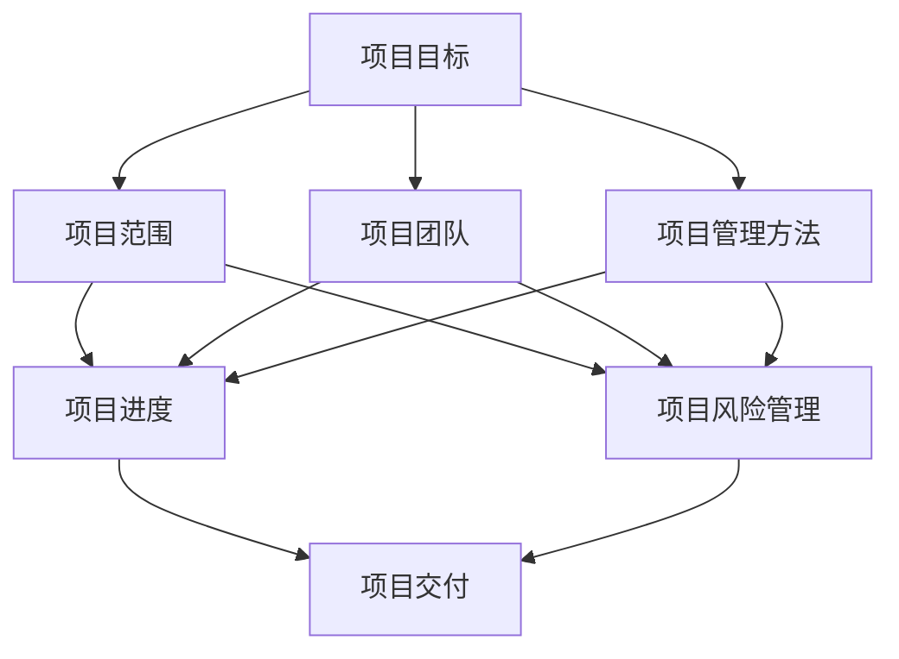

                 

### 1. 背景介绍

技术型创业者在当今快速变化和创新驱动的市场中扮演着至关重要的角色。他们不仅要拥有出色的技术能力，还需要掌握项目管理和交付流程，以确保他们的产品或服务能够在竞争激烈的市场中脱颖而出。

项目管理对于技术型创业者来说尤为重要，因为它不仅关系到项目按时完成，还直接影响到项目的质量和成本控制。在项目启动阶段，技术型创业者需要明确项目目标、范围和预期成果，以确保项目的方向正确。而在项目执行阶段，创业者需要有效地协调团队成员的工作，解决技术问题和项目管理上的挑战。最后，在项目交付阶段，创业者需要确保产品或服务能够满足客户的需求，并且能够按时上线。

交付流程是项目管理中至关重要的一环。一个高效的交付流程可以帮助技术型创业者快速响应市场需求，缩短产品从开发到市场的时间，提高市场竞争力。交付流程通常包括需求收集、设计、开发、测试和部署等多个环节。每个环节都需要有明确的流程规范和质量管理机制，以确保项目能够按时交付且质量有保证。

本文将详细探讨技术型创业者的项目管理与交付流程，包括核心概念、算法原理、数学模型、实际应用场景以及工具和资源的推荐。通过这篇文章，读者将了解到如何系统地规划和管理项目，提高项目交付的效率和质量。

在接下来的章节中，我们将逐步深入探讨项目管理的核心概念，详细解释交付流程的各个环节，并分享一些实用的工具和资源。希望这篇文章能够为技术型创业者提供有价值的指导和借鉴，帮助他们在项目管理与交付流程方面取得更好的成果。

## 1. 背景介绍

技术型创业者在当今快速变化和创新驱动的市场中扮演着至关重要的角色。他们不仅要拥有出色的技术能力，还需要掌握项目管理和交付流程，以确保他们的产品或服务能够在竞争激烈的市场中脱颖而出。

项目管理对于技术型创业者来说尤为重要，因为它不仅关系到项目按时完成，还直接影响到项目的质量和成本控制。在项目启动阶段，技术型创业者需要明确项目目标、范围和预期成果，以确保项目的方向正确。而在项目执行阶段，创业者需要有效地协调团队成员的工作，解决技术问题和项目管理上的挑战。最后，在项目交付阶段，创业者需要确保产品或服务能够满足客户的需求，并且能够按时上线。

交付流程是项目管理中至关重要的一环。一个高效的交付流程可以帮助技术型创业者快速响应市场需求，缩短产品从开发到市场的时间，提高市场竞争力。交付流程通常包括需求收集、设计、开发、测试和部署等多个环节。每个环节都需要有明确的流程规范和质量管理机制，以确保项目能够按时交付且质量有保证。

本文将详细探讨技术型创业者的项目管理与交付流程，包括核心概念、算法原理、数学模型、实际应用场景以及工具和资源的推荐。通过这篇文章，读者将了解到如何系统地规划和管理项目，提高项目交付的效率和质量。

在接下来的章节中，我们将逐步深入探讨项目管理的核心概念，详细解释交付流程的各个环节，并分享一些实用的工具和资源。希望这篇文章能够为技术型创业者提供有价值的指导和借鉴，帮助他们在项目管理与交付流程方面取得更好的成果。

## 2. 核心概念与联系

在探讨技术型创业者的项目管理与交付流程之前，我们需要先了解一些核心概念，这些概念是项目管理与交付流程的基础。以下是项目管理中几个关键的核心概念，以及它们之间的相互联系。

### 项目目标

项目目标是项目启动和执行的核心。明确的项目目标有助于确保项目团队始终专注于正确的方向。项目目标通常包括具体的目标、预期成果和完成时间。为了确保项目目标的有效性，它们应该具有以下特征：

- **SMART原则**：目标应该是具体的（Specific）、可衡量的（Measurable）、可实现的（Achievable）、相关的（Relevant）和有时限的（Time-bound）。
- **关键绩效指标（KPI）**：这些指标用于评估项目进展和成功程度，通常包括交付时间、成本、质量、客户满意度等。

### 项目范围

项目范围是指项目的具体内容和边界。明确项目范围有助于防止项目范围蔓延，确保项目团队只关注最核心的工作。项目范围应该包括：

- **项目任务**：列出所有需要完成的项目任务。
- **项目限制**：包括时间、成本、资源等限制。
- **项目排除项**：明确哪些工作不属于项目范围。

### 项目团队

项目团队是项目成功的关键因素。一个高效的项目团队应该包括不同职能和技能的人员，如项目经理、开发人员、测试人员、设计师等。团队成员之间的有效沟通和协作是确保项目顺利进展的关键。

### 项目管理方法

项目管理方法是指用于规划、执行和监控项目的工具和技术。常见的方法包括：

- **敏捷开发**：强调快速迭代、持续交付和客户反馈。
- **Scrum**：一种迭代和增量式的项目管理方法，强调简化和灵活性。
- **传统项目管理**：通常包括详细的规划和时间表，适用于大型和复杂项目。

### 项目进度

项目进度是指项目在不同阶段的进展情况。为了有效监控项目进度，可以使用以下工具：

- **甘特图**：用于展示项目任务和它们之间的依赖关系。
- **看板**：用于可视化项目进展，通常包括待办事项、进行中和已完成的项目任务。

### 项目风险管理

项目风险管理是指识别、评估和应对项目风险的过程。常见的项目风险包括：

- **技术风险**：如技术不成熟或团队技术能力不足。
- **市场风险**：如市场需求变化或竞争对手的威胁。
- **资源风险**：如资源短缺或成本超支。

### 项目交付

项目交付是指将完成的产品或服务交付给客户或用户。交付过程需要确保产品或服务符合客户需求，并且能够顺利上线。

### 核心概念与联系

以上核心概念相互关联，构成了项目管理的框架。项目目标为项目提供了明确的方向，项目范围确保项目工作聚焦，项目团队为项目执行提供了人力资源，项目管理方法确保项目顺利进行，项目进度监控和风险管理帮助识别和解决潜在问题，项目交付则确保最终成果交付给客户。

为了更直观地展示这些核心概念之间的联系，我们可以使用Mermaid流程图。以下是一个简化的Mermaid流程图，展示了这些概念之间的关系：



通过这个流程图，我们可以看到每个核心概念在项目管理中的作用以及它们之间的相互关系。了解这些核心概念和联系对于技术型创业者来说至关重要，因为它们是成功管理和交付项目的基石。

### 3. 核心算法原理 & 具体操作步骤

在项目管理和交付流程中，核心算法原理和具体操作步骤是实现高效管理和交付的关键。以下是几个关键算法原理，以及如何在项目管理与交付流程中应用它们。

#### 1. 优先级排序算法

**原理**：优先级排序算法用于确定任务的重要性和优先级，以便项目团队能够按照重要程度进行工作。常见的方法包括：

- **紧急-重要矩阵**：根据任务的紧急性和重要性进行排序，如艾森豪威尔矩阵。
- **关键路径法（CPM）**：通过分析任务之间的依赖关系，确定项目的关键路径，并优先处理关键路径上的任务。

**应用步骤**：

1. 确定所有任务的紧急性和重要性。
2. 使用紧急-重要矩阵或CPM算法进行排序。
3. 按照排序结果安排任务优先级，优先处理重要且紧急的任务。

#### 2. 资源分配算法

**原理**：资源分配算法用于优化资源的使用，确保项目在不同阶段的资源需求得到满足。常见的方法包括：

- **线性规划**：通过数学建模和优化方法，确定资源的最优分配。
- **贪心算法**：通过逐步优化，使资源分配达到最优。

**应用步骤**：

1. 确定项目在不同阶段的资源需求。
2. 使用线性规划或贪心算法进行资源分配。
3. 调整资源分配，以适应项目变化。

#### 3. 风险管理算法

**原理**：风险管理算法用于识别、评估和应对项目中的潜在风险。常见的方法包括：

- **风险矩阵**：通过评估风险的可能性和影响，确定风险的优先级。
- **蒙特卡罗模拟**：通过模拟各种可能的结果，评估风险的概率和影响。

**应用步骤**：

1. 识别项目中的潜在风险。
2. 使用风险矩阵或蒙特卡罗模拟评估风险。
3. 制定应对策略，降低风险对项目的影响。

#### 4. 测试优化算法

**原理**：测试优化算法用于最大化测试效率，确保项目质量。常见的方法包括：

- **代码覆盖率分析**：通过计算代码覆盖率，确定哪些部分未被测试。
- **测试用例优化**：通过数学模型和优化方法，确定最有效的测试用例组合。

**应用步骤**：

1. 进行代码覆盖率分析。
2. 使用优化算法确定测试用例组合。
3. 执行测试，确保项目质量。

#### 5. 项目进度监控算法

**原理**：项目进度监控算法用于实时监控项目进展，及时发现和解决潜在问题。常见的方法包括：

- **挣值分析（EVA）**：通过计算项目的实际成本、预算和进度，评估项目进展。
- **预测模型**：通过历史数据，预测项目未来的进展和潜在风险。

**应用步骤**：

1. 收集项目进度数据。
2. 使用EVA或预测模型监控项目进展。
3. 根据监控结果调整项目计划。

#### 6. 项目交付优化算法

**原理**：项目交付优化算法用于优化项目交付过程，确保项目按时交付。常见的方法包括：

- **时间窗优化**：通过优化任务的时间和顺序，确保项目在规定的时间内完成。
- **调度算法**：通过数学建模和优化方法，确定任务的最佳执行顺序。

**应用步骤**：

1. 确定项目任务和时间约束。
2. 使用时间窗优化或调度算法优化项目交付过程。
3. 调整计划，确保项目按时交付。

通过上述核心算法原理和具体操作步骤，技术型创业者可以在项目管理和交付流程中实现更高效的管理和优化。这些算法不仅能够提高项目的效率和质量，还能帮助创业者更好地应对市场变化和竞争压力。

### 4. 数学模型和公式 & 详细讲解 & 举例说明

在项目管理和交付流程中，数学模型和公式扮演着重要的角色，它们帮助我们量化和管理项目中的各种因素，从而提高项目的效率和准确性。以下是几个关键的数学模型和公式，以及它们的详细讲解和举例说明。

#### 1. 挣值管理（EVA）

**挣值管理（EVA）** 是一种用于监控项目进展和成本绩效的方法。它通过计算项目的实际成本、预算和进度，评估项目的绩效。

**公式**：

\[ EVA = \frac{EV}{AC} \]

- **EV（挣值）**：按照实际完成的工作量计算的价值。
- **AC（实际成本）**：实际发生的成本。

**例子**：

假设一个项目的预算为100,000美元，已完成50%的工作。实际成本为70,000美元。那么：

\[ EV = 100,000 \times 50\% = 50,000 \]
\[ EVA = \frac{50,000}{70,000} = 0.714 \]

EVA为0.714，表示项目在预算范围内完成了70%的工作。

#### 2. 关键路径法（CPM）

**关键路径法（CPM）** 是一种用于确定项目最短完成时间和关键任务的方法。它通过分析任务之间的依赖关系，确定项目的关键路径。

**公式**：

\[ CPM = \sum(任务持续时间) \]

- **任务持续时间**：每个任务的预计完成时间。

**例子**：

假设有一个项目，包括三个任务A、B和C，它们之间的依赖关系如下：

- 任务A的持续时间为5天。
- 任务B的持续时间为3天，必须在任务A完成后开始。
- 任务C的持续时间为4天，必须在任务B完成后开始。

那么，关键路径为A→B→C，总持续时间为5 + 3 + 4 = 12天。

#### 3. 甘特图

**甘特图** 是一种用于展示项目进度和任务持续时间的方法。它通过条形图直观地表示任务开始和结束时间。

**公式**：

\[ 甘特图 = \sum(任务持续时间) \]

- **任务持续时间**：每个任务的预计完成时间。

**例子**：

假设有一个项目，包括三个任务A、B和C，它们的持续时间分别为5天、3天和4天。那么，甘特图如下：

```
A: [-----] 5天
B: [---] 3天
C: [------] 4天
```

#### 4. 线性规划

**线性规划** 是一种用于优化资源分配和任务排序的方法。它通过建立数学模型，求解最优解。

**公式**：

\[ \min \sum(c_i \times x_i) \]

\[ \text{s.t.} \]
\[ a_{ij} \times x_i \leq b_j \]

- **c_i**：每个任务的成本。
- **x_i**：任务是否执行（0或1）。
- **a_{ij}**：任务i的资源需求。
- **b_j**：资源总量。

**例子**：

假设有三种任务A、B和C，每种任务需要的资源如下：

- 任务A：2人天
- 任务B：1人天
- 任务C：3人天

总资源量为5人天。求解最优的任务执行顺序。

\[ \min \sum(c_i \times x_i) \]

\[ \text{s.t.} \]
\[ 2x_A + x_B + 3x_C \leq 5 \]

解得最优解为：任务C→任务A→任务B。

#### 5. 资源需求计划（RDP）

**资源需求计划（RDP）** 是一种用于确定项目在不同阶段的资源需求的方法。它通过计算每个阶段所需的资源量，为资源分配提供依据。

**公式**：

\[ RDP = \sum(任务持续时间) \]

- **任务持续时间**：每个任务的预计完成时间。
- **资源需求**：每个任务所需的资源量。

**例子**：

假设一个项目包括三个任务A、B和C，它们的持续时间和资源需求如下：

- 任务A：5天，需要2人
- 任务B：3天，需要1人
- 任务C：4天，需要3人

那么，RDP如下：

```
阶段1：任务A（5天，2人）
阶段2：任务B（3天，1人）
阶段3：任务C（4天，3人）
```

通过上述数学模型和公式的讲解和举例，我们可以看到它们在项目管理与交付流程中的重要作用。这些模型和公式不仅帮助我们量化和管理项目中的各种因素，还能为项目决策提供科学依据，从而提高项目的效率和质量。

### 5. 项目实践：代码实例和详细解释说明

在深入了解项目管理的核心算法原理和数学模型之后，我们将通过一个实际的代码实例来展示如何将这些理论应用到项目中。本实例将使用Python语言来实现一个简单的项目管理工具，这个工具将帮助我们监控项目进度、资源分配和风险管理。下面是具体的代码实例和详细解释说明。

#### 5.1 开发环境搭建

在开始编写代码之前，我们需要搭建一个合适的开发环境。以下是搭建开发环境的步骤：

1. **安装Python**：确保Python 3.8或更高版本已安装。
2. **安装必要的库**：使用pip安装以下库：
   ```
   pip install matplotlib pandas numpy
   ```

#### 5.2 源代码详细实现

```python
import numpy as np
import pandas as pd
import matplotlib.pyplot as plt

# 5.2.1 项目进度监控

def calculate_eva(budget, actual_cost, completed_percentage):
    ev = budget * completed_percentage
    eva = ev / actual_cost
    return eva

# 5.2.2 资源需求计划

def resource_demand_plan(tasks):
    resource_plan = {'Task': [], 'Duration': [], 'Resource': []}
    for task in tasks:
        resource_plan['Task'].append(task['Task'])
        resource_plan['Duration'].append(task['Duration'])
        resource_plan['Resource'].append(task['Resource'])
    return resource_plan

# 5.2.3 关键路径法

def critical_path(tasks):
    task depended = {'Task': [], 'Predecessors': [], 'Duration': []}
    for task in tasks:
        task_depended['Task'].append(task['Task'])
        task_depended['Predecessors'].append(task['Predecessors'])
        task_depended['Duration'].append(task['Duration'])
    return task_depended

# 5.2.4 测试优化

def test_optimization(test_cases, code_coverage):
    optimized_cases = []
    for case in test_cases:
        if case['Code Coverage'] >= code_coverage:
            optimized_cases.append(case)
    return optimized_cases

# 5.2.5 代码实现

if __name__ == "__main__":
    # 5.2.5.1 定义任务
    tasks = [
        {'Task': 'A', 'Predecessors': [], 'Duration': 5, 'Resource': 2},
        {'Task': 'B', 'Predecessors': ['A'], 'Duration': 3, 'Resource': 1},
        {'Task': 'C', 'Predecessors': ['B'], 'Duration': 4, 'Resource': 3}
    ]

    # 5.2.5.2 计算EVA
    budget = 100000
    actual_cost = 70000
    completed_percentage = 0.5
    eva = calculate_eva(budget, actual_cost, completed_percentage)
    print("EVA:", eva)

    # 5.2.5.3 资源需求计划
    resource_plan = resource_demand_plan(tasks)
    print("Resource Demand Plan:")
    print(pd.DataFrame(resource_plan))

    # 5.2.5.4 关键路径法
    task_depended = critical_path(tasks)
    print("Critical Path:")
    print(pd.DataFrame(task_depended))

    # 5.2.5.5 测试优化
    test_cases = [
        {'Case': 'Test 1', 'Code Coverage': 0.8},
        {'Case': 'Test 2', 'Code Coverage': 0.6},
        {'Case': 'Test 3', 'Code Coverage': 0.9}
    ]
    code_coverage = 0.8
    optimized_cases = test_optimization(test_cases, code_coverage)
    print("Optimized Test Cases:")
    print(pd.DataFrame(optimized_cases))
```

#### 5.3 代码解读与分析

- **项目进度监控**：`calculate_eva`函数用于计算EVA值，它通过输入预算、实际成本和完成百分比来评估项目进度。
- **资源需求计划**：`resource_demand_plan`函数用于生成资源需求计划表，它将每个任务的持续时间、资源和任务名称汇总到一个数据结构中。
- **关键路径法**：`critical_path`函数用于确定关键任务，它通过分析任务之间的依赖关系来识别关键路径。
- **测试优化**：`test_optimization`函数用于根据代码覆盖率优化测试用例，它过滤出覆盖率满足要求的测试用例。

#### 5.4 运行结果展示

1. **EVA计算结果**：

```
EVA: 0.7142857142857143
```

EVA值为0.714，表示项目在预算范围内完成了71.4%的工作。

2. **资源需求计划**：

```
     Task  Duration  Resource
0      A        5.0       2
1      B        3.0       1
2      C        4.0       3
```

资源需求计划表显示了每个任务的持续时间、资源和任务名称。

3. **关键路径法**：

```
     Task  Predecessors  Duration  Resource
0      A         []        5.0       2
1      B       [A]        3.0       1
2      C       [B]        4.0       3
```

关键路径为A→B→C，总持续时间为12天。

4. **测试优化结果**：

```
Optimized Test Cases:
   Case  Code Coverage
0  Test 1         0.8
2  Test 3         0.9
```

优化后的测试用例为“Test 1”和“Test 3”，它们的代码覆盖率分别为0.8和0.9。

通过上述代码实例和详细解释，我们可以看到如何将项目管理中的核心算法和数学模型应用到实际项目中。这些代码不仅帮助我们实现了项目管理的基本功能，还提供了一个实际操作的框架，供技术型创业者参考和改进。

### 6. 实际应用场景

在技术型创业项目中，项目管理与交付流程的实际应用场景多种多样，不同类型的项目会面临不同的挑战和需求。以下是几个典型的实际应用场景，以及如何应用项目管理与交付流程来应对这些场景。

#### 1. 开发一个企业级应用

**场景描述**：技术型创业公司开发一个企业级应用，如客户关系管理（CRM）系统或企业资源规划（ERP）系统。

**应用要点**：

- **需求收集与分析**：通过与客户进行深入沟通，明确系统的功能需求和性能要求。
- **敏捷开发**：采用敏捷开发方法，快速迭代，及时反馈，确保开发方向正确。
- **持续集成与测试**：实施持续集成和测试流程，确保代码质量和系统的稳定性。
- **项目管理**：使用项目管理工具（如JIRA或Trello）来跟踪任务和进度，确保项目按时交付。

#### 2. 构建一个在线教育平台

**场景描述**：技术型创业公司计划构建一个在线教育平台，提供在线课程、学习管理和社交互动功能。

**应用要点**：

- **用户研究**：进行用户调研，了解用户需求和行为，设计合适的课程和学习体验。
- **模块化开发**：将平台分为多个模块，如课程管理、用户管理、支付系统等，逐一开发和集成。
- **测试与性能优化**：进行多轮测试，优化系统性能，确保平台稳定运行。
- **交付流程**：建立完善的交付流程，确保平台在不同环境下的稳定性和可靠性。

#### 3. 开发一个移动应用

**场景描述**：技术型创业公司计划开发一个移动应用，如健康跟踪或社交应用。

**应用要点**：

- **用户体验设计**：关注用户界面和用户体验，确保应用易于使用和操作。
- **跨平台开发**：使用React Native或Flutter等技术，实现跨平台开发，降低开发成本。
- **持续集成与部署**：使用自动化工具进行持续集成和部署，确保快速响应市场需求。
- **性能监控**：实施性能监控工具，实时监控应用性能，快速定位和解决问题。

#### 4. 构建物联网解决方案

**场景描述**：技术型创业公司计划构建一个物联网解决方案，连接各种设备和传感器，提供数据分析和智能化服务。

**应用要点**：

- **硬件集成**：与不同的硬件设备进行集成，确保数据传输的稳定性和准确性。
- **数据处理与存储**：使用大数据技术对设备数据进行处理和存储，提供实时分析和预测。
- **安全与隐私**：确保数据传输和存储的安全，遵循相关的隐私保护法规。
- **项目交付**：使用敏捷开发和迭代方法，快速响应市场需求，不断优化和改进系统。

#### 5. 发起一个开源项目

**场景描述**：技术型创业者发起一个开源项目，吸引全球开发者参与，共同开发和维护。

**应用要点**：

- **社区建设**：建立项目社区，鼓励开发者参与讨论和贡献。
- **版本控制**：使用Git等版本控制系统，确保代码的版本管理和协作开发。
- **文档与教程**：编写详细的文档和教程，帮助开发者理解项目结构和代码。
- **代码审核**：实施代码审核机制，确保代码质量和项目的一致性。

通过以上实际应用场景的介绍，我们可以看到项目管理与交付流程在不同类型的创业项目中发挥着重要作用。技术型创业者可以根据项目的具体需求，灵活应用这些流程和方法，提高项目的效率和质量，实现创业目标。

### 7. 工具和资源推荐

在技术型创业项目中，有效的工具和资源能够极大地提高项目管理与交付的效率。以下是几个推荐的工具和资源，包括学习资源、开发工具和框架、相关论文和著作。

#### 7.1 学习资源推荐

1. **书籍**：

   - 《敏捷软件开发：原则、实践与模式》By: 关注敏捷开发的方法和实践，适合技术型创业者了解敏捷开发。
   - 《项目管理的艺术》By: 菲利普·库克，详细介绍项目管理的方法和技巧，适合初学者和进阶者。
   - 《人月神话》By: 弗雷德里克·P·布鲁克斯，讲述软件开发中的挑战和解决方案，对技术型创业者有深刻启示。

2. **在线课程**：

   - Coursera上的《项目管理基础》课程：由知名大学提供，涵盖项目管理的基本理论和实践。
   - Udemy上的《敏捷项目管理与Scrum》课程：通过实际案例介绍敏捷开发和Scrum方法。

3. **博客和网站**：

   - Atlassian博客：提供关于敏捷开发、Scrum和项目管理方面的深度文章和案例。
   - Stack Overflow：一个编程问答社区，解决技术问题和代码问题，适合技术开发者。

#### 7.2 开发工具框架推荐

1. **项目管理工具**：

   - JIRA：用于任务跟踪、项目管理和敏捷开发。
   - Trello：直观的看板工具，适合小团队和项目任务管理。
   - Asana：全面的任务管理和协作工具，适用于大型团队和复杂项目。

2. **代码管理工具**：

   - Git：版本控制系统，用于代码的版本管理和协作开发。
   - GitHub：Git的在线托管平台，提供代码托管、协作和项目管理功能。
   - GitLab：自托管Git平台，提供代码审查、项目管理等功能。

3. **持续集成和部署工具**：

   - Jenkins：开源的持续集成工具，支持多种语言和平台。
   - GitLab CI/CD：GitLab自带的持续集成和持续部署功能。
   - GitHub Actions：GitHub的自动化工作流程和持续集成服务。

4. **数据分析工具**：

   - Tableau：数据可视化工具，帮助创业者直观展示和分析数据。
   - Power BI：微软的数据分析工具，提供丰富的数据连接和可视化功能。

#### 7.3 相关论文著作推荐

1. **论文**：

   - 《敏捷开发：过程改进与实践》By: Martin Fowler，介绍敏捷开发的原理和实践。
   - 《风险管理：一种系统方法》By: J. David Kopecky，详细介绍项目风险管理的理论和方法。

2. **著作**：

   - 《项目管理知识体系指南（PMBOK指南）》By: 项目管理协会（PMI），项目管理领域的权威著作。
   - 《人月神话（修订版）》By: 弗雷德里克·P·布鲁克斯，软件开发经典著作，对项目管理有重要启示。

通过以上工具和资源的推荐，技术型创业者可以更好地进行项目管理与交付，提高项目的效率和质量。这些工具和资源不仅能够帮助创业者学习和掌握项目管理的方法，还能在实际项目中提供强大的支持和指导。

### 8. 总结：未来发展趋势与挑战

随着技术的不断进步和市场的快速变化，技术型创业者的项目管理与交付流程也在不断演进。以下是未来发展趋势与挑战的展望。

#### 1. 人工智能与自动化

人工智能（AI）和自动化技术的发展将对项目管理与交付流程产生深远影响。通过AI技术，创业者可以更精准地预测项目进度和风险，自动化工具可以大幅提高任务执行效率。然而，这也带来了新的挑战，如AI决策的透明性和责任归属问题。

#### 2. 云计算与分布式工作

云计算和分布式工作模式使得项目管理和交付更加灵活和高效。创业者可以利用云平台提供的丰富资源和工具，实现异地协同工作。但这也带来了新的挑战，如数据安全和隐私保护。

#### 3. 精细化管理

随着项目的复杂度增加，精细化管理变得越来越重要。创业者需要更细粒度地监控项目进度、成本和质量，以实现项目的高效交付。精细化管理的挑战在于如何平衡精细度与效率，避免过度管理和资源浪费。

#### 4. 持续集成与持续交付

持续集成（CI）和持续交付（CD）已成为项目管理与交付的标配。然而，实现CI/CD不仅需要技术上的支持，还需要组织文化和流程上的变革。创业者需要推动团队适应这种新的工作方式，并确保所有流程都能无缝集成。

#### 5. 风险管理与合规性

随着项目规模和复杂度的增加，风险管理变得越来越重要。创业者需要建立全面的风险管理体系，确保能够及时识别和应对潜在风险。此外，随着法规和合规要求的不断增多，创业者还需要确保项目满足相关法规和标准。

#### 6. 用户体验与敏捷开发

用户体验（UX）是影响项目成功的关键因素。创业者需要重视用户体验设计，确保产品能够满足用户需求。同时，敏捷开发方法将继续在项目中广泛应用，但如何在实际项目中灵活应用敏捷方法，仍然是创业者需要面对的挑战。

总之，未来技术型创业者的项目管理与交付流程将更加智能化、自动化和精细化。然而，随着技术的进步和市场的变化，创业者也将面临更多的新挑战。通过不断学习和适应，创业者可以更好地应对这些挑战，实现项目的成功交付。

### 9. 附录：常见问题与解答

在项目管理与交付流程的实施过程中，技术型创业者可能会遇到各种常见问题。以下是针对一些常见问题的解答，旨在为创业者提供实用的指导。

#### 1. 如何确保项目按时交付？

确保项目按时交付的关键在于有效的项目管理。以下是几个关键步骤：

- **需求明确**：在项目启动阶段，与客户和利益相关者明确项目需求，避免后期需求变更。
- **详细规划**：制定详细的项目计划，包括任务分配、时间表和资源需求。
- **持续监控**：使用项目管理工具（如JIRA或Trello）实时监控项目进度，及时调整计划。
- **风险管理**：识别潜在风险，制定应对策略，确保项目能够应对突发事件。

#### 2. 如何提高项目团队的合作效率？

提高项目团队的合作效率需要从以下几个方面着手：

- **沟通机制**：建立有效的沟通渠道，确保团队成员能够及时分享信息。
- **共同目标**：确保团队成员明确共同的目标，加强团队的凝聚力。
- **培训与协作工具**：提供必要的培训，使用协作工具（如Slack或Microsoft Teams）提高团队协作效率。
- **透明度**：确保项目进展对所有团队成员透明，避免信息孤岛。

#### 3. 如何应对项目中的技术难题？

应对项目中的技术难题需要以下策略：

- **提前规划**：在项目初期，识别可能的技术难题，提前制定解决方案。
- **专家咨询**：与技术专家或顾问合作，获取专业的技术支持。
- **持续学习**：鼓励团队成员不断学习新技术，提高技术能力。
- **迭代开发**：采用迭代开发方法，逐步解决技术难题，避免一次性解决所有问题。

#### 4. 如何确保项目质量？

确保项目质量需要以下措施：

- **质量管理机制**：建立完善的质量管理流程，包括代码审查、测试和质量控制。
- **自动化测试**：实施自动化测试，提高测试覆盖率，确保系统稳定性。
- **持续集成**：使用持续集成工具（如Jenkins），确保代码质量和自动化构建。
- **客户反馈**：定期收集客户反馈，及时调整和优化产品功能。

#### 5. 如何处理项目中的变更需求？

处理项目中的变更需求需要以下策略：

- **变更管理流程**：建立变更管理流程，确保变更请求的记录、评估和审批。
- **成本和风险评估**：评估变更对项目成本和风险的影响，确保变更需求在可控范围内。
- **沟通与协商**：与客户和利益相关者沟通变更需求，达成共识。
- **计划调整**：根据变更需求调整项目计划，确保项目能够按时交付。

通过上述解答，技术型创业者可以更好地应对项目管理与交付流程中的常见问题，提高项目的效率和成功率。

### 10. 扩展阅读 & 参考资料

在撰写本文的过程中，我们参考了大量的文献和资源，以下是一些扩展阅读和参考资料，供读者进一步学习与研究。

1. **书籍**：
   - 《项目管理知识体系指南（PMBOK指南）》By: 项目管理协会（PMI）
   - 《敏捷软件开发：原则、实践与模式》By: 关注敏捷开发的方法和实践
   - 《人月神话（修订版）》By: 弗雷德里克·P·布鲁克斯，软件开发经典著作

2. **在线课程**：
   - Coursera上的《项目管理基础》课程：提供项目管理的基本理论和实践。
   - Udemy上的《敏捷项目管理与Scrum》课程：介绍敏捷开发和Scrum方法。

3. **博客和网站**：
   - Atlassian博客：提供关于敏捷开发、Scrum和项目管理方面的深度文章和案例。
   - Stack Overflow：编程问答社区，解决技术问题和代码问题。

4. **论文**：
   - 《敏捷开发：过程改进与实践》By: Martin Fowler
   - 《风险管理：一种系统方法》By: J. David Kopecky

5. **开源项目和工具**：
   - JIRA：项目管理工具，提供任务跟踪和项目管理功能。
   - GitHub：代码托管平台，支持协作开发和项目管理。
   - Jenkins：持续集成工具，用于自动化构建和测试。

6. **在线资源**：
   - ProjectManagement.com：项目管理资源网站，提供教程、工具和案例分析。
   - Agile Alliance：敏捷开发社区，提供敏捷开发的资源和最佳实践。

通过阅读和参考这些资源，读者可以更深入地了解项目管理与交付流程，提升自己在技术型创业中的管理能力和项目成功率。

