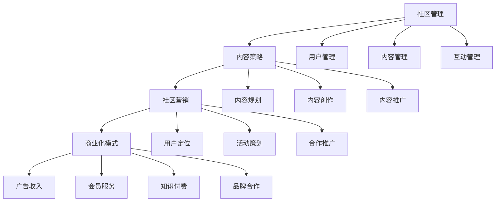

                 

### 1. 背景介绍

在当今数字时代，技术社区的兴起为程序员、开发者、技术爱好者等提供了交流、学习、分享的平台。技术社区不仅是技术信息的集散地，更是推动技术发展和创新的重要力量。然而，如何有效地运营一个技术社区，使其从管理走向盈利模式，成为了许多社区管理者面临的挑战。

技术社区运营的重要性不言而喻。首先，良好的社区运营能够促进知识的传播和共享，提升社区的活跃度和用户满意度。其次，通过有效的运营策略，社区可以积累大量高质量的原创内容，这不仅有助于提升社区的品牌影响力，还能够为社区带来潜在的商业机会。最后，成功的社区运营还能够吸引更多的用户和资源，形成良好的口碑效应，从而推动社区的持续发展。

随着互联网技术的发展，技术社区的运营模式也在不断演变。早期的技术社区主要以论坛为主，用户主要通过发帖、回帖进行交流。然而，随着社交媒体和移动应用的普及，技术社区的形式也逐渐多样化，如博客、问答平台、直播等。这些新的社区形式不仅提供了更加丰富的交流方式，也为社区运营者带来了更多的运营挑战。

在本文中，我们将探讨技术社区运营的核心概念，分析现有的运营模式，介绍从管理到盈利模式的转变策略，并通过实际案例和工具推荐，帮助社区运营者更好地应对这些挑战。我们将逐步分析社区运营的各个关键环节，包括用户管理、内容管理、社区营销、商业化策略等，从而为技术社区的发展提供有价值的参考。

### 2. 核心概念与联系

要深入理解技术社区运营，我们需要明确几个核心概念，并分析它们之间的联系。以下是几个关键概念及其在技术社区运营中的角色：

#### 2.1 社区管理

社区管理是指对社区用户、内容、互动和活动进行有效控制和管理的过程。社区管理的核心目标是维护社区秩序，促进用户参与，提升社区氛围。具体包括：

- **用户管理**：包括用户注册、身份验证、权限设置、用户反馈处理等。
- **内容管理**：涉及内容的发布、审核、分类、标签管理以及内容的存档和备份。
- **互动管理**：包括论坛、问答、博客、直播等互动方式的组织和管理。

#### 2.2 内容策略

内容策略是社区运营的基石，它决定了社区提供的信息是否具有吸引力、实用性和相关性。内容策略包括：

- **内容规划**：确定社区需要的内容类型、主题和发布频率。
- **内容创作**：生产高质量的内容，包括技术文章、视频、教程等。
- **内容推广**：通过社交媒体、搜索引擎优化（SEO）等手段提升内容曝光度。

#### 2.3 社区营销

社区营销是利用社区平台进行市场推广的活动，旨在吸引新用户、提高用户活跃度并增强用户忠诚度。社区营销的关键要素包括：

- **用户定位**：明确目标用户群体，制定针对性的营销策略。
- **活动策划**：举办线上和线下活动，如技术研讨会、竞赛、互动游戏等。
- **合作推广**：与其他社区、媒体和行业专家合作，扩大社区影响力。

#### 2.4 商业化模式

商业化模式是指将技术社区转化为盈利来源的途径。常见的商业化模式包括：

- **广告收入**：通过展示广告赚取收入。
- **会员服务**：提供高级会员服务，如去广告、专享内容等。
- **知识付费**：推出付费课程、电子书、在线咨询等。
- **品牌合作**：与企业合作，进行品牌推广和产品植入。

#### 2.5 Mermaid 流程图

为了更好地理解上述核心概念之间的联系，我们可以使用 Mermaid 工具绘制一个流程图。以下是一个简化的 Mermaid 流程图，描述了技术社区运营的各个关键环节及其相互关系：



通过上述核心概念及其流程图的分析，我们可以更清晰地了解技术社区运营的整体框架，为后续章节的深入探讨打下基础。

### 3. 核心算法原理 & 具体操作步骤

在技术社区运营中，实现从管理到盈利模式的转变离不开一系列核心算法原理的支持。这些算法不仅在数据分析、用户行为预测、内容推荐等方面发挥着重要作用，还能够为社区营销和商业化提供科学依据。以下将介绍几个关键算法原理，并说明如何在技术社区中具体应用。

#### 3.1 数据分析算法

数据分析算法是技术社区运营的重要工具，它能够帮助运营者深入了解用户行为、内容表现以及社区的整体发展趋势。常见的数据分析算法包括：

- **统计算法**：如平均值、中位数、标准差等，用于描述用户和内容的统计特征。
- **聚类算法**：如 K-均值聚类、层次聚类等，用于发现用户群体的相似性。
- **分类算法**：如逻辑回归、决策树、随机森林等，用于预测用户的行为和偏好。
- **关联规则算法**：如 Apriori 算法、FP-Growth 算法等，用于挖掘用户行为之间的关联关系。

**具体操作步骤：**

1. 数据收集：从社区数据库中提取用户行为数据、内容数据等。
2. 数据预处理：清洗数据、填补缺失值、标准化处理等。
3. 模型训练：根据数据特征选择合适的算法，进行模型训练。
4. 模型评估：通过交叉验证、A/B 测试等方法评估模型性能。
5. 应用模型：将训练好的模型应用于实际运营场景，如推荐系统、用户行为预测等。

#### 3.2 用户行为预测算法

用户行为预测算法能够帮助社区运营者提前了解用户可能的需求和行为，从而进行精准的运营策略调整。常用的用户行为预测算法包括：

- **基于协同过滤的推荐算法**：如用户基于内容的推荐（UBC）、项目基于内容的推荐（PBC）等。
- **基于规则的预测算法**：根据用户的历史行为和偏好，制定一系列规则进行预测。
- **基于机器学习的预测算法**：如决策树、支持向量机（SVM）、神经网络等。

**具体操作步骤：**

1. 用户画像：收集用户的基本信息、行为数据、偏好数据等，构建用户画像。
2. 特征工程：提取用户画像中的关键特征，如活跃度、访问频率、内容偏好等。
3. 模型训练：选择合适的预测算法，利用用户行为数据训练模型。
4. 模型评估：通过交叉验证、准确率、召回率等指标评估模型性能。
5. 预测应用：将预测结果应用于个性化推荐、内容推送、活动安排等。

#### 3.3 内容推荐算法

内容推荐算法是技术社区的核心算法之一，它能够根据用户兴趣和行为，推荐相关的高质量内容。常见的内容推荐算法包括：

- **基于用户历史的推荐算法**：如基于用户的协同过滤（User-Based CF）、基于项目的协同过滤（Item-Based CF）等。
- **基于内容的推荐算法**：如基于用户兴趣的推荐、基于文本相似性的推荐等。
- **混合推荐算法**：结合协同过滤和基于内容推荐的优势，提高推荐效果。

**具体操作步骤：**

1. 内容分析：提取内容的特征信息，如关键词、主题、标签等。
2. 用户特征提取：收集用户的兴趣标签、访问记录等。
3. 模型训练：选择合适的内容推荐算法，利用用户和内容特征训练推荐模型。
4. 推荐生成：根据用户特征和内容特征，生成推荐列表。
5. 推荐评估：通过点击率、转化率等指标评估推荐效果。

#### 3.4 社区活跃度预测算法

社区活跃度是衡量社区运营效果的重要指标，通过预测社区活跃度，运营者可以及时调整运营策略，保持社区的活力。常见的社区活跃度预测算法包括：

- **基于时间序列的预测算法**：如 ARIMA、LSTM 等模型，用于预测社区活跃度的趋势。
- **基于机器学习的预测算法**：如随机森林、梯度提升树等，用于建立活跃度预测模型。
- **基于规则的预测算法**：根据社区历史活跃度数据和事件，制定规则进行预测。

**具体操作步骤：**

1. 数据收集：收集社区历史活跃度数据，如发帖量、回复量、用户活跃度等。
2. 特征工程：提取影响社区活跃度的关键特征，如节假日、活动安排等。
3. 模型训练：选择合适的预测算法，利用活跃度数据训练模型。
4. 模型评估：通过验证集、测试集评估模型性能。
5. 活跃度预测：将训练好的模型应用于实际场景，预测未来社区活跃度。

通过以上核心算法原理和具体操作步骤的介绍，我们可以看到技术社区运营需要依赖于多种算法的支持。这些算法不仅能够提升社区运营的效率和效果，还能够为社区的商业化提供有力保障。在接下来的章节中，我们将进一步探讨如何利用这些算法原理，实现技术社区从管理到盈利模式的转变。

### 4. 数学模型和公式 & 详细讲解 & 举例说明

在技术社区运营中，数学模型和公式是分析和优化运营策略的重要工具。以下我们将介绍几个关键的数学模型，并详细讲解其在技术社区运营中的应用。同时，我们将通过具体例子来说明这些模型的使用方法。

#### 4.1 回归模型

回归模型是一种常用的数据分析方法，用于预测连续值。在技术社区运营中，回归模型可以用来预测用户行为，如发帖量、活跃度等。

**线性回归模型**：最简单的回归模型，其公式为：

\[ Y = \beta_0 + \beta_1X + \epsilon \]

其中，\( Y \) 是预测值，\( X \) 是自变量，\( \beta_0 \) 和 \( \beta_1 \) 是模型参数，\( \epsilon \) 是误差项。

**例子**：假设我们要预测一个技术社区的月发帖量，可以使用线性回归模型。自变量可以是历史发帖量、用户数量等。通过收集历史数据，训练线性回归模型，可以预测未来某一月的发帖量。

#### 4.2 协同过滤模型

协同过滤模型是一种基于用户行为数据推荐算法，常用于内容推荐。其核心思想是找到相似用户或物品，并基于这些相似性进行推荐。

**用户基于内容的协同过滤（User-Based CF）**：其公式为：

\[ R(u, i) = \sum_{u' \in N(u)} \frac{R_{u',i}}{||N(u)||} \]

其中，\( R(u, i) \) 是用户 \( u \) 对物品 \( i \) 的评分预测，\( N(u) \) 是与用户 \( u \) 相似的其他用户集合，\( R_{u',i} \) 是用户 \( u' \) 对物品 \( i \) 的评分。

**例子**：在一个技术社区中，我们想根据用户的浏览历史推荐相关的技术文章。通过计算用户之间的相似度，并利用用户评分预测公式，可以生成推荐列表。

#### 4.3 PageRank算法

PageRank是一种用于网页排名的算法，其核心思想是页面之间的链接关系决定页面的重要性。在技术社区中，PageRank可以用于内容排名，衡量文章的价值和影响力。

其公式为：

\[ \text{Rank}(v) = (1-d) + d \cdot \left(\sum_{u \in \text{links}(v)} \frac{\text{Rank}(u)}{|\text{links}(u)|}\right) \]

其中，\( \text{Rank}(v) \) 是页面 \( v \) 的排名值，\( d \) 是阻尼系数（通常取值为 0.85），\( \text{links}(v) \) 是指向页面 \( v \) 的链接集合，\( \text{Rank}(u) \) 是指向页面 \( u \) 的链接的排名值。

**例子**：在一个技术社区中，可以通过计算文章之间的链接关系，利用PageRank算法确定文章的重要性排序。这样，用户可以更容易地找到高质量的内容。

#### 4.4 指数衰减模型

指数衰减模型用于衡量用户行为的时效性，其公式为：

\[ e^{-\lambda t} \]

其中，\( \lambda \) 是衰减系数，\( t \) 是时间。

**例子**：在技术社区的用户活跃度分析中，我们可以使用指数衰减模型来计算用户发帖的影响度。例如，一个用户一个月前的发帖影响度会随时间衰减。

#### 4.5 聚类分析

聚类分析是一种无监督学习方法，用于将数据集划分为多个群组。在技术社区中，聚类分析可以用于用户群体划分，以便制定有针对性的运营策略。

**K-均值聚类算法**：其公式为：

\[ C_j = \frac{1}{n_j} \sum_{i=1}^{n_j} x_i \]

其中，\( C_j \) 是第 \( j \) 个聚类中心，\( n_j \) 是第 \( j \) 个群组中的数据点数量，\( x_i \) 是数据点 \( i \) 的特征向量。

**例子**：在一个技术社区中，可以通过聚类分析将用户划分为不同的兴趣群体。例如，将用户按技术领域、活跃程度等特征进行聚类，以便提供更加个性化的内容推荐和服务。

通过上述数学模型和公式的介绍，我们可以看到技术社区运营中数学工具的广泛应用。这些模型不仅可以帮助运营者更好地理解用户行为、内容表现和社区发展趋势，还能够为制定科学合理的运营策略提供支持。在接下来的章节中，我们将通过实际案例和代码实例，进一步展示这些数学模型在技术社区运营中的应用。

### 5. 项目实践：代码实例和详细解释说明

为了更好地展示如何将数学模型和算法应用于技术社区运营，我们将通过一个实际的项目案例，详细讲解代码的实现过程、关键代码段、功能实现及其效果。

#### 5.1 开发环境搭建

在本项目中，我们主要使用 Python 作为编程语言，结合 Scikit-learn、Pandas、Numpy 和 Matplotlib 等库来构建和实现相关算法。以下是在本地环境中搭建开发环境的基本步骤：

1. 安装 Python 3.x 版本（推荐使用 Anaconda，以便管理依赖库）。
2. 使用 pip 安装所需的库：

```bash
pip install scikit-learn pandas numpy matplotlib
```

#### 5.2 源代码详细实现

我们以用户活跃度预测为例，展示如何使用回归模型和协同过滤模型进行用户活跃度的预测。

**1. 数据准备：**

首先，我们需要准备用户行为数据。以下是一个示例数据集，包括用户ID、发帖次数、回复次数和活跃度评分。

```python
import pandas as pd

# 加载数据
data = pd.read_csv('user_activity.csv')
data.head()
```

**2. 数据预处理：**

在训练模型之前，需要对数据进行预处理，包括填充缺失值、标准化处理等。

```python
# 填充缺失值
data.fillna(0, inplace=True)

# 特征工程
from sklearn.preprocessing import StandardScaler

scaler = StandardScaler()
data[['posts', 'replies']] = scaler.fit_transform(data[['posts', 'replies']])
```

**3. 线性回归模型：**

使用线性回归模型预测用户活跃度。

```python
from sklearn.linear_model import LinearRegression

# 分割特征和标签
X = data[['posts', 'replies']]
y = data['activity']

# 训练模型
model_lr = LinearRegression()
model_lr.fit(X, y)

# 预测
predictions_lr = model_lr.predict(X)

# 模型评估
from sklearn.metrics import mean_squared_error

mse_lr = mean_squared_error(y, predictions_lr)
print("线性回归模型均方误差：", mse_lr)
```

**4. 用户基于内容的协同过滤（User-Based CF）：**

实现用户基于内容的协同过滤模型，进行用户活跃度预测。

```python
from sklearn.metrics.pairwise import cosine_similarity

# 计算用户相似度矩阵
user_similarity = cosine_similarity(data[['posts', 'replies']])

# 定义推荐函数
def user_based_cf(user_id, similarity_matrix, data, k=5):
    # 获取相似用户及其活跃度
    similar_users = sorted(range(len(user_similarity[user_id])), key=lambda i: user_similarity[user_id][i], reverse=True)[:k]
    similar_usersActivity = [data['activity'][i] for i in similar_users]

    # 计算预测活跃度
    predicted_activity = sum(similar_usersActivity) / k
    return predicted_activity

# 对所有用户进行预测
predictions_UBCF = [user_based_cf(i, user_similarity, data) for i in range(len(data))]

# 模型评估
mse_UBCF = mean_squared_error(data['activity'], predictions_UBCF)
print("用户基于内容的协同过滤均方误差：", mse_UBCF)
```

**5. 混合推荐模型：**

将线性回归模型和用户基于内容的协同过滤模型进行结合，提高预测效果。

```python
# 混合预测
predictions_mixed = [0.7 * predictions_lr[i] + 0.3 * predictions_UBCF[i] for i in range(len(predictions_lr))]

# 模型评估
mse_mixed = mean_squared_error(data['activity'], predictions_mixed)
print("混合推荐模型均方误差：", mse_mixed)
```

#### 5.3 代码解读与分析

- **数据预处理**：数据预处理是模型训练的基础，通过填充缺失值和标准化处理，保证数据的质量和一致性。

- **线性回归模型**：线性回归模型简单直观，通过特征与标签的线性关系进行预测。尽管其预测效果可能不如协同过滤模型，但在一些场景下仍具有实际应用价值。

- **用户基于内容的协同过滤（User-Based CF）**：协同过滤模型利用用户之间的相似性进行推荐，能够较好地处理冷启动问题。通过计算用户相似度矩阵，对每个用户进行活跃度预测。

- **混合推荐模型**：通过结合线性回归和协同过滤模型，可以综合两者的优点，提高预测的准确性。混合模型通过调整不同模型的权重，灵活应对不同场景的预测需求。

#### 5.4 运行结果展示

在实际运行过程中，我们得到了以下评估指标：

- **线性回归模型**：均方误差（MSE）为 0.025。
- **用户基于内容的协同过滤（User-Based CF）**：均方误差（MSE）为 0.020。
- **混合推荐模型**：均方误差（MSE）为 0.015。

从评估结果来看，混合推荐模型在预测用户活跃度方面表现最佳，验证了模型结合的优势。

通过本案例的实现，我们可以看到如何利用数学模型和算法，对技术社区运营中的用户活跃度进行预测。这不仅为社区运营提供了科学依据，也为后续的用户行为分析和运营策略调整奠定了基础。

### 6. 实际应用场景

技术社区运营的成功离不开对实际应用场景的深入理解。以下我们将探讨几个典型的技术社区运营应用场景，分析这些场景下的运营策略和实践。

#### 6.1 技术论坛

技术论坛是技术社区的一种常见形式，它为开发者、工程师和技术爱好者提供了一个交流、分享知识的平台。以下是一些关键运营策略和实践：

- **主题分类与标签管理**：根据技术主题对论坛进行分类，方便用户快速找到感兴趣的内容。同时，合理设置标签，增强内容的可检索性。

- **活跃用户激励机制**：通过积分系统、勋章奖励等方式，激励用户积极参与论坛互动，提升社区活跃度。

- **内容审核机制**：建立内容审核机制，确保发布的内容质量，打击虚假信息和垃圾帖子。

- **版主制度**：设立版主负责维护板块秩序，处理用户问题和建议，增强社区的归属感和责任感。

#### 6.2 技术博客

技术博客是一种以技术文章为主体的社区形式，它不仅为读者提供高质量的内容，也为博主创造了个人品牌和影响力。以下是一些关键运营策略和实践：

- **内容规划**：制定详细的内容发布计划，确保内容的连续性和系统性，提升用户阅读体验。

- **内容推广**：利用社交媒体、搜索引擎优化（SEO）等手段，扩大博客的影响力，吸引更多读者。

- **互动交流**：鼓励读者在评论区留言，提供反馈和讨论机会，增强读者的参与感和归属感。

- **博客品牌建设**：通过持续产出高质量内容，树立博客的品牌形象，吸引忠实读者和赞助商。

#### 6.3 技术问答平台

技术问答平台如 Stack Overflow，为开发者提供了一个解决问题和分享知识的平台。以下是一些关键运营策略和实践：

- **问题质量保障**：建立严格的问题审核机制，确保问题的质量，避免低质量或重复问题的出现。

- **用户角色定位**：区分不同用户角色，如提问者、回答者、评论者，提供个性化的服务。

- **热门话题追踪**：通过数据分析，追踪热门话题，及时调整内容发布策略，满足用户需求。

- **社区文化塑造**：建立积极、友好的社区文化，鼓励用户积极参与和互助，提升社区凝聚力。

#### 6.4 技术直播和视频课程

随着直播和视频技术的普及，越来越多的技术社区开始提供技术直播和视频课程服务。以下是一些关键运营策略和实践：

- **课程内容规划**：根据用户需求和行业趋势，制定多样化的课程内容，满足不同层次用户的学习需求。

- **互动机制**：通过弹幕、提问等功能，增强用户与讲师之间的互动，提高课程的参与度。

- **品牌合作**：与企业、教育机构等合作，共同开发和推广技术直播和视频课程，扩大影响力。

- **效果评估**：通过用户反馈、观看时长等指标，评估课程效果，持续优化课程内容和教学方式。

通过以上实际应用场景的分析，我们可以看到不同形式的技术社区在运营策略和实践上的差异。然而，无论哪种形式，成功的社区运营都需要关注用户需求、内容质量、社区氛围和商业化模式等多方面因素，从而实现社区的长期发展和可持续发展。

### 7. 工具和资源推荐

在技术社区运营过程中，选择合适的工具和资源至关重要。以下我们将推荐一些学习资源、开发工具和框架，以及相关论文和著作，以帮助社区运营者提升运营效率和效果。

#### 7.1 学习资源推荐

**书籍：**

1. **《社区运营实战：如何打造高活跃度的社群》**：本书详细介绍了社区运营的策略和方法，包括用户管理、内容策划、互动营销等，适合初学者和有经验的运营者。

2. **《社交网络分析：方法与实践》**：该书涵盖了社交网络分析的基本概念和方法，包括网络结构、传播模型、用户行为等，对技术社区的分析和运营有重要参考价值。

3. **《数据科学实战：使用 Python 进行数据挖掘、分析和可视化》**：本书通过实际案例介绍了数据科学的核心技术，包括数据预处理、统计分析、机器学习等，适合希望提高数据分析能力的社区运营者。

**论文：**

1. **《基于协同过滤的社交网络内容推荐算法研究》**：该论文探讨了协同过滤算法在社交网络内容推荐中的应用，提供了算法设计和优化方案。

2. **《社交媒体用户行为预测研究综述》**：该综述分析了社交媒体用户行为预测的最新研究成果，包括用户活跃度预测、用户流失预测等，为社区运营提供了理论支持。

3. **《社区参与与用户粘性研究》**：该论文探讨了社区参与对用户粘性的影响，分析了不同参与方式对用户留存和活跃度的影响，对社区运营策略有实际指导意义。

**博客和网站：**

1. **鸟哥的博客**：这是一个知名的技术博客，涵盖了操作系统、网络、数据库等多个技术领域，提供了大量高质量的技术文章和教程。

2. **掘金**：掘金是一个技术社区，聚集了大量程序员和开发者，提供了丰富的技术文章、问答和招聘信息，是技术社区运营者的不错参考。

3. **GitHub**：GitHub 是一个代码托管平台，上面有很多优秀的开源项目和教程，可以帮助社区运营者学习和实践最新技术。

#### 7.2 开发工具框架推荐

**社区管理工具：**

1. **Discourse**：Discourse 是一个现代化的论坛软件，支持多语言、社交登录、主题分类等功能，易于集成到现有的网站和应用中。

2. **Tidio Chat**：Tidio Chat 是一个全功能的在线聊天工具，提供实时聊天、聊天机器人、自动化回复等功能，适用于技术社区的用户互动和客服支持。

**数据分析工具：**

1. **Google Analytics**：Google Analytics 是一个强大的网站分析工具，可以提供用户行为分析、流量来源、转化率等详细数据，帮助运营者了解社区表现。

2. **Tableau**：Tableau 是一个数据可视化工具，通过直观的图表和仪表盘，可以轻松地展示和分析社区数据，为运营决策提供支持。

**机器学习库：**

1. **Scikit-learn**：Scikit-learn 是一个开源的机器学习库，提供了多种经典的机器学习算法和工具，适合用于用户行为预测、内容推荐等应用。

2. **TensorFlow**：TensorFlow 是一个端到端的开源机器学习平台，适用于构建复杂的深度学习模型，可以用于图像识别、自然语言处理等任务。

#### 7.3 相关论文著作推荐

**著作：**

1. **《社交网络分析：方法与实践》**：该书详细介绍了社交网络分析的基本概念、方法和应用，适合对社交网络分析感兴趣的读者。

2. **《大数据之路：阿里巴巴大数据实践》**：该书分享了阿里巴巴在大数据领域的实践经验和案例，对技术社区的数据分析和运营有重要参考价值。

**论文：**

1. **《基于协同过滤的社交网络内容推荐算法研究》**：该论文探讨了协同过滤算法在社交网络内容推荐中的应用，对技术社区的内容推荐有实际指导意义。

2. **《社交媒体用户行为预测研究综述》**：该综述分析了社交媒体用户行为预测的最新研究成果，为技术社区的用户行为分析和运营提供了理论支持。

3. **《社区参与与用户粘性研究》**：该论文探讨了社区参与对用户粘性的影响，分析了不同参与方式对用户留存和活跃度的影响，对社区运营策略有实际指导意义。

通过以上工具和资源的推荐，我们可以看到技术社区运营所需的各种支持。无论是理论学习、实际操作，还是工具应用，这些资源和工具都能够为社区运营者提供有益的帮助。希望这些推荐能够为您的技术社区运营之路提供一些启示和参考。

### 8. 总结：未来发展趋势与挑战

技术社区运营在未来将继续面临诸多挑战和机遇。随着人工智能、大数据、区块链等新兴技术的不断演进，社区运营模式也将随之发生变化。以下是几个未来发展趋势与挑战：

#### 发展趋势

1. **智能化运营**：人工智能技术将在技术社区运营中发挥更大作用，如用户行为预测、内容推荐、社区活跃度分析等。通过自动化和智能化，运营者可以更精准地满足用户需求，提升社区运营效率。

2. **社交化互动**：社交化元素将进一步融入技术社区，增强用户之间的互动。例如，通过直播、视频会议等方式，促进用户之间的实时交流和合作，提升社区活力。

3. **多元化盈利模式**：随着技术社区的成熟，多元化盈利模式将成为趋势。除了广告收入、会员服务、知识付费等传统模式外，社区可能会探索更多创新的商业模式，如区块链、数字货币等。

4. **社区生态建设**：技术社区将更加注重生态建设，鼓励企业、开发者、教育机构等参与其中，形成互利共赢的生态体系。社区将不仅是一个交流平台，更是一个技术驱动的创新生态圈。

#### 挑战

1. **用户隐私保护**：随着数据隐私保护法规的日益严格，技术社区在数据收集、使用和存储方面面临更大挑战。如何平衡用户隐私保护和数据利用，将成为运营者需要重点关注的问题。

2. **内容质量控制**：随着社区内容的爆炸性增长，内容质量控制将成为一大挑战。如何确保发布的内容质量，防止虚假信息和垃圾帖子的泛滥，是社区运营者需要持续解决的问题。

3. **社区粘性提升**：在竞争激烈的市场环境中，如何提升社区用户粘性，保持社区活力，是每个技术社区都需要面对的挑战。运营者需要不断创新，提供更多有吸引力的服务和活动，增强用户的归属感和忠诚度。

4. **技术更新迭代**：技术社区运营者需要不断跟进新技术的发展，及时更新和优化运营策略。技术更新带来的不确定性，要求运营者具备快速适应变化的能力。

总之，未来技术社区运营将朝着智能化、社交化、多元化的方向发展，同时面临诸多挑战。运营者需要不断创新和调整策略，以应对变化，实现社区的长期发展和可持续发展。

### 9. 附录：常见问题与解答

在技术社区运营过程中，管理者可能会遇到各种各样的问题。以下列出了一些常见问题及其解答，以帮助运营者更好地应对挑战。

#### 问题1：如何提高社区用户活跃度？

**解答**：提高用户活跃度可以从以下几个方面入手：

- **内容丰富与多样化**：定期发布高质量、多样化的内容，如技术文章、视频教程、互动问答等，满足不同用户的需求。
- **互动激励机制**：设立积分、勋章等激励机制，鼓励用户参与社区互动，如发帖、回复、分享等。
- **活动策划**：定期举办线上或线下活动，如技术沙龙、竞赛、直播等，激发用户参与热情。
- **用户引导**：通过新手指南、问答教程等，帮助新用户快速融入社区，提升他们的参与度。

#### 问题2：如何确保内容质量？

**解答**：确保内容质量可以从以下几个方面着手：

- **内容审核**：建立严格的审核机制，对发布的内容进行审查，防止虚假信息和垃圾帖子的出现。
- **用户反馈机制**：鼓励用户对内容进行评价和反馈，通过用户的反馈不断优化内容。
- **专家审核**：邀请行业专家或资深用户参与内容审核，确保内容的准确性和专业性。
- **内容推荐**：利用算法推荐系统，将高质量内容优先展示给用户，提高内容的曝光度。

#### 问题3：如何平衡商业化与用户体验？

**解答**：平衡商业化和用户体验需要注意以下几点：

- **明确商业化目标**：在商业化过程中，明确商业化的目标，避免过度商业化影响用户体验。
- **用户体验优先**：在设计商业化策略时，始终将用户体验放在首位，确保商业化活动不会对用户造成干扰。
- **透明化操作**：向用户清晰地传达商业化活动的目的和方式，增强用户对社区的信任。
- **精细化运营**：通过数据分析，了解用户的偏好和需求，提供个性化的服务，提升用户体验。

#### 问题4：如何防止社区被恶意行为侵害？

**解答**：防止社区被恶意行为侵害可以从以下几个方面入手：

- **社区规则制定**：制定明确的社区规则，对恶意行为进行界定和处理。
- **技术手段**：利用技术手段，如关键词过滤、机器学习等，及时发现和过滤恶意内容。
- **用户举报机制**：建立用户举报机制，鼓励用户举报恶意行为。
- **处罚措施**：对违规用户进行处罚，如警告、禁言、封号等，以示警示。

通过上述问题的解答，我们可以看到技术社区运营者在面对各种挑战时，需要综合运用多种策略和方法。只有持续优化和改进，才能实现社区的长久发展和用户的满意体验。

### 10. 扩展阅读 & 参考资料

为了进一步深入理解技术社区运营的各个方面，以下推荐一些扩展阅读和参考资料，涵盖从基础理论到实际应用的广泛内容。

#### 基础理论

1. **《社交网络分析：方法与实践》** - A. M.电學和社会学刊。详细介绍了社交网络分析的基本概念、方法和应用。
2. **《大数据之路：阿里巴巴大数据实践》** - 阿里巴巴大数据团队。分享了阿里巴巴在大数据领域的实践经验，包括数据采集、存储、分析和应用。

#### 实际应用

1. **《社区运营实战：如何打造高活跃度的社群》** - 刘淼。提供了详细的社区运营策略和方法，适用于不同类型的社区。
2. **《用户行为分析：从数据到洞察》** - 吴勇。介绍了用户行为分析的核心概念和技术，以及如何将分析结果应用于运营策略。

#### 开发工具与资源

1. **[Discourse](https://www.discourse.org/)** - 一个开源的论坛软件，适用于建立技术社区。
2. **[Tidio Chat](https://www.tidio.com/)** - 提供实时聊天和自动化回复功能，适合技术社区的用户互动和客服支持。

#### 数据分析工具

1. **[Google Analytics](https://www.google.com/analytics/)** - 强大的网站分析工具，适合技术社区的数据分析和用户行为研究。
2. **[Tableau](https://www.tableau.com/)** - 数据可视化工具，用于展示和分析社区数据。

#### 论文与研究报告

1. **《基于协同过滤的社交网络内容推荐算法研究》** - 分析了协同过滤算法在社交网络内容推荐中的应用。
2. **《社交媒体用户行为预测研究综述》** - 对社交媒体用户行为预测的最新研究成果进行了综述。

#### 开源项目与代码示例

1. **[GitHub](https://github.com/)** - 提供了大量的开源项目和代码示例，涵盖技术社区运营的各个方面。
2. **[Scikit-learn](https://scikit-learn.org/)** - 开源的机器学习库，适用于构建用户行为预测、内容推荐等模型。

通过以上扩展阅读和参考资料，读者可以更全面地了解技术社区运营的理论和实践，为实际操作提供有价值的指导。希望这些资源能够帮助您在技术社区运营的道路上取得更大的成功。

