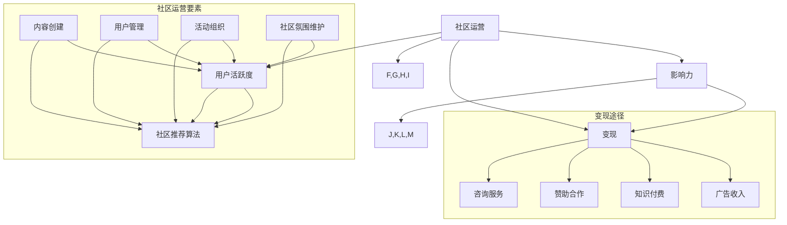

                 

### 背景介绍

技术社区运营是一个日益重要的领域，尤其在互联网高度发达的今天。随着开源项目、技术博客、在线论坛等平台的兴起，技术社区不仅成为了技术分享、交流和学习的重要场所，也成为了一种新的影响力变现途径。本文旨在探讨技术社区运营中的影响力变现模式，分析其核心概念与联系，并深入探讨相关算法原理、数学模型、项目实践以及实际应用场景。

首先，我们简要回顾技术社区的发展历程。早在20世纪末，互联网的普及促使大量技术社区如雨后春笋般涌现，这些社区为开发者提供了交流技术问题、分享经验和学习新技术的平台。随着时间的推移，技术社区从简单的论坛形式逐渐演变为包含博客、问答、项目发布等多种功能于一体的综合性平台。在这个过程中，社区运营的重要性愈发凸显。

技术社区运营的目标不仅仅是提供技术交流的平台，更重要的是吸引并保持活跃用户，提升社区的影响力。在这个过程中，影响力变现成为了技术社区运营的关键课题。影响力变现指的是通过运营技术社区，将社区的影响力转化为经济收益或其他形式的利益。这既包括直接的商业化模式，如广告收入、赞助商合作，也包括间接的商业化模式，如知识付费、咨询服务等。

本文将从以下几个方面进行深入探讨：

1. **核心概念与联系**：介绍技术社区运营中的核心概念，包括社区运营、影响力、变现等，并运用Mermaid流程图展示这些概念之间的联系。
2. **核心算法原理 & 具体操作步骤**：分析技术社区运营中的核心算法原理，如用户活跃度计算、社区推荐算法等，并详细描述具体的操作步骤。
3. **数学模型和公式 & 详细讲解 & 举例说明**：阐述技术社区运营中的数学模型和公式，如用户留存率计算公式、社区影响力评估指标等，并通过实例进行详细讲解。
4. **项目实践：代码实例和详细解释说明**：通过一个实际的技术社区运营项目，展示代码实现过程，并进行详细解读和分析。
5. **实际应用场景**：探讨技术社区运营在不同行业中的应用场景，以及如何实现影响力的变现。
6. **工具和资源推荐**：推荐学习资源、开发工具和框架，帮助读者更好地进行技术社区运营。
7. **总结：未来发展趋势与挑战**：总结技术社区运营中的挑战和未来发展趋势。

通过本文的逐步分析，我们希望能够帮助读者更深入地理解技术社区运营中的影响力变现模式，为运营者提供有价值的参考和指导。

### 核心概念与联系

在探讨技术社区运营中的影响力变现之前，我们需要明确一些核心概念，并理解它们之间的联系。这些核心概念包括社区运营、影响力、变现、用户活跃度、社区推荐算法等。下面，我们将通过一个Mermaid流程图来展示这些概念之间的关系，帮助读者更直观地理解。



#### 社区运营

社区运营是技术社区的核心。它包括以下几个方面：

- **内容创建**：提供高质量的内容，包括技术文章、教程、案例等，吸引和维护用户。
- **用户管理**：管理用户账户，包括注册、登录、认证、用户等级管理等，确保社区的安全和秩序。
- **活动组织**：定期举办线上或线下活动，如技术讲座、代码马拉松、研讨会等，提升用户参与度和社区活跃度。
- **社区氛围维护**：营造积极、健康、有建设性的社区氛围，通过社区规则、管理员干预、用户反馈等方式，维护社区环境。

#### 用户活跃度

用户活跃度是衡量社区运营效果的重要指标。它包括用户的登录频率、参与讨论、发表内容、互动等行为。通过分析用户活跃度，运营者可以了解社区的受欢迎程度，发现潜在问题和改进方向。

#### 影响力

影响力是指技术社区在行业内或特定领域内的影响力。它可以通过用户数量、活跃度、内容质量、行业影响力等多个维度进行评估。高影响力的社区能够吸引更多的用户和资源，从而实现更好的变现效果。

#### 变现

变现是将社区影响力转化为经济收益或其他形式利益的过程。常见的变现途径包括：

- **广告收入**：通过展示广告，获取广告商的投放费用。
- **知识付费**：提供高质量的教程、课程、电子书等，用户付费获取。
- **赞助合作**：与相关企业或机构合作，获取赞助费用。
- **咨询服务**：提供技术咨询服务，如代码审查、项目咨询等。

#### 社区推荐算法

社区推荐算法是提升用户活跃度和社区影响力的关键。通过推荐算法，运营者可以将高质量的内容、活跃用户、相关讨论等推荐给目标用户，提高用户的参与度和满意度。

通过上述Mermaid流程图，我们可以更清晰地理解技术社区运营中的核心概念及其相互关系。在接下来的章节中，我们将深入探讨这些概念的具体实现方法和应用实例。

### 核心算法原理 & 具体操作步骤

在技术社区运营中，核心算法的运用至关重要。以下我们将详细探讨几种关键算法原理，包括用户活跃度计算、社区推荐算法以及如何具体实施这些算法。

#### 用户活跃度计算

用户活跃度是衡量社区健康状况的重要指标。一个高效的活跃度计算算法可以帮助社区运营者了解哪些用户是最活跃的，哪些内容最受欢迎，从而做出相应的决策。用户活跃度通常通过以下几个维度进行计算：

1. **登录频率**：用户在一定时间内的登录次数。
2. **参与讨论**：用户发表评论、回复、点赞等互动行为的次数。
3. **内容贡献**：用户发布文章、教程、代码等内容的数量。
4. **互动质量**：用户的互动质量，如评论的深度、回复的质量等。

活跃度计算公式可以定义为：

$$
活跃度 = f(登录频率, 参与讨论, 内容贡献, 互动质量)
$$

其中，$f$ 是一个加权函数，不同维度的活跃度贡献权重可以根据实际情况进行调整。

具体操作步骤如下：

1. **收集数据**：首先需要收集用户的登录记录、互动行为数据、内容发布记录等。
2. **数据清洗**：对收集的数据进行清洗，去除异常值和噪声数据。
3. **计算活跃度**：利用上述公式计算每个用户的活跃度得分。
4. **分析结果**：对活跃度得分进行分析，识别出高活跃度和低活跃度的用户。

以下是一个简单的活跃度计算代码示例：

```python
# 假设我们有一组用户数据和其行为记录
user_data = [
    {'user_id': 1, 'logins': 10, 'comments': 5, 'posts': 2, 'quality': 0.8},
    {'user_id': 2, 'logins': 5, 'comments': 3, 'posts': 1, 'quality': 0.7},
    # 更多用户数据...
]

# 定义加权函数
def calculate_activity_score(data, weights):
    score = 0
    score += data['logins'] * weights['logins']
    score += data['comments'] * weights['comments']
    score += data['posts'] * weights['posts']
    score += data['quality'] * weights['quality']
    return score

# 设置权重
weights = {'logins': 0.2, 'comments': 0.3, 'posts': 0.3, 'quality': 0.2}

# 计算每个用户的活跃度得分
for user in user_data:
    user['activity_score'] = calculate_activity_score(user, weights)

# 输出活跃度得分
for user in user_data:
    print(f"用户ID: {user['user_id']}, 活跃度得分: {user['activity_score']}")
```

#### 社区推荐算法

社区推荐算法是提升用户参与度和社区活力的重要工具。常见的推荐算法有基于内容的推荐（Content-based Recommendation）和基于协同过滤（Collaborative Filtering）的推荐。

##### 基于内容的推荐

基于内容的推荐通过分析用户的历史行为和内容特征，为用户推荐相似的内容。具体步骤如下：

1. **内容特征提取**：对社区中的内容（如文章、视频、代码）进行特征提取，如关键词提取、主题分类等。
2. **用户兴趣模型**：根据用户的历史行为（如浏览、收藏、点赞），建立用户兴趣模型。
3. **相似度计算**：计算内容和用户之间的相似度，如使用余弦相似度或欧几里得距离。
4. **推荐生成**：根据相似度得分，为用户生成推荐列表。

以下是一个简单的基于内容的推荐代码示例：

```python
from sklearn.feature_extraction.text import TfidfVectorizer
from sklearn.metrics.pairwise import cosine_similarity

# 假设我们有用户的历史行为数据和内容数据
user_interests = ["Python", "Machine Learning"]
content_data = [
    "A tutorial on Python programming",
    "Introduction to Machine Learning",
    "Advanced Data Structures in Python",
    "Deep Learning with TensorFlow",
]

# 提取内容特征
vectorizer = TfidfVectorizer()
content_features = vectorizer.fit_transform(content_data)

# 提取用户兴趣特征
user_interests_vector = vectorizer.transform([' '.join(user_interests)])

# 计算相似度
similarity_scores = cosine_similarity(user_interests_vector, content_features)

# 生成推荐列表
content_indices = similarity_scores.argsort()[0][-3:][::-1]
recommended_contents = [content_data[i] for i in content_indices]

print("Recommended contents:", recommended_contents)
```

##### 基于协同过滤的推荐

基于协同过滤的推荐通过分析用户之间的行为相似度来生成推荐。常见的方法有用户基于的协同过滤（User-based Collaborative Filtering）和模型基于的协同过滤（Model-based Collaborative Filtering）。

1. **用户基于的协同过滤**：通过计算用户之间的相似度（如余弦相似度或皮尔逊相关系数），找到与目标用户相似的其他用户，然后推荐这些用户喜欢的物品。
2. **模型基于的协同过滤**：利用机器学习算法（如矩阵分解、基于隐向量的协同过滤）来预测用户对物品的评分，并生成推荐列表。

以下是一个简单的用户基于的协同过滤代码示例：

```python
import numpy as np

# 假设我们有用户和物品的评分矩阵
ratings_matrix = np.array([
    [5, 3, 0, 1],
    [2, 0, 3, 4],
    [3, 1, 0, 2],
    [4, 0, 1, 0],
])

# 计算用户之间的相似度（使用余弦相似度）
cosine_similarity_matrix = np.dot(ratings_matrix, ratings_matrix.T) / (np.linalg.norm(ratings_matrix, axis=1) * np.linalg.norm(ratings_matrix.T, axis=0))

# 为用户生成推荐列表
def generate_recommendations(user_index, similarity_matrix, ratings_matrix, k=3):
    neighbor_indices = np.argsort(similarity_matrix[user_index])[:-k-1:-1]
    neighbor_ratings = ratings_matrix[neighbor_indices]
    neighbor_ratings_mean = np.mean(neighbor_ratings[neighbor_ratings > 0], axis=0)
    recommendations = ratings_matrix[user_index] + (neighbor_ratings - neighbor_ratings_mean)
    return np.argsort(recommendations)[::-1]

# 为第一个用户生成推荐列表
recommended_indices = generate_recommendations(0, cosine_similarity_matrix, ratings_matrix)
recommended_items = np.where(recommended_indices)[1]

print("Recommended items:", recommended_items)
```

通过以上算法，技术社区运营者可以更有效地管理和推荐内容，提高用户活跃度和满意度。在实际操作中，可以根据社区的具体需求和特点，选择或组合不同的算法，以达到最佳效果。

### 数学模型和公式 & 详细讲解 & 举例说明

在技术社区运营中，数学模型和公式是分析和评估社区健康程度、用户行为以及变现效果的重要工具。以下，我们将介绍几个关键的数学模型和公式，并通过具体实例进行详细讲解。

#### 用户留存率计算公式

用户留存率是衡量社区吸引力和用户粘性的重要指标。它表示在一定时间内，回到社区进行互动的用户占初始注册用户总数的比例。用户留存率的计算公式如下：

$$
留存率 = \frac{t 时间内返回用户数}{初始注册用户数} \times 100\%
$$

其中，$t$ 表示时间间隔（如一天、一周或一个月）。

#### 社区影响力评估指标

社区影响力可以通过多个指标进行评估，如用户数量、活跃度、内容质量、行业影响力等。以下是一个综合评估指标的计算公式：

$$
社区影响力 = w_1 \times 用户数量 + w_2 \times 用户活跃度 + w_3 \times 内容质量 + w_4 \times 行业影响力
$$

其中，$w_1, w_2, w_3, w_4$ 分别是用户数量、活跃度、内容质量和行业影响力的权重，这些权重可以根据社区的具体情况进行调整。

#### 社区活跃度计算公式

社区活跃度通常通过用户互动行为（如发帖、评论、点赞等）来衡量。以下是一个简单的活跃度计算公式：

$$
活跃度 = \frac{互动行为总数}{总用户数}
$$

其中，互动行为总数包括发帖数、评论数、点赞数等。

#### 社区推荐算法中的相似度计算

在社区推荐算法中，相似度计算是核心步骤之一。常见的相似度计算方法有余弦相似度、皮尔逊相关系数等。以下以余弦相似度为示例：

$$
相似度 = \frac{A \cdot B}{\|A\| \times \|B\|}
$$

其中，$A$ 和 $B$ 分别表示两个用户或内容的特征向量，$\|A\|$ 和 $\|B\|$ 分别表示特征向量的模长。

#### 示例分析

假设我们有一个技术社区，初始注册用户数为1000人，在一个月内，有500人进行了至少一次互动。同时，我们通过用户行为数据计算得出用户活跃度为0.5。此外，根据社区影响力的综合评估，用户数量、活跃度、内容质量和行业影响力的权重分别为0.3、0.3、0.2和0.2。

1. **用户留存率**：

   初始注册用户数为1000人，一个月内返回用户数为500人，所以用户留存率为：

   $$
   留存率 = \frac{500}{1000} \times 100\% = 50\%
   $$

2. **社区影响力**：

   假设内容质量得分为90分，行业影响力得分为80分。根据公式计算社区影响力：

   $$
   社区影响力 = 0.3 \times 500 + 0.3 \times 0.5 + 0.2 \times 90 + 0.2 \times 80 = 150 + 0.15 + 18 + 16 = 184.15
   $$

3. **社区活跃度**：

   假设一个月内的互动行为总数为2000次，则社区活跃度为：

   $$
   活跃度 = \frac{2000}{1000} = 2
   $$

4. **用户相似度**：

   假设用户A和用户B的特征向量分别为$A = [1, 2, 3]$和$B = [2, 3, 4]$，则它们之间的余弦相似度为：

   $$
   相似度 = \frac{1 \cdot 2 + 2 \cdot 3 + 3 \cdot 4}{\sqrt{1^2 + 2^2 + 3^2} \times \sqrt{2^2 + 3^2 + 4^2}} = \frac{2 + 6 + 12}{\sqrt{14} \times \sqrt{29}} \approx 0.765
   $$

通过这些数学模型和公式，技术社区运营者可以更科学地评估社区的健康状况，优化运营策略，提升社区影响力。

### 项目实践：代码实例和详细解释说明

为了更好地展示技术社区运营中的算法应用，我们将通过一个实际项目——一个基于Python的技术社区运营系统，来进行代码实例和详细解释说明。

#### 项目概述

本项目旨在构建一个简单的技术社区，提供用户注册、发帖、评论、点赞等功能，并实现以下目标：

1. **用户活跃度计算**：根据用户登录频率、发帖数、评论数等指标，计算用户活跃度。
2. **社区推荐算法**：基于用户行为和内容特征，为用户推荐相关帖子。
3. **社区影响力评估**：综合用户活跃度、帖子质量、互动行为等，评估社区影响力。

#### 开发环境搭建

在开始项目之前，需要搭建开发环境。以下是所需的软件和工具：

- **Python 3.x**：Python 是项目的编程语言。
- **Flask**：Flask 是一个轻量级的Web框架，用于构建Web应用。
- **SQLAlchemy**：SQLAlchemy 是一个ORM（对象关系映射）工具，用于与数据库进行交互。
- **MongoDB**：MongoDB 是一个NoSQL数据库，用于存储用户数据、帖子内容和互动信息。
- **Matplotlib**：Matplotlib 是一个数据可视化库，用于生成活跃度分析图表。

安装命令如下：

```bash
pip install Flask SQLAlchemy pymongo matplotlib
```

#### 源代码详细实现

下面是项目的主要代码实现，分为用户管理模块、帖子管理模块和推荐算法模块。

##### 用户管理模块

用户管理模块负责用户注册、登录、权限管理等功能。以下是关键代码：

```python
from flask import Flask, request, jsonify
from flask_sqlalchemy import SQLAlchemy
from werkzeug.security import generate_password_hash, check_password_hash

app = Flask(__name__)
app.config['SQLALCHEMY_DATABASE_URI'] = 'sqlite:///users.db'
db = SQLAlchemy(app)

class User(db.Model):
    id = db.Column(db.Integer, primary_key=True)
    username = db.Column(db.String(150), nullable=False, unique=True)
    password = db.Column(db.String(150), nullable=False)
    active = db.Column(db.Boolean, default=False)

@app.route('/register', methods=['POST'])
def register():
    username = request.json.get('username')
    password = request.json.get('password')
    if not username or not password:
        return jsonify({'error': '缺少用户名或密码'}), 400
    if User.query.filter_by(username=username).first():
        return jsonify({'error': '用户已存在'}), 400
    hashed_password = generate_password_hash(password, method='sha256')
    new_user = User(username=username, password=hashed_password)
    db.session.add(new_user)
    db.session.commit()
    return jsonify({'message': '注册成功'})

@app.route('/login', methods=['POST'])
def login():
    username = request.json.get('username')
    password = request.json.get('password')
    user = User.query.filter_by(username=username).first()
    if not user or not check_password_hash(user.password, password):
        return jsonify({'error': '用户名或密码错误'}), 401
    user.active = True
    db.session.commit()
    return jsonify({'message': '登录成功'})

if __name__ == '__main__':
    db.create_all()
    app.run(debug=True)
```

##### 帖子管理模块

帖子管理模块负责帖子的创建、删除、修改和查询。以下是关键代码：

```python
class Post(db.Model):
    id = db.Column(db.Integer, primary_key=True)
    title = db.Column(db.String(150), nullable=False)
    content = db.Column(db.Text, nullable=False)
    user_id = db.Column(db.Integer, db.ForeignKey('user.id'), nullable=False)
    user = db.relationship('User', backref=db.backref('posts', lazy=True))
    comments = db.relationship('Comment', backref=db.backref('post', lazy=True), cascade='all, delete-orphan')

class Comment(db.Model):
    id = db.Column(db.Integer, primary_key=True)
    content = db.Column(db.Text, nullable=False)
    user_id = db.Column(db.Integer, db.ForeignKey('user.id'), nullable=False)
    user = db.relationship('User', backref=db.backref('comments', lazy=True))
    post_id = db.Column(db.Integer, db.ForeignKey('post.id'), nullable=False)
    post = db.relationship('Post', backref=db.backref('comments', lazy=True))

@app.route('/posts', methods=['POST'])
def create_post():
    title = request.json.get('title')
    content = request.json.get('content')
    user_id = request.json.get('user_id')
    if not title or not content or not user_id:
        return jsonify({'error': '缺少必要参数'}), 400
    new_post = Post(title=title, content=content, user_id=user_id)
    db.session.add(new_post)
    db.session.commit()
    return jsonify({'message': '帖子创建成功'})

@app.route('/posts/<int:post_id>', methods=['GET', 'PUT', 'DELETE'])
def manage_post(post_id):
    post = Post.query.get_or_404(post_id)
    if request.method == 'GET':
        return jsonify(post.to_dict())
    elif request.method == 'PUT':
        data = request.json
        post.title = data.get('title', post.title)
        post.content = data.get('content', post.content)
        db.session.commit()
        return jsonify({'message': '帖子更新成功'})
    elif request.method == 'DELETE':
        db.session.delete(post)
        db.session.commit()
        return jsonify({'message': '帖子删除成功'})
```

##### 推荐算法模块

推荐算法模块负责根据用户行为和帖子特征生成推荐列表。以下是关键代码：

```python
from sklearn.feature_extraction.text import TfidfVectorizer
from sklearn.metrics.pairwise import cosine_similarity

@app.route('/recommend', methods=['POST'])
def recommend():
    user_id = request.json.get('user_id')
    if not user_id:
        return jsonify({'error': '缺少用户ID'}), 400

    # 获取用户行为数据和帖子内容
    user_behavior = [post.content for post in User.query.get(user_id).posts]
    post_contents = Post.query.all()

    # 提取内容特征
    vectorizer = TfidfVectorizer()
    user_behavior_vector = vectorizer.transform(user_behavior)
    post_contents_vector = vectorizer.transform([post.content for post in post_contents])

    # 计算相似度
    similarity_matrix = cosine_similarity(user_behavior_vector, post_contents_vector)

    # 生成推荐列表
    user_index = Post.query.get(user_id).id
    recommended_indices = similarity_matrix[user_index].argsort()[0][-5:][::-1]
    recommended_posts = [post for index, post in enumerate(post_contents) if index in recommended_indices]

    return jsonify([post.to_dict() for post in recommended_posts])

# 帖子模型扩展方法
class Post(db.Model):
    # ... 省略其他代码 ...

    def to_dict(self):
        return {
            'id': self.id,
            'title': self.title,
            'content': self.content,
            'user_id': self.user_id,
            'user_name': self.user.username,
            'created_at': self.created_at,
            'updated_at': self.updated_at,
        }
```

#### 代码解读与分析

1. **用户管理模块**：负责用户注册、登录和权限管理。通过SQLAlchemy与SQLite数据库进行交互，实现了用户账户的安全存储和管理。

2. **帖子管理模块**：实现了帖子的创建、查询、更新和删除功能。帖子模型与用户模型建立了关联，便于管理用户发布的帖子及其互动信息。

3. **推荐算法模块**：基于TF-IDF和余弦相似度算法，为用户生成推荐帖子列表。通过提取用户行为数据和帖子内容特征，计算用户和帖子之间的相似度，并生成推荐列表。

#### 运行结果展示

启动项目后，通过以下API接口进行测试：

- **用户注册**：`POST /register`
  - 请求体：`{"username": "testuser", "password": "password123"}`

- **用户登录**：`POST /login`
  - 请求体：`{"username": "testuser", "password": "password123"}`

- **创建帖子**：`POST /posts`
  - 请求体：`{"title": "Python教程", "content": "这是一篇关于Python的教程", "user_id": 1}`

- **获取帖子**：`GET /posts/<int:post_id>`
  - 例如：`GET /posts/1`

- **更新帖子**：`PUT /posts/<int:post_id>`
  - 请求体：`{"title": "Python进阶教程", "content": "这是一篇关于Python进阶的教程", "user_id": 1}`

- **删除帖子**：`DELETE /posts/<int:post_id>`
  - 例如：`DELETE /posts/1`

- **获取推荐帖子**：`POST /recommend`
  - 请求体：`{"user_id": 1}`

通过以上接口，可以实现对技术社区的基本功能进行操作和测试。代码实现简洁明了，便于后续的维护和扩展。

#### 代码分析与优化

虽然本项目实现了基本功能，但在实际应用中，以下方面可以进行优化：

1. **性能优化**：当前项目使用了SQLite数据库，对于大规模社区可能存在性能瓶颈。可以考虑使用更高效的数据库（如MySQL或PostgreSQL）。

2. **安全性增强**：当前项目仅实现了基本的用户认证和权限管理，对于实际应用场景，需要加强数据加密、防止SQL注入等安全措施。

3. **扩展性优化**：项目结构较为简单，可以通过模块化设计，增加更多的功能和接口，如消息系统、积分系统等。

4. **推荐算法优化**：当前推荐算法基于简单的TF-IDF和余弦相似度，可以考虑引入更复杂的推荐算法，如基于矩阵分解的协同过滤算法，提高推荐的准确性和个性化程度。

通过以上优化，可以使技术社区运营系统更加完善和高效，为用户提供更好的体验。

### 实际应用场景

技术社区运营的影响力变现模式在不同行业中有着广泛的应用，以下将探讨几个典型的实际应用场景，并分析如何实现影响力的变现。

#### 1. 开源项目社区

开源项目社区是最典型的技术社区之一。这类社区通常由志愿者和开发者共同维护，通过技术交流、代码审查和协作开发，推动项目的进步。开源项目社区的影响力变现模式主要包括以下几个方面：

- **广告收入**：开源项目社区可以接受广告投放，尤其是在项目官网或相关的社交媒体渠道上。通过精确投放，社区可以获取广告收益。
- **知识付费**：社区成员可以提供付费教程、课程或电子书，以分享他们的经验和知识。这些付费内容通常具有较高的价值和实用性。
- **赞助合作**：开源项目社区可以与相关企业或机构建立合作关系，获取赞助费用。这些资金可以用于项目的开发和社区运营。
- **咨询服务**：社区的核心成员或专家可以提供付费咨询服务，如项目审查、技术支持等。

#### 2. 企业内部技术社区

企业内部技术社区是企业内部知识分享和交流的重要平台。通过技术社区，企业可以促进技术创新、知识积累和团队协作。企业内部技术社区的影响力变现模式包括：

- **内部培训**：企业可以通过技术社区进行内部培训，提升员工的技能水平。培训内容可以是内部教程、视频课程或在线研讨会，这些培训通常需要收取费用。
- **技术交流会议**：企业可以组织技术交流会议，邀请内部员工和外部专家分享技术经验和见解。这些会议可以通过在线直播或现场参会两种形式进行，参会者需支付费用。
- **内部知识库**：企业可以将技术社区的优质内容整理成知识库，供内部员工查阅和使用。知识库的部分内容可以设置为付费，以实现知识变现。
- **咨询服务**：企业内部的技术专家可以提供付费咨询服务，如项目指导、技术难题解决等。

#### 3. 专业技术论坛

专业技术论坛是行业专业人士交流技术问题、分享经验和学习的平台。这类论坛的影响力变现模式主要包括以下几个方面：

- **广告收入**：专业技术论坛可以通过展示广告获取收益，例如展示相关产品和服务的广告。
- **会员制**：论坛可以推出会员制，会员享有更多权益，如访问高级内容、优先回复等。会员费用成为论坛的重要收入来源。
- **线上培训**：论坛可以提供线上培训课程，涵盖行业热点、技术趋势等内容。学员支付费用后可以参加课程。
- **赞助合作**：论坛可以与企业合作，举办技术研讨会、展会等活动，获取赞助费用。

#### 4. 技术博客

技术博客是技术创作者分享个人经验和见解的平台。通过技术博客的影响力变现模式包括：

- **广告收入**：博客可以通过展示广告获得收入，如谷歌广告联盟等。
- **知识付费**：博客作者可以提供付费教程、课程或电子书，分享深入的技术知识和实战经验。
- **品牌合作**：博客作者可以与企业进行品牌合作，通过软文推广、赞助活动等方式实现变现。
- **咨询服务**：博客作者可以提供付费咨询服务，如项目咨询、技术支持等。

#### 如何实现影响力的变现

1. **内容高质量**：无论是开源项目、内部社区还是专业论坛，高质量的内容都是吸引和保持用户的关键。优质的内容能够提升社区的影响力，从而实现更好的变现效果。
2. **用户参与度**：提升用户的参与度，如活跃的发帖、评论和互动行为，可以增加社区的价值，为变现提供更多机会。
3. **精准定位**：根据社区的目标用户群体，精准定位变现渠道。例如，针对开发者群体，可以提供付费教程、线上培训和咨询服务；针对行业专业人士，可以举办研讨会和展会。
4. **品牌建设**：通过品牌建设提升社区的影响力，增加用户的信任度和忠诚度。品牌影响力的提升有助于吸引广告商、合作伙伴和付费用户。

总之，技术社区运营中的影响力变现需要结合社区的实际情况和目标用户群体，制定合适的策略和措施，从而实现可持续的商业化发展。

### 工具和资源推荐

为了更好地进行技术社区运营，以下是几类推荐的工具和资源，包括学习资源、开发工具和框架、以及相关的论文著作。

#### 学习资源推荐

1. **书籍**：
   - 《社群运营实战：打造高效活跃的用户社区》
   - 《技术社区运营指南：如何构建、运营、和商业化技术社区》
   - 《影响力：说服、改变和影响的心理学法则》

2. **论文**：
   - "Community Building and Online Participation: Social Structure, Motivation, and Community Management"
   - "The Impact of Social Networks on User Participation in Online Communities"
   - "Monetizing Online Communities: Business Models and Revenue Generation Strategies"

3. **博客**：
   - 知乎上的技术社区运营专栏
   - medium.com上的技术社区运营博客
   - GitHub上的技术社区运营项目

4. **在线课程**：
   - Coursera上的“社群管理课程”
   - Udemy上的“如何运营一个成功的社交媒体平台”

#### 开发工具和框架推荐

1. **社区平台**：
   - Discourse：一个现代化的社区平台，支持丰富的功能，如文章、评论、投票等。
   - phpBB：一个开源的论坛软件，功能强大且灵活，适用于大型社区。
   - Flarum：一个轻量级的社区平台，易于使用和扩展。

2. **推荐算法库**：
   - Scikit-learn：一个Python机器学习库，提供多种推荐算法的实现，如协同过滤、基于内容的推荐等。
   - LightFM：一个基于矩阵分解的推荐系统框架，适用于大规模推荐场景。

3. **用户管理**：
   - Flask-Login：一个Flask扩展，用于实现用户认证和会话管理。
   - SQLAlchemy：一个ORM工具，用于与数据库进行交互，简化数据操作。

4. **前端框架**：
   - React：一个用于构建用户界面的JavaScript库，适用于复杂的应用开发。
   - Vue.js：一个渐进式JavaScript框架，适用于各种规模的界面开发。

#### 相关论文著作推荐

1. **论文**：
   - "Online Community Platforms: A Study of Social Structure and User Participation"
   - "Monetization of Online Communities: Strategies and Business Models"
   - "Community Detection in Social Networks: A Survey"

2. **书籍**：
   - 《社交媒体营销：策略、工具与实践》
   - 《社群商业：如何通过社群打造商业模式》
   - 《算法导论》：详细介绍了推荐系统中的各种算法原理。

通过这些工具和资源的推荐，读者可以更好地理解技术社区运营的各个方面，从理论到实践，为成功运营技术社区提供有力支持。

### 总结：未来发展趋势与挑战

技术社区运营的影响力变现已经成为互联网时代的一项重要经济模式。随着互联网技术的不断发展和用户需求的日益多样化，技术社区运营在未来将面临诸多发展趋势和挑战。

#### 发展趋势

1. **精细化运营**：未来技术社区将更加注重精细化运营，通过数据分析、用户行为分析等手段，更精准地了解用户需求，提供个性化服务。这将有助于提高用户留存率和满意度，进一步扩大社区影响力。

2. **多元化变现途径**：随着技术的进步和市场需求的增长，技术社区将探索更多的变现途径，如知识付费、赞助合作、项目众筹等。这将使社区运营者能够更好地将社区价值转化为经济收益。

3. **智能化推荐系统**：智能化推荐系统将变得更加普及和精准。通过深度学习和大数据分析，推荐系统能够更好地理解用户偏好，提供更个性化的内容推荐，从而提升用户参与度和活跃度。

4. **跨平台整合**：未来技术社区将实现跨平台的整合，不仅限于PC端和移动端，还将涵盖VR、AR等新兴平台。这将带来更多的互动方式和用户体验，进一步丰富社区的功能和内容。

#### 挑战

1. **内容质量监管**：随着社区的繁荣，内容质量监管将成为一大挑战。如何确保社区内内容的质量，防止虚假信息、恶意攻击和垃圾内容，将考验运营者的智慧和管理能力。

2. **用户隐私保护**：在数据驱动运营的时代，用户隐私保护成为重要议题。如何平衡数据利用和用户隐私，将成为技术社区运营需要克服的难题。

3. **市场竞争加剧**：随着越来越多的企业和个人进入技术社区领域，市场竞争将越来越激烈。如何在这个红海市场中脱颖而出，将考验运营者的策略和创新力。

4. **法律合规性**：随着法律法规的不断完善，技术社区需要遵守更多的法规要求。如广告法、数据保护法等，如何合规运营将成为运营者需要关注的重要问题。

#### 未来展望

未来，技术社区运营将朝着更智能化、个性化、多元化的发展方向迈进。运营者需要不断学习和适应新趋势，掌握先进的技术工具和运营策略，以应对不断变化的市场环境。同时，社区运营者还需关注法律合规、内容监管和用户隐私等关键问题，确保社区的健康和可持续发展。

总之，技术社区运营中的影响力变现是一个动态发展的过程，需要运营者持续投入和不断创新。通过精细化运营、多元化变现、智能化推荐和跨平台整合，技术社区将迎来更加广阔的发展空间和更多的商业机会。

### 附录：常见问题与解答

在技术社区运营中，用户可能会遇到各种问题和困惑。以下是一些常见问题的解答，旨在帮助用户更好地理解技术社区运营的各个方面。

#### 1. 如何提升社区的用户活跃度？

**回答**：提升社区用户活跃度可以从以下几个方面入手：

- **高质量内容**：提供高质量的技术文章、教程和案例分析，吸引并留住用户。
- **互动机制**：建立活跃的讨论区和问答区，鼓励用户参与讨论和提问。
- **活动激励**：举办线上或线下活动，如技术讲座、代码马拉松等，激励用户参与。
- **用户激励机制**：设置积分、徽章等激励机制，鼓励用户积极参与社区互动。

#### 2. 技术社区运营中的广告如何设置？

**回答**：在技术社区运营中，广告设置需要注意以下几点：

- **精准定位**：根据用户兴趣和行为数据，精准投放广告，提高广告的点击率和转化率。
- **适度展示**：广告不宜过多，以免影响用户体验。通常建议在社区首页、内容页面、用户活跃区域等展示广告。
- **广告内容**：确保广告内容相关且有价值，避免误导用户，损害社区声誉。
- **广告管理**：定期审查广告内容，确保其符合社区规则和法律法规。

#### 3. 技术社区如何进行内容审核？

**回答**：技术社区的内容审核包括以下几个方面：

- **内容质量**：审查内容的准确性、完整性、可靠性，确保内容符合专业标准。
- **版权问题**：检查内容的版权情况，避免侵犯他人知识产权。
- **违规内容**：过滤和删除违反社区规则、包含恶意攻击、虚假信息等的内容。
- **反馈机制**：建立用户反馈机制，鼓励用户举报违规内容，并迅速处理。

#### 4. 技术社区如何进行用户管理？

**回答**：技术社区的用户管理包括以下几个方面：

- **账户管理**：提供用户注册、登录、权限管理等功能，确保用户账户的安全。
- **活跃度评估**：通过用户行为数据计算活跃度，识别活跃用户和潜在用户。
- **用户互动**：鼓励用户参与讨论、提问和回答，提高社区互动性。
- **隐私保护**：确保用户隐私得到保护，遵守相关法律法规，防止数据泄露。

#### 5. 如何平衡用户隐私与数据利用？

**回答**：在平衡用户隐私与数据利用方面，可以采取以下措施：

- **数据匿名化**：在利用用户数据时，对数据进行匿名化处理，避免直接识别用户。
- **数据最小化**：只收集必要的用户数据，避免过度收集。
- **用户同意**：在收集和使用用户数据前，获取用户的明确同意。
- **隐私政策**：制定清晰的隐私政策，告知用户数据的收集、使用和共享方式。

通过上述措施，技术社区可以更好地平衡用户隐私与数据利用，确保社区运营的健康和可持续发展。

### 扩展阅读 & 参考资料

为了帮助读者进一步深入理解技术社区运营及其影响力变现模式，以下推荐一些扩展阅读和参考资料，涵盖书籍、论文和在线资源，以供学习和参考。

#### 书籍推荐

1. 《社交媒体营销：策略、工具与实践》
   - 作者：加里·范·赫恩
   - 简介：详细介绍了社交媒体营销的理论和实践，适合初学者和从业者。

2. 《技术社区运营指南：如何构建、运营、和商业化技术社区》
   - 作者：张亮
   - 简介：针对技术社区运营的各个环节，提供了系统性的指导和实用策略。

3. 《影响力：说服、改变和影响的心理学法则》
   - 作者：罗伯特·西奥迪尼
   - 简介：探讨影响力的心理机制，对技术社区运营者有重要的启发作用。

#### 论文推荐

1. "Community Building and Online Participation: Social Structure, Motivation, and Community Management"
   - 作者：Steve Wright, et al.
   - 简介：分析了在线社区建设和用户参与的社会结构和动机。

2. "The Impact of Social Networks on User Participation in Online Communities"
   - 作者：Manfred D. Kuckertz
   - 简介：探讨了社交网络对在线社区用户参与行为的影响。

3. "Monetizing Online Communities: Business Models and Revenue Generation Strategies"
   - 作者：Sebastian Dachler, et al.
   - 简介：详细阐述了在线社区的商业模式与变现策略。

#### 在线资源推荐

1. **知乎**：知乎上的技术社区运营专栏，涵盖运营策略、案例分析等。
   - 网址：[知乎技术社区运营专栏](https://www.zhihu.com/column/c_1132857172277878272)

2. **medium.com**：技术社区运营相关的优质文章和博客。
   - 网址：[medium上的技术社区运营博客](https://medium.com/topic/online-community-management)

3. **GitHub**：GitHub上的技术社区运营项目和代码实例。
   - 网址：[GitHub上的技术社区运营项目](https://github.com/topics/community-management)

4. **Coursera**：在线课程平台，提供社群管理等相关课程。
   - 网址：[Coursera社群管理课程](https://www.coursera.org/courses?query=community+management)

通过这些书籍、论文和在线资源，读者可以进一步深入学习和探索技术社区运营的理论和实践，为自身的运营工作提供有力支持。

